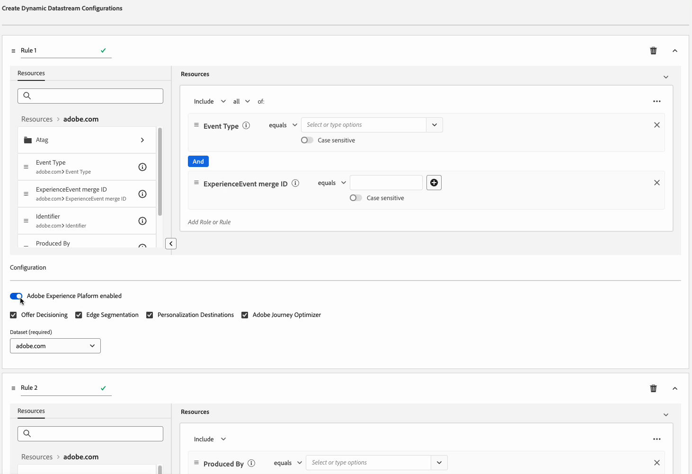
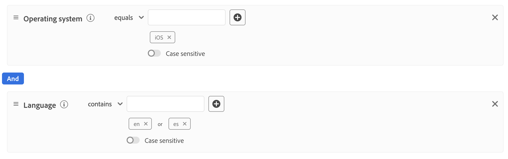

# Skapa dynamiska dataströmskonfigurationer

>[!AVAILABILITY]
>
>* Alternativet att definiera dynamiska datastream-konfigurationer finns för närvarande i Beta och är tillgängligt för ett begränsat antal kunder. Kontakta din Adobe-representant om du vill få tillgång till den här funktionen. Dokumentationen och funktionaliteten kan komma att ändras.

Som standard skickar Experience Platform Edge Network alla händelser som når en datastream till alla Experience Cloud [tjänster](configure.md#add-services) som du har aktiverat för dina datastreams. Det här kanske inte alltid är det perfekta arbetsflödet för dig, beroende på hur du använder det.

Dynamiska datastream-konfigurationer åtgärdar detta genom användarkonfigurerbara regeluppsättningar som du definierar för varje tjänst som är aktiverad för din datastream, som anger vilken Experience Cloud-lösning som ska ta emot varje typ av data.

## Förhandskrav {#prerequisites}

Om du vill skapa en dynamisk konfiguration för din datastream måste du uppfylla två villkor:

* Du måste ha skapat *minst* ett datastream att arbeta med. Mer information finns i dokumentationen om hur du [skapar ett datastream](configure.md).
* Du måste ha *minst* Experience Cloud-tjänst tillagd i ditt datastream. Mer information finns i dokumentationen om hur du [lägger till en tjänst](configure.md#add-services) i ett datastream.

När du har skapat ett datastam och lagt till en Experience Cloud-tjänst kan du [skapa en dynamisk konfiguration](#create-dynamic-configuration).

## Guardrails {#guardrails}

Dynamiska datastream-konfigurationer har specifika gränser och prestandabegränsningar för att säkerställa optimala systemprestanda och effektiv databehandling. Följande skyddsutkast gäller när dynamiska datastream-regler konfigureras:

| Guardrail | Gräns | Begränsningstyp |
|---------|------------|------|
| Maximalt antal dynamiska datastream-konfigurationer per datastream för Experience Platform-tjänster | 5 | Prestandaskydd |
| Maximalt antal dynamiska datastream-konfigurationer per datastream för Adobe Analytics | 5 | Prestandaskydd |
| Maximalt antal dynamiska datastream-konfigurationer per datastream för Adobe Target | 5 | Prestandaskydd |
| Maximalt antal dynamiska datastream-konfigurationer per datastream för Adobe Audience Manager | 5 | Prestandaskydd |
| Maximalt antal villkor (prediktiv) som du kan kombinera i en enskild regel | 100 | Prestandaskydd |
| Maximal tid som tillåts för utvärdering av alla dynamiska datastream-konfigurationer per datastream före timeout | 25 ms | Systemstyrt skyddsräcke |

## Dynamiska datastream-konfigurationer kontra åsidosättningar av datastream-konfigurationer {#dynamic-versus-overrides}

Dynamiska datastream-konfigurationer och [datastream-konfigurationsåsidosättningar](overrides.md) är funktioner som utesluter varandra.

Det innebär att du inte kan använda dynamiska datastream-konfigurationer tillsammans med åsidosättningar av datastream-konfigurationer. Du måste välja det ena eller det andra.

Om du aktiverar både dynamiska datastream-konfigurationer och åsidosättningar av datastream-konfigurationer får konfigurationsåsidosättningarna företräde och de dynamiska datastream-konfigurationsreglerna ignoreras.

## Skapa en dynamisk datastream-konfiguration {#create-dynamic-configuration}

När du har [skapat en datastream](configure.md) och [lagt till en tjänst](configure.md#add-services) i den följer du stegen nedan för att lägga till en dynamisk konfiguration till tjänsten.

1. Gå till sidan **[!UICONTROL Data Collection]** > **[!UICONTROL Datastreams]** och markera datastream som du skapade.

   

1. Välj alternativet **[!UICONTROL Edit]** för den tjänst som du vill definiera en dynamisk konfiguration för.

   

1. Välj **[!UICONTROL Save and Edit Dynamic Configuration]** på sidan **[!UICONTROL Configure]**.

   

1. Välj **[!UICONTROL Add Dynamic Configuration]**.

   

1. Dra och släpp de objekt du vill skapa regeln med på den högra sidan av fönstret från panelen **[!UICONTROL Resources]**. Du kan kombinera flera resurser för att skapa komplexa regler.

   Använd alternativen för varje resurs, till exempel **[!UICONTROL equals]**, **[!UICONTROL does not equal]**, **[!UICONTROL exists]** och mer, för att finjustera reglerna.

   

1. I avsnittet **[!UICONTROL Configuration]** växlar du de tjänster som du vill aktivera eller inaktivera för varje regel, beroende på om du vill att data ska skickas till varje tjänst. Om du stänger av omkopplaren inaktiveras tjänstens routning och *inga data* skickas till den överordnade tjänsten.

   

1. När du är klar med konfigurationen av reglerna väljer du **[!UICONTROL Save]**.

## Regelprioritet {#considerations}

Du kan definiera flera regler för varje dynamisk datastream-konfiguration. Om dina data matchar villkoren för flera regler beaktas endast den första matchande regeln i listan och alla andra matchande regler ignoreras.

Om du vill uppnå det önskade datahanteringsbeteendet bör du vara uppmärksam på i vilken ordning du ordnar reglerna.

Om du vill konfigurera regelordningen kan du dra och släppa regelfönstren i önskad ordning.

## Villkor för regelberättigande {#eligibility-criteria}

Dynamiska datastream-konfigurationer måste uppfylla specifika behörighetskriterier för att säkerställa höga prestanda, underhållbarhet och tydlighet. Nedan beskrivs de viktigaste kraven och bästa metoderna för att definiera regler.

### Datatyper som stöds {#supported-data-types}

Dynamiska konfigurationsregler för datastream fungerar med specifika datatyper för att säkerställa optimala prestanda och tillförlitlig dataroutning. Genom att förstå vilka datatyper som stöds kan du skapa effektiva regler som bearbetar dina data effektivt.

| Datatyp | Status | Anteckningar |
|-----------|--------|-------|
| Sträng | Tillåtet | – |
| Tal (heltal, lång, kort, byte) | Tillåtet | – |
| Enum | Tillåtet | – |
| Boolean | Tillåtet | – |
| Datum | Tillåtet | – |
| Array | Ej tillåtet | Regler som baseras på arrayer stöds inte eftersom de kan försämra prestanda. |
| Karta | Ej tillåtet | Regler som baseras på kartor stöds inte eftersom de kan försämra prestanda. |

### Operatorer som stöds {#supported-operators}

Regler kan använda följande operatorer, beroende på datatypen:

| Datatyp | Operatorer som stöds |
|-----------|-------------------|
| **Sträng** | `equals`, `starts with`, `ends with`, `contains`, `exists`, `does not equal`, `does not start with`, `does not end with`, `does not contain`, `does not exist` |
| **Number (long, integer, Short, Byte)** | `equals`, `does not equal`, `greater than`, `less than`, `greater than or equal to`, `less than or equal to`, `exists`, `does not exist` |
| **Boolean** | `equals true/false`, `does not equal true/false` |
| **Uppräkning** | `equals`, `does not equal`, `exists`, `does not exist` |
| **Datum** | `today`, `yesterday`, `this month`, `this year`, `custom date`, `in last`, `from`, `during`, `within`, `before`, `after`, `rolling range`, `in next`, `exists`, `does not exist` |
| **Logisk** | `INCLUDE`, `ANY/ALL` (motsvarar AND/OR) |

>[!NOTE]
>
>Operatorn **[!UICONTROL EXCLUDE]** stöds inte direkt, men du kan uppnå motsvarande logik med hjälp av **[!UICONTROL INCLUDE]** med negativa jämförelseoperatorer (t.ex. &quot;motsvarar inte&quot;).

### Regelstruktur {#rule-structure}

När du skapar regler för dynamiska datastream-konfigurationer är det viktigt att förstå de strukturella krav som säkerställer optimala prestanda och systemkompatibilitet. Regelstrukturen påverkar direkt hur effektivt dina data behandlas och slussas genom systemet.

**Använd endast platta uttryck**. Du måste definiera regler som platta logiska uttryck. Kapslade logiska uttryck (med behållare eller flera nivåer av AND/OR) stöds inte. Om du behöver komplex logik kan du dela upp den i flera platta regler.

Ta till exempel den komplexa regel som visas i bilden nedan.

Du kan bryta ned den här regeln i följande enkla regler:

**Undvik komplexa regler**. Enklare regler ger snabbare utvärdering och bättre underhåll.

### Bästa praxis {#best-practices}

Följ vedertagna standarder när du skapar dynamiska konfigurationsregler för datastam för att säkerställa optimala prestanda, systemtillförlitlighet och underhållningsbara konfigurationer. Dessa riktlinjer hjälper er att undvika vanliga fallgropar och skapa effektiva regler som fungerar smidigt med plattformens arkitektur.

* **Behåll reglerna enkla och platta.** Använd flera regler i stället för kapsling om du behöver uttrycka komplex logik.
* **Använd bara [datatyper som stöds](#supported-data-types) och [operatorer](#supported-operators).**
* **Testa dina regler för prestanda.** För komplexa regler eller regler som inte stöds kan få systemet att avvisa dem eller påverka systemets prestanda.

