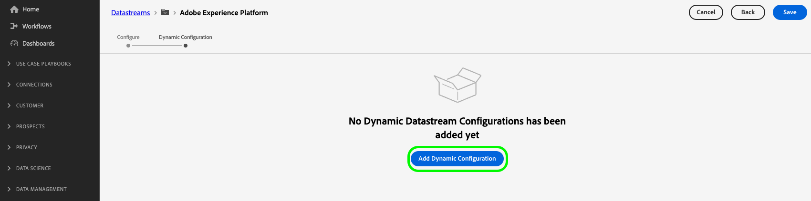

# Skapa dynamiska dataströmskonfigurationer

>[!AVAILABILITY]
>
>* Alternativet att definiera dynamiska datastream-konfigurationer finns för närvarande i Beta och är tillgängligt för ett begränsat antal kunder. Kontakta din Adobe-representant om du vill få tillgång till den här funktionen. Dokumentationen och funktionaliteten kan komma att ändras.

Som standard skickar Experience Platform Edge Network alla händelser som når ett datastream till alla [tjänster](configure.md#add-services) i Experience Cloud som du har aktiverat för datastreams. Det här kanske inte alltid är det perfekta arbetsflödet för dig, beroende på hur du använder det.

Dynamiska datastream-konfigurationer åtgärdar detta genom användarkonfigurerbara regeluppsättningar som du definierar för varje tjänst som är aktiverad för din datastream, som anger vilken Experience Cloud-lösning som ska ta emot varje datatyp.

## Förhandskrav {#prerequisites}

Om du vill skapa en dynamisk konfiguration för din datastream måste du uppfylla två villkor:

* Du måste ha skapat *minst* ett datastream att arbeta med. Mer information finns i dokumentationen om hur du [skapar ett datastream](configure.md).
* Du måste ha *minst* Experience Cloud-tjänst tillagd i ditt datastream. Mer information finns i dokumentationen om hur du [lägger till en tjänst](configure.md#add-services) i ett datastream.

När du har skapat ett datastream och lagt till en Experience Cloud-tjänst kan du [skapa en dynamisk konfiguration](#create-dynamic-configuration).

## Skapa en dynamisk datastream-konfiguration {#create-dynamic-configuration}

När du har [skapat en datastream](configure.md) och [lagt till en tjänst](configure.md#add-services) i den följer du stegen nedan för att lägga till en dynamisk konfiguration till tjänsten.

1. Gå till sidan **[!UICONTROL Data Collection]** > **[!UICONTROL Datastreams]** och markera datastream som du skapade.

   

1. Välj alternativet **[!UICONTROL Edit]** för den tjänst som du vill definiera en dynamisk konfiguration för.

   

1. Välj **[!UICONTROL Save and Edit Dynamic Configuration]** på sidan **[!UICONTROL Configure]**.

   

1. Välj **[!UICONTROL Add Dynamic Configuration]**.

   

1. Dra och släpp de objekt du vill skapa regeln med på den högra sidan av fönstret från panelen **[!UICONTROL Resources]**. Du kan kombinera flera resurser för att skapa komplexa regler.

   Använd alternativen för varje resurs, till exempel **[!UICONTROL equals]**, **[!UICONTROL does not equal]**, **[!UICONTROL exists]** och mer, för att finjustera reglerna.

   

1. I avsnittet **[!UICONTROL Configuration]** växlar du de tjänster som du vill aktivera eller inaktivera för varje regel, beroende på om du vill att data ska skickas till varje tjänst. Om du stänger av växlingsknappen inaktiveras regeln och *alla data* skickas till den överordnade tjänsten.

   

1. När du är klar med konfigurationen av reglerna väljer du **[!UICONTROL Save]**.

## Regelprioritet {#considerations}

Du kan definiera flera regler för varje dynamisk datastream-konfiguration. Om dina data matchar villkoren för flera regler beaktas endast den första matchande regeln i listan och alla andra matchande regler ignoreras.

Om du vill uppnå det önskade datahanteringsbeteendet bör du vara uppmärksam på i vilken ordning du ordnar reglerna.

Om du vill konfigurera regelordningen kan du dra och släppa regelfönstren i önskad ordning.

