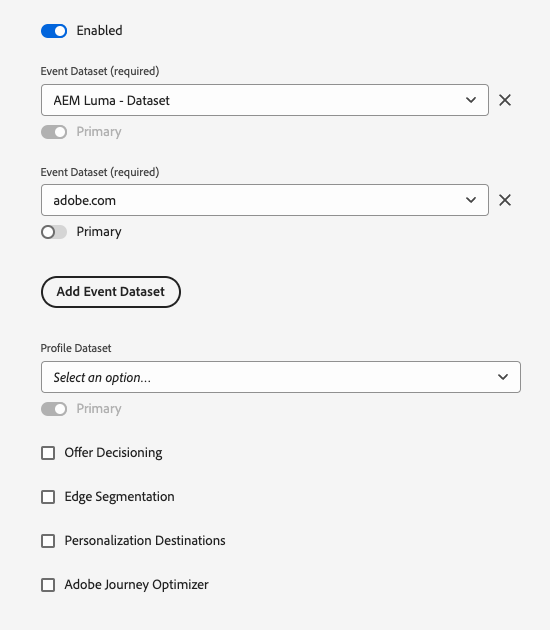
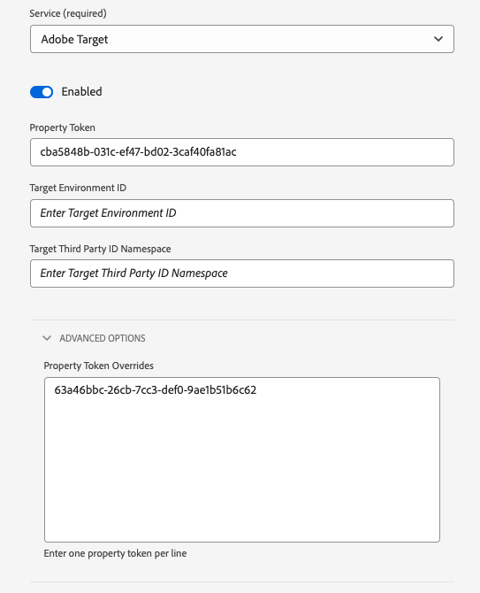

# Skapa och konfigurera datastreams

Det här dokumentet innehåller stegen för konfiguration av en [datastream](./overview.md) i användargränssnittet.

## Öppna [!UICONTROL Datastreams] arbetsyta

Du kan skapa och hantera datastölar i användargränssnittet för datainsamling eller användargränssnittet för Experience Platform genom att välja **[!UICONTROL Datastreams]** i den vänstra navigeringen.

The **[!UICONTROL Datastreams]** På -fliken visas en lista med befintliga dataströmmar, inklusive deras egna namn, ID och senaste ändringsdatum. Välj namnet på en datastream som [visa information och konfigurera tjänster](#view-details).

Välj ikonen &quot;mer&quot; (**...**) för en viss datastream för att visa fler alternativ. Välj **[!UICONTROL Edit]** för att uppdatera [grundläggande konfiguration](#configure) för datastream, eller välj **[!UICONTROL Delete]** för att ta bort datastream.

## Skapa ett nytt datastream {#create}

Om du vill skapa ett datastream börjar du med att välja **[!UICONTROL New Datastream]**.

Arbetsflödet för att skapa en datastam visas med början i konfigurationssteget. Härifrån måste du ange ett namn och en valfri beskrivning för datastream.

Om du konfigurerar det här dataflödet för användning i Experience Platform och använder Platform Web SDK måste du även välja en [händelsebaserat XDM-schema (Experience Data Model)](../xdm/classes/experienceevent.md) för att representera de data du planerar att använda vid inhämtning.

### Konfigurera geopositionering och nätverkssökning {#geolocation-network-lookup}

Med inställningarna för geopositionering och nätverkssökning kan du definiera detaljnivån för de geografiska data och nätverksdata som du vill samla in.

Expandera **[!UICONTROL Geolocation and network lookup]** för att konfigurera inställningarna som beskrivs nedan.

| Inställning | Beskrivning |
| --- | --- |
| [!UICONTROL Geo Lookup] | Aktiverar sökningar efter geopositionering för de valda alternativen baserat på besökarens IP-adress. Tillgängliga alternativ är: <ul><li>**Land**: Populates `xdm.placeContext.geo.countryCode`</li><li>**Postnummer**: Populates `xdm.placeContext.geo.postalCode`</li><li>**Stat/provins**: Populates `xdm.placeContext.geo.stateProvince`</li><li>**DMA**: Populates `xdm.placeContext.geo.dmaID`</li><li>**Ort**: Populates `xdm.placeContext.geo.city`</li><li>**Latitude**: Populates `xdm.placeContext.geo._schema.latitude`</li><li>**Longitud**: Populates `xdm.placeContext.geo._schema.longitude`</li></ul>Markera **[!UICONTROL City]**, **[!UICONTROL Latitude]**, eller **[!UICONTROL Longitude]** innehåller koordinater upp till två decimalpunkter, oavsett vilka andra alternativ som är markerade. Detta betraktas som granularitet på stadsnivå.   Om du inte väljer något alternativ inaktiveras sökningar efter geopositionering. Geolokalisering sker innan [!UICONTROL IP Obfuscation], vilket innebär att det inte påverkas av [!UICONTROL IP Obfuscation] inställning. |
| [!UICONTROL Network Lookup] | Aktiverar nätverkssökningar för de valda alternativen baserat på besökarens IP-adress. Tillgängliga alternativ är: <ul><li>**Fraktfirma**: Populates `xdm.environment.carrier`</li><li>**Domän**: Populates `xdm.environment.domain`</li><li>**ISP**: Populates `xdm.environment.ISP`</li></ul> |

Om du aktiverar något av fälten ovan för datainsamling måste du se till att du anger rätt [`context`](../edge/data-collection/automatic-information.md) arrayegenskap när [konfigurera Web SDK](../edge/fundamentals/configuring-the-sdk.md).

Geoplatsens sökfält använder `context` matrissträng `"placeContext"`medan fält för nätverkssökning använder `context` matrissträng `"environment"`.

Kontrollera dessutom att varje önskat XDM-fält finns i schemat. Om så inte är fallet kan du lägga till Adobe `Environment Details` fältgrupp till ditt schema.

### Konfigurera enhetssökning {#geolocation-device-lookup}

The **[!UICONTROL Device Lookup]** kan du välja enhetsspecifik information som du vill samla in.

Expandera **[!UICONTROL Device Lookup]** för att konfigurera inställningarna som beskrivs nedan.

>[!IMPORTANT]
>
>De inställningar som beskrivs i tabellen nedan utesluter varandra. Du kan inte välja både användaragentinformation och enhetssökningsdata samtidigt.

| Inställning | Beskrivning |
| --- | --- |
| **[!UICONTROL Keep user agent and client hints headers]** | Välj det här alternativet om du bara vill samla in den information som lagras i användaragentsträngen. Den här inställningen är markerad som standard. Populerar `xdm.environment.browserDetails.userAgent` |
| **[!UICONTROL Use device lookup to collect the following information]** | Välj det här alternativet om du vill samla in en eller flera av följande enhetsspecifika information: <ul><li>**[!UICONTROL Device]** information:<ul><li>**Enhetstillverkare**: Populates `xdm.device.manufacturer`</li><li>**Enhetsmodell**: Populates `xdm.device.modelNumber`</li><li>**Marknadsföringsnamn**: Populates `xdm.device.model`</li></ul></li><li>**[!UICONTROL Hardware]** information: <ul><li>**Maskinvarutyp**: Populates `xdm.device.type`</li><li>**Visningshöjd**: Populates `xdm.device.screenHeight`</li><li>**Visningsbredd**: Populates `xdm.device.screenWidth`</li><li>**Visa färgdjup**: Populates `xdm.device.colorDepth`</li></ul></li><li>**[!UICONTROL Browser]** information: <ul><li>**Webbläsarleverantör**: Populates `xdm.environment.browserDetails.vendor`</li><li>**Webbläsarnamn**: Populates `xdm.environment.browserDetails.name`</li><li>**Webbläsarversion**: Populates `xdm.environment.browserDetails.version`</li></ul></li><li>**[!UICONTROL Operating system]** information: <ul><li>**OS-leverantör**: Populates `xdm.environment.operatingSystemVendor`</li><li>**OS-namn**: Populates `xdm.environment.operatingSystem`</li><li>**OS-version**: Populates `xdm.environment.operatingSystemVersion`</li></ul></li></ul>Det går inte att samla in information om enhetssökning tillsammans med användaragent- och klienttips. Om du väljer att samla in enhetsinformation inaktiveras samlingen av användaragent- och klienttips och vice versa. |
| **[!UICONTROL Do not collect any device information]** | Välj det här alternativet om du inte vill samla in någon information om enhetssökning. Inga tipsdata för enheter, maskinvara, webbläsare, operativsystem, användare eller klient samlas in. |

Om du aktiverar något av fälten ovan för datainsamling måste du se till att du anger rätt [`context`](../edge/data-collection/automatic-information.md) arrayegenskap när [konfigurera Web SDK](../edge/fundamentals/configuring-the-sdk.md).

Enhet- och maskinvaruinformation använder `context` matrissträng `"device"`, medan information om webbläsare och operativsystem använder `context` matrissträng `"environment"`.

Kontrollera dessutom att varje önskat XDM-fält finns i schemat. Om så inte är fallet kan du lägga till Adobe `Environment Details` fältgrupp till ditt schema.

### Konfigurera avancerade alternativ {#@advanced-options}

Välj **[!UICONTROL Advanced Options]** om du vill visa ytterligare kontroller för att konfigurera dataströmmen, till exempel IP-förfalskning, cookies för första parts-ID med mera.

>[!IMPORTANT]
>
> Du ansvarar för att säkerställa att du har fått alla tillstånd, samtycke, klargöranden och tillstånd som krävs enligt tillämpliga lagar och bestämmelser för att samla in, bearbeta och överföra personuppgifter, inklusive exakt geolokaliseringsinformation.
> 
> Ditt val av IP-adressofuscation påverkar inte nivån på geopositioneringsinformation som kommer att härledas från IP-adressen och skickas till dina konfigurerade Adobe-lösningar. Geoplatssökningar måste begränsas eller inaktiveras separat.

| Inställning | Beskrivning |
| --- | --- |
| [!UICONTROL IP Obfuscation] | Anger vilken typ av IP-ofuscation som ska användas för datastream. All bearbetning som baseras på kundens IP-adress påverkas av IP-begränsningsinställningen. Detta inkluderar alla Experience Cloud-tjänster som tar emot data från ditt datastream. 
Tillgängliga alternativ
 <ul><li>**[!UICONTROL None]**: Inaktiverar IP-förfalskning. Den fullständiga användarens IP-adress skickas via datastream.</li><li>**[!UICONTROL Partial]**: För IPv4-adresser döljer den sista oktetten i användarens IP-adress. För IPv6-adresser döljer de sista 80 bitarna i adressen. 
Exempel:
 <ul><li>IPv4: `1.2.3.4` -> `1.2.3.0`</li><li>IPv6: `2001:0db8:1345:fd27:0000:ff00:0042:8329` -> `2001:0db8:1345:0000:0000:0000:0000:0000`</li></ul></li><li>**[!UICONTROL Full]**: Fokuserar hela IP-adressen. 
Exempel:
 <ul><li>IPv4: `1.2.3.4` -> `0.0.0.0`</li><li>IPv6: `2001:0db8:1345:fd27:0000:ff00:0042:8329` -> `0:0:0:0:0:0:0:0`</li></ul></li></ul> IP-försvårande effekter på andra Adobe-produkter: <ul><li>**Adobe Target**: Datastream-nivån [!UICONTROL IP obfuscation] används före [!UICONTROL IP obfuscation] som utförs i Adobe Target, till alla IP-adresser som finns i begäran. Om till exempel datastream-nivån [!UICONTROL IP obfuscation] option is set to **[!UICONTROL Full]** och Adobe Target IP-felsökningsalternativ är inställt på **[!UICONTROL Last octet obfuscation]**, får Adobe Target en fullständigt okomplicerad IP. Om datastream-nivån [!UICONTROL IP obfuscation] option is set to **[!UICONTROL Partial]** och Adobe Target IP-felsökningsalternativ är inställt på **[!UICONTROL Full]**, får Adobe Target en delvis ofuskerad IP-adress och tillämpar sedan den fullständiga osäkerheten på den. Adobe Target IP-förfalskning hanteras oberoende av datastream. Läs Adobe Target-dokumentationen på [IP-förvrängning](https://developer.adobe.com/target/before-implement/privacy/privacy/) och [geolokalisering](https://experienceleague.adobe.com/docs/target/using/audiences/create-audiences/categories-audiences/geo.html) för mer information.</li><li>**Audience Manager**: Datastream-nivån [!UICONTROL IP obfuscation] inställningen används före [!UICONTROL IP obfuscation] utfördes i Audience Manager, till alla IP-adresser som finns i begäran. Alla sökningar efter geopositionering som gjorts av Audience Manager påverkas av datastream-nivån [!UICONTROL IP obfuscation] alternativ. En sökning efter geopositionering i Audience Manager, som baseras på en helt okomplicerad IP-adress, resulterar i en okänd region och inga segment som baseras på resulterande geopositioneringsdata kommer att realiseras. Läs Audience Manager-dokumentationen på [IP-förvrängning](https://experienceleague.adobe.com/docs/audience-manager/user-guide/features/administration/ip-obfuscation.html) för mer information.</li><li>**Adobe Analytics**: Om inställningen för IP-obfusacering på datastream-nivå är inställd på **[!UICONTROL Full]** behandlas IP-adressen som tom i Adobe Analytics. Detta påverkar alla Analytics-bearbetningar som är beroende av IP-adressen, till exempel sökningar efter geopositionering och IP-filtrering. För att Analytics ska kunna ta emot de obefuscerade eller delvis dolda IP-adresserna ställer du in IP-förfalskningsinställningen på **[!UICONTROL Partial]** eller **[!UICONTROL None]**. Delvis dolda och odolda IP-adresser kan döljas ytterligare i Analytics. Se Adobe Analytics [dokumentation](https://experienceleague.adobe.com/docs/analytics/admin/admin-tools/manage-report-suites/edit-report-suite/report-suite-general/general-acct-settings-admin.html) om du vill ha mer information om hur du aktiverar IP-förfalskning i Analytics. Om IP-adressen är helt okomplicerad och sidträffen inte har något [!DNL ECID] eller en [!DNL VisitorID], kommer Analytics att släppa träffen i stället för att generera en [Återställnings-ID](https://experienceleague.adobe.com/docs/id-service/using/reference/analytics-reference/analytics-ids.html?lang=en), som delvis baseras på IP-adressen.</li></ul> |
| [!UICONTROL First Party ID Cookie] | När det här alternativet är aktiverat anger den här inställningen att Edge Network ska referera till en angiven cookie när en [enhets-ID för första part](../edge/identity/first-party-device-ids.md)i stället för att leta upp det här värdet i identitetskartan.  När du aktiverar den här inställningen måste du ange namnet på den cookie där ID:t ska lagras. |
| [!UICONTROL Third Party ID Sync] | ID-synkroniseringar kan grupperas i behållare så att olika ID-synkroniseringar kan köras vid olika tidpunkter. När den här inställningen är aktiverad kan du ange vilken ID-synkroniseringsbehållare som ska köras för den här datastream-filen. |
| [!UICONTROL Third Party ID Sync Container ID] | Det numeriska ID:t för behållaren som ska användas för synkronisering av ID från tredje part. |
| [!UICONTROL Container ID Overrides] | I det här avsnittet kan du definiera ytterligare behållar-ID:n för synkronisering av tredjeparts-ID som du kan använda för att åsidosätta standardbehållar-ID:n. |
| [!UICONTROL Access Type] | Definierar den autentiseringstyp som Edge Network godkänner för datastream. <ul><li>**[!UICONTROL Mixed Authentication]**: När det här alternativet är markerat accepteras både autentiserade och oautentiserade begäranden i Edge Network. Välj det här alternativet när du tänker använda Web SDK eller [Mobile SDK](https://developer.adobe.com/client-sdks/documentation/), med [Server-API](../server-api/overview.md). </li><li>**[!UICONTROL Authenticated Only]**: När det här alternativet är markerat accepteras endast autentiserade begäranden i Edge Network. Välj det här alternativet när du bara vill använda server-API:t och vill förhindra att oautentiserade begäranden behandlas av Edge Network.</li></ul> |
| [!UICONTROL Media Analytics] | Välj det här alternativet om du vill aktivera bearbetning av data för direktuppspelningsspårning för Edge Network-integrering via Experience Platform SDK eller Media Edge API. Läs om Media Analytics på [dokumentation](https://experienceleague.adobe.com/docs/media-analytics/using/media-overview.html). |

Om du konfigurerar ditt datastream för Experience Platform följer du självstudiekursen på [Dataförberedelse för datainsamling](./data-prep.md) för att mappa dina data till ett plattformshändelseschema innan du återgår till den här guiden. Annars väljer du **[!UICONTROL Save]** och fortsätta till nästa avsnitt.

## Visa information om dataström {#view-details}

När du har konfigurerat en ny datastam eller valt en befintlig som ska visas, visas informationssidan för den datastream. Här finns mer information om datastream, inklusive dess ID.

På informationsskärmen för datastream kan du [lägg till tjänster](#add-services) för att aktivera funktioner från de Adobe Experience Cloud-produkter du har tillgång till. Du kan även redigera datastreams [grundläggande konfiguration](#create), uppdatera [mappningsregler](./data-prep.md), [kopiera datastream](#copy)eller ta bort den helt.

## Lägga till tjänster i ett datastream {#add-services}

På informationssidan för ett datastream väljer du **[!UICONTROL Add Service]** för att börja lägga till tillgängliga tjänster för den aktuella datastream.

På nästa skärm använder du listrutemenyn för att välja en tjänst som ska konfigureras för det här dataflödet. Endast de tjänster som du har åtkomst till visas i den här listan.

Välj önskad tjänst, fyll i de konfigurationsalternativ som visas och välj sedan **[!UICONTROL Save]** för att lägga till tjänsten i datastream. Alla tillagda tjänster visas i informationsvyn för datastream.

Underavsnitten nedan beskriver konfigurationsalternativen för varje tjänst.

>[!NOTE]
>
>Varje tjänstkonfiguration innehåller en **[!UICONTROL Enabled]** som aktiveras automatiskt när tjänsten väljs. Om du vill inaktivera den valda tjänsten för den här datastreamen väljer du **[!UICONTROL Enabled]** växla igen.

### Adobe Analytics-inställningar {#analytics}

Den här tjänsten kontrollerar om och hur data skickas till Adobe Analytics. Mer information finns i guiden på [skicka data till Analytics](../edge/data-collection/adobe-analytics/analytics-overview.md).

| Inställning | Beskrivning |
| --- | --- |
| [!UICONTROL Report Suite ID] | **(Obligatoriskt)** ID:t för analysrapportsviten som du vill skicka data till. Detta ID finns i användargränssnittet i Adobe Analytics under [!UICONTROL Admin] > [!UICONTROL ReportSuites]. Om flera rapportsviter anges kopieras data till varje rapportserie. |
| [!UICONTROL Report Suite Overrides] | I det här avsnittet kan du lägga till ytterligare ID:n för rapportsviten som du kan använda för att åsidosätta standarddessa. |

### Adobe Audience Manager-inställningar {#audience-manager}

Den här tjänsten kontrollerar om och hur data skickas till Adobe Audience Manager. Allt som behövs för att skicka data till Audience Manager är att aktivera det här avsnittet. De andra inställningarna är valfria men rekommenderas.

| Inställning | Beskrivning |
| --- | --- |
| [!UICONTROL Cookie Destinations Enabled] | Gör att SDK kan dela segmentinformation via [cookie-destinationer](https://experienceleague.adobe.com/docs/audience-manager/user-guide/features/destinations/custom-destinations/create-cookie-destination.html) från [!DNL Audience Manager]. |
| [!UICONTROL URL Destinations Enabled] | Gör att SDK kan dela segmentinformation via [URL-mål](https://experienceleague.adobe.com/docs/audience-manager/user-guide/features/destinations/custom-destinations/create-url-destination.html) från [!DNL Audience Manager]. |

### Adobe Experience Platform-inställningar {#aep}

>[!IMPORTANT]
>
>När du aktiverar en datastream för Platform bör du tänka på den plattformssandlåda som du använder just nu, så som den visas på den översta menyfliken i användargränssnittet.
>
>
>
>Sandlådor är virtuella partitioner i Adobe Experience Platform som gör att du kan isolera data och implementeringar från andra i din organisation. När en datastream har skapats kan dess sandlåda inte ändras. Mer information om sandlådornas roll i Experience Platform finns i [dokumentation för sandlådor](../sandboxes/home.md).

Den här tjänsten kontrollerar om och hur data skickas till Adobe Experience Platform.

| Inställning | Beskrivning |
|---| --- |
| [!UICONTROL Event Dataset] | **(Obligatoriskt)** Välj den plattformsdatauppsättning som kundhändelsedata ska direktuppspelas till. Det här schemat måste använda [Klassen XDM ExperienceEvent](../xdm/classes/experienceevent.md). Om du vill lägga till fler datauppsättningar väljer du **[!UICONTROL Add Event Dataset]**. |
| [!UICONTROL Profile Dataset] | Välj den plattformsdatauppsättning som kundattributdata ska skickas till. Det här schemat måste använda [Klassen XDM Individuell profil](../xdm/classes/individual-profile.md). |
| [!UICONTROL Offer Decisioning] | Markera den här kryssrutan om du vill aktivera Offer decisioning för en implementering av en Platform Web SDK. Se guiden på [använda Offer decisioning med Platform Web SDK](../edge/personalization/offer-decisioning/offer-decisioning-overview.md) om du vill ha mer information om implementeringen.  Mer information om Offer decisioning finns i [Adobe Journey Optimizer-dokumentation](https://experienceleague.adobe.com/docs/journey-optimizer/using/offer-decisioniong/get-started/starting-offer-decisioning.html). |
| [!UICONTROL Edge Segmentation] | Markera den här kryssrutan för att aktivera [kantsegmentering](../segmentation/ui/edge-segmentation.md) för denna datastream. När SDK skickar data via en datastam som är aktiverad för kantsegmentering, skickas alla uppdaterade segmentmedlemskap för den aktuella profilen tillbaka som svar.  Det här alternativet kan användas i kombination med [!UICONTROL Personalization Destinations] for [exempel på användning av personalisering på nästa sida](../destinations/ui/activate-edge-personalization-destinations.md). |
| [!UICONTROL Personalization Destinations] | När du har aktiverat detta efter att du har aktiverat [!UICONTROL Edge Segmentation] kryssrutan tillåter det här alternativet att datastream ansluter till personaliseringsmål, som [Anpassad personalisering](../destinations/catalog/personalization/custom-personalization.md).  Se måldokumentationen för specifika steg om [konfigurera personaliseringsmål](../destinations/ui/activate-edge-personalization-destinations.md). |
| [!UICONTROL Adobe Journey Optimizer] | Markera den här kryssrutan för att aktivera [Adobe Journey Optimizer](https://experienceleague.adobe.com/docs/journey-optimizer/using/ajo-home.html) för denna datastream.    Om du aktiverar det här alternativet kan datastream returnera personaliserat innehåll från webb- och appbaserade inkommande kampanjer i [!DNL Adobe Journey Optimizer]. Det här alternativet kräver [!UICONTROL Edge Segmentation] att vara aktiv. If [!UICONTROL Edge Segmentation] är avmarkerat, är det här alternativet nedtonat. |

### Adobe Target-inställningar {#target}

Den här tjänsten kontrollerar om och hur data skickas till Adobe Target.

| Inställning | Beskrivning |
| --- | --- |
| [!UICONTROL Property Token] | [!DNL Target] låter kunderna styra behörigheter genom att använda egenskaper. Mer information om egenskaper finns i handboken [konfigurera företagsbehörigheter](https://experienceleague.adobe.com/docs/target/using/administer/manage-users/enterprise/properties-overview.html) i [!DNL Target] dokumentation.  Egenskapstoken finns i Adobe Target-gränssnittet under [!UICONTROL Setup] > [!UICONTROL Properties]. |
| [!UICONTROL Target Environment ID] | [Miljöer i Adobe Target](https://experienceleague.adobe.com/docs/target/using/administer/hosts.html) hjälper er att hantera implementeringen i alla utvecklingsfaser. Den här inställningen anger vilken miljö du tänker använda med den här datastream.  Det bästa sättet är att ange detta på olika sätt för var och en av dina `dev`, `stage`och `prod` datastream-miljöer för att hålla saker och ting enkla. Om du redan har definierat Adobe Target-miljöer kan du dock använda dessa. |
| [!UICONTROL Target Third Party ID namespace] | Identitetsnamnrymden för `mbox3rdPartyId` som du vill använda för den här datastream. Se guiden på [implementera `mbox3rdPartyId` med Web SDK](../edge/personalization/adobe-target/using-mbox-3rdpartyid.md) för mer information. |
| [!UICONTROL Property Token Overrides] | I det här avsnittet kan du definiera ytterligare egenskapstoken som du kan använda för att åsidosätta standardegenskapstoken. |

### [!UICONTROL Event Forwarding] inställningar

Den här tjänsten kontrollerar om och hur data skickas till [händelsevidarebefordran](../tags/ui/event-forwarding/overview.md).

| Inställning | Beskrivning |
| --- | --- |
| [!UICONTROL Launch Property] | **(Obligatoriskt)** Egenskapen för vidarebefordran av händelser som du vill skicka data till. |
| [!UICONTROL Launch Environment] | **(Obligatoriskt)** Den miljö i den valda egenskapen som du vill skicka data till. |

>[!NOTE]
>
>Du kan välja **[!UICONTROL Manually enter IDs]** om du vill skriva i egenskaps- och miljönamnen i stället för att använda listrutemenyer.

## Kopiera ett datastream {#copy}

Du kan skapa en kopia av ett befintligt datastream och ändra informationen efter behov.

>[!NOTE]
>
>Datastreams kan bara kopieras inom samma [sandlåda](../sandboxes/home.md). Du kan alltså inte kopiera en datastam från en sandlåda till en annan.

Från huvudsidan i [!UICONTROL Datastreams] väljer du ellips (**...**) för den aktuella datastream-filen och välj **[!UICONTROL Copy]**.

![Bild som visar [!UICONTROL Copy] det alternativ som väljs i datastreams listvy](assets/configure/copy-datastream-list.png)

Du kan också välja **[!UICONTROL Copy Datastream]** från detaljvyn för en viss datastream.

![Bild som visar [!UICONTROL Copy] alternativ som väljs från datastream-informationsvyn](assets/configure/copy-datastream-details.png)

En bekräftelsedialogruta visas där du uppmanas att ange ett unikt namn för den nya datastream som ska skapas, tillsammans med information om de konfigurationsalternativ som ska kopieras. När du är klar väljer du **[!UICONTROL Copy]**.

Huvudsidan i [!UICONTROL Datastreams] arbetsytan visas igen med den nya datastream som visas.

## Nästa steg

I den här guiden beskrivs hur du hanterar datastölar i användargränssnittet för datainsamling. Mer information om hur du installerar och konfigurerar Web SDK när du har konfigurerat ett datastream finns i [E2E-guide för datainsamling](../collection/e2e.md#install).
