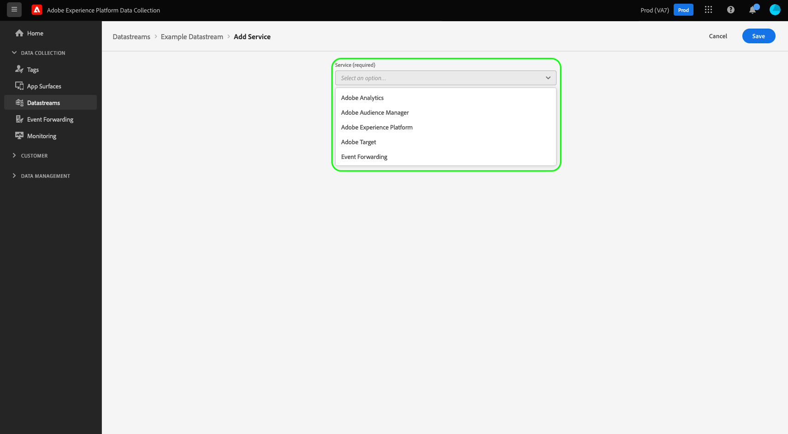
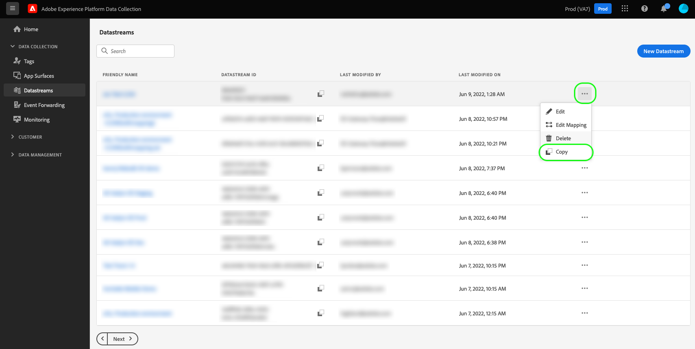

# Skapa och konfigurera datastreams

Det här dokumentet innehåller stegen för hur du konfigurerar [datastream](./overview.md) i användargränssnittet.

## Åtkomst till arbetsytan [!UICONTROL Datastreams]

Du kan skapa och hantera datastölar i användargränssnittet för datainsamling eller Experience Platform-gränssnittet genom att välja **[!UICONTROL Datastreams]** i den vänstra navigeringen.

Fliken **[!UICONTROL Datastreams]** visar en lista över befintliga datastreams, inklusive deras egna namn, ID och senaste ändringsdatum. Om du vill [visa information om det och konfigurera tjänster](#view-details) markerar du namnet på ett datastream.

Om du vill visa fler alternativ för en viss datastam väljer du ikonen &quot;mer&quot; (**...**). Välj **[!UICONTROL Edit]** om du vill uppdatera den [grundläggande konfigurationen](#configure) för datastream. Om du vill ta bort datastream väljer du **[!UICONTROL Delete]**.

## Skapa ett datastream {#create}

Om du vill skapa ett datastream börjar du med att välja **[!UICONTROL New Datastream]**.

Arbetsflödet för att skapa en datastam visas med början i konfigurationssteget. Härifrån måste du ange ett namn och en valfri beskrivning för datastream.

Om du konfigurerar en datastream för användning i Experience Platform och du även använder Web SDK, måste du även välja ett [händelsebaserat XDM-schema ](../xdm/classes/experienceevent.md) som representerar de data som du planerar för inhämtning.

### Konfigurera geopositionering och nätverkssökning {#geolocation-network-lookup}

Med inställningarna för geopositionering och nätverkssökning kan du definiera detaljnivån för de geografiska data och nätverksdata som du vill samla in.

Expandera avsnittet **[!UICONTROL Geolocation and network lookup]** för att konfigurera inställningarna som beskrivs nedan.

| Inställning | Beskrivning |
| --- | --- |
| [!UICONTROL Geo Lookup] | Aktiverar sökningar efter geopositionering för de valda alternativen baserat på besökarens IP-adress. Tillgängliga alternativ är: <ul><li>**Land**: Fyller i `xdm.placeContext.geo.countryCode`</li><li>**Postnummer**: Fyller i `xdm.placeContext.geo.postalCode`</li><li>**Region**: Fyller i `xdm.placeContext.geo.stateProvince`</li><li>**DMA**: Fyller i `xdm.placeContext.geo.dmaID`</li><li>**Ort**: Fyller i `xdm.placeContext.geo.city`</li><li>**Latitude**: Fyller `xdm.placeContext.geo._schema.latitude`</li><li>**Longitud**: Fyller i `xdm.placeContext.geo._schema.longitude`</li></ul>Om du väljer **[!UICONTROL City]**, **[!UICONTROL Latitude]** eller **[!UICONTROL Longitude]** får du koordinater upp till två decimalpunkter, oavsett vilka andra alternativ som är markerade. Detta betraktas som granularitet på stadsnivå.   Om du inte väljer något alternativ inaktiveras sökningar efter geopositionering. Geolocation inträffar före [!UICONTROL IP Obfuscation], vilket betyder att den inte påverkas av inställningen [!UICONTROL IP Obfuscation]. |
| [!UICONTROL Network Lookup] | Aktiverar nätverkssökningar för de valda alternativen baserat på besökarens IP-adress. Tillgängliga alternativ är: <ul><li>**Mobiloperatör**: Fyller i `xdm.environment.carrier`</li><li>**Domän**: Fyller i `xdm.environment.domain`</li><li>**ISP**: Fyller i `xdm.environment.ISP`</li><li>**Anslutningstyp**: Fyller i `xdm.environment.connectionType`</li></ul> |

Om du aktiverar något av fälten ovan för datainsamling bör du kontrollera att du har angett arrayegenskapen [`context`](/help/web-sdk/commands/configure/context.md) korrekt när du konfigurerar Web SDK.

Geolocation-sökfält använder `context`-matrissträngen `"placeContext"` medan nätverkssökningsfält använder `context`-matrissträngen `"environment"`.

Kontrollera också att varje önskat XDM-fält finns i schemat. Om den inte gör det kan du lägga till fältgruppen `Environment Details` som tillhandahålls av Adobe i ditt schema.

### Konfigurera enhetssökning {#geolocation-device-lookup}

Med inställningarna för **[!UICONTROL Device Lookup]** kan du välja enhetsspecifik information som du vill samla in.

Expandera avsnittet **[!UICONTROL Device Lookup]** för att konfigurera inställningarna som beskrivs nedan.

>[!IMPORTANT]
>
>Inställningarna som visas i tabellen nedan utesluter varandra. Du kan inte välja både användaragentinformation *och* enhetssökningsdata samtidigt.

| Inställning | Beskrivning |
| --- | --- |
| **[!UICONTROL Keep user agent and client hints headers]** | Välj det här alternativet om du bara vill samla in den information som lagras i användaragentsträngen. Den här inställningen är markerad som standard. Fyller `xdm.environment.browserDetails.userAgent` |
| **[!UICONTROL Use device lookup to collect the following information]** | Välj det här alternativet om du vill samla in en eller flera av följande enhetsspecifika information: <ul><li>**[!UICONTROL Device]** information:<ul><li>**Enhetstillverkare**: Fyller i `xdm.device.manufacturer`</li><li>**Enhetsmodell**: Fyller i `xdm.device.modelNumber`</li><li>**Marknadsnamn**: Fyller i `xdm.device.model`</li></ul></li><li>**[!UICONTROL Hardware]** information: <ul><li>**Maskinvarutyp**: Fyller i `xdm.device.type`</li><li>**Visningshöjd**: Fyller i `xdm.device.screenHeight`</li><li>**Visningsbredd**: Fyller i `xdm.device.screenWidth`</li><li>**Visa färgdjup**: Fyller i `xdm.device.colorDepth`</li></ul></li><li>**[!UICONTROL Browser]** information: <ul><li>**Webbläsarleverantör**: Fyller i `xdm.environment.browserDetails.vendor`</li><li>**Webbläsarnamn**: Fyller i `xdm.environment.browserDetails.name`</li><li>**Webbläsarversion**: Fyller i `xdm.environment.browserDetails.version`</li></ul></li><li>**[!UICONTROL Operating system]** information: <ul><li>**OS-leverantör**: Fyller i `xdm.environment.operatingSystemVendor`</li><li>**OS-namn**: Fyller i `xdm.environment.operatingSystem`</li><li>**OS-version**: Fyller i `xdm.environment.operatingSystemVersion`</li></ul></li></ul>Det går inte att samla in information om enhetssökning tillsammans med användaragent- och klienttips. Om du väljer att samla in enhetsinformation inaktiveras samlingen av användaragent- och klienttips och vice versa. |
| **[!UICONTROL Do not collect any device information]** | Välj det här alternativet om du inte vill samla in någon information om enhetssökning. Inga tipsdata för enheter, maskinvara, webbläsare, operativsystem, användare eller klient samlas in. |

Om du aktiverar något av fälten ovan för datainsamling bör du kontrollera att du har angett arrayegenskapen [`context`](/help/web-sdk/commands/configure/context.md) korrekt när du konfigurerar Web SDK.

Enhet- och maskinvaruinformationen använder `context`-matrissträngen `"device"` medan webbläsar- och operativsystemsinformationen använder `context`-matrissträngen `"environment"`.

Kontrollera också att varje önskat XDM-fält finns i schemat. Om den inte gör det kan du lägga till fältgruppen `Environment Details` som tillhandahålls av Adobe i ditt schema.

### Konfigurera avancerade alternativ {#advanced-options}

Om du vill visa avancerade konfigurationsalternativ väljer du **[!UICONTROL Advanced Options]**. Här kan du konfigurera ytterligare datastream-inställningar, som IP-förfalskning, cookies för första parts-ID med mera.

>[!IMPORTANT]
>
> Du ansvarar för att se till att du har fått alla tillstånd, samtycke, klargöranden och tillstånd som krävs enligt tillämpliga lagar och bestämmelser för att samla in, bearbeta och överföra personuppgifter, inklusive exakt geolokaliseringsinformation.
> 
> Ditt val av IP-adressofuscation påverkar inte nivån på geopositioneringsinformation som härleds från IP-adressen och skickas till dina konfigurerade Adobe-lösningar. Geoplatssökningar måste begränsas eller inaktiveras separat.

| Inställning | Beskrivning |
| --- | --- |
| [!UICONTROL IP Obfuscation] | Anger vilken typ av IP-ofuscation som ska användas för datastream. All bearbetning som baseras på kundens IP-adress påverkas av IP-begränsningsinställningen. Detta inkluderar alla Experience Cloud-tjänster som tar emot data från din datastream. 
Tillgängliga alternativ
 <ul><li>**[!UICONTROL None]**: Inaktiverar IP-förfalskning. Den fullständiga användarens IP-adress skickas via datastream.</li><li>**[!UICONTROL Partial]**: För IPv4-adresser döljer den sista oktetten i användarens IP-adress. För IPv6-adresser döljer de sista 80 bitarna i adressen. 
Exempel:
 <ul><li>IPv4: `1.2.3.4` -> `1.2.3.0`</li><li>IPv6: `2001:0db8:1345:fd27:0000:ff00:0042:8329` -> `2001:0db8:1345:0000:0000:0000:0000:0000`</li></ul></li><li>**[!UICONTROL Full]**: Komprimerar hela IP-adressen. 
Exempel:
 <ul><li>IPv4: `1.2.3.4` -> `0.0.0.0`</li><li>IPv6: `2001:0db8:1345:fd27:0000:ff00:0042:8329` -> `0:0:0:0:0:0:0:0`</li></ul></li></ul> IP-försvårande effekter på andra Adobe-produkter: <ul><li>**Adobe Target**: Datastream-nivån [!UICONTROL IP obfuscation] tillämpas före [!UICONTROL IP obfuscation] som har utförts i Adobe Target på alla IP-adresser som finns i begäran. Om till exempel alternativet [!UICONTROL IP obfuscation] på datastream-nivå är inställt på **[!UICONTROL Full]** och alternativet för Adobe Target IP-förfalskning är inställt på **[!UICONTROL Last octet obfuscation]**, får Adobe Target en fullständigt osäker IP. Om alternativet [!UICONTROL IP obfuscation] på datastream-nivå är inställt på **[!UICONTROL Partial]** och Adobe Target IP-begränsningsalternativet är inställt på **[!UICONTROL Full]**, får Adobe Target en delvis ofuskerad IP och tillämpar sedan den fullständiga osäkerheten på den. Adobe Target IP-förfalskning hanteras oberoende av datastream. Mer information finns i Adobe Target-dokumentationen om [IP-förfalskning](https://experienceleague.adobe.com/docs/target-dev/developer/implementation/privacy/privacy.html) och [geopositionering](https://experienceleague.adobe.com/docs/target/using/audiences/create-audiences/categories-audiences/geo.html).</li><li>**Audience Manager**: Inställningen på datastream-nivå [!UICONTROL IP obfuscation] tillämpas före den [!UICONTROL IP obfuscation] som utförs i Audience Manager på alla IP-adresser som finns i begäran. Alla sökningar efter geopositionering som görs av Audience Manager påverkas av alternativet [!UICONTROL IP obfuscation] på datastream-nivå. En sökning efter geopositionering i Audience Manager, som baseras på en helt okomplicerad IP-adress, resulterar i en okänd region och inga segment som baseras på resulterande geopositioneringsdata realiseras. Mer information finns i Audience Manager-dokumentationen om [IP-ojämnheter](https://experienceleague.adobe.com/docs/audience-manager/user-guide/features/administration/ip-obfuscation.html).</li><li>**Adobe Analytics**: Om IP-begränsningsinställningen på datastream-nivå är inställd på **[!UICONTROL Full]** hanterar Adobe Analytics IP-adressen som tom. Detta påverkar alla Analytics-bearbetningar som är beroende av IP-adressen, till exempel sökningar efter geopositionering och IP-filtrering. För att Analytics ska kunna ta emot de obefuscerade eller delvis dolda IP-adresserna anger du IP-förfalskningsinställningen till **[!UICONTROL Partial]** eller **[!UICONTROL None]**. Delvis dolda och odolda IP-adresser kan döljas ytterligare i Analytics. Se Adobe Analytics [dokumentation](https://experienceleague.adobe.com/docs/analytics/admin/admin-tools/manage-report-suites/edit-report-suite/report-suite-general/general-acct-settings-admin.html) för mer information om hur du aktiverar IP-förfalskning i Analytics. Om IP-adressen är helt okomplicerad och sidträffen varken har [!DNL ECID] eller [!DNL VisitorID], kommer Analytics att släppa träffen i stället för att generera ett [reserv-ID](https://experienceleague.adobe.com/docs/id-service/using/reference/analytics-reference/analytics-ids.html?lang=en) som delvis baseras på IP-adressen.</li></ul> |
| [!UICONTROL First Party ID Cookie] | När den här inställningen är aktiverad anger den att Edge Network ska referera till en angiven cookie när ett [förstahandsenhets-ID](../web-sdk/identity/first-party-device-ids.md) identifieras, i stället för att leta upp det här värdet i identitetskartan.  När du aktiverar den här inställningen måste du ange namnet på den cookie som ska lagra ID:t. |
| [!UICONTROL Third Party ID Sync] | ID-synkroniseringar kan grupperas i behållare så att olika ID-synkroniseringar kan köras vid olika tidpunkter. När den här inställningen är aktiverad kan du ange vilken ID-synkroniseringsbehållare som ska köras för den här datastream-filen. |
| [!UICONTROL Third Party ID Sync Container ID] | Det numeriska ID:t för behållaren som ska användas för synkronisering av ID från tredje part. |
| [!UICONTROL Container ID Overrides] | I det här avsnittet kan du definiera ytterligare behållar-ID:n för synkronisering av tredjeparts-ID som du kan använda för att åsidosätta standardbehållar-ID:n. |
| [!UICONTROL Access Type] | Definierar den autentiseringstyp som Edge Network godkänner för datastream. <ul><li>**[!UICONTROL Mixed Authentication]**: När det här alternativet är markerat accepterar Edge Network både autentiserade och oautentiserade begäranden. Välj det här alternativet när du tänker använda Web SDK eller [Mobile SDK](https://developer.adobe.com/client-sdks/home/) tillsammans med [Edge Network API](https://developer.adobe.com/data-collection-apis/docs/api/). </li><li>**[!UICONTROL Authenticated Only]**: När det här alternativet är markerat accepterar Edge Network endast autentiserade begäranden. Välj det här alternativet när du bara vill använda Edge Network API och vill förhindra att oautentiserade begäranden behandlas av Edge Network.</li></ul> |
| [!UICONTROL Media Analytics] | Möjliggör bearbetning av spårningsdata för direktuppspelning för Edge Network-integrering via Experience Platform SDK:er eller [Media Edge API](https://developer.adobe.com/cja-apis/docs/endpoints/media-edge/getting-started/). Läs mer om Media Analytics i [dokumentationen](https://experienceleague.adobe.com/docs/media-analytics/using/media-overview.html). |

Om du konfigurerar datastream för Experience Platform följer du självstudiekursen [Data Prep for Data Collection](./data-prep.md) för att mappa dina data till ett Experience Platform-händelseschema innan du återgår till den här guiden. Annars väljer du **[!UICONTROL Save]** och fortsätter till nästa avsnitt.

## Visa information om dataström {#view-details}

När du har konfigurerat en ny datastam eller valt en befintlig som ska visas, visas informationssidan för den datastream. Här finns mer information om datastream, inklusive dess ID.

På informationsskärmen i datastream kan du [lägga till tjänster](#add-services) för att aktivera funktioner från de Adobe Experience Cloud-produkter du har tillgång till. Du kan också redigera datastreams [grundläggande konfiguration](#create), uppdatera dess [mappningsregler](./data-prep.md), [kopiera datastream](#copy) eller ta bort den helt.

## Lägga till tjänster i ett datastream {#add-services}

Välj **[!UICONTROL Add Service]** på informationssidan för ett datastream för att börja lägga till tillgängliga tjänster för det datastream.

På nästa skärm använder du listrutemenyn för att välja en tjänst som ska konfigureras för det här dataflödet. Endast de tjänster som du har åtkomst till visas i den här listan.

Välj önskad tjänst, fyll i de konfigurationsalternativ som visas och välj sedan **[!UICONTROL Save]** för att lägga till tjänsten i dataströmmen. Alla tillagda tjänster visas i informationsvyn för datastream.

Underavsnitten nedan beskriver konfigurationsalternativen för varje tjänst.

>[!NOTE]
>
>Varje tjänstkonfiguration innehåller en **[!UICONTROL Enabled]**-växel som aktiveras automatiskt när tjänsten väljs. Om du vill inaktivera den valda tjänsten för den här datastreamen väljer du **[!UICONTROL Enabled]** igen.

### Adobe Analytics-inställningar {#analytics}

Den här tjänsten kontrollerar om och hur data skickas till Adobe Analytics. Se [Skicka data till Adobe Analytics](/help/web-sdk/use-cases/adobe-analytics.md).

| Inställning | Beskrivning |
| --- | --- |
| [!UICONTROL Report Suite ID] | **(Obligatoriskt)** ID:t för analysrapportsviten som du vill skicka data till. Detta ID finns i Adobe Analytics-gränssnittet under [!UICONTROL Admin] > [!UICONTROL ReportSuites]. Om flera rapportsviter anges kopieras data till varje rapportserie. |
| [!UICONTROL Visitor ID namespace] | (Valfritt) Det namnutrymme som du vill använda för Adobe Analytics [visitorID](https://experienceleague.adobe.com/docs/analytics/implementation/vars/config-vars/visitorid.html). När du skickar en händelse med ett värde angivet för det här namnutrymmet används den automatiskt som `visitorID` i Analytics. |
| [!UICONTROL Report Suite Overrides] | I det här avsnittet kan du lägga till ytterligare ID:n för rapportsviten som du kan använda för att åsidosätta standarddessa. |

### Adobe Audience Manager-inställningar {#audience-manager}

Den här tjänsten kontrollerar om och hur data skickas till Adobe Audience Manager. Allt som behövs för att skicka data till Audience Manager är att aktivera det här avsnittet. De andra inställningarna är valfria men rekommenderas.

| Inställning | Beskrivning |
| --- | --- |
| [!UICONTROL Cookie Destinations Enabled] | Tillåter SDK att dela segmentinformation via [cookie-mål](https://experienceleague.adobe.com/docs/audience-manager/user-guide/features/destinations/custom-destinations/create-cookie-destination.html) från [!DNL Audience Manager]. |
| [!UICONTROL URL Destinations Enabled] | Tillåter SDK att dela segmentinformation via [URL-mål](https://experienceleague.adobe.com/docs/audience-manager/user-guide/features/destinations/custom-destinations/create-url-destination.html) från [!DNL Audience Manager]. |

### Adobe Experience Platform-inställningar {#aep}

>[!IMPORTANT]
>
>När du aktiverar en datastream för Experience Platform bör du tänka på den Experience Platform-sandlåda som du använder, som visas på den övre menyfliken i användargränssnittet.
>
>
>
>Sandlådor är virtuella partitioner i Adobe Experience Platform som gör att du kan isolera data och implementeringar från andra i din organisation. När en datastream har skapats kan dess sandlåda inte ändras. Mer information om rollen för sandlådor i Experience Platform finns i [dokumentationen för sandlådor](../sandboxes/home.md).

Den här tjänsten kontrollerar om och hur data skickas till Adobe Experience Platform.

| Inställning | Beskrivning |
|---| --- |
| [!UICONTROL Event Dataset] | **(Obligatoriskt)** Välj den Experience Platform-datauppsättning som kundhändelsedata ska direktuppspelas till. Det här schemat måste använda [XDM ExperienceEvent-klassen](../xdm/classes/experienceevent.md). Om du vill lägga till fler datauppsättningar väljer du **[!UICONTROL Add Event Dataset]**. |
| [!UICONTROL Profile Dataset] | Markera den Experience Platform-datauppsättning som kundattributdata ska skickas till. Schemat måste använda [XDM-klassen för enskild profil](../xdm/classes/individual-profile.md). |
| [!UICONTROL Offer Decisioning] | Aktiverar implementeringar av Offer Decisioning för Web SDK. Mer implementeringsinformation finns i guiden om [att använda Offer Decisioning med Web SDK](../web-sdk/personalization/offer-decisioning/offer-decisioning-overview.md).  Mer information om Offer Decisioning-funktioner finns i [Adobe Journey Optimizer-dokumentationen](https://experienceleague.adobe.com/docs/journey-optimizer/using/offer-decisioning/get-started-decision/starting-offer-decisioning.html). |
| [!UICONTROL Edge Segmentation] | Aktiverar [kantsegmentering](../segmentation/methods/edge-segmentation.md) för det här datastream. När [SDK](../web-sdk/home.md) eller [Edge Network API](https://developer.adobe.com/data-collection-apis/docs/api/) skickar data via en datastam med kantsegmentering aktiverat, skickas alla uppdaterade målgruppsmedlemskap för den aktuella profilen tillbaka som svar.  Du kan använda det här alternativet i kombination med **[!UICONTROL Personalization Destinations]** för personalisering av samma sida och nästa sida genom [kantmål](../destinations/ui/activate-edge-personalization-destinations.md) eller [!DNL Offer Decisioning]. |
| [!UICONTROL Personalization Destinations] | När du aktiverar det här alternativet efter att du har aktiverat kryssrutan [!UICONTROL Edge Segmentation] kan datastream ansluta till personaliseringsmål, till exempel [Anpassad Personalization](../destinations/catalog/personalization/custom-personalization.md).  Mer information om hur du konfigurerar anpassningsmål [&#128279;](../destinations/ui/activate-edge-personalization-destinations.md) finns i dokumentationen för destinationer. Anpassa destinationer. |
| [!UICONTROL Adobe Journey Optimizer] | Aktiverar [Adobe Journey Optimizer](https://experienceleague.adobe.com/docs/journey-optimizer/using/ajo-home.html) för den här datastream.    Om du aktiverar det här alternativet kan datastream returnera anpassat innehåll från webb- och appbaserade inkommande kampanjer i [!DNL Adobe Journey Optimizer]. Det här alternativet kräver att [!UICONTROL Edge Segmentation] är aktivt. Om [!UICONTROL Edge Segmentation] inte är markerat är det här alternativet nedtonat.    Det här alternativet kräver också att den valda datauppsättningen använder ett schema som innehåller **[!UICONTROL Experience Event - Proposition Interactions]** [fältgruppen](../xdm/ui/resources/schemas.md#add-field-groups). Den här fältgruppen används för att registrera alla användarinteraktioner med Adobe Journey Optimizer kampanjer och upplevelser. |

### Adobe Target-inställningar {#target}

Den här tjänsten kontrollerar om och hur data skickas till Adobe Target.

| Inställning | Beskrivning |
| --- | --- |
| [!UICONTROL Property Token] | Med [!DNL Target] kan kunderna styra behörigheter med hjälp av egenskaper. Mer information om egenskaper finns i handboken om [konfigurering av företagsbehörigheter](https://experienceleague.adobe.com/docs/target/using/administer/manage-users/enterprise/properties-overview.html) i [!DNL Target] -dokumentationen.  Egenskapstoken finns i Adobe Target-gränssnittet under [!UICONTROL Setup] > [!UICONTROL Properties]. |
| [!UICONTROL Target Environment ID] | [Med miljöer i Adobe Target](https://experienceleague.adobe.com/docs/target/using/administer/hosts.html) kan du hantera implementeringen i alla utvecklingsfaser. Den här inställningen anger vilken miljö du tänker använda med den här datastream.  Det bästa sättet är att ange detta på olika sätt för var och en av `dev` -, `stage` - och `prod` -datastream-miljöerna för att hålla saker och ting enkla. Om du redan har definierat Adobe Target-miljöer kan du dock använda dessa. |
| [!UICONTROL Target Third Party ID namespace] | Identitetsnamnrymden för `mbox3rdPartyId` som du vill använda för det här datastream. Om du använder en [!DNL Customer Attributes]-integrering med Adobe Target eller använder `thirdPartyId` för att uppdatera eller skapa profiler via [Adobe Target Profiles API](https://experienceleague.adobe.com/en/docs/target-dev/developer/api/profile-apis/profiles-api) måste du ange ett namnutrymmesvärde. Du måste använda det här namnutrymmet i avsnittet `IdentityMap` i XDM-schemat för att skicka `customerID` eller `thirdPartyId` som används i dina överföringar av kundattributfiler eller i dina API-anrop för profiluppdatering.  Mer information finns i guiden om [implementering `mbox3rdPartyId` med Web SDK](../web-sdk/personalization/adobe-target/using-mbox-3rdpartyid.md). |
| [!UICONTROL Property Token Overrides] | I det här avsnittet kan du definiera ytterligare egenskapstoken som du kan använda för att åsidosätta standardegenskapstoken. |

### Inställningar för [!UICONTROL Event Forwarding]

Den här tjänsten kontrollerar om och hur data skickas till [vidarebefordran av händelser](../tags/ui/event-forwarding/overview.md).

| Inställning | Beskrivning |
| --- | --- |
| [!UICONTROL Launch Property] | **(Obligatoriskt)** Den egenskap för vidarebefordran av händelser som du vill skicka data till. |
| [!UICONTROL Launch Environment] | **(Obligatoriskt)** Miljön i den valda egenskapen som du vill skicka data till. |

>[!NOTE]
>
>Du kan välja **[!UICONTROL Manually enter IDs]** om du vill skriva in egenskaps- och miljönamnen i stället för att använda listrutemenyerna.

## Kopiera ett datastream {#copy}

Du kan skapa en kopia av ett befintligt datastream och ändra informationen efter behov.

>[!NOTE]
>
>Datastreams kan bara kopieras inom samma [sandlåda](../sandboxes/home.md). Du kan alltså inte kopiera en datastam från en sandlåda till en annan.

Välj ellipsen (**) på huvudsidan på arbetsytan [!UICONTROL Datastreams].**) för datastream i fråga och välj sedan **[!UICONTROL Copy]**.

Du kan också välja **[!UICONTROL Copy Datastream]** i informationsvyn för en given datastream.

En bekräftelsedialogruta visas där du uppmanas att ange ett unikt namn för den nya datastream som ska skapas, tillsammans med information om de konfigurationsalternativ som ska kopieras. Välj **[!UICONTROL Copy]** när du är klar.

Huvudsidan på arbetsytan [!UICONTROL Datastreams] visas igen med den nya datastream som visas.

## Nästa steg

I den här guiden beskrivs hur du hanterar datastölar i användargränssnittet för datainsamling. Mer information om hur du installerar och konfigurerar Web SDK efter att du har konfigurerat ett datastam finns i [E2E-guiden för datainsamling](../collection/e2e.md#install).
