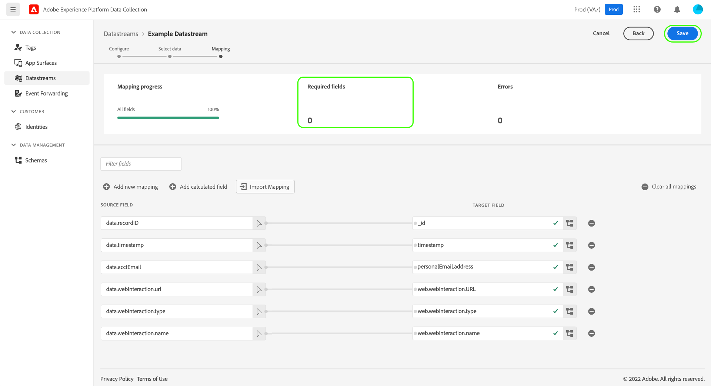

# Dataförberedelse för datainsamling

Data Prep är en Adobe Experience Platform-tjänst som gör att du kan mappa, omvandla och validera data till och från [Experience Data Model (XDM)](../xdm/home.md). När du konfigurerar en [datastream](./overview.md) som är aktiverad för plattformen kan du använda Data Prep-funktioner för att mappa dina källdata till XDM när du skickar dem till Platform Edge Network.

Alla data som skickas från en webbsida måste landas i Experience Platform som XDM. Det finns tre sätt att översätta data från ett datalager på en sida till den XDM som accepteras av Experience Platform:

1. Formatera om datalagret till XDM på själva webbsidan.
2. Använd funktionen för taggar för inbyggda dataelement för att formatera om en webbsidas befintliga datalagerformat till XDM.
3. Formatera om en webbsidas befintliga datalagerformat till XDM via Edge Network, med Data Prep för datainsamling.

Den här guiden fokuserar på det tredje alternativet.

## När dataprep ska användas för datainsamling {#when-to-use-data-prep}

Det finns två användningsområden där Data Prep för datainsamling är användbart:

1. Webbplatsen har ett välformat, styrt och underhållet datalager och det finns en inställning för att skicka det direkt till Edge Network i stället för att använda JavaScript-manipulering för att konvertera det till XDM på sidan (antingen via taggar eller via manuell manipulering av JavaScript).
2. Ett annat taggsystem än Taggar distribueras på webbplatsen.

## Skicka ett befintligt datalager till Edge Network via WebSDK {#send-datalayer-via-websdk}

Det befintliga datalagret måste skickas med objektet [`data`](/help/web-sdk/commands/sendevent/data.md) i kommandot `sendEvent`.

Om du använder taggar måste du använda fältet **[!UICONTROL Data]** för åtgärdstypen **[!UICONTROL Send Event]** enligt beskrivningen i [dokumentationen för Web SDK-taggtillägget](/help/tags/extensions/client/web-sdk/action-types.md).

Resten av guiden fokuserar på hur datalagret ska mappas till XDM-standarder när det har skickats av WebSDK.

>[!NOTE]
>
>Mer utförlig vägledning om alla funktioner för dataförberedelser, inklusive omformningsfunktioner för beräknade fält, finns i följande dokumentation:
>
>* [Översikt över dataprep](../data-prep/home.md)
>* [Funktioner för förprogrammering av data](../data-prep/functions.md)
>* [Hantera dataformat med Data Prep](../data-prep/data-handling.md)

Den här handboken beskriver hur du mappar data i användargränssnittet. Om du vill följa med i stegen börjar du med att skapa ett datastream upp till (och inkluderar) det [grundläggande konfigurationssteget](./overview.md#create).

En snabb demonstration av datainsamlingsprocessen finns i följande video:

>[!VIDEO](https://video.tv.adobe.com/v/342120?quality=12&enable10seconds=on&speedcontrol=on)

## [!UICONTROL Select data] {#select-data}

Välj **[!UICONTROL Save and Add Mapping]** när du har slutfört den grundläggande konfigurationen för ett datastream och steget **[!UICONTROL Select data]** visas. Härifrån måste du ange ett exempel på ett JSON-objekt som representerar strukturen för de data som du planerar att skicka till Platform.

Om du vill hämta egenskaper direkt från datalagret måste JSON-objektet ha en enda rotegenskap, `data`. Underegenskaperna för objektet `data` ska sedan konstrueras på ett sätt som mappar till de datalageregenskaper som du vill hämta. Markera avsnittet nedan om du vill visa ett exempel på ett korrekt formaterat JSON-objekt med en `data`-rot.

+++Exempel på JSON-fil med `data` rot

```json
{
  "data": {
    "eventMergeId": "cce1b53c-571f-4f36-b3c1-153d85be6602",
    "eventType": "view:load",
    "timestamp": "2021-09-30T14:50:09.604Z",
    "web": {
      "webPageDetails": {
        "siteSection": "Product section",
        "server": "example.com",
        "name": "product home",
        "URL": "https://www.example.com"
      },
      "webReferrer": {
        "URL": "https://www.adobe.com/index2.html",
        "type": "external"
      }
    },
    "commerce": {
      "purchase": 1,
      "order": {
        "orderID": "1234"
      }
    },
    "product": [
      {
        "productInfo": {
          "productID": "123"
        }
      },
      {
        "productInfo": {
          "productID": "1234"
        }
      }
    ],
    "reservation": {
      "id": "anc45123xlm",
      "name": "Embassy Suits",
      "SKU": "12345-L",
      "skuVariant": "12345-LG-R",
      "priceTotal": "112.99",
      "currencyCode": "USD",
      "adults": 2,
      "children": 3,
      "productAddMethod": "PDP",
      "_namespace": {
        "test": 1,
        "priceTotal": "112.99",
        "category": "Overnight Stay"
      },
      "freeCancellation": false,
      "cancellationFee": 20,
      "refundable": true
    }
  }
}
```

+++

Om du vill hämta egenskaper från ett XDM-objektdataelement gäller samma regler för JSON-objektet, men rotegenskapen måste anges som `xdm` i stället. Markera avsnittet nedan om du vill visa ett exempel på ett korrekt formaterat JSON-objekt med en `xdm`-rot.

+++Exempel på JSON-fil med `xdm` rot

```json
{
  "xdm": {
    "environment": {
      "type": "browser",
      "browserDetails": {
        "userAgent": "Mozilla/5.0 (Macintosh; Intel Mac OS X 10_7_5) AppleWebkit/537.36 (KHTML, like Gecko) Chrome/49.0.2623.112 Safari/537.36",
        "javaScriptEnabled": true,
        "javaScriptVersion": "1.8.5",
        "cookiesEnabled": true,
        "viewportHeight": 900,
        "viewportWidth": 1680,
        "javaEnabled": true
      },
      "domain": "adobe.com",
      "colorDepth": 24,
      "viewportHeight": 1050,
      "viewportWidth": 1680
    },
    "device": {
      "screenHeight": 1050,
      "screenWidth": 1680
    }
  }
}
```

+++

Du kan välja att överföra objektet som en fil eller klistra in raw-objektet i den angivna textrutan i stället. Om JSON är giltig visas ett förhandsgranskningsschema i den högra panelen. Välj **[!UICONTROL Next]** om du vill fortsätta.


>[!NOTE]
>
> Använd ett JSON-exempelobjekt som representerar alla datalagerelement som kan användas på alla sidor. Alla sidor använder till exempel inte lagerelement för kundvagnsdata. Men elementen i kundvagnsdatalagret bör inkluderas i det här JSON-exempelobjektet.

## [!UICONTROL Mapping]

Steg **[!UICONTROL Mapping]** visas, så att du kan mappa fälten i källdata till målhändelseschemat i Platform. Här kan du konfigurera mappningen på två sätt:

* [Skapa mappningsregler](#create-mapping) för den här datastream via en manuell process.
* [Importera mappningsregler](#import-mapping) från en befintlig datastream.

### Skapa mappningsregler {#create-mapping}

Om du vill skapa en mappningsregel väljer du **[!UICONTROL Add new mapping]**.


Markera källikonen () och markera det källfält som du vill mappa på den angivna arbetsytan i dialogrutan som visas. När du har valt ett fält använder du knappen **[!UICONTROL Select]** för att fortsätta.


Välj sedan schemaikonen () för att öppna en liknande dialogruta för målhändelseschemat. Välj det fält som du vill mappa data till innan du bekräftar med **[!UICONTROL Select]**.


Mappningssidan visas igen med den ifyllda fältmappningen. Avsnittet **[!UICONTROL Mapping progress]** uppdateras för att återspegla det totala antalet fält som har mappats.


>[!TIP]
>
>Om du vill mappa en array med objekt (i källfältet) till en array med olika objekt (i målfältet) lägger du till `[*]` efter arraynamnet i käll- och målfältssökvägarna, vilket visas nedan.
>
>

### Importera befintliga mappningsregler {#import-mapping}

Om du tidigare har skapat en datastream kan du återanvända dess konfigurerade mappningsregler för en ny datastream.

>[!WARNING]
>
>Om du importerar mappningsregler från en annan datastream skrivs eventuella fältmappningar som du har lagt till före importen över.

Välj **[!UICONTROL Import Mapping]** om du vill starta.


I den dialogruta som visas markerar du datastream vars mappningsregler du vill importera. Välj **[!UICONTROL Preview]** när du har valt datastream.


>[!NOTE]
>
>Datastreams kan bara importeras inom samma [sandlåda](../sandboxes/home.md). Du kan alltså inte importera ett datastam från en sandlåda till en annan.

På nästa skärm visas en förhandsvisning av de sparade mappningsreglerna för det valda datastream. Kontrollera att de visade mappningarna är vad du förväntar dig och välj sedan **[!UICONTROL Import]** för att bekräfta och lägga till mappningarna i den nya datastream.


>[!NOTE]
>
>Om något av källfälten i de importerade mappningsreglerna inte ingår i JSON-exempeldata som du [angav tidigare](#select-data) inkluderas inte dessa fältmappningar i importen.

### Slutför mappningen

Följ stegen ovan för att mappa resten av fälten till målschemat. Även om du inte behöver mappa alla tillgängliga källfält, måste alla fält i målschemat som har angetts som obligatoriska mappas för att slutföra det här steget. Räknaren **[!UICONTROL Required fields]** anger hur många obligatoriska fält som ännu inte har mappats i den aktuella konfigurationen.

När det obligatoriska fältantalet har nått noll och du är nöjd med mappningen väljer du **[!UICONTROL Save]** för att slutföra ändringarna.



## Nästa steg

I den här guiden beskrivs hur du mappar data till XDM när du konfigurerar ett datastream i användargränssnittet. Om du följde den allmänna datastreams-självstudiekursen kan du nu gå tillbaka till steget [Visa datastream-information](./overview.md).
