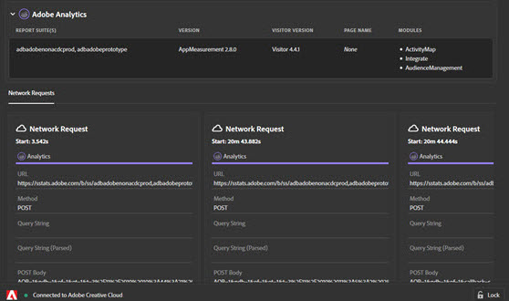

# Fliken Nätverk

Fliken **Nätverk** samlar alla Adobe Experience Cloud-lösningsanrop som gjorts på sidan och visar dem i ordning från vänster till höger. Standardparametrar etiketteras automatiskt med egna namn och ordnas för att gruppera gemensamma parametrar i samma roll.

Den här skärmen är användbar när du vill jämföra nyckelvärdepar i olika träffar. Du kan bekräfta att de parametrar som används för integreringar, till exempel Experience Cloud Visitor-ID eller Kompletterande data-ID, är konsekventa för alla integreringar.

>[!NOTE]
>
>I nuläget visas inte alla parametrar som skickas i lösningsanrop (till exempel kontextvariabler för Analytics, anpassade målparametrar eller kundID:n för Experience Cloud ID-tjänsten) på nätverksskärmen.

Om du vill ändra information per lösning väljer du den lösning du vill visa i listan i det vänstra navigeringsfältet. Följande exempel filtreras så att endast Analytics visas:

Om du vill återgå till att visa alla lösningar väljer du **[!UICONTROL Network]**

Markera ett objekt i nätverksvyn om du vill visa en utökad vy. I det utökade visningsfönstret kan du kopiera den information som visas till Urklipp.

<!--Use the icon at the top of each column to copy the server call URL to your clipboard, where you can paste it into another document for reference or debugging purposes.

-->

Om du vill rensa listan väljer du **[!UICONTROL Remove Events]**.

Om du vill hämta en Excel-fil som innehåller informationen på den här skärmen väljer du **[!UICONTROL Download]**.
