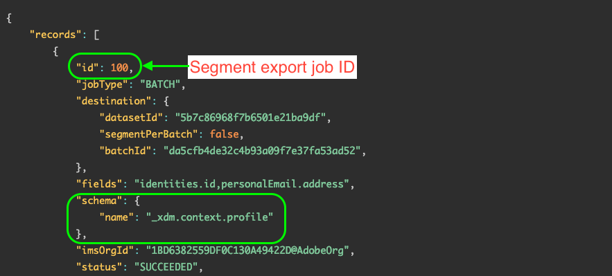

# Aktivera målgrupper on demand till batchmål via ad hoc-aktiverings-API

>[!IMPORTANT]
>
>När betaversionen är klar [!DNL ad-hoc activation API] är nu allmänt tillgängligt (GA) för alla Experience Platform-kunder. I GA-versionen har API uppgraderats till version 2. Steg 4 ([Hämta det senaste målgruppens exportjobb-ID](#segment-export-id)) krävs inte längre eftersom API:t inte längre kräver export-ID:t.
>
>Se [Kör ad hoc-aktiveringsjobbet](#activation-job) mer information finns nedan i den här självstudiekursen.

## Översikt {#overview}

Med API:t för ad hoc-aktivering kan marknadsförarna programmatiskt aktivera målgrupper till destinationer på ett snabbt och effektivt sätt i situationer där omedelbar aktivering krävs.

Använd ad hoc-aktiverings-API:t för att exportera hela filer till det önskade filmottagningssystemet. Ad hoc-målgruppsaktivering stöds endast av [gruppfilsbaserade mål](../destination-types.md#file-based).

Bilden nedan visar det kompletta arbetsflödet för att aktivera målgrupper via ad hoc-aktiverings-API:t, inklusive segmenteringsjobben som äger rum i Platform var 24:e timme.


## Användningsfall {#use-cases}

### Försäljning eller kampanjer i Flash

En webbutik förbereder en begränsad försäljning och vill meddela kunderna med kort varsel. Via Experience Platform ad hoc-aktiverings-API:t kan marknadsföringsteamet exportera målgrupper on-demand och snabbt skicka e-postreklam till kundbasen.

### Aktuella event eller senaste nytt

Ett hotell förväntar sig ett infallsväder de kommande dagarna och teamet vill snabbt informera de ankommande gästerna så att de kan planera därefter. Marknadsföringsteamet kan använda Experience Platform ad hoc-aktiverings-API för att exportera målgrupper on-demand och meddela gästerna.

### Integrationstestning

IT-chefer kan använda Experience Platform ad hoc-aktiverings-API för att exportera målgrupper on-demand, så att de kan testa sin anpassade integrering med Adobe Experience Platform och se till att allt fungerar som det ska.

## Guardrails {#guardrails}

Tänk på följande skyddsutkast när du använder API:t för ad hoc-aktivering.

* För närvarande kan varje ad hoc-aktiveringsjobb aktivera upp till 80 målgrupper. Om du försöker aktivera fler än 80 målgrupper per jobb misslyckas jobbet. Detta beteende kan komma att ändras i framtida versioner.
* Ad hoc-aktiveringsjobb kan inte köras parallellt med schemalagda [målgrupper exporterar jobb](../../segmentation/api/export-jobs.md). Innan du kör ett ad hoc-aktiveringsjobb kontrollerar du att det schemalagda målgruppsexportjobbet har slutförts. Se [övervakning av måldataflöde](../../dataflows/ui/monitor-destinations.md) för information om hur man övervakar status för aktiveringsflöden. Om t.ex. aktiveringsdataflödet visar en **[!UICONTROL Processing]** status, vänta tills den är klar innan du kör ad hoc-aktiveringsjobbet.
* Kör inte fler än ett samtidiga ad hoc-aktiveringsjobb per målgrupp.

## Segmentering {#segmentation-considerations}

Adobe Experience Platform kör schemalagda segmenteringsjobb en gång var 24:e timme. API:t för ad hoc-aktivering körs baserat på de senaste segmenteringsresultaten.

## Steg 1: Förutsättningar {#prerequisites}

Innan du kan ringa anrop till Adobe Experience Platform API:er måste du kontrollera att du uppfyller följande krav:

* Du har ett organisationskonto med tillgång till Adobe Experience Platform.
* Ditt Experience Platform-konto har `developer` och `user` roller har aktiverats för Adobe Experience Platform API-produktprofilen. Kontakta [Admin Console](../../access-control/home.md) administratör för att aktivera de här rollerna för ditt konto.
* Du har en Adobe ID. Om du inte har någon Adobe ID går du till [Adobe Developer Console](https://developer.adobe.com/console) och skapa ett nytt konto.

## Steg 2: Samla in inloggningsuppgifter {#credentials}

För att kunna ringa anrop till plattforms-API:er måste du först slutföra [självstudiekurs om autentisering](https://www.adobe.com/go/platform-api-authentication-en). När du slutför självstudiekursen för autentisering visas värdena för var och en av de obligatoriska rubrikerna i alla API-anrop för Experience Platform, vilket visas nedan:

* Behörighet: Bearer `{ACCESS_TOKEN}`
* x-api-key: `{API_KEY}`
* x-gw-ims-org-id: `{ORG_ID}`

Resurser i Experience Platform kan isoleras till specifika virtuella sandlådor. I förfrågningar till plattforms-API:er kan du ange namnet och ID:t för sandlådan som åtgärden ska utföras i. Dessa är valfria parametrar.

* x-sandbox-name: `{SANDBOX_NAME}`

>[!NOTE]
>
>Mer information om sandlådor i Experience Platform finns i [översiktsdokumentation för sandlåda](../../sandboxes/home.md).

Alla begäranden som innehåller en nyttolast (POST, PUT, PATCH) kräver ytterligare en medietypsrubrik:

* Innehållstyp: `application/json`

## Steg 3: Skapa aktiveringsflöde i plattformsgränssnittet {#activation-flow}

Innan du kan aktivera målgrupper via API:t för ad hoc-aktivering måste du först ha ett aktiveringsflöde konfigurerat i plattformsgränssnittet för det valda målet.

Detta innefattar att starta aktiveringsarbetsflödet, välja målgrupper, konfigurera ett schema och aktivera dem. Du kan använda gränssnittet eller API:t för att skapa ett aktiveringsflöde:

* [Använd användargränssnittet för plattformen för att skapa ett aktiveringsflöde för att batchprofilera exportdestinationer](../ui/activate-batch-profile-destinations.md)
* [Använd API:t för Flow Service för att ansluta till exportmål för batchprofiler och aktivera data](../api/connect-activate-batch-destinations.md)

## Steg 4: Hämta det senaste målgruppens exportjobb-ID (krävs inte i v2) {#segment-export-id}

>[!IMPORTANT]
>
>I version 2 av API:t för ad hoc-aktivering behöver du inte skaffa det senaste ID:t för målgruppsexport. Du kan hoppa över det här steget och fortsätta till nästa.

När du har konfigurerat ett aktiveringsflöde för batchdestinationen börjar schemalagda segmenteringsjobb automatiskt att köras var 24:e timme.

Innan du kan köra ad hoc-aktiveringsjobbet måste du skaffa ID:t för det senaste målgruppsexportjobbet. Du måste skicka detta ID i ad hoc-aktiveringsjobbbegäran.

Följ instruktionerna som beskrivs [här](../../segmentation/api/export-jobs.md#retrieve-list) för att hämta en lista över alla målgruppsexportjobb.

I svaret söker du efter den första posten som innehåller schemaegenskapen nedan.

```
"schema":{
   "name":"_xdm.context.profile"
}
```

Målgruppens exportjobb-ID finns i `id` -egenskap, enligt nedan.




## Steg 5: Kör ad hoc-aktiveringsjobbet {#activation-job}

Adobe Experience Platform kör schemalagda segmenteringsjobb en gång var 24:e timme. API:t för ad hoc-aktivering körs baserat på de senaste segmenteringsresultaten.

>[!IMPORTANT]
>
>Observera följande engångsbegränsning: Innan du kör ett ad hoc-aktiveringsjobb måste du se till att det har gått minst 20 minuter från det att målgruppen först aktiverades enligt det schema du angav i [Steg 3 - Skapa aktiveringsflöde i plattformsgränssnittet](#activation-flow).

Innan du kör ett ad hoc-aktiveringsjobb kontrollerar du att det schemalagda målgruppsexportjobbet för dina målgrupper är klart. Se [övervakning av måldataflöde](../../dataflows/ui/monitor-destinations.md) för information om hur man övervakar status för aktiveringsflöden. Om t.ex. aktiveringsdataflödet visar en **[!UICONTROL Processing]** status, vänta tills den är klar innan du kör ad hoc-aktiveringsjobbet för att exportera en fullständig fil.

När målgruppens exportjobb är klart kan du aktivera det.

>[!NOTE]
>
>För närvarande kan varje ad hoc-aktiveringsjobb aktivera upp till 80 målgrupper. Om du försöker aktivera fler än 80 målgrupper per jobb misslyckas jobbet. Detta beteende kan komma att ändras i framtida versioner.

### Begäran {#request}

>[!IMPORTANT]
>
>Det är obligatoriskt att inkludera `Accept: application/vnd.adobe.adhoc.activation+json; version=2` huvud i din begäran för att kunna använda v2 av API:t för ad hoc-aktivering.

```shell
curl --location --request POST 'https://platform.adobe.io/data/core/activation/disflowprovider/adhocrun' \
--header 'x-gw-ims-org-id: 5555467B5D8013E50A494220@AdobeOrg' \
--header 'Authorization: Bearer {{token}}' \
--header 'x-sandbox-id: 6ef74723-3ee7-46a4-b747-233ee7a6a41a' \
--header 'x-sandbox-name: {sandbox-id}' \
--header 'Accept: application/vnd.adobe.adhoc.activation+json; version=2' \
--header 'Content-Type: application/json' \
--data-raw '{
   "activationInfo":{
      "destinationId1":[
         "segmentId1",
         "segmentId2"
      ],
      "destinationId2":[
         "segmentId2",
         "segmentId3"
      ]
   }
}'
```

| Egenskap | Beskrivning |
| -------- | ----------- |
| <ul><li>`destinationId1`</li><li>`destinationId2`</li></ul> | ID:n för de målinstanser som du vill aktivera målgrupper för. Du kan hämta dessa ID:n från plattformsgränssnittet genom att navigera till **[!UICONTROL Destinations]** > **[!UICONTROL Browse]** och klicka på önskad målrad för att visa mål-ID:t i den högra listen. Mer information finns i [dokumentation om målarbetsyta](/help/destinations/ui/destinations-workspace.md#browse). |
| <ul><li>`segmentId1`</li><li>`segmentId2`</li><li>`segmentId3`</li></ul> | ID:n för de målgrupper som du vill aktivera till det valda målet. |

{style="table-layout:auto"}

### Begäran med export-ID:n (ska bli inaktuell) {#request-deprecated}

>[!IMPORTANT]
>
>**Undertryckt begärandetyp**. Den här exempeltypen beskriver begärandetypen för API-version 1. I version 2 av API:t för ad hoc-aktivering behöver du inte inkludera det senaste ID:t för målgruppsexportjobbet.

```shell
curl -X POST https://platform.adobe.io/data/core/activation/disflowprovider/adhocrun \
 -H 'Authorization: Bearer {ACCESS_TOKEN}' \
 -H 'Content-Type: application/json' \
 -H 'x-gw-ims-org-id: {ORG_ID}' \
 -H 'x-api-key: {API_KEY}' \
 -d '
{
   "activationInfo":{
      "destinationId1":[
         "segmentId1",
         "segmentId2"
      ],
      "destinationId2":[
         "segmentId2",
         "segmentId3"
      ]
   },
   "exportIds":[
      "exportId1"
   ]
}
```

| Egenskap | Beskrivning |
| -------- | ----------- |
| <ul><li>`destinationId1`</li><li>`destinationId2`</li></ul> | ID:n för de målinstanser som du vill aktivera målgrupper för. Du kan hämta dessa ID:n från plattformsgränssnittet genom att navigera till **[!UICONTROL Destinations]** > **[!UICONTROL Browse]** och klicka på önskad målrad för att visa mål-ID:t i den högra listen. Mer information finns i [dokumentation om målarbetsyta](/help/destinations/ui/destinations-workspace.md#browse). |
| <ul><li>`segmentId1`</li><li>`segmentId2`</li><li>`segmentId3`</li></ul> | ID:n för de målgrupper som du vill aktivera till det valda målet. |
| <ul><li>`exportId1`</li></ul> | Det ID som returnerades i svaret från [målexport](../../segmentation/api/export-jobs.md#retrieve-list) jobb. Se [Steg 4: Hämta det senaste målgruppens exportjobb-ID](#segment-export-id) för instruktioner om hur du hittar detta ID. |

{style="table-layout:auto"}

### Svar {#response}

Ett lyckat svar returnerar HTTP-status 200.

```shell
{
   "order":[
      {
         "segment":"db8961e9-d52f-45bc-b3fb-76d0382a6851",
         "order":"ef2dcbd6-36fc-49a3-afed-d7b8e8f724eb",
         "statusURL":"https://platform.adobe.io/data/foundation/flowservice/runs/88d6da63-dc97-460e-b781-fc795a7386d9"
      }
   ]
}
```

| Egenskap | Beskrivning |
| -------- | ----------- |
| `segment` | ID för den aktiverade målgruppen. |
| `order` | ID för destinationen som målgruppen aktiverades på. |
| `statusURL` | Status-URL för aktiveringsflödet. Du kan följa flödets förlopp med [API för flödestjänst](../../sources/tutorials/api/monitor.md). |

{style="table-layout:auto"}

## API-felhantering {#api-error-handling}

Destination SDK-API-slutpunkter följer de allmänna felmeddelandeprinciperna för Experience Platform API. Se [API-statuskoder](../../landing/troubleshooting.md#api-status-codes) och [fel i begäranhuvudet](../../landing/troubleshooting.md#request-header-errors) i felsökningsguiden för plattformen.

### API-felkoder och meddelanden som är specifika för API:t för ad hoc-aktivering {#specific-error-messages}

När du använder API:t för ad hoc-aktivering kan du få felmeddelanden som är specifika för denna API-slutpunkt. Granska tabellen för att förstå hur de ska adresseras när de visas.

| Felmeddelande | Upplösning |
|---------|----------|
| Kör redan för att hitta rätt målgrupp `segment ID` för order `dataflow ID` med körnings-ID `flow run ID` | Det här felmeddelandet anger att ett ad hoc-aktiveringsflöde pågår för en viss målgrupp. Vänta tills jobbet är klart innan aktiveringsjobbet aktiveras igen. |
| Segment `<segment name>` är inte en del av detta dataflöde eller ligger utanför schemaintervallet! | Det här felmeddelandet anger att de målgrupper du har valt att aktivera inte är mappade till dataflödet eller att aktiveringsschemat som har konfigurerats för målgrupperna antingen har upphört att gälla eller inte har startats ännu. Kontrollera om målgruppen verkligen är mappad till dataflödet och kontrollera att målgruppens aktiveringsplan överlappar dagens datum. |

## Relaterad information {#related-information}

* [Anslut till gruppmål och aktivera data med API:t för Flow Service](/help/destinations/api/connect-activate-batch-destinations.md)
* [(Beta) Exportera filer on demand till gruppmål med hjälp av användargränssnittet i Experience Platform](/help/destinations/ui/export-file-now.md)