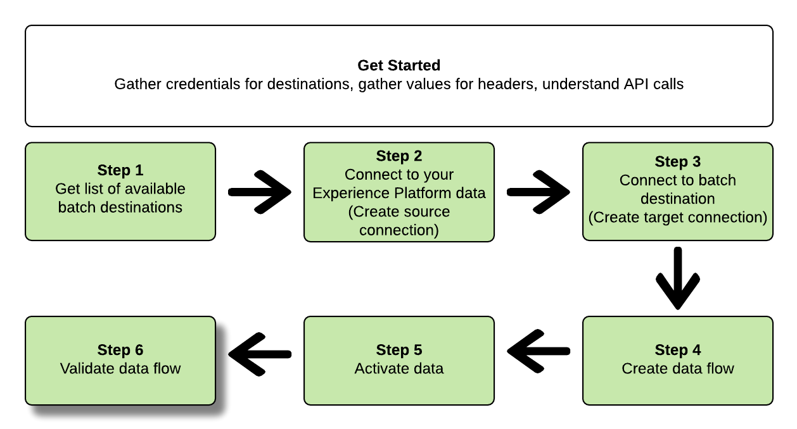

# Anslut till gruppmål och aktivera data med API:t för Flow Service

>[!IMPORTANT]
> 
>Om du vill ansluta till ett mål behöver du **[!UICONTROL Manage Destinations]** [åtkomstkontrollbehörighet](/help/access-control/home.md#permissions).
>
>Om du vill aktivera data måste du ha **[!UICONTROL Manage Destinations]**, **[!UICONTROL Activate Destinations]**, **[!UICONTROL View Profiles]** och **[!UICONTROL View Segments]** [behörigheter för åtkomstkontroll](/help/access-control/home.md#permissions).
>
>Läs [åtkomstkontroll - översikt](/help/access-control/ui/overview.md) eller kontakta produktadministratören för att få de behörigheter som krävs.

I den här självstudien visas hur du använder API:t för Flow Service för att skapa en batch [molnlagring](../catalog/cloud-storage/overview.md) eller [e-postmarknadsföringsmål](../catalog/email-marketing/overview.md), skapa ett dataflöde till det nya målet och exportera data till det nya målet via CSV-filer.

I den här självstudiekursen används [!DNL Adobe Campaign] mål i alla exempel, men stegen är identiska för alla gruppmolnlagring och e-postmarknadsföringsmål.


Om du föredrar att använda användargränssnittet för plattformen för att ansluta till ett mål och aktivera data finns mer information i [Anslut ett mål](../ui/connect-destination.md) och [Aktivera målgruppsdata för att batchprofilera exportmål](../ui/activate-batch-profile-destinations.md) självstudiekurser.

## Komma igång {#get-started}

Handboken kräver en fungerande förståelse av följande komponenter i Adobe Experience Platform:

* [[!DNL Experience Data Model (XDM) System]](../../xdm/home.md): Det standardiserade ramverk som [!DNL Experience Platform] organiserar kundupplevelsedata.
* [[!DNL Segmentation Service]](../../segmentation/api/overview.md): [!DNL Adobe Experience Platform Segmentation Service] kan ni skapa segment och generera målgrupper i [!DNL Adobe Experience Platform] från [!DNL Real-Time Customer Profile] data.
* [[!DNL Sandboxes]](../../sandboxes/home.md): [!DNL Experience Platform] innehåller virtuella sandlådor som partitionerar en enda [!DNL Platform] till separata virtuella miljöer för att utveckla och utveckla applikationer för digitala upplevelser.

I följande avsnitt finns ytterligare information som du behöver känna till för att kunna aktivera data till batchdestinationer i Platform.

### Samla in nödvändiga inloggningsuppgifter {#gather-required-credentials}

Om du vill slutföra stegen i den här självstudiekursen bör du ha följande autentiseringsuppgifter klara, beroende på vilken typ av mål du ansluter och aktiverar segment till.

* För [!DNL Amazon S3] anslutningar: `accessId`, `secretKey`
* För [!DNL Amazon S3] anslutningar till [!DNL Adobe Campaign]: `accessId`, `secretKey`
* För SFTP-anslutningar: `domain`, `port`, `username`, `password` eller `sshKey` (beroende på anslutningsmetoden till FTP-platsen)
* För [!DNL Azure Blob] anslutningar: `connectionString`

>[!NOTE]
>
>Autentiseringsuppgifterna `accessId`, `secretKey` for [!DNL Amazon S3] anslutningar och `accessId`, `secretKey` for [!DNL Amazon S3] anslutningar till [!DNL Adobe Campaign] är identiska.

### Läser exempel-API-anrop {#reading-sample-api-calls}

I den här självstudiekursen finns exempel-API-anrop som visar hur du formaterar dina begäranden. Det kan vara sökvägar, obligatoriska rubriker och korrekt formaterade begärandenyttolaster. Ett exempel på JSON som returneras i API-svar finns också. Information om konventionerna som används i dokumentationen för exempel-API-anrop finns i avsnittet om [läsa exempel-API-anrop](../../landing/troubleshooting.md#how-do-i-format-an-api-request) i [!DNL Experience Platform] felsökningsguide.

### Samla in värden för obligatoriska och valfria rubriker {#gather-values-headers}

För att ringa [!DNL Platform] API:er måste du först slutföra [självstudiekurs om autentisering](https://www.adobe.com/go/platform-api-authentication-en). När du är klar med självstudiekursen för autentisering visas värdena för var och en av de obligatoriska rubrikerna i alla [!DNL Experience Platform] API-anrop enligt nedan:

* Behörighet: Bearer `{ACCESS_TOKEN}`
* x-api-key: `{API_KEY}`
* x-gw-ims-org-id: `{ORG_ID}`

Resurser i [!DNL Experience Platform] kan isoleras till specifika virtuella sandlådor. I förfrågningar till [!DNL Platform] API:er kan du ange namn och ID för sandlådan som åtgärden ska utföras i. Dessa är valfria parametrar.

* x-sandbox-name: `{SANDBOX_NAME}`

>[!NOTE]
>
>Mer information om sandlådor i [!DNL Experience Platform], se [översiktsdokumentation för sandlåda](../../sandboxes/home.md).

Alla begäranden som innehåller en nyttolast (POST, PUT, PATCH) kräver ytterligare en medietypsrubrik:

* Innehållstyp: `application/json`

### API-referensdokumentation {#api-reference-documentation}

Du hittar referensdokumentation för alla API-åtgärder i den här självstudiekursen. Se [API-dokumentation för Flow Service på Adobe I/O](https://www.adobe.io/experience-platform-apis/references/flow-service/). Vi rekommenderar att du använder den här självstudiekursen och API-referensdokumentationen parallellt.

## Hämta listan över tillgängliga mål {#get-the-list-of-available-destinations}


Som ett första steg bör du bestämma vilket mål som data ska aktiveras till. Börja med att ringa ett samtal för att begära en lista över tillgängliga mål som du kan ansluta och aktivera segment till. Utför följande GET-förfrågan till `connectionSpecs` slutpunkt för att returnera en lista över tillgängliga destinationer:

**API-format**

```http
GET /connectionSpecs
```

**Begäran**

```shell
curl --location --request GET 'https://platform.adobe.io/data/foundation/flowservice/connectionSpecs' \
--header 'accept: application/json' \
--header 'x-gw-ims-org-id: {ORG_ID}' \
--header 'x-api-key: {API_KEY}' \
--header 'x-sandbox-name: {SANDBOX_NAME}' \
--header 'Authorization: Bearer {ACCESS_TOKEN}'
```


**Svar**

Ett lyckat svar innehåller en lista över tillgängliga destinationer och deras unika identifierare (`id`). Lagra värdet för destinationen som du tänker använda, vilket krävs i ytterligare steg. Om du till exempel vill ansluta och leverera segment till [!DNL Adobe Campaign]söker du efter följande utdrag i svaret:

```json
{
    "id": "0b23e41a-cb4a-4321-a78f-3b654f5d7d97",
  "name": "Adobe Campaign",
  ...
  ...
}
```

Tabellen nedan innehåller anslutningsspecifikations-ID:n för vanliga gruppmål:

| Destination | Anslutningsspecifikation-ID |
---------|----------|
| [!DNL Adobe Campaign] | `0b23e41a-cb4a-4321-a78f-3b654f5d7d97` |
| [!DNL Amazon S3] | `4890fc95-5a1f-4983-94bb-e060c08e3f81` |
| [!DNL Azure Blob] | `e258278b-a4cf-43ac-b158-4fa0ca0d948b` |
| [!DNL Oracle Eloqua] | `c1e44b6b-e7c8-404b-9031-58f0ef760604` |
| [!DNL Oracle Responsys] | `a5e28ddf-e265-426e-83a1-9d03a3a6822b` |
| [!DNL Salesforce Marketing Cloud] | `f599a5b3-60a7-4951-950a-cc4115c7ea27` |
| SFTP | `64ef4b8b-a6e0-41b5-9677-3805d1ee5dd0` |

{style=&quot;table-layout:auto&quot;}

## Anslut till [!DNL Experience Platform] data {#connect-to-your-experience-platform-data}


Sedan måste du ansluta till [!DNL Experience Platform] så att du kan exportera profildata och aktivera dem på det önskade målet. Detta består av två ämnen som beskrivs nedan.

1. Först måste du ringa för att ge behörighet till dina data i [!DNL Experience Platform]genom att konfigurera en basanslutning.
2. Använd sedan basanslutnings-ID för att ringa ett annat samtal där du skapar en *källanslutning*, som upprättar anslutningen till [!DNL Experience Platform] data.

### Ge åtkomst till dina data i [!DNL Experience Platform]

**API-format**

```http
POST /connections
```

**Begäran**

```shell
curl --location --request POST 'https://platform.adobe.io/data/foundation/flowservice/connections' \
--header 'Authorization: Bearer {ACCESS_TOKEN}' \
--header 'x-api-key: {API_KEY}' \
--header 'x-gw-ims-org-id: {ORG_ID}' \
--header 'x-sandbox-name: {SANDBOX_NAME}' \
--header 'Content-Type: application/json' \
--data-raw '{
            "name": "Base connection to Experience Platform",
            "description": "This call establishes the connection to Experience Platform data",
            "connectionSpec": {
                "id": "{CONNECTION_SPEC_ID}",
                "version": "1.0"
            }
}'
```

| Egenskap | Beskrivning |
| --------- | ----------- |
| `name` | Ange ett namn för basanslutningen till Experience Platform [!DNL Profile Store]. |
| `description` | Du kan också ange en beskrivning för basanslutningen. |
| `connectionSpec.id` | Använd anslutningsspec-ID för [Experience Platform Profile Store](/help/profile/home.md#profile-data-store) - `8a9c3494-9708-43d7-ae3f-cda01e5030e1`. |

{style=&quot;table-layout:auto&quot;}

**Svar**

Ett godkänt svar innehåller basanslutningens unika identifierare (`id`). Lagra det här värdet som det behövs i nästa steg för att skapa källanslutningen.

```json
{
    "id": "1ed86558-59b5-42f7-9865-5859b552f7f4"
}
```

### Anslut till [!DNL Experience Platform] data {#connect-to-platform-data}

**API-format**

```http
POST /sourceConnections
```

**Begäran**

```shell
curl --location --request POST 'https://platform.adobe.io/data/foundation/flowservice/sourceConnections' \
--header 'Authorization: Bearer {ACCESS_TOKEN}' \
--header 'x-api-key: {API_KEY}' \
--header 'x-gw-ims-org-id: {ORG_ID}' \
--header 'x-sandbox-name: {SANDBOX_NAME}' \
--header 'Content-Type: application/json' \
--data-raw '{
            "name": "Connecting to Profile Store",
            "description": "Optional",
            "connectionSpec": {
                "id": "{CONNECTION_SPEC_ID}",
                "version": "1.0"
            },
            "baseConnectionId": "{BASE_CONNECTION_ID}",
            "data": {
                "format": "CSV",
                "schema": null
            },
            "params" : {}
}'
```

| Egenskap | Beskrivning |
| --------- | ----------- |
| `name` | Ange ett namn för källanslutningen till Experience Platform [!DNL Profile Store]. |
| `description` | Du kan också ange en beskrivning för källanslutningen. |
| `connectionSpec.id` | Använd anslutningsspec-ID för [Experience Platform Profile Store](/help/profile/home.md#profile-data-store) - `8a9c3494-9708-43d7-ae3f-cda01e5030e1`. |
| `baseConnectionId` | Använd det grundläggande anslutnings-ID som du fick i föregående steg. |
| `data.format` | `CSV` är för närvarande det enda filexportformat som stöds. |

{style=&quot;table-layout:auto&quot;}

**Svar**

Ett godkänt svar returnerar den unika identifieraren (`id`) för den nyligen skapade källanslutningen till [!DNL Profile Store]. Detta bekräftar att du har anslutit till [!DNL Experience Platform] data. Lagra det här värdet som det behövs i ett senare steg.

```json
{
    "id": "ed48ae9b-c774-4b6e-88ae-9bc7748b6e97"
}
```

## Anslut till batchdestination {#connect-to-batch-destination}


I det här steget skapar du en anslutning till det batchmolnlagringsutrymme eller e-postmarknadsföringsmål som du vill använda. Detta består av två ämnen som beskrivs nedan.

1. Först måste du ringa för att auktorisera åtkomst till målplattformen genom att konfigurera en basanslutning.
2. Sedan gör du ett nytt anrop där du skapar en *målanslutning*, som anger platsen på lagringskontot där de exporterade datafilerna ska levereras samt formatet på de data som ska exporteras.

### Auktorisera åtkomst till batchmålet {#authorize-access-to-batch-destination}

**API-format**

```http
POST /connections
```

**Begäran**

Begäran nedan upprättar en basanslutning till [!DNL Adobe Campaign] destinationer. Beroende på lagringsplatsen som du vill exportera filer till ([!DNL Amazon S3], SFTP, [!DNL Azure Blob]), `auth` och ta bort de andra.

```shell
curl --location --request POST 'https://platform.adobe.io/data/foundation/flowservice/connections' \
--header 'Authorization: Bearer {ACCESS_TOKEN}' \
--header 'x-api-key: {API_KEY}' \
--header 'x-gw-ims-org-id: {ORG_ID}' \
--header 'x-sandbox-name: {SANDBOX_NAME}' \
--header 'Content-Type: application/json' \
--data-raw '{
    "name": "S3 Connection for Adobe Campaign",
    "description": "summer advertising campaign",
    "connectionSpec": {
        "id": "0b23e41a-cb4a-4321-a78f-3b654f5d7d97",
        "version": "1.0"
    },
    "auth": {
        "specName": "S3",
        "params": {
            "accessId": "{ACCESS_ID}",
            "secretKey": "{SECRET_KEY}"
        }
    }
    "auth": {
        "specName": "SFTP with Password",
        "params": {
            "domain": "{DOMAIN}",
            "host": "{HOST}",
            "username": "{USERNAME}",
            "password": "{PASSWORD}"
        }
    }
    "auth": {
        "specName": "SFTP with SSH Key",
        "params": {
            "domain": "{DOMAIN}",
            "host": "{HOST}",
            "username": "{USERNAME}",
            "sshKey": "{SSH_KEY}"
        }
    }        
    "auth": {
        "specName": "Azure Blob",
        "params": {
            "connectionString": "{AZURE_BLOB_CONNECTION_STRING}"
        }
    }    
}'
```

Se exempelbegärandena nedan för att ansluta till andra batchmolnlagringsmedier och e-postmarknadsföringsmål som stöds.

+++ Exempelbegäran att ansluta till [!DNL Amazon S3] mål

Begäran nedan upprättar en basanslutning till [!DNL Amazon S3] destinationer.

```shell
curl --location --request POST 'https://platform.adobe.io/data/foundation/flowservice/connections' \
--header 'Authorization: Bearer {ACCESS_TOKEN}' \
--header 'x-api-key: {API_KEY}' \
--header 'x-gw-ims-org-id: {ORG_ID}' \
--header 'x-sandbox-name: {SANDBOX_NAME}' \
--header 'Content-Type: application/json' \
--data-raw '{
    "name": "Connect to Amazon S3",
    "description": "summer advertising campaign",
    "connectionSpec": {
        "id": "4890fc95-5a1f-4983-94bb-e060c08e3f81",
        "version": "1.0"
    },
    "auth": {
        "specName": "Access Key",
        "params": {
            "s3AccessKey": "{AMAZON_S3_ACCESS_KEY}",
            "s3SecretKey": "{AMAZON_S3_SECRET_KEY}"
        }
    }
}'
```

+++

+++ Exempelbegäran att ansluta till [!DNL Azure Blob] mål

Begäran nedan upprättar en basanslutning till [!DNL Azure Blob] destinationer.

```shell
curl --location --request POST 'https://platform.adobe.io/data/foundation/flowservice/connections' \
--header 'Authorization: Bearer {ACCESS_TOKEN}' \
--header 'x-api-key: {API_KEY}' \
--header 'x-gw-ims-org-id: {ORG_ID}' \
--header 'x-sandbox-name: {SANDBOX_NAME}' \
--header 'Content-Type: application/json' \
--data-raw '{
    "name": "Connect to Azure Blob",
    "description": "Summer advertising campaign",
    "connectionSpec": {
        "id": "e258278b-a4cf-43ac-b158-4fa0ca0d948b",
        "version": "1.0"
    },
    "auth": {
        "specName": "ConnectionString",
        "params": {
            "connectionString": "{AZURE_BLOB_CONNECTION_STRING}"
        }
    }
}'
```

+++

+++ Exempelbegäran att ansluta till [!DNL Oracle Eloqua] mål

Begäran nedan upprättar en basanslutning till [!DNL Oracle Eloqua] destinationer. Beroende på den lagringsplats dit du vill exportera filer till bör du behålla lämplig `auth` och ta bort de andra.

```shell
curl --location --request POST 'https://platform.adobe.io/data/foundation/flowservice/connections' \
--header 'Authorization: Bearer {ACCESS_TOKEN}' \
--header 'x-api-key: {API_KEY}' \
--header 'x-gw-ims-org-id: {ORG_ID}' \
--header 'x-sandbox-name: {SANDBOX_NAME}' \
--header 'Content-Type: application/json' \
--data-raw '{
    "name": "Connect to Eloqua destination",
    "description": "summer advertising campaign",
    "connectionSpec": {
        "id": "c1e44b6b-e7c8-404b-9031-58f0ef760604",
        "version": "1.0"
    },
    "auth": {
        "specName": "SFTP with Password",
        "params": {
            "domain": "{DOMAIN}",
            "host": "{HOST}",
            "username": "{USERNAME}",
            "password": "{PASSWORD}"
        }
    }
    "auth": {
        "specName": "SFTP with SSH Key",
        "params": {
            "domain": "{DOMAIN}",
            "host": "{HOST}",
            "username": "{USERNAME}",
            "sshKey": "{SSH_KEY}"
        }
    }    
}'
```

+++

+++ Exempelbegäran att ansluta till [!DNL Oracle Responsys] mål

Begäran nedan upprättar en basanslutning till [!DNL Oracle Responsys] destinationer. Beroende på den lagringsplats dit du vill exportera filer till bör du behålla lämplig `auth` och ta bort de andra.

```shell
curl --location --request POST 'https://platform.adobe.io/data/foundation/flowservice/connections' \
--header 'Authorization: Bearer {ACCESS_TOKEN}' \
--header 'x-api-key: {API_KEY}' \
--header 'x-gw-ims-org-id: {ORG_ID}' \
--header 'x-sandbox-name: {SANDBOX_NAME}' \
--header 'Content-Type: application/json' \
--data-raw '{
    "name": "Connect to Responsys destination",
    "description": "summer advertising campaign",
    "connectionSpec": {
        "id": "a5e28ddf-e265-426e-83a1-9d03a3a6822b",
        "version": "1.0"
    },
    "auth": {
        "specName": "SFTP with Password",
        "params": {
            "domain": "{DOMAIN}",
            "host": "{HOST}",
            "username": "{USERNAME}",
            "password": "{PASSWORD}"
        }
    }
    "auth": {
        "specName": "SFTP with SSH Key",
        "params": {
            "domain": "{DOMAIN}",
            "host": "{HOST}",
            "username": "{USERNAME}",
            "sshKey": "{SSH_KEY}"
        }
    }    
}'
```

+++

+++ Exempelbegäran att ansluta till [!DNL Salesforce Marketing Cloud] mål

Begäran nedan upprättar en basanslutning till [!DNL Salesforce Marketing Cloud] destinationer. Beroende på den lagringsplats dit du vill exportera filer till bör du behålla lämplig `auth` och ta bort de andra.

```shell
curl --location --request POST 'https://platform.adobe.io/data/foundation/flowservice/connections' \
--header 'Authorization: Bearer {ACCESS_TOKEN}' \
--header 'x-api-key: {API_KEY}' \
--header 'x-gw-ims-org-id: {ORG_ID}' \
--header 'x-sandbox-name: {SANDBOX_NAME}' \
--header 'Content-Type: application/json' \
--data-raw '{
    "name": "Connect to Salesforce Marketing Cloud",
    "description": "summer advertising campaign",
    "connectionSpec": {
        "id": "f599a5b3-60a7-4951-950a-cc4115c7ea27",
        "version": "1.0"
    },
    "auth": {
        "specName": "SFTP with Password",
        "params": {
            "domain": "{DOMAIN}",
            "host": "{HOST}",
            "username": "{USERNAME}",
            "password": "{PASSWORD}"
        }
    }
    "auth": {
        "specName": "SFTP with SSH Key",
        "params": {
            "domain": "{DOMAIN}",
            "host": "{HOST}",
            "username": "{USERNAME}",
            "sshKey": "{SSH_KEY}"
        }
    }    
}'
```

+++

+++ Exempelbegäran om att ansluta till SFTP med lösenordsmål

I begäran nedan upprättas en basanslutning till SFTP-mål.

```shell
curl --location --request POST 'https://platform.adobe.io/data/foundation/flowservice/connections' \
--header 'Authorization: Bearer {ACCESS_TOKEN}' \
--header 'x-api-key: {API_KEY}' \
--header 'x-gw-ims-org-id: {ORG_ID}' \
--header 'x-sandbox-name: {SANDBOX_NAME}' \
--header 'Content-Type: application/json' \
--data-raw '{
    "name": "Connect to SFTP with password",
    "description": "summer advertising campaign",
    "connectionSpec": {
        "id": "64ef4b8b-a6e0-41b5-9677-3805d1ee5dd0",
        "version": "1.0"
    },
    "auth": {
        "specName": "Basic Authentication for sftp",
        "params": {
            "host": "{HOST}",
            "username": "{USERNAME}",
            "password": "{PASSWORD}"
        }
    }
}'
```

+++

| Egenskap | Beskrivning |
| --------- | ----------- |
| `name` | Ange ett namn för basanslutningen till batchmålet. |
| `description` | Du kan också ange en beskrivning för basanslutningen. |
| `connectionSpec.id` | Använd anslutningsspec-ID:t för det önskade batchmålet. Du fick detta ID i steget [Hämta listan över tillgängliga mål](#get-the-list-of-available-destinations). |
| `auth.specname` | Anger målets autentiseringsformat. Om du vill ta reda på ditt måls specName utför du en [GET-anrop till slutpunkten för anslutningsspecifikationer](https://developer.adobe.com/experience-platform-apis/references/flow-service/#operation/retrieveConnectionSpec), med anslutningsspecifikationen för den önskade destinationen. Leta efter parametern `authSpec.name` i svaret. <br> För Adobe Campaign-mål kan du till exempel använda något av `S3`, `SFTP with Password`, eller `SFTP with SSH Key`. |
| `params` | Beroende på vilket mål du ansluter till måste du ange olika obligatoriska autentiseringsparametrar. För Amazon S3-anslutningar måste du ange ditt åtkomst-ID och din hemliga nyckel till din Amazon S3-lagringsplats. <br> Om du vill ta reda på vilka parametrar som krävs för destinationen utför du en [GET-anrop till slutpunkten för anslutningsspecifikationer](https://developer.adobe.com/experience-platform-apis/references/flow-service/#operation/retrieveConnectionSpec), med anslutningsspecifikationen för den önskade destinationen. Leta efter parametern `authSpec.spec.required` i svaret. |

{style=&quot;table-layout:auto&quot;}

**Svar**

Ett godkänt svar innehåller basanslutningens unika identifierare (`id`). Lagra det här värdet som det behövs i nästa steg för att skapa en målanslutning.

```json
{
    "id": "1ed86558-59b5-42f7-9865-5859b552f7f4"
}
```

### Ange lagringsplats och dataformat {#specify-storage-location-data-format}

[!DNL Adobe Experience Platform] exporterar data för batchmarknadsföring via e-post och molnlagringsdestinationer i form av [!DNL CSV] filer. I det här steget kan du ange sökvägen till lagringsplatsen dit filerna ska exporteras.

>[!IMPORTANT]
> 
>[!DNL Adobe Experience Platform] delar automatiskt upp exportfilerna i 5 miljoner poster (rader) per fil. Varje rad representerar en profil.
>
>Delade filnamn läggs till med en siffra som anger att filen är en del av en större export: `filename.csv`, `filename_2.csv`, `filename_3.csv`.

**API-format**

```http
POST /targetConnections
```

**Begäran**

Begäran nedan upprättar en målanslutning till [!DNL Adobe Campaign] mål, för att bestämma var de exporterade filerna ska landas på lagringsplatsen. Beroende på den lagringsplats dit du vill exportera filer till bör du behålla lämplig `params` och ta bort de andra.

```shell
curl --location --request POST 'https://platform.adobe.io/data/foundation/flowservice/targetConnections' \
--header 'Authorization: Bearer {ACCESS_TOKEN}' \
--header 'x-api-key: {API_KEY}' \
--header 'x-gw-ims-org-id: {ORG_ID}' \
--header 'Content-Type: application/json' \
--data-raw '{
    "name": "TargetConnection for Adobe Campaign",
    "description": "Connection to Adobe Campaign",
    "baseConnectionId": "{BASE_CONNECTION_ID}",
    "connectionSpec": {
        "id": "0b23e41a-cb4a-4321-a78f-3b654f5d7d97",
        "version": "1.0"
    },
    "data": {
        "format": "json",
        "schema": {
            "id": "1.0",
            "version": "1.0"
        }
    },
    "params": {
        "mode": "S3",
        "bucketName": "{BUCKET_NAME}",
        "path": "{FILEPATH}",
        "format": "CSV"
    }
    "params": {
        "mode": "AZURE_BLOB",
        "container": "{CONTAINER}",
        "path": "{FILEPATH}",
        "format": "CSV"
    }
    "params": {
        "mode": "FTP",
        "remotePath": "{REMOTE_PATH}",
        "format": "CSV"
    }        
}'
```

Se exempelbegärandena nedan för att konfigurera en lagringsplats för andra batchmolnlagringsplatser och e-postmarknadsföringsmål som stöds.

+++ Exempelbegäran om att konfigurera en lagringsplats för [!DNL Amazon S3] mål

Begäran nedan upprättar en målanslutning till [!DNL Amazon S3] mål, för att bestämma var de exporterade filerna ska landas på lagringsplatsen.

```shell
curl --location --request POST 'https://platform.adobe.io/data/foundation/flowservice/targetConnections' \
--header 'Authorization: Bearer {ACCESS_TOKEN}' \
--header 'x-api-key: {API_KEY}' \
--header 'x-gw-ims-org-id: {ORG_ID}' \
--header 'Content-Type: application/json' \
--data-raw '{
    "name": "TargetConnection for Amazon S3",
    "description": "Connection to Amazon S3",
    "baseConnectionId": "{BASE_CONNECTION_ID}",
    "connectionSpec": {
        "id": "4890fc95-5a1f-4983-94bb-e060c08e3f81",
        "version": "1.0"
    },
    "data": {
        "format": "json",
        "schema": {
            "id": "1.0",
            "version": "1.0"
        }
    },
    "params": {
        "mode": "S3",
        "bucketName": "{BUCKET_NAME}",
        "path": "{FILEPATH}",
        "format": "CSV"
    }
}'
```

+++

+++ Exempelbegäran om att konfigurera en lagringsplats för [!DNL Azure Blob] mål

Begäran nedan upprättar en målanslutning till [!DNL Azure Blob] mål, för att bestämma var de exporterade filerna ska landas på lagringsplatsen.

```shell
curl --location --request POST 'https://platform.adobe.io/data/foundation/flowservice/targetConnections' \
--header 'Authorization: Bearer {ACCESS_TOKEN}' \
--header 'x-api-key: {API_KEY}' \
--header 'x-gw-ims-org-id: {ORG_ID}' \
--header 'Content-Type: application/json' \
--data-raw '{
    "name": "TargetConnection for Azure Blob",
    "description": "Connection to Azure Blob",
    "baseConnectionId": "{BASE_CONNECTION_ID}",
    "connectionSpec": {
        "id": "e258278b-a4cf-43ac-b158-4fa0ca0d948b",
        "version": "1.0"
    },
    "data": {
        "format": "json",
        "schema": {
            "id": "1.0",
            "version": "1.0"
        }
    },
    "params": {
        "mode": "AZURE_BLOB",
        "container": "{CONTAINER}",
        "path": "{FILEPATH}",
        "format": "CSV"
    }
}'
```

+++

+++ Exempelbegäran om att konfigurera en lagringsplats för [!DNL Oracle Eloqua] mål

Begäran nedan upprättar en målanslutning till [!DNL Oracle Eloqua] mål, för att bestämma var de exporterade filerna ska landas på lagringsplatsen. Beroende på den lagringsplats dit du vill exportera filer till bör du behålla lämplig `params` och ta bort de andra.

```shell
curl --location --request POST 'https://platform.adobe.io/data/foundation/flowservice/targetConnections' \
--header 'Authorization: Bearer {ACCESS_TOKEN}' \
--header 'x-api-key: {API_KEY}' \
--header 'x-gw-ims-org-id: {ORG_ID}' \
--header 'Content-Type: application/json' \
--data-raw '{
    "name": "TargetConnection for Oracle Eloqua",
    "description": "Connection to Oracle Eloqua",
    "baseConnectionId": "{BASE_CONNECTION_ID}",
    "connectionSpec": {
        "id": "c1e44b6b-e7c8-404b-9031-58f0ef760604",
        "version": "1.0"
    },
    "data": {
        "format": "json",
        "schema": {
            "id": "1.0",
            "version": "1.0"
        }
    },
    "params": {
        "mode": "S3",
        "bucketName": "{BUCKET_NAME}",
        "path": "{FILEPATH}",
        "format": "CSV"
    }
    "params": {
        "mode": "FTP",
        "remotePath": "{REMOTE_PATH}",
        "format": "CSV"
    }        
}'
```

+++

+++ Exempelbegäran om att konfigurera en lagringsplats för [!DNL Oracle Responsys] mål

Begäran nedan upprättar en målanslutning till [!DNL Oracle Responsys] mål, för att bestämma var de exporterade filerna ska landas på lagringsplatsen. Beroende på den lagringsplats dit du vill exportera filer till bör du behålla lämplig `params` och ta bort de andra.

```shell
curl --location --request POST 'https://platform.adobe.io/data/foundation/flowservice/targetConnections' \
--header 'Authorization: Bearer {ACCESS_TOKEN}' \
--header 'x-api-key: {API_KEY}' \
--header 'x-gw-ims-org-id: {ORG_ID}' \
--header 'Content-Type: application/json' \
--data-raw '{
    "name": "TargetConnection for Oracle Responsys",
    "description": "Connection to Oracle Responsys",
    "baseConnectionId": "{BASE_CONNECTION_ID}",
    "connectionSpec": {
        "id": "a5e28ddf-e265-426e-83a1-9d03a3a6822b",
        "version": "1.0"
    },
    "data": {
        "format": "json",
        "schema": {
            "id": "1.0",
            "version": "1.0"
        }
    },
    "params": {
        "mode": "S3",
        "bucketName": "{BUCKET_NAME}",
        "path": "{FILEPATH}",
        "format": "CSV"
    }
    "params": {
        "mode": "FTP",
        "remotePath": "{REMOTE_PATH}",
        "format": "CSV"
    }        
}'
```

+++

+++ Exempelbegäran om att konfigurera en lagringsplats för [!DNL Salesforce Marketing Cloud] mål

Begäran nedan upprättar en målanslutning till [!DNL Salesforce Marketing Cloud] mål, för att bestämma var de exporterade filerna ska landas på lagringsplatsen. Beroende på den lagringsplats dit du vill exportera filer till bör du behålla lämplig `params` och ta bort de andra.

```shell
curl --location --request POST 'https://platform.adobe.io/data/foundation/flowservice/targetConnections' \
--header 'Authorization: Bearer {ACCESS_TOKEN}' \
--header 'x-api-key: {API_KEY}' \
--header 'x-gw-ims-org-id: {ORG_ID}' \
--header 'Content-Type: application/json' \
--data-raw '{
    "name": "TargetConnection for Salesforce Marketing Cloud",
    "description": "Connection to Salesforce Marketing Cloud",
    "baseConnectionId": "{BASE_CONNECTION_ID}",
    "connectionSpec": {
        "id": "f599a5b3-60a7-4951-950a-cc4115c7ea27",
        "version": "1.0"
    },
    "data": {
        "format": "json",
        "schema": {
            "id": "1.0",
            "version": "1.0"
        }
    },
    "params": {
        "mode": "S3",
        "bucketName": "{BUCKET_NAME}",
        "path": "{FILEPATH}",
        "format": "CSV"
    }
    "params": {
        "mode": "FTP",
        "remotePath": "{REMOTE_PATH}",
        "format": "CSV"
    }        
}'
```

+++

+++ Exempelbegäran om att konfigurera en lagringsplats för SFTP-mål

I begäran nedan upprättas en målanslutning till SFTP-mål som avgör var de exporterade filerna kommer att landas på din lagringsplats.

```shell
curl --location --request POST 'https://platform.adobe.io/data/foundation/flowservice/targetConnections' \
--header 'Authorization: Bearer {ACCESS_TOKEN}' \
--header 'x-api-key: {API_KEY}' \
--header 'x-gw-ims-org-id: {ORG_ID}' \
--header 'Content-Type: application/json' \
--data-raw '{
    "name": "TargetConnection for SFTP",
    "description": "Connection to SFTP",
    "baseConnectionId": "{BASE_CONNECTION_ID}",
    "connectionSpec": {
        "id": "64ef4b8b-a6e0-41b5-9677-3805d1ee5dd0",
        "version": "1.0"
    },
    "data": {
        "format": "json",
        "schema": {
            "id": "1.0",
            "version": "1.0"
        }
    },
    "params": {
        "mode": "FTP",
        "remotePath": "{REMOTE_PATH}",
    }
}'
```

+++


| Egenskap | Beskrivning |
| --------- | ----------- |
| `name` | Ange ett namn för målanslutningen till batchmålet. |
| `description` | Du kan också ange en beskrivning för målanslutningen. |
| `baseConnectionId` | Använd ID:t för basanslutningen som du skapade i steget ovan. |
| `connectionSpec.id` | Använd anslutningsspec-ID:t för det önskade batchmålet. Du fick detta ID i steget [Hämta listan över tillgängliga mål](#get-the-list-of-available-destinations). |
| `params` | Beroende på vilket mål du ansluter till måste du ange olika obligatoriska parametrar till lagringsplatsen. För Amazon S3-anslutningar måste du ange ditt åtkomst-ID och din hemliga nyckel till din Amazon S3-lagringsplats. <br> Om du vill ta reda på vilka parametrar som krävs för destinationen utför du en [GET-anrop till slutpunkten för anslutningsspecifikationer](https://developer.adobe.com/experience-platform-apis/references/flow-service/#operation/retrieveConnectionSpec), med anslutningsspecifikationen för den önskade destinationen. Leta efter parametern `targetSpec.spec.required` i svaret. |
| `params.mode` | Beroende på vilket läge som stöds för målet måste du ange ett annat värde här. Om du vill ta reda på vilka parametrar som krävs för destinationen utför du en [GET-anrop till slutpunkten för anslutningsspecifikationer](https://developer.adobe.com/experience-platform-apis/references/flow-service/#operation/retrieveConnectionSpec), med anslutningsspecifikationen för den önskade destinationen. Leta efter parametern `targetSpec.spec.properties.mode.enum` i svaret och välj önskat läge. |
| `params.bucketName` | För S3-anslutningar anger du namnet på den bucket där filerna ska exporteras. |
| `params.path` | För S3-anslutningar anger du den filsökväg på lagringsplatsen dit filerna ska exporteras. |
| `params.format` | `CSV` är för närvarande den enda filexporttyp som stöds. |

{style=&quot;table-layout:auto&quot;}

**Svar**

Ett godkänt svar returnerar den unika identifieraren (`id`) för den nya målanslutningen till batchmålet. Lagra det här värdet som det behövs i senare steg.

```json
{
    "id": "12ab90c7-519c-4291-bd20-d64186b62da8"
}
```

## Skapa ett dataflöde {#create-dataflow}


Med hjälp av flödesspecifikationen, källanslutningen och ID:n för målanslutningen som du fick i föregående steg kan du nu skapa ett dataflöde mellan [!DNL Experience Platform] data och målet dit du vill exportera datafiler. Föreställ dig det här steget som att skapa en pipeline genom vilken data senare flödar mellan [!DNL Experience Platform] och det mål du vill ha.

Om du vill skapa ett dataflöde ska du utföra en begäran om POST enligt nedan och samtidigt ange de värden som anges nedan i nyttolasten.

**API-format**

```http
POST /flows
```

**Begäran**

```shell
curl -X POST \
'https://platform.adobe.io/data/foundation/flowservice/flows' \
-H 'Authorization: Bearer {ACCESS_TOKEN}' \
-H 'x-api-key: {API_KEY}' \
-H 'x-gw-ims-org-id: {ORG_ID}' \
-H 'x-sandbox-name: {SANDBOX_NAME}' \
-H 'Content-Type: application/json' \
-d  '{
   
        "name": "Activate segments to Adobe Campaign",
        "description": "This operation creates a dataflow which we will later use to activate segments to Adobe Campaign",
        "flowSpec": {
            "id": "{FLOW_SPEC_ID}",
            "version": "1.0"
        },
        "sourceConnectionIds": [
            "{SOURCE_CONNECTION_ID}"
        ],
        "targetConnectionIds": [
            "{TARGET_CONNECTION_ID}"
        ],
        "transformations": [
            {
                "name": "GeneralTransform",
                "params": {
                    "segmentSelectors": {
                        "selectors": []
                    },
                    "profileSelectors": {
                        "selectors": []
                    }
                }
            }
        ]
    }
```

| Egenskap | Beskrivning |
| --------- | ----------- |
| `name` | Ange ett namn för dataflödet som du skapar. |
| `description` | Du kan också ange en beskrivning för dataflödet. |
| `flowSpec.Id` | Använd flödets spec-ID för det batchmål som du vill ansluta till. Utför en GET-åtgärd på `flowspecs` slutpunkt, vilket visas i [API-referensdokumentation för flödesspecifikationer](https://www.adobe.io/experience-platform-apis/references/flow-service/#operation/retrieveFlowSpec). I svaret kan du söka efter `upsTo` och kopiera motsvarande ID för batchmålet som du vill ansluta till. För Adobe Campaign kan du till exempel söka efter `upsToCampaign` och kopiera `id` parameter. |
| `sourceConnectionIds` | Använd det källanslutnings-ID som du fick i steget [Ansluta till dina Experience Platform-data](#connect-to-your-experience-platform-data). |
| `targetConnectionIds` | Använd det ID för målanslutning som du fick i steget [Anslut till batchdestination](#connect-to-batch-destination). |
| `transformations` | I nästa steg fyller du i det här avsnittet med de segment och profilattribut som ska aktiveras. |

Som referens innehåller tabellen nedan ID:n för de vanligaste gruppmålen:

| Destination | Flödesspekt-ID |
---------|----------|
| Alla molnlagringsmål ([!DNL Amazon S3], SFTP, [!DNL Azure Blob]) och [!DNL Oracle Eloqua] | `71471eba-b620-49e4-90fd-23f1fa0174d8` |
| [!DNL Oracle Responsys] | `51d675ce-e270-408d-91fc-22717bdf2148` |
| [!DNL Salesforce Marketing Cloud] | `493b2bd6-26e4-4167-ab3b-5e910bba44f0` |

**Svar**

Ett godkänt svar returnerar ID:t (`id`) av det nya dataflödet och `etag`. Notera båda värdena som du behöver dem i nästa steg för att aktivera segment och exportera datafiler.

```json
{
    "id": "8256cfb4-17e6-432c-a469-6aedafb16cd5",
    "etag": "8256cfb4-17e6-432c-a469-6aedafb16cd5"
}
```


## Aktivera data till ditt nya mål {#activate-data}


När du har skapat alla anslutningar och dataflöden kan du nu aktivera dina profildata till målplattformen. I det här steget väljer du vilka segment och vilka profilattribut som ska exporteras till målet.

Du kan också ange filnamnsformatet för de exporterade filerna och vilka attribut som ska användas som [dedupliceringsnycklar](../ui/activate-batch-profile-destinations.md#mandatory-keys) eller [obligatoriska attribut](../ui/activate-batch-profile-destinations.md#mandatory-attributes). I det här steget kan du även bestämma vilket schema som ska användas för att skicka data till målet.

Om du vill aktivera segment till det nya målet måste du utföra en JSON PATCH-åtgärd, som i exemplet nedan. Du kan aktivera flera segment och profilattribut i ett samtal. Mer information om JSON PATCH finns i [RFC-specifikation](https://tools.ietf.org/html/rfc6902).

**API-format**

```http
PATCH /flows
```

**Begäran**

```shell
curl --location --request PATCH 'https://platform.adobe.io/data/foundation/flowservice/flows/{DATAFLOW_ID}' \
--header 'Authorization: Bearer {ACCESS_TOKEN}' \
--header 'x-api-key: {API_KEY}' \
--header 'x-gw-ims-org-id: {ORG_ID}' \
--header 'Content-Type: application/json' \
--header 'x-sandbox-name: {SANDBOX_NAME}' \
--header 'If-Match: "{ETAG}"' \
--data-raw '[
    {
        "op": "add",
        "path": "/transformations/0/params/segmentSelectors/selectors/-",
        "value": {
            "type": "PLATFORM_SEGMENT",
            "value": {
                "name": "Name of the segment that you are activating",
                "description": "Description of the segment that you are activating",
                "id": "{SEGMENT_ID}",
                "filenameTemplate": "%DESTINATION_NAME%_%SEGMENT_ID%_%DATETIME(YYYYMMdd_HHmmss)%",
                "exportMode": "DAILY_FULL_EXPORT",
                "schedule": {
                    "frequency": "ONCE",
                    "startDate": "2021-12-20",
                    "startTime": "17:00"
                } 
            }
        }
    },
{
        "op": "add",
        "path": "/transformations/0/params/segmentSelectors/selectors/-",
        "value": {
            "type": "PLATFORM_SEGMENT",
            "value": {
                "name": "Name of the segment that you are activating",
                "description": "Description of the segment that you are activating",
                "id": "{SEGMENT_ID}",
                "filenameTemplate": "%DESTINATION_NAME%_%SEGMENT_ID%_%DATETIME(YYYYMMdd_HHmmss)%",
                "exportMode": "DAILY_FULL_EXPORT",
                "schedule": {
                    "frequency": "ONCE",
                    "triggerType": "SCHEDULED",
                    "startDate": "2021-12-20",
                    "startTime": "17:00"
                },   
            }
        }
    },
{
        "op": "add",
        "path": "/transformations/0/params/profileSelectors/selectors/-",
        "value": {
            "type": "JSON_PATH",
            "value": {
                "path": "{PROFILE_ATTRIBUTE}"
            }
        }
    }
]
```

| Egenskap | Beskrivning |
| --------- | ----------- |
| `{DATAFLOW_ID}` | Använd ID:t för dataflödet som du skapade i föregående steg i URL-adressen. |
| `{ETAG}` | Skaffa `{ETAG}` från svaret i föregående steg, [Skapa ett dataflöde](#create-dataflow). Svarsformatet i föregående steg har escape-citattecken. Du måste använda värdena för unescape-konvertering i huvudet i begäran. Se exemplet nedan: <br> <ul><li>Exempel på svar: `"etag":""7400453a-0000-1a00-0000-62b1c7a90000""`</li><li>Värde att använda i din begäran: `"etag": "7400453a-0000-1a00-0000-62b1c7a90000"`</li></ul> <br> Värdet för etag uppdateras med varje lyckad uppdatering av ett dataflöde. |
| `{SEGMENT_ID}` | Ange det segment-ID som du vill exportera till det här målet. Information om hur du hämtar segment-ID:n för de segment som du vill aktivera finns i [hämta en segmentdefinition](https://www.adobe.io/experience-platform-apis/references/segmentation/#operation/retrieveSegmentDefinitionById) i API-referensen för Experience Platform. |
| `{PROFILE_ATTRIBUTE}` | Exempel: `"person.lastName"` |
| `op` | Åtgärdsanropet som används för att definiera åtgärden som krävs för att uppdatera dataflödet. Åtgärderna omfattar: `add`, `replace`och `remove`. Om du vill lägga till ett segment i ett dataflöde använder du `add` operation. |
| `path` | Definierar den del av flödet som ska uppdateras. När du lägger till ett segment i ett dataflöde använder du den sökväg som anges i exemplet. |
| `value` | Det nya värdet som du vill uppdatera parametern med. |
| `id` | Ange ID:t för det segment som du lägger till i måldataflödet. |
| `name` | *Valfritt*. Ange namnet på segmentet som du lägger till i måldataflödet. Observera att det här fältet inte är obligatoriskt och att du kan lägga till ett segment i måldataflödet utan att ange dess namn. |
| `filenameTemplate` | Det här fältet avgör filnamnsformatet för de filer som exporteras till ditt mål. <br> Följande alternativ är tillgängliga: <br> <ul><li>`%DESTINATION_NAME%`: Obligatoriskt. De exporterade filerna innehåller målnamnet.</li><li>`%SEGMENT_ID%`: Obligatoriskt. De exporterade filerna innehåller ID:t för det exporterade segmentet.</li><li>`%SEGMENT_NAME%`: Valfritt. De exporterade filerna innehåller namnet på det exporterade segmentet.</li><li>`DATETIME(YYYYMMdd_HHmmss)` eller `%TIMESTAMP%`: Valfritt. Välj något av dessa två alternativ för filerna så att de innehåller den tid då de genereras av Experience Platform.</li><li>`custom-text`: Valfritt. Ersätt den här platshållaren med eventuell egen text som du vill lägga till i slutet av filnamnen.</li></ul> <br> Mer information om hur du konfigurerar filnamn finns i [konfigurera filnamn](/help/destinations/ui/activate-batch-profile-destinations.md#file-names) i satskörningsguiden. |
| `exportMode` | Obligatoriskt. Välj `"DAILY_FULL_EXPORT"` eller `"FIRST_FULL_THEN_INCREMENTAL"`. Mer information om de två alternativen finns i [exportera fullständiga filer](/help/destinations/ui/activate-batch-profile-destinations.md#export-full-files) och [exportera inkrementella filer](/help/destinations/ui/activate-batch-profile-destinations.md#export-incremental-files) i satskörningssjälvstudiekursen. |
| `startDate` | Välj det datum då segmentet ska börja exportera profiler till målet. |
| `frequency` | Obligatoriskt. <br> <ul><li>För `"DAILY_FULL_EXPORT"` exportläge kan du välja `ONCE` eller `DAILY`.</li><li>För `"FIRST_FULL_THEN_INCREMENTAL"` exportläge kan du välja `"DAILY"`, `"EVERY_3_HOURS"`, `"EVERY_6_HOURS"`, `"EVERY_8_HOURS"`, `"EVERY_12_HOURS"`.</li></ul> |
| `triggerType` | För *batchdestinationer* endast. Det här fältet är endast obligatoriskt när du väljer `"DAILY_FULL_EXPORT"` i `frequency` väljare. <br> Obligatoriskt. <br> <ul><li>Välj `"AFTER_SEGMENT_EVAL"` så att aktiveringsjobbet körs omedelbart när det dagliga gruppsegmenteringsjobbet för plattformen har slutförts. Detta garanterar att de senaste profilerna exporteras till ditt mål när aktiveringsjobbet körs.</li><li>Välj `"SCHEDULED"` för att få aktiveringsjobbet att köras på en fast tid. Detta säkerställer att profildata exporteras vid samma tidpunkt varje dag, men de profiler du exporterar kanske inte är de mest aktuella, beroende på om gruppsegmenteringsjobbet har slutförts innan aktiveringsjobbet startar. När du väljer det här alternativet måste du även lägga till en `startTime` ange vid vilken tidpunkt i UTC den dagliga exporten ska ske.</li></ul> |
| `endDate` | För *batchdestinationer* endast. Det här fältet är endast obligatoriskt när du lägger till ett segment i ett dataflöde i exportmål för batchfiler som Amazon S3, SFTP eller Azure Blob. <br> Ej tillämpligt vid val `"exportMode":"DAILY_FULL_EXPORT"` och `"frequency":"ONCE"`. <br> Anger det datum då segmentmedlemmar slutar att exporteras till målet. |
| `startTime` | För *batchdestinationer* endast. Det här fältet är endast obligatoriskt när du lägger till ett segment i ett dataflöde i exportmål för batchfiler som Amazon S3, SFTP eller Azure Blob. <br> Obligatoriskt. Välj den tidpunkt då filer som innehåller medlemmar i segmentet ska genereras och exporteras till målet. |

{style=&quot;table-layout:auto&quot;}

>[!TIP]
>
> Se [Uppdatera komponenter i ett segment i ett dataflöde](/help/destinations/api/update-destination-dataflows.md#update-segment) om du vill lära dig hur du uppdaterar olika komponenter (filnamnsmall, exporttid och så vidare) för exporterade segment.

**Svar**

Leta efter ett svar från 2012. Ingen svarstext returneras. Om du vill verifiera att begäran var korrekt går du till nästa steg, [Validera dataflödet](#validate-dataflow).

## Validera dataflödet {#validate-dataflow}



Som ett sista steg i självstudiekursen bör du validera att segmenten och profilattributen verkligen har mappats korrekt till dataflödet.

Gör följande GET-förfrågan för att validera detta:

**API-format**

```http
GET /flows
```

**Begäran**

```shell
curl --location --request PATCH 'https://platform.adobe.io/data/foundation/flowservice/flows/{DATAFLOW_ID}' \
--header 'Authorization: Bearer {ACCESS_TOKEN}' \
--header 'x-api-key: {API_KEY}' \
--header 'x-gw-ims-org-id: {ORG_ID}' \
--header 'Content-Type: application/json' \
--header 'x-sandbox-name: prod' \
--header 'If-Match: "{ETAG}"' 
```

* `{DATAFLOW_ID}`: Använd dataflödet från föregående steg.
* `{ETAG}`: Använd taggen från föregående steg.

**Svar**

Det returnerade svaret ska innehålla `transformations` parametern segmenten och profilattributen som du skickade i föregående steg. Ett exempel `transformations` parametern i svaret kan se ut så här:

```json
"transformations":[
   {
      "name":"GeneralTransform",
      "params":{
         "profileSelectors":{
            "selectors":[
               {
                  "type":"JSON_PATH",
                  "value":{
                     "path":"homeAddress.countryCode",
                     "operator":"EXISTS",
                     "mapping":{
                        "sourceType":"text/x.schema-path",
                        "source":"homeAddress.countryCode",
                        "destination":"homeAddress.countryCode",
                        "identity":false,
                        "primaryIdentity":false,
                        "functionVersion":0,
                        "copyModeMapping":false,
                        "sourceAttribute":"homeAddress.countryCode",
                        "destinationXdmPath":"homeAddress.countryCode"
                     }
                  }
               },
               {
                  "type":"JSON_PATH",
                  "value":{
                     "path":"person.name.firstName",
                     "operator":"EXISTS",
                     "mapping":{
                        "sourceType":"text/x.schema-path",
                        "source":"person.name.firstName",
                        "destination":"person.name.firstName",
                        "identity":false,
                        "primaryIdentity":false,
                        "functionVersion":0,
                        "copyModeMapping":false,
                        "sourceAttribute":"person.name.firstName",
                        "destinationXdmPath":"person.name.firstName"
                     }
                  }
               },
               {
                  "type":"JSON_PATH",
                  "value":{
                     "path":"person.name.lastName",
                     "operator":"EXISTS",
                     "mapping":{
                        "sourceType":"text/x.schema-path",
                        "source":"person.name.lastName",
                        "destination":"person.name.lastName",
                        "identity":false,
                        "primaryIdentity":false,
                        "functionVersion":0,
                        "copyModeMapping":false,
                        "sourceAttribute":"person.name.lastName",
                        "destinationXdmPath":"person.name.lastName"
                     }
                  }
               },
               {
                  "type":"JSON_PATH",
                  "value":{
                     "path":"personalEmail.address",
                     "operator":"EXISTS",
                     "mapping":{
                        "sourceType":"text/x.schema-path",
                        "source":"personalEmail.address",
                        "destination":"personalEmail.address",
                        "identity":false,
                        "primaryIdentity":false,
                        "functionVersion":0,
                        "copyModeMapping":false,
                        "sourceAttribute":"personalEmail.address",
                        "destinationXdmPath":"personalEmail.address"
                     }
                  }
               },
               {
                  "type":"JSON_PATH",
                  "value":{
                     "path":"segmentMembership.status",
                     "operator":"EXISTS",
                     "mapping":{
                        "sourceType":"text/x.schema-path",
                        "source":"segmentMembership.status",
                        "destination":"segmentMembership.status",
                        "identity":false,
                        "primaryIdentity":false,
                        "functionVersion":0,
                        "copyModeMapping":false,
                        "sourceAttribute":"segmentMembership.status",
                        "destinationXdmPath":"segmentMembership.status"
                     }
                  }
               }
            ],
            "mandatoryFields":[
               "person.name.firstName",
               "person.name.lastName"
            ],
            "primaryFields":[
               {
                  "fieldType":"ATTRIBUTE",
                  "attributePath":"personalEmail.address"
               }
            ]
         },
         "segmentSelectors":{
            "selectors":[
               {
                  "type":"PLATFORM_SEGMENT",
                  "value":{
                     "id":"9f7d37fd-7039-4454-94ef-2b0cd6c3206a",
                     "name":"Interested in Mountain Biking",
                     "filenameTemplate":"%DESTINATION_NAME%_%SEGMENT_ID%_%DATETIME(YYYYMMdd_HHmmss)%",
                     "exportMode":"DAILY_FULL_EXPORT",
                     "schedule":{
                        "frequency":"ONCE",
                        "startDate":"2021-12-20",
                        "startTime":"17:00"
                     },
                     "createTime":"1640016962",
                     "updateTime":"1642534355"
                  }
               },
               {
                  "type":"PLATFORM_SEGMENT",
                  "value":{
                     "id":"25768be6-ebd5-45cc-8913-12fb3f348613",
                     "name":"Loyalty Segment",
                     "filenameTemplate":"%DESTINATION_NAME%_%SEGMENT_ID%_%DATETIME(YYYYMMdd_HHmmss)%",
                     "exportMode":"FIRST_FULL_THEN_INCREMENTAL",
                     "schedule":{
                        "frequency":"EVERY_6_HOURS",
                        "startDate":"2021-12-22",
                        "endDate":"2021-12-31",
                        "startTime":"17:00"
                     },
                     "createTime":"1640016962",
                     "updateTime":"1642534355"
                  }
               }
            ]
         }
      }
   }
]
```

## API-felhantering {#api-error-handling}

API-slutpunkterna i den här självstudien följer de allmänna felmeddelandeprinciperna för Experience Platform API. Se [API-statuskoder](/help/landing/troubleshooting.md#api-status-codes) och [fel i begäranhuvudet](/help/landing/troubleshooting.md#request-header-errors) i felsökningsguiden för plattformen för mer information om hur du tolkar felsvar.

## Nästa steg {#next-steps}

Genom att följa den här självstudiekursen har du anslutit Platform till ett av dina favoritplatser för batchmolnlagring eller e-postmarknadsföring och konfigurerat ett dataflöde till respektive mål för att exportera datafiler. Utgående data kan nu användas i målet för e-postkampanjer, riktad reklam och många andra användningsfall. På följande sidor finns mer information, till exempel om hur du redigerar befintliga dataflöden med API:t för Flow Service:

* [Översikt över mål](../home.md)
* [Översikt över destinationskatalogen](../catalog/overview.md)
* [Uppdatera måldataflöden med API:t för Flow Service](../api/update-destination-dataflows.md)
