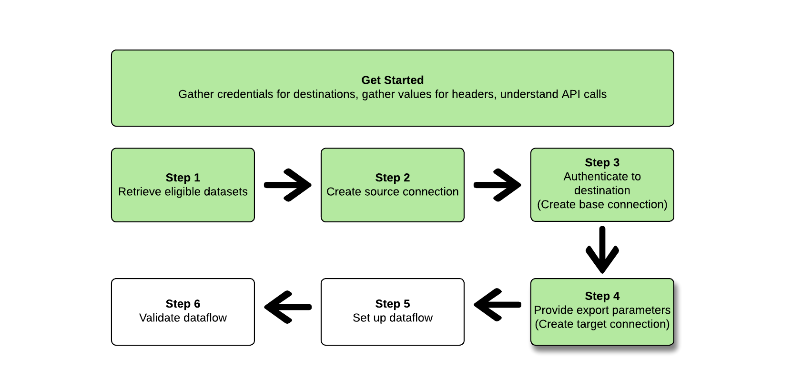

# Exportera datauppsättningar med [!DNL Flow Service API]

>[!AVAILABILITY]
>
>* Den här funktionaliteten är tillgänglig för kunder som har köpt Real-Time CDP Prime och Ultimate, Adobe Journey Optimizer eller Customer Journey Analytics. Kontakta din Adobe-representant om du vill ha mer information.

>[!IMPORTANT]
>
>**Åtgärdsobjekt**: I [ september 2024-versionen av Experience Platform ](/help/release-notes/latest/latest.md#destinations) introduceras alternativet att ange ett `endTime`-datum för dataflöden för exportdatamängd. Adobe introducerar också ett standardslutdatum som är 1 maj 2025 för alla datauppsättningsexportdataflöden som skapats *före september-versionen*. För dessa dataflöden måste du uppdatera slutdatumet i dataflödet manuellt före slutdatumet, annars kan exporten stoppas på det datumet. Använd användargränssnittet i Experience Platform för att se vilka dataflöden som ska stoppas den 1 maj.
>
>Detsamma gäller för alla dataflöden som du skapar utan att ange ett `endTime`-datum. Dessa kommer att ha en sluttid på sex månader från den tidpunkt då de skapades.

<!--

>You can retrieve a list of such dataflows by performing the following API call: `https://platform.adobe.io/data/foundation/flowservice/flows?property=scheduleParams.endTime==UNIXTIMESTAMPTHATWEWILLUSE`
>

-->

I den här artikeln förklaras det arbetsflöde som krävs för att använda [!DNL Flow Service API] för att exportera [datauppsättningar](/help/catalog/datasets/overview.md) från Adobe Experience Platform till den önskade molnlagringsplatsen, till exempel [!DNL Amazon S3], SFTP-platser eller [!DNL Google Cloud Storage].

>[!TIP]
>
>Du kan också använda användargränssnittet i Experience Platform för att exportera datauppsättningar. Mer information finns i självstudiekursen [Exportera datauppsättningar](/help/destinations/ui/export-datasets.md).

## Tillgängliga datauppsättningar för export {#datasets-to-export}

Vilka datauppsättningar du kan exportera beror på Experience Platform (Real-Time CDP, Adobe Journey Optimizer), nivån (Prime eller Ultimate) och eventuella tillägg som du har köpt (till exempel Data Distiller).

Se tabellen [på självstudiesidan](/help/destinations/ui/export-datasets.md#datasets-to-export) för att förstå vilka datauppsättningar du kan exportera.

## Mål som stöds {#supported-destinations}

För närvarande kan du exportera datauppsättningar till molnlagringsmål som markeras i skärmbilden och visas nedan.


* [[!DNL Azure Data Lake Storage Gen2]](../../destinations/catalog/cloud-storage/adls-gen2.md)
* [[!DNL Data Landing Zone]](../../destinations/catalog/cloud-storage/data-landing-zone.md)
* [[!DNL Google Cloud Storage]](../../destinations/catalog/cloud-storage/google-cloud-storage.md)
* [[!DNL Amazon S3]](../../destinations/catalog/cloud-storage/amazon-s3.md#changelog)
* [[!DNL Azure Blob]](../../destinations/catalog/cloud-storage/azure-blob.md#changelog)
* [[!DNL SFTP]](../../destinations/catalog/cloud-storage/sftp.md#changelog)

## Komma igång {#get-started}


Handboken kräver en fungerande förståelse av följande komponenter i Adobe Experience Platform:

* [[!DNL Experience Platform datasets]](/help/catalog/datasets/overview.md): Alla data som har importerats till Adobe Experience Platform lagras i [!DNL Data Lake] som datauppsättningar. En datauppsättning är en lagrings- och hanteringskonstruktion för en datamängd, vanligtvis en tabell, som innehåller ett schema (kolumner) och fält (rader). Datauppsättningar innehåller också metadata som beskriver olika aspekter av de data som lagras.
   * [[!DNL Sandboxes]](../../sandboxes/home.md): [!DNL Experience Platform] innehåller virtuella sandlådor som partitionerar en enskild [!DNL Platform]-instans till separata virtuella miljöer för att hjälpa till att utveckla och utveckla program för digitala upplevelser.

I följande avsnitt finns ytterligare information som du måste känna till för att kunna exportera datauppsättningar till molnlagringsmål i Platform.

### Nödvändiga behörigheter {#permissions}

Om du vill exportera datauppsättningar behöver du behörigheterna **[!UICONTROL View Destinations]**, **[!UICONTROL View Datasets]** och **[!UICONTROL Manage and Activate Dataset Destinations]** [åtkomstkontroll](/help/access-control/home.md#permissions). Läs [åtkomstkontrollsöversikten](/help/access-control/ui/overview.md) eller kontakta produktadministratören för att få den behörighet som krävs.

Bläddra i målkatalogen för att kontrollera att du har de behörigheter som krävs för att exportera datauppsättningar och att målet har stöd för att exportera datauppsättningar. Om ett mål har en **[!UICONTROL Activate]**- eller **[!UICONTROL Export datasets]**-kontroll har du rätt behörighet.

### Läser exempel-API-anrop {#reading-sample-api-calls}

I den här självstudiekursen finns exempel-API-anrop som visar hur du formaterar dina begäranden. Det kan vara sökvägar, obligatoriska rubriker och korrekt formaterade begärandenyttolaster. Ett exempel på JSON som returneras i API-svar finns också. Information om de konventioner som används i dokumentationen för exempel-API-anrop finns i avsnittet [Så här läser du exempel-API-anrop](../../landing/troubleshooting.md#how-do-i-format-an-api-request) i felsökningsguiden för [!DNL Experience Platform].

### Samla in värden för obligatoriska och valfria rubriker {#gather-values-headers}

För att kunna anropa [!DNL Platform] API:er måste du först slutföra [Experience Platform-autentiseringssjälvstudiekursen](https://www.adobe.com/go/platform-api-authentication-en). När du slutför självstudiekursen för autentisering visas värdena för var och en av de obligatoriska rubrikerna i alla [!DNL Experience Platform] API-anrop, vilket visas nedan:

* Behörighet: Bärare `{ACCESS_TOKEN}`
* x-api-key: `{API_KEY}`
* x-gw-ims-org-id: `{ORG_ID}`

Resurser i [!DNL Experience Platform] kan isoleras till specifika virtuella sandlådor. I förfrågningar till [!DNL Platform] API:er kan du ange namnet och ID:t för sandlådan som åtgärden ska utföras i. Dessa är valfria parametrar.

* x-sandbox-name: `{SANDBOX_NAME}`

>[!NOTE]
>
>Mer information om sandlådor i [!DNL Experience Platform] finns i [översiktsdokumentationen för sandlådan](../../sandboxes/home.md).

Alla begäranden som innehåller en nyttolast (POST, PUT, PATCH) kräver ytterligare en medietypsrubrik:

* Innehållstyp: `application/json`

### API-referensdokumentation {#api-reference-documentation}

Du hittar referensdokumentation för alla API-åtgärder i den här självstudiekursen. Se dokumentationen för [[!DNL Flow Service] - Destinations API på Adobe Developer webbplats ](https://developer.adobe.com/experience-platform-apis/references/destinations/). Vi rekommenderar att du använder den här självstudiekursen och API-referensdokumentationen parallellt.

### Ordlista {#glossary}

Beskrivningar av de termer som du kommer att stöta på i den här API-självstudiekursen finns i [ordboksavsnittet](https://developer.adobe.com/experience-platform-apis/references/destinations/#tag/Glossary) i API-referensdokumentationen.

### Samla anslutningsspecifikationer och flödesspecifikationer för det önskade målet {#gather-connection-spec-flow-spec}

Innan du startar arbetsflödet för att exportera en datauppsättning ska du identifiera anslutningsspec och flödesspec-ID för den destination som du tänker exportera datauppsättningar till. Använd tabellen nedan som referens.


| Mål | Anslutningsspecifikation | Flödesspecifikation |
---------|----------|---------|
| [!DNL Amazon S3] | `4fce964d-3f37-408f-9778-e597338a21ee` | `269ba276-16fc-47db-92b0-c1049a3c131f` |
| [!DNL Azure Blob Storage] | `6d6b59bf-fb58-4107-9064-4d246c0e5bb2` | `95bd8965-fc8a-4119-b9c3-944c2c2df6d2` |
| [!DNL Azure Data Lake Gen 2(ADLS Gen2)] | `be2c3209-53bc-47e7-ab25-145db8b873e1` | `17be2013-2549-41ce-96e7-a70363bec293` |
| [!DNL Data Landing Zone(DLZ)] | `10440537-2a7b-4583-ac39-ed38d4b848e8` | `cd2fc47e-e838-4f38-a581-8fff2f99b63a` |
| [!DNL Google Cloud Storage] | `c5d93acb-ea8b-4b14-8f53-02138444ae99` | `585c15c4-6cbf-4126-8f87-e26bff78b657` |
| SFTP | `36965a81-b1c6-401b-99f8-22508f1e6a26` | `354d6aad-4754-46e4-a576-1b384561c440` |

{style="table-layout:auto"}

Du behöver dessa ID:n för att skapa olika [!DNL Flow Service]-entiteter. Du måste också referera till delar av själva [!DNL Connection Spec] för att konfigurera vissa entiteter så att du kan hämta [!DNL Connection Spec] från [!DNL Flow Service APIs]. Se exemplen nedan om hur du hämtar anslutningsspecifikationer för alla mål i tabellen:

>[!BEGINTABS]

>[!TAB Amazon S3]

**Begäran**

+++Hämta [!DNL connection spec] för [!DNL Amazon S3]

```shell
curl --location --request GET 'https://platform.adobe.io/data/foundation/flowservice/connectionSpecs/4fce964d-3f37-408f-9778-e597338a21ee' \
--header 'accept: application/json' \
--header 'x-api-key: {API_KEY}' \
--header 'x-gw-ims-org-id: {ORG_ID}' \
--header 'x-sandbox-name: {SANDBOX_NAME}' \
--header 'Authorization: Bearer {ACCESS_TOKEN}'
```

+++

**Svar**

+++[!DNL Amazon S3] - Anslutningsspecifikation

```json
{
    "items": [
        {
            "id": "4fce964d-3f37-408f-9778-e597338a21ee",
            "name": "Amazon S3",
            "providerId": "14e34fac-d307-11e9-bb65-2a2ae2dbcce4",
            "version": "1.0",
//...
```

+++

>[!TAB Azure Blob Storage]

**Begäran**

+++Hämta [!DNL connection spec] för [!DNL Azure Blob Storage]

```shell
curl --location --request GET 'https://platform.adobe.io/data/foundation/flowservice/connectionSpecs/6d6b59bf-fb58-4107-9064-4d246c0e5bb2' \
--header 'accept: application/json' \
--header 'x-api-key: {API_KEY}' \
--header 'x-gw-ims-org-id: {ORG_ID}' \
--header 'x-sandbox-name: {SANDBOX_NAME}' \
--header 'Authorization: Bearer {ACCESS_TOKEN}'
```

+++

**Svar**

+++[!DNL Azure Blob Storage] - [!DNL Connection spec]

```json
{
    "items": [
        {
            "id": "6d6b59bf-fb58-4107-9064-4d246c0e5bb2",
            "name": "Azure Blob Storage",
            "providerId": "14e34fac-d307-11e9-bb65-2a2ae2dbcce4",
            "version": "1.0",
//...
```

+++

>[!TAB Azure Data Lake Gen 2 (ADLS Gen2)]

**Begäran**

+++Hämta [!DNL connection spec] för [!DNL Azure Data Lake Gen 2(ADLS Gen2])

```shell
curl --location --request GET 'https://platform.adobe.io/data/foundation/flowservice/connectionSpecs/be2c3209-53bc-47e7-ab25-145db8b873e1' \
--header 'accept: application/json' \
--header 'x-api-key: {API_KEY}' \
--header 'x-gw-ims-org-id: {ORG_ID}' \
--header 'x-sandbox-name: {SANDBOX_NAME}' \
--header 'Authorization: Bearer {ACCESS_TOKEN}'
```

+++

**Svar**

+++[!DNL Azure Data Lake Gen 2(ADLS Gen2)] - [!DNL Connection spec]

```json
{
    "items": [
        {
            "id": "be2c3209-53bc-47e7-ab25-145db8b873e1",
            "name": "Azure Data Lake Gen2",
            "providerId": "14e34fac-d307-11e9-bb65-2a2ae2dbcce4",
            "version": "1.0",
//...
```

+++

>[!TAB Data Landing Zone(DLZ)]

**Begäran**

+++Hämta [!DNL connection spec] för [!DNL Data Landing Zone(DLZ)]

```shell
curl --location --request GET 'https://platform.adobe.io/data/foundation/flowservice/connectionSpecs/10440537-2a7b-4583-ac39-ed38d4b848e8' \
--header 'accept: application/json' \
--header 'x-api-key: {API_KEY}' \
--header 'x-gw-ims-org-id: {ORG_ID}' \
--header 'x-sandbox-name: {SANDBOX_NAME}' \
--header 'Authorization: Bearer {ACCESS_TOKEN}'
```

+++

**Svar**

+++[!DNL Data Landing Zone(DLZ)] - [!DNL Connection spec]

```json
{
    "items": [
        {
            "id": "10440537-2a7b-4583-ac39-ed38d4b848e8",
            "name": "Data Landing Zone",
            "providerId": "14e34fac-d307-11e9-bb65-2a2ae2dbcce4",
            "version": "1.0",
//...
```

+++

>[!TAB Google Cloud-lagring]

**Begäran**

+++Hämta [!DNL connection spec] för [!DNL Google Cloud Storage]

```shell
curl --location --request GET 'https://platform.adobe.io/data/foundation/flowservice/connectionSpecs/c5d93acb-ea8b-4b14-8f53-02138444ae99' \
--header 'accept: application/json' \
--header 'x-api-key: {API_KEY}' \
--header 'x-gw-ims-org-id: {ORG_ID}' \
--header 'x-sandbox-name: {SANDBOX_NAME}' \
--header 'Authorization: Bearer {ACCESS_TOKEN}'
```

+++

**Svar**

+++[!DNL Google Cloud Storage] - [!DNL Connection spec]

```json
{
    "items": [
        {
            "id": "c5d93acb-ea8b-4b14-8f53-02138444ae99",
            "name": "Google Cloud Storage",
            "providerId": "14e34fac-d307-11e9-bb65-2a2ae2dbcce4",
            "version": "1.0",
//...
```

+++

>[!TAB SFTP]

**Begäran**

+++Hämta [!DNL connection spec] för SFTP

```shell
curl --location --request GET 'https://platform.adobe.io/data/foundation/flowservice/connectionSpecs/36965a81-b1c6-401b-99f8-22508f1e6a26' \
--header 'accept: application/json' \
--header 'x-api-key: {API_KEY}' \
--header 'x-gw-ims-org-id: {ORG_ID}' \
--header 'x-sandbox-name: {SANDBOX_NAME}' \
--header 'Authorization: Bearer {ACCESS_TOKEN}'
```

+++

**Svar**

+++SFTP - [!DNL Connection spec]

```json
{
    "items": [
        {
            "id": "36965a81-b1c6-401b-99f8-22508f1e6a26",
            "name": "SFTP",
            "providerId": "14e34fac-d307-11e9-bb65-2a2ae2dbcce4",
            "version": "1.0",
//...
```

+++

>[!ENDTABS]

Följ stegen nedan för att konfigurera ett datauppsättningsdataflöde till ett molnlagringsmål. I vissa steg skiljer sig förfrågningarna och svaren mellan de olika molnlagringsmålen. I dessa fall använder du flikarna på sidan för att hämta förfrågningar och svar som är specifika för målet som du vill ansluta och exportera datauppsättningar till. Använd rätt [!DNL connection spec] och [!DNL flow spec] för målet som du konfigurerar.

## Hämta en lista med datauppsättningar {#retrieve-list-of-available-datasets}


Om du vill hämta en lista över datauppsättningar som är berättigade för aktivering börjar du med att göra ett API-anrop till slutpunkten nedan.

>[!BEGINSHADEBOX]

**Begäran**

+++Hämta giltiga datauppsättningar - begäran

```shell
curl --location --request GET 'https://platform.adobe.io/data/foundation/flowservice/connectionSpecs/23598e46-f560-407b-88d5-ea6207e49db0/configs?outputType=activationDatasets&outputField=datasets&start=0&limit=20&properties=name,state' \
--header 'accept: application/json' \
--header 'x-gw-ims-org-id: {ORG_ID}' \
--header 'x-api-key: {API_KEY}' \
--header 'x-sandbox-name: {SANDBOX_NAME}' \
--header 'Authorization: Bearer {ACCESS_TOKEN}'
```

Observera att för att kunna hämta giltiga datauppsättningar måste det [!DNL connection spec]-ID som används i förfrågnings-URL:en vara datakällans spec-ID, `23598e46-f560-407b-88d5-ea6207e49db0`, och de två frågeparametrarna `outputField=datasets` och `outputType=activationDatasets` måste anges. Alla andra frågeparametrar är de standardparametrar som stöds av [katalogtjänstens API](https://developer.adobe.com/experience-platform-apis/references/catalog/).

+++

**Svar**

+++Hämta datauppsättningar - svar

```json
{
    "items": [
        {
            "id": "5ef3e324052581191aa6a466",
            "name": "AAM Authenticated Profiles Meta Data",
            "description": "Activation profile export dataset",
            "fileDescription": {
                "persisted": true,
                "containerFormat": "parquet",
                "format": "parquet"
            },
            "aspect": "production",
            "state": "DRAFT"
        },
        {
            "id": "5ef3e3259ad2a1191ab7dd7d",
            "name": "AAM Devices Data",
            "description": "Activation profile export dataset",
            "fileDescription": {
                "persisted": true,
                "containerFormat": "parquet",
                "format": "parquet"
            },
            "aspect": "production",
            "state": "DRAFT"
        },
        {
            "id": "5ef3e325582424191b1beb42",
            "name": "AAM Devices Profile Meta Data",
            "description": "Activation profile export dataset",
            "fileDescription": {
                "persisted": true,
                "containerFormat": "parquet",
                "format": "parquet"
            },
            "aspect": "production",
            "state": "DRAFT"
        },
        {
            "id": "5ef3e328582424191b1beb44",
            "name": "AAM Realtime",
            "description": "Activation profile export dataset",
            "fileDescription": {
                "persisted": true,
                "containerFormat": "parquet",
                "format": "parquet"
            },
            "aspect": "production",
            "state": "DRAFT"
        },
        {
            "id": "5ef3e328fe742a191b2b3ea5",
            "name": "AAM Realtime Profile Updates",
            "description": "Activation profile export dataset",
            "fileDescription": {
                "persisted": true,
                "containerFormat": "parquet",
                "format": "parquet"
            },
            "aspect": "production",
            "state": "DRAFT"
        }
    ],
    "pageInfo": {
        "start": 0,
        "end": 4,
        "total": 149,
        "hasNext": true
    }
}
```

+++

>[!ENDSHADEBOX]

Ett svar innehåller en lista över datauppsättningar som kan aktiveras. Dessa datauppsättningar kan användas när du skapar källanslutningen i nästa steg.

Mer information om de olika svarsparametrarna för varje returnerad datauppsättning finns i [API-utvecklardokumentationen för datauppsättningar](https://developer.adobe.com/experience-platform-apis/references/catalog/#tag/Datasets/operation/listDatasets).

## Skapa en källanslutning {#create-source-connection}


När du har hämtat listan över datauppsättningar som du vill exportera kan du skapa en källanslutning med dessa datauppsättnings-ID:n.

>[!BEGINSHADEBOX]

**Begäran**

+++Skapa källanslutning - begäran

Lägg märke till de markerade raderna med textbundna kommentarer i exemplet med begäran som ger ytterligare information. Ta bort de textbundna kommentarerna i begäran när du kopierar och klistrar in begäran i valfri terminal.

```shell {line-numbers="true" start-line="1" highlight="12,16"}
curl --location --request POST 'https://platform.adobe.io/data/foundation/flowservice/sourceConnections' \
--header 'accept: application/json' \
--header 'x-api-key: {API_KEY}' \
--header 'x-gw-ims-org-id: {ORG_ID}' \
--header 'x-sandbox-name: {SANDBOX_NAME}' \
--header 'Content-Type: application/json' \
--header 'Authorization: Bearer {ACCESS_TOKEN}' \
--data-raw '{
  "name": "Connecting to Data Lake",
  "description": "Data Lake source connection to export datasets",
  "connectionSpec": {
    "id": "23598e46-f560-407b-88d5-ea6207e49db0", // this connection spec ID is always the same for Source Connections
    "version": "1.0"
  },
  "params": {
    "datasets": [ // datasets to activate
      {
        "dataSetId": "5ef3e3259ad2a1191ab7dd7d",
        "name": "AAM Devices Data"
      }
    ]
  }
}'
```

+++


**Svar**

+++Skapa källanslutning - svar

```json
{
    "id": "900df191-b983-45cd-90d5-4c7a0326d650",
    "etag": "\"0500ebe1-0000-0200-0000-63e28d060000\""
}
```

+++

>[!ENDSHADEBOX]

Ett lyckat svar returnerar ID:t (`id`) för den nyligen skapade källanslutningen och `etag`. Anteckna källanslutnings-ID som du behöver det senare när du skapar dataflödet.

Kom ihåg följande:

* Källanslutningen som skapas i det här steget måste länkas till ett dataflöde för att dess datauppsättningar ska aktiveras till ett mål. Mer information om hur du länkar en källanslutning till ett dataflöde finns i avsnittet [Skapa ett dataflöde](#create-dataflow).
* Det går inte att ändra datauppsättnings-ID:n för en källanslutning när den har skapats. Om du behöver lägga till eller ta bort datauppsättningar från en källanslutning måste du skapa en ny källanslutning och länka ID:t för den nya källanslutningen till dataflödet.

## Skapa en (mål) basanslutning {#create-base-connection}


En basanslutning lagrar autentiseringsuppgifterna på ditt mål på ett säkert sätt. Beroende på måltypen kan de autentiseringsuppgifter som krävs för att autentisera mot det målet variera. Om du vill hitta de här autentiseringsparametrarna hämtar du först [!DNL connection spec] för det önskade målet enligt beskrivningen i avsnittet [Samla anslutningsspecifikationer och flödesspecifikationer](#gather-connection-spec-flow-spec) och tittar sedan på `authSpec` för svaret. Referera till flikarna nedan för `authSpec`-egenskaperna för alla mål som stöds.

>[!BEGINTABS]

>[!TAB Amazon S3]

+++[!DNL Amazon S3] - [!DNL Connection spec] visar [!DNL auth spec]

Observera den markerade raden med textbundna kommentarer i exemplet [!DNL connection spec] nedan, som innehåller ytterligare information om var autentiseringsparametrarna i [!DNL connection spec] ska hittas.

```json {line-numbers="true" start-line="1" highlight="8"}
{
    "items": [
        {
            "id": "4fce964d-3f37-408f-9778-e597338a21ee",
            "name": "Amazon S3",
            "providerId": "14e34fac-d307-11e9-bb65-2a2ae2dbcce4",
            "version": "1.0",
            "authSpec": [ // describes the authentication parameters
                {
                    "name": "Access Key",
                    "type": "KeyBased",
                    "spec": {
                        "$schema": "http://json-schema.org/draft-07/schema#",
                        "description": "Defines auth params required for connecting to amazon-s3",
                        "type": "object",
                        "properties": {
                            "s3AccessKey": {
                                "description": "Access key id",
                                "type": "string",
                                "pattern": "^[A-Z2-7]{20}$"
                            },
                            "s3SecretKey": {
                                "description": "Secret access key for the user account",
                                "type": "string",
                                "format": "password",
                                "pattern": "^[A-Za-z0-9\/\\+]{40}$"
                            }
                        },
                        "required": [
                            "s3SecretKey",
                            "s3AccessKey"
                        ]
                    }
                }
            ],
//...
```

+++

>[!TAB Azure Blob Storage]

+++[!DNL Azure Blob Storage] - [!DNL Connection spec] visar [!DNL auth spec]

Observera den markerade raden med textbundna kommentarer i exemplet [!DNL connection spec] nedan, som innehåller ytterligare information om var autentiseringsparametrarna i [!DNL connection spec] ska hittas.

```json {line-numbers="true" start-line="1" highlight="8"}
{
    "items": [
        {
            "id": "6d6b59bf-fb58-4107-9064-4d246c0e5bb2",
            "name": "Azure Blob Storage",
            "providerId": "14e34fac-d307-11e9-bb65-2a2ae2dbcce4",
            "version": "1.0",
            "authSpec": [ // describes the authentication parameters
                {
                    "name": "ConnectionString",
                    "type": "ConnectionString",
                    "spec": {
                        "$schema": "http://json-schema.org/draft-07/schema#",
                        "description": "Connection String for Azure Blob based destinations",
                        "type": "object",
                        "properties": {
                            "connectionString": {
                                "description": "connection string for login",
                                "type": "string",
                                "format": "password"
                            }
                        },
                        "required": [
                            "connectionString"
                        ]
                    }
                }
            ],
//...
```

+++


>[!TAB Azure Data Lake Gen 2 (ADLS Gen2)]

+++[!DNL Azure Data Lake Gen 2(ADLS Gen2)] - [!DNL Connection spec] visar [!DNL auth spec]

Observera den markerade raden med textbundna kommentarer i exemplet [!DNL connection spec] nedan, som innehåller ytterligare information om var autentiseringsparametrarna i [!DNL connection spec] ska hittas.

```json {line-numbers="true" start-line="1" highlight="8"}
{
    "items": [
        {
            "id": "be2c3209-53bc-47e7-ab25-145db8b873e1",
            "name": "Azure Data Lake Gen2",
            "providerId": "14e34fac-d307-11e9-bb65-2a2ae2dbcce4",
            "version": "1.0",
            "authSpec": [ // describes the authentication parameters
                {
                    "name": "Azure Service Principal Auth",
                    "type": "AzureServicePrincipal",
                    "spec": {
                        "$schema": "http://json-schema.org/draft-07/schema#",
                        "description": "defines auth params required for connecting to adlsgen2 using service principal",
                        "type": "object",
                        "properties": {
                            "url": {
                                "description": "Endpoint for Azure Data Lake Storage Gen2.",
                                "type": "string"
                            },
                            "servicePrincipalId": {
                                "description": "Service Principal Id to connect to ADLSGen2.",
                                "type": "string"
                            },
                            "servicePrincipalKey": {
                                "description": "Service Principal Key to connect to ADLSGen2.",
                                "type": "string",
                                "format": "password"
                            },
                            "tenant": {
                                "description": "Tenant information(domain name or tenant ID).",
                                "type": "string"
                            }
                        },
                        "required": [
                            "servicePrincipalKey",
                            "url",
                            "tenant",
                            "servicePrincipalId"
                        ]
                    }
                }
            ],
//...
```

+++


>[!TAB Data Landing Zone(DLZ)]

+++[!DNL Data Landing Zone(DLZ)] - [!DNL Connection spec] visar [!DNL auth spec]

>[!NOTE]
>
>Data Landing Zone-målet kräver inte [!DNL auth spec].

```json
{
    "items": [
        {
            "id": "10440537-2a7b-4583-ac39-ed38d4b848e8",
            "name": "Data Landing Zone",
            "providerId": "14e34fac-d307-11e9-bb65-2a2ae2dbcce4",
            "version": "1.0",
            "authSpec": [],
//...
```

+++

>[!TAB Google Cloud-lagring]

+++[!DNL Google Cloud Storage] - [!DNL Connection spec] visar [!DNL auth spec]

Observera den markerade raden med textbundna kommentarer i exemplet [!DNL connection spec] nedan, som innehåller ytterligare information om var autentiseringsparametrarna i [!DNL connection spec] ska hittas.

```json {line-numbers="true" start-line="1" highlight="8"}
{
    "items": [
        {
            "id": "c5d93acb-ea8b-4b14-8f53-02138444ae99",
            "name": "Google Cloud Storage",
            "providerId": "14e34fac-d307-11e9-bb65-2a2ae2dbcce4",
            "version": "1.0",
            "authSpec": [ // describes the authentication parameters
                {
                    "name": "Google Cloud Storage authentication credentials",
                    "type": "GoogleCloudStorageAuth",
                    "spec": {
                        "$schema": "http://json-schema.org/draft-07/schema#",
                        "description": "defines auth params required for connecting to google cloud storage connector.",
                        "type": "object",
                        "properties": {
                            "accessKeyId": {
                                "description": "Access Key Id for the user account",
                                "type": "string"
                            },
                            "secretAccessKey": {
                                "description": "Secret Access Key for the user account",
                                "type": "string",
                                "format": "password"
                            }
                        },
                        "required": [
                            "accessKeyId",
                            "secretAccessKey"
                        ]
                    }
                }
            ],
//...
```

+++

>[!TAB SFTP]

+++SFTP - [!DNL Connection spec] visar [!DNL auth spec]

>[!NOTE]
>
>SFTP-målet innehåller två separata objekt i [!DNL auth spec], eftersom det stöder både lösenord- och SSH-nyckelautentisering.

Observera den markerade raden med textbundna kommentarer i exemplet [!DNL connection spec] nedan, som innehåller ytterligare information om var autentiseringsparametrarna i [!DNL connection spec] ska hittas.

```json {line-numbers="true" start-line="1" highlight="8"}
{
    "items": [
        {
            "id": "36965a81-b1c6-401b-99f8-22508f1e6a26",
            "name": "SFTP",
            "providerId": "14e34fac-d307-11e9-bb65-2a2ae2dbcce4",
            "version": "1.0",
            "authSpec": [ // describes the authentication parameters
                {
                    "name": "SFTP with Password",
                    "type": "SFTP",
                    "spec": {
                        "$schema": "http://json-schema.org/draft-07/schema#",
                        "description": "defines auth params required for connecting to sftp locations with a password",
                        "type": "object",
                        "properties": {
                            "domain": {
                                "description": "Domain of server",
                                "type": "string"
                            },
                            "username": {
                                "description": "Username",
                                "type": "string"
                            },
                            "password": {
                                "description": "Password",
                                "type": "string",
                                "format": "password"
                            }
                        },
                        "required": [
                            "password",
                            "domain",
                            "username"
                        ]
                    }
                },
                {
                    "name": "SFTP with SSH Key",
                    "type": "SFTP",
                    "spec": {
                        "$schema": "http://json-schema.org/draft-07/schema#",
                        "description": "defines auth params required for connecting to sftp locations using SSH Key",
                        "type": "object",
                        "properties": {
                            "domain": {
                                "description": "Domain of server",
                                "type": "string"
                            },
                            "username": {
                                "description": "Username",
                                "type": "string"
                            },
                            "sshKey": {
                                "description": "Base64 string of the private SSH key",
                                "type": "string",
                                "format": "password",
                                "contentEncoding": "base64",
                                "uiAttributes": {
                                    "tooltip": {
                                        "id": "platform_destinations_connect_sftp_ssh",
                                        "fallbackUrl": "http://www.adobe.com/go/destinations-sftp-connection-parameters-en "
                                    }
                                }
                            }
                        },
                        "required": [
                            "sshKey",
                            "domain",
                            "username"
                        ]
                    }
                }
            ],
//...
```

+++

>[!ENDTABS]

Med hjälp av egenskaperna som anges i autentiseringsspecifikationen (dvs. `authSpec` från svaret) kan du skapa en basanslutning med de nödvändiga autentiseringsuppgifterna, som är specifika för varje måltyp, vilket visas i exemplen nedan:

>[!BEGINTABS]

>[!TAB Amazon S3]

**Begäran**

+++[!DNL Amazon S3] - Bas anslutningsbegäran

>[!TIP]
>
>Mer information om hur du får de inloggningsuppgifter som krävs finns i avsnittet [Autentisera till mål](/help/destinations/catalog/cloud-storage/amazon-s3.md#authenticate) på dokumentationssidan för Amazon S3-målet.

Lägg märke till de markerade raderna med textbundna kommentarer i exemplet med begäran som ger ytterligare information. Ta bort de textbundna kommentarerna i begäran när du kopierar och klistrar in begäran i valfri terminal.

```shell {line-numbers="true" start-line="1" highlight="18"}
curl --location --request POST 'https://platform.adobe.io/data/foundation/flowservice/connections' \
--header 'accept: application/json' \
--header 'Authorization: Bearer {ACCESS_TOKEN}' \
--header 'x-api-key: <API-KEY>' \
--header 'x-gw-ims-org-id: <IMS-ORG-ID>' \
--header 'x-sandbox-name: <SANDBOX-NAME>' \
--header 'Content-Type: application/json' \
--data-raw '{
  "name": "Amazon S3 Base Connection",
  "auth": {
    "specName": "Access Key",
    "params": {
      "s3SecretKey": "<Add secret key>",
      "s3AccessKey": "<Add access key>"
    }
  },
  "connectionSpec": {
    "id": "4fce964d-3f37-408f-9778-e597338a21ee", // Amazon S3 connection spec
    "version": "1.0"
  }
}'
```

+++

**Svar**

+++[!DNL Amazon S3] basanslutningssvar

```json
{
    "id": "12401496-2573-4ca7-8137-fef1aeb9dd4c",
    "etag": "\"0000d781-0000-0200-0000-63e29f420000\""
}
```

+++

>[!TAB Azure Blob Storage]

**Begäran**

+++[!DNL Azure Blob Storage] - Bas anslutningsbegäran

>[!TIP]
>
>Mer information om hur du hämtar de autentiseringsuppgifter som krävs finns i avsnittet [Autentisera till mål](/help/destinations/catalog/cloud-storage/azure-blob.md#authenticate) på dokumentationssidan för Azure Blob Storage-målet.

Lägg märke till de markerade raderna med textbundna kommentarer i exemplet med begäran som ger ytterligare information. Ta bort de textbundna kommentarerna i begäran när du kopierar och klistrar in begäran i valfri terminal.

```shell {line-numbers="true" start-line="1" highlight="16"}
curl --location --request POST 'https://platform.adobe.io/data/foundation/flowservice/connections' \
--header 'accept: application/json' \
--header 'Authorization: Bearer {ACCESS_TOKEN}' \
--header 'x-api-key: <API-KEY>' \
--header 'x-gw-ims-org-id: <IMS-ORG-ID>' \
--header 'x-sandbox-name: <SANDBOX-NAME>' \
--header 'Content-Type: application/json' \
--data-raw '{
  "name": "Azure Blob Storage Base Connection",
  "auth": {
    "specName": "ConnectionString",
    "params": {
      "connectionString": "<Add Azure Blob connection string>"
    }
  },
  "connectionSpec": {
    "id": "6d6b59bf-fb58-4107-9064-4d246c0e5bb2", // Azure Blob Storage connection spec
    "version": "1.0"
  }
}'
```

+++

**Svar**

+++[!DNL Azure Blob Storage] - Basanslutningssvar

```json
{
    "id": "12401496-2573-4ca7-8137-fef1aeb9dd4c",
    "etag": "\"0000d781-0000-0200-0000-63e29f420000\""
}
```

+++

>[!TAB Azure Data Lake Gen 2 (ADLS Gen2)]

**Begäran**

+++[!DNL Azure Data Lake Gen 2(ADLS Gen2)] - Bas anslutningsbegäran

>[!TIP]
>
>Mer information om hur du får de autentiseringsuppgifter som krävs finns i avsnittet [Autentisera till mål](/help/destinations/catalog/cloud-storage/adls-gen2.md#authenticate) på sidan med måldokumentation för Azure Data Lake Gen 2 (ADLS Gen2).

Lägg märke till de markerade raderna med textbundna kommentarer i exemplet med begäran som ger ytterligare information. Ta bort de textbundna kommentarerna i begäran när du kopierar och klistrar in begäran i valfri terminal.

```shell {line-numbers="true" start-line="1" highlight="20"}
curl --location --request POST 'https://platform.adobe.io/data/foundation/flowservice/connections' \
--header 'accept: application/json' \
--header 'Authorization: Bearer {ACCESS_TOKEN}' \
--header 'x-api-key: <API-KEY>' \
--header 'x-gw-ims-org-id: <IMS-ORG-ID>' \
--header 'x-sandbox-name: <SANDBOX-NAME>' \
--header 'Content-Type: application/json' \
--data-raw '{
  "name": "Azure Data Lake Gen 2(ADLS Gen2) Base Connection",
  "auth": {
    "specName": "Azure Service Principal Auth",
    "params": {
      "servicePrincipalKey": "<Add servicePrincipalKey>",
      "url": "<Add url>",
      "tenant": "<Add tenant>",
      "servicePrincipalId": "<Add servicePrincipalId>"
    }
  },
  "connectionSpec": {
    "id": "be2c3209-53bc-47e7-ab25-145db8b873e1", // Azure Data Lake Gen 2(ADLS Gen2) connection spec
    "version": "1.0"
  }
}'
```

+++

**Svar**

+++[!DNL Azure Data Lake Gen 2(ADLS Gen2)] - Basanslutningssvar

```json
{
    "id": "12401496-2573-4ca7-8137-fef1aeb9dd4c",
    "etag": "\"0000d781-0000-0200-0000-63e29f420000\""
}
```

+++

>[!TAB Data Landing Zone(DLZ)]

**Begäran**

+++[!DNL Data Landing Zone(DLZ)] - Bas anslutningsbegäran

>[!TIP]
>
>Inga autentiseringsuppgifter krävs för Data Landing Zone-målet. Mer information finns i avsnittet [Autentisera till mål](/help/destinations/catalog/cloud-storage/data-landing-zone.md#authenticate) på dokumentationssidan för Data Landing Zone-målet.

```shell
curl --location --request POST 'https://platform.adobe.io/data/foundation/flowservice/connections' \
--header 'accept: application/json' \
--header 'Authorization: Bearer {ACCESS_TOKEN}' \
--header 'x-api-key: <API-KEY>' \
--header 'x-gw-ims-org-id: <IMS-ORG-ID>' \
--header 'x-sandbox-name: <SANDBOX-NAME>' \
--header 'Content-Type: application/json' \
--data-raw '{
  "name": "Data Landing Zone(DLZ) Base Connection"
}'
```

+++

**Svar**

+++[!DNL Data Landing Zone] - Basanslutningssvar

```json
{
    "id": "12401496-2573-4ca7-8137-fef1aeb9dd4c",
    "etag": "\"0000d781-0000-0200-0000-63e29f420000\""
}
```

+++

>[!TAB Google Cloud-lagring]

**Begäran**

+++[!DNL Google Cloud Storage] - Bas anslutningsbegäran

>[!TIP]
>
>Mer information om hur du får de autentiseringsuppgifter som krävs finns i avsnittet [Autentisera till mål](/help/destinations/catalog/cloud-storage/google-cloud-storage.md#authenticate) på dokumentationssidan för Google Cloud-lagringsmålet.

Lägg märke till de markerade raderna med textbundna kommentarer i exemplet med begäran som ger ytterligare information. Ta bort de textbundna kommentarerna i begäran när du kopierar och klistrar in begäran i valfri terminal.

```shell {line-numbers="true" start-line="1" highlight="18"}
curl --location --request POST 'https://platform.adobe.io/data/foundation/flowservice/connections' \
--header 'accept: application/json' \
--header 'Authorization: Bearer {ACCESS_TOKEN}' \
--header 'x-api-key: <API-KEY>' \
--header 'x-gw-ims-org-id: <IMS-ORG-ID>' \
--header 'x-sandbox-name: <SANDBOX-NAME>' \
--header 'Content-Type: application/json' \
--data-raw '{
  "name": "Google Cloud Storage Base Connection",
  "auth": {
    "specName": "Google Cloud Storage authentication credentials",
    "params": {
      "accessKeyId": "<Add accessKeyId>",
      "secretAccessKey": "<Add secret Access Key>"
    }
  },
  "connectionSpec": {
    "id": "c5d93acb-ea8b-4b14-8f53-02138444ae99", // Google Cloud Storage connection spec
    "version": "1.0"
  }
}'
```

+++

**Svar**

+++[!DNL Google Cloud Storage] - Basanslutningssvar

```json
{
    "id": "12401496-2573-4ca7-8137-fef1aeb9dd4c",
    "etag": "\"0000d781-0000-0200-0000-63e29f420000\""
}
```

+++

>[!TAB SFTP]

**Begäran**

+++SFTP med lösenord - Bas anslutningsbegäran

>[!TIP]
>
>Mer information om hur du hämtar de autentiseringsuppgifter som krävs finns i avsnittet [Autentisera till mål](/help/destinations/catalog/cloud-storage/sftp.md#authentication-information) på dokumentationssidan för SFTP-målet.

Lägg märke till de markerade raderna med textbundna kommentarer i exemplet med begäran som ger ytterligare information. Ta bort de textbundna kommentarerna i begäran när du kopierar och klistrar in begäran i valfri terminal.

```shell {line-numbers="true" start-line="1" highlight="19"}
curl --location --request POST 'https://platform.adobe.io/data/foundation/flowservice/connections' \
--header 'accept: application/json' \
--header 'Authorization: Bearer {ACCESS_TOKEN}' \
--header 'x-api-key: <API-KEY>' \
--header 'x-gw-ims-org-id: <IMS-ORG-ID>' \
--header 'x-sandbox-name: <SANDBOX-NAME>' \
--header 'Content-Type: application/json' \
--data-raw '{
  "name": "SFTP with password Base Connection",
  "auth": {
    "specName": "SFTP with Password",
    "params": {
      "domain": "<Add domain>",
      "username": "<Add username>",
      "password": "<Add password>"
    }
  },
  "connectionSpec": {
    "id": "36965a81-b1c6-401b-99f8-22508f1e6a26", // SFTP connection spec
    "version": "1.0"
  }
}'
```

+++

+++SFTP med SSH-nyckel - basanslutningsbegäran

>[!TIP]
>
>Mer information om hur du hämtar de autentiseringsuppgifter som krävs finns i avsnittet [Autentisera till mål](/help/destinations/catalog/cloud-storage/sftp.md#authentication-information) på dokumentationssidan för SFTP-målet.

Lägg märke till de markerade raderna med textbundna kommentarer i exemplet med begäran som ger ytterligare information. Ta bort de textbundna kommentarerna i begäran när du kopierar och klistrar in begäran i valfri terminal.

```shell {line-numbers="true" start-line="1" highlight="19"}
curl --location --request POST 'https://platform.adobe.io/data/foundation/flowservice/connections' \
--header 'accept: application/json' \
--header 'Authorization: Bearer {ACCESS_TOKEN}' \
--header 'x-api-key: <API-KEY>' \
--header 'x-gw-ims-org-id: <IMS-ORG-ID>' \
--header 'x-sandbox-name: <SANDBOX-NAME>' \
--header 'Content-Type: application/json' \
--data-raw '{
  "name": "SFTP with SSH key Base Connection",
  "auth": {
    "specName": "SFTP with SSH Key",
    "params": {
      "domain": "<Add domain>",
      "username": "<Add username>",
      "sshKey": "<Add SSH key>"
    }
  },
  "connectionSpec": {
    "id": "36965a81-b1c6-401b-99f8-22508f1e6a26", // SFTP connection spec
    "version": "1.0"
  }
}'
```

+++

**Svar**

+++SFTP - basanslutningssvar

```json
{
    "id": "12401496-2573-4ca7-8137-fef1aeb9dd4c",
    "etag": "\"0000d781-0000-0200-0000-63e29f420000\""
}
```

+++

>[!ENDTABS]

Observera anslutnings-ID från svaret. Detta ID krävs i nästa steg när du skapar målanslutningen.

## Skapa en målanslutning {#create-target-connection}



Därefter måste du skapa en målanslutning som lagrar exportparametrarna för datauppsättningarna. Exportparametrar omfattar plats, filformat, komprimering och annan information. Mer information om vilka egenskaper som stöds för varje måltyp finns i `targetSpec`-egenskaperna i målets anslutningsspecifikation. Referera till flikarna nedan för `targetSpec`-egenskaperna för alla mål som stöds.

>[!WARNING]
>
>Export till JSON-filer stöds endast i komprimerat läge. Exportera till [!DNL Parquet] filer stöds i komprimerat och okomprimerat läge.

>[!BEGINTABS]

>[!TAB Amazon S3]

+++[!DNL Amazon S3] - [!DNL Connection spec] med målanslutningsparametrar

Observera de markerade raderna med textbundna kommentarer i exemplet [!DNL connection spec] nedan, som innehåller ytterligare information om var [!DNL target spec] -parametrarna ska hittas i anslutningsspecifikationen. I exemplet nedan kan du också se vilka målparametrar som *inte* är tillämpliga på exportdestinationer för datauppsättningar.

```json {line-numbers="true" start-line="1" highlight="10,41,56"}
{
    "items": [
        {
            "id": "4fce964d-3f37-408f-9778-e597338a21ee",
            "name": "Amazon S3",
            "providerId": "14e34fac-d307-11e9-bb65-2a2ae2dbcce4",
            "version": "1.0",
            "authSpec": [...],
            "encryptionSpecs": [...],
            "targetSpec": { // describes the target connection parameters
                "name": "User based target",
                "type": "UserNamespace",
                "spec": {
                    "$schema": "http://json-schema.org/draft-07/schema#",
                    "type": "object",
                    "properties": {
                        "bucketName": {
                            "title": "Bucket name",
                            "description": "Bucket name",
                            "type": "string",
                            "pattern": "(?=^.{3,63}$)(?!^(\\d+\\.)+\\d+$)(^(([a-z0-9]|[a-z0-9][a-z0-9\\-]*[a-z0-9])\\.)*([a-z0-9]|[a-z0-9][a-z0-9\\-]*[a-z0-9])$)",
                            "uiAttributes": {
                                "tooltip": {
                                    "id": "platform_destinations_connect_s3_bucket",
                                    "fallbackUrl": "http://www.adobe.com/go/destinations-amazon-s3-connection-parameters-en"
                                }
                            }
                        },
                        "path": {
                            "title": "Folder path",
                            "description": "Output path for copying files",
                            "type": "string",
                            "pattern": "^[0-9a-zA-Z\/\\!\\-_\\.\\*\\''\\(\\)]*((\\%SEGMENT_(NAME|ID)\\%)?\/?)+$",
                            "uiAttributes": {
                                "tooltip": {
                                    "id": "platform_destinations_connect_s3_folderpath",
                                    "fallbackUrl": "http://www.adobe.com/go/destinations-amazon-s3-connection-parameters-en"
                                }
                            }
                        },
                        "fileType": {...}, // not applicable to dataset destinations
                        "datasetFileType": {
                            "conditional": {
                                "field": "flowSpec.attributes._workflow",
                                "operator": "CONTAINS",
                                "value": "DATASETS"
                            },
                            "title": "File Type",
                            "description": "Select file format",
                            "type": "string",
                            "enum": [
                                "JSON",
                                "PARQUET"
                            ]
                        },
                        "csvOptions": {...}, // not applicable to dataset destinations
                        "compression": {
                            "title": "Compression format",
                            "description": "Select the desired file compression format.",
                            "type": "string",
                            "enum": [
                                "NONE",
                                "GZIP"
                            ]
                        }
                    },
                    "required": [
                        "bucketName",
                        "path",
                        "datasetFileType",
                        "compression",
                        "fileType"
                    ]
                }
//...
```

+++

>[!TAB Azure Blob Storage]

+++[!DNL Azure Blob Storage] - [!DNL Connection spec] med målanslutningsparametrar

Observera de markerade raderna med textbundna kommentarer i exemplet [!DNL connection spec] nedan, som innehåller ytterligare information om var [!DNL target spec] -parametrarna ska hittas i anslutningsspecifikationen. I exemplet nedan kan du också se vilka målparametrar som *inte* är tillämpliga på exportdestinationer för datauppsättningar.

```json {line-numbers="true" start-line="1" highlight="10,29,44"}
{
    "items": [
        {
            "id": "6d6b59bf-fb58-4107-9064-4d246c0e5bb2",
            "name": "Azure Blob Storage",
            "providerId": "14e34fac-d307-11e9-bb65-2a2ae2dbcce4",
            "version": "1.0",
            "authSpec": [...],
            "encryptionSpecs": [...],
            "targetSpec": { // describes the target connection parameters
                "name": "User based target",
                "type": "UserNamespace",
                "spec": {
                    "$schema": "http://json-schema.org/draft-07/schema#",
                    "type": "object",
                    "properties": {
                        "path": {
                            "title": "Folder path",
                            "description": "Output path (relative) indicating where to upload the data",
                            "type": "string",
                            "pattern": "^[0-9a-zA-Z\/\\!\\-_\\.\\*\\'\\(\\)]+$"
                        },
                        "container": {
                            "title": "Container",
                            "description": "Container within the storage where to upload the data",
                            "type": "string",
                            "pattern": "^[a-z0-9](?!.*--)[a-z0-9-]{1,61}[a-z0-9]$"
                        },
                        "fileType": {...}, // not applicable to dataset destinations
                        "datasetFileType": {
                            "conditional": {
                                "field": "flowSpec.attributes._workflow",
                                "operator": "CONTAINS",
                                "value": "DATASETS"
                            },
                            "title": "File Type",
                            "description": "Select file format",
                            "type": "string",
                            "enum": [
                                "JSON",
                                "PARQUET"
                            ]
                        },
                        "csvOptions": {...}, // not applicable to dataset destinations
                        "compression": {
                            "title": "Compression format",
                            "description": "Select the desired file compression format.",
                            "type": "string",
                            "enum": [
                                "NONE",
                                "GZIP"
                            ]
                        }
                    },
                    "required": [
                        "container",
                        "path",
                        "datasetFileType",
                        "compression",
                        "fileType"
                    ]
                }
//...
```

+++


>[!TAB Azure Data Lake Gen 2 (ADLS Gen2)]

+++[!DNL Azure Data Lake Gen 2(ADLS Gen2)] - [!DNL Connection spec] med målanslutningsparametrar

Observera de markerade raderna med textbundna kommentarer i exemplet [!DNL connection spec] nedan, som innehåller ytterligare information om var [!DNL target spec] -parametrarna ska hittas i anslutningsspecifikationen. I exemplet nedan kan du också se vilka målparametrar som *inte* är tillämpliga på exportdestinationer för datauppsättningar.

```json {line-numbers="true" start-line="1" highlight="10,22,37"}
{
    "items": [
        {
            "id": "be2c3209-53bc-47e7-ab25-145db8b873e1",
            "name": "Azure Data Lake Gen2",
            "providerId": "14e34fac-d307-11e9-bb65-2a2ae2dbcce4",
            "version": "1.0",
            "authSpec": [...],
            "encryptionSpecs": [...],
            "targetSpec": { // describes the target connection parameters
                "name": "User based target",
                "type": "UserNamespace",
                "spec": {
                    "$schema": "http://json-schema.org/draft-07/schema#",
                    "type": "object",
                    "properties": {
                        "path": {
                            "title": "Folder path",
                            "description": "Enter the path to your Azure Data Lake Storage folder",
                            "type": "string"
                        },
                        "fileType": {...}, // not applicable to dataset destinations
                        "datasetFileType": {
                            "conditional": {
                                "field": "flowSpec.attributes._workflow",
                                "operator": "CONTAINS",
                                "value": "DATASETS"
                            },
                            "title": "File Type",
                            "description": "Select file format",
                            "type": "string",
                            "enum": [
                                "JSON",
                                "PARQUET"
                            ]
                        },
                        "csvOptions":{...}, // not applicable to dataset destinations
                        "compression": {
                            "title": "Compression format",
                            "description": "Select the desired file compression format.",
                            "type": "string",
                            "enum": [
                                "NONE",
                                "GZIP"
                            ]
                        }
                    },
                    "required": [
                        "path",
                        "datasetFileType",
                        "compression",
                        "fileType"
                    ]
                }
//...
```

+++

>[!TAB Data Landing Zone(DLZ)]

+++[!DNL Data Landing Zone(DLZ)] - [!DNL Connection spec] med målanslutningsparametrar

Observera de markerade raderna med textbundna kommentarer i exemplet [!DNL connection spec] nedan, som innehåller ytterligare information om var [!DNL target spec] -parametrarna ska hittas i anslutningsspecifikationen. I exemplet nedan kan du också se vilka målparametrar som *inte* är tillämpliga på exportdestinationer för datauppsättningar.

```json {line-numbers="true" start-line="1" highlight="9,21,36"}
"items": [
    {
        "id": "10440537-2a7b-4583-ac39-ed38d4b848e8",
        "name": "Data Landing Zone",
        "providerId": "14e34fac-d307-11e9-bb65-2a2ae2dbcce4",
        "version": "1.0",
        "authSpec": [],
        "encryptionSpecs": [],
        "targetSpec": { // describes the target connection parameters
            "name": "User based target",
            "type": "UserNamespace",
            "spec": {
                "$schema": "http://json-schema.org/draft-07/schema#",
                "type": "object",
                "properties": {
                    "path": {
                        "title": "Folder path",
                        "description": "Enter the path to your Azure Data Lake Storage folder",
                        "type": "string"
                    },
                    "fileType": {...}, // not applicable to dataset destinations
                    "datasetFileType": {
                        "conditional": {
                            "field": "flowSpec.attributes._workflow",
                            "operator": "CONTAINS",
                            "value": "DATASETS"
                        },
                        "title": "File Type",
                        "description": "Select file format",
                        "type": "string",
                        "enum": [
                            "JSON",
                            "PARQUET"
                        ]
                    },
                    "csvOptions": {...}, // not applicable to dataset destinations
                    "compression": {
                        "title": "Compression format",
                        "description": "Select the desired file compression format.",
                        "type": "string",
                        "enum": [
                            "NONE",
                            "GZIP"
                        ]
                    }
                },
                "required": [
                    "path",
                    "datasetFileType",
                    "compression",
                    "fileType"
                ]
            }
//...
```

+++

>[!TAB Google Cloud-lagring]

+++[!DNL Google Cloud Storage] - [!DNL Connection spec] med målanslutningsparametrar

Observera de markerade raderna med textbundna kommentarer i exemplet [!DNL connection spec] nedan, som innehåller ytterligare information om var [!DNL target spec] -parametrarna ska hittas i anslutningsspecifikationen. I exemplet nedan kan du också se vilka målparametrar som *inte* är tillämpliga på exportdestinationer för datauppsättningar.

```json {line-numbers="true" start-line="1" highlight="10,29,44"}
{
    "items": [
        {
            "id": "c5d93acb-ea8b-4b14-8f53-02138444ae99",
            "name": "Google Cloud Storage",
            "providerId": "14e34fac-d307-11e9-bb65-2a2ae2dbcce4",
            "version": "1.0",
            "authSpec": [...],
            "encryptionSpecs": [...],
            "targetSpec": { // describes the target connection parameters
                "name": "User based target",
                "type": "UserNamespace",
                "spec": {
                    "$schema": "http://json-schema.org/draft-07/schema#",
                    "type": "object",
                    "properties": {
                        "bucketName": {
                            "title": "Bucket name",
                            "description": "Bucket name",
                            "type": "string",
                            "pattern": "(?!^goog.*$)(?!^.*g(o|0)(o|0)gle.*$)(((?=^.{3,63}$)(^([a-z0-9]|[a-z0-9][a-z0-9\\-_]*)[a-z0-9]$))|((?=^.{3,222}$)(?!^(\\d+\\.)+\\d+$)(^(([a-z0-9]{1,63}|[a-z0-9][a-z0-9\\-_]{1,61}[a-z0-9])\\.)*([a-z0-9]{1,63}|[a-z0-9][a-z0-9\\-_]{1,61}[a-z0-9])$)))"
                        },
                        "path": {
                            "title": "Folder path",
                            "description": "Output path for copying files",
                            "type": "string",
                            "pattern": "^[0-9a-zA-Z\/\\!\\-_\\.\\*\\''\\(\\)]*((\\%SEGMENT_(NAME|ID)\\%)?\/?)+$"
                        },
                        "fileType": {...}, // not applicable to dataset destinations
                        "datasetFileType": {
                            "conditional": {
                                "field": "flowSpec.attributes._workflow",
                                "operator": "CONTAINS",
                                "value": "DATASETS"
                            },
                            "title": "File Type",
                            "description": "Select file format",
                            "type": "string",
                            "enum": [
                                "JSON",
                                "PARQUET"
                            ]
                        },
                        "csvOptions": {...}, // not applicable to dataset destinations
                        "compression": {
                            "title": "Compression format",
                            "description": "Select the desired file compression format.",
                            "type": "string",
                            "enum": [
                                "NONE",
                                "GZIP"
                            ]
                        }
                    },
                    "required": [
                        "bucketName",
                        "path",
                        "datasetFileType",
                        "compression",
                        "fileType"
                    ]
                }
//...
```

+++

>[!TAB SFTP]

+++SFTP - [!DNL Connection spec] med målanslutningsparametrar

Observera de markerade raderna med textbundna kommentarer i exemplet [!DNL connection spec] nedan, som innehåller ytterligare information om var [!DNL target spec] -parametrarna ska hittas i anslutningsspecifikationen. I exemplet nedan kan du också se vilka målparametrar som *inte* är tillämpliga på exportdestinationer för datauppsättningar.

```json {line-numbers="true" start-line="1" highlight="10,22,37"}
{
    "items": [
        {
            "id": "36965a81-b1c6-401b-99f8-22508f1e6a26",
            "name": "SFTP",
            "providerId": "14e34fac-d307-11e9-bb65-2a2ae2dbcce4",
            "version": "1.0",
            "authSpec": [...],
            "encryptionSpecs": [...],
            "targetSpec": { // describes the target connection parameters
                "name": "User based target",
                "type": "UserNamespace",
                "spec": {
                    "$schema": "http://json-schema.org/draft-07/schema#",
                    "type": "object",
                    "properties": {
                        "remotePath": {
                            "title": "Folder path",
                            "description": "Enter your folder path",
                            "type": "string"
                        },
                        "fileType": {...}, // not applicable to dataset destinations
                        "datasetFileType": {
                            "conditional": {
                                "field": "flowSpec.attributes._workflow",
                                "operator": "CONTAINS",
                                "value": "DATASETS"
                            },
                            "title": "File Type",
                            "description": "Select file format",
                            "type": "string",
                            "enum": [
                                "JSON",
                                "PARQUET"
                            ]
                        },
                        "csvOptions": {...}, // not applicable to dataset destinations
                        "compression": {
                            "title": "Compression format",
                            "description": "Select the desired file compression format.",
                            "type": "string",
                            "enum": [
                                "GZIP",
                                "NONE"
                            ]
                        }
                    },
                    "required": [
                        "remotePath",
                        "datasetFileType",
                        "compression",
                        "fileType"
                    ]
                },
//...
```

+++

>[!ENDTABS]


Genom att använda specifikationen ovan kan du skapa en målanslutningsbegäran som är specifik för ditt molnlagringsmål, vilket visas på flikarna nedan.

>[!BEGINTABS]

>[!TAB Amazon S3]

**Begäran**

+++[!DNL Amazon S3] - Målanslutningsbegäran

>[!TIP]
>
>Mer information om hur du hämtar de målparametrar som krävs finns i avsnittet [fyll i målinformation](/help/destinations/catalog/cloud-storage/amazon-s3.md#destination-details) på dokumentationssidan för [!DNL Amazon S3].
>Andra värden som stöds av `datasetFileType` finns i API-referensdokumentationen.

Lägg märke till de markerade raderna med textbundna kommentarer i exemplet med begäran som ger ytterligare information. Ta bort de textbundna kommentarerna i begäran när du kopierar och klistrar in begäran i valfri terminal.

```shell {line-numbers="true" start-line="1" highlight="19"}
curl --location --request POST 'https://platform.adobe.io/data/foundation/flowservice/targetConnections' \
--header 'accept: application/json' \
--header 'x-api-key: {API_KEY}' \
--header 'x-gw-ims-org-id: {ORG_ID}' \
--header 'x-sandbox-name: {SANDBOX_NAME}' \
--header 'Content-Type: application/json' \
--header 'Authorization: Bearer {ACCESS_TOKEN}' \
--data-raw '{
    "name": "Amazon S3 Target Connection",
    "baseConnectionId": "<FROM_STEP_CREATE_TARGET_BASE_CONNECTION>",
    "params": {
        "mode": "Server-to-server",
        "bucketName": "your-bucket-name",
        "path": "folder/subfolder",
        "compression": "NONE",
        "datasetFileType": "JSON"
    },
    "connectionSpec": {
        "id": "4fce964d-3f37-408f-9778-e597338a21ee", // Amazon S3 connection spec id
        "version": "1.0"
    }
}'
```

+++

**Svar**

+++Målanslutning - svar

```json
{
    "id": "12401496-2573-4ca7-8137-fef1aeb9dd4c",
    "etag": "\"0000d781-0000-0200-0000-63e29f420000\""
}
```

+++

>[!TAB Azure Blob Storage]

**Begäran**

+++[!DNL Azure Blob Storage] - Målanslutningsbegäran

>[!TIP]
>
>Mer information om hur du hämtar de målparametrar som krävs finns i avsnittet [fyll i målinformation](/help/destinations/catalog/cloud-storage/azure-blob.md#destination-details) på dokumentationssidan för [!DNL Azure Blob Storage].
>Andra värden som stöds av `datasetFileType` finns i API-referensdokumentationen.


Lägg märke till de markerade raderna med textbundna kommentarer i exemplet med begäran som ger ytterligare information. Ta bort de textbundna kommentarerna i begäran när du kopierar och klistrar in begäran i valfri terminal.

```shell {line-numbers="true" start-line="1" highlight="19"}
curl --location --request POST 'https://platform.adobe.io/data/foundation/flowservice/targetConnections' \
--header 'accept: application/json' \
--header 'x-api-key: {API_KEY}' \
--header 'x-gw-ims-org-id: {ORG_ID}' \
--header 'x-sandbox-name: {SANDBOX_NAME}' \
--header 'Content-Type: application/json' \
--header 'Authorization: Bearer {ACCESS_TOKEN}' \
--data-raw '{
    "name": "Azure Blob Storage Target Connection",
    "baseConnectionId": "<FROM_STEP_CREATE_TARGET_BASE_CONNECTION>",
    "params": {
        "mode": "Server-to-server",
        "container": "your-container-name",
        "path": "folder/subfolder",
        "compression": "NONE",
        "datasetFileType": "JSON"
    },
    "connectionSpec": {
        "id": "6d6b59bf-fb58-4107-9064-4d246c0e5bb2", // Azure Blob Storage connection spec id
        "version": "1.0"
    }
}'
```

+++

**Svar**

+++Målanslutning - svar

```json
{
    "id": "12401496-2573-4ca7-8137-fef1aeb9dd4c",
    "etag": "\"0000d781-0000-0200-0000-63e29f420000\""
}
```

+++

>[!TAB Azure Data Lake Gen 2 (ADLS Gen2)]

**Begäran**

+++[!DNL Azure Blob Storage] - Målanslutningsbegäran

>[!TIP]
>
>Mer information om hur du hämtar de nödvändiga målparametrarna finns i avsnittet [fyll i målinformation](/help/destinations/catalog/cloud-storage/adls-gen2.md#destination-details) på sidan för Azure [!DNL Data Lake Gen 2(ADLS Gen2)]-måldokumentation.
>Andra värden som stöds av `datasetFileType` finns i API-referensdokumentationen.

Lägg märke till de markerade raderna med textbundna kommentarer i exemplet med begäran som ger ytterligare information. Ta bort de textbundna kommentarerna i begäran när du kopierar och klistrar in begäran i valfri terminal.

```shell {line-numbers="true" start-line="1" highlight="18"}
curl --location --request POST 'https://platform.adobe.io/data/foundation/flowservice/targetConnections' \
--header 'accept: application/json' \
--header 'x-api-key: {API_KEY}' \
--header 'x-gw-ims-org-id: {ORG_ID}' \
--header 'x-sandbox-name: {SANDBOX_NAME}' \
--header 'Content-Type: application/json' \
--header 'Authorization: Bearer {ACCESS_TOKEN}' \
--data-raw '{
    "name": "Azure Data Lake Gen 2(ADLS Gen2) Target Connection",
    "baseConnectionId": "<FROM_STEP_CREATE_TARGET_BASE_CONNECTION>",
    "params": {
        "mode": "Server-to-server",
        "path": "folder/subfolder",
        "compression": "NONE",
        "datasetFileType": "JSON"
    },
    "connectionSpec": {
        "id": "be2c3209-53bc-47e7-ab25-145db8b873e1", // Azure Data Lake Gen 2(ADLS Gen2) connection spec id
        "version": "1.0"
    }
}'
```

+++

**Svar**

+++Målanslutning - svar

```json
{
    "id": "12401496-2573-4ca7-8137-fef1aeb9dd4c",
    "etag": "\"0000d781-0000-0200-0000-63e29f420000\""
}
```

+++

>[!TAB Data Landing Zone(DLZ)]

**Begäran**

+++[!DNL Data Landing Zone] - Målanslutningsbegäran

>[!TIP]
>
>Mer information om hur du hämtar de målparametrar som krävs finns i avsnittet [fyll i målinformation](/help/destinations/catalog/cloud-storage/data-landing-zone.md#destination-details) på dokumentationssidan för [!DNL Data Landing Zone].
>Andra värden som stöds av `datasetFileType` finns i API-referensdokumentationen.

Lägg märke till de markerade raderna med textbundna kommentarer i exemplet med begäran som ger ytterligare information. Ta bort de textbundna kommentarerna i begäran när du kopierar och klistrar in begäran i valfri terminal.

```shell {line-numbers="true" start-line="1" highlight="18"}
curl --location --request POST 'https://platform.adobe.io/data/foundation/flowservice/targetConnections' \
--header 'accept: application/json' \
--header 'x-api-key: {API_KEY}' \
--header 'x-gw-ims-org-id: {ORG_ID}' \
--header 'x-sandbox-name: {SANDBOX_NAME}' \
--header 'Content-Type: application/json' \
--header 'Authorization: Bearer {ACCESS_TOKEN}' \
--data-raw '{
    "name": "Data Landing Zone Target Connection",
    "baseConnectionId": "<FROM_STEP_CREATE_TARGET_BASE_CONNECTION>",
    "params": {
        "mode": "Server-to-server",
        "path": "folder/subfolder",
        "compression": "NONE",
        "datasetFileType": "JSON"
    },
    "connectionSpec": {
        "id": "10440537-2a7b-4583-ac39-ed38d4b848e8", // Data Landing Zone connection spec id
        "version": "1.0"
    }
}'
```

+++

**Svar**

+++Målanslutning - svar

```json
{
    "id": "12401496-2573-4ca7-8137-fef1aeb9dd4c",
    "etag": "\"0000d781-0000-0200-0000-63e29f420000\""
}
```

+++

>[!TAB Google Cloud-lagring]

**Begäran**

+++[!DNL Google Cloud Storage] - Målanslutningsbegäran

>[!TIP]
>
>Mer information om hur du hämtar de målparametrar som krävs finns i avsnittet [fyll i målinformation](/help/destinations/catalog/cloud-storage/google-cloud-storage.md#destination-details) på dokumentationssidan för [!DNL Google Cloud Storage].
>Andra värden som stöds av `datasetFileType` finns i API-referensdokumentationen.


Lägg märke till de markerade raderna med textbundna kommentarer i exemplet med begäran som ger ytterligare information. Ta bort de textbundna kommentarerna i begäran när du kopierar och klistrar in begäran i valfri terminal.

```shell {line-numbers="true" start-line="1" highlight="19"}
curl --location --request POST 'https://platform.adobe.io/data/foundation/flowservice/targetConnections' \
--header 'accept: application/json' \
--header 'x-api-key: {API_KEY}' \
--header 'x-gw-ims-org-id: {ORG_ID}' \
--header 'x-sandbox-name: {SANDBOX_NAME}' \
--header 'Content-Type: application/json' \
--header 'Authorization: Bearer {ACCESS_TOKEN}' \
--data-raw '{
    "name": "Google Cloud Storage Target Connection",
    "baseConnectionId": "<FROM_STEP_CREATE_TARGET_BASE_CONNECTION>",
    "params": {
        "mode": "Server-to-server",
        "bucketName": "your-bucket-name",
        "path": "folder/subfolder",
        "compression": "NONE",
        "datasetFileType": "JSON"
    },
    "connectionSpec": {
        "id": "c5d93acb-ea8b-4b14-8f53-02138444ae99", // Google Cloud Storage connection spec id
        "version": "1.0"
    }
}'
```

+++

**Svar**

+++Målanslutning - svar

```json
{
    "id": "12401496-2573-4ca7-8137-fef1aeb9dd4c",
    "etag": "\"0000d781-0000-0200-0000-63e29f420000\""
}
```

+++

>[!TAB SFTP]

**Begäran**

+++SFTP - Begäran om målanslutning

>[!TIP]
>
>Mer information om hur du hämtar de målparametrar som krävs finns i avsnittet [fyll i målinformation](/help/destinations/catalog/cloud-storage/google-cloud-storage.md#destination-details) på dokumentationssidan för SFTP-målet.
>Andra värden som stöds av `datasetFileType` finns i API-referensdokumentationen.

Lägg märke till de markerade raderna med textbundna kommentarer i exemplet med begäran som ger ytterligare information. Ta bort de textbundna kommentarerna i begäran när du kopierar och klistrar in begäran i valfri terminal.

```shell {line-numbers="true" start-line="1" highlight="18"}
curl --location --request POST 'https://platform.adobe.io/data/foundation/flowservice/targetConnections' \
--header 'accept: application/json' \
--header 'x-api-key: {API_KEY}' \
--header 'x-gw-ims-org-id: {ORG_ID}' \
--header 'x-sandbox-name: {SANDBOX_NAME}' \
--header 'Content-Type: application/json' \
--header 'Authorization: Bearer {ACCESS_TOKEN}' \
--data-raw '{
    "name": "SFTP Target Connection",
    "baseConnectionId": "<FROM_STEP_CREATE_TARGET_BASE_CONNECTION>",
    "params": {
        "mode": "Server-to-server",
        "remotePath": "folder/subfolder",
        "compression": "NONE",
        "datasetFileType": "JSON"
    },
    "connectionSpec": {
        "id": "36965a81-b1c6-401b-99f8-22508f1e6a26", // SFTP connection spec id
        "version": "1.0"
    }
}'
```

+++

**Svar**

+++målanslutning - svar

```json
{
    "id": "12401496-2573-4ca7-8137-fef1aeb9dd4c",
    "etag": "\"0000d781-0000-0200-0000-63e29f420000\""
}
```

+++

>[!ENDTABS]

Anteckna målanslutnings-ID från svaret. Detta ID krävs i nästa steg när du skapar dataflödet för att exportera datauppsättningar.

## Skapa ett dataflöde {#create-dataflow}


Det sista steget i målkonfigurationen är att konfigurera ett dataflöde. Ett dataflöde knyter ihop enheter som skapats tidigare och innehåller även alternativ för att konfigurera exportschemat för datauppsättningar. Om du vill skapa dataflödet använder du nyttolasterna nedan, beroende på vilket molnlagringsmål du vill ha, och ersätter enhets-ID:n från tidigare steg.

>[!BEGINTABS]

>[!TAB Amazon S3]

**Begäran**

+++Skapa datauppsättningsdataflöde till målet [!DNL Amazon S3] - begäran

Lägg märke till de markerade raderna med textbundna kommentarer i exemplet med begäran som ger ytterligare information. Ta bort de textbundna kommentarerna i begäran när du kopierar och klistrar in begäran i valfri terminal.

```shell {line-numbers="true" start-line="1" highlight="12,22-25"}
curl --location --request POST 'https://platform.adobe.io/data/foundation/flowservice/flows' \
--header 'accept: application/json' \
--header 'x-api-key: {API_KEY}' \
--header 'x-gw-ims-org-id: {ORG_ID}' \
--header 'x-sandbox-name: {SANDBOX_NAME}' \
--header 'Content-Type: application/json' \
--header 'Authorization: Bearer {ACCESS_TOKEN}' \
--data-raw '{
    "name": "Activate datasets to an Amazon S3 cloud storage destination",
    "description": "This operation creates a dataflow to export datasets to an Amazon S3 cloud storage destination",
    "flowSpec": {
        "id": "269ba276-16fc-47db-92b0-c1049a3c131f", // Amazon S3 flow spec ID
        "version": "1.0"
    },
    "sourceConnectionIds": [
        "<FROM_STEP_CREATE_SOURCE_CONNECTION>"
    ],
    "targetConnectionIds": [
        "<FROM_STEP_CREATE_TARGET_CONNECTION>"
    ],
    "transformations": [],
    "scheduleParams": { // specify the scheduling info
        "exportMode": DAILY_FULL_EXPORT or FIRST_FULL_THEN_INCREMENTAL
        "interval": 3, // also supports 6, 9, 12 hour increments
        "timeUnit": "hour", // also supports "day" for daily increments. 
        "interval": 1, // when you select "timeUnit": "day"
        "startTime": 1675901210, // UNIX timestamp start time (in seconds)
        "endTime": 1975901210, // UNIX timestamp end time (in seconds)
        "foldernameTemplate": "%DESTINATION%_%DATASET_ID%_%DATETIME(YYYYMMdd_HHmmss)%"
    }
}'
```

Tabellen nedan innehåller beskrivningar av alla parametrar i avsnittet `scheduleParams` som gör att du kan anpassa exporttider, frekvens, plats och annat för datauppsättningsexporter.

| Parameter | Beskrivning |
|---------|----------|
| `exportMode` | Välj `"DAILY_FULL_EXPORT"` eller `"FIRST_FULL_THEN_INCREMENTAL"`. Mer information om de två alternativen finns i [exportera fullständiga filer](/help/destinations/ui/activate-batch-profile-destinations.md#export-full-files) och [exportera inkrementella filer](/help/destinations/ui/activate-batch-profile-destinations.md#export-incremental-files) i självstudiekursen om aktivering av gruppmål. De tre tillgängliga exportalternativen är: <br> **Fullständig fil - En gång**: `"DAILY_FULL_EXPORT"` kan bara användas i kombination med `timeUnit`:`day` och `interval`:`0` för en engångs fullständig export av datauppsättningen. Daglig fullständig export av datauppsättningar stöds inte. Om du behöver exportera varje dag använder du alternativet för stegvis export. <br> **Inkrementell daglig export**: Välj `"FIRST_FULL_THEN_INCREMENTAL"`, `timeUnit`:`day` och `interval` :`1` för daglig inkrementell export. <br> **Inkrementell timexport**: Välj `"FIRST_FULL_THEN_INCREMENTAL"`, `timeUnit`:`hour` och `interval` :`3`,`6`,`9` eller `12` för timvis inkrementell export. |
| `timeUnit` | Välj `day` eller `hour` beroende på hur ofta du vill exportera datauppsättningsfiler. |
| `interval` | Välj `1` när `timeUnit` är dag och `3`,`6`,`9`,`12` när tidsenheten är `hour`. |
| `startTime` | Datum och tid i UNIX-sekunder då datauppsättningsexporten ska starta. |
| `endTime` | Datum och tid i UNIX-sekunder då datauppsättningsexporten ska avslutas. |
| `foldernameTemplate` | Ange den förväntade mappnamnsstrukturen på lagringsplatsen där de exporterade filerna ska placeras. <ul><li><code>DATASET_ID</code> = <span>En unik identifierare för datauppsättningen.</span></li><li><code>MÅL</code> = <span>Målets namn.</span></li><li><code>DATETIME</code> = <span>Datum och tid formaterat som yyyyMMdd_HHmmss.</span></li><li><code>EXPORT_TIME</code> = <span>Den schemalagda tiden för dataexport formaterad som `exportTime=YYYYMMDDHHMM`.</span></li><li><code>DESTINATION_INSTANCE_NAME</code> = <span>Namnet på målinstansen.</span></li><li><code>DESTINATION_INSTANCE_ID</code> = <span>En unik identifierare för målinstansen.</span></li><li><code>SANDBOX_NAME</code> = <span>Namnet på sandlådemiljön.</span></li><li><code>ORGANIZATION_NAME</code> = <span>Organisationens namn.</span></li></ul> |

{style="table-layout:auto"}
+++

**Svar**

+++Skapa dataflöde - svar

```json
{
    "id": "eb54b3b3-3949-4f12-89c8-64eafaba858f",
    "etag": "\"0000d781-0000-0200-0000-63e29f420000\""
}
```

+++

>[!TAB Azure Blob Storage]

**Begäran**

+++Skapa datauppsättningsdataflöde till målet [!DNL Azure Blob Storage] - begäran

Lägg märke till de markerade raderna med textbundna kommentarer i exemplet med begäran som ger ytterligare information. Ta bort de textbundna kommentarerna i begäran när du kopierar och klistrar in begäran i valfri terminal.

```shell {line-numbers="true" start-line="1" highlight="12,22-25"}
curl --location --request POST 'https://platform.adobe.io/data/foundation/flowservice/flows' \
--header 'accept: application/json' \
--header 'x-api-key: {API_KEY}' \
--header 'x-gw-ims-org-id: {ORG_ID}' \
--header 'x-sandbox-name: {SANDBOX_NAME}' \
--header 'Content-Type: application/json' \
--header 'Authorization: Bearer {ACCESS_TOKEN}' \
--data-raw '{
    "name": "Activate datasets to an Azure Blob Storage cloud storage destination",
    "description": "This operation creates a dataflow to export datasets to an Azure Blob Storage cloud storage destination",
    "flowSpec": {
        "id": "95bd8965-fc8a-4119-b9c3-944c2c2df6d2", // Azure Blob Storage flow spec ID
        "version": "1.0"
    },
    "sourceConnectionIds": [
        "<FROM_STEP_CREATE_SOURCE_CONNECTION>"
    ],
    "targetConnectionIds": [
        "<FROM_STEP_CREATE_TARGET_CONNECTION>"
    ],
    "transformations": [],
    "scheduleParams": { // specify the scheduling info
        "exportMode": DAILY_FULL_EXPORT or FIRST_FULL_THEN_INCREMENTAL
        "interval": 3, // also supports 6, 9, 12 hour increments
        "timeUnit": "hour", // also supports "day" for daily increments. 
        "interval": 1, // when you select "timeUnit": "day"
        "startTime": 1675901210, // UNIX timestamp start time (in seconds)
        "endTime": 1975901210, // UNIX timestamp end time (in seconds)
        "foldernameTemplate": "%DESTINATION%_%DATASET_ID%_%DATETIME(YYYYMMdd_HHmmss)%"
    }
}'
```

Tabellen nedan innehåller beskrivningar av alla parametrar i avsnittet `scheduleParams` som gör att du kan anpassa exporttider, frekvens, plats och annat för datauppsättningsexporter.

| Parameter | Beskrivning |
|---------|----------|
| `exportMode` | Välj `"DAILY_FULL_EXPORT"` eller `"FIRST_FULL_THEN_INCREMENTAL"`. Mer information om de två alternativen finns i [exportera fullständiga filer](/help/destinations/ui/activate-batch-profile-destinations.md#export-full-files) och [exportera inkrementella filer](/help/destinations/ui/activate-batch-profile-destinations.md#export-incremental-files) i självstudiekursen om aktivering av gruppmål. De tre tillgängliga exportalternativen är: <br> **Fullständig fil - En gång**: `"DAILY_FULL_EXPORT"` kan bara användas i kombination med `timeUnit`:`day` och `interval`:`0` för en engångs fullständig export av datauppsättningen. Daglig fullständig export av datauppsättningar stöds inte. Om du behöver exportera varje dag använder du alternativet för stegvis export. <br> **Inkrementell daglig export**: Välj `"FIRST_FULL_THEN_INCREMENTAL"`, `timeUnit`:`day` och `interval` :`1` för daglig inkrementell export. <br> **Inkrementell timexport**: Välj `"FIRST_FULL_THEN_INCREMENTAL"`, `timeUnit`:`hour` och `interval` :`3`,`6`,`9` eller `12` för timvis inkrementell export. |
| `timeUnit` | Välj `day` eller `hour` beroende på hur ofta du vill exportera datauppsättningsfiler. |
| `interval` | Välj `1` när `timeUnit` är dag och `3`,`6`,`9`,`12` när tidsenheten är `hour`. |
| `startTime` | Datum och tid i UNIX-sekunder då datauppsättningsexporten ska starta. |
| `endTime` | Datum och tid i UNIX-sekunder då datauppsättningsexporten ska avslutas. |
| `foldernameTemplate` | Ange den förväntade mappnamnsstrukturen på lagringsplatsen där de exporterade filerna ska placeras. <ul><li><code>DATASET_ID</code> = <span>En unik identifierare för datauppsättningen.</span></li><li><code>MÅL</code> = <span>Målets namn.</span></li><li><code>DATETIME</code> = <span>Datum och tid formaterat som yyyyMMdd_HHmmss.</span></li><li><code>EXPORT_TIME</code> = <span>Den schemalagda tiden för dataexport formaterad som `exportTime=YYYYMMDDHHMM`.</span></li><li><code>DESTINATION_INSTANCE_NAME</code> = <span>Namnet på målinstansen.</span></li><li><code>DESTINATION_INSTANCE_ID</code> = <span>En unik identifierare för målinstansen.</span></li><li><code>SANDBOX_NAME</code> = <span>Namnet på sandlådemiljön.</span></li><li><code>ORGANIZATION_NAME</code> = <span>Organisationens namn.</span></li></ul> |

{style="table-layout:auto"}

+++

**Svar**

+++Skapa dataflöde - svar

```json
{
    "id": "eb54b3b3-3949-4f12-89c8-64eafaba858f",
    "etag": "\"0000d781-0000-0200-0000-63e29f420000\""
}
```

+++

>[!TAB Azure Data Lake Gen 2 (ADLS Gen2)]

**Begäran**

+++Skapa datauppsättningsdataflöde till målet [!DNL Azure Data Lake Gen 2(ADLS Gen2)] - begäran

Lägg märke till de markerade raderna med textbundna kommentarer i exemplet med begäran som ger ytterligare information. Ta bort de textbundna kommentarerna i begäran när du kopierar och klistrar in begäran i valfri terminal.

```shell {line-numbers="true" start-line="1" highlight="12,22-25"}
curl --location --request POST 'https://platform.adobe.io/data/foundation/flowservice/flows' \
--header 'accept: application/json' \
--header 'x-api-key: {API_KEY}' \
--header 'x-gw-ims-org-id: {ORG_ID}' \
--header 'x-sandbox-name: {SANDBOX_NAME}' \
--header 'Content-Type: application/json' \
--header 'Authorization: Bearer {ACCESS_TOKEN}' \
--data-raw '{
    "name": "Activate datasets to an Azure Data Lake Gen 2(ADLS Gen2) cloud storage destination",
    "description": "This operation creates a dataflow to export datasets to an Azure Data Lake Gen 2(ADLS Gen2) cloud storage destination",
    "flowSpec": {
        "id": "17be2013-2549-41ce-96e7-a70363bec293", // Azure Data Lake Gen 2(ADLS Gen2) flow spec ID
        "version": "1.0"
    },
    "sourceConnectionIds": [
        "<FROM_STEP_CREATE_SOURCE_CONNECTION>"
    ],
    "targetConnectionIds": [
        "<FROM_STEP_CREATE_TARGET_CONNECTION>"
    ],
    "transformations": [],
    "scheduleParams": { // specify the scheduling info
        "exportMode": DAILY_FULL_EXPORT or FIRST_FULL_THEN_INCREMENTAL
        "interval": 3, // also supports 6, 9, 12 hour increments
        "timeUnit": "hour", // also supports "day" for daily increments. 
        "interval": 1, // when you select "timeUnit": "day"
        "startTime": 1675901210, // UNIX timestamp start time (in seconds)
        "endTime": 1975901210, // UNIX timestamp end time (in seconds)
        "foldernameTemplate": "%DESTINATION%_%DATASET_ID%_%DATETIME(YYYYMMdd_HHmmss)%"
    }
}'
```

Tabellen nedan innehåller beskrivningar av alla parametrar i avsnittet `scheduleParams` som gör att du kan anpassa exporttider, frekvens, plats och annat för datauppsättningsexporter.

| Parameter | Beskrivning |
|---------|----------|
| `exportMode` | Välj `"DAILY_FULL_EXPORT"` eller `"FIRST_FULL_THEN_INCREMENTAL"`. Mer information om de två alternativen finns i [exportera fullständiga filer](/help/destinations/ui/activate-batch-profile-destinations.md#export-full-files) och [exportera inkrementella filer](/help/destinations/ui/activate-batch-profile-destinations.md#export-incremental-files) i självstudiekursen om aktivering av gruppmål. De tre tillgängliga exportalternativen är: <br> **Fullständig fil - En gång**: `"DAILY_FULL_EXPORT"` kan bara användas i kombination med `timeUnit`:`day` och `interval`:`0` för en engångs fullständig export av datauppsättningen. Daglig fullständig export av datauppsättningar stöds inte. Om du behöver exportera varje dag använder du alternativet för stegvis export. <br> **Inkrementell daglig export**: Välj `"FIRST_FULL_THEN_INCREMENTAL"`, `timeUnit`:`day` och `interval` :`1` för daglig inkrementell export. <br> **Inkrementell timexport**: Välj `"FIRST_FULL_THEN_INCREMENTAL"`, `timeUnit`:`hour` och `interval` :`3`,`6`,`9` eller `12` för timvis inkrementell export. |
| `timeUnit` | Välj `day` eller `hour` beroende på hur ofta du vill exportera datauppsättningsfiler. |
| `interval` | Välj `1` när `timeUnit` är dag och `3`,`6`,`9`,`12` när tidsenheten är `hour`. |
| `startTime` | Datum och tid i UNIX-sekunder då datauppsättningsexporten ska starta. |
| `endTime` | Datum och tid i UNIX-sekunder då datauppsättningsexporten ska avslutas. |
| `foldernameTemplate` | Ange den förväntade mappnamnsstrukturen på lagringsplatsen där de exporterade filerna ska placeras. <ul><li><code>DATASET_ID</code> = <span>En unik identifierare för datauppsättningen.</span></li><li><code>MÅL</code> = <span>Målets namn.</span></li><li><code>DATETIME</code> = <span>Datum och tid formaterat som yyyyMMdd_HHmmss.</span></li><li><code>EXPORT_TIME</code> = <span>Den schemalagda tiden för dataexport formaterad som `exportTime=YYYYMMDDHHMM`.</span></li><li><code>DESTINATION_INSTANCE_NAME</code> = <span>Namnet på målinstansen.</span></li><li><code>DESTINATION_INSTANCE_ID</code> = <span>En unik identifierare för målinstansen.</span></li><li><code>SANDBOX_NAME</code> = <span>Namnet på sandlådemiljön.</span></li><li><code>ORGANIZATION_NAME</code> = <span>Organisationens namn.</span></li></ul> |

{style="table-layout:auto"}

+++

**Svar**

+++Skapa dataflöde - svar

```json
{
    "id": "eb54b3b3-3949-4f12-89c8-64eafaba858f",
    "etag": "\"0000d781-0000-0200-0000-63e29f420000\""
}
```

+++

>[!TAB Data Landing Zone(DLZ)]

**Begäran**

+++Skapa datauppsättningsdataflöde till målet [!DNL Data Landing Zone] - begäran

Lägg märke till de markerade raderna med textbundna kommentarer i exemplet med begäran som ger ytterligare information. Ta bort de textbundna kommentarerna i begäran när du kopierar och klistrar in begäran i valfri terminal.

```shell {line-numbers="true" start-line="1" highlight="12,22-25"}
curl --location --request POST 'https://platform.adobe.io/data/foundation/flowservice/flows' \
--header 'accept: application/json' \
--header 'x-api-key: {API_KEY}' \
--header 'x-gw-ims-org-id: {ORG_ID}' \
--header 'x-sandbox-name: {SANDBOX_NAME}' \
--header 'Content-Type: application/json' \
--header 'Authorization: Bearer {ACCESS_TOKEN}' \
--data-raw '{
    "name": "Activate datasets to a Data Landing Zone cloud storage destination",
    "description": "This operation creates a dataflow to export datasets to a Data Landing Zone cloud storage destination",
    "flowSpec": {
        "id": "cd2fc47e-e838-4f38-a581-8fff2f99b63a", // Data Landing Zone flow spec ID
        "version": "1.0"
    },
    "sourceConnectionIds": [
        "<FROM_STEP_CREATE_SOURCE_CONNECTION>"
    ],
    "targetConnectionIds": [
        "<FROM_STEP_CREATE_TARGET_CONNECTION>"
    ],
    "transformations": [],
    "scheduleParams": { // specify the scheduling info
        "exportMode": DAILY_FULL_EXPORT or FIRST_FULL_THEN_INCREMENTAL
        "interval": 3, // also supports 6, 9, 12 hour increments
        "timeUnit": "hour", // also supports "day" for daily increments. 
        "interval": 1, // when you select "timeUnit": "day"
        "startTime": 1675901210, // UNIX timestamp start time (in seconds)
        "endTime": 1975901210, // UNIX timestamp end time (in seconds)
        "foldernameTemplate": "%DESTINATION%_%DATASET_ID%_%DATETIME(YYYYMMdd_HHmmss)%"
    }
}'
```

Tabellen nedan innehåller beskrivningar av alla parametrar i avsnittet `scheduleParams` som gör att du kan anpassa exporttider, frekvens, plats och annat för datauppsättningsexporter.

| Parameter | Beskrivning |
|---------|----------|
| `exportMode` | Välj `"DAILY_FULL_EXPORT"` eller `"FIRST_FULL_THEN_INCREMENTAL"`. Mer information om de två alternativen finns i [exportera fullständiga filer](/help/destinations/ui/activate-batch-profile-destinations.md#export-full-files) och [exportera inkrementella filer](/help/destinations/ui/activate-batch-profile-destinations.md#export-incremental-files) i självstudiekursen om aktivering av gruppmål. De tre tillgängliga exportalternativen är: <br> **Fullständig fil - En gång**: `"DAILY_FULL_EXPORT"` kan bara användas i kombination med `timeUnit`:`day` och `interval`:`0` för en engångs fullständig export av datauppsättningen. Daglig fullständig export av datauppsättningar stöds inte. Om du behöver exportera varje dag använder du alternativet för stegvis export. <br> **Inkrementell daglig export**: Välj `"FIRST_FULL_THEN_INCREMENTAL"`, `timeUnit`:`day` och `interval` :`1` för daglig inkrementell export. <br> **Inkrementell timexport**: Välj `"FIRST_FULL_THEN_INCREMENTAL"`, `timeUnit`:`hour` och `interval` :`3`,`6`,`9` eller `12` för timvis inkrementell export. |
| `timeUnit` | Välj `day` eller `hour` beroende på hur ofta du vill exportera datauppsättningsfiler. |
| `interval` | Välj `1` när `timeUnit` är dag och `3`,`6`,`9`,`12` när tidsenheten är `hour`. |
| `startTime` | Datum och tid i UNIX-sekunder då datauppsättningsexporten ska starta. |
| `endTime` | Datum och tid i UNIX-sekunder då datauppsättningsexporten ska avslutas. |
| `foldernameTemplate` | Ange den förväntade mappnamnsstrukturen på lagringsplatsen där de exporterade filerna ska placeras. <ul><li><code>DATASET_ID</code> = <span>En unik identifierare för datauppsättningen.</span></li><li><code>MÅL</code> = <span>Målets namn.</span></li><li><code>DATETIME</code> = <span>Datum och tid formaterat som yyyyMMdd_HHmmss.</span></li><li><code>EXPORT_TIME</code> = <span>Den schemalagda tiden för dataexport formaterad som `exportTime=YYYYMMDDHHMM`.</span></li><li><code>DESTINATION_INSTANCE_NAME</code> = <span>Namnet på målinstansen.</span></li><li><code>DESTINATION_INSTANCE_ID</code> = <span>En unik identifierare för målinstansen.</span></li><li><code>SANDBOX_NAME</code> = <span>Namnet på sandlådemiljön.</span></li><li><code>ORGANIZATION_NAME</code> = <span>Organisationens namn.</span></li></ul> |

{style="table-layout:auto"}
+++

**Svar**

+++Skapa dataflöde - svar

```json
{
    "id": "eb54b3b3-3949-4f12-89c8-64eafaba858f",
    "etag": "\"0000d781-0000-0200-0000-63e29f420000\""
}
```

+++

>[!TAB Google Cloud-lagring]

**Begäran**

+++Skapa datauppsättningsdataflöde till målet [!DNL Google Cloud Storage] - begäran

Lägg märke till de markerade raderna med textbundna kommentarer i exemplet med begäran som ger ytterligare information. Ta bort de textbundna kommentarerna i begäran när du kopierar och klistrar in begäran i valfri terminal.

```shell {line-numbers="true" start-line="1" highlight="12,22-25"}
curl --location --request POST 'https://platform.adobe.io/data/foundation/flowservice/flows' \
--header 'accept: application/json' \
--header 'x-api-key: {API_KEY}' \
--header 'x-gw-ims-org-id: {ORG_ID}' \
--header 'x-sandbox-name: {SANDBOX_NAME}' \
--header 'Content-Type: application/json' \
--header 'Authorization: Bearer {ACCESS_TOKEN}' \
--data-raw '{
    "name": "Activate datasets to a Google Cloud Storage cloud storage destination",
    "description": "This operation creates a dataflow to export datasets to a Google Cloud Storage destination",
    "flowSpec": {
        "id": "585c15c4-6cbf-4126-8f87-e26bff78b657", // Google Cloud Storage flow spec ID
        "version": "1.0"
    },
    "sourceConnectionIds": [
        "<FROM_STEP_CREATE_SOURCE_CONNECTION>"
    ],
    "targetConnectionIds": [
        "<FROM_STEP_CREATE_TARGET_CONNECTION>"
    ],
    "transformations": [],
    "scheduleParams": { // specify the scheduling info
        "exportMode": DAILY_FULL_EXPORT or FIRST_FULL_THEN_INCREMENTAL
        "interval": 3, // also supports 6, 9, 12 hour increments
        "timeUnit": "hour", // also supports "day" for daily increments. 
        "interval": 1, // when you select "timeUnit": "day"
        "startTime": 1675901210, // UNIX timestamp start time (in seconds)
        "endTime": 1975901210, // UNIX timestamp end time (in seconds)
        "foldernameTemplate": "%DESTINATION%_%DATASET_ID%_%DATETIME(YYYYMMdd_HHmmss)%"
    }
}'
```

Tabellen nedan innehåller beskrivningar av alla parametrar i avsnittet `scheduleParams` som gör att du kan anpassa exporttider, frekvens, plats och annat för datauppsättningsexporter.

| Parameter | Beskrivning |
|---------|----------|
| `exportMode` | Välj `"DAILY_FULL_EXPORT"` eller `"FIRST_FULL_THEN_INCREMENTAL"`. Mer information om de två alternativen finns i [exportera fullständiga filer](/help/destinations/ui/activate-batch-profile-destinations.md#export-full-files) och [exportera inkrementella filer](/help/destinations/ui/activate-batch-profile-destinations.md#export-incremental-files) i självstudiekursen om aktivering av gruppmål. De tre tillgängliga exportalternativen är: <br> **Fullständig fil - En gång**: `"DAILY_FULL_EXPORT"` kan bara användas i kombination med `timeUnit`:`day` och `interval`:`0` för en engångs fullständig export av datauppsättningen. Daglig fullständig export av datauppsättningar stöds inte. Om du behöver exportera varje dag använder du alternativet för stegvis export. <br> **Inkrementell daglig export**: Välj `"FIRST_FULL_THEN_INCREMENTAL"`, `timeUnit`:`day` och `interval` :`1` för daglig inkrementell export. <br> **Inkrementell timexport**: Välj `"FIRST_FULL_THEN_INCREMENTAL"`, `timeUnit`:`hour` och `interval` :`3`,`6`,`9` eller `12` för timvis inkrementell export. |
| `timeUnit` | Välj `day` eller `hour` beroende på hur ofta du vill exportera datauppsättningsfiler. |
| `interval` | Välj `1` när `timeUnit` är dag och `3`,`6`,`9`,`12` när tidsenheten är `hour`. |
| `startTime` | Datum och tid i UNIX-sekunder då datauppsättningsexporten ska starta. |
| `endTime` | Datum och tid i UNIX-sekunder då datauppsättningsexporten ska avslutas. |
| `foldernameTemplate` | Ange den förväntade mappnamnsstrukturen på lagringsplatsen där de exporterade filerna ska placeras. <ul><li><code>DATASET_ID</code> = <span>En unik identifierare för datauppsättningen.</span></li><li><code>MÅL</code> = <span>Målets namn.</span></li><li><code>DATETIME</code> = <span>Datum och tid formaterat som yyyyMMdd_HHmmss.</span></li><li><code>EXPORT_TIME</code> = <span>Den schemalagda tiden för dataexport formaterad som `exportTime=YYYYMMDDHHMM`.</span></li><li><code>DESTINATION_INSTANCE_NAME</code> = <span>Namnet på målinstansen.</span></li><li><code>DESTINATION_INSTANCE_ID</code> = <span>En unik identifierare för målinstansen.</span></li><li><code>SANDBOX_NAME</code> = <span>Namnet på sandlådemiljön.</span></li><li><code>ORGANIZATION_NAME</code> = <span>Organisationens namn.</span></li></ul> |

{style="table-layout:auto"}

+++

**Svar**

+++Skapa dataflöde - svar

```json
{
    "id": "eb54b3b3-3949-4f12-89c8-64eafaba858f",
    "etag": "\"0000d781-0000-0200-0000-63e29f420000\""
}
```

+++

>[!TAB SFTP]

**Begäran**

+++Skapa datauppsättningsdataflöde till SFTP-mål - begäran

Lägg märke till de markerade raderna med textbundna kommentarer i exemplet med begäran som ger ytterligare information. Ta bort de textbundna kommentarerna i begäran när du kopierar och klistrar in begäran i valfri terminal.

```shell {line-numbers="true" start-line="1" highlight="12,22-25"}
curl --location --request POST 'https://platform.adobe.io/data/foundation/flowservice/flows' \
--header 'accept: application/json' \
--header 'x-api-key: {API_KEY}' \
--header 'x-gw-ims-org-id: {ORG_ID}' \
--header 'x-sandbox-name: {SANDBOX_NAME}' \
--header 'Content-Type: application/json' \
--header 'Authorization: Bearer {ACCESS_TOKEN}' \
--data-raw '{
    "name": "Activate datasets to an SFTP cloud storage destination",
    "description": "This operation creates a dataflow to export datasets to an SFTP cloud storage destination",
    "flowSpec": {
        "id": "354d6aad-4754-46e4-a576-1b384561c440", // SFTP flow spec ID
        "version": "1.0"
    },
    "sourceConnectionIds": [
        "<FROM_STEP_CREATE_SOURCE_CONNECTION>"
    ],
    "targetConnectionIds": [
        "<FROM_STEP_CREATE_TARGET_CONNECTION>"
    ],
    "transformations": [],
    "scheduleParams": { // specify the scheduling info
        "exportMode": DAILY_FULL_EXPORT or FIRST_FULL_THEN_INCREMENTAL
        "interval": 3, // also supports 6, 9, 12 hour increments
        "timeUnit": "hour", // also supports "day" for daily increments. 
        "interval": 1, // when you select "timeUnit": "day"
        "startTime": 1675901210, // UNIX timestamp start time (in seconds)
        "endTime": 1975901210, // UNIX timestamp end time (in seconds)
        "foldernameTemplate": "%DESTINATION%_%DATASET_ID%_%DATETIME(YYYYMMdd_HHmmss)%"
    }
}'
```

Tabellen nedan innehåller beskrivningar av alla parametrar i avsnittet `scheduleParams` som gör att du kan anpassa exporttider, frekvens, plats och annat för datauppsättningsexporter.

| Parameter | Beskrivning |
|---------|----------|
| `exportMode` | Välj `"DAILY_FULL_EXPORT"` eller `"FIRST_FULL_THEN_INCREMENTAL"`. Mer information om de två alternativen finns i [exportera fullständiga filer](/help/destinations/ui/activate-batch-profile-destinations.md#export-full-files) och [exportera inkrementella filer](/help/destinations/ui/activate-batch-profile-destinations.md#export-incremental-files) i självstudiekursen om aktivering av gruppmål. De tre tillgängliga exportalternativen är: <br> **Fullständig fil - En gång**: `"DAILY_FULL_EXPORT"` kan bara användas i kombination med `timeUnit`:`day` och `interval`:`0` för en engångs fullständig export av datauppsättningen. Daglig fullständig export av datauppsättningar stöds inte. Om du behöver exportera varje dag använder du alternativet för stegvis export. <br> **Inkrementell daglig export**: Välj `"FIRST_FULL_THEN_INCREMENTAL"`, `timeUnit`:`day` och `interval` :`1` för daglig inkrementell export. <br> **Inkrementell timexport**: Välj `"FIRST_FULL_THEN_INCREMENTAL"`, `timeUnit`:`hour` och `interval` :`3`,`6`,`9` eller `12` för timvis inkrementell export. |
| `timeUnit` | Välj `day` eller `hour` beroende på hur ofta du vill exportera datauppsättningsfiler. |
| `interval` | Välj `1` när `timeUnit` är dag och `3`,`6`,`9`,`12` när tidsenheten är `hour`. |
| `startTime` | Datum och tid i UNIX-sekunder då datauppsättningsexporten ska starta. |
| `endTime` | Datum och tid i UNIX-sekunder då datauppsättningsexporten ska avslutas. |
| `foldernameTemplate` | Ange den förväntade mappnamnsstrukturen på lagringsplatsen där de exporterade filerna ska placeras. <ul><li><code>DATASET_ID</code> = <span>En unik identifierare för datauppsättningen.</span></li><li><code>MÅL</code> = <span>Målets namn.</span></li><li><code>DATETIME</code> = <span>Datum och tid formaterat som yyyyMMdd_HHmmss.</span></li><li><code>EXPORT_TIME</code> = <span>Den schemalagda tiden för dataexport formaterad som `exportTime=YYYYMMDDHHMM`.</span></li><li><code>DESTINATION_INSTANCE_NAME</code> = <span>Namnet på målinstansen.</span></li><li><code>DESTINATION_INSTANCE_ID</code> = <span>En unik identifierare för målinstansen.</span></li><li><code>SANDBOX_NAME</code> = <span>Namnet på sandlådemiljön.</span></li><li><code>ORGANIZATION_NAME</code> = <span>Organisationens namn.</span></li></ul> |

{style="table-layout:auto"}

+++

**Svar**

+++Skapa dataflöde - svar

```json
{
    "id": "eb54b3b3-3949-4f12-89c8-64eafaba858f",
    "etag": "\"0000d781-0000-0200-0000-63e29f420000\""
}
```

+++

>[!ENDTABS]

Anteckna dataflödes-ID från svaret. Detta ID krävs i nästa steg när dataflödet hämtas för att validera den lyckade datauppsättningsexporten.

## Hämta dataflödeskörningar {#get-dataflow-runs}


Använd API:t för dataflödeskörning om du vill kontrollera körningarna av ett dataflöde:

>[!BEGINSHADEBOX]

**Begäran**

+++Get data aflow running - Request

I begäran om att hämta dataflödeskörningar lägger du till det dataflödes-ID som du fick i föregående steg som frågeparameter när du skapade dataflödet.

```shell
curl --location --request GET 'https://platform.adobe.io/data/foundation/flowservice/runs?property=flowId==eb54b3b3-3949-4f12-89c8-64eafaba858f' \
--header 'accept: application/json' \
--header 'x-api-key: {API_KEY}' \
--header 'x-gw-ims-org-id: {ORG_ID}' \
--header 'x-sandbox-name: {SANDBOX_NAME}' \
--header 'Authorization: Bearer {ACCESS_TOKEN}' \
```

+++

**Svar**

+++Get data aflow running - Response

```json
{
    "items": [
        {
            "id": "4b7728dd-83c9-4c38-95a4-24ddab545404",
            "createdAt": 1675807718296,
            "updatedAt": 1675807731834,
            "createdBy": "aep_activation_batch@AdobeID",
            "updatedBy": "acp_foundation_connectors@AdobeID",
            "createdClient": "aep_activation_batch",
            "updatedClient": "acp_foundation_connectors",
            "sandboxId": "7dfdcd30-0a09-11ea-8ea6-7bf93ce86c28",
            "sandboxName": "sand-1",
            "imsOrgId": "5555467B5D8013E50A494220@AdobeOrg",
            "flowId": "aae5ec63-b0ac-4808-9a44-abf2ea67bd5a",
            "flowSpec": {
                "id": "615d3489-36d2-4671-9467-4ae1129facd3",
                "version": "1.0"
            },
            "providerRefId": "ba56f98e0c49b572adb249980c39b1c7",
            "etag": "\"08005e9e-0000-0200-0000-63e2cbf30000\"",
            "metrics": {
                "durationSummary": {
                    "startedAtUTC": 1675807719411,
                    "completedAtUTC": 1675807719416
                },
                "sizeSummary": {
                    "inputBytes": 0
                },
                "recordSummary": {
                    "inputRecordCount": 0,
                    "skippedRecordCount": 0,
                    "sourceSummaries": [
                        {
                            "id": "ea2b1205-4692-49de-b448-ebf75b1d188a",
                            "inputRecordCount": 0,
                            "skippedRecordCount": 0,
                            "entitySummaries": [
                                {
//...
```

+++

>[!ENDSHADEBOX]

Du hittar information om de [olika parametrarna som returneras av Dataflödet kör API](https://developer.adobe.com/experience-platform-apis/references/destinations/#tag/Dataflow-runs/operation/getFlowRuns) i API-referensdokumentationen.

## Verifiera datauppsättningsexport {#verify}

När du exporterar datauppsättningar skapar Experience Platform en `.json`- eller `.parquet`-fil på den lagringsplats som du angav. En ny fil förväntas placeras på din lagringsplats enligt det exportschema som du angav när [ett dataflöde](#create-dataflow) skapades.

Experience Platform skapar en mappstruktur på den lagringsplats du angav, där den sparar de exporterade datauppsättningsfilerna. En ny mapp skapas för varje exporttid enligt mönstret nedan:

`folder-name-you-provided/datasetID/exportTime=YYYYMMDDHHMM`

Standardfilnamnet genereras slumpmässigt och säkerställer att de exporterade filnamnen är unika.

### Exempeldatauppsättningsfiler {#sample-files}

De här filerna finns i din lagringsplats, vilket är en bekräftelse på att exporten lyckades. Om du vill veta hur de exporterade filerna är strukturerade kan du hämta ett exempel på filen [.parquet ](../assets/common/part-00000-tid-253136349007858095-a93bcf2e-d8c5-4dd6-8619-5c662e261097-672704-1-c000.parquet) eller [.json ](../assets/common/part-00000-tid-4172098795867639101-0b8c5520-9999-4cff-bdf5-1f32c8c47cb9-451986-1-c000.json).

#### Komprimerade datauppsättningsfiler {#compressed-dataset-files}

I steget för att [skapa en målanslutning](#create-target-connection) kan du välja vilka exporterade datauppsättningsfiler som ska komprimeras.

Observera skillnaden i filformat mellan de två filtyperna när de komprimeras:

* Vid export av komprimerade JSON-filer är det exporterade filformatet `json.gz`
* Vid export av komprimerade parquet-filer är det exporterade filformatet `gz.parquet`
* JSON-filer kan bara exporteras i komprimerat läge.

## API-felhantering {#api-error-handling}

API-slutpunkterna i den här självstudiekursen följer de allmänna felmeddelandeprinciperna för Experience Platform API. Mer information om hur du tolkar felsvar finns i [API-statuskoder](/help/landing/troubleshooting.md#api-status-codes) och [begäranrubrikfel](/help/landing/troubleshooting.md#request-header-errors) i felsökningsguiden för plattformen.

## Vanliga frågor {#faq}

Visa en [lista med vanliga frågor](/help/destinations/ui/export-datasets.md#faq) om datauppsättningsexporter.

## Nästa steg {#next-steps}

Genom att följa den här självstudiekursen har du anslutit Platform till en av dina favoritplatser för batchmolnlagring och konfigurerat ett dataflöde till respektive mål för att exportera datauppsättningar. På följande sidor finns mer information, till exempel om hur du redigerar befintliga dataflöden med API:t för Flow Service:

* [Översikt över destinationer](../home.md)
* [Översikt över målkatalog](../catalog/overview.md)
* [Uppdatera måldataflöden med API:t för Flow Service](../api/update-destination-dataflows.md)