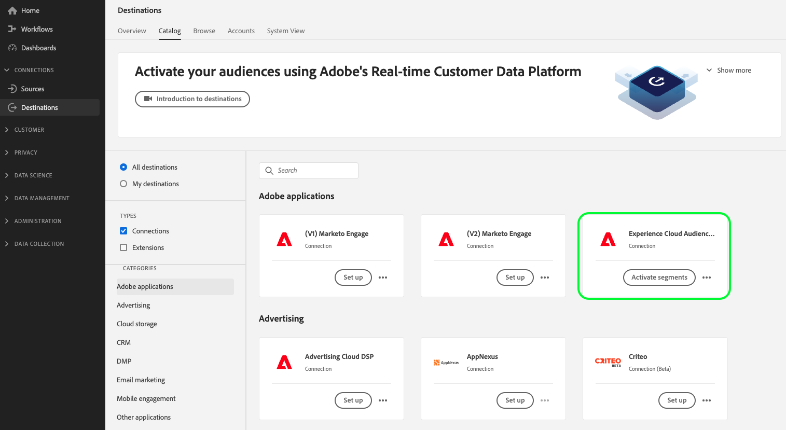
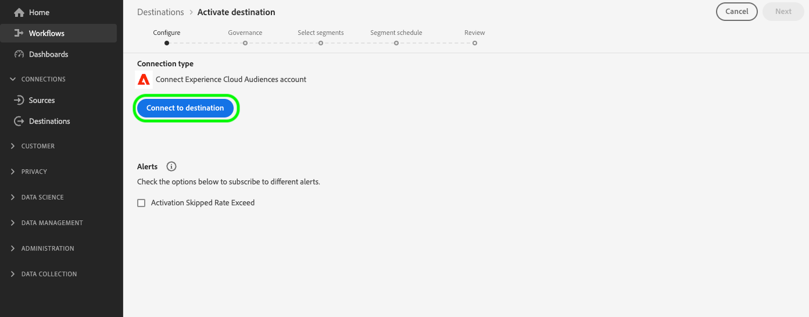

# [!UICONTROL Experience Cloud Audiences] anslutning

>[!AVAILABILITY]
>
> Det här målet är tillgängligt för [Adobe Real-time Customer Data Platform Prime och Ultimate](https://helpx.adobe.com/legal/product-descriptions/real-time-customer-data-platform.html) kunder.

Använd det här målet för att aktivera målgrupper från Real-Time CDP till Audience Manager och Adobe Analytics. Ni behöver en licens för Audience Manager för att skicka ut målgrupper till Adobe Analytics.

Använd direktanslutningarna från Real-Time CDP till att skicka målgrupper till andra Adobe-lösningar [Adobe Target](../personalization/adobe-target-connection.md), [Adobe Advertising](../advertising/adobe-advertising-cloud-connection.md), [Adobe Campaign](../email-marketing/adobe-campaign.md) och [Marketo Engage](../adobe/marketo-engage.md).

>[!IMPORTANT]
>
>Detta mål ersätter [integrering med äldre målgruppsdelning](https://experienceleague.adobe.com/docs/audience-manager/user-guide/implementation-integration-guides/integration-experience-platform/aam-aep-audience-sharing.html#aep-segments-in-aam) från Real-time Customer Data Platform till olika lösningar för Experience Cloud.
> 
>Om ni redan delar målgrupper från Real-Time CDP till Audience Manager och andra Experience Cloud via [integrering med äldre målgruppsdelning](https://experienceleague.adobe.com/docs/audience-manager/user-guide/implementation-integration-guides/integration-experience-platform/aam-aep-audience-sharing.html#aep-segments-in-aam)måste du kontakta kundtjänst för att inaktivera den gamla integreringen innan du kan använda den här destinationen.

## Användningsexempel och fördelar {#use-cases}

För att du bättre ska förstå hur och när du ska använda [!UICONTROL Experience Cloud Audiences] mål, här är exempel på användningsområden som Real-Time CDP-kunder kan lösa genom att använda denna destination.

### Aktivera användningsfall för datahanteringsplattform {#dmp-use-cases}

I Audience Manager kan du använda Real-Time CDP målgrupper för datahanteringsplattformens användningsfall, till exempel:

* Lägger till [data från tredje part](https://experienceleague.adobe.com/docs/audience-manager/user-guide/overview/data-types-collected.html#third-party-data) till era segment,
* [Algoritmisk modellering](https://experienceleague.adobe.com/docs/audience-manager/user-guide/features/algorithmic-models/look-alike-modeling/understanding-models.html);
* Aktivera era målgrupper för cookie-baserade destinationer som ännu inte stöds i Real-Time CDP destinationskatalog.

### Detaljerad kontroll över exporterade målgrupper {#segments-control}

Använd den nya självbetjäningsintegreringen för målgrupper via målgruppsmålet Experience Cloud för att välja vilka målgrupper som ska exporteras till Audience Manager och utanför. På så sätt kan ni avgöra vilka målgrupper ni vill dela med andra Experience Cloud-lösningar och vilka målgrupper ni vill behålla exklusivt i Real-Time CDP.

Tack vare den äldre integrationen av målgruppsdelning gick det inte att styra vilka målgrupper som ska exporteras till Audience Manager och vidare.

### Dela Real-Time CDP-målgrupper med andra Experience Cloud-lösningar {#share-segments-with-other-solutions}

Förutom att dela målgrupper med Audience Manager kan du med Real-Time CDP Audiences-målkortet dela målgrupper med andra Experience Cloud-lösningar som du är redo för, bland annat:

* Adobe Campaign
* Adobe Target
* Advertising Cloud
* Analytics 
* Marketo

<!--

Note: briefly talk about when to share audiences to these destinations using the existing destination cards and when to share using the new Experience Cloud Audiences destination. 

-->

## Förutsättningar {#prerequisites}

>[!IMPORTANT]
>
> * Du behöver en Audience Manager-licens för att kunna aktivera [Användningsexempel för datahanteringsplattform](#dmp-use-cases) som nämns ovan.
> * Du *behöver inte* en Audience Manager-licens för att dela Real-Time CDP-målgrupper med Adobe Advertising Cloud, Adobe Target, Marketo och andra Experience Cloud-lösningar som omnämns i [avsnitt ovan](#share-segments-with-other-solutions).

### För kunder som använder en äldre lösning för målgruppsdelning

Om ni redan delar målgrupper från Real-Time CDP till Audience Manager och andra Experience Cloud via [integrering med äldre målgruppsdelning](https://experienceleague.adobe.com/docs/audience-manager/user-guide/implementation-integration-guides/integration-experience-platform/aam-aep-audience-sharing.html#aep-segments-in-aam)måste du kontakta kundtjänst för att inaktivera den gamla integreringen.

Den tid det tar att lösa avprovisioneringsbiljetten är högst sex arbetsdagar. När den befintliga integreringen har inaktiverats kan du fortsätta till [skapa en anslutning](#connect) via självbetjäningskortet.

>[!IMPORTANT]
>
>Publiken exporterar från Real-Time CDP till dina andra lösningar stoppas i tiden mellan bildupplösningen och den tidpunkt då en ny anslutning upprättas via målkortet. Du kan minimera den här driftstoppen genom att skapa anslutningen via målkortet så snart biljetten stängs.

## Kända begränsningar och hänvisningar {#known-limitations}

Observera följande kända begränsningar och viktiga pratbubblor när du använder Publikationskortet i Experience Cloud:

* För närvarande stöds en målgrupp på Experience Cloud. Om du försöker konfigurera en andra målanslutning uppstår ett fel.
* När du ansluter till målet visas ett alternativ för att [aktivera dataflödesaviseringar](../../ui/alerts.md). Visas i användargränssnittet, men **alternativet aktivera aviseringar stöds inte för närvarande**.
* **Stöd för bakgrundsfyllning**: Den första exporten till Audience Manager eller andra lösningar från Experience Cloud omfattar en historisk målgrupp. Användare av [integrering med äldre målgruppsdelning](https://experienceleague.adobe.com/docs/audience-manager/user-guide/implementation-integration-guides/integration-experience-platform/aam-aep-audience-sharing.html#aep-segments-in-aam) som konfigurerar det här målet bör förvänta sig en ryggfyllningsdifferens på ungefär 6 timmar.

### Fördröjning vid aktivering av målgrupper {#audience-activation-latency}

Det finns fyra timmars fördröjning mellan den tidpunkt då målgrupperna först aktiveras i Real-Time CDP och den tidpunkt då de är klara att användas i Audience Manager och andra Experience Cloud-lösningar för vissa användningsfall.

Det kan ta upp till 24 timmar för målgrupper att vara fullt tillgängliga i Audience Manager för alla användningsfall och upp till 48 timmar för målgrupper från Experience Cloud att visas i Audience Manager-rapporter.

Metadata, till exempel målgruppsnamn, är tillgängliga i Audience Manager inom några minuter efter att du har konfigurerat exporten till målplatsen Experience Cloud.

## Identiteter som stöds {#supported-identities}

De profiler som exporteras till [!UICONTROL Experience Cloud Audiences] målet mappas till de identiteter som beskrivs i tabellen nedan. Läs mer om [identiteter](/help/identity-service/namespaces.md).

| Målidentitet | Beskrivning | Överväganden |
|---|---|---|
| ECID | EXPERIENCE CLOUD ID | Ett namnutrymme som representerar ECID. Detta namnutrymme kan även refereras av följande alias:&quot;Adobe Marketing Cloud ID&quot;,&quot;Adobe Experience Cloud ID&quot;,&quot;Adobe Experience Platform ID&quot;. Se följande dokument på [ECID](/help/identity-service/ecid.md) för mer information. |
| GAID | Google Advertising ID | Profiler som inhämtas till Real-Time CDP med den primära identiteten Google Advertising ID (GAID) kan exporteras till den här destinationen. |
| IDFA | Apple ID för annonsörer | Profiler som inhämtas till Real-Time CDP med den primära identiteten Apple ID for Advertisers (IDFA) kan exporteras till den här destinationen. |
| email_lc_sha256 | E-postadresser som hashas med SHA256-algoritmen | Profiler som inhämtas till Real-Time CDP med en primär identitet för hash-e-postadresser kan exporteras till det här målet. |

{style="table-layout:auto"}

## Målgrupper {#supported-audiences}

I det här avsnittet beskrivs vilken typ av målgrupper du kan exportera till det här målet.

| Målgruppsursprung | Stöds | Beskrivning |
---------|----------|----------|
| [!DNL Segmentation Service] | ✓ | Målgrupper som skapats genom Experience Platform [Segmenteringstjänst](../../../segmentation/home.md). |
| Anpassade överföringar | ✓ | Målgrupper [importerad](../../../segmentation/ui/overview.md#import-audience) till Experience Platform från CSV-filer. |

{style="table-layout:auto"}

## Exportera typ och frekvens {#export-type-frequency}

Se tabellen nedan för information om exporttyp och frekvens för destinationen.

| Objekt | Typ | Anteckningar |
|---------|----------|---------|
| Exporttyp | **[!UICONTROL Audience export]** | Du exporterar alla medlemmar i en publik som är märkta med identiteterna som listas i avsnittet ovan. |
| Exportfrekvens | **[!UICONTROL Streaming]** | Direktuppspelningsmål är alltid på API-baserade anslutningar. Så snart en profil uppdateras i Real-Time CDP baserat på målgruppsutvärdering skickar anslutningsprogrammet uppdateringen nedströms till målplattformen. Läs mer om [mål för direktuppspelning](/help/destinations/destination-types.md#streaming-destinations). |

{style="table-layout:auto"}

## Anslut till målet {#connect}

>[!IMPORTANT]
> 
>Om du vill ansluta till målet behöver du **[!UICONTROL Manage Destinations]** [behörighet för åtkomstkontroll](/help/access-control/home.md#permissions). Läs [åtkomstkontroll - översikt](/help/access-control/ui/overview.md) eller kontakta produktadministratören för att få de behörigheter som krävs.

Om du vill ansluta till det här målet följer du stegen som beskrivs i [självstudiekurs om destinationskonfiguration](../../ui/connect-destination.md). I arbetsflödet för att konfigurera mål fyller du i fälten som listas i de två avsnitten nedan.

### Autentisera till mål {#authenticate}

Om du vill autentisera mot målet väljer du **[!UICONTROL Set up]** i målkortsvyn i katalogen och välj **[!UICONTROL Connect to destination]**.

### Fyll i målinformation {#destination-details}

Om du vill konfigurera information för målet fyller du i de obligatoriska och valfria fälten nedan. En asterisk bredvid ett fält i användargränssnittet anger att fältet är obligatoriskt.

* **[!UICONTROL Name]**: Ett namn som du känner igen det här målet med i framtiden.
* **[!UICONTROL Description]**: En beskrivning som hjälper dig att identifiera det här målet i framtiden.

## Aktivera målgrupper till det här målet {#activate}

>[!IMPORTANT]
> 
>För att aktivera data behöver du **[!UICONTROL Manage Destinations]**, **[!UICONTROL Activate Destinations]**, **[!UICONTROL View Profiles]** och **[!UICONTROL View Segments]** [behörigheter för åtkomstkontroll](/help/access-control/home.md#permissions). Läs [åtkomstkontroll - översikt](/help/access-control/ui/overview.md) eller kontakta produktadministratören för att få de behörigheter som krävs.

Läs [Aktivera profiler och målgrupper för att strömma målgruppernas exportdestinationer](/help/destinations/ui/activate-segment-streaming-destinations.md) för instruktioner om hur du aktiverar målgrupper till det här målet. Observera att nej [mappningssteg](/help/destinations/ui/activate-segment-streaming-destinations.md#mapping) krävs och nej [planeringssteg](/help/destinations/ui/activate-segment-streaming-destinations.md#scheduling) är tillgängligt för det här målet.

## Validera dataexport {#exported-data}

För att validera dataexporten kan ni kontrollera att era målgrupper lyckats med exporten till er önskade Experience Cloud-lösning.

### Validera data i Audience Manager

Dina Real-Time CDP-målgrupper visas i Audience Manager som [signaler](https://experienceleague.adobe.com/docs/audience-manager/user-guide/implementation-integration-guides/integration-experience-platform/aam-aep-audience-sharing.html#aep-segments-as-aam-signals), [traits](https://experienceleague.adobe.com/docs/audience-manager/user-guide/implementation-integration-guides/integration-experience-platform/aam-aep-audience-sharing.html#aep-segments-as-aam-traits)och [segment](https://experienceleague.adobe.com/docs/audience-manager/user-guide/implementation-integration-guides/integration-experience-platform/aam-aep-audience-sharing.html#aep-segments-as-aam-segments). Du kan kontrollera i Audience Manager om data har visats enligt anvisningarna i dokumentationslänkarna ovan.

Segmentnamn börjar fyllas i Audience Manager 15 minuter efter att målgrupperna har skickats från Real-Time CDP.

Segmentpopulationen börjar strömma in i Audience Manager inom 6 timmar efter att ha skickats från Real-Time CDP och kommer att uppdateras var 24:e timme i Audience Manager.

Hela befolkningen kommer att vara synlig i Audience Manager efter 72 timmar, och populationerna fortsätter att flyta till Audience Manager om inte målgruppen tas bort från destinationen i Real-Time CDP.

## Dataanvändning och styrning {#data-usage-governance}

Alla [!DNL Real-Time CDP] destinationerna är kompatibla med dataanvändningsprinciper när data hanteras. Detaljerad information om hur [!DNL Adobe Experience Platform] använder datastyrning, läs [Datastyrning - översikt](/help/data-governance/home.md).

Datastyrningen i Real-Time CDP genomförs av båda [etiketter för dataanvändning](/help/data-governance/labels/reference.md) och marknadsföringsåtgärder.
Dataanvändningsetiketter överförs till program, men marknadsföringsåtgärder kommer inte att göra det. Det innebär att när de landar i Audience Manager kan målgrupper från Real-Time CDP exporteras till alla tillgängliga destinationer. I Audience Manager kan du använda [dataexportkontroller](https://experienceleague.adobe.com/docs/audience-manager/user-guide/features/data-export-controls.html) för att blockera målgrupper från att exporteras till vissa destinationer.

Målgrupper markerade med [!DNL HIPAA] marknadsföringsåtgärder skickas inte från Real-Time CDP till Audience Manager.

### Behörighetshantering i Audience Manager

Målgrupper och egenskaper i Audience Manager omfattas av [Rollbaserade åtkomstkontroller](https://experienceleague.adobe.com/docs/audience-manager/user-guide/features/administration/administration-overview.html) (RBAC).

Målgrupper som exporteras från Real-Time CDP tilldelas en specifik datakälla i Audience Manager som kallas **[!UICONTROL Experience Platform Segments]**.

Om du bara vill ge vissa användare åtkomst till målgrupperna kan du använda åtkomstkontroller för de målgrupper som tillhör datakällan. Du måste ange nya behörigheter för åtkomstkontroll i Audience Manager för de målgrupperna och egenskaperna som skapas från Real-Time CDP-segment.
