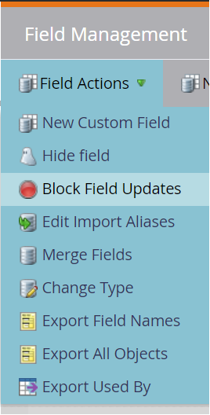

# Marketo Engage Person Sync Connection {#marketo-engage-person-sync}

>[!IMPORTANT]
>
>Den här destinationsanslutningen är i betaversion och endast tillgänglig för vissa kunder. Kontakta din Adobe-representant om du vill få åtkomst.

>[!IMPORTANT]
>
>Målkortet **[!UICONTROL Marketo Engage Person Sync]** kommer att bli inaktuellt i **mars 2026**.
>
>Granska följande nyckelpunkter och nödvändiga åtgärder för att säkerställa en smidig övergång till det nya **[[!UICONTROL Marketo Engage]](marketo-engage-connection.md)**-målet:
>
>* Alla användare med **[!UICONTROL Marketo Engage Person Sync]** mål måste migrera till det nya **[[!UICONTROL Marketo Engage]](marketo-engage-connection.md)**-målet före mars 2026.
>* **Befintliga dataflöden migreras inte automatiskt.** Du måste [konfigurera en ny anslutning](marketo-engage-connection.md#connect-to-the-destination) till det nya **[!UICONTROL Marketo Engage]**-målet och aktivera målgrupperna där.

## Översikt {#overview}

Använd Marketo Engage Person Sync-kopplingen för att strömma uppdateringar från målgrupper till motsvarande poster i din Marketo Engage-instans.

>[!IMPORTANT]
> 
>[Marketo V2 Audience Sync Connector](/help/destinations/catalog/adobe/marketo-engage.md) ska inte användas i Skapa-läge tillsammans med Profile Update Sync Connector

## Identiteter och attribut som stöds {#support-identities-and-attributes}

### Identiteter som stöds {#supported-identities}

| Målidentitet | Beskrivning |
| --------------- | ---------------------------------------------------------------------------------------------------------------------------------------------------------------------------------------- |
| E-post | Ett namnutrymme som representerar en e-postadress. Den här typen av namnutrymme är ofta kopplad till en person och kan därför användas för att identifiera den personen i olika kanaler. |

{style="table-layout:auto"}

### Attribut som stöds {#supported-attributes}

Du kan mappa attribut från Experience Platform till alla attribut som din organisation har tillgång till i Marketo. I Marketo kan du använda [Beskriv API](https://developer.adobe.com/marketo-apis/api/mapi/#tag/Leads/operation/describeUsingGET_6) -begäran för att hämta de attributfält som din organisation har åtkomst till.

## Målgrupper som stöds {#supported-audiences}

I det här avsnittet beskrivs vilka typer av målgrupper du kan exportera till det här målet.

| Målgruppsursprung | Stöds | Beskrivning |
| -------------------- | :-------: | ------------------------------------------------------------------------------------------------------------------------------------------------------------- |
| Segmenteringstjänst | ✓ | Publiker som genererats via Experience Platform [segmenteringstjänst](https://experienceleague.adobe.com/sv/docs/experience-platform/segmentation/home). |
| Anpassade överföringar | ✓ | Publiker som importerats till Experience Platform från CSV-filer. |

## Exporttyp och frekvens {#export-type-and-frequency}

Se tabellen nedan för information om exporttyp och frekvens för destinationen.

| Objekt | Typ | Anteckningar |
| ---------------- | --------- | ----------------------------------------------------------------------------------------------------------------------------------------------------------------------------------------------------------------------------------------------------------------------------------------------------------------------------------------------------------------------------------------- |
| Exportfrekvens | Direktuppspelning | Direktuppspelningsmål är alltid på API-baserade anslutningar. Så snart en profil uppdateras i Experience Platform baserat på målgruppsutvärdering skickar anslutningsprogrammet uppdateringen nedströms till målplattformen. Läs mer om [direktuppspelningsmål](/help/destinations/destination-types.md#streaming-destinations). |

{style="table-layout:auto"}

## Ställ in mål {#set-up-destination}

>[!IMPORTANT]
>
>* Om du vill ansluta till målet behöver du behörigheterna **[!UICONTROL View Destinations]** och **[!UICONTROL Manage Destinations]** [åtkomstkontroll](/help/access-control/home.md#permissions).

Om ditt företag har tillgång till flera organisationer måste du använda samma organisation i både Marketo Engage och Real-Time CDP, där du konfigurerar målanslutningen till Marketo.  Om du redan har konfigurerat ett mål kan du välja ett befintligt Marketo-konto som ska användas med den nya konfigurationen.  Om du inte gör det klickar du på uppmaningen Koppla till mål, där du kan ange namn, beskrivning och Marketo Munchkin ID för det önskade målet.  Du hittar ditt Munchkin-id för Marketo-instansen på menyn Admin->Munchkin.

>[!IMPORTANT]
>
>Användaren som ställer in målet måste ha behörigheten [Redigera person](https://experienceleague.adobe.com/sv/docs/marketo/using/product-docs/administration/users-and-roles/descriptions-of-role-permissions#access-database) i Marketo-instansen och partitionen.

* **[!UICONTROL Name]**: Ett namn som du känner igen det här målet med i framtiden.
* **[!UICONTROL Description]**: En beskrivning som hjälper dig att identifiera det här målet i framtiden.
* **[!UICONTROL Munchkin ID]**: Munchkin-id:t är den unika identifieraren för en specifik Marketo-instans.
* **[!UICONTROL Partition]**: ett koncept i Marketo Engage som används för att skilja lead-poster åt utifrån affärsproblem
* **[!UICONTROL First searchable field]**: Fält som ska dedupliceras. Fältet måste finnas i varje lead-post för indata. Standardvärdet är e-post
* **[!UICONTROL First searchable field]**: Ett sekundärt fält att deduplicera. Fältet måste finnas i varje lead-post för indata. Valfritt

När du har valt instansen måste du också välja den Lead-partition som du vill att konfigurationen ska integreras med. En [huvudpartition](https://experienceleague.adobe.com/sv/docs/marketo/using/product-docs/administration/workspaces-and-person-partitions/understanding-workspaces-and-person-partitions) är ett koncept i Marketo Engage som används för att skilja lead-poster åt efter affärsproblem, till exempel ett varumärke eller en försäljningsregion. Om din Marketo-prenumeration inte har funktionen Arbetsytor och partitioner, eller om inga ytterligare partitioner har skapats i din prenumeration, är endast standardpartitionen tillgänglig. En enskild konfiguration kan bara uppdatera lead-poster som finns i den konfigurerade partitionen.

>[!IMPORTANT]
> 
>När en målgrupp har aktiverats för första gången på Marketo-målet kan det ta *upp till 24 timmar* att fylla i profiler som redan fanns i målgruppen innan Marketo-målaktiveringen. Framöver kommer profiler som läggs till i målgruppen att läggas till i Marketo direkt.

### Fält för borttagning av dubbletter {#deduplication-fields}

När du skickar uppdateringar till Marketo-inloggning väljs poster baserat på den valda partitionen och ett eller två fält som valts av användaren. Om målet är konfigurerat med den nordamerikanska partitionen och har e-postadress och företagsnamn konfigurerat som dedupliceringsfält, måste alla tre fälten matcha för att ändringarna ska gälla för en befintlig post. Exempel:

* Målet är konfigurerat med Nordamerika-partitionen
* Person med e-postadress <test@example.com> och företagsnamn Example Inc. i Experience Platform matchar målgruppen
* Om det inte redan finns en post med dessa värden i Nordamerika-partitionen i Marketo skapas en ny lead-post

Om ingen matchande lead-post hittas skapas en ny post.

## Aktivera målgrupper {#activate-audiences}

>[!IMPORTANT]
> 
>* För att aktivera data behöver du behörigheterna **[!UICONTROL View Destinations]**, **[!UICONTROL Activate Destinations]**, **[!UICONTROL View Profiles]** och **[!UICONTROL View Segments]** [åtkomstkontroll](/help/access-control/home.md#permissions). Läs [åtkomstkontrollsöversikten](/help/access-control/ui/overview.md) eller kontakta produktadministratören för att få den behörighet som krävs.

Läs [Aktivera profiler och segment för att direktuppspela segmentexportmål](/help/destinations/ui/activate-segment-streaming-destinations.md) om du vill ha instruktioner om hur du aktiverar målgruppssegment till det här målet.

I steget Aktivera målgrupper kan du välja vilka målgrupper som ska vara synliga för dig.

## Fältmappning {#field-mapping}

För att ändringar av ett visst personattribut ska kunna skickas till Marketo Engage måste fältet mappas från ett Real-Time CDP-fält till Marketo Field.

Experience Platform datatyper och Marketo datatyper kan mappas på följande sätt:

| Experience Platform datatyp | Marketo datatyp |
| ----------------------------- | ------------------------------------ |
| Sträng | Sträng, Textområde, URL, Telefon, E-post |
| Enum | Sträng |
| Datum | Datum |
| Datum-tid | Datetime |
| Heltal | Heltal |
| Kort | Heltal |
| Lång | Float |
| Dubbel | Valuta, flyttal, procent |
| Boolean | Boolean |
| Array | Stöds inte |
| Objekt | Stöds inte |
| Karta | Stöds inte |
| Byte | Stöds inte |

{style="table-layout:auto"}

I vissa fall är det önskvärt att integreringar kan tillåta att värdet för ett fält anges om det inte finns något, samtidigt som integreringar inte kan uppdatera fält som redan har ett värde.  Om du behöver förhindra att målkopplingen skriver över befintliga värden i din Marketo Engage-instans kan du konfigurera fält så att de blockerar uppdateringar i avsnittet Admin->Fälthantering i din Marketo-instans och växla Adobe Experience Platform-källtypen.

## Dataanvändning och -styrning {#data-usage-and-governance}

Alla Adobe Experience Platform-destinationer följer dataanvändningsprinciper när data hanteras. Mer information om hur Adobe Experience Platform framtvingar datastyrning finns i [översikten över datastyrning](/help/data-governance/home.md).
