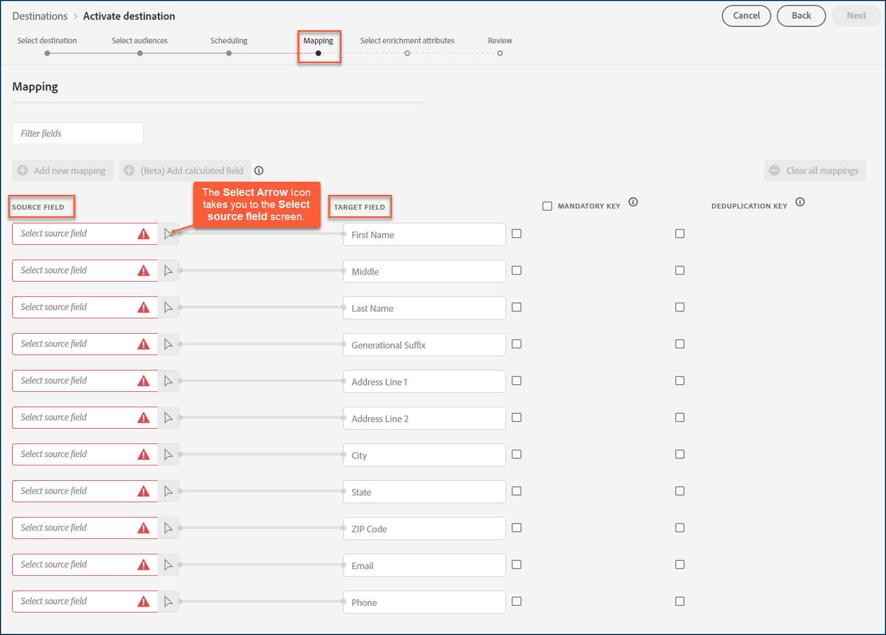

# Mål [!DNL Acxiom Audience Connection]

>[!NOTE]
>
>Målet [!DNL Acxiom Audience Connection] är i betaversion. Målanslutningen och dokumentationssidan skapas och underhålls av [!DNL Acxiom]-teamet. Kontakta Acxiom [här](mailto:acxiom-adobe-help@acxiom.com) om du har frågor eller uppdateringsfrågor.

Använd målet [!DNL Acxiom Audience Connection] för att förbättra målgrupper med tekniken [!DNL Acxiom's] [Real ID™](https://www.acxiom.com/real-id/real-id/) och aktivera målgrupper på flera plattformar, till exempel [!DNL Altice], [!DNL Ampersand], [!DNL Comcast].

Den här självstudien innehåller anvisningar om hur du skapar en [!DNL Acxiom Audience Connection]-målkoppling med användargränssnittet i [!DNL Adobe Experience Platform]. Den här kontakten skapar och distribuerar målgrupper till utvalda destinationer.

## Användningsfall {#use-cases}

För att du bättre ska kunna förstå hur och när du ska använda målet [!DNL Acxiom Audience Connection] finns det ett exempel på användning som [!DNL Adobe Experience Platform]-kunder kan lösa med den här anslutningen.

### Skicka målgrupper från Experience Platform till ditt Acxiom-konto {#send-audiences}

Använd den här målkopplingen om du är marknadsföringsproffs och vill skicka målgrupper från [!DNL Experience Platform] till ditt [!DNL Acxiom]-konto för kanalövergripande värvning.

Marknadsföringsavdelningen på ett globalt varumärke för finansiella tjänster är till exempel intresserad av att värva kunder över flera kanaler via olika annonsplattformar. De kan använda [!DNL Acxiom Audience Connection]-målanslutningen för att skicka målgrupper från [!DNL Experience Platform] till [!DNL Acxiom], förbättra målgrupperna med [!DNL Acxiom's Real ID]-teknik och aktivera målgrupperna på flera plattformar, som [!DNL Altice], [!DNL Ampersand], [!DNL Comcast] med mera.

## Förutsättningar {#prerequisites}

* **Bekräfta användningsvillkoren:** Innan du kan konfigurera ett nytt [!DNL Acxiom Audience Connection]-mål måste du läsa och signera [!DNL Acxiom's] användningsvillkoren för avtalet. Du får länken till avtalet när den genomförda försäljningsordern är slutförd.
* **Lär känna ditt företags-ID från Adobe:** Ditt [!DNL Adobe] organisations-ID krävs för att slutföra ditt användaravtal. Läs avsnittet [!DNL Adobe's] *Organisationer i Experience Cloud* om du vill ha mer information om hur du [visar ditt företags-ID](https://experienceleague.adobe.com/en/docs/core-services/interface/administration/organizations#concept_EA8AEE5B02CF46ACBDAD6A8508646255).

## Destinationer som stöds {#supported-destinations}

Målet [!DNL Acxiom Audience Connection] stöder för närvarande målgruppsaktivering på följande plattformar. 

* [!DNL Altice]
* [!DNL Ampersand]
* [!DNL Comcast]
* [!DNL Cox]
* [[!DNL LG Ads]](#lg-ads)
* [!DNL Spectrum]
* [!DNL Viant]

## Målgrupper {#supported-audiences}

I det här avsnittet beskrivs vilka typer av målgrupper du kan exportera till det här målet.

| Målgruppsursprung | Stöds | Beskrivning |
|---------|----------|----------|
| [!DNL Segmentation Service] | Ja | Publiker som genererats via Experience Platform [segmenteringstjänst](../../../segmentation/home.md). |
| Alla andra målgrupper kommer | Ja | Den här kategorin omfattar alla målgrupper som kommer utanför målgrupper som genereras via [!DNL Segmentation Service]. Läs om de [olika målgruppernas ursprung](/help/segmentation/ui/audience-portal.md#customize). Några exempel är: <ul><li> anpassade uppladdningsgrupper [importerade](../../../segmentation/ui/audience-portal.md#import-audience) till Experience Platform från CSV-filer,</li><li> lookalike-målgrupper, </li><li> federerade målgrupper, </li><li> målgrupper som har genererats i andra Experience Platform-appar som [!DNL Adobe Journey Optimizer], </li><li> med mera. </li></ul> |

{style="table-layout:auto"}

Målgrupper som stöds av olika typer av målgruppsdata:

| Typ av målgruppsdata | Stöds | Beskrivning | Användningsfall |
|--------------------|-----------|-------------|-----------|
| [Målgrupper](/help/segmentation/types/people-audiences.md) | Ja | Baserat på kundprofiler kan ni inrikta er på specifika grupper av människor för marknadsföringskampanjer. | Ofta köpare, övergivna varukorgar |
| [Kontomålgrupper](/help/segmentation/types/account-audiences.md) | Nej | Rikta er till individer inom specifika organisationer för kontobaserade marknadsföringsstrategier. | B2B-marknadsföring |
| [Prospektera målgrupper](/help/segmentation/types/prospect-audiences.md) | Nej | Rikta er till individer som ännu inte är kunder men som delar egenskaper med er målgrupp. | Prospektera med data från tredje part |
| [Datauppsättningsexport](/help/catalog/datasets/overview.md) | Nej | Samlingar med strukturerade data lagrade i datasjön [!DNL Adobe Experience Platform]. | Arbetsflöden för rapportering, datavetenskap |

{style="table-layout:auto"}

## Anslut till målet {#connect}

Autentisering till [!DNL Acxiom's Audience Connection]-målet hanteras automatiskt bakom scenerna för att underlätta för dig.

## Målspecifika inställningar {#destination-settings}

Vissa [!DNL Acxiom Audience Connection]-mål kräver ytterligare information. Avsnitten nedan innehåller detaljerad vägledning om hur du konfigurerar dessa alternativ.

### [!DNL LG Ads] {#lg-ads}

Om du vill konfigurera information för målet fyller du i fälten nedan.

* **Segmentkategori**: Målkategorin eller den lodräta som segmentet tillhör. Exempel: finansiella tjänster, bilar, hälsa osv.

## Aktivera målgrupper till det här målet {#activate}

>[!IMPORTANT]
>
>* För att aktivera data behöver du behörigheterna **[!UICONTROL View Destinations]**, **[!UICONTROL Activate Destinations]**, **[!UICONTROL View Profiles]** och **[!UICONTROL View Segments]** [åtkomstkontroll](/help/access-control/home.md#permissions). Läs [åtkomstkontrollsöversikten](/help/access-control/ui/overview.md) eller kontakta produktadministratören för att få den behörighet som krävs.
>* Om du vill exportera *identiteter* måste du ha **[!UICONTROL View Identity Graph]** [åtkomstkontrollbehörighet](/help/access-control/home.md#permissions).   {width="100" zoomable="yes"}

Läs [Aktivera målgruppsdata för att batchprofilera exportmål](/help/destinations/ui/activate-batch-profile-destinations.md) om du vill ha instruktioner om hur du aktiverar målgrupper till det här målet.

>[!NOTE]
>
>Målet [!DNL Acxiom Audience Connection] stöder endast fullständig filexport.

### Mappa attribut och identiteter {#map}

För att målplatsen [!DNL Acxiom Audience Connection] ska kunna ta emot målgruppsdata på rätt sätt måste du mappa källfälten från Experience Platform till rätt [!DNL Acxiom Audience Connection] målfält.

[!DNL Acxiom Audience Connection] tillåter bara mappning till följande målfält. Målfälten som beskrivs i tabellen nedan måste mappas i den ordning som visas nedan.

| Fältnamn | Beskrivning | Obligatoriskt | Fältordning | Maximal längd |
|---|---|---|---|---|
| Förnamn | Förnamn på individ | Nej | 1 | 255 |
| Mitten | Personens mellannamn eller inledning | Nej | 2 | 50 |
| Efternamn | Personens efternamn | Ja | 3 | 255 |
| Generationssuffix | Personens suffix | Nej | 4 | 10 |
| Adressrad 1 | Adress 1 fält för primärbosättning | Ja | 5 | 255 |
| Adressrad 2 | Adress 2 fält för primärbosättning | Nej | 6 | 255 |
| Ort | Hemort | Ja | 7 | 255 |
| Läge | Statlig förkortning av primär hemvist | Ja | 8 | 2 |
| Postnummer | Fullständigt postnummer för den primära bostaden | Ja | 9 | 10 |
| E-post | Primär e-post Som standard används det här fältet som en dedupliceringsnyckel för att göra posterna unika | Nej | 10 | 255 |
| Telefon | Telefonnummer till individ (riktnummer + nummer)  Det här fältet används som standard som en dedupliceringsnyckel för att göra posterna unika. | Nej | 11 | 10 |

I kolumnen **[!UICONTROL Source Field]** anger du namnet på vart och ett av källattributen som du vill mappa till motsvarande målfält, eller markerar pilikonen för att öppna skärmen **[!UICONTROL Select source field]**. 

När du har mappat alla fält väljer du **[!UICONTROL Next]**.

Om du inte använder standardschemat [!DNL Adobe's] läser du [Användargränssnittsguiden för frågetjänst](../../../query-service/ui/overview.md) om du vill ha mer information om hur du använder frågetjänsten för att fylla i [!DNL Adobe]-standardschemat med dina fältnamn.

### Granska {#review}

När du har slutfört alla steg ovan kan du granska din målanslutningsstatus och målgruppsinformation innan du aktiverar (distribuerar) den. De valda målgrupperna visas längst ned i en lista. Varje målgrupp blir ett separat anrop till API:t [!DNL Acxiom Audience Connection].

Om du är nöjd med resultaten väljer du **[!UICONTROL Finish]** för att aktivera målet.

## Felsökning {#troubleshooting}

Om din målrepresentant inte kan hitta din målgrupp kontaktar du [!DNL Adobe]-representanten för att få hjälp.

Du måste lämna följande information till din [!DNL Adobe]-representant:

* Målgruppsnamn
* Destinationsnamn
* Målgruppsaktiveringsdatum
* Exporterat filnamn

## Nästa steg {#next-steps}

Du har aktiverat en målgrupp för den valda målplattformen. Kontakta sedan din representant för målplattformen för att börja konfigurera kampanjen.

## Dataanvändning och styrning {#data-usage-governance}

Alla [!DNL Adobe Experience Platform]-mål är kompatibla med dataanvändningsprinciper när data hanteras. Mer information om hur [!DNL Adobe Experience Platform] använder datastyrning finns i [Översikt över datastyrning](https://experienceleague.adobe.com/en/docs/experience-platform/data-governance/home).
