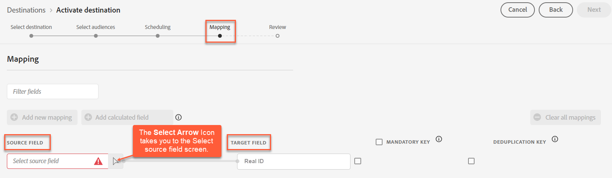

# [!DNL Acxiom Real ID™ Audience Connection] mål

>[!NOTE]
>
>Målet [!DNL Acxiom Real ID™ Audience Connection] är i betaversion. Målanslutningen och dokumentationssidan skapas och underhålls av [!DNL Acxiom]-teamet. Kontakta Acxiom [här](mailto:acxiom-adobe-help@acxiom.com) om du har frågor eller uppdateringsfrågor.

Använd målet [!DNL Acxiom Real ID Audience Connection] för att förbättra målgrupper med tekniken [!DNL Acxiom's] [Real ID™](https://www.acxiom.com/real-id/real-id/) och aktivera målgrupper på flera plattformar, till exempel [!DNL Altice], [!DNL Ampersand], [!DNL Comcast].

Den här självstudien innehåller anvisningar om hur du skapar en [!DNL Acxiom Real ID Audience Connection]-målkoppling med användargränssnittet i [!DNL Adobe Experience Platform]. Den här kopplingen används för att skapa och distribuera målgrupper till valda destinationer.

## Användningsfall {#use-cases}

Den här kopplingen stöder klienter som har inläst Acxiom Real Identity som identifierare i Real-Time CDP. För att du bättre ska kunna förstå hur och när du ska använda målet [!DNL Acxiom Real ID Audience Connection] finns det ett exempel på användning som [!DNL Adobe Experience Platform]-kunder kan lösa med den här anslutningen.

### Skicka målgrupper från Experience Platform till ditt Acxiom-konto {#send-audiences}

Använd den här målkopplingen om du är marknadsföringsproffs och vill skicka målgrupper från [!DNL Experience Platform] till ditt [!DNL Acxiom]-konto för kanalövergripande värvning.

Marknadsföringsavdelningen på ett globalt varumärke för finansiella tjänster är till exempel intresserad av att värva kunder över flera kanaler via olika annonsplattformar. De kan använda [!DNL Acxiom Real ID Audience Connection]-målanslutningen för att skicka målgrupper från [!DNL Experience Platform] till [!DNL Acxiom], förbättra målgrupperna med [!DNL Acxiom's Real ID]-teknik och aktivera målgrupperna på flera plattformar, som [!DNL Altice], [!DNL Ampersand], [!DNL Comcast] med mera.

## Förhandskrav {#prerequisites}

* **Bekräfta användningsvillkoren:** Innan du kan konfigurera ett nytt [!DNL Acxiom Real ID Audience Connection]-mål måste du läsa och signera [!DNL Acxiom's] användningsvillkoren för avtalet. Du får länken till avtalet när den genomförda försäljningsordern är slutförd. Innan du har signerat avtalet visas inte målkortet [!DNL Acxiom Real ID Audience Connection] i Experience Platform målkatalog. När du har godkänt och signerat avtalet slutför [!DNL Adobe] din introduktionsprocess och du ser målkortet [!DNL Acxiom Real ID Audience Connection].
* **Lär känna ditt företags-ID från Adobe:** Ditt [!DNL Adobe] organisations-ID krävs för att slutföra ditt användaravtal. Läs avsnittet [!DNL Adobe's] *Organisationer i Experience Cloud* om du vill ha mer information om hur du [visar ditt företags-ID](https://experienceleague.adobe.com/en/docs/core-services/interface/administration/organizations#concept_EA8AEE5B02CF46ACBDAD6A8508646255).
* **Skaffa licens för [!DNL Acxiom's Real ID] product:** När en licens har erhållits gör du Acxioms riktiga ID tillgängligt i Real-Time CDP. Mer information finns i [Dataförbättring för Acxiom](https://experienceleague.adobe.com/en/docs/experience-platform/destinations/catalog/data-partner/acxiom-data-enhancement).

## Identiteter som stöds {#supported-identities}

[!DNL Acxiom's Real ID Audience Connection]-målet stöder aktivering av identiteter som beskrivs i tabellen nedan. Läs mer om [identiteter](https://experienceleague.adobe.com/en/docs/experience-platform/identity/features/namespaces).

| Målidentitet | Beskrivning | Överväganden |
|---------------|----------------|----------------|
| Reellt ID | [!DNL Acxiom Real ID] | Välj den här målidentiteten när din källidentitet är ett Acxiom Real ID-namnområde. |
| extern_id | Anpassade användar-ID:n | Välj den här målidentiteten när källidentiteten är ett anpassat namnutrymme. |

## Målgrupper {#supported-audiences}

I det här avsnittet beskrivs vilka typer av målgrupper du kan exportera till det här målet.

| Målgruppsursprung | Stöds | Beskrivning |
|---------------|----------------|----------------|
| Segmenteringstjänst | ✓ | Publiker som genererats via Experience Platform [segmenteringstjänst](https://experienceleague.adobe.com/en/docs/experience-platform/segmentation/home). |
| Anpassade överföringar | ✓ | Publikerna [importerade](https://experienceleague.adobe.com/en/docs/experience-platform/segmentation/ui/audience-portal#import-audience) till Experience Platform från CSV-filer. |

## Mål som stöds {#supported-destinations}

[!DNL Acxiom's Real ID Audience Connection]-målet stöder för närvarande målgruppsaktivering på följande plattformar.

* [!DNL Altice]
* [!DNL Ampersand]
* [!DNL Comcast]
* [!DNL Cox]
* [[!DNL LG Ads]](#lg-ads)
* [!DNL Spectrum]
* [!DNL Viant]

## Anslut till målet {#connect}

Autentisering till [!DNL Acxiom's Real ID Audience Connection]-målet hanteras automatiskt bakom scenerna för att underlätta för dig.

## Målspecifika inställningar {#destination-settings}

Vissa [!DNL Acxiom Real ID Audience Connection]-mål kräver ytterligare information. Avsnitten nedan innehåller detaljerad vägledning om hur du konfigurerar dessa alternativ.

### [!DNL LG Ads] {#lg-ads}

Om du vill konfigurera information för målet fyller du i fälten nedan.

* **Segmentkategori**: Målkategorin eller den lodräta som segmentet tillhör. Exempel: finansiella tjänster, bilar, hälsa osv.

## Aktivera målgrupper till det här målet {#activate}

>[!IMPORTANT]
> 
>* För att aktivera data behöver du behörigheterna **[!UICONTROL View Destinations]**, **[!UICONTROL Activate Destinations]**, **[!UICONTROL View Profiles]** och **[!UICONTROL View Segments]** [åtkomstkontroll](/help/access-control/home.md#permissions). Läs [åtkomstkontrollsöversikten](/help/access-control/ui/overview.md) eller kontakta produktadministratören för att få den behörighet som krävs.
>* Om du vill exportera *identiteter* måste du ha **[!UICONTROL View Identity Graph]** [åtkomstkontrollbehörighet](/help/access-control/home.md#permissions).   {width="100" zoomable="yes"}

Läs [Aktivera målgruppsdata för att batchprofilera exportmål](https://experienceleague.adobe.com/en/docs/experience-platform/destinations/ui/activate/activate-batch-profile-destinations) om du vill ha instruktioner om hur du aktiverar målgrupper till det här målet.

>[!NOTE]
>
>Målet [!DNL Acxiom Real ID Audience Connection] stöder endast fullständig filexport.

### Mappa attribut och identiteter {#map}

För att [!DNL Acxiom Real ID Audience Connection]-målet ska kunna ta emot målgruppsdata på rätt sätt måste du mappa källfältet från Experience Platform till rätt [!DNL Acxiom Real ID Audience Connection]-målfält.

[!DNL Acxiom Real ID Audience Connection] tillåter bara mappning till följande målfält.

| Fältnamn | Beskrivning | Obligatoriskt |
|--------------------|------------|--------| 
| Reellt ID | Ett riktigt ID är en unik 36-byte alfanumerisk identifierare (ID) från Acxioms eget identitetsupplösningsdiagram, som en primärnyckel för en relationsdatabas. Det är en identifierare som representerar en person, ett hushåll eller en adress. | Ja |

I kolumnen **[!UICONTROL Source Field]** anger du namnet på källattributet som du vill mappa till motsvarande målfält, eller markerar pilikonen för att öppna skärmen **[!UICONTROL  Select source field]** . Välj sedan **[!UICONTROL Next]**.

Om du inte använder standardschemat [!DNL Adobe's] läser du [Användargränssnittsguiden för frågetjänst](../../../query-service/ui/overview.md) om du vill ha mer information om hur du använder frågetjänsten för att fylla i [!DNL Adobe]-standardschemat med dina fältnamn.

### Granska {#review}

När du har slutfört alla steg ovan kan du granska din målanslutningsstatus och målgruppsinformation innan du aktiverar (distribuerar) den. De valda målgrupperna visas längst ned i en lista. Varje målgrupp blir ett separat anrop till API:t [!DNL Acxiom Real ID Audience Connection].

Om du är nöjd med resultaten väljer du **[!UICONTROL Finish]** för att aktivera målet.

## Dataanvändning och styrning {#data-usage-governance}

Alla [!DNL Adobe Experience Platform]-mål är kompatibla med dataanvändningsprinciper när data hanteras. Mer information om hur [!DNL Adobe Experience Platform] använder datastyrning finns i [Översikt över datastyrning](https://experienceleague.adobe.com/en/docs/experience-platform/data-governance/home).

## Felsökning {#troubleshooting}

Om din målrepresentant inte kan hitta din målgrupp kontaktar du [!DNL Adobe]-representanten för att få hjälp.

Du måste lämna följande information till din [!DNL Adobe]-representant:

* Målgruppsnamn
* Destinationsnamn
* Målgruppsaktiveringsdatum
* Exporterat filnamn

## Nästa steg {#next-steps}

Genom att följa den här självstudiekursen har du aktiverat en målgrupp för den valda målplattformen. Kontakta sedan din representant för målplattformen för att börja konfigurera kampanjen.
