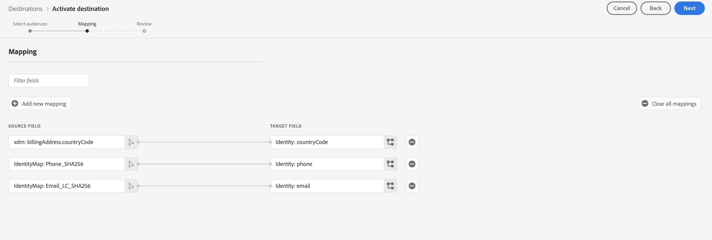

# (Beta) Amazon Ads-anslutning {#amazon-ads}

## Översikt {#overview}

Amazon Ads erbjuder en rad alternativ som hjälper er att nå era annonsmål för registrerade säljare, leverantörer, bokleverantörer, KDP-författare (Kindle Direct Publishing), apputvecklare och/eller byråer.

Integreringen av Amazon Ads med Adobe Experience Platform ger körklar integrering med Amazon Ads-produkter, inklusive Amazon DSP (ADSP). Med Amazon Ads-destinationen i Adobe Experience Platform kan man definiera målgrupper för annonsörer för målinriktning och aktivering i Amazon DSP.

Den här anslutningen stöder målgruppsskapande på följande Amazon Marketplaces: `US`, `CA`, `MX`, `BR`.

>[!IMPORTANT]
>
>Dokumentationssidan skapades av *Amazon Ads* team. Detta är för närvarande en betaprodukt och funktionaliteten kan komma att ändras. Om du har frågor eller uppdateringsfrågor kontaktar du dem direkt på *`amc-support@amazon.com`.*

## Användningsfall {#use-cases}

För att du bättre ska förstå hur och när du ska använda *Amazon Ads* mål, här är exempel på användningsområden som Adobe Experience Platform-kunder kan lösa genom att använda den här destinationen.

### Aktivering och målinriktning {#activation-and-targeting}

Tack vare integreringen med Amazon DSP kan Amazon Ads-annonsörer skicka CDP-segment för annonsörer från Adobe Experience Platform till Amazon DSP för att skapa annonsörer för målgruppsanpassning. Målgrupper kan väljas i Amazon-DSP för positiv målinriktning och negativ målinriktning (undertryckning). Med hjälp av signaler som genereras via Amazon Marketing Cloud kan annonsörer dessutom optimera sina annonsörer, vilket synkroniserar målgruppsändringar med Amazon DSP.

## Förutsättningar {#prerequisites}

För att kunna använda Amazon Ads-anslutningen med Adobe Experience Platform måste användarna först ha tillgång till ett Amazon DSP Advertiser-konto.  Besök följande sida på Amazon Ads webbplats för att få tillgång till dessa förekomster:

* [Kom igång med Amazon DSP](https://advertising.amazon.com/solutions/products/amazon-dsp?ref_=a20m_us_hnav_p_dsp_adtech)

## Identiteter som stöds {#supported-identities}

The *Amazon Ads* anslutningen stöder aktivering av identiteter som beskrivs i tabellen nedan. Läs mer om [identiteter](/help/identity-service/namespaces.md). Mer information om vilka identiteter som stöds av Amazon Ads finns på [Amazon DSP Support Center](https://advertising.amazon.com/dsp/help/ss/en/audiences#GA6BC9BW52YFXBNE).

| Målidentitet | Beskrivning | Överväganden |
|---|---|---|
| phone_sha256 | Telefonnummer hashas med SHA256-algoritmen | Både oformaterad text och SHA256-hashade telefonnummer stöds av Adobe Experience Platform. När källfältet innehåller ohash-kodade attribut markerar du **[!UICONTROL Apply transformation]** alternativ, att ha [!DNL Platform] automatiskt hash-koda data vid aktiveringen. |
| email_lc_sha256 | E-postadresser som hash-kodats med SHA256-algoritmen | Både oformaterad text och SHA256-hashade e-postadresser stöds av Adobe Experience Platform. När källfältet innehåller ohash-kodade attribut markerar du **[!UICONTROL Apply transformation]** alternativ, att ha [!DNL Platform] automatiskt hash-koda data vid aktiveringen. |

{style="table-layout:auto"}

## Exportera typ och frekvens {#export-type-frequency}

Se tabellen nedan för information om exporttyp och frekvens för destinationen.

| Objekt | Typ | Anteckningar |
---------|----------|---------|
| Exporttyp | **[!UICONTROL Segment export]** | Du exporterar alla medlemmar i ett segment (publik) med de identifierare (namn, telefonnummer eller andra) som används i *Amazon Ads* mål. |
| Exportfrekvens | **[!UICONTROL Streaming]** | Direktuppspelningsmål är alltid på API-baserade anslutningar. Så snart en profil uppdateras i Experience Platform baserat på segmentutvärdering skickar kopplingen uppdateringen nedåt till målplattformen. Läs mer om [mål för direktuppspelning](/help/destinations/destination-types.md#streaming-destinations). |

{style="table-layout:auto"}

## Anslut till målet {#connect}

>[!IMPORTANT]
> 
>Om du vill ansluta till målet behöver du **[!UICONTROL Manage Destinations]** [åtkomstkontrollbehörighet](/help/access-control/home.md#permissions). Läs [åtkomstkontroll - översikt](/help/access-control/ui/overview.md) eller kontakta produktadministratören för att få de behörigheter som krävs.

Om du vill ansluta till det här målet följer du stegen som beskrivs i [självstudiekurs om destinationskonfiguration](../../ui/connect-destination.md). I arbetsflödet för att konfigurera mål fyller du i fälten som listas i de två avsnitten nedan.

### Autentisera till mål {#authenticate}

Om du vill autentisera mot målet fyller du i de obligatoriska fälten och väljer **[!UICONTROL Connect to destination]**.

Du dirigeras till anslutningsgränssnittet för Amazon Ads där du först väljer vilka annonskonton du vill ansluta till.  Vid anslutningen omdirigeras du tillbaka till Adobe Experience Platform med en ny anslutning, som medföljer det ID för Advertiser-kontot som du har valt. Välj lämpligt Advertiser-konto på målkonfigurationsskärmen för att fortsätta.

* **[!UICONTROL Bearer token]**: Fyll i bearer-token för att autentisera mot målet.

### Fyll i målinformation {#destination-details}

Om du vill konfigurera information för målet fyller du i de obligatoriska och valfria fälten nedan. En asterisk bredvid ett fält i användargränssnittet anger att fältet är obligatoriskt.

* **[!UICONTROL Name]**: Ett namn som du känner igen det här målet med i framtiden.
* **[!UICONTROL Description]**: En beskrivning som hjälper dig att identifiera det här målet i framtiden.
* **[!UICONTROL Amazon Ads Advertiser ID]**: Välj ID för det Amazon Ads-målkonto som används för målet.

Obs! När du har valt detta Amazon Ads Advertiser ID måste du skapa ett nytt mål för att ändra detta. Om du autentiserar OAuth-autentiseringsuppgifterna igen och väljer ett nytt Advertiser-ID gäller inte ändringarna.

### Aktivera aviseringar {#enable-alerts}

Du kan aktivera varningar för att få meddelanden om dataflödets status till ditt mål. Välj en avisering i listan om du vill prenumerera och få meddelanden om status för ditt dataflöde. Mer information om varningar finns i guiden [prenumerera på destinationsvarningar med hjälp av användargränssnittet](../../ui/alerts.md).

När du är klar med informationen för målanslutningen väljer du **[!UICONTROL Next]**.

## Aktivera segment till den här destinationen {#activate}

>[!IMPORTANT]
> 
>Om du vill aktivera data måste du ha **[!UICONTROL Manage Destinations]**, **[!UICONTROL Activate Destinations]**, **[!UICONTROL View Profiles]** och **[!UICONTROL View Segments]** [behörigheter för åtkomstkontroll](/help/access-control/home.md#permissions). Läs [åtkomstkontroll - översikt](/help/access-control/ui/overview.md) eller kontakta produktadministratören för att få de behörigheter som krävs.

Läs [Aktivera profiler och segment för att direktuppspela segmentexportmål](/help/destinations/ui/activate-segment-streaming-destinations.md) om du vill ha instruktioner om hur du aktiverar målgruppssegment till det här målet.

### Mappa attribut och identiteter {#map}

Amazon Ads-anslutningen stöder hash-kodad e-postadress och hashade telefonnummer för identitetsmatchning.  Skärmbilden nedan innehåller ett exempel på matchning som är kompatibel med Amazon Ads-anslutningen:

* Om du vill mappa hash-kodade e-postadresser väljer du `Email_LC_SHA256` identitetsnamnområde som ett källfält.
* Om du vill mappa hash-kodade telefonnummer väljer du `Phone_SHA256` identitetsnamnområde som ett källfält.
* Om du vill mappa ohashade e-postadresser eller telefonnummer markerar du motsvarande ID-namnutrymmen som källfält och kontrollerar `Apply Transformation` möjlighet att låta Platform hash-koda identiteterna vid aktiveringen.

Vi rekommenderar att du mappar så många fält som du har tillgängliga. Om bara ett källattribut är tillgängligt kan du mappa ett enskilt fält.  Amazon Ads-målet använder alla mappade fält för mappningsändamål, vilket ger högre matchningsfrekvenser om fler fält anges. Mer information om godkända identifierare finns på [Hjälpsidan för Amazon Ads hashed-målgrupper](https://advertising.amazon.com/dsp/help/ss/en/audiences#GA6BC9BW52YFXBNE).

## Exporterade data/Validera dataexport {#exported-data}

När målgruppen har överförts kan du validera att målgruppen har skapats och överförts korrekt enligt följande steg:

**För Amazon DSP**

Navigera till ert annonsörs-ID → Publiker → Advertiser-målgrupper. Om målgruppen skapades och uppfyller det minsta antalet målgruppsmedlemmar visas statusvärdet för `Active`.  Mer information om er målgruppsstorlek och räckvidd finns i den prognostiserade panelen Reach till höger om Amazon DSP användargränssnitt.

## Dataanvändning och styrning {#data-usage-governance}

Alla [!DNL Adobe Experience Platform] destinationerna är kompatibla med dataanvändningsprinciper när data hanteras. Detaljerad information om hur [!DNL Adobe Experience Platform] använder datastyrning, läs [Datastyrning - översikt](/help/data-governance/home.md).

## Ytterligare resurser {#additional-resources}

Ytterligare hjälpdokumentation finns på följande hjälpresurser för Amazon Ads:

* [Amazon DSP Help Center](https://advertising.amazon.com/dsp/help/ss/en/audiences#/)
