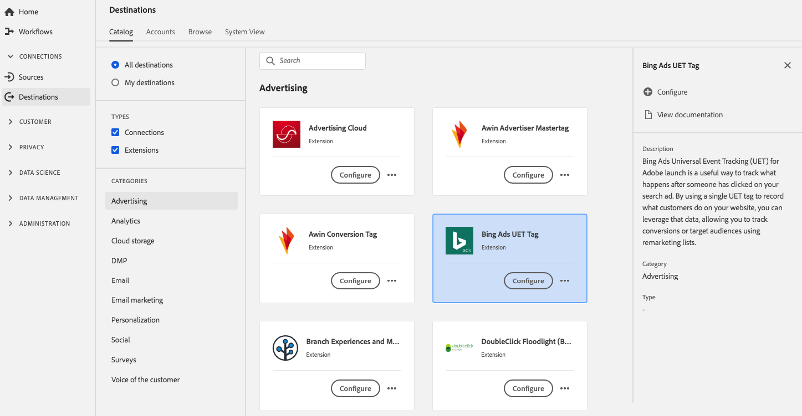

# [!DNL Bing Ads Universal Event Tracking] (UET)-tillägg {#bing-ads-extension}

## Översikt {#overview}

Taggtillägget [!DNL Bing Ads Universal Event Tracking] (UET) är ett användbart sätt att spåra vad som händer efter att någon har klickat på din sökannons. Genom att använda en enda UET-tagg för att registrera vad kunderna gör på er webbplats kan ni utnyttja dessa data och spåra konverteringar eller målgrupper med hjälp av återmarknadsföringslistor.

[!DNL Bing Ads Universal Event Tracking] (UET) är ett annonstillägg i [!DNL Adobe Experience Platform]. Mer information om tilläggsfunktionerna finns på tilläggssidan på [Adobe Exchange](https://exchange.adobe.com/experiencecloud.details.100154.html).

Det här målet är ett taggtillägg. Mer information om hur taggtillägg fungerar i Experience Platform finns i [Översikt över taggtillägg](../launch-extensions/overview.md).

## Förutsättningar {#prerequisites}

Det här tillägget är tillgängligt i katalogen [!DNL Destinations] för alla kunder som har köpt Experience Platform.

Om du vill använda det här tillägget måste du ha tillgång till taggar i [!DNL Adobe Experience Platform]. Taggar erbjuds [!DNL Adobe Experience Cloud] kunder som en inkluderad, värdeskapande funktion. Kontakta din organisations administratör för att få åtkomst till taggar och be dem att ge dig behörigheten **[!UICONTROL manage_properties]** så att du kan installera tillägg.

## Installera tillägg {#install-extension}

Så här installerar du UET-tillägget [!DNL Bing Ads Universal Event Tracking]:

Gå till [ > ](https://platform.adobe.com/) i **[!UICONTROL Destinations]** Experience Platform-gränssnittet **[!UICONTROL Catalog]**.

Välj tillägget i katalogen eller använd sökfältet.

Välj målet och välj sedan **[!UICONTROL Configure]** i den högra listen. Om kontrollen **[!UICONTROL Configure]** är nedtonad saknar du behörigheten **[!UICONTROL manage_properties]**. Se [Krav](#prerequisites).

Välj taggegenskapen som du vill installera tillägget i. Du kan också skapa en ny egenskap. En egenskap är en samling regler, dataelement, konfigurerade tillägg, miljöer och bibliotek. Läs mer om egenskaper i [taggdokumentationen](../../../tags/ui/administration/companies-and-properties.md).

Arbetsflödet tar dig till användargränssnittet för datainsamling för att slutföra installationen.

Mer information om alternativen för tilläggskonfigurering och installationsstöd finns på sidan [Bing Ads Universal Event Tracking (UET) på Adobe Exchange](https://exchange.adobe.com/experiencecloud.details.100154.html).

Du kan också installera tillägget direkt i [användargränssnittet för datainsamling](https://experience.adobe.com/#/data-collection/). Mer information finns i guiden om att [lägga till ett nytt tillägg](../../../tags/ui/managing-resources/extensions/overview.md#add-a-new-extension).

## Så här använder du tillägget {#how-to-use}

När du har installerat tillägget kan du börja konfigurera regler. I användargränssnittet för datainsamling kan du ange regler för dina installerade tillägg så att händelsedata skickas till tilläggsmålet endast i vissa situationer. Mer information om hur du konfigurerar regler för dina tillägg finns i översikten över [regler](../../../tags/ui/managing-resources/rules.md) i taggdokumentationen.

## Konfigurera, uppgradera och ta bort tillägg {#configure-upgrade-delete}

Du kan konfigurera, uppgradera och ta bort tillägg i användargränssnittet för datainsamling.

>[!TIP]
>
>Om tillägget redan är installerat på en av dina egenskaper visas ändå **[!UICONTROL Install]** för tillägget. Stäng av installationsarbetsflödet enligt beskrivningen i [Installera tillägg](#install-extension) för att konfigurera eller ta bort tillägget.

Information om hur du uppgraderar ditt tillägg finns i handboken om uppgraderingsprocessen för [tillägget](../../../tags/ui/managing-resources/extensions/extension-upgrade.md) i taggdokumentationen.
