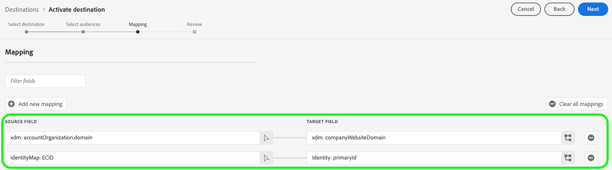

# Bomboras anslutning {#bombora}

>[!AVAILABILITY]
>
>Funktionen för att aktivera kontomålgrupper för Bomboras mål är tillgänglig för företag som köper utgåvorna [Business-to-Business](/help/rtcdp/overview.md#rtcdp-b2b) och [Business-to-Person](/help/rtcdp/overview.md#rtcdp-b2p) av Real-Time Customer Data Platform.

Aktivera profiler för era Bombora-kampanjer för målgruppsanpassning, personalisering och nedtryckning, baserat på [kontomålgrupper](/help/segmentation/types/account-audiences.md).

## Användningsfall {#use-case}

För att du bättre ska förstå hur och när du ska använda Bomboras mål finns exempel på användningsområden som Adobe Experience Platform-kunder kan lösa genom att använda den här destinationen.

### Integrering med DSP {#dsp-integration}

Som B2B-marknadsförare kan du skapa en kontolista i CDP i realtid, som identifierar företag som visar hög återgivning för dina produkter och sedan använda den här destinationen för att aktivera den här listan i Bombora.

Tack vare Bomboras integrering med DSP:er kan ni köra riktade annonskampanjer med hjälp av Bomboradata. På så sätt kan ni försäkra er om att era annonskostnader fokuseras på de företag som mest sannolikt konverterar.

### Account-Based Marketing {#abm}

Som B2B-marknadsförare kan ni skapa en kontolista baserad på CRM- och marknadsföringssignaler. Sedan kan du använda den här destinationen för att aktivera den här listan i Bombora, där ABM-kompatibla kontroller hjälper dig att rikta in dig på beslutsfattare i dessa företag.

### Kontobaserad marknadsföring i flera kanaler {#multi-channel-abm}

Som B2B-marknadsförare kan du skapa en kontolista i CDP i realtid och identifiera företag med hög återgivning. Sedan kan ni använda den här destinationen för att aktivera listan i Bombora och köra riktade kampanjer i flera kanaler.

På betalda sociala medier kan du leverera personaliserade annonser till proffs på målkonton på plattformar som [!DNL LinkedIn] och [!DNL Facebook]. Med inbyggda annonsplattformar kan ni se till att innehållet når relevanta beslutsfattare.

Ni kan även utöka kampanjer till avancerad TV och leverera annonser till viktiga konton.

Detta flerkanaliga arbetssätt säkerställer enhetliga meddelanden på olika plattformar och maximerar engagemanget och konverteringsgraden.

## Målgrupper {#supported-audiences}

I det här avsnittet beskrivs vilken typ av målgrupper du kan exportera till det här målet.

| Målgruppsursprung | Stöds | Beskrivning |
---------|----------|----------|
| [!DNL Segmentation Service] | ✓ | Publiker som genererats via Experience Platform [segmenteringstjänst](../../../segmentation/home.md). |
| Anpassade överföringar | X | Publikerna [importerade](../../../segmentation/ui/overview.md#import-audience) till Experience Platform från CSV-filer. |

{style="table-layout:auto"}

## Identiteter som stöds {#supported-identities}

Bombora kräver att målidentiteten mappas enligt tabellen nedan. Läs mer om [identiteter](/help/identity-service/features/namespaces.md).

| Målidentitet | Beskrivning |
|---|---|
| `primaryId` | Bombora kräver att den här målidentiteten mappas för att integreringen ska fungera korrekt. Du kan mappa vilket källfält som helst till den här identiteten. Denna mappning är obligatorisk men exporterar inte data till Bombora. |

{style="table-layout:auto"}

## Exportera typ och frekvens {#export-type-and-frequency}

Se tabellen nedan för information om exporttyp och frekvens för destinationen.

| Objekt | Typ | Anteckningar |
---------|----------|---------|
| Exporttyp | **[!UICONTROL Audience export]** | Du exporterar alla medlemmar i en målgrupp med identifierarna (namn, telefonnummer eller andra) som används i målet [!DNL Bombora]. |
| Exportfrekvens | **[!UICONTROL Streaming]** | Direktuppspelningsmål är alltid på API-baserade anslutningar. Så snart en profil uppdateras i Experience Platform baserat på målgruppsutvärdering skickar anslutningsprogrammet uppdateringen nedströms till målplattformen. Läs mer om [direktuppspelningsmål](/help/destinations/destination-types.md#streaming-destinations). |

{style="table-layout:auto"}

## Förhandskrav {#prerequisites}

Om du vill exportera kontogrupper till Bombora behöver du följande information.

1. Ett Bombora-konto.
2. Ett Bombora **[!UICONTROL client ID]** och **[!UICONTROL client secret]**.

## Anslut till målet {#connect}

>[!IMPORTANT]
> 
>Om du vill ansluta till målet behöver du behörigheten **[!UICONTROL View Destinations]** och **[!UICONTROL Manage Destinations]** [åtkomstkontroll](/help/access-control/home.md#permissions). Läs [åtkomstkontrollsöversikten](/help/access-control/ui/overview.md) eller kontakta produktadministratören för att få den behörighet som krävs.

Om du vill ansluta till det här målet följer du stegen som beskrivs i självstudiekursen [för destinationskonfiguration](../../ui/connect-destination.md). I arbetsflödet för att konfigurera mål fyller du i fälten som listas i de två avsnitten nedan.

### Autentisera till mål {#authenticate}

Fyll i de obligatoriska fälten och välj **[!UICONTROL Connect to destination]** om du vill autentisera mot målet.

* **[!UICONTROL Client ID]**: Ange ditt [!DNL Bombora] klient-ID.
* **[!UICONTROL Client secret]**: Ange din [!DNL Bombora]-klienthemlighet.

### Fyll i målinformation {#destination-details}

Om du vill konfigurera information för målet fyller du i de obligatoriska och valfria fälten nedan. En asterisk bredvid ett fält i användargränssnittet anger att fältet är obligatoriskt.

* **[!UICONTROL Name]**: Ett namn som du känner igen det här målet med i framtiden.
* **[!UICONTROL Description]**: En beskrivning som hjälper dig att identifiera det här målet i framtiden.

Nu kan ni aktivera era målgrupper i Bombora.

## Aktivera målgrupper till det här målet {#activate}

>[!IMPORTANT]
> 
>* För att aktivera data behöver du behörigheterna **[!UICONTROL View Destinations]**, **[!UICONTROL Activate Destinations]**, **[!UICONTROL View Profiles]** och **[!UICONTROL View Segments]** [åtkomstkontroll](/help/access-control/home.md#permissions). Läs [åtkomstkontrollsöversikten](/help/access-control/ui/overview.md) eller kontakta produktadministratören för att få den behörighet som krävs.
>* Om du vill exportera *identiteter* måste du ha **[!UICONTROL View Identity Graph]** [åtkomstkontrollbehörighet](/help/access-control/home.md#permissions).   {width="100" zoomable="yes"}

Läs [Aktivera kontomålgrupper](/help/destinations/ui/activate-account-audiences.md) om du vill ha instruktioner om hur du aktiverar kontomålgrupper till det här målet.

### Obligatoriska mappningar {#mapping}

Bomboras mål kräver att du konfigurerar följande mappningar för att kunna aktivera data.

| Source | Målfält | Beskrivning |
|---------|----------|---------|
| Valfritt värde | `Identity: primaryId` | Denna kartläggning är obligatorisk för Experience Platform att upprätta en anslutning till Bombora. Det här värdet exporteras inte till Bombora, men krävs för målkonfigurationen. Du kan välja vilket attribut som helst för källfältet. |
| `xdm: accountOrganization.domain` | `xdm: companyWebsiteDomain` | Bombora använder webbplats- eller domänadresser för att skapa en kontolista. |

## Ytterligare kommentarer och viktiga bildtexter {#additional-notes}

Om en kontopublik med samma namn aktiverades tidigare för Bombora, kommer du att få ett felmeddelande om du försöker aktivera den igen via ett annat dataflöde till Bomboras mål.

