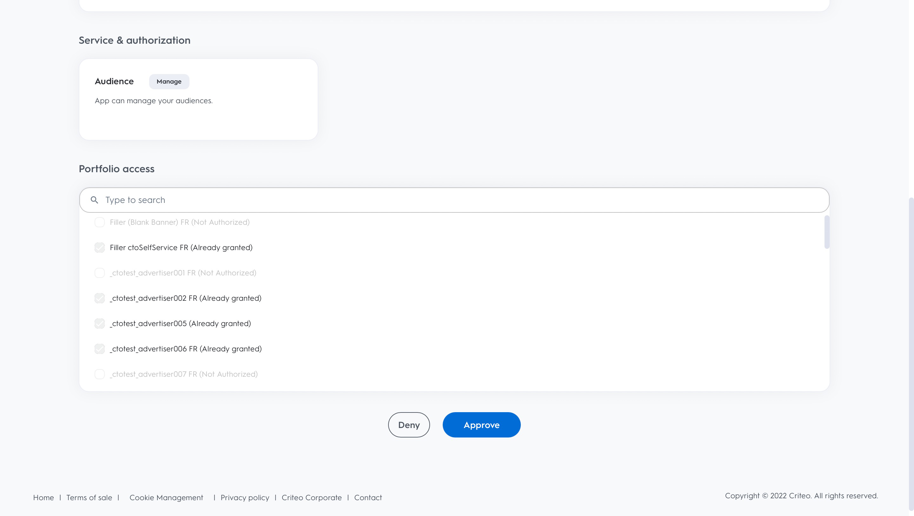

# (Beta) Kriterieanslutning

## Översikt {#overview}

>[!IMPORTANT]
>
>Målanslutningen och dokumentationssidan skapas och underhålls av Criteo. Detta är för närvarande en betaprodukt och funktionaliteten kan komma att ändras. Kontakta Criteo direkt om du har frågor eller uppdateringsfrågor [här](mailto:criteoTechnicalPartnerships@criteo.com).

Kriteriet ger betrodd och slagkraftig annonsering för att ge alla konsumenter bättre upplevelser över det öppna internet. Med världens största datauppsättning för e-handel och AI av allra högsta klass ser Criteo till att alla kontaktytor under hela kundresan är personaliserade för att nå kunder med rätt annons, vid rätt tidpunkt.

## Förutsättningar {#prerequisites}

* Du måste ha ett administratörsanvändarkonto aktiverat [Criteo Management Center](https://marketing.criteo.com).
* Du behöver ditt Criteo Advertiser ID (fråga din Criteo-kontakt om du inte har detta ID).
* Du måste ange [!DNL GUM caller ID]om du vill använda [!DNL GUM ID] som identifierare.

## Begränsningar {#limitations}

* Endast tävlingens villkor godkänns [!DNL SHA-256]-hashed och normal text emails (att omvandlas till [!DNL SHA-256] före sändning). Skicka inga PII-filer (personligt ID-nummer, till exempel namn på enskilda personer eller telefonnummer).
* Kunden måste ange minst en identifierare för villkoret. Det prioriterar [!DNL GUM ID] som identifierare över hashad e-post eftersom det ger bättre matchningsfrekvens.


## Identiteter som stöds {#supported-identities}

Kriteriet stöder aktivering av identiteter som beskrivs i tabellen nedan. Läs mer om [identiteter](https://experienceleague.adobe.com/docs/experience-platform/identity/namespaces.html#getting-started).

| Målidentitet | Beskrivning | Överväganden |
| --- | --- | --- |
| `email_sha256` | E-postadresser som hashas med SHA-256-algoritmen | Både oformaterad text och SHA-256-hashed-e-postadresser stöds av Adobe Experience Platform. När källfältet innehåller ohash-kodade attribut markerar du [!UICONTROL Apply transformation] om du vill att Platform automatiskt ska hash-koda data vid aktiveringen. |
| `gum_id` | Criteo [!DNL GUM] cookie-identifierare | [!DNL GUM IDs] tillåta klienterna att upprätthålla en korrespondens mellan sina system för användaridentifiering och Criteos användaridentifiering ([!DNL UID]). Om identifierartypen är `gum_id`, en extra parameter, [!DNL GUM Caller ID]måste också ingå. Kontakta er kontogrupp för att få reda på vad som är lämpligt [!DNL GUM Caller ID] eller om du vill ha mer information om detta [!DNL GUM ID] synkronisera, om det behövs. |

## Exportera typ och frekvens {#export-type-frequency}

Se tabellen nedan för information om exporttyp och frekvens för destinationen.

| Objekt | Typ | Anteckningar |
| --- | --- | --- |
| Exporttyp | Målgruppsexport | Du exporterar alla medlemmar i en målgrupp med identifierarna (namn, telefonnummer eller andra) som används i [!DNL Criteo] mål. |
| Exportfrekvens | Direktuppspelning | Direktuppspelningsmål är alltid på API-baserade anslutningar. Så snart en profil uppdateras i Experience Platform baserat på målgruppsutvärdering skickar anslutningsprogrammet uppdateringen nedströms till målplattformen. Läs mer om [mål för direktuppspelning](../../destination-types.md#streaming-destinations). |

## Användningsfall {#use-cases}

För att du bättre ska förstå hur du använder [!DNL Criteo] mål, här är några mål som Adobe Experience Platform-kunder kan uppnå med [!DNL Criteo]:

### Användningsfall 1: Hämta trafik

Visa upp er verksamhet med relevanta produkterbjudanden och flexibla kreatörer. Med intelligenta produktrekommendationer kommer era annonser automatiskt att innehålla de produkter som mest troligt kommer att utlösa besök och engagemang. Flexibel målinriktning gör att ni kan bygga målgrupper utifrån Criteos uppsättning av e-handelsdata eller från era egna listor över potentiella kunder och CDP-segment för Adobe.

### Använd fall 2: Öka konverteringen av webbplatser

När besökarna lämnar er webbplats bör du påminna dem om vad de missar med återannonser som ökar konverteringsgraden genom att visa specialerbjudanden och hyperrelevanta erbjudanden, vart de än går. Koppla samman era Adobe CDP-målgrupper för att återengagera befintliga kunder eller inrikta er på konsumenter som liknar era mest lojala kunder.

## Anslut till villkor {#connect}

>[!IMPORTANT]
> 
>Om du vill ansluta till målet behöver du **[!UICONTROL Manage Destinations]** [behörighet för åtkomstkontroll](/help/access-control/home.md#permissions). Läs [åtkomstkontroll - översikt](/help/access-control/ui/overview.md) eller kontakta produktadministratören för att få de behörigheter som krävs.

Om du vill ansluta till det här målet följer du stegen som beskrivs i [självstudiekurs om destinationskonfiguration](../../ui/connect-destination.md).

### Autentisera till villkor

Så här ansluter du:

1. Logga in på Adobe Experience Platform och anslut till målet för villkoret.

   

1. Du omdirigeras till Villkor för att godkänna anslutningen. Du kan först behöva logga in med dina autentiseringsuppgifter:

   

   

   


### Anslutningsparametrar {#connection-parameters}

Fyll i följande anslutningsparametrar när du har autentiserat till målet.


| Fält | Beskrivning | Obligatoriskt |
| --- | --- | --- |
| Namn | Ett namn som hjälper dig att identifiera det här målet i framtiden. Namnet som du väljer här är [!DNL Audience] namnet i Criteo Management Center och kan inte ändras i ett senare skede. | Ja |
| Beskrivning | En beskrivning som hjälper dig att identifiera det här målet i framtiden. | Nej |
| Annonsörs-ID | ID för er organisations Criteo Advertiser. Kontakta er kontoansvarige för ditt kriterium för att få denna information. | Ja |
| Criteo [!DNL GUM caller ID] | [!DNL GUM Caller ID] för er organisation. Kontakta er kontogrupp för att få reda på vad som är lämpligt [!DNL GUM Caller ID] eller om du vill ha mer information om detta [!DNL GUM] synkronisera, om det behövs. | Ja, när [!DNL GUM ID] anges som en identifierare |

### Aktivera aviseringar {#enable-alerts}

Du kan aktivera varningar för att få meddelanden om dataflödets status till ditt mål. Välj en avisering i listan om du vill prenumerera och få meddelanden om statusen för ditt dataflöde. Mer information om varningar finns i guiden på [prenumerera på destinationsvarningar med användargränssnittet](../../ui/alerts.md).

När du är klar med informationen för målanslutningen väljer du **[!UICONTROL Next]**.

## Aktivera målgrupper till det här målet {#activate-segments}

>[!IMPORTANT]
> 
>* För att aktivera data behöver du **[!UICONTROL Manage Destinations]**, **[!UICONTROL Activate Destinations]**, **[!UICONTROL View Profiles]** och **[!UICONTROL View Segments]** [behörigheter för åtkomstkontroll](/help/access-control/home.md#permissions). Läs [åtkomstkontroll - översikt](/help/access-control/ui/overview.md) eller kontakta produktadministratören för att få de behörigheter som krävs.
>* Exportera *identiteter* behöver du **[!UICONTROL View Identity Graph]** [behörighet för åtkomstkontroll](/help/access-control/home.md#permissions). <br> {width="100" zoomable="yes"}

Läs [Aktivera profiler och målgrupper för att strömma målgruppernas exportdestinationer](../../ui/activate-segment-streaming-destinations.md) för instruktioner om hur du aktiverar målgrupper till det här målet.

## Exporterade data {#exported-data}

Du kan se de exporterade målgrupperna i [Centrum för kravhantering](https://marketing.criteo.com/audience-manager/dashboard).

Begärandetexten för att lägga till en användarprofil som tas emot av [!DNL Criteo] ser anslutningen ut ungefär så här:

```json
{
  "data": {
    "type": "ContactlistWithUserAttributesAmendment",
    "attributes": {
      "operation": "add",
      "identifierType": "gum",
      "gumCallerId": "123",
      "identifiers": [
        {
          "identifier": "456",
          "attributes": [
            { "key": "ctoid_GumCaller", "value": "123" },
            { "key": "ctoid_Gum", "value": "456" },
            {
              "key": "ctoid_HashedEmail",
              "value": "98833030dc03751f2b2c1a0017078975fdae951aa6908668b3ec422040f2d4be"
            }
          ]
        }
      ]
    }
  }
}
```

Begärandetexten för borttagning av användarprofil som tas emot av [!DNL Criteo] ser anslutningen ut ungefär så här:

```json
{
  "data": {
    "type": "ContactlistWithUserAttributesAmendment",
    "attributes": {
      "operation": "remove",
      "identifierType": "gum",
      "gumCallerId": "123",
      "identifiers": [
        {
          "identifier": "456",
          "attributes": [
            { "key": "ctoid_GumCaller", "value": "123" },
            { "key": "ctoid_Gum", "value": "456" },
            {
              "key": "ctoid_HashedEmail",
              "value": "98833030dc03751f2b2c1a0017078975fdae951aa6908668b3ec422040f2d4be"
            }
          ]
        }
      ]
    }
  }
}
```

## Dataanvändning och styrning {#data-usage}

Alla Adobe Experience Platform-destinationer följer dataanvändningsprinciper när data hanteras. Mer information om hur Adobe Experience Platform använder datastyrning finns i [Datastyrning - översikt](https://experienceleague.adobe.com/docs/experience-platform/data-governance/home.html).

## Ytterligare resurser

* [Criteo Help Center](https://help.criteo.com/kb/en)
* [Criteo Developer Portal](https://developers.criteo.com)
