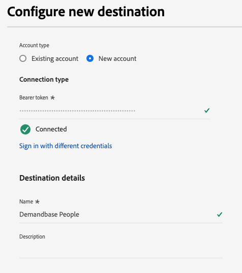

# Anslutning för Demandbase-användare {#demandbase-people}

Aktivera profiler för era Demandbase-kampanjer för målgruppsanpassning, personalisering och nedtryckning.

>[!IMPORTANT]
>
>Använd målkopplingen [Demandbase](demandbase.md) i stället för B2B-fall där du behöver [aktivera kontomaterial](../../ui/activate-account-audiences.md).

## Användningsfall {#use-case}

Marknadsförarna kan använda Adobe Real-Time CDP för att skapa en personlista med förstahandskontakter och aktivera den i Demandbase för optimerat och samordnat engagemang på sin DSP (DSP) och andra kanaler som LinkedIn.

Med den här metoden kan marknadsförarna prioritera kampanjutgifter för kända individer som har sitt eget CRM- eller marknadsföringssystem, vilket säkerställer att marknadsföringssatsningarna fokuserar på värdefulla presumtiva kunder.

När den har aktiverats optimerar Demandbase annonsleveranser och förbättrar inriktningsstrategierna för att maximera engagemanget, räckvidden och konverteringsgraden, vilket i slutänden förbättrar kampanjeffektiviteten.

## Identiteter som stöds {#supported-identities}

Anslutningen [!DNL Demandbase People] stöder aktivering av identiteter som beskrivs i tabellen nedan. Läs mer om [identiteter](/help/identity-service/features/namespaces.md).

| Målidentitet | Beskrivning | Överväganden |
|---|---|---|
| e-post | E-postadresser med oformaterad text | Endast e-postadresser med normal text stöds av anslutningen [!DNL Demandbase People]. |

{style="table-layout:auto"}

## Målgrupper {#supported-audiences}

I det här avsnittet beskrivs vilken typ av målgrupper du kan exportera till det här målet.

| Målgruppsursprung | Stöds | Beskrivning |
---------|----------|----------|
| [!DNL Segmentation Service] | ✓ | Publiker som genererats via Experience Platform [segmenteringstjänst](../../../segmentation/home.md). |
| Anpassade överföringar | X | Publikerna [importerade](../../../segmentation/ui/overview.md#import-audience) till Experience Platform från CSV-filer. |

{style="table-layout:auto"}

## Exportera typ och frekvens {#export-type-and-frequency}

Se tabellen nedan för information om exporttyp och frekvens för destinationen.

| Objekt | Typ | Anteckningar |
|--------------|-----------|---------------------------|
| Exporttyp | Målgruppsexport | Du exporterar alla medlemmar i en målgrupp med identifierarna (namn, telefonnummer eller andra) som används i målet *Demandbase*. |
| Frekvens | Direktuppspelning | Direktuppspelningsmål är alltid på API-baserade anslutningar. Så snart en profil uppdateras i Experience Platform baserat på målgruppsutvärdering skickar anslutningsprogrammet uppdateringen nedströms till målplattformen. Läs mer om [direktuppspelningsmål](/help/destinations/destination-types.md#streaming-destinations). |

{style="table-layout:auto"}

## Förhandskrav {#prerequisites}

Om du vill exportera målgrupper till Demandbase behöver du följande:

1. Ett Demandbase-konto.
2. En API-token för Demandbase. Du kan generera en API-token med användaren i Demandbase. Om du vill generera en token går du till [Min profil > API-token](https://web.demandbase.com/o/ad/at) när du har loggat in på ditt Demandbase-konto.

## Anslut till målet {#connect}

>[!IMPORTANT]
> 
>Om du vill ansluta till målet behöver du behörigheten **[!UICONTROL View Destinations]** och **[!UICONTROL Manage Destinations]** [åtkomstkontroll](/help/access-control/home.md#permissions). Läs [åtkomstkontrollsöversikten](/help/access-control/ui/overview.md) eller kontakta produktadministratören för att få den behörighet som krävs.

Om du vill ansluta till det här målet följer du stegen som beskrivs i självstudiekursen [för destinationskonfiguration](../../ui/connect-destination.md). I arbetsflödet för att konfigurera mål fyller du i fälten som listas i de två avsnitten nedan.

### Autentisera till mål {#authenticate}

Fyll i de obligatoriska fälten och välj **[!UICONTROL Connect to destination]** om du vill autentisera mot målet.

* **[!UICONTROL Bearer token]**: Fyll i bearer-token för att autentisera mot målet. Visa [förutsättningarna](#prerequisites) om du vill ha information om hur du hämtar token.

### Fyll i målinformation {#destination-details}

Om du vill konfigurera information för målet fyller du i de obligatoriska och valfria fälten nedan. En asterisk bredvid ett fält i användargränssnittet anger att fältet är obligatoriskt.

* **[!UICONTROL Name]**: Ett namn som du känner igen det här målet med i framtiden.
* **[!UICONTROL Description]**: En beskrivning som hjälper dig att identifiera det här målet i framtiden.

Nu kan ni aktivera era målgrupper inom Demandbase People.

## Aktivera målgrupper till det här målet {#activate}

>[!IMPORTANT]
> 
>* För att aktivera data behöver du behörigheterna **[!UICONTROL View Destinations]**, **[!UICONTROL Activate Destinations]**, **[!UICONTROL View Profiles]** och **[!UICONTROL View Segments]** [åtkomstkontroll](/help/access-control/home.md#permissions). Läs [åtkomstkontrollsöversikten](/help/access-control/ui/overview.md) eller kontakta produktadministratören för att få den behörighet som krävs.
>* Om du vill exportera *identiteter* måste du ha **[!UICONTROL View Identity Graph]** [åtkomstkontrollbehörighet](/help/access-control/home.md#permissions).   {width="100" zoomable="yes"}

Läs [Aktivera profiler och målgrupper för att direktuppspela målgruppsexportdestinationer](/help/destinations/ui/activate-segment-streaming-destinations.md) för instruktioner om hur du aktiverar målgrupper till det här målet.

## Ytterligare kommentarer och viktiga bildtexter {#additional-notes}

* **Demandbase API-skyddsräcken**: Om du har exporterat målgrupper till Demandbase och exporterna har lyckats i Experience Platform, men inte alla data når Demandbase, kan du ha råkat ut för API-begränsning på Demandbase-sidan. Nå ut till dem för klargöranden.
* **Listborttagning**: Personlistor är unika, så du kan inte återskapa en ny lista med ett namn som redan används. När du tar bort personer från en lista är de inte längre tillgängliga, men de tas inte bort.
* **Aktiveringstid**: Data som läses in i Demandbase behandlas över natten.
* **Målgruppsnamn**: Om en kontomålgrupp med samma namn aktiverades tidigare i Demandbase kan du inte aktivera den igen via ett annat dataflöde till Demandbase-målet.
