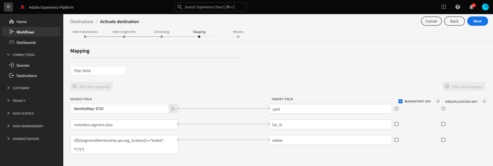

# (Beta) [!DNL Google Ad Manager 360]-anslutning

>[!IMPORTANT]
>
> Google släpper ändringar i [Google Ads API](https://developers.google.com/google-ads/api/docs/start), [Kundmatchning](https://ads-developers.googleblog.com/2023/10/updates-to-customer-match-conversion.html) och [Display &amp; Video 360 API](https://developers.google.com/display-video/api/guides/getting-started/overview) som stöder de kompatibilitetsrelaterade och medgivanderelaterade krav som definieras i [Digital Markets Act](https://digital-markets-act.ec.europa.eu/index_en) (DMA) i EU ([EU User Consent Policy](https://www.google.com/about/company/user-consent-policy/)). Tvingande av dessa ändringar av medgivandekraven gäller från och med den 6 mars 2024.
> 
>För att kunna följa EU:s policy för användargodkännande och fortsätta att skapa målgruppslistor för användare i Europeiska ekonomiska samarbetsområdet (EES) måste annonsörer och partners se till att slutanvändarnas samtycke skickas när målgruppsdata överförs. Som Google-partner tillhandahåller Adobe verktygen som krävs för att uppfylla dessa krav på medgivande enligt DMA i Europeiska unionen.
> 
>Kunder som har köpt Adobe sekretess- och säkerhetssköld och har konfigurerat en [medgivandeprincip](../../../data-governance/enforcement/auto-enforcement.md#consent-policy-evaluation) för att filtrera bort profiler som inte godkänts behöver inte vidta några åtgärder.
> 
>Kunder som inte har köpt Adobe sekretess- och säkerhetssköld måste använda [segmentdefinitionsfunktionerna](../../../segmentation/home.md#segment-definitions) i [Segment Builder](../../../segmentation/ui/segment-builder.md) för att filtrera bort profiler som inte godkänts, för att fortsätta använda de befintliga [!DNL Real-Time CDP] Google-målsättningarna utan avbrott.

Anslutningen [!DNL Google Ad Manager 360] aktiverar batchöverföring för [!DNL publisher provided identifiers] (PPID) till [!DNL Google Ad Manager 360], via [!DNL Google Cloud Storage].

Mer information om hur utgivaren tillhandahöll identifierare fungerar i Google Ad Manager 360 finns i den [officiella Google-dokumentationen](https://support.google.com/admanager/answer/2880055?hl=en).

>[!IMPORTANT]
>
>Den här destinationen finns för närvarande i Beta och är endast tillgänglig för ett begränsat antal kunder. Kontakta din Adobe-representant och uppge din [!DNL Google Ad Manager 360] om du vill få åtkomst till anslutningen [!DNL organization ID].

[!DNL Google Ad Manager 360]-målet exporterar [!DNL CSV]-filer till [!DNL Google Cloud Storage]-bucket. När du har exporterat [!DNL CSV]-filerna måste du importera dem till ditt [!DNL Google Ad Manager 360]-konto.

## Destinationsspecifikationer {#specifics}

Observera följande information som är specifik för [!DNL Google Ad Manager 360] mål.

* Det här målet stöder för närvarande inte funktionen [exportera filer on demand](../../ui/export-file-now.md).
* Aktiverade målgrupper skapas programmatiskt i Google-plattformen och fylls i i CSV-filen.

## Identiteter som stöds {#supported-identities}

[!DNL This integration] stöder aktivering av identiteter som beskrivs i tabellen nedan.

| Målidentitet | Beskrivning | Överväganden |
|---|---|---|
| PPID | [!DNL Publisher provided ID] | Välj den här målidentiteten för att skicka målgrupper till [!DNL Google Ad Manager 360] |

{style="table-layout:auto"}

## Målgrupper {#supported-audiences}

I det här avsnittet beskrivs vilka typer av målgrupper du kan exportera till det här målet.

| Målgruppsursprung | Stöds | Beskrivning |
|---------|----------|----------|
| [!DNL Segmentation Service] | Ja | Publiker som genererats via Experience Platform [segmenteringstjänst](../../../segmentation/home.md). |
| Alla andra målgrupper kommer | Ja | Den här kategorin omfattar alla målgrupper som kommer utanför målgrupper som genereras via [!DNL Segmentation Service]. Läs om de [olika målgruppernas ursprung](/help/segmentation/ui/audience-portal.md#customize). Några exempel är: <ul><li> anpassade uppladdningsgrupper [importerade](../../../segmentation/ui/audience-portal.md#import-audience) till Experience Platform från CSV-filer,</li><li> lookalike-målgrupper, </li><li> federerade målgrupper, </li><li> målgrupper som har genererats i andra Experience Platform-appar som [!DNL Adobe Journey Optimizer], </li><li> med mera. </li></ul> |

{style="table-layout:auto"}

Målgrupper som stöds av olika typer av målgruppsdata:

| Typ av målgruppsdata | Stöds | Beskrivning | Användningsfall |
|--------------------|-----------|-------------|-----------|
| [Målgrupper](/help/segmentation/types/people-audiences.md) | Ja | Baserat på kundprofiler kan ni inrikta er på specifika grupper av människor för marknadsföringskampanjer. | Ofta köpare, övergivna varukorgar |
| [Kontomålgrupper](/help/segmentation/types/account-audiences.md) | Nej | Rikta er till individer inom specifika organisationer för kontobaserade marknadsföringsstrategier. | B2B-marknadsföring |
| [Prospektera målgrupper](/help/segmentation/types/prospect-audiences.md) | Nej | Rikta er till individer som ännu inte är kunder men som delar egenskaper med er målgrupp. | Prospektera med data från tredje part |
| [Datauppsättningsexport](/help/catalog/datasets/overview.md) | Nej | Samlingar med strukturerade data lagrade i datasjön [!DNL Adobe Experience Platform]. | Arbetsflöden för rapportering, datavetenskap |

{style="table-layout:auto"}

## Exportera typ och frekvens {#export-type-frequency}

Se tabellen nedan för information om exporttyp och frekvens för destinationen.

| Objekt | Typ | Anteckningar |
|---------|----------|---------|
| Exporttyp | **[!UICONTROL Profile-based]** | Du exporterar alla medlemmar i ett segment, tillsammans med tillämpliga schemafält (till exempel ditt PPID), som du har valt på skärmen Välj profilattribut i arbetsflödet för [målaktivering](/help/destinations/ui/activate-batch-profile-destinations.md#select-attributes). |
| Exportfrekvens | **[!UICONTROL Batch]** | Batchdestinationer exporterar filer till efterföljande plattformar i steg om tre, sex, åtta, tolv eller tjugofyra timmar. Läs mer om [gruppfilsbaserade mål](/help/destinations/destination-types.md#file-based). |

{style="table-layout:auto"}

## Förutsättningar {#prerequisites}

### Tillåt listning {#allow-listing}

Tillåt-listning är obligatoriskt innan du konfigurerar ditt första [!DNL Google Ad Manager 360]-mål i Experience Platform. Se till att du slutför processen för att tillåta listning som beskrivs nedan innan du skapar ditt mål.

>[!NOTE]
>
>Undantaget till den här regeln gäller för befintliga [Audience Manager](https://experienceleague.adobe.com/docs/audience-manager/user-guide/aam-home.html)-kunder. Om du redan har skapat en anslutning till det här Google-målet i Audience Manager behöver du inte gå igenom processen för att tillåta listning igen och du kan fortsätta till nästa steg.

1. Följ stegen som beskrivs i [Google Ad Manager-dokumentationen](https://support.google.com/admanager/answer/3289669?hl=en) för att lägga till Adobe som en länkad datahanteringsplattform (DMP).
2. I gränssnittet [!DNL Google Ad Manager] går du till **[!UICONTROL Admin]** > **[!UICONTROL Global Settings]** > **[!UICONTROL Network Settings]** och aktiverar skjutreglaget **[!UICONTROL API Access]**.

## Anslut till målet {#connect}

>[!IMPORTANT]
>
>Om du vill ansluta till målet behöver du behörigheterna **[!UICONTROL View Destinations]** och **[!UICONTROL Manage Destinations]** [åtkomstkontroll](/help/access-control/home.md#permissions). Läs [åtkomstkontrollsöversikten](/help/access-control/ui/overview.md) eller kontakta produktadministratören för att få den behörighet som krävs.

Om du vill ansluta till det här målet följer du stegen som beskrivs i självstudiekursen [för destinationskonfiguration](https://experienceleague.adobe.com/docs/experience-platform/destinations/ui/connect-destination.html). I arbetsflödet för målkonfiguration fyller du i fälten som listas i de två avsnitten nedan.

### Autentisera till mål {#authenticate}

Fyll i de obligatoriska fälten och välj **[!UICONTROL Connect to destination]** om du vill autentisera mot målet.

* **[!UICONTROL Access key ID]**: En alfanumerisk sträng på 61 tecken som används för att autentisera ditt [!DNL Google Cloud Storage]-konto för Experience Platform.
* **[!UICONTROL Secret access key]**: En 40-siffrig base64-kodad sträng som används för att autentisera ditt [!DNL Google Cloud Storage]-konto för Experience Platform.

Mer information om dessa värden finns i handboken [Google Cloud Storage HMAC keys](https://cloud.google.com/storage/docs/authentication/hmackeys#overview). Anvisningar om hur du skapar ditt eget ID för åtkomstnyckel och hemlig åtkomstnyckel finns i [[!DNL Google Cloud Storage] källöversikten](/help/sources/connectors/cloud-storage/google-cloud-storage.md).

### Fyll i målinformation {#destination-details}

>[!CONTEXTUALHELP]
>id="platform_destinations_gam360_appendSegmentID"
>title="Bifoga målgrupps-ID till målgruppsnamn"
>abstract="Välj det här alternativet om målgruppsnamnet ska innehålla målgrupps-ID:t från Experience Platform, så här: `Audience Name (Audience ID)`"

Om du vill konfigurera information för målet fyller du i de obligatoriska och valfria fälten nedan. En asterisk bredvid ett fält i användargränssnittet anger att fältet är obligatoriskt.

* **[!UICONTROL Name]**: Fyll i det önskade namnet för det här målet.
* **[!UICONTROL Description]**: Valfritt. Du kan till exempel ange vilken kampanj du använder det här målet för.
* **[!UICONTROL Folder path]**: Ange sökvägen till målmappen som ska vara värd för de exporterade filerna.
* **[!UICONTROL Bucket name]**: Ange namnet på den [!DNL Google Cloud Storage]-bucket som ska användas för det här målet.
* **[!UICONTROL Account ID]**: Ange [!DNL Audience Link ID] från ditt [!DNL Google]-konto. Detta är en specifik identifierare som är associerad med ditt [!DNL Google Ad Manager]-nätverk (inte din [!DNL Network code]). Du hittar detta under **[!UICONTROL Admin > Global settings]** i gränssnittet [!DNL Google Ad Manager].
* **[!UICONTROL Account Type]**: Välj ett alternativ, beroende på ditt [!DNL Google]-konto:
   * Använd `AdX buyer` för [!DNL Google AdX]
   * Använd `DFP by Google` för [!DNL DoubleClick] för utgivare
* **[!UICONTROL Append audience ID to audience name]**: Välj det här alternativet om du vill att målgruppsnamnet i Google Ad Manager 360 ska innehålla målgrupps-ID:t från Experience Platform, enligt följande: `Audience Name (Audience ID)`.

### Aktivera aviseringar {#enable-alerts}

Du kan aktivera varningar för att få meddelanden om dataflödets status till ditt mål. Välj en avisering i listan om du vill prenumerera och få meddelanden om statusen för ditt dataflöde. Mer information om varningar finns i guiden [prenumerera på destinationsvarningar med användargränssnittet](../../ui/alerts.md).

Välj **[!UICONTROL Next]** när du är klar med att ange information för målanslutningen.

## Aktivera målgrupper till det här målet {#activate}

>[!IMPORTANT]
>
>* För att aktivera data behöver du behörigheterna **[!UICONTROL View Destinations]**, **[!UICONTROL Activate Destinations]**, **[!UICONTROL View Profiles]** och **[!UICONTROL View Segments]** [åtkomstkontroll](/help/access-control/home.md#permissions). Läs [åtkomstkontrollsöversikten](/help/access-control/ui/overview.md) eller kontakta produktadministratören för att få den behörighet som krävs.
>* Om du vill exportera *identiteter* måste du ha **[!UICONTROL View Identity Graph]** [åtkomstkontrollbehörighet](/help/access-control/home.md#permissions).   {width="100" zoomable="yes"}

Se [Aktivera målgruppsdata för att batchprofilera exportmål](../../ui/activate-batch-profile-destinations.md) för instruktioner om hur du aktiverar målgrupper till det här målet.

I steget för identitetsmappning ser du följande förifyllda mappningar:

| Mappning i förväg | Beskrivning |
|---------|----------|
| `ECID` -> `ppid` | Detta är den enda användaranpassade förifyllda mappningen. Du kan välja attribut eller identitetsnamnutrymmen från Experience Platform och mappa dem till `ppid`. |
| `metadata.segment.alias` -> `list_id` | Mappar Experience Platform målgruppsnamn till målgrupps-ID:n på Google-plattformen. |
| `iif(${segmentMembership.ups.seg_id.status}=="exited", "1","0")` -> `delete` | Anger Google när diskvalificerade användare ska tas bort från segment. |

{style="table-layout:auto"}

Dessa mappningar krävs av [!DNL Google Ad Manager 360] och skapas automatiskt av [!DNL Adobe Experience Platform] för alla [!DNL Google Ad Manager 360] anslutningar.

## Exporterade data {#exported-data}

Kontrollera [!DNL Google Cloud Storage]-pytsen och se till att de exporterade filerna innehåller de förväntade profilpopulationerna för att kontrollera om data har exporterats utan fel.

## Felsökning {#troubleshooting}

Om du råkar ut för några fel när du använder det här målet och behöver kontakta Adobe eller Google, ska du ha följande ID:n till hands.

Detta är Adobe Google konto-ID:

* **[!UICONTROL Account ID]**: 87933855
* **[!UICONTROL Customer ID]**: 89690775