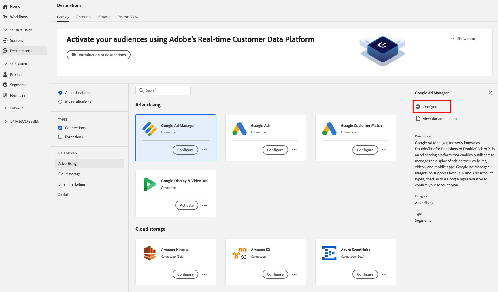

# [!DNL Google Ad Manager] anslutning

[!DNL Google Ad Manager], tidigare kallat  [!DNL DoubleClick] för utgivaren eller  [!DNL DoubleClick AdX], är en annonseringsplattform från  [!DNL Google] vilken förläggarna kan hantera annonser på sina webbplatser, via video och i mobilappar.

## Destinationsspecifikationer

Observera följande information som är specifik för [!DNL Google Ad Manager]-mål:

* Du kan skicka följande [identiteter](../../../identity-service/namespaces.md) till [!DNL Google Ads] mål: [AAM UUID](https://experienceleague.adobe.com/docs/audience-manager/user-guide/reference/ids-in-aam.html?lang=en), Google cookie ID, IDFA, GAID, Roku ID:n, Microsoft ID:n och Amazon Fire TV ID:n.
   * Google använder [AAM UUID](https://experienceleague.adobe.com/docs/audience-manager/user-guide/reference/ids-in-aam.html?lang=en) för målanvändare i Kalifornien och Google Cookie-ID för alla andra användare.
* Aktiverade målgrupper skapas programmatiskt i [!DNL Google]-plattformen.
* Plattformen har för närvarande inte något mätvärde för att validera aktiveringen. Se antalet målgrupper i Google för att validera integrationen och förstå målgruppens målgruppsstorlek.

>[!IMPORTANT]
>
>Om du vill skapa ditt första mål med [!DNL Google Ad Manager] och inte har aktiverat funktionen [ID-synkronisering](https://experienceleague.adobe.com/docs/id-service/using/id-service-api/methods/idsync.html) i Experience Cloud ID-tjänsten tidigare (med Audience Manager eller andra program) ber vi dig kontakta Adobe Consulting eller kundtjänst för att aktivera ID-synkronisering. Om du tidigare har konfigurerat [!DNL Google]-integreringar i Audience Manager överförs ID-synkroniseringarna du har konfigurerat till Platform.

### Exporttyp {#export-type}

**Segmentexport**  - du exporterar alla medlemmar i ett segment (publik) till Google-målet.

## Förutsättningar

### Tillåtelselista

>[!NOTE]
>
>Tillåtelselista är obligatoriskt innan du konfigurerar ditt första [!DNL Google Ad Manager]-mål i Platform. Kontrollera att tillåtelselista-processen som beskrivs nedan har slutförts av [!DNL Google] innan du skapar ett mål.

Innan du skapar [!DNL Google Ad Manager]-målet i Platform måste du kontakta [!DNL Google] för att Adobe ska tas med i listan över tillåtna dataleverantörer och för att ditt konto ska läggas till i tillåtelselista. Kontakta [!DNL Google] och lämna följande information:

* **Konto-ID** : det här är Adobe konto ID med  [!DNL Google]. Kontakta Adobe kundtjänst eller Adobe för att få detta ID.
* **Kund-ID** : det här är Adobe kundkonto-ID med  [!DNL Google]. Kontakta Adobe kundtjänst eller Adobe för att få detta ID.
* **Nätverks-ID** : det här är ditt konto med  [!DNL Google Ad Manager]
* **Audience Link ID** : det här är ditt konto med  [!DNL Google Ad Manager]
* Din kontotyp. DFP av Google eller AdX-köpare.

## Konfigurera mål

I **[!UICONTROL Connections]** > **[!UICONTROL Destinations]** väljer du **[!DNL Google Ad Manager]** och väljer **[!UICONTROL Configure]**.

>[!NOTE]
>
>Om det redan finns en anslutning till det här målet kan du se en **[!UICONTROL Activate]**-knapp på målkortet. Mer information om skillnaden mellan **[!UICONTROL Activate]** och **[!UICONTROL Configure]** finns i avsnittet [Katalog](../../ui/destinations-workspace.md#catalog) i dokumentationen för målarbetsytan.

I steget **Konfigurera** i arbetsflödet för att skapa mål fyller du i [!UICONTROL Basic Information] för målet.

* **[!UICONTROL Name]**: Fyll i det önskade namnet för det här målet.
* **[!UICONTROL Description]**: Valfritt. Du kan till exempel ange vilken kampanj du använder det här målet för.
* **[!UICONTROL Account Type]**: Välj ett alternativ, beroende på ditt konto hos Google:
   * Använd `DFP by Google` för [!DNL DoubleClick] för utgivare
   * Använd `AdX buyer` för [!DNL Google AdX]
* **[!UICONTROL Account ID]**: Fyll i ditt konto-ID med  [!DNL Google]. Detta kan vara ditt nätverks-ID eller ditt Audience Link-ID. Vanligtvis är detta ett åttasiffrigt ID.
* **[!UICONTROL Marketing use case]**: Fall av marknadsanvändning anger avsikten för vilken data ska exporteras till destinationen. Du kan välja bland Adobe-definierade användningsfall för marknadsföring eller skapa ett eget marknadsföringsexempel. Mer information om användningsfall för marknadsföring finns i [Översikt över dataanvändningsprinciper](../../../data-governance/policies/overview.md).

>[!NOTE]
>
>När du konfigurerar ett [!DNL Google Ad Manager]-mål ska du samarbeta med din [!DNL Google Account Manager]- eller Adobe-representant för att förstå vilken kontotyp du har.

## Aktivera segment till [!DNL Google Ad Manager]

Instruktioner om hur du aktiverar segment till [!DNL Google Ad Manager] finns i [Aktivera data till mål](../../ui/activate-destinations.md).

## Exporterade data

Kontrollera ditt [!DNL Google Ad Manager]-konto för att kontrollera om data har exporterats till [!DNL Google Ad Manager]-målet. Om aktiveringen lyckades fylls målgrupperna i ditt konto.