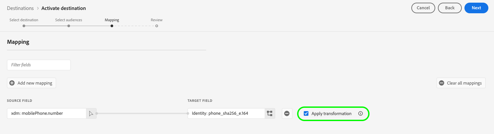

# [!DNL Google Customer Match + Display & Video 360] anslutning

Använd det här målet om du vill aktivera din PII-baserad första part [[!DNL Google Customer Match]](https://support.google.com/google-ads/answer/6379332?hl=en) listor direkt till [!DNL Google Display & Video 360] egenskaper som [!DNL Search], [!DNL YouTube], [!DNL Gmail]och [!DNL Google Display Network].

Vissa Google-integrerade tredjepartsleverantörer, som Adobe Real-Time CDP, kan använda [!DNL Google Audience Partner API] att skapa [!DNL Customer Match] målgrupper direkt i kundernas [!DNL Display & Video 360] konto.

Med den nya möjligheten att kunna utnyttja [!DNL Customer Matched] målgrupper över [!DNL Display & Video 360]kan ni nu inrikta er på målgrupper i en utökad lista med inventeringskällor.

>[!IMPORTANT]
>
>Den här målanslutningen är i betaversion och endast tillgänglig för vissa kunder. Kontakta din Adobe-representant om du vill ha åtkomst.

## Viktigt meddelande om ändringar av Google destinationer i samband med uppdaterade krav på medgivande i Europeiska unionen

>[!IMPORTANT]
>
> Google släpper ändringar i [Google Ads API](https://developers.google.com/google-ads/api/docs/start), [Kundmatchning](https://ads-developers.googleblog.com/2023/10/updates-to-customer-match-conversion.html)och [Display &amp; Video 360 API](https://developers.google.com/display-video/api/guides/getting-started/overview) för att stödja de krav på efterlevnad och samtycke som anges i [Digital Markets Act](https://digital-markets-act.ec.europa.eu/index_en) (DMA) i Europeiska unionen ([Policy för EU-användarsamtycke](https://www.google.com/about/company/user-consent-policy/)). Tvingande av dessa ändringar av medgivandekraven gäller från och med den 6 mars 2024.
> 
>För att kunna följa EU:s policy för användargodkännande och fortsätta att skapa målgruppslistor för användare i Europeiska ekonomiska samarbetsområdet (EES) måste annonsörer och partners se till att slutanvändarnas samtycke skickas när målgruppsdata överförs. Som Google-partner tillhandahåller Adobe de verktyg som krävs för att uppfylla dessa krav på medgivande enligt DMA i Europeiska unionen.
> 
>Kunder som har köpt skölden för skydd och säkerhet av Adobe och konfigurerat en [samtyckespolicy](../../../data-governance/enforcement/auto-enforcement.md#consent-policy-evaluation) om du vill filtrera bort profiler som inte är godkända behöver du inte göra något.
> 
>Kunder som inte har köpt Adobe Privacy &amp; Security Shield måste använda [segmentdefinition](../../../segmentation/home.md#segment-definitions) funktioner inom [Segment Builder](../../../segmentation/ui/segment-builder.md) för att filtrera bort profiler som inte godkänts, så att du kan fortsätta använda de befintliga Real-Time CDP Google-måltiderna utan avbrott.

## När ska det här målet användas

Flera integreringar med Google finns i målkatalogen och det kan vara svårt att förstå när man ska använda var och en av Google tillgängliga destinationer. Förstå de olika användningsfallen genom att läsa informationen i tabellen nedan:

| [Google kundmatchning](/help/destinations/catalog/advertising/google-customer-match.md) | [Google Display &amp; Video 360](/help/destinations/catalog/advertising/google-dv360.md) | [!DNL Google Customer Match] + [!DNL Display & Video 360] (denna koppling) |
|---------|----------|---------|
| Exportera era PII-baserade målgrupper och nå dem på det tillgängliga lagret i [!DNL Google Customer Match]. | Nå cookie-baserade målgrupper i alla lager via [!DNL Google Display & Video 360], på Google egna och styrda egendomar som Youtube och [!DNL Search]och mer därtill. | Skapa PII-baserade målgrupper i [!DNL Google Customer Match] och nå dem i det tillgängliga lagret i [!DNL Google Display & Video 360], endast på Google egna och styrda fastigheter. |

## Användningsfall {#use-cases}

För att du bättre ska förstå hur och när du ska använda den här destinationen finns exempel på användningsområden som Adobe Experience Platform-kunder kan lösa med den här funktionen.

### Använd skiftläge 1

Ett sportklädmärke vill nå befintliga kunder genom [!DNL Google Search] och [!DNL Google Shopping] för att personalisera erbjudanden och objekt baserat på deras tidigare inköp och webbhistorik. Kläddervarumärket kan importera e-postadresser från sin egen CRM till Experience Platform och bygga målgrupper utifrån sina egna offlinedata. Sedan kan de skicka dessa målgrupper till [!DNL Google Customer Match + Display & Video 360] mål som ska användas tvärs över [!DNL Google Display & Video 360] egenskaper som [!DNL Search], [!DNL YouTube], [!DNL Gmail]och [!DNL Google Display Network].

### Använd skiftläge 2

Ett framstående teknikföretag har lanserat en ny telefon. För att marknadsföra den nya telefonmodellen vill de öka medvetenheten om de nya funktionerna i telefonen för kunder som äger tidigare modeller av sina telefoner.

För att befordra releasen överför de e-postadresser från sin CRM-databas till Experience Platform med e-postadresserna som identifierare. Målgrupper skapas baserat på kunder som äger äldre telefonmodeller. Sedan skickas målgrupperna till [!DNL Google Customer Match]så att företaget kan inrikta sig på befintliga kunder, kunder som äger äldre telefonmodeller och liknande kunder på [!DNL Google Display & Video 360] egenskaper som [!DNL Search], [!DNL YouTube], [!DNL Gmail]och [!DNL Google Display Network].

## Identiteter som stöds {#supported-identities}

[!DNL Google Customer Match] stöder aktivering av identiteter som beskrivs i tabellen nedan. Läs mer om [identiteter](/help/identity-service/features/namespaces.md).

| Målidentitet | Beskrivning | Överväganden |
|---|---|---|
| phone_sha256_e.164 | Telefonnummer i E164-format, hashas med algoritmen SHA256 | Både oformaterad text och SHA256-hashade telefonnummer stöds av Adobe Experience Platform. Följ instruktionerna i [Krav för ID-matchning](#id-matching-requirements-id-matching-requirements) och använd lämpliga namnutrymmen för oformaterad text respektive hashade telefonnummer. När källfältet innehåller ohash-kodade attribut markerar du **[!UICONTROL Apply transformation]** alternativ, att ha [!DNL Platform] automatiskt hash-koda data vid aktiveringen. |
| email_lc_sha256 | E-postadresser som hashas med SHA256-algoritmen | Både oformaterad text och SHA256-hashade e-postadresser stöds av Adobe Experience Platform. Följ instruktionerna i [Krav för ID-matchning](#id-matching-requirements-id-matching-requirements) och använd lämpliga namnutrymmen för oformaterad text respektive hashade e-postadresser. När källfältet innehåller ohash-kodade attribut markerar du **[!UICONTROL Apply transformation]** alternativ, att ha [!DNL Platform] automatiskt hash-koda data vid aktiveringen. |

{style="table-layout:auto"}

<!-- not supported in beta

|GAID|Google Advertising ID|Select this target identity when your source identity is a GAID namespace.|
|IDFA|Apple ID for Advertisers|Select this target identity when your source identity is an IDFA namespace.|
|user_id|Custom user IDs|Select this target identity when your source identity is a custom namespace.| 

-->

## Målgrupper {#supported-audiences}

I det här avsnittet beskrivs vilka typer av målgrupper du kan exportera till det här målet.

| Målgruppsursprung | Stöds | Beskrivning |
|---------|----------|----------|
| [!DNL Segmentation Service] | ✓ | Målgrupper som skapats genom Experience Platform [Segmenteringstjänst](../../../segmentation/home.md). |
| Anpassade överföringar | ✓ | Målgrupper [importerad](../../../segmentation/ui/audience-portal.md#import-audience) till Experience Platform från CSV-filer. |

{style="table-layout:auto"}

## Exportera typ och frekvens {#export-type-frequency}

Se tabellen nedan för information om exporttyp och frekvens för destinationen.

| Objekt | Typ | Anteckningar |
---------|----------|---------|
| Exporttyp | **[!UICONTROL Audience export]** | Du exporterar alla medlemmar i en målgrupp med identifierarna (namn, telefonnummer och andra) som används i [!DNL Google Customer Match] mål. |
| Exportfrekvens | **[!UICONTROL Streaming]** | Direktuppspelningsmål är alltid på API-baserade anslutningar. Så snart en profil uppdateras i Experience Platform baserat på målgruppsutvärdering skickar anslutningsprogrammet uppdateringen nedströms till målplattformen. Läs mer om [mål för direktuppspelning](/help/destinations/destination-types.md#streaming-destinations). |

{style="table-layout:auto"}

## [!DNL Google Customer Match] kontokrav {#google-account-prerequisites}

Innan du konfigurerar en [!DNL Google Customer Match] mål i Experience Platform, se till att du läser och följer Google policy för användning av [!DNL Customer Match], konturerad i [Google supportdokumentation](https://support.google.com/google-ads/answer/6299717).

Kontrollera sedan att [!DNL Google] kontot har konfigurerats för [!DNL Standard] eller högre behörighetsnivå. Se [Google Ads-dokumentation](https://support.google.com/google-ads/answer/9978556?visit_id=637611563637058259-4176462731&amp;rd=1) för mer information.

### Tillåtelselista {#allowlist}

Innan du skapar [!DNL Google Customer Match] ska du se till att Experience Platform [!DNL Google Ads] kontot följer [[!DNL Google Customer Match] policy](https://support.google.com/google-ads/answer/6299717/customer-match-policy).

Kunder med kompatibla konton tillåtslista automatiskt av Google.

## Krav för ID-matchning {#id-matching-requirements}

[!DNL Google] kräver att ingen personligt identifierbar information (PII) skickas klart. Därför aktiverades målgrupperna [!DNL Google Customer Match] måste vara avstängd *hash* identifierare, till exempel hash-kodade e-postadresser eller telefonnummer.

Beroende på vilken typ av ID som du importerar till Adobe Experience Platform måste du följa deras motsvarande krav.

### Krav för telefonnummerhashning {#phone-number-hashing-requirements}

Det finns två sätt att aktivera telefonnummer i [!DNL Google Customer Match]:

* **Inmatning av telefonnummer i råformat**: du kan importera råa telefonnummer i [!DNL E.164] formatera till [!DNL Platform]och de hashas automatiskt när de aktiveras. Om du väljer det här alternativet måste du alltid importera dina råa telefonnummer till `Phone_E.164` namnutrymme.
* **Inmatning av hashade telefonnummer**: du kan förhash-koda dina telefonnummer innan du lägger in dem i [!DNL Platform]. Om du väljer det här alternativet måste du alltid importera dina hash-kodade telefonnummer till `PHONE_SHA256_E.164` namnutrymme.

>[!NOTE]
>
>Telefonnummer som hämtas till `Phone` namnutrymmet kan inte aktiveras för [!DNL Google Customer Match + DV360] mål.

### Krav för e-posthashning {#hashing-requirements}

Du kan hash-koda e-postadresser innan du hämtar dem till Adobe Experience Platform, eller använda e-postadresser utan att märka dem i Experience Platform, och du kan [!DNL Platform] hash-koda dem vid aktiveringen.

Mer information om Google hashkrav och andra begränsningar för aktivering finns i följande avsnitt i Google dokumentation:

* [[!DNL Customer Match] med e-postadress, adress eller användar-ID](https://developers.google.com/google-ads/api/docs/remarketing/audience-types/customer-match#customer_match_with_email_address_address_or_user_id)
* [[!DNL Customer Match] överväganden](https://developers.google.com/google-ads/api/docs/remarketing/audience-types/customer-match#customer_match_considerations)
* [[!DNL Customer Match] med telefonnummer](https://developers.google.com/google-ads/api/docs/remarketing/audience-types/customer-match#customer_match_with_phone_number)
* [[!DNL Customer Match] med mobilenhets-ID](https://developers.google.com/google-ads/api/docs/remarketing/audience-types/customer-match#customer_match_with_mobile_device_ids)

Om du vill veta mer om hur du importerar e-postadresser i Experience Platform kan du läsa [batchvis hantering - översikt](../../../ingestion/batch-ingestion/overview.md) och [översikt över direktuppspelning](../../../ingestion/streaming-ingestion/overview.md).

Om du väljer att hash-koda e-postadresserna själv måste du se till att uppfylla Google krav som beskrivs i länkarna ovan.

<!-- ### Using custom namespaces {#custom-namespaces}

Before you can use the `User_ID` namespace to send data to Google, make sure you synchronize your own identifiers using [!DNL gTag]. Refer to the [Google official documentation](https://support.google.com/google-ads/answer/9199250) for detailed information. -->

<!-- Data from unhashed namespaces is automatically hashed by [!DNL Platform] upon activation.

Attribute source data is not automatically hashed. When your source field contains unhashed attributes, check the **[!UICONTROL Apply transformation]** option, to have [!DNL Platform] automatically hash the data on activation.
 -->

<!-- ## Configure destination - video walkthrough {#video}

The video below demonstrates the steps to configure a [!DNL Google Customer Match] destination and activate audiences. The steps are also laid out sequentially in the next sections.

>[!VIDEO](https://video.tv.adobe.com/v/332599/?quality=12&learn=on&captions=eng) -->

## Anslut till målet {#connect}

>[!IMPORTANT]
> 
>Om du vill ansluta till målet behöver du **[!UICONTROL View Destinations]** och **[!UICONTROL Manage Destinations]** [behörigheter för åtkomstkontroll](/help/access-control/home.md#permissions). Läs [åtkomstkontroll - översikt](/help/access-control/ui/overview.md) eller kontakta produktadministratören för att få de behörigheter som krävs.

Om du vill ansluta till det här målet följer du stegen som beskrivs i [självstudiekurs om destinationskonfiguration](../../ui/connect-destination.md).

### Anslutningsparametrar {#parameters}

while [konfigurera](../../ui/connect-destination.md) Om du vill ange destinationen måste du ange följande information:

* **[!UICONTROL Name]**: ange ett namn för den här målanslutningen
* **[!UICONTROL Description]**: ange en beskrivning för den här målanslutningen
* **[!UICONTROL Account ID]**: din [Google Ads, kund-ID](https://support.google.com/google-ads/answer/1704344?hl=en). Formatet på ID:t är xxx-xxx-xxxx. Om du använder [!DNL Google Ads Manager Account (My Client Center)]använder du inte ditt konto-ID för chef. Använd [Google Ads, kund-ID](https://support.google.com/google-ads/answer/1704344?hl=en) i stället.
* **[!UICONTROL Account type]**: din kontotyp för Google. Välj ett alternativ, beroende på vilken typ av annonskonto du har hos Google:
   * **[!UICONTROL Display Video Partner]**
   * **[!UICONTROL Display Video Advertiser]**

### Aktivera aviseringar {#enable-alerts}

Du kan aktivera varningar för att få meddelanden om dataflödets status till ditt mål. Välj en avisering i listan om du vill prenumerera och få meddelanden om statusen för ditt dataflöde. Mer information om varningar finns i guiden på [prenumerera på destinationsvarningar med användargränssnittet](../../ui/alerts.md).

När du är klar med informationen för målanslutningen väljer du **[!UICONTROL Next]**.

## Aktivera målgrupper till det här målet {#activate}

>[!IMPORTANT]
> 
>* För att aktivera data behöver du **[!UICONTROL View Destinations]**, **[!UICONTROL Activate Destinations]**, **[!UICONTROL View Profiles]** och **[!UICONTROL View Segments]** [behörigheter för åtkomstkontroll](/help/access-control/home.md#permissions). Läs [åtkomstkontroll - översikt](/help/access-control/ui/overview.md) eller kontakta produktadministratören för att få de behörigheter som krävs.
>* Exportera *identiteter* till destinationer behöver du **[!UICONTROL View Identity Graph]** [behörighet för åtkomstkontroll](/help/access-control/home.md#permissions).   {width="100" zoomable="yes"}

Se [Aktivera målgruppsdata för direktuppspelad målgruppsexport](../../ui/activate-segment-streaming-destinations.md) för instruktioner om hur du aktiverar målgrupper till det här målet.

<!-- In the **[!UICONTROL Segment schedule]** step, you must provide the [!UICONTROL App ID] when sending [!DNL IDFA] or [!DNL GAID] audiences to [!DNL Google Customer Match].

For details on how to find the [!DNL App ID], refer to the [Google official documentation](https://developers.google.com/adwords/api/docs/reference/v201809/AdwordsUserListService.CrmBasedUserList#appid) or ask your Google representative. -->

### Mappningsexempel: aktivera målgruppsdata i [!DNL Google Customer Match + Display & Video 360] {#example-gcm}

Detta är ett exempel på korrekt identitetsmappning när målgruppsdata aktiveras i [!DNL Google Customer Match + Display & Video 360].

Välja källfält:

* Välj `Email` namnutrymmet som källidentitet om e-postadresserna du använder inte hashas.
* Välj `Email_LC_SHA256` namnrymd som källidentitet om du har hasarkiverat e-postadresser till kundens inmatning i [!DNL Platform], enligt [!DNL Google Customer Match] [krav på e-posthashning](#hashing-requirements).
* Välj `PHONE_E.164` namnutrymme som källidentitet om dina data består av icke-hash-kodade telefonnummer. [!DNL Platform] kommer att hash-koda telefonnumren för att uppfylla [!DNL Google Customer Match] krav.
* Välj `Phone_SHA256_E.164` namnrymd som källidentitet om du hashade telefonnummer vid datainmatning till [!DNL Platform], enligt [!DNL Facebook] [hashkrav för telefonnummer](#phone-number-hashing-requirements).

Markera målfält:

* Välj `Email_LC_SHA256` namespace som target identity när källnamnutrymmena antingen är `Email` eller `Email_LC_SHA256`.
* Välj `Phone_SHA256_E.164` namespace som target identity när källnamnutrymmena antingen är `PHONE_E.164` eller `Phone_SHA256_E.164`.

Data från namnutrymmen utan hashning hashas automatiskt av [!DNL Platform] vid aktivering.

Attributkälldata hashas inte automatiskt. När källfältet innehåller ohash-kodade attribut markerar du **[!UICONTROL Apply transformation]** alternativ, att ha [!DNL Platform] automatiskt hash-koda data vid aktiveringen.

## Verifiera att målgruppsaktiveringen lyckades {#verify-activation}

När aktiveringsflödet är klart växlar du till **[!UICONTROL Google Ads]** konto. De aktiverade målgrupperna visas i ditt Google-konto som kundlistor. Beroende på målgruppens storlek fyller vissa målgrupper inte plats om det inte finns fler än 1 000 aktiva användare att betjäna. Mer information finns i [Dokumentation för Google Audience Partner](https://developers.google.com/audience-partner/api/docs/customer-match/get-started#verify-list). Observera att du måste be Google om åtkomst till dokumentationen i länken.

## Datastyrning

Vissa destinationer i Experience Platform har vissa regler och skyldigheter för data som skickas till eller tas emot från destinationsplattformen. Du ansvarar för att förstå begränsningar och skyldigheter för dina data och hur du använder dessa data i Adobe Experience Platform och målplattformen. Adobe Experience Platform tillhandahåller datastyrningsverktyg som hjälper er att hantera vissa av dessa dataanvändningsskyldigheter. [Läs mer](../../../data-governance/labels/overview.md) om verktyg och policyer för datastyrning.

## Felsökning {#troubleshooting}

### 400 Felmeddelande för felaktig begäran {#bad-request}

När du konfigurerar det här målet kan du få följande fel:

`{"message":"Google Customer Match Error: OperationAccessDenied.ACTION_NOT_PERMITTED","code":"400 BAD_REQUEST"}`

Det här felet inträffar när kundkonton inte uppfyller [krav](#google-account-prerequisites). Kontakta Google och kontrollera att ditt konto är godkänt och konfigurerat för en [!DNL Standard] eller högre behörighetsnivå. Se [Google Ads-dokumentation](https://support.google.com/google-ads/answer/9978556?visit_id=637611563637058259-4176462731&amp;rd=1) för mer information.
