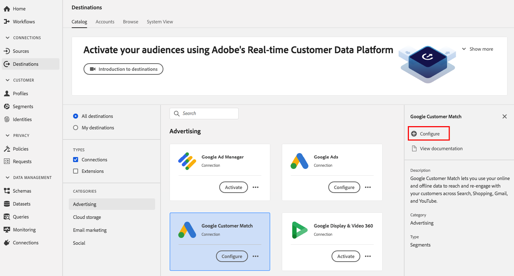
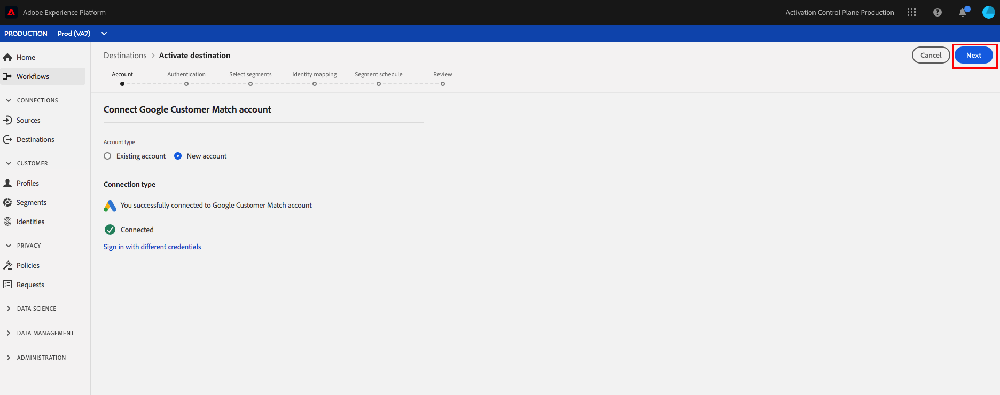

# [!DNL Google Customer Match] anslutning

## Översikt {#overview}

[Med Google Customer ](https://support.google.com/google-ads/answer/6379332?hl=en) Matchlets kan ni använda era online- och offlinedata för att nå och återengagera era kunder över Googles egna och styrda egenskaper, som:  [!DNL Search],  [!DNL Shopping],  [!DNL Gmail]och  [!DNL YouTube].

## Användningsfall

För att du bättre ska kunna förstå hur och när du ska använda [!DNL Google Customer Match]-målet finns det exempel på användningsområden som Adobe Experience Platform-kunder kan lösa genom att använda den här funktionen.

### Använd skiftläge 1

Ett sportklädmärke vill nå befintliga kunder via [!DNL Google Search] och [!DNL Google Shopping] för att personalisera erbjudanden och objekt baserat på deras tidigare köp och webbhistorik. Det klädvarumärket kan importera e-postadresser från sin egen CRM till Experience Platform och bygga segment utifrån sina egna offlinedata. Sedan kan de skicka dessa segment till [!DNL Google Customer Match] för användning i [!DNL Search] och [!DNL Shopping], vilket optimerar deras annonsutgifter.

### Använd skiftläge 2

Ett framstående teknikföretag lanserade en ny telefon. För att marknadsföra den nya telefonmodellen vill de öka medvetenheten om de nya funktionerna i telefonen för kunder som äger tidigare modeller av sina telefoner.

För att befordra releasen överför de e-postadresser från sin CRM-databas till Experience Platform med e-postadresserna som identifierare. Segment skapas baserat på kunder som äger äldre telefonmodeller. Sedan skickas segment till [!DNL Google Customer Match] så att företaget kan inrikta sig på befintliga kunder, kunder som äger äldre telefonmodeller och liknande kunder på [!DNL YouTube].

## Datastyrning för [!DNL Google Customer Match] mål {#data-governance}

Vissa destinationer i Experience Platform har vissa regler och skyldigheter för data som skickas till eller tas emot från destinationsplattformen. Du ansvarar för att förstå begränsningar och skyldigheter för dina data och hur du använder dessa data i Adobe Experience Platform och målplattformen. Adobe Experience Platform tillhandahåller datastyrningsverktyg som hjälper er att hantera vissa av dessa dataanvändningsskyldigheter. [Läs ](../../..//data-governance/labels/overview.md) mer om verktyg och policyer för datastyrning.

## Identiteter som stöds {#supported-identities}

[!DNL Google Customer Match] stöder aktivering av identiteter som beskrivs i tabellen nedan. Läs mer om [identiteter](/help/identity-service/namespaces.md).

| Målidentitet | Beskrivning | Överväganden |
|---|---|---|
| GAID | Google Advertising ID | Välj den här målidentiteten när din källidentitet är ett GAID-namnområde. |
| IDFA | Apple ID för annonsörer | Välj den här målidentiteten när din källidentitet är ett IDFA-namnutrymme. |
| phone_sha256_e.164 | Telefonnummer i E164-format som hashas med SHA256-algoritmen | Både oformaterad text och SHA256-hashade telefonnummer stöds av Adobe Experience Platform. Följ instruktionerna i [kraven för ID-matchning](#id-matching-requirements-id-matching-requirements) och använd lämpliga namnutrymmen för normal text respektive hashade telefonnummer. När källfältet innehåller ohashade attribut bör du markera alternativet **[!UICONTROL Apply transformation]** så att [!DNL Platform] automatiskt hash-kodar data vid aktiveringen. |
| email_lc_sha256 | E-postadresser som hash-kodats med SHA256-algoritmen | Både oformaterad text och SHA256-hashade e-postadresser stöds av Adobe Experience Platform. Följ instruktionerna i [kraven för ID-matchning](#id-matching-requirements-id-matching-requirements) och använd lämpliga namnutrymmen för oformaterad text respektive hashade e-postadresser. När källfältet innehåller ohashade attribut bör du markera alternativet **[!UICONTROL Apply transformation]** så att [!DNL Platform] automatiskt hash-kodar data vid aktiveringen. |
| user_id | Anpassade användar-ID:n | Välj den här målidentiteten när källidentiteten är ett anpassat namnutrymme. |

## Exporttyp {#export-type}

**Segmentexport**  - du exporterar alla medlemmar i ett segment (publik) med de identifierare (namn, telefonnummer och andra) som används i  [!DNL Google Customer Match] målet.

## [!DNL Google Customer Match] kontokrav  {#google-account-prerequisites}

Innan du konfigurerar ett [!DNL Google Customer Match]-mål i Experience Platform måste du läsa och följa Googles policy för att använda [!DNL Customer Match], som beskrivs i [Google Support-dokumentationen](https://support.google.com/google-ads/answer/6299717).

### Tillåtelselista {#allowlist}

>[!NOTE]
>
>Det är obligatoriskt att lägga till i Googles tillåtelselista innan du ställer in ditt första [!DNL Google Customer Match]-mål i Experience Platform. Kontrollera att tillåtelselista-processen som beskrivs nedan har slutförts av Google innan du skapar ett mål.

Innan du skapar [!DNL Google Customer Match]-målet i Experience Platform måste du kontakta Google och följa instruktionerna i [Använd kundmatchningspartners för att överföra dina data](https://support.google.com/google-ads/answer/7361372?hl=en&amp;ref_topic=6296507) i Googles dokumentation.

Det finns också en andra Google tillåtelselista som du måste lägga till ditt konto i om du planerar att överföra data med Googles [användar-ID](https://developers.google.com/adwords/api/docs/guides/remarketing#customer_match_with_email_address_address_or_user_id). Om du vill lägga till ditt konto i tillåtelselista kontaktar du din kontohanterare för Google.

## Krav för ID-matchning {#id-matching-requirements}

[!DNL Google] kräver att ingen personligt identifierbar information (PII) skickas klart. Därför kan målgrupper som är aktiverade för [!DNL Google Customer Match] vara avstängda från *hash*-identifierare, till exempel e-postadresser eller telefonnummer.

Beroende på vilken typ av ID som du importerar till Adobe Experience Platform måste du följa deras motsvarande krav.

## Kraven för hashning av telefonnummer {#phone-number-hashing-requirements}

Det finns två sätt att aktivera telefonnummer i [!DNL Google Customer Match]:

* **Hämtar råtelefonnummer**: kan du importera råa telefonnummer i  [!DNL E.164] formatet till  [!DNL Platform]och de hashas automatiskt när de aktiveras. Om du väljer det här alternativet måste du alltid importera dina raw-telefonnummer till namnutrymmet `Phone_E.164`.
* **Inmatning av hashade telefonnummer**: du kan förhash-koda dina telefonnummer innan du tar dig in i  [!DNL Platform]. Om du väljer det här alternativet måste du alltid importera dina hashade telefonnummer till namnutrymmet `PHONE_SHA256_E.164`.

>[!NOTE]
>
>Telefonnummer som är inkapslade i namnområdet `Phone` kan inte aktiveras i [!DNL Google Customer Match].

## Krav för e-posthashning {#hashing-requirements}

Du kan hash-koda e-postadresser innan du importerar dem till Adobe Experience Platform, eller använda e-postadresser i klartext i Experience Platform, och låta [!DNL Platform] hash-koda dem när de aktiveras.

Mer information om Googles hash-krav och andra begränsningar för aktivering finns i följande avsnitt i Googles dokumentation:

* [[!DNL Customer Match] med e-postadress, adress eller användar-ID](https://developers.google.com/adwords/api/docs/guides/remarketing#customer_match_with_email_address_address_or_user_id)
* [[!DNL Customer Match] överväganden](https://developers.google.com/adwords/api/docs/guides/remarketing#customer_match_considerations)
* [Kundmatchning med telefonnummer](https://developers.google.com/adwords/api/docs/guides/remarketing#customer_match_with_phone_number)
* [Kundmatchning med mobila enhets-ID:n](https://developers.google.com/adwords/api/docs/guides/remarketing#customer_match_with_mobile_device_ids)

Om du vill veta mer om att importera e-postadresser i Experience Platform kan du läsa översikten [över gruppimporten](../../../ingestion/batch-ingestion/overview.md) och översikten [över direktuppspelningsförslag](../../../ingestion/streaming-ingestion/overview.md).

Om du väljer att hash-koda e-postadresserna själv måste du se till att följa kraven för Google som beskrivs i länkarna ovan.

## Använda anpassade namnutrymmen {#custom-namespaces}

Innan du kan använda namnutrymmet `User_ID` för att skicka data till Google måste du synkronisera dina egna identifierare med [!DNL gTag]. Mer information finns i [Googles officiella dokumentation](https://support.google.com/google-ads/answer/9199250).

<!-- Data from unhashed namespaces is automatically hashed by [!DNL Platform] upon activation.

Attribute source data is not automatically hashed. When your source field contains unhashed attributes, check the **[!UICONTROL Apply transformation]** option, to have [!DNL Platform] automatically hash the data on activation.
 -->

## Konfigurera mål - videogenomgång {#video}

I videon nedan visas stegen för att konfigurera ett [!DNL Google Customer Match]-mål och aktivera segment. Stegen beskrivs också sekventiellt i de följande avsnitten.

>[!VIDEO](https://video.tv.adobe.com/v/332599/?quality=12&learn=on&captions=eng)

## Anslut till målet {#connect-destination}

Bläddra till kategorin **[!UICONTROL Advertising]** i **[!UICONTROL Destinations]** > **[!UICONTROL Catalog]**. Välj [!DNL Google Customer Match] och sedan **[!UICONTROL Configure]**.

>[!NOTE]
>
>Om det finns en anslutning till det här målet kan du se en **[!UICONTROL Activate]**-knapp på målkortet. Mer information om skillnaden mellan **[!UICONTROL Activate]** och **[!UICONTROL Configure]** finns i avsnittet [Katalog](../../ui/destinations-workspace.md#catalog) i dokumentationen för målarbetsytan.

Om du tidigare har konfigurerat en anslutning till ditt [!DNL Google Customer Match]-mål väljer du **[!UICONTROL Existing Account]** och väljer din befintliga anslutning i steget **Konto**. Du kan också välja **[!UICONTROL New Account]** för att konfigurera en ny anslutning till [!DNL Google Customer Match]. Om du vill logga in och ansluta Adobe Experience Cloud till ditt [!DNL Google Ad]-konto väljer du **[!UICONTROL Connect to destination]**.

>[!NOTE]
>
>Experience Platform stöder validering av autentiseringsuppgifter i autentiseringsprocessen. Ett felmeddelande visas om du anger felaktiga autentiseringsuppgifter för ditt [!DNL Google Ad]-konto, så att du inte slutför arbetsflödet med felaktiga autentiseringsuppgifter.

När dina inloggningsuppgifter har bekräftats och Adobe Experience Cloud är anslutet till ditt Google-konto kan du välja **[!UICONTROL Next]** för att fortsätta till **[!UICONTROL Authentication]**-steget.

I steget **[!UICONTROL Authentication]** anger du **[!UICONTROL Name]** och **[!UICONTROL Description]** för ditt aktiveringsflöde och fyller i din Google **[!UICONTROL Account ID]**.

I det här steget kan du även välja alla **[!UICONTROL Marketing actions]** som gäller för det här målet. Marknadsföringsåtgärder anger för vilken metod data exporteras till målet. Du kan välja bland Adobe-definierade marknadsföringsåtgärder eller skapa en egen marknadsföringsåtgärd. Mer information om marknadsföringsåtgärder finns i [Översikt över dataanvändningsprinciper](../../../data-governance/policies/overview.md).

Välj **[!UICONTROL Create Destination]** när du har fyllt i fälten ovan.

>[!IMPORTANT]
>
> * Marknadsföringsåtgärden **[!UICONTROL Combine with PII]** är markerad som standard för målet [!DNL Google Customer Match] och kan inte tas bort.
> * För [!DNL Google Customer Match]-mål. **[!UICONTROL Account ID]** är ditt kund-ID hos Google. Formatet på ID:t är xxx-xxx-xxxx.

Målet har skapats. Du kan välja **[!UICONTROL Save & Exit]** om du vill aktivera segment senare eller välja **[!UICONTROL Next]** om du vill fortsätta arbetsflödet och välja segment som ska aktiveras. I båda fallen ska du läsa nästa avsnitt, [Aktivera segment till [!DNL Google Customer Match]](#activate-segments), för resten av arbetsflödet.

## Aktivera segment till [!DNL Google Customer Match] {#activate-segments}

Instruktioner om hur du aktiverar segment till [!DNL Google Customer Match] finns i [Aktivera data till mål](../../ui/activate-destinations.md).

I steget **[!UICONTROL Segment schedule]** måste du ange [!UICONTROL App ID] när du skickar segmenten [!DNL IDFA] eller [!DNL GAID] till [!DNL Google Customer Match].

Mer information om hur du hittar [!DNL App ID] finns i [Googles officiella dokumentation](https://developers.google.com/adwords/api/docs/reference/v201809/AdwordsUserListService.CrmBasedUserList#appid).

## Verifiera att segmentaktiveringen lyckades {#verify-activation}

När aktiveringsflödet är klart växlar du till ditt **[!UICONTROL Google Ads]**-konto. De aktiverade segmenten visas i ditt Google-konto som kundlistor. Observera att beroende på segmentstorleken fyller vissa målgrupper inte i bilden om det inte finns fler än 100 aktiva användare att betjäna.

När du mappar ett segment till både [!DNL IDFA] och [!DNL GAID] mobila ID:n skapar [!DNL Google Customer Match] ett separat segment för varje ID-mappning. Ditt [!DNL Google Ads]-konto visar två olika segment, ett för [!DNL IDFA] och ett för [!DNL GAID]-mappningen.

## Extra resurser {#additional-resources}

* [Integrera Google Customer Match - videosjälvstudiekurs](https://experienceleague.adobe.com/docs/platform-learn/tutorials/rtcdp/integrate-with-google-customer-match.html)
