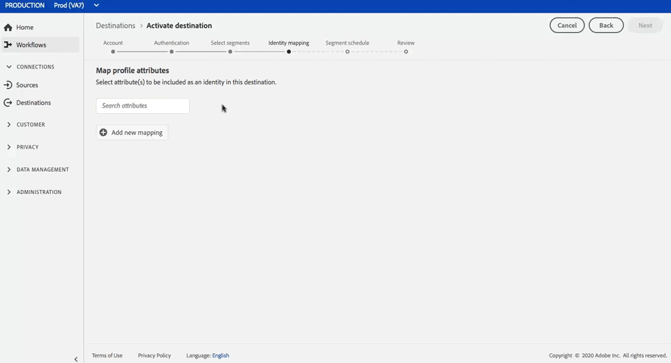

# [!DNL Google Customer Match] anslutning

>[!IMPORTANT]
>
>Vi migrerar för närvarande kunder till den nya versionen av det här målet.
>
> Instruktionerna i den här artikeln gäller för båda versionerna, med följande anmärkning: När migreringen pågår visas endast den aktuella versionen av [!DNL Google Customer Match]-målet i användargränssnittet, där du bara kan använda identiteterna [!UICONTROL EMAIL] och [!UICONTROL EMAIL_LC_SHA_256] för aktivering.

[Med Google Customer ](https://support.google.com/google-ads/answer/6379332?hl=en) Matchlets kan ni använda era online- och offlinedata för att nå och återengagera era kunder över Googles egna och styrda egenskaper, som:  [!DNL Search],  [!DNL Shopping],  [!DNL Gmail]och  [!DNL YouTube].

## Användningsexempel

För att du bättre ska förstå hur och när du ska använda målet [!DNL Google Customer Match] finns det exempel på användning som kunder med kunddataplattform i realtid kan lösa med den här funktionen.

### Användningsfall 1

Ett sportklädmärke vill nå befintliga kunder via [!DNL Google Search] och [!DNL Google Shopping] för att personalisera erbjudanden och objekt baserat på deras tidigare köp och webbhistorik. Kläddervarumärket kan importera e-postadresser från sin egen CRM till CDP i realtid, bygga segment utifrån sina egna offlinedata och skicka dessa segment till [!DNL Google Customer Match] för användning i [!DNL Search] och [!DNL Shopping], vilket optimerar deras annonsutgifter.

### Användningsfall nr 2

Ett framstående teknikföretag har just släppt en ny telefon. För att marknadsföra den nya telefonmodellen vill de öka medvetenheten om de nya funktionerna i telefonen för kunder som äger tidigare modeller av sina telefoner.

För att befordra releasen överför de e-postadresser från sin CRM-databas till CDP i realtid med e-postadresserna som identifierare. Segment skapas baserat på kunder som äger äldre telefonmodeller och skickas till [!DNL Google Customer Match] så att de kan rikta sig till befintliga kunder, kunder som äger äldre telefonmodeller samt liknande kunder på [!DNL YouTube].

## Målspecificeringar {#destination-specs}

### Datastyrning för [!DNL Google Customer Match] mål {#data-governance}

Destinationerna i CDP i realtid kan ha vissa regler och skyldigheter för data som skickas till eller tas emot från målplattformen. Du ansvarar för att förstå begränsningar och skyldigheter för dina data och hur du använder dessa data i Adobe Experience Platform och målplattformen. Adobe Experience Platform tillhandahåller datastyrningsverktyg som hjälper er att hantera vissa av dessa dataanvändningsskyldigheter. [Läs ](../../..//data-governance/labels/overview.md) mer om verktyg och policyer för datastyrning.

### Exporttyp och identiteter {#export-type}

**Segmentexport**  - du exporterar alla medlemmar i ett segment (publik) med identifierarna (namn, telefonnummer osv.) används i målet [!DNL Google Customer Match].

**Identiteter** - du kan använda råa eller hashad e-post som kund-ID i Google

### [!DNL Google Customer Match] kontokrav  {#google-account-prerequisites}

Innan du konfigurerar ett [!DNL Google Customer Match]-mål i CDP i realtid måste du läsa och följa Googles policy för att använda [!DNL Customer Match], som beskrivs i [Google Support-dokumentationen](https://support.google.com/google-ads/answer/6299717).

### Tillåtelselista {#allowlist}

>[!NOTE]
>
>Det är obligatoriskt att lägga till i Googles tillåtelselista innan du ställer in ditt första [!DNL Google Customer Match]-mål i realtid CDP. Kontrollera att tillåtelselista-processen som beskrivs nedan har slutförts av Google innan du skapar ett mål.

Innan du skapar målet [!DNL Google Customer Match] i CDP för realtid måste du kontakta Google och följa instruktionerna i [Använd kundmatchningspartners för att överföra dina data](https://support.google.com/google-ads/answer/7361372?hl=en&amp;ref_topic=6296507) i Googles dokumentation.

Dessutom finns det en andra Google tillåtelselista som du måste lägga till ditt konto i om du planerar att överföra data med Googles [användar-ID](https://developers.google.com/adwords/api/docs/guides/remarketing#customer_match_with_email_address_address_or_user_id). Kontakta din kontohanterare för Google och kontrollera att du har lagts till i tillåtelselista.

### Krav för ID-matchning {#id-matching-requirements}

[!DNL Google] kräver att ingen personligt identifierbar information (PII) skickas klart. Därför kan målgrupper som är aktiverade för [!DNL Google Customer Match] vara avstängda från *hash*-identifierare, till exempel e-postadresser eller telefonnummer.

Beroende på vilken typ av ID som du importerar till Adobe Experience Platform måste du följa deras motsvarande krav.

#### Kraven för hashning av telefonnummer {#phone-number-hashing-requirements}

Det finns två sätt att aktivera telefonnummer i [!DNL Google Customer Match]:

* **Hämtar råtelefonnummer**: kan du importera råa telefonnummer i  [!DNL E.164] formatet till  [!DNL Platform], som automatiskt hashas när du aktiverar. Om du väljer det här alternativet måste du alltid importera dina raw-telefonnummer till namnutrymmet `Phone_E.164`.
* **Inmatning av hashade telefonnummer**: du kan förhash-koda dina telefonnummer innan du tar dig in i  [!DNL Platform]. Om du väljer det här alternativet måste du alltid importera dina hashade telefonnummer till namnutrymmet `PHONE_SHA256_E.164`.

>[!NOTE]
>
>Telefonnummer som är inkapslade i namnområdet `Phone` kan inte aktiveras i [!DNL Google Customer Match].

#### Krav för e-posthashning {#hashing-requirements}

Du kan välja att hash-koda e-postadresser innan du importerar dem till Adobe Experience Platform, eller så kan du välja att arbeta med e-postadresser i klartext i Experience Platform och låta algoritmen hash-koda dem när de aktiveras.

Mer information om Googles hash-krav och andra begränsningar för aktivering finns i följande avsnitt i Googles dokumentation:

* [[!DNL Customer Match] med e-postadress, adress eller användar-ID](https://developers.google.com/adwords/api/docs/guides/remarketing#customer_match_with_email_address_address_or_user_id)
* [[!DNL Customer Match] överväganden](https://developers.google.com/adwords/api/docs/guides/remarketing#customer_match_considerations)
* [Kundmatchning med telefonnummer](https://developers.google.com/adwords/api/docs/guides/remarketing#customer_match_with_phone_number)
* [Kundmatchning med mobila enhets-ID:n](https://developers.google.com/adwords/api/docs/guides/remarketing#customer_match_with_mobile_device_ids)

Om du vill veta mer om att importera e-postadresser i Experience Platform kan du läsa översikten [över gruppimporten](../../../ingestion/batch-ingestion/overview.md) och översikten [över direktuppspelningsförslag](../../../ingestion/streaming-ingestion/overview.md).

Om du väljer att hash-koda e-postadresserna själv måste du se till att följa kraven för Google som beskrivs i länkarna ovan.

#### Använda anpassade namnutrymmen {#custom-namespaces}

Innan du kan använda namnutrymmet `User_ID` för att skicka data till Google måste du synkronisera dina egna identifierare med [!DNL gTag]. Mer information finns i [den officiella dokumentationen](https://support.google.com/google-ads/answer/9199250).

<!-- Data from unhashed namespaces is automatically hashed by [!DNL Platform] upon activation.

Attribute source data is not automatically hashed. When your source field contains unhashed attributes, check the **[!UICONTROL Apply transformation]** option, to have [!DNL Platform] automatically hash the data on activation.
 -->

## Anslut till målet {#connect-destination}

Bläddra till kategorin **[!UICONTROL Advertising]** i **[!UICONTROL Destinations]** > **[!UICONTROL Catalog]**. Välj [!DNL Google Customer Match] och sedan **[!UICONTROL Configure]**.

>[!NOTE]
>
>Om det redan finns en anslutning till det här målet kan du se en **[!UICONTROL Activate]**-knapp på målkortet. Mer information om skillnaden mellan **[!UICONTROL Activate]** och **[!UICONTROL Configure]** finns i avsnittet [Katalog](../../ui/destinations-workspace.md#catalog) i dokumentationen för målarbetsytan.

Om du tidigare har konfigurerat en anslutning till ditt [!DNL Google Customer Match]-mål väljer du **[!UICONTROL Existing Account]** och väljer din befintliga anslutning i steget **Konto**. Du kan också välja **[!UICONTROL New Account]** för att konfigurera en ny anslutning till [!DNL Google Customer Match]. Välj **[!UICONTROL Connect to destination]** om du vill logga in och ansluta Adobe Experience Cloud till ditt [!DNL Google Ad]-konto.

>[!NOTE]
>
>CDP stöder validering av autentiseringsuppgifter i realtid i autentiseringsprocessen och visar ett felmeddelande om du anger felaktiga autentiseringsuppgifter för ditt [!DNL Google Ad]-konto. Detta säkerställer att du inte slutför arbetsflödet med felaktiga inloggningsuppgifter.

När dina inloggningsuppgifter har bekräftats och Adobe Experience Cloud är anslutet till ditt Google-konto kan du välja **[!UICONTROL Next]** för att fortsätta till **[!UICONTROL Setup]**-steget.

I steget **[!UICONTROL Authentication]** anger du [!UICONTROL Name] och [!UICONTROL Description] för ditt aktiveringsflöde och fyller i din Google-fil [!UICONTROL Account ID].

I det här steget kan du även välja alla **[!UICONTROL Marketing use case]** som ska gälla för det här målet. Fall av marknadsanvändning anger avsikten för vilken data ska exporteras till destinationen. Du kan välja bland Adobe-definierade användningsfall för marknadsföring eller skapa ett eget marknadsföringsexempel. Mer information om användningsfall för marknadsföring finns på sidan [Datastyrning i realtid CDP](../../../rtcdp/privacy/data-governance-overview.md#destinations). Mer information om de enskilda Adobe-definierade användningsfallen för marknadsföring finns i [Översikt över dataanvändningsprinciper](../../../data-governance/policies/overview.md#core-actions).

Välj **[!UICONTROL Create Destination]** när du har fyllt i fälten ovan.

>[!IMPORTANT]
>
> * **[!UICONTROL Combine with PII]**-användningsfallet för marknadsföring är valt som standard för [!DNL Google Customer Match]-målet och kan inte tas bort.
> * För [!DNL Google Customer Match]-mål. **[!UICONTROL Account ID]** är ditt kund-ID hos Google. Formatet på ID:t är xxx-xxx-xxxx.

Målet har skapats. Du kan välja **[!UICONTROL Save & Exit]** om du vill aktivera segment senare eller välja **[!UICONTROL Next]** om du vill fortsätta arbetsflödet och välja segment som ska aktiveras. I båda fallen ska du läsa nästa avsnitt, [Aktivera segment till [!DNL Google Customer Match]](#activate-segments), för resten av arbetsflödet.

## Aktivera segment till [!DNL Google Customer Match] {#activate-segments}

Instruktioner om hur du aktiverar segment till [!DNL Google Customer Match] finns i [Aktivera data till mål](../../ui/activate-destinations.md).

I steget **[!UICONTROL Segment schedule]** måste du ange [!UICONTROL App ID] när du skickar segmenten [!DNL IDFA] eller [!DNL GAID] till [!DNL Google Customer Match].

Mer information om hur du hittar [!DNL App ID] finns i [den officiella dokumentationen](https://developers.google.com/adwords/api/docs/reference/v201809/AdwordsUserListService.CrmBasedUserList#appid).

<!-- 
To activate segments to [!DNL Google Customer Match], follow the steps below: 

In **[!UICONTROL Destinations > Browse]**, select the [!DNL Google Customer Match] destination where you want to activate your segments.

Click the name of the destination. This takes you to the Activate flow.

Note that if an activation flow already exists for a destination, you can see the segments that are currently being sent to the destination. Select **[!UICONTROL Edit activation]** in the right rail and follow the steps below to modify the activation details.

Select **[!UICONTROL Activate]**. In the **[!UICONTROL Activate destination]** workflow, on the **[!UICONTROL Select Segments]** page, select which segments to send to [!DNL Google Customer Match].

In the **[!UICONTROL Identity mapping]** step, select which attributes to be included as an identity in this destination. Select **[!UICONTROL Add new mapping]** and browse your schema, select email and/or hashed email, and map them to the corresponding target identity.

 

**Plain text email address as primary identity**: If you have plain text (unhashed) email addresses as primary identity in your schema, select the email field in your **[!UICONTROL Source Attributes]** and map to the Email field in the right column under **[!UICONTROL Target Identities]**, as shown below:

 

**Hashed email address as primary identity**: If you have hashed email addresses as primary identity in your schema, select the hashed email field in your **[!UICONTROL Source Attributes]** and map to the Email_LC_SHA256 field in the right column under **[!UICONTROL Target Identities]**, as shown below:

On the **[!UICONTROL Segment schedule]** page, you can set the start date for sending data to the destination.

On the **[!UICONTROL Review]** page, you can see a summary of your selection. Select **[!UICONTROL Cancel]** to break up the flow, **[!UICONTROL Back]** to modify your settings, or **[!UICONTROL Finish]** to confirm your selection and start sending data to the destination.

>[!IMPORTANT]
>
>In this step, Real-time CDP checks for data usage policy violations. Shown below is an example where a policy is violated. You cannot complete the segment activation workflow until you have resolved the violation. For information on how to resolve policy violations, see [Policy enforcement](../../../rtcdp/privacy/data-governance-overview.md#enforcement) in the data governance documentation section.
 

If no policy violations have been detected, select **[!UICONTROL Finish]** to confirm your selection and start sending data to the destination.

 -->

## Verifiera att segmentaktiveringen lyckades {#verify-activation}

När aktiveringsflödet är klart växlar du till ditt **[!UICONTROL Google Ads]**-konto. De aktiverade segmenten visas nu som kundlistor på ditt Google-konto. Observera att beroende på segmentstorleken kommer vissa målgrupper inte att fyllas i om det inte finns fler än 100 aktiva användare att betjäna.

När du mappar ett segment till både [!DNL IDFA] och [!DNL GAID] mobila ID:n skapar [!DNL Google Customer Match] ett separat segment för varje ID-mappning. Ditt [!DNL Google Ads]-konto kommer att visa två olika segment, ett för [!DNL IDFA] och ett för [!DNL GAID]-mappningen.

## Ytterligare resurser {#additional-resources}

* [Integrera Google Customer Match - videosjälvstudiekurs](https://experienceleague.adobe.com/docs/platform-learn/tutorials/rtcdp/integrate-with-google-customer-match.html)