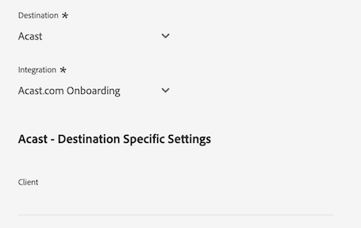
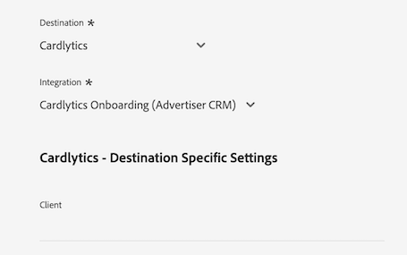
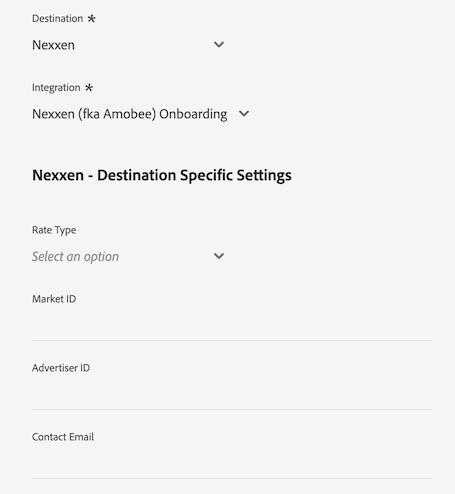
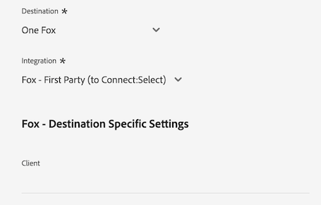

# [!DNL LiveRamp - Distribution] anslutning

The [!DNL LiveRamp - Distribution] Med hjälp av en anslutning kan ni aktivera målgrupper från Experience Platform till högklassiga utgivare i olika medier för mobiler, webben, displayannonsering och uppkopplade tv-apparater.

>[!IMPORTANT]
>
>Den här målanslutnings- och dokumentationssidan skapas och underhålls av LiveRamp. Kontakta LiveRamp direkt om du har frågor eller uppdateringsfrågor [här](mailto:adobertcdp@liveramp.com).

## Mål som stöds {#supported-destinations}

[!DNL LiveRamp - Distribution] har för närvarande stöd för målgruppsaktivering på följande plattformar:

* [[!DNL 4C Insights]](#insights)
* [[!DNL Acast]](#acast)
* [[!DNL Nexxen]](#nexxen)
* [[!DNL Ampersand.tv]](#ampersand-tv)
* [[!DNL Captify]](#captify)
* [[!DNL Cardlytics]](#cardlytics)
* [[!DNL Disney (Hulu/ESPN/ABC)]](#disney)
* [[!DNL iHeartMedia]](#iheartmedia)
* [[!DNL Index Exchange]](#index-exchange)
* [[!DNL Magnite CTV Platform]](#magnite)
* [[!DNL Magnite DV+ (Rubicon Project)]](#magnite-dv)
* [[!DNL One Fox]](#fox)
* [[!DNL Pandora]](#pandora)
* [[!DNL Reddit]](#reddit)
* [[!DNL Roku]](#roku)
* [[!DNL Spotify]](#spotify)
* [[!DNL Taboola]](#taboola)
* [[!DNL TargetSpot]](#targetspot)
* [[!DNL Teads]](#teads)
* [[!DNL WB Discovery]](#wb-discovery)

## Användningsfall {#use-cases}

För att du bättre ska förstå hur och när du ska använda [!DNL LiveRamp - Distribution] mål, här är ett exempel på användning som Adobe Experience Platform-kunder kan lösa genom att använda den här destinationen.

Marknadsföringsteamet för en sportklädhandlare använde [LiveRamp - introduktion](liveramp-onboarding.md) anslutning för att skicka målgrupper från Experience Platform till deras LiveRamp-konto.

Via [!DNL LiveRamp - Distribution] den koppling de nu kan sätta igång aktiveringen av de deltagande målgrupperna till [mål som stöds](#supported-destinations). Sedan kan de inrikta sig på användare på mobilen, webben, sociala medier och [!DNL CTV] -plattformar.

## Anpassa målgrupper till LiveRamp {#onboarding}

Innan du aktiverar målgrupper via [!DNL LiveRamp - Distribution] anslutning, använd [LiveRamp - introduktion](liveramp-onboarding.md) anslutning för att exportera Experience Platform-målgrupper till LiveRamp.

När du har anmält dig till LiveRamp kan du fortsätta aktiveringsarbetsflödet från [ansluta till målet](#connect) för att välja och konfigurera målplattformarna för dataaktivering.

## Anslut till målet {#connect}

>[!CONTEXTUALHELP]
>id="platform_destinations_liveramp_distribution_identifier_settings"
>title="Identifieringsinställningar"
>abstract="Välj de identifierare som stöds av ditt mål. I dokumentationen finns en fullständig lista över identifierare som stöds för varje mål."

>[!IMPORTANT]
> 
>Om du vill ansluta till målet behöver du **[!UICONTROL Manage Destinations]** [behörighet för åtkomstkontroll](/help/access-control/home.md#permissions). Läs [åtkomstkontroll - översikt](/help/access-control/ui/overview.md) eller kontakta produktadministratören för att få de behörigheter som krävs.

Om du vill ansluta till det här målet följer du stegen som beskrivs i [självstudiekurs om destinationskonfiguration](../../ui/connect-destination.md). I arbetsflödet för att konfigurera mål fyller du i fälten som listas i de två avsnitten nedan.

### Autentisera till LiveRamp {#authenticate}

Om du vill autentisera mot målet fyller du i de obligatoriska fälten och väljer **[!UICONTROL Connect to destination]**.

* **[!UICONTROL LiveRamp Organization ID]**: Organisations-ID för ditt LiveRamp-konto (anges som _owner_org_ i inloggningsuppgifterna som tillhandahålls av LiveRamp).
* **[!UICONTROL Password]**: Lösenord för ditt LiveRamp-konto (visas som _hemlig_nyckel_ i inloggningsuppgifterna som tillhandahålls av LiveRamp).
* **[!UICONTROL Token URL]**: Din URL för LiveRamp-token.
* **[!UICONTROL Username]**: Ditt LiveRamp-användarnamn (visas som _account_id_ i inloggningsuppgifterna som tillhandahålls av LiveRamp).

### Konfigurera målinformation {#destination-details}

När du har anslutit till ditt LiveRamp-konto anger du den information som krävs för att ansluta till målet som du vill aktivera målgrupper för.

* **[!UICONTROL Name]**: Ange det önskade namnet för målanslutningen.

>[!NOTE]
>
>När du namnger destinationen rekommenderar Adobe att du följer detta format: `LiveRamp - Downstream Destination Name`. Det här namnmönstret hjälper dig att snabbt identifiera dina mål i [Bläddra](../../ui/destinations-workspace.md#browse) -fliken i målarbetsytan.
> 
>Exempel: `LiveRamp - Roku`.

* **[!UICONTROL Description]**: Ange en beskrivning för destinationen. Använd en beskrivning som hjälper dig att enkelt identifiera syftet med destinationen.
* **[!UICONTROL Destination]**: Använd listrutan för att välja det mål som du vill aktivera målgrupper för. Det mål du väljer här påverkar direkt det du ser i [målspecifika inställningar](#destination-settings) skärm.
* **[!UICONTROL Integration]**: Välj det integrationskonto som du vill använda för ditt mål.
* **[!UICONTROL Identifier]**: Välj de identifierare som stöds av ditt mål. För närvarande har alla mål sina identifierare som stöds förifyllda i listrutan.

## Målspecifika inställningar {#destination-settings}

Varje mål [stöds](#supported-destinations) av [!DNL LiveRamp - Distribution] kräver att du fyller i specifika konfigurationsalternativ.

I avsnitten nedan finns detaljerade riktlinjer för hur du konfigurerar varje mål.

### [!DNL 4C Insights] {#insights}

>[!CONTEXTUALHELP]
>id="platform_destinations_liveramp_distribution_4cinsights_profile_id"
>title="4C-profilprofil-ID"
>abstract="Ange det numeriska ID som är kopplat till din 4C-varumärkesprofil. Om du inte har detta ID kontaktar du din 4C-representant för klienttjänster."

Om du vill konfigurera information för målet fyller du i fälten nedan.

* **[!UICONTROL 4C Brand Profile ID]**: Ange det numeriska ID som är kopplat till din 4C-varumärkesprofil. Om du inte har detta ID kontaktar du din 4C-representant för klienttjänster.

### [!DNL Acast] {#acast}

>[!CONTEXTUALHELP]
>id="platform_destinations_liveramp_distribution_acast_client"
>title="Klientnamn"
>abstract="Ditt annonsörkontonamn som du vill ska visas för målpartnern. Använd ditt företagsnamn. Använd inte blanksteg eller specialtecken."

Om du vill konfigurera information för målet fyller du i fälten nedan.

* **[!UICONTROL Client name]**: Ditt annonsörkontonamn, som du vill ska visas för målpartnern. Använd ditt företagsnamn. Använd inte blanksteg eller specialtecken.

### [!DNL Ampersand.tv] {#ampersand-tv}

>[!CONTEXTUALHELP]
>id="platform_destinations_liveramp_distribution_ampersand_company_name"
>title="Ditt företagsnamn"
>abstract="Ditt företagsnamn som du vill ska visas för målpartnern. Använd inte blanksteg eller specialtecken."

Om du vill konfigurera information för målet fyller du i fälten nedan.

* **[!UICONTROL Your Company Name]**: Ditt företagsnamn, som du vill ska visas för målpartnern. Använd inte blanksteg eller specialtecken.

### [!DNL Captify] {#captify}

>[!CONTEXTUALHELP]
>id="platform_destinations_liveramp_distribution_captify_client"
>title="Klientnamn"
>abstract="Ditt annonsörkontonamn som du vill ska visas för målpartnern. Använd ditt företagsnamn. Använd inte blanksteg eller specialtecken."

Om du vill konfigurera information för målet fyller du i fälten nedan.

* **[!UICONTROL Client name]**: Ditt annonsörkontonamn, som du vill ska visas för målpartnern. Använd ditt företagsnamn. Använd inte blanksteg eller specialtecken.

### [!DNL Cardlytics] {#cardlytics}

>[!CONTEXTUALHELP]
>id="platform_destinations_liveramp_distribution_cardlytics_client"
>title="Klientnamn"
>abstract="Ditt annonsörkontonamn som du vill ska visas för målpartnern. Använd ditt företagsnamn. Använd inte blanksteg eller specialtecken."

Om du vill konfigurera information för målet fyller du i fälten nedan.

* **[!UICONTROL Client name]**: Ditt annonsörkontonamn, som du vill ska visas för målpartnern. Använd ditt företagsnamn. Använd inte blanksteg eller specialtecken.

### [!DNL Disney (Hulu/ESPN/ABC)] {#disney}

>[!CONTEXTUALHELP]
>id="platform_destinations_liveramp_distribution_agreement"
>title="Avtal om målvillkor för annonsördata"
>abstract="Skriv in `I AGREE` för att bekräfta bekräftelsen och godkännandet av datavillkoren för Disneys annonsörer."

<!-- >additional-url="<https://www.disneyadvertising.com/ADVERTISER-DATA-DESTINATION-TERMS/>" text="Read the agreement" -->

>[!CONTEXTUALHELP]
>id="platform_destinations_liveramp_distribution_disney_client"
>title="Klientnamn"
>abstract="Ditt annonsörkontonamn som du vill ska visas för målpartnern. Använd ditt företagsnamn. Använd inte blanksteg eller specialtecken."

>[!CONTEXTUALHELP]
>id="platform_destinations_liveramp_distribution_disney_email"
>title="Din e-postadress"
>abstract="Ange en e-postadress som är kopplad till en individ. Den här e-postadressen fungerar som en signatur till avtalet för annonsörens datavillkor. Den här e-postadressen används även för att kontakta dig vid behov."

Om du vill konfigurera information för målet fyller du i fälten nedan.

* **[!UICONTROL Advertiser data destination terms agreement]**: Skriv in `I AGREE` för att bekräfta bekräftelsen och godkännandet av datavillkoren för Disneys annonsörer.
* **[!UICONTROL Client name]**: Ange ditt företagsnamn så som du vill att det ska visas för målpartnern.
* **[!UICONTROL Email address]**: Ange en e-postadress som är kopplad till en individ. Den här e-postadressen fungerar som en signatur till avtalet för annonsörens datavillkor.

### [!DNL iHeartMedia] {#iheartmedia}

>[!CONTEXTUALHELP]
>id="platform_destinations_liveramp_distribution_iheartmedia_client"
>title="Klientnamn"
>abstract="Ditt annonsörkontonamn som du vill ska visas för målpartnern. Använd ditt företagsnamn. Använd inte blanksteg eller specialtecken."

Om du vill konfigurera information för målet fyller du i fälten nedan.

* **[!UICONTROL Client Name]**: Ditt annonsörkontonamn, som du vill ska visas för målpartnern. Använd ditt företagsnamn. Använd inte blanksteg eller specialtecken.

### [!DNL Index Exchange] {#index-exchange}

>[!CONTEXTUALHELP]
>id="platform_destinations_liveramp_distribution_index_advertiseraccountname"
>title="Kontonamn"
>abstract="Klientkontonamnet för Index Exchange. Använd inte blanksteg eller specialtecken."

Om du vill konfigurera information för målet fyller du i fälten nedan.

* **[!UICONTROL Account Name]**: Namnet på ditt Exchange-klientkonto för index. Använd inte blanksteg eller specialtecken.

### [!DNL Magnite CTV Platform] {#magnite}

>[!CONTEXTUALHELP]
>id="platform_destinations_liveramp_distribution_magnitectv_client"
>title="Klient"
>abstract="Ditt klientnamn, som du vill ska visas för målpartnern. Använd ditt företagsnamn. Använd inte blanksteg eller specialtecken."

Om du vill konfigurera information för målet fyller du i fälten nedan.

* **[!UICONTROL Client]**: Ditt klientnamn, som du vill ska visas för målpartnern. Använd ditt företagsnamn. Använd inte blanksteg eller specialtecken.

### [!DNL Magnite DV+ (Rubicon Project)] {#magnite-dv}

>[!CONTEXTUALHELP]
>id="platform_destinations_liveramp_distribution_magnitedv+_partnerid"
>title="Partner-ID"
>abstract="Det Rubicon Project Partner-ID som är associerat med utgivaren som äger segmentet/data. Kontakta din kontorepresentant för Rubicon Project om du är osäker på vilket värde du ska använda."

>[!CONTEXTUALHELP]
>id="platform_destinations_liveramp_distribution_magnitedv+_seatid"
>title="Plats-ID"
>abstract="Magnite DV+ Licens-ID från din kontohanterare i Magnite"

Om du vill konfigurera information för målet fyller du i fälten nedan.

* **[!UICONTROL Partner ID]**: Det Rubicon Project Partner-ID som är associerat med utgivaren som äger segmentet/data. Kontakta din kontorepresentant för Rubicon Project om du är osäker på vilket värde du ska använda.
* **[!UICONTROL Seat ID]**: Magnite DV+ Licens-ID från din kontohanterare i Magnite

### [!DNL Nexxen (formerly known as [!DNL Amobee])] {#nexxen}

>[!CONTEXTUALHELP]
>id="platform_destinations_liveramp_distribution_nexxen_ratetype"
>title="Kurstyp"
>abstract="Hastighetstypen representerar hur dataanvändningen ska faktureras. Alla dollar ska vara en fast avgift. Kontakta din Nexen-representant om du inte är säker på vilken tarifftyp du ska använda."

>[!CONTEXTUALHELP]
>id="platform_destinations_liveramp_distribution_nexxen_marketid"
>title="Marknads-ID"
>abstract="Ange det numeriska marknads-ID där Nexen-datakontraktet ska skapas. Om du använder&quot;AlwaysOn&quot;-syndikering på alla marknader i Nexen-plattformen anger du -1."

>[!CONTEXTUALHELP]
>id="platform_destinations_liveramp_distribution_nexxen_advertiserid"
>title="Annonsörs-ID"
>abstract="Om du skickar data till en enskild annonsörer på Nexen-plattformen anger du det numeriska Amobe Advertiser-ID:t. Om du vill göra data tillgängliga för alla annonsörer på en marknad eller om dessa segment är&quot;AlwaysOn&quot;, anger du -1."

>[!CONTEXTUALHELP]
>id="platform_destinations_liveramp_distribution_nexxen_contactemail"
>title="E-postadress"
>abstract="Ange den e-postadress som Nexen ska använda för att skicka information om datakontrakt. Troligen är detta din egen e-postadress, men den kan också vara ett e-postalias. Avgränsa med kommatecken för flera mottagare (`email1@domain.com`,`email2@domain.com`och så vidare.)"

Om du vill konfigurera information för målet fyller du i fälten nedan.

* **[!UICONTROL Rate Type]**: Hastighetstypen representerar hur dataanvändningen ska faktureras. Alla dollar ska vara en fast avgift. Kontakta din Nexen-representant om du inte är säker på vilken tarifftyp du ska använda.
* **[!UICONTROL Market ID]**: Ange det numeriska marknads-ID där Nexen-datakontraktet ska skapas. Om du använder&quot;AlwaysOn&quot;-syndikering på alla marknader i Nexen-plattformen anger du -1.
* **[!UICONTROL Advertiser ID]**: Om du skickar data till en enskild annonsörer på Nexen-plattformen anger du det numeriska Nexen Advertiser-ID:t. Om du vill göra data tillgängliga för alla annonsörer på en marknad eller om dessa segment är &quot;AlwaysOn&quot;, anger du -1.
* **[!UICONTROL Contact Email]**: Ange den e-postadress som Nexen ska använda för att skicka information om datakontrakt. Troligen är detta din egen e-postadress, men den kan också vara ett e-postalias. Avgränsa med kommatecken för flera mottagare ( `email1@domain.com`, `email2@domain.com`).

### [!DNL One Fox] {#fox}

>[!CONTEXTUALHELP]
>id="platform_destinations_liveramp_distribution_fox_client"
>title="Klient"
>abstract="Namnet på ditt företag/ditt distributionskonto så som du vill att det ska visas för partnern. Kontakta din kontorepresentant om du är osäker på vilket namn du ska använda. Använd inte blanksteg eller specialtecken."

Om du vill konfigurera information för målet fyller du i fälten nedan.

* **[!UICONTROL Client]**: Namnet på ditt företag/ditt distributionskonto så som du vill att det ska visas för partnern. Använd ditt företagsnamn som standard. Kontakta din kontorepresentant om du är osäker på vilket namn du ska använda. Använd inte blanksteg eller specialtecken.

### [!DNL Pandora] {#pandora}

>[!CONTEXTUALHELP]
>id="platform_destinations_liveramp_distribution_pandora_account_name"
>title="Kontonamn"
>abstract="Namnet på ditt Pandora-konto. Kontakta din Pandora-kontorepresentant om du inte är säker på vad ditt kontonamn är. Använd inte blanksteg eller specialtecken."

Om du vill konfigurera information för målet fyller du i fälten nedan.

* **[!UICONTROL Account name]**: Namnet på ditt Pandora-konto. Kontakta din Pandora-kontorepresentant om du inte är säker på vad ditt kontonamn är. Använd inte blanksteg eller specialtecken.

### [!DNL Reddit] {#reddit}

>[!CONTEXTUALHELP]
>id="platform_destinations_liveramp_distribution_reddit_advertiser_id"
>title="Redigera annonsörs-ID"
>abstract="Ditt Redigera-ID. Måste börja med &quot;t2_&quot; eller &quot;a2_&quot;. Kontakta din REDIGERINGSrepresentant om du inte känner till ditt annonsörs-ID."

>[!CONTEXTUALHELP]
>id="platform_destinations_liveramp_distribution_reddit_advertiser_name"
>title="Redigera annonsörens namn"
>abstract="Din Reddit-annonsörs namn. Använd inte blanksteg eller specialtecken."

Om du vill konfigurera information för målet fyller du i fälten nedan.

* **[!UICONTROL Reddit advertiser ID]**: Ditt Redigera annonsörs-ID. Måste börja med &quot;t2_&quot; eller &quot;a2_&quot;. Kontakta din REDIGERINGSrepresentant om du inte känner till ditt annonsörs-ID.
* **[!UICONTROL Reddit advertiser name]**: Din Redigera annonsörs namn. Använd inte blanksteg eller specialtecken.

### [!DNL Roku] {#roku}

>[!CONTEXTUALHELP]
>id="platform_destinations_liveramp_distribution_roku_email"
>title="E-postadress för Roku-konto"
>abstract="Ange den e-postadress som är kopplad till ditt Roku-konto."

>[!CONTEXTUALHELP]
>id="platform_destinations_liveramp_distribution_roku_representative_email"
>title="E-postadress till kontorepresentant"
>abstract="Ange e-postadressen till din Roku-kontorepresentant. Den här adressen används för att skicka taxonomiuppdateringar. Om du vill ange flera adresser avgränsar du dem med kommatecken."

Om du vill konfigurera information för målet fyller du i fälten nedan.

* **[!UICONTROL Roku account email address]**: Ange den e-postadress som är kopplad till ditt Roku-konto.
* **[!UICONTROL Roku account representative email address]**: Ange e-postadressen till din Roku-kontorepresentant. Om du vill ange flera adresser avgränsar du dem med kommatecken.

### [!DNL Spotify] {#spotify}

>[!CONTEXTUALHELP]
>id="platform_destinations_liveramp_distribution_spotify_client"
>title="Klientnamn"
>abstract="Ditt annonsörkontonamn som du vill ska visas för målpartnern. Använd ditt företagsnamn. Använd inte blanksteg eller specialtecken."

Om du vill konfigurera information för målet fyller du i fälten nedan.

* **[!UICONTROL Client name]**: Ditt annonsörkontonamn, som du vill ska visas för målpartnern. Använd ditt företagsnamn. Använd inte blanksteg eller specialtecken.

### [!DNL Taboola] {#taboola}

>[!CONTEXTUALHELP]
>id="platform_destinations_liveramp_distribution_taboola_rep_email"
>title="E-postadress till kontohanteraren"
>abstract="E-postadressen till kontohanteraren på Taboola."

>[!CONTEXTUALHELP]
>id="platform_destinations_liveramp_distribution_taboola_seg_type"
>title="Segmenttyp"
>abstract="Segmenttypen. Det finns för närvarande bara stöd för segment från första part."

Om du vill konfigurera information för målet fyller du i fälten nedan.

* **[!UICONTROL Account manager email address]**: E-postadressen till kontohanteraren på Taboola.
* **[!UICONTROL Segment type]**: Segmenttypen. Det finns för närvarande bara stöd för segment från första part.

### [!DNL TargetSpot] {#targetspot}

>[!CONTEXTUALHELP]
>id="platform_destinations_liveramp_distribution_targetspot_client"
>title="Klientnamn"
>abstract="Ditt annonsörkontonamn som du vill ska visas för målpartnern. Använd ditt företagsnamn. Använd inte blanksteg eller specialtecken."

Om du vill konfigurera information för målet fyller du i fälten nedan.

* **[!UICONTROL Client name]**: Ditt annonsörkontonamn, som du vill ska visas för målpartnern. Använd ditt företagsnamn. Använd inte blanksteg eller specialtecken.

### [!DNL Teads] {#teads}

>[!CONTEXTUALHELP]
>id="platform_destinations_liveramp_distribution_teads_teadsid"
>title="Team-ID"
>abstract="Ditt team-ID"

Om du vill konfigurera information för målet fyller du i fälten nedan.

* **[!UICONTROL Teads ID]**: Ditt team-ID

### [!DNL WB Discovery] {#wb-discovery}

>[!CONTEXTUALHELP]
>id="platform_destinations_liveramp_distribution_wb_client"
>title="Klientnamn"
>abstract="Ditt annonsörkontonamn som du vill ska visas för målpartnern. Använd ditt företagsnamn. Använd inte blanksteg eller specialtecken."

Om du vill konfigurera information för målet fyller du i fälten nedan.

* **[!UICONTROL Client name]**: Ditt annonsörkontonamn, som du vill ska visas för målpartnern. Använd ditt företagsnamn. Använd inte blanksteg eller specialtecken.

### Aktivera aviseringar {#enable-alerts}

Du kan aktivera varningar för att få meddelanden om dataflödets status till ditt mål. Om du vill få meddelanden om dataflödets status väljer du en varning i listan. Mer information om varningar finns i guiden på [prenumerera på destinationsvarningar med användargränssnittet](../../ui/alerts.md).

När du är klar med informationen för målanslutningen väljer du **[!UICONTROL Next]**.

## Aktivera målgrupper till det här målet {#activate}

>[!IMPORTANT]
> 
>För att aktivera data behöver du **[!UICONTROL Manage Destinations]**, **[!UICONTROL Activate Destinations]**, **[!UICONTROL View Profiles]** och **[!UICONTROL View Segments]** [behörigheter för åtkomstkontroll](/help/access-control/home.md#permissions). Läs [åtkomstkontroll - översikt](/help/access-control/ui/overview.md) eller kontakta produktadministratören för att få de behörigheter som krävs.

The [!DNL LiveRamp - Distribution] anslutningen aktiverar målgrupper som redan har anslutit till ditt LiveRamp-konto via [LiveRamp - introduktion](liveramp-onboarding.md) anslutning.

Om du vill aktivera dina målgrupper måste du välja **samma målgrupper** som du har [tidigare ombord](liveramp-onboarding.md) till LiveRamp.

>[!IMPORTANT]
>
>Välja ut målgrupper som inte tidigare har anslutit sig via [LiveRamp - introduktion](liveramp-onboarding.md) anslutningen inte leder till att de nya målgrupperna introduceras.

## Exporterade data/Validera dataexport {#exported-data}

Om du vill verifiera och övervaka aktiveringen av målgrupperna loggar du in på ditt LiveRamp-konto och kontrollerar aktiveringsstatistik.

Om du har frågor om målgruppsaktiveringen kontaktar du din LiveRamp-kontorepresentant.

## Dataanvändning och styrning {#data-usage-governance}

Alla [!DNL Adobe Experience Platform] destinationerna är kompatibla med dataanvändningsprinciper när data hanteras. Detaljerad information om hur [!DNL Adobe Experience Platform] använder datastyrning, läs [Datastyrning - översikt](/help/data-governance/home.md).

## Ytterligare resurser {#additional-resources}

Mer information om hur du konfigurerar [!DNL LiveRamp - Onboarding] mål, se [LiveRamp - Onboarding-dokumentation](liveramp-onboarding.md).
