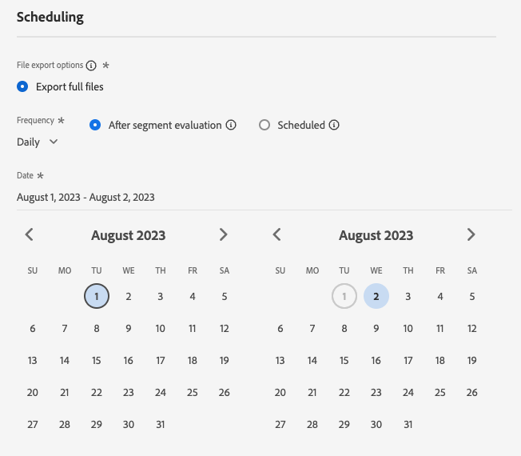

# [!DNL LiveRamp - Onboarding]-anslutning {#liveramp-onboarding}

Använd anslutningen [!DNL LiveRamp - Onboarding] för att inkludera målgrupper från Adobe Real-Time Customer Data Platform i [!DNL LiveRamp Connect].

## Användningsfall {#use-cases}

För att du bättre ska kunna förstå hur och när du ska använda målet [!DNL LiveRamp - Onboarding] finns det ett exempel på användning som Adobe Experience Platform-kunder kan lösa genom att använda det här målet.

Som marknadsförare vill jag skicka målgrupper från Adobe Experience Platform till inbyggda identiteter till [!DNL LiveRamp Connect] så att jag kan inrikta mig på användare på mobiler, öppna webben, sociala medier och [!DNL CTV] -plattformar med hjälp av identifieraren [!DNL Ramp ID].

## Förhandskrav {#prerequisites}

Anslutningen [!DNL LiveRamp - Onboarding] exporterar filer med [LiveRamps SFTP](https://docs.liveramp.com/connect/en/upload-a-file-via-liveramp-s-sftp.html)-lagring.

Innan du kan skicka data från Experience Platform till [!DNL LiveRamp - Onboarding] behöver du dina [!DNL LiveRamp]-autentiseringsuppgifter. Kontakta din [!DNL LiveRamp]-representant för att få dina autentiseringsuppgifter, om du inte redan har dem.

## Identiteter som stöds {#supported-identities}

[!DNL LiveRamp - Onboarding] stöder aktivering av identiteter som PII-baserade identifierare, kända identifierare och anpassade ID:n, som beskrivs i den officiella [LiveRamp-dokumentationen](https://docs.liveramp.com/connect/en/identity-and-identifier-terms-and-concepts.html#known-identifiers).

I [mappningssteget](#map) i aktiveringsarbetsflödet måste du definiera målmappningarna som anpassade attribut.

## Målgrupper {#supported-audiences}

I det här avsnittet beskrivs vilka typer av målgrupper du kan exportera till det här målet.

| Målgruppsursprung | Stöds | Beskrivning |
|---------|----------|----------|
| [!DNL Segmentation Service] | ✓ | Publiker som genererats via Experience Platform [segmenteringstjänst](../../../segmentation/home.md). |
| Anpassade överföringar | ✓ | Publikerna [importerade](../../../segmentation/ui/audience-portal.md#import-audience) till Experience Platform från CSV-filer. |

{style="table-layout:auto"}

## Exportera typ och frekvens {#export-type-frequency}

Se tabellen nedan för information om exporttyp och frekvens för destinationen.

| Objekt | Typ | Anteckningar |
---------|----------|---------|
| Exporttyp | **[!UICONTROL Audience export]** | Du exporterar alla medlemmar i en målgrupp med identifierarna (namn, telefonnummer eller andra) som används i målet [!DNL LiveRamp - Onboarding]. |
| Exportfrekvens | **[!UICONTROL Daily batch]** | När profiler uppdateras i Experience Platform baserat på målgruppsutvärdering uppdateras profilerna (identiteterna) en gång om dagen nedströms målplattformen. Läs mer om [gruppfilsbaserade mål](/help/destinations/destination-types.md#file-based). |

{style="table-layout:auto"}

## Anslut till målet {#connect}

>[!IMPORTANT]
> 
>Om du vill ansluta till målet behöver du behörigheterna **[!UICONTROL View Destinations]** och **[!UICONTROL Manage Destinations]** [åtkomstkontroll](/help/access-control/home.md#permissions). Läs [åtkomstkontrollsöversikten](/help/access-control/ui/overview.md) eller kontakta produktadministratören för att få den behörighet som krävs.

Om du vill ansluta till det här målet följer du stegen som beskrivs i självstudiekursen [för destinationskonfiguration](../../ui/connect-destination.md). I arbetsflödet för att konfigurera mål fyller du i fälten som listas i de två avsnitten nedan.

### Autentisera till mål {#authenticate}

Fyll i de obligatoriska fälten och välj **[!UICONTROL Connect to destination]** om du vill autentisera mot målet.

**SFTP-autentisering med lösenord** {#sftp-password}


* **[!UICONTROL Port]**: Den port som används för din [!DNL LiveRamp - Onboarding]-lagringsplats.  Använd den port som motsvarar din geografiska plats enligt beskrivningen nedan:
   * **[!UICONTROL NA]**: Använd port `22`
   * **[!UICONTROL AU]**: Använd port `2222`
* **[!UICONTROL Username]**: Användarnamnet för lagringsplatsen [!DNL LiveRamp - Onboarding].
* **[!UICONTROL Password]**: Lösenordet för lagringsplatsen [!DNL LiveRamp - Onboarding].
* **[!UICONTROL PGP/GPG encryption key]**: Om du vill kan du bifoga den RSA-formaterade offentliga nyckeln för att lägga till kryptering i de exporterade filerna. Visa ett exempel på en korrekt formaterad krypteringsnyckel i bilden nedan.
  
* **[!UICONTROL Subkey ID]**:Om du anger en krypteringsnyckel måste du även ange en kryptering **[!UICONTROL Subkey ID]**. Läs [!DNL LiveRamp] [krypteringsdokumentationen](https://docs.liveramp.com/connect/en/encrypting-files-for-uploading.html#downloading-the-current-encryption-key) om du vill veta mer om hur du hämtar undernyckel-ID:t.

**SFTP med SSH-nyckelautentisering** {#sftp-ssh}


* **[!UICONTROL Port]**: Den port som används för din [!DNL LiveRamp - Onboarding]-lagringsplats.  Använd den port som motsvarar din geografiska plats enligt beskrivningen nedan:
   * **[!UICONTROL EU]**: Använd port `4222`
* **[!UICONTROL Username]**: Användarnamnet för lagringsplatsen [!DNL LiveRamp - Onboarding].
* **[!UICONTROL SSH Key]**: Den privata [!DNL SSH]-nyckeln som används för att logga in på din [!DNL LiveRamp - Onboarding]-lagringsplats. Den privata nyckeln måste vara formaterad som en [!DNL Base64]-kodad sträng och får inte vara lösenordsskyddad.

   * Om du vill ansluta din [!DNL SSH]-nyckel till [!DNL LiveRamp - Onboarding]-servern måste du skicka in en biljett via [!DNL LiveRamp]s tekniska supportportal och ange din offentliga nyckel. Mer information finns i [LiveRamp-dokumentationen](https://docs.liveramp.com/connect/en/upload-a-file-via-liveramp-s-sftp.html#upload-with-an-sftp-client).

* **[!UICONTROL PGP/GPG encryption key]**: Om du vill kan du bifoga den RSA-formaterade offentliga nyckeln för att lägga till kryptering i de exporterade filerna. Visa ett exempel på en korrekt formaterad krypteringsnyckel i bilden nedan.
  
* **[!UICONTROL Subkey ID]**:Om du anger en krypteringsnyckel måste du även ange en kryptering **[!UICONTROL Subkey ID]**. Läs [!DNL LiveRamp] [krypteringsdokumentationen](https://docs.liveramp.com/connect/en/encrypting-files-for-uploading.html#downloading-the-current-encryption-key) om du vill veta mer om hur du hämtar undernyckel-ID:t.

### Fyll i målinformation {#destination-details}

>[!CONTEXTUALHELP]
>id="platform_destinations_liveramp_subkey"
>title="ID för krypteringsundernyckel"
>abstract="Det undernyckel-ID som används för kryptering, baserat på den offentliga krypteringsnyckeln för LiveRamp. Det här fältet är obligatoriskt om du har angett en krypteringsnyckel i autentiseringssteget."
>additional-url="https://docs.liveramp.com/connect/en/encrypting-files-for-uploading.html#downloading-the-current-encryption-key" text="Lär dig hur du hämtar undernyckel-ID:t"

Om du vill konfigurera information för målet fyller du i de obligatoriska och valfria fälten nedan. En asterisk bredvid ett fält i användargränssnittet anger att fältet är obligatoriskt.


* **[!UICONTROL Name]**: Ett namn som du känner igen det här målet med i framtiden.
* **[!UICONTROL Description]**: En beskrivning som hjälper dig att identifiera det här målet i framtiden.
* **[!UICONTROL Region]**: Geografiskt område för din instans av LiveRamp SFTP-lagringen.
* **[!UICONTROL Folder path]**: Sökvägen till undermappen [!DNL LiveRamp] `uploads` som ska vara värd för de exporterade filerna. Prefixet `uploads` läggs automatiskt till i mappsökvägen. [!DNL LiveRamp] rekommenderar att du skapar en dedikerad undermapp för leveranser från Adobe Real-Time CDP för att hålla filerna åtskilda från andra befintliga feeds och för att säkerställa att all automatisering går smidigt.
   * Om du till exempel vill exportera dina filer till `uploads/my_export_folder` skriver du `my_export_folder` i fältet **[!UICONTROL Folder path]**.
* **[!UICONTROL Compression format]**: Välj den komprimeringstyp som Experience Platform ska använda för de exporterade filerna. Tillgängliga alternativ är **[!UICONTROL GZIP]** eller **[!UICONTROL None]**.

### Aktivera aviseringar {#enable-alerts}

Du kan aktivera varningar för att få meddelanden om dataflödets status till ditt mål. Välj en avisering i listan om du vill prenumerera och få meddelanden om statusen för ditt dataflöde. Mer information om varningar finns i guiden [prenumerera på destinationsvarningar med användargränssnittet](../../ui/alerts.md).

Välj **[!UICONTROL Next]** när du är klar med att ange information för målanslutningen.

## Aktivera målgrupper till det här målet {#activate}

>[!IMPORTANT]
> 
>För att aktivera data behöver du behörigheterna **[!UICONTROL View Destinations]**, **[!UICONTROL Activate Destinations]**, **[!UICONTROL View Profiles]** och **[!UICONTROL View Segments]** [åtkomstkontroll](/help/access-control/home.md#permissions). Läs [åtkomstkontrollsöversikten](/help/access-control/ui/overview.md) eller kontakta produktadministratören för att få den behörighet som krävs.

Läs [Aktivera målgruppsdata för att batchprofilera exportmål](/help/destinations/ui/activate-batch-profile-destinations.md) om du vill ha instruktioner om hur du aktiverar målgrupper till det här målet.

### Schemaläggning {#scheduling}

I steget [!UICONTROL Scheduling] skapar du ett exportschema för varje målgrupp, med inställningarna nedan.

* **[!UICONTROL File export options]**: [!UICONTROL Export full files]. [Inkrementell filexport](../../ui/activate-batch-profile-destinations.md#export-incremental-files) stöds för närvarande inte för målet [!DNL LiveRamp].
* **[!UICONTROL Frequency]**: [!UICONTROL Daily]
* **[!UICONTROL Date]**: Välj start- och sluttider för exporten.



Det går inte att konfigurera det exporterade filnamnet för tillfället. Alla filer som exporteras till målet [!DNL LiveRamp - Onboarding] får automatiskt namn baserat på följande mall:

`%ORGANIZATION_NAME%_%DESTINATION%_%DESTINATION_INSTANCE_ID%_%DATETIME%`


Namnet på en exporterad fil för en organisation med namnet [!DNL Luma] kan till exempel se ut ungefär så här:

```json
Luma_LiveRamp_52137231-4a99-442d-804c-39a09ddd005d_20230330_153857.csv
```

### Mappa attribut och identiteter {#map}

I steget **[!UICONTROL Mapping]** kan du välja vilka attribut och identiteter du vill exportera för dina profiler.

>[!IMPORTANT]
>
>Detta mål stöder aktivering av ett källidentitetsnamnutrymme per aktiveringsflöde. Om du behöver exportera flera identitetsnamnutrymmen, som `Email` och `Phone`, måste du [skapa ett separat aktiveringsflöde](../../ui/activate-batch-profile-destinations.md) för varje identitet.

I steget **[!UICONTROL Mapping]** definierar mappningen **[!UICONTROL Target field]** namnet på kolumnrubriken i den exporterade CSV-filen. Du kan ändra CSV-kolumnrubrikerna i den exporterade filen till vilket eget namn du vill genom att ange ett anpassat namn för **[!UICONTROL Target field]**.

>[!IMPORTANT]
>
>Om målfälten ändras efter den första filleveransen till [!DNL LiveRamp] ska du kontakta ditt [!DNL LiveRamp]-kontoteam eller [skicka en biljett till LiveRamp-support](https://docs.liveramp.com/connect/en/considerations-when-uploading-the-first-file-to-an-audience.html#creating-a-support-case) för att se till att ändringarna återspeglas i automatiseringsprocessen.

1. Välj **[!UICONTROL Add new mapping]** i steget **[!UICONTROL Mapping]**. En ny mappningsrad visas på skärmen.

   

2. Välj kategorin **[!UICONTROL Select attributes]** i fönstret **[!UICONTROL Select source field]** och markera det XDM-attribut som du vill mappa, eller välj kategorin **[!UICONTROL Select identity namespace]** och välj en identitet som du vill mappa till målet.

   

3. I fönstret **[!UICONTROL Select target field]** anger du det attributnamn som du vill mappa det markerade källfältet till. Attributnamnet som definieras här återspeglas i den exporterade CSV-filen som en kolumnrubrik.

   

   Du kan också ange attributnamnet genom att skriva det direkt i **[!UICONTROL Target field]**.

   

När du har lagt till alla dina önskade mappningar väljer du **[!UICONTROL Next]** och slutför aktiveringsarbetsflödet.

## Exporterade data/Validera dataexport {#exported-data}

Dina data exporteras till lagringsplatsen [!DNL LiveRamp - Onboarding] som du konfigurerade som CSV-filer.

Exporterade filer har en maxstorlek på 10 miljoner rader. Experience Platform genererar flera filer per leverans om de valda målgrupperna överstiger 10 miljoner rader. Om du förväntar dig att överskrida gränsen för en enda fil kontaktar du [!DNL LiveRamp]-representanten och ber dem konfigurera gruppintagning åt dig.

När du exporterar filer till målet [!DNL LiveRamp - Onboarding] genererar Experience Platform en CSV-fil för varje [sammanfogningsprincip-ID](../../../profile/merge-policies/overview.md) .

Låt oss titta på följande målgrupper:

* Målgrupp A (sammanfogningsprincip 1)
* Målgrupp B (sammanfogningspolicy 2)
* Målgrupp C (sammanfogningspolicy 1)
* Målgrupp D (sammanfogningspolicy 1)

Experience Platform exporterar två CSV-filer till [!DNL LiveRamp - Onboarding]:

* En CSV-fil som innehåller målgrupperna A, C och D.
* En CSV-fil som innehåller målgrupp B.

Exporterade CSV-filer innehåller profiler med de valda attributen och motsvarande målgruppsstatus, i separata kolumner, med attributnamnet och `audience_namespace:audience_ID` par som kolumnrubriker, vilket visas i exemplet nedan:

`ATTRIBUTE_NAME, AUDIENCE_NAMESPACE_1_AUDIENCE_ID_1, AUDIENCE_NAMESPACE_2_AUDIENCE_ID_2,..., AUDIENCE_NAMESPACE_X_AUDIENCE_ID_X`

Profilerna som ingår i de exporterade filerna kan matcha ett av följande kvalificeringstillstånd för målgruppen:

* `Active`: Profilen är för närvarande kvalificerad för målgruppen.
* `Expired`: Profilen är inte längre kvalificerad för målgruppen, men har tidigare kvalificerats.
* `""`(tom sträng): Profilen har aldrig kvalificerats för målgruppen.

En exporterad CSV-fil med till exempel ett `email`-attribut, två målgrupper som kommer från Experience Platform [segmenteringstjänst](../../../segmentation/home.md) och en [importerad](../../../segmentation/ui/audience-portal.md#import-audience) extern målgrupp kan se ut så här:

```csv
email,ups_aa2e3d98-974b-4f8b-9507-59f65b6442df,ups_45d4e762-6e57-4f2f-a3e0-2d1893bcdd7f,CustomerAudienceUpload_7729e537-4e42-418e-be3b-dce5e47aaa1e
abc117@testemailabc.com,active,,
abc111@testemailabc.com,,,active
abc102@testemailabc.com,,,active
abc116@testemailabc.com,active,,
abc107@testemailabc.com,active,expired,active
abc101@testemailabc.com,active,active,
```

I exemplet ovan beskriver avsnitten `ups_aa2e3d98-974b-4f8b-9507-59f65b6442df` och `ups_45d4e762-6e57-4f2f-a3e0-2d1893bcdd7f` målgrupper som kommer från segmenteringstjänsten, medan `CustomerAudienceUpload_7729e537-4e42-418e-be3b-dce5e47aaa1e` beskriver en målgrupp som importeras till Experience Platform som en [anpassad överföring](../../../segmentation/ui/audience-portal.md#import-audience).

Eftersom Experience Platform genererar en CSV-fil för varje [ID för sammanfogningsprincip](../../../profile/merge-policies/overview.md) genereras även en separat dataflödeskörning för varje ID för sammanfogningsprincip.

Det innebär att **[!UICONTROL Identities activated]**- och **[!UICONTROL Profiles received]**-måtten på [dataflödet körs](../../../dataflows/ui/monitor-destinations.md#dataflow-runs-for-batch-destinations)-sidan aggregeras för varje grupp av målgrupper som använder samma sammanfogningsprincip, i stället för att visas för varje målgrupp.

Som en följd av att dataflöden genereras för en grupp målgrupper som använder samma sammanfogningsprincip visas inte målgruppsnamnen på [kontrollpanelen](../../../dataflows/ui/monitor-destinations.md#dataflow-runs-for-batch-destinations).


## Överför exporterade data till LiveRamp {#upload-to-liveramp}

När dina data har exporterats till lagringsutrymmet [!DNL LiveRamp - Onboarding] måste du överföra dem till plattformen [!DNL LiveRamp].

Mer information om hur du överför filer från [!DNL LiveRamp - Onboarding]-lagringen till en [!DNL LiveRamp]-målgrupp finns i följande dokumentation: [Att tänka på när du överför den första filen till en målgrupp](https://docs.liveramp.com/connect/en/considerations-when-uploading-the-first-file-to-an-audience.html#considerations-when-uploading-the-first-file-to-an-audience).

## Dataanvändning och styrning {#data-usage-governance}

Alla [!DNL Adobe Experience Platform]-mål är kompatibla med dataanvändningsprinciper när data hanteras. Mer information om hur [!DNL Adobe Experience Platform] använder datastyrning finns i [Översikt över datastyrning](/help/data-governance/home.md).

## Ytterligare resurser {#additional-resources}

Mer information om hur du konfigurerar ditt [!DNL LiveRamp - Onboarding]-lagringsutrymme finns i den [officiella dokumentationen](https://docs.liveramp.com/connect/en/upload-a-file-via-liveramp-s-sftp.html).

## Changelog {#changelog}

I det här avsnittet beskrivs funktionaliteten och viktiga dokumentationsuppdateringar för den här målanslutningen.

+++ Visa ändringslogg

| Releasamånad | Uppdateringstyp | Beskrivning |
|---|---|---|
| Mars 2024 | Funktioner och dokumentation | <ul><li>Stöd har lagts till för leveranser till Europa och Australien [!DNL LiveRamp] [!DNL SFTP] instanser.</li><li>Uppdaterad dokumentation som beskriver specifika konfigurationer för nyligen stödda regioner.</li><li>Ökade maximal filstorlek till 10 miljoner rader (från 5 miljoner tidigare).</li><li>Uppdaterad dokumentation för att återspegla ökad filstorlek.</li></ul> |
| Juli 2023 | Inledande version | Ursprunglig målrelease och dokumentation publicerad. |

{style="table-layout:auto"}

+++
