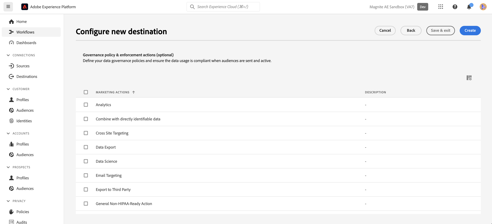
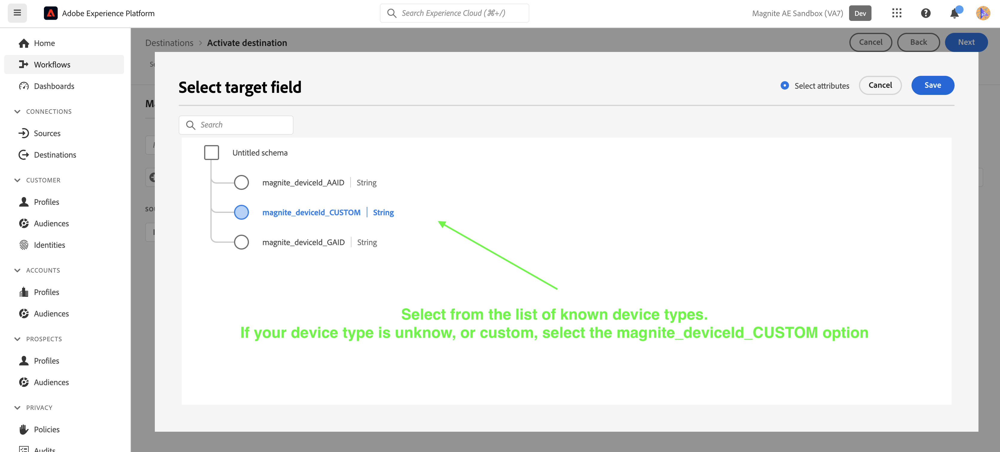

# Magnite Streaming: Batchanslutning {#magnite-streaming-batch}

## Översikt {#overview}

I det här dokumentet beskrivs Magnite Streaming: Batch-mål och exempelfall som hjälper dig att bättre förstå hur du aktiverar och exporterar målgrupper till det.

Adobe Real-Time CDP-målgrupper kan levereras till Magnite: Streaming Platform på två sätt - de kan levereras en gång om dagen, eller så kan de levereras i realtid:

1. Om du bara vill och/eller behöver leverera målgrupper en gång per dag kan du använda Magnite: Streaming Batch-målet, som levererar målgrupper till Magnite: Direktuppspelning via en daglig batchleverans av S3-filer. Dessa gruppmålgrupper lagras oändligt på vår plattform, till skillnad från målgrupper i realtid, som bara lagras i några dagar.

2. Men om ni vill och/eller behöver leverera målgrupper i realtid måste ni använda Magnite: Streaming Real-Time Target. När du använder Real-Time-målet kommer Magnite: Streaming att ta emot målgrupper i realtid, men vi kan bara lagra målgrupper i realtid tillfälligt på vår plattform, och de kommer att tas bort från vårt system inom några dagar. Om du vill använda Magnite: Streaming Real-Time-målet måste du därför också använda Magnite: Streaming Batch-målet - varje målgrupp som du aktiverar till Real-Time-målet måste du också aktivera till Batch-målet.

Sammanfattning: Om du bara vill leverera Adobe Real-Time CDP-målgrupper en gång om dagen använder du Magnite: endast direktuppspelningsbatchdestinationen, och målgrupperna levereras en gång om dagen. Om du vill leverera Adobe Real-Time CDP-målgrupper i realtid använder du både Magnite: Streaming Batch-målet och Magnite: Streaming Real-Time-målet. Mer information får du om du kontaktar Magnite: Streaming.

Nedan finns mer information om Magnite: Streaming Batch-destinationen, hur du ansluter till den och hur du aktiverar Adobe Real-Time CDP-målgrupper.
Mer information om målet i realtid finns i [det här dokumentet](magnite-streaming.md) i stället.

>[!IMPORTANT]
>
>Den här målanslutningen är i betaversion och endast tillgänglig för vissa kunder. Kontakta din Adobe-representant om du vill ha åtkomst.
>
>Målanslutnings- och dokumentationssidan skapas och underhålls av [!DNL Magnite] team. Om du har frågor eller uppdateringsfrågor kontaktar du dem direkt på `adobe-tech@magnite.com`.

## Användningsfall {#use-cases}

För att du bättre ska kunna förstå hur och när du ska använda Magnite Streaming: Batch-mål finns exempel på användningsområden som Adobe Experience Platform-kunder kan lösa med den här destinationen.

### Använd skiftläge 1 {#use-case-1}

Du har aktiverat en målgrupp på Magnite Streaming: Real-Time Destination.

Alla målgrupper som aktiveras via Magnite Streaming: Målplatsen i realtid måste också använda Magnite Streaming: Batch-destinationen eftersom data från batchleveransen är avsedda att ersätta/behålla data från Real-Time-leveransen i Magnite Streaming-plattformen.

### Använd skiftläge 2 {#use-case-2}

Du vill bara aktivera en målgrupp i en batch/dag på plattformen Magnite Streaming.

Alla målgrupper som aktiveras via Magnite Streaming: Batchdestinationen levereras i en batch/dag och kan sedan målgruppsanpassas i Magnite Streaming-plattformen.

## Förhandskrav {#prerequisites}

Om du vill använda Magnite-målen i Adobe Experience Platform måste du först ha ett Magnite Streaming-konto. Om du har en [!DNL Magnite Streaming] konto, kontakta [!DNL Magnite] kontohanterare som ska ges autentiseringsuppgifter för åtkomst [!DNL Magnite's] destinationer. Om du inte har en [!DNL Magnite Streaming] konto, kontakta adobe-tech@magnite.com

## Identiteter som stöds {#supported-identities}

Magnite Streaming: Batch-målet kan ta emot *alla* identitetskällor från Adobe CDP. För närvarande har det här målet tre målidentitetsfält som du kan mappa till.

>[!NOTE]
>
>*Alla* identitetskällor kan mappa till alla mål-ID:n för magnite_deviceId.

| Målidentitet | Beskrivning | Överväganden |
|:--------------------------- |:------------------------------------------------------------------------------------------------ |:------------------------------------------------------------------------------------- |
| magnite_deviceId_GAID | GOOGLE ADVERTISING ID | Välj den här målidentiteten när källidentiteten är en GAID |
| magnite_deviceId_IDFA | Apple ID för annonsörer | Välj den här målidentiteten när källidentiteten är en IDFA |
| magnite_deviceId_CUSTOM | Anpassat/användardefinierat ID | Välj den här målidentiteten när källidentiteten inte är en GAID eller IDFA, eller om den är ett anpassat eller användardefinierat ID |

{style="table-layout:auto"}

## Målgrupper {#supported-audiences}

| Målgruppsursprung | Stöds | Beskrivning |
|-----------------------------|----------|----------|
| [!DNL Segmentation Service] | ✓ | Målgrupper som skapats genom Experience Platform [Segmenteringstjänst](../../../segmentation/home.md). |
| Anpassade överföringar | ✓ | Målgrupper [importerad](../../../segmentation/ui/overview.md#import-audience) till Experience Platform från CSV-filer. |

{style="table-layout:auto"}

## Exportera typ och frekvens {#export-type-frequency}

| Objekt | Typ | Anteckningar |
|-----------------------------|----------|----------|
| Exporttyp | Målgruppsexport | Du exporterar alla medlemmar i en målgrupp med de identifierare (namn, telefonnummer eller andra) som används i Magnite Streaming: Batch-mål. |
| Exportfrekvens | Grupp | Batchdestinationer exporterar filer till efterföljande plattformar i steg om tre, sex, åtta, tolv eller tjugofyra timmar. Läs mer om batch [filbaserade mål](/help/destinations/destination-types.md). |

{style="table-layout:auto"}

## Anslut till målet {#connect}

När målanvändningen har godkänts och Magnite Streaming har delat dina autentiseringsuppgifter följer du stegen nedan för att autentisera, mappa och dela data.

### Autentisera till mål {#authenticate}

Leta reda på Magnite Streaming: Batch-mål i Adobe Experience-katalogen. Klicka på knappen med ytterligare alternativ (\..) och konfigurera sedan målanslutningen/målinstansen.

Om du redan har ett befintligt konto kan du hitta det genom att ändra kontotypsalternativet till &quot;Befintligt konto&quot;. Annars skapar du ett konto nedan:

Om du vill skapa ett nytt konto och autentisera det på målet för första gången fyller du i de obligatoriska fälten &quot;S3 access key&quot; och &quot;S3 secrets key&quot; (som du får via din kontohanterare) och väljer **[!UICONTROL Connect to destination]**

>[!NOTE]
>
>Säkerhetsprofilen för Magnite Streaming kräver en regelbunden rotation av S3-nycklar. Du bör förvänta dig att uppdatera ditt konto i framtiden med de nya S3- och S3-hemliga nycklarna. Du behöver bara uppdatera själva kontot - mål som använder det kontot använder automatiskt de uppdaterade nycklarna. Om de nya nycklarna inte kan överföras kommer data inte att kunna skickas till det här målet.

### Fyll i målinformation {#destination-details}

Om du vill konfigurera information för målet fyller du i de obligatoriska och valfria fälten nedan. En asterisk bredvid ett fält i användargränssnittet anger att fältet är obligatoriskt.

* **[!UICONTROL Name]**: Ett namn som du känner igen den här målanslutningen/instansen med i framtiden.
* **[!UICONTROL Description]**: En beskrivning som hjälper dig att identifiera den här målanslutningen/instansen i framtiden.
* **[!UICONTROL Name of your source partner]**: Det namn du vill använda som källa i Magnite Streaming

>[!NOTE]
>
>Om du planerar att skicka flera ID-typer (GAID, IDFA osv.) med hjälp av gruppmålet krävs en ny målanslutning/instans för varje. Kontakta din kontorepresentant för Magnite om du vill ha mer information.

Du kan sedan fortsätta genom att välja **[!UICONTROL Next]**

På nästa skärm,&quot;Styrningspolicy och verkställighetsåtgärder (valfritt)&quot;, kan du välja alla relevanta policyer för datastyrning. &quot;Dataexport&quot; är vanligtvis valt som mål för Magnite Streaming Batch.

När du har markerat eller om du vill hoppa över den här valfria skärmen väljer du **[!UICONTROL Create]**

### Aktivera aviseringar {#enable-alerts}

Du kan aktivera varningar för att få meddelanden om dataflödets status till ditt mål. Välj en avisering i listan om du vill prenumerera och få meddelanden om statusen för ditt dataflöde. Mer information om varningar finns i guiden på [prenumerera på destinationsvarningar med användargränssnittet](../../ui/alerts.md).

När du är klar med informationen för målanslutningen väljer du **[!UICONTROL Next]**.

### Aktivera segment till den här destinationen {#activate}

>[!IMPORTANT]
> 
>* För att aktivera data behöver du **[!UICONTROL View Destinations]**, **[!UICONTROL Activate Destinations]**, **[!UICONTROL View Profiles]** och **[!UICONTROL View Segments]** [behörigheter för åtkomstkontroll](/help/access-control/home.md#permissions). Läs [åtkomstkontroll - översikt](/help/access-control/ui/overview.md) eller kontakta produktadministratören för att få de behörigheter som krävs.
>* Exportera *identiteter* behöver du **[!UICONTROL View Identity Graph]** [behörighet för åtkomstkontroll](/help/access-control/home.md#permissions).   {width="100" zoomable="yes"}

Läs [Aktivera målgruppsdata för att batchprofilera exportmål](/help/destinations/ui/activate-batch-profile-destinations.md) om du vill ha instruktioner om hur du aktiverar målgruppssegment till det här målet.

### Mappa attribut och identiteter {#map}

I **[!UICONTROL Source field]**kan du välja attribut eller identitet för dina enheter. I det här exemplet har vi valt en anpassad IdentityMap som kallas &quot;DeviceId&quot;

I **[!UICONTROL Target field]**:
 Se [Identiteter som stöds](#supported-identities) för mer information.
I det här exemplet har vi valt **[!UICONTROL Target field]**: magnite_deviceId_CUSTOM, eftersom vår **[!UICONTROL Source field]** definierades som en anpassad IdentityMap: DeviceID.

>[!NOTE]
>
>Om du planerar att skicka/mappa flera ID-typer (GAID, IDFA osv.) med hjälp av gruppmålet krävs en ny målanslutning/instans för varje. Kontakta din kontorepresentant för Magnite om du vill ha mer information.

På skärmen&quot;Konfigurera ett filnamn och exportschema för varje målgrupp&quot; måste du nu konfigurera ett startdatum (obligatoriskt), ett slutdatum (valfritt) och ett mappnings-ID (obligatoriskt) för varje målgrupp.

>[!IMPORTANT]
>
> Ett mappnings-ID eller NONE krävs för det här målet.
>
> Ett mappnings-ID ska anges när en målgrupp har ett befintligt segment-ID som tidigare var känt för Magnite Streaming. Annars ska&quot;NONE&quot; användas som mappnings-ID.
>
> När du konfigurerar filnamnet för varje målgrupp ska du inkludera mappnings-ID via fältet Anpassad text som ska läggas till. Mappnings-ID läggs till som: `{previous_filename}\_\[MAPPING_ID\].` Om den här målgruppen inte är en del av Magnite Streaming och du inte kommer att ange något mappnings-ID, ska&quot;NONE&quot; anges i fältet&quot;Custom Text&quot;. Det nya filnamnet bör i det här fallet vara: `{previous_filename}\_\[NONE\]`.

## Exporterade data/Validera dataexport {#exported-data}

När era målgrupper har överförts kan ni validera att era målgrupper har skapats och överförts korrekt.

* Målet för Magnite Streaming Batch levererar S3-filer till Magnite Streaming varje dag. Efter leverans och förtäring förväntas målgrupper/segment visas i Magnite Streaming och kan tillämpas på ett avtal. Du kan bekräfta detta genom att söka efter det segment-ID eller segmentnamn som delades under aktiveringsstegen i Adobe Experience Platform.

>[!NOTE]
>
>Målgrupper som aktiveras/levereras till Magnite Streaming Batch-målet *ersätt* samma målgrupper som aktiverades/levererades via Magnite Streaming Real-Time-målet. Om du söker efter ett segment med segmentnamnet kanske du inte hittar segmentet i realtid förrän gruppen har importerats och bearbetats av plattformen Magnite Streaming.

## Dataanvändning och styrning {#data-usage-governance}

Alla [!DNL Adobe Experience Platform] destinationerna är kompatibla med dataanvändningsprinciper när data hanteras. Detaljerad information om hur [!DNL Adobe Experience Platform] använder datastyrning, läs [Datastyrning - översikt](/help/data-governance/home.md).

## Ytterligare resurser {#additional-resources}

Ytterligare hjälpdokumentation finns på [Magnite Help Center](https://help.magnite.com/help).
