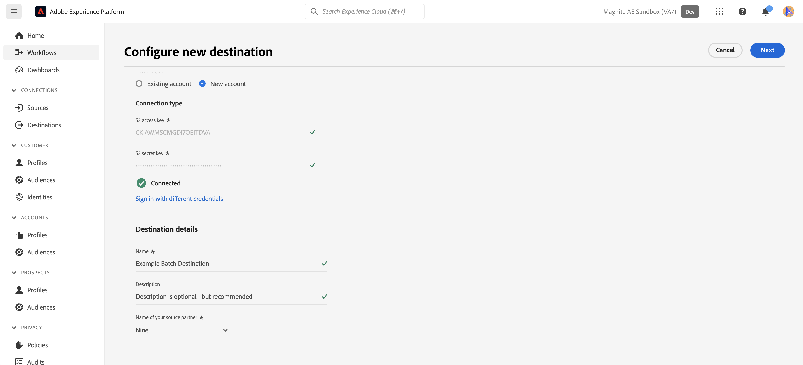

# Magnite: Batchanslutning {#magnite-streaming-batch}

## Översikt {#overview}

Det här dokumentet beskriver Magnite: Batch-målet och innehåller exempel på användningsområden som hjälper dig att bättre förstå hur du aktiverar och exporterar målgrupper till det.

Adobe [!DNL Real-Time CDP]-målgrupper kan levereras till plattformen Magnite Streaming på två sätt - de kan levereras en gång per dag eller levereras i realtid:

1. Om du bara vill och/eller behöver leverera målgrupper en gång per dag kan du använda Magnite: Batch-målet, som levererar målgrupper till Magnite Streaming via en daglig batchfilleverans av S3. Dessa gruppmålgrupper lagras oändligt i Magnite-plattformen, till skillnad från målgrupper i realtid, som bara lagras i ett par dagar.

2. Om du vill eller behöver leverera målgrupper oftare måste du använda målet [Magnite Real-Time](/help/destinations/catalog/advertising/magnite-streaming.md). När du använder Real-Time Target tar Magnite Streaming emot målgrupper i realtid, men Magnite kan bara lagra målgrupper i realtid tillfälligt på sin plattform, och de tas bort från systemet inom några dagar. Om du vill använda Magnite-målet i realtid *måste du* därför använda Magnite: Batch-målet - varje målgrupp som du aktiverar till Real-Time-målet måste du även aktivera till Batch-målet.

Sammanfattning: Om du bara vill leverera Adobe [!DNL Real-Time CDP]-målgrupper en gång om dagen använder du Magnite: Endast gruppmålet och målgrupperna levereras en gång om dagen. Om du vill leverera Adobe [!DNL Real-Time CDP]-målgrupper i realtid använder du *båda* Magnite: Batch-målet och Magnite Real-Time-målet. Mer information får du om du kontaktar Magnite: Streaming.

Fortsätt läsa nedan om du vill ha mer information om Magnite: Batch-mål, hur du ansluter till den och hur du aktiverar Adobe [!DNL Real-Time CDP]-målgrupper till den.
Mer information om Real-Time-målet finns på [den här dokumentationssidan](magnite-streaming.md) i stället.

>[!IMPORTANT]
>
>Målanslutningen och dokumentationssidan skapas och underhålls av [!DNL Magnite]-teamet. Om du har frågor eller uppdateringsförfrågningar kontaktar du dem direkt på `adobe-tech@magnite.com`.

## Användningsfall {#use-cases}

För att du bättre ska kunna förstå hur och när du ska använda Magnite: Batch-målet finns det exempel på användningsområden som [!DNL Adobe Experience Platform] kunder kan lösa med det här målet.

### Använd skiftläge 1 {#use-case-1}

Du har aktiverat en målgrupp på Magnites mål för realtid.

Alla målgrupper som aktiveras via Magnite Real-Time-målet måste också använda Magnite: Batch-målet, eftersom data från batchleveransen är avsedda att ersätta/behålla data från Real-Time-leveransen i Magnite Streaming-plattformen.

### Använd skiftläge 2 {#use-case-2}

Du vill bara aktivera en målgrupp i en batch/dag på plattformen Magnite Streaming.

Alla målgrupper som aktiveras via Magnite: Batch-destinationen levereras i batch/dag och kan sedan användas i Magnite Streaming-plattformen.

## Förutsättningar {#prerequisites}

Om du vill använda [!DNL Magnite]-destinationerna i [!DNL Adobe Experience Platform] måste du först ha ett Magnite Streaming-konto. Om du har ett [!DNL Magnite Streaming]-konto kan du kontakta din [!DNL Magnite]-kontohanterare för att få inloggningsuppgifter för att få åtkomst till [!DNL Magnite's]-mål. Om du inte har något [!DNL Magnite Streaming]-konto kan du kontakta adobe-tech@magnite.com

## Identiteter som stöds {#supported-identities}

Magnite: Målet för gruppen kan ta emot *alla* identitetskällor från Adobe CDP. För närvarande har det här målet tre målidentitetsfält som du kan mappa till.

>[!NOTE]
>
>*Alla*-identitetskällor kan mappa till någon av `magnite_deviceId`-målidentiteterna.

| Målidentitet | Beskrivning | Överväganden |
|:--------------------------- |:------------------------------------------------------------------------------------------------ |:------------------------------------------------------------------------------------- |
| magnite_deviceId_GAID | GOOGLE ADVERTISING ID | Välj den här målidentiteten när källidentiteten är en GAID |
| magnite_deviceId_IDFA | Apple ID för annonsörer | Välj den här målidentiteten när källidentiteten är en IDFA |
| magnite_deviceId_CUSTOM | Anpassat/användardefinierat ID | Välj den här målidentiteten när källidentiteten inte är en GAID eller IDFA, eller om den är ett anpassat eller användardefinierat ID |

{style="table-layout:auto"}

## Målgrupper {#supported-audiences}

| Målgruppsursprung | Stöds | Beskrivning |
|-----------------------------|----------|----------|
| [!DNL Segmentation Service] | Ja | Publiker som genererats via Experience Platform [segmenteringstjänst](../../../segmentation/home.md). |
| Alla andra målgrupper kommer | Ja | Den här kategorin omfattar alla målgrupper som kommer utanför målgrupper som genereras via [!DNL Segmentation Service]. Läs om de [olika målgruppernas ursprung](/help/segmentation/ui/audience-portal.md#customize). Några exempel är: <ul><li> anpassade uppladdningsgrupper [importerade](../../../segmentation/ui/audience-portal.md#import-audience) till Experience Platform från CSV-filer,</li><li> lookalike-målgrupper, </li><li> federerade målgrupper, </li><li> målgrupper som har genererats i andra Experience Platform-appar som [!DNL Adobe Journey Optimizer], </li><li> med mera. </li></ul> |

{style="table-layout:auto"}

Målgrupper som stöds av olika typer av målgruppsdata:

| Typ av målgruppsdata | Stöds | Beskrivning | Användningsfall |
|--------------------|-----------|-------------|-----------|
| [Målgrupper](/help/segmentation/types/people-audiences.md) | Ja | Baserat på kundprofiler kan ni inrikta er på specifika grupper av människor för marknadsföringskampanjer. | Ofta köpare, övergivna varukorgar |
| [Kontomålgrupper](/help/segmentation/types/account-audiences.md) | Nej | Rikta er till individer inom specifika organisationer för kontobaserade marknadsföringsstrategier. | B2B-marknadsföring |
| [Prospektera målgrupper](/help/segmentation/types/prospect-audiences.md) | Nej | Rikta er till individer som ännu inte är kunder men som delar egenskaper med er målgrupp. | Prospektera med data från tredje part |
| [Datauppsättningsexport](/help/catalog/datasets/overview.md) | Nej | Samlingar med strukturerade data lagrade i datasjön [!DNL Adobe Experience Platform]. | Arbetsflöden för rapportering, datavetenskap |

{style="table-layout:auto"}

## Exportera typ och frekvens {#export-type-frequency}

| Objekt | Typ | Anteckningar |
|-----------------------------|----------|----------|
| Exporttyp | Målgruppsexport | Du exporterar alla medlemmar i en målgrupp med de identifierare (namn, telefonnummer eller andra) som används i Magnite: Batch-mål. |
| Exportfrekvens | Grupp | Batchdestinationer exporterar filer till efterföljande plattformar i steg om tre, sex, åtta, tolv eller tjugofyra timmar. Läs mer om gruppbaserade [filbaserade mål](/help/destinations/destination-types.md). |

{style="table-layout:auto"}

## Anslut till målet {#connect}

När målanvändningen har godkänts och Magnite Streaming har delat dina autentiseringsuppgifter följer du stegen nedan för att autentisera, mappa och dela data.

### Autentisera till mål {#authenticate}

Leta rätt på Magnite: Batch-målet i Adobe Experience-katalogen. Klicka på knappen med ytterligare alternativ (\..) och konfigurera sedan målanslutningen/målinstansen.

Om du redan har ett befintligt konto kan du hitta det genom att ändra kontotypsalternativet till &quot;Befintligt konto&quot;. Annars skapar du ett konto nedan:

Om du vill skapa ett nytt konto och autentisera det på målet för första gången fyller du i de obligatoriska fälten för S3-åtkomstnyckel och S3-hemlig nyckel (som du får via din kontohanterare) och väljer **[!UICONTROL Connect to destination]**

>[!NOTE]
>
>Säkerhetsprofilen för Magnite Streaming kräver en regelbunden rotation av S3-nycklar. Du bör förvänta dig att uppdatera ditt konto i framtiden med de nya S3- och S3-hemliga nycklarna. Du behöver bara uppdatera själva kontot - mål som använder det kontot använder automatiskt de uppdaterade nycklarna. Om de nya nycklarna inte kan överföras kommer data inte att kunna skickas till det här målet.

### Fyll i målinformation {#destination-details}

Om du vill konfigurera information för målet fyller du i de obligatoriska och valfria fälten nedan. En asterisk bredvid ett fält i användargränssnittet anger att fältet är obligatoriskt.

* **[!UICONTROL Name]**: Ett namn som du känner igen den här målanslutningen/instansen med i
framtiden.
* **[!UICONTROL Description]**: En beskrivning som hjälper dig att identifiera detta
i framtiden.
* **[!UICONTROL Your company name]**: Ditt kund-/företagsnamn. Endast [!DNL Magnite Streaming]-klienter som stöds är tillgängliga för markering.

>[!NOTE]
>
>Företagsnamnet måste vara en sträng som matchar namnet på den Amazon S3-leveransgrupp som du har konfigurerat med Magnite och som har konfigurerats i steget [Autentisera till mål](#authenticate). Tecknen som stöds är a-z, A-Z, 0-9, - eller_ (understreck).

>[!NOTE]
>
>Om du planerar att skicka flera ID-typer (GAID, IDFA osv.) med hjälp av gruppmålet krävs en ny målanslutning/instans för varje. Kontakta din kontorepresentant för Magnite om du vill ha mer information.

Du kan sedan fortsätta genom att välja **[!UICONTROL Next]**

På nästa skärm,&quot;Styrningspolicy och verkställighetsåtgärder (valfritt)&quot;, kan du välja alla relevanta policyer för datastyrning. &quot;Dataexport&quot; är vanligtvis valt som mål för Magnite: Batch.

Välj **[!UICONTROL Create]** när du har markerat den, eller om du vill hoppa över den här valfria skärmen

### Aktivera aviseringar {#enable-alerts}

Du kan aktivera varningar för att få meddelanden om dataflödets status till ditt mål. Välj en avisering i listan om du vill prenumerera och få meddelanden om statusen för ditt dataflöde. Mer information om varningar finns i guiden [prenumerera på destinationsvarningar med användargränssnittet](../../ui/alerts.md).

Välj **[!UICONTROL Next]** när du är klar med att ange information för målanslutningen.

### Aktivera målgrupper till det här målet {#activate}

>[!IMPORTANT]
>
>* För att aktivera data behöver du behörigheterna **[!UICONTROL View Destinations]**, **[!UICONTROL Activate Destinations]**, **[!UICONTROL View Profiles]** och **[!UICONTROL View Segments]** [åtkomstkontroll](/help/access-control/home.md#permissions). Läs [åtkomstkontrollsöversikten](/help/access-control/ui/overview.md) eller kontakta produktadministratören för att få den behörighet som krävs.
>* Om du vill exportera *identiteter* måste du ha **[!UICONTROL View Identity Graph]** [åtkomstkontrollbehörighet](/help/access-control/home.md#permissions).   {width="100" zoomable="yes"}

Läs [Aktivera målgruppsdata för att batchprofilera exportmål](/help/destinations/ui/activate-batch-profile-destinations.md) om du vill ha instruktioner om hur du aktiverar målgruppssegment till det här målet.

### Mappa attribut och identiteter {#map}

I **[!UICONTROL Source field]** kan du välja attribut eller identitet för dina enheter. I det här exemplet har vi valt en anpassad IdentityMap som kallas &quot;DeviceId&quot;

I **[!UICONTROL Target field]**:
 Mer information finns i [&#x200B; Identiteter som stöds &#x200B;](#supported-identities) .
I det här exemplet har vi valt **[!UICONTROL Target field]**: magnite_deviceId_CUSTOM eftersom **[!UICONTROL Source field]** definierades som en anpassad IdentityMap: DeviceID.

>[!NOTE]
>
>Om du planerar att skicka/mappa flera ID-typer (GAID, IDFA osv.) med hjälp av gruppmålet krävs en ny målanslutning/instans för varje. Kontakta din kontorepresentant för Magnite om du vill ha mer information.

På skärmen&quot;Konfigurera ett filnamn och exportschema för varje målgrupp&quot; måste du nu konfigurera ett startdatum (obligatoriskt), ett slutdatum (valfritt) och ett mappnings-ID (obligatoriskt) för varje målgrupp.

>[!IMPORTANT]
>
> Ett mappnings-ID eller NONE krävs för det här målet.
>
> Ett mappnings-ID ska anges när en målgrupp har ett befintligt segment-ID som tidigare var känt för Magnite Streaming. Annars ska&quot;NONE&quot; användas som mappnings-ID.
>
> När du konfigurerar filnamnet för varje målgrupp ska du inkludera mappnings-ID via fältet Anpassad text som ska läggas till. Mappnings-ID:t läggs till som: `{previous_filename}\_\[MAPPING_ID\].` Om den här målgruppen är ny för Magnite Streaming och du inte kommer att ange något mappnings-ID, ska NONE anges i fältet Custom Text (Egen text). Det nya filnamnet bör i det här fallet vara: `{previous_filename}\_\[NONE\]`.

## Exporterade data/Validera dataexport {#exported-data}

När era målgrupper har överförts kan ni validera att era målgrupper har skapats och överförts korrekt.

* Magnite: Batch-målet levererar S3-filer till Magnite Streaming varje dag. Efter leverans och förtäring förväntas målgrupper/segment visas i Magnite Streaming och kan tillämpas på ett avtal. Du kan bekräfta detta genom att söka efter det segment-ID eller segmentnamn som delades under aktiveringsstegen i [!DNL Adobe Experience Platform].

>[!NOTE]
>
>Publiker som aktiveras/levereras till Magnite: Batchmålet *ersätter* samma målgrupper som aktiverades/levererades via Magnite Real-Time-målet. Om du söker efter ett segment med segmentnamnet kanske du inte hittar segmentet i realtid förrän gruppen har importerats och bearbetats av plattformen Magnite Streaming.

## Dataanvändning och styrning {#data-usage-governance}

Alla [!DNL Adobe Experience Platform]-mål är kompatibla med dataanvändningsprinciper när data hanteras. Mer information om hur [!DNL Adobe Experience Platform] använder datastyrning finns i [Översikt över datastyrning](/help/data-governance/home.md).

## Ytterligare resurser {#additional-resources}

Mer information finns på [Magnite Help Center](https://help.magnite.com/help).
