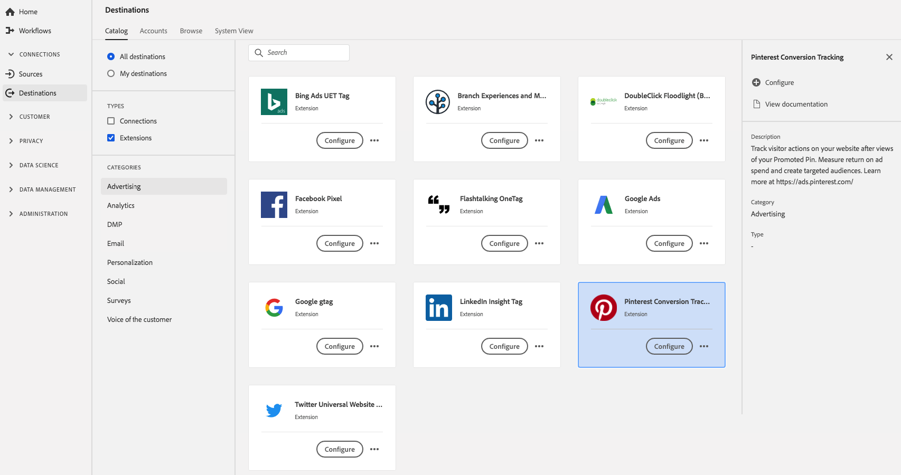

# [!DNL Pinterest Conversion Tracking] extension {#pinterest-extension}

## Översikt {#overview}

Spåra besöksåtgärder på din webbplats efter att ha visat din PIN-kod. Mät avkastningen på annonskostnaderna och skapa riktade målgrupper. Läs mer [här](https://ads.pinterest.com/).

[!DNL Pinterest Conversion Tracking] är ett reklamtillägg i Adobe Experience Platform. Mer information om tilläggsfunktioner finns på tilläggssidan på [Adobe Exchange](https://exchange.adobe.com/experiencecloud.details.100523.pinterest-conversion-tracking-for-adobe-launch.html).

Målet är ett taggtillägg. Mer information om hur taggtillägg fungerar i Platform finns i [översikten över taggtillägg](../launch-extensions/overview.md).

## Förutsättningar {#prerequisites}

Det här tillägget är tillgängligt i [!DNL Destinations]-katalogen för alla kunder som har köpt Platform.

Om du vill använda det här tillägget måste du ha tillgång till taggar i Adobe Experience Platform. Adobe Experience Cloud-kunder får taggar som en inkluderad funktion som ger mervärde. Kontakta din organisations administratör för att få åtkomst till taggar och be dem att ge dig behörigheten **[!UICONTROL manage_properties]** så att du kan installera tillägg. och be dem att ge dig behörigheten **[!UICONTROL manage_properties]** så att du kan installera tillägg.

## Installera tillägg {#install-extension}

Så här installerar du tillägget [!DNL Pinterest Conversion Tracking]:

Gå till **[!UICONTROL Destinations]** > **[!UICONTROL Catalog]** i [plattformsgränssnittet](https://platform.adobe.com/).

Välj tillägget i katalogen eller använd sökfältet.

Klicka på målet för att markera det och välj sedan **[!UICONTROL Configure]** i den högra listen. Om kontrollen **[!UICONTROL Configure]** är nedtonad saknar du behörigheten **[!UICONTROL manage_properties]**. Se [Förutsättningar](#prerequisites).

Välj den egenskap i vilken du vill installera tillägget. Du kan också skapa en ny egenskap. En egenskap är en samling regler, dataelement, konfigurerade tillägg, miljöer och bibliotek. Lär dig mer om egenskaper i avsnittet [Egenskaper](../../../tags/ui/administration/companies-and-properties.md#properties-page) i taggdokumentationen.

Arbetsflödet vägleder dig genom stegen för att slutföra installationen.

Information om alternativ för tilläggskonfiguration och installationsstöd finns på sidan [Pinterest Conversion Tracking på Adobe Exchange](https://exchange.adobe.com/experiencecloud.details.100523.pinterest-conversion-tracking-for-adobe-launch.html).

Du kan också installera tillägget direkt i [användargränssnittet för datainsamling](https://experience.adobe.com/#/data-collection/). Mer information finns i avsnittet om att [lägga till ett nytt tillägg](../../../tags/ui/managing-resources/extensions/overview.md#add-a-new-extension) i taggdokumentationen.

## Så här använder du tillägget {#how-to-use}

När du har installerat tillägget kan du börja konfigurera regler.

Du kan konfigurera regler för de installerade tilläggen så att händelsedata skickas till tilläggets mål endast i vissa situationer. Mer information om hur du ställer in regler för dina tillägg finns i [taggdokumentationen](../../../tags/ui/managing-resources/rules.md).

## Konfigurera, uppgradera och ta bort tillägg {#configure-upgrade-delete}

Du kan konfigurera, uppgradera och ta bort tillägg i användargränssnittet för datainsamling.

>[!TIP]
>
>Om tillägget redan är installerat på en av dina egenskaper visas fortfarande **[!UICONTROL Install]** som plattformsgränssnitt för tillägget. Stäng av installationsarbetsflödet enligt beskrivningen i [Installera tillägget](#install-extension) för att konfigurera eller ta bort tillägget.

Om du vill uppgradera tillägget läser du guiden för [uppgraderingsprocessen](../../../tags/ui/managing-resources/extensions/extension-upgrade.md) i taggdokumentationen.
