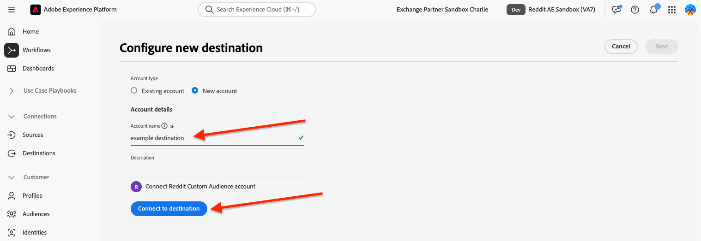
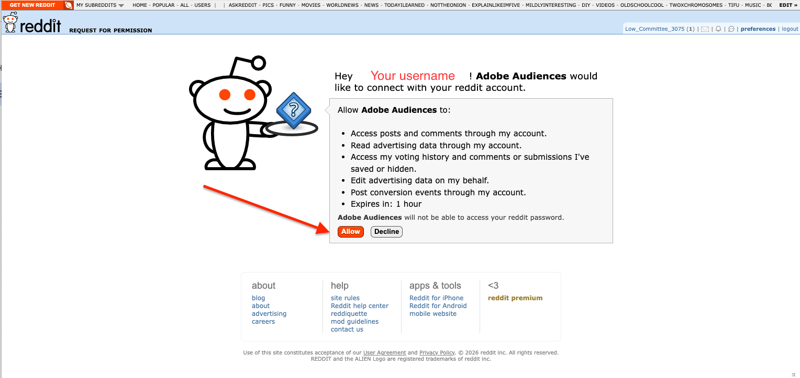

# [!DNL Reddit Custom Audience]-anslutning {#reddit-custom-audience-connection}

## Översikt {#overview}

[!DNL Reddit Ads] kopplar varumärken till personer som aktivt undersöker sina passioner och problem i realtid. Genom att kombinera målgruppsinriktade, communitystyrda konversationer med flexibla annonsformat och robust målinriktning kan [!DNL Reddit Ads] hjälpa annonsörerna att nå engagerade målgrupper, få bättre resultat och lära sig direkt från communityn som formar kulturen online.

Den här guiden är till för annonsörer och medieteam som använder [!DNL Adobe Experience Platform] för att skicka målgrupper till [!DNL Reddit Ads]. Det täcker vad ni behöver för att koppla samman era konton, kartlägga identiteter och aktivera målgrupper.

>[!IMPORTANT]
>
>Målanslutningen och dokumentationssidan skapas och underhålls av [!DNL Reddit]-teamet. Om du har frågor eller uppdateringsförfrågningar kontaktar du dem direkt på <adsapi-partner-support@reddit.com>.

## Användningsfall {#use-cases}

För att du bättre ska kunna förstå hur och när du ska använda målet [!DNL Reddit Custom Audience] finns det exempel på användningsområden som [!DNL Adobe Experience Platform]-kunder kan lösa genom att använda det här målet.

### Återannonsera befintliga kunder med personaliserade erbjudanden {#use-case-1}

En webbutik vill nå befintliga kunder via sociala plattformar och visa dem personaliserade erbjudanden baserat på deras tidigare order. Onlinebutiken kan importera e-postadresser och enhets-ID:n (IDFA och GAID) från sin egen CRM till [!DNL Adobe Experience Platform], bygga målgrupper utifrån sina egna offlinedata och skicka dessa målgrupper till [!DNL Reddit Ads] för att optimera sina annonsutgifter.

## Förutsättningar {#prerequisites}

Innan du konfigurerar det här målet bör du kontrollera att följande krav uppfylls:

* Ett [!DNL Reddit Ads]-konto som kan använda anpassade målgrupper och kundlistor.
* Behörighet att auktorisera anslutningen. Detta måste vara en användare som kan logga in på [!DNL Reddit] och godkänna åtkomst för [!DNL Experience Platform] för att hantera målgrupper för annonskontots räkning.
* Ditt [!DNL Reddit]-annonskonto-ID: identifieraren för annonskontot där målgrupper skapas. Du hittar ditt annonskonto-ID i [Konton](https://ads.reddit.com/accounts). Till exempel: `a2_1b2c34d`.

## Identiteter som stöds {#supported-identities}

[!DNL Reddit Custom Audience] stöder aktivering av identiteter som beskrivs i tabellen nedan. Läs mer om [identiteter](/help/identity-service/features/namespaces.md).

| Målidentitet | Beskrivning | Överväganden |
| --- | --- | --- |
| email_lc_sha256 | E-postadresser som hashas med SHA256-algoritmen | Både oformaterad text och SHA256-hash-adresser stöds av [!DNL Adobe Experience Platform]. När källfältet innehåller ohashade attribut ska du markera alternativet **[!UICONTROL Apply transformation]** så att [!DNL Platform] automatiskt kraschar data vid aktiveringen. |
| maid | Google Advertising ID eller Apple ID för annonsörer, båda hashas med algoritmen SHA256 | Mappa antingen GAID eller IDFA till **maid**. När källfältet innehåller ohashade attribut ska du markera alternativet **[!UICONTROL Apply transformation]** så att [!DNL Platform] automatiskt kraschar data vid aktiveringen. |

{style="table-layout:auto"}

## Målgrupper {#supported-audiences}

I det här avsnittet beskrivs vilka typer av målgrupper du kan exportera till det här målet.

| Målgruppsursprung | Stöds | Beskrivning |
| --- | --- | --- |
| [!DNL Segmentation Service] | Ja | Publiker som genererats via [!DNL Experience Platform] [segmenteringstjänsten](../../../segmentation/home.md). |
| Alla andra målgrupper kommer | Ja | Den här kategorin omfattar alla målgrupper som kommer utanför de målgrupper som genereras via segmenteringstjänsten. Läs om de [olika målgruppernas ursprung](/help/segmentation/ui/audience-portal.md#customize). |

{style="table-layout:auto"}

Målgrupper efter datatyp:

| Typ av målgruppsdata | Stöds | Beskrivning | Användningsfall |
| --- | --- | --- | --- |
| [Målgrupper](/help/segmentation/types/people-audiences.md) | Ja | Baserat på kundprofiler kan ni inrikta er på specifika grupper av människor för marknadsföringskampanjer. | Ofta köpare, övergivna varukorgar |
| [Kontomålgrupper](/help/segmentation/types/account-audiences.md) | Nej | Rikta er till individer inom specifika organisationer för kontobaserade marknadsföringsstrategier. | B2B-marknadsföring |
| [Prospektera målgrupper](/help/segmentation/types/prospect-audiences.md) | Nej | Rikta er till individer som ännu inte är kunder men som delar egenskaper med er målgrupp. | Prospektera med data från tredje part |
| [Datauppsättningsexport](/help/catalog/datasets/overview.md) | Nej | Samlingar med strukturerade data lagrade i datasjön [!DNL Adobe Experience Platform]. | Arbetsflöden för rapportering, datavetenskap |

{style="table-layout:auto"}

## Exportera typ och frekvens {#export-type-frequency}

Se tabellen nedan för information om exporttyp och frekvens för destinationen.

| Objekt | Typ | Anteckningar |
| --- | --- | --- |
| Exporttyp | **[!UICONTROL Audience export]** | Du exporterar alla medlemmar i en målgrupp med identifierarna (namn, telefonnummer eller andra) som används i målet [!DNL Reddit Custom Audience]. |
| Exportfrekvens | **[!UICONTROL Streaming]** | Direktuppspelningsmål är alltid på API-baserade anslutningar. Så snart en profil uppdateras i Experience Platform baserat på målgruppsutvärdering skickar anslutningsprogrammet uppdateringen nedströms till målplattformen. Läs mer om [direktuppspelningsmål](/help/destinations/destination-types.md#streaming-destinations). |

{style="table-layout:auto"}

## Anslut till målet {#connect}

>[!IMPORTANT]
>
>Om du vill ansluta till målet behöver du behörigheterna **[!UICONTROL View Destinations]** och **[!UICONTROL Manage Destinations]** [åtkomstkontroll](/help/access-control/home.md#permissions). Läs [åtkomstkontrollsöversikten](/help/access-control/ui/overview.md) eller kontakta produktadministratören för att få den behörighet som krävs.

Om du vill ansluta till det här målet följer du stegen som beskrivs i självstudiekursen [för destinationskonfiguration](../../ui/connect-destination.md). I arbetsflödet för att konfigurera mål fyller du i fälten som listas i de två avsnitten nedan.

### Autentisera till mål {#authenticate}

Fyll i de obligatoriska fälten och välj **[!UICONTROL Connect to destination]** om du vill autentisera mot målet.



Du omdirigeras för att logga in med [!DNL Reddit]. När du har granskat de begärda behörigheterna väljer du **[!UICONTROL Allow]** så att [!DNL Experience Platform] kan skapa målgrupper och uppdatera medlemskap för ditt annonskonto.



### Fyll i målinformation {#destination-details}

Om du vill konfigurera information för målet fyller du i de obligatoriska och valfria fälten nedan. En asterisk bredvid ett fält i användargränssnittet anger att fältet är obligatoriskt.


* **[!UICONTROL Name]**: Ett namn som identifierar det här målet.
* **[!UICONTROL Description]**: En beskrivning som hjälper dig att identifiera det här målet.
* **[!UICONTROL Ad Account ID]**: Ditt [!DNL Reddit] ID för annonskonto.

### Aktivera aviseringar {#enable-alerts}

Du kan aktivera varningar för att få meddelanden om dataflödets status till ditt mål. Välj en avisering i listan om du vill prenumerera och få meddelanden om statusen för ditt dataflöde. Mer information om varningar finns i guiden [prenumerera på destinationsvarningar med användargränssnittet](../../ui/alerts.md).

Välj **[!UICONTROL Next]** när du är klar med att ange information för målanslutningen.

## Aktivera målgrupper till det här målet {#activate}

>[!IMPORTANT]
>
>* För att aktivera data behöver du behörigheterna **[!UICONTROL View Destinations]**, **[!UICONTROL Activate Destinations]**, **[!UICONTROL View Profiles]** och **[!UICONTROL View Segments]** [åtkomstkontroll](/help/access-control/home.md#permissions). Läs [åtkomstkontrollsöversikten](/help/access-control/ui/overview.md) eller kontakta produktadministratören för att få den behörighet som krävs.
>* Om du vill exportera *identiteter* måste du ha **[!UICONTROL View Identity Graph]** [åtkomstkontrollbehörighet](/help/access-control/home.md#permissions). <br> {width="100" zoomable="yes"}

Läs [Aktivera profiler och målgrupper för att direktuppspela målgruppsexportdestinationer](/help/destinations/ui/activate-segment-streaming-destinations.md) för instruktioner om hur du aktiverar målgrupper till det här målet.

### Mappa attribut och identiteter {#map}

Följande målidentitetsnamnutrymmen måste mappas beroende på användningsfallet:

| Source Field | Målfält | Anteckningar |
| --- | --- | --- |
| E-post (oformaterad text eller hash) | email_lc_sha256 | Källfältet kan hash-kodas eller hash-kodas. [!DNL Reddit] accepterar bara hash-värden. Aktivera **[!UICONTROL Apply transformation]** så att [!DNL Experience Platform] inaktiverar e-postmeddelandet innan det skickas. |
| MAID (oformaterad text eller hash) | maid | Källfältet kan hash-kodas eller hash-kodas. [!DNL Reddit] accepterar bara hash-värden. Aktivera **[!UICONTROL Apply transformation]** så att [!DNL Experience Platform] kraschar värdet innan det skickas. |

Du måste mappa minst en av identiteterna.


## Exporterade data/Validera dataexport {#exported-data}

När du har aktiverat dina målgrupper kan du se dem i ditt [!DNL Reddit] Ads Manager-konto.

Publiker som nyligen har skapats i [!DNL Reddit] visas i ett väntande läge. När dataflödet körs och profilerna exporteras matchar [!DNL Reddit] profilerna mot [!DNL Reddit] användare. När data har bearbetats ändras målgruppens status till **[!UICONTROL Valid]**. Målgruppens storlek måste vara [1 000 användare eller fler](https://ads-api.reddit.com/docs/v3/manage-customer-lists) för att anses vara giltig. Publiker som inte uppfyller kraven för storlek visas som **[!UICONTROL Invalid]**.


Följande är ett exempel på nyttolasten som skickas till [!DNL Reddit]:

```json
{
  "data": {
    "action_type": "ADD",
    "column_order": [
      "EMAIL_SHA256",
      "MAID_SHA256"
    ],
    "user_data": [
      [
        "d7ef2e7b2a3663c25284a3d6d13b1ca727fc8c659474b81afe0cec997a4737d2",
        "510870d7b3e47a28a2b2f3aef27a4c81aab0b2eefda27dea50bc4c991d9e5435"
      ]
    ]
  }
}
```

Mer information finns i [dokumentationen för redigerings-API](https://ads-api.reddit.com/docs/v3/operations/Update%20Custom%20Audience%20Users).

## Dataanvändning och styrning {#data-usage-governance}

Alla [!DNL Adobe Experience Platform]-mål är kompatibla med dataanvändningsprinciper när data hanteras. Mer information om hur [!DNL Adobe Experience Platform] använder datastyrning finns i [Översikt över datastyrning](/help/data-governance/home.md).

## Ytterligare resurser {#additional-resources}

Mer information om hur den anpassade målgruppens slutpunkt fungerar finns i [dokumentationen för redigerings-API](https://ads-api.reddit.com/docs/v3/operations/Update%20Custom%20Audience%20Users).
