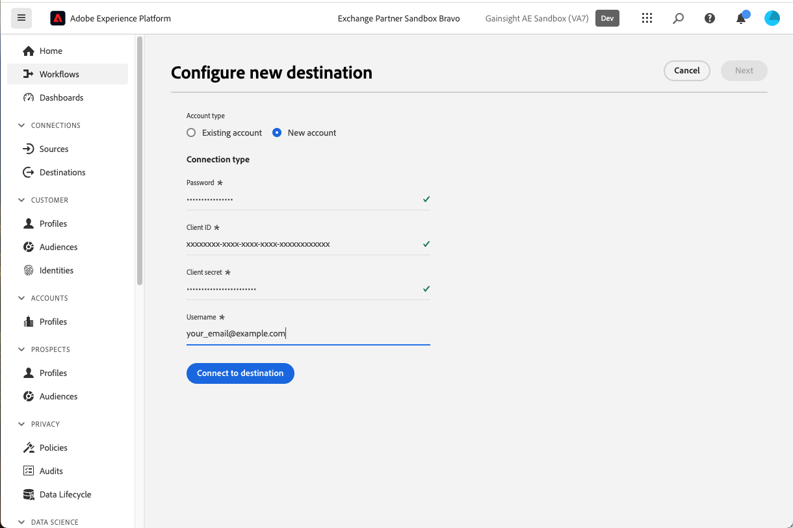
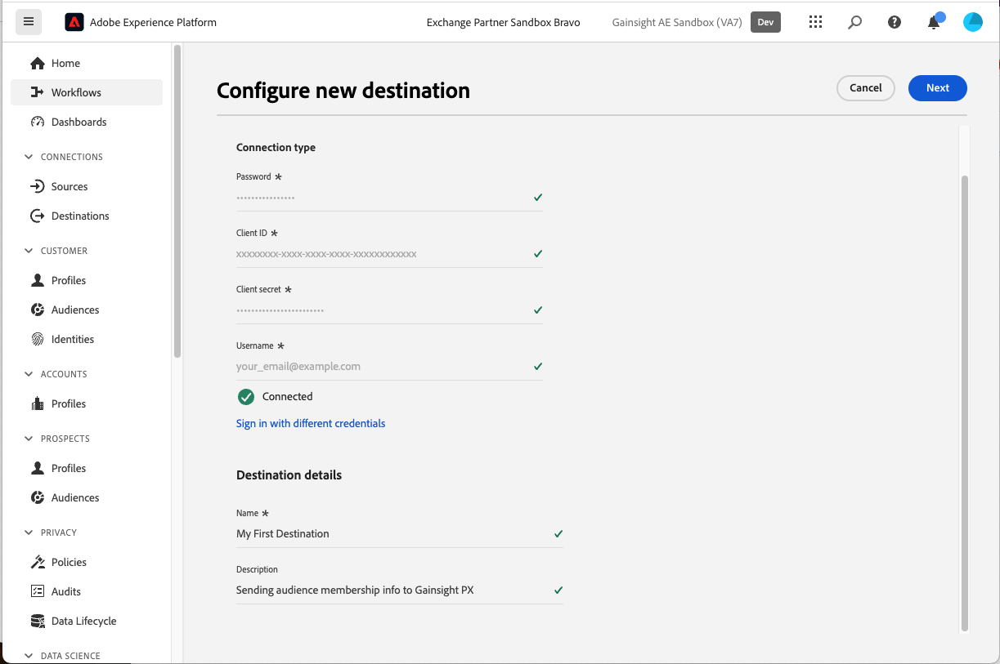
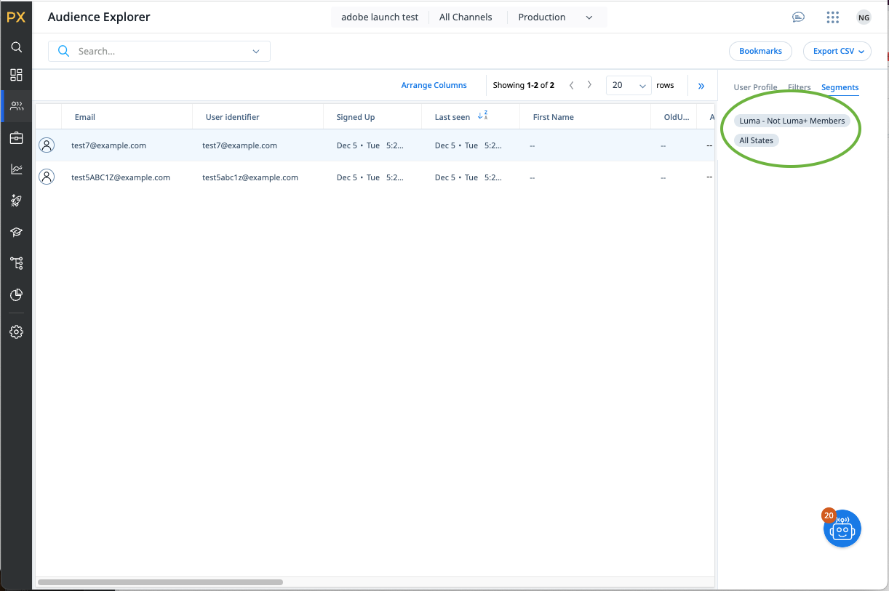

# Gainsight PX-anslutning {#gainsight-px}

## Översikt {#overview}

[[!DNL Gainsight PX]](https://www.gainsight.com/product-experience/) är en produktupplevelseplattform som gör det möjligt för produktteamen att förstå hur användarna använder sina produkter, samla in feedback och skapa produktgenomgångar i appen för att få användarna att komma igång och implementera produkterna.

>[!IMPORTANT]
>
>Målanslutningen och dokumentationssidan skapas och underhålls av *Gainsight PX*-teamet. Om du har frågor eller uppdateringsförfrågningar kontaktar du dem direkt på *`pxsupport@gainsight.com`*.

## Användningsfall {#use-cases}

För att du bättre ska kunna förstå hur och när du ska använda målet *Gainsight PX* finns det exempel på användning som Adobe Experience Platform-kunder kan lösa genom att använda det här målet.

### Målinriktade aktiviteter i appen {#targeting-in-app-engagements}

Ett SaaS-företag vill engagera sina kunder via en guide i appen som konstruerats på Gainsight PX. En målgrupp som vill få detta engagemang har byggts på Adobe Experience Platform. Gainsight PX-destinationen tar emot målgruppen och gör den tillgänglig i Gainsight PX-miljön.

## Förutsättningar {#prerequisites}

* Kontakta supportteamet på [!DNL Gainsight] och begär aktivering av externa segmentfunktioner för din prenumeration.
* Generera ett OAuth Secret-värde för din PX-prenumeration med knappen **[!UICONTROL Generate New Secret]** längst ned på [sidan Företagsinformation](https://app.aptrinsic.com/settings/subscription)
  

## Identiteter som stöds {#supported-identities}

Gainsight PX stöder aktivering av de identiteter som beskrivs i tabellen nedan. Läs mer om [identiteter](../../../identity-service/features/namespaces.md).

| Målidentitet | Beskrivning |
|---|----|
| ID | Gemensam användaridentifierare som unikt identifierar en användare i Gainsight PX och Adobe Experience Platform |

{style="table-layout:auto"}

## Målgrupper {#supported-audiences}

I det här avsnittet beskrivs vilken typ av målgrupp du kan exportera till det här målet.

| Målgruppsursprung | Stöds | Beskrivning |
|---------|----------|----------|
| [!DNL Segmentation Service] | Ja | Publiker som genererats via Experience Platform [segmenteringstjänst](../../../segmentation/home.md). |
| Alla andra målgrupper kommer | Nej | Den här kategorin omfattar alla målgrupper som kommer utanför målgrupper som genereras via [!DNL Segmentation Service]. Läs om de [olika målgruppernas ursprung](/help/segmentation/ui/audience-portal.md#customize). Några exempel är: <ul><li> anpassade uppladdningsgrupper [importerade](../../../segmentation/ui/audience-portal.md#import-audience) till Experience Platform från CSV-filer,</li><li> lookalike-målgrupper, </li><li> federerade målgrupper, </li><li> målgrupper som genererats i andra Experience Platform-appar som Adobe Journey Optimizer, </li><li> med mera. </li></ul> |

{style="table-layout:auto"}

Målgrupper som stöds av olika typer av målgruppsdata:

| Typ av målgruppsdata | Stöds | Beskrivning | Användningsfall |
|--------------------|-----------|-------------|-----------|
| [Målgrupper](/help/segmentation/types/people-audiences.md) | Ja | Baserat på kundprofiler kan ni inrikta er på specifika grupper av människor för marknadsföringskampanjer. | Ofta köpare, övergivna varukorgar |
| [Kontomålgrupper](/help/segmentation/types/account-audiences.md) | Nej | Rikta er till individer inom specifika organisationer för kontobaserade marknadsföringsstrategier. | B2B-marknadsföring |
| [Prospektera målgrupper](/help/segmentation/types/prospect-audiences.md) | Nej | Rikta er till individer som ännu inte är kunder men som delar egenskaper med er målgrupp. | Prospektera med data från tredje part |
| [Datauppsättningsexport](/help/catalog/datasets/overview.md) | Nej | Samlingar med strukturerade data som lagras i Adobe Experience Platform Data Lake. | Arbetsflöden för rapportering, datavetenskap |

{style="table-layout:auto"}

## Exportera typ och frekvens {#export-type-frequency}

Se tabellen nedan för information om exporttyp och frekvens för destinationen.

| Objekt | Typ | Anteckningar |
|---|---|---|
| Exporttyp | **[!UICONTROL Segment export]** | Du exporterar alla medlemmar i en målgrupp med identifierarna (namn, telefonnummer eller andra) som används i målet [!DNL Gainsight PX]. |
| Exportfrekvens | **[!UICONTROL Streaming]** | Direktuppspelningsmål är alltid på API-baserade anslutningar. När en profil uppdateras i Experience Platform baserat på målgruppsutvärdering skickar anslutningsprogrammet uppdateringen nedåt till målplattformen. Läs mer om [direktuppspelningsmål](/help/destinations/destination-types.md#streaming-destinations). |

{style="table-layout:auto"}

## Anslut till målet {#connect}

>[!IMPORTANT]
>
>Om du vill ansluta till målet måste du ha **[!UICONTROL Manage Destinations]** [åtkomstkontrollbehörighet](/help/access-control/home.md#permissions). Läs [åtkomstkontrollsöversikten](/help/access-control/ui/overview.md) eller kontakta produktadministratören för att få den behörighet som krävs.

Om du vill ansluta till det här målet följer du stegen som beskrivs i självstudiekursen [för destinationskonfiguration](../../ui/connect-destination.md). I arbetsflödet för målkonfiguration fyller du i fälten som listas i de två avsnitten nedan.

### Autentisera till mål {#authenticate}

Fyll i de obligatoriska fälten och välj **[!UICONTROL Connect to destination]** om du vill autentisera mot målet.

* **[!UICONTROL Password]**: Lösenordet som används för att logga in på [[!DNL Gainsight PX]](https://app.aptrinsic.com)
* **[!UICONTROL Client ID]**: Gainsight PX-prenumerations-ID på sidan [Företagsinformation](https://app.aptrinsic.com/settings/subscription)
* **[!UICONTROL Client secret]**: OAuth-hemligheten som genereras längst ned på [företagsinformationssidan](https://app.aptrinsic.com/settings/subscription) i [!DNL Gainsight PX]-gränssnittet.
* **[!UICONTROL Username]**: E-postadressen som används för att logga in i användargränssnittet för [[!DNL Gainsight PX]](https://app.aptrinsic.com)

### Fyll i målinformation {#destination-details}

Om du vill konfigurera information för målet fyller du i de obligatoriska och valfria fälten nedan. En asterisk bredvid ett fält i användargränssnittet anger att fältet är obligatoriskt.

* **[!UICONTROL Name]**: Ett namn som du känner igen det här målet med i framtiden.
* **[!UICONTROL Description]**: En beskrivning som hjälper dig att identifiera det här målet i framtiden.

Välj **[!UICONTROL Next]** när du är klar med att ange information för målanslutningen.

## Aktivera målgrupper till det här målet {#activate}

>[!IMPORTANT]
>
>* För att aktivera data behöver du behörigheterna **[!UICONTROL Manage Destinations]**, **[!UICONTROL Activate Destinations]**, **[!UICONTROL View Profiles]** och **[!UICONTROL View Segments]** [åtkomstkontroll](/help/access-control/home.md#permissions). Läs [åtkomstkontrollsöversikten](/help/access-control/ui/overview.md) eller kontakta produktadministratören för att få den behörighet som krävs.
>* Om du vill exportera *identiteter* måste du ha **[!UICONTROL View Identity Graph]** [åtkomstkontrollbehörighet](/help/access-control/home.md#permissions).   {width="100" zoomable="yes"}

Läs [Aktivera målgrupper till direktuppspelningsmål](/help/destinations/ui/activate-segment-streaming-destinations.md) om du vill ha instruktioner om hur du aktiverar målgrupper till det här målet.

### Mappa identiteter {#map}

Det här målet stöder mappning av profilattribut och identitetsnamnutrymmen. Målmappningen måste alltid vara identitetsnamnrymden **[!UICONTROL IDENTIFY_ID]**.

Se exemplen nedan för att få en bättre förståelse för hur du konfigurerar mappning.

#### Mappa ett profilattribut {#map-profile-attribute}

I exemplet nedan är källfältet ett XDM-profilattribut som mappas till målnamnutrymmet IDENTIFY_ID.

#### Mappa ett identitetsnamnutrymme {#map-identity-namespace}

I exemplet nedan är källfältet ett identitetsnamnområde (**[!UICONTROL ECID]**) som mappas till målnamnområdet **[!UICONTROL IDENTIFY_ID]**.

## Exporterade data/Validera dataexport {#exported-data}

Segmenteringsdata strömmas från Experience Platform till Gainsight PX.

Metadata för segment visas på segmentskärmen i användargränssnittet för [!DNL Gainsight PX].

Information om segmentmedlemskap visas på fliken Segment på skärmen Audience Explorer i användargränssnittet för [!DNL Gainsight PX].

## Dataanvändning och styrning {#data-usage-governance}

Alla [!DNL Adobe Experience Platform]-mål är kompatibla med dataanvändningsprinciper när data hanteras. Mer information om hur [!DNL Adobe Experience Platform] använder datastyrning finns i [Översikt över datastyrning](/help/data-governance/home.md).
