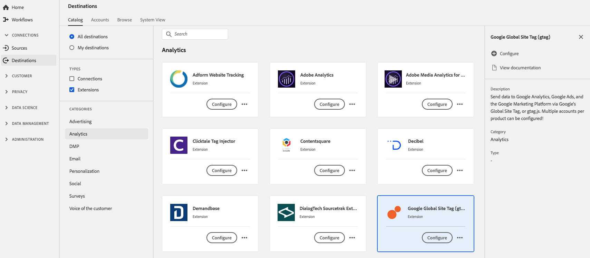

# [!DNL Google Global Site Tag]-tillägg {#gtag-analytics-extension}

## Översikt {#overview}

Skicka data till [!DNL Google Analytics], [!DNL Google Ads] och [!DNL Google Marketing Platform] via [!DNL Google's Global Site Tag] eller gtag.js. Flera konton per produkt kan konfigureras.

[!DNL Google Global Site Tag] är ett analystillägg i Adobe Experience Platform. Mer information om tilläggsfunktionerna finns på tilläggssidan på [Adobe Exchange](https://exchange.adobe.com/experiencecloud.details.101437.google-global-site-tag-gtag.html).

Det här målet är ett taggtillägg. Mer information om hur taggtillägg fungerar i Platform finns i [Översikt över taggtillägg](../launch-extensions/overview.md).

## Förhandskrav {#prerequisites}

Det här tillägget är tillgängligt i katalogen [!DNL Destinations] för alla kunder som har köpt Platform.

Om du vill använda det här tillägget måste du ha tillgång till taggar i Adobe Experience Platform. Adobe Experience Cloud-kunder får taggar som en inkluderad funktion som ger mervärde. Kontakta din organisations administratör för att få åtkomst till taggar och be dem att ge dig behörigheten **[!UICONTROL manage_properties]** så att du kan installera tillägg.

## Installera tillägg {#install-extension}

Så här installerar du tillägget [!DNL Google Global Site Tag]:

Gå till **[!UICONTROL Destinations]** > **[!UICONTROL Catalog]** i [Plattformsgränssnittet](https://platform.adobe.com/).

Välj tillägget i katalogen eller använd sökfältet.

Klicka på målet för att markera det och välj sedan **[!UICONTROL Configure]** i den högra listen. Om kontrollen **[!UICONTROL Configure]** är nedtonad saknar du behörigheten **[!UICONTROL manage_properties]**. Se [Krav](#prerequisites).

Välj den egenskap i vilken du vill installera tillägget. Du kan också skapa en ny egenskap. En egenskap är en samling regler, dataelement, konfigurerade tillägg, miljöer och bibliotek. Lär dig mer om egenskaper i avsnittet [Egenskaper](../../../tags/ui/administration/companies-and-properties.md#properties-page) i taggdokumentationen.

Arbetsflödet vägleder dig genom de olika stegen för att slutföra installationen.

Mer information om alternativen för tilläggskonfigurationen finns på sidan [Adobe Exchange](https://exchange.adobe.com/experiencecloud.details.101437.google-global-site-tag-gtag.html) för tillägget.

Du kan också installera tillägget direkt i [användargränssnittet för datainsamling](https://experience.adobe.com/#/data-collection/). Mer information finns i avsnittet om att [lägga till ett nytt tillägg](../../../tags/ui/managing-resources/extensions/overview.md#add-a-new-extension) i taggdokumentationen.

## Så här använder du tillägget {#how-to-use}

När du har installerat tillägget kan du börja konfigurera regler.

Du kan konfigurera regler för de installerade tilläggen så att händelsedata skickas till tilläggets mål endast i vissa situationer. Mer information om hur du konfigurerar regler för dina tillägg finns i [taggdokumentationen](../../../tags/ui/managing-resources/rules.md).

## Konfigurera, uppgradera och ta bort tillägg {#configure-upgrade-delete}

Du kan konfigurera, uppgradera och ta bort tillägg i användargränssnittet för datainsamling.

>[!TIP]
>
>Om tillägget redan är installerat på en av dina egenskaper visas fortfarande **[!UICONTROL Install]** som plattformsgränssnitt för tillägget. Stäng av installationsarbetsflödet enligt beskrivningen i [Installera tillägg](#install-extension) för att konfigurera eller ta bort tillägget.

Information om hur du uppgraderar ditt tillägg finns i handboken om uppgraderingsprocessen för [tillägget](../../../tags/ui/managing-resources/extensions/extension-upgrade.md) i taggdokumentationen.
