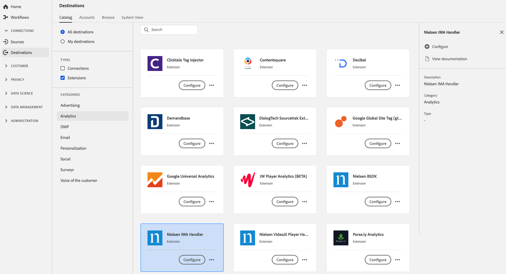

# [!DNL Nielsen IMA Handler] extension {#nielsen-ima-extension}

## Översikt {#overview}

[!DNL Nielsen IMA Handler] är ett analystillägg i Adobe Experience Platform.

Målet är ett taggtillägg. Mer information om hur taggtillägg fungerar i Platform finns i [taggtillägg - översikt](../launch-extensions/overview.md).

## Förutsättningar {#prerequisites}

Det här tillägget är tillgängligt i [!DNL Destinations] för alla kunder som har köpt Platform.

Om du vill använda det här tillägget måste du ha tillgång till taggar i Adobe Experience Platform. Adobe Experience Cloud-kunder får taggar som en inkluderad funktion som ger mervärde. Kontakta din organisations administratör för att få åtkomst till taggar och be dem att ge dig **[!UICONTROL manage_properties]** behörighet så att du kan installera tillägg.

## Installera tillägg {#install-extension}

Så här installerar du [!DNL Nielsen IMA Handler] tillägg:

I [Plattformsgränssnitt](https://platform.adobe.com/), gå till **[!UICONTROL Destinations]** > **[!UICONTROL Catalog]**.

Välj tillägget i katalogen eller använd sökfältet.

Klicka på målet för att markera det och välj sedan **[!UICONTROL Configure]** i rätt spår. Om **[!UICONTROL Configure]** kontrollen är nedtonad, du saknar **[!UICONTROL manage_properties]** behörighet. Se [Förutsättningar](#prerequisites).

Välj den egenskap i vilken du vill installera tillägget. Du kan också skapa en ny egenskap. En egenskap är en samling regler, dataelement, konfigurerade tillägg, miljöer och bibliotek. Läs om egenskaperna i [Avsnittet Egenskaper](../../../tags/ui/administration/companies-and-properties.md#properties-page) i taggdokumentationen.

Arbetsflödet vägleder dig genom stegen för att slutföra installationen.

Du kan även installera tillägget direkt i [Användargränssnitt för datainsamling](https://experience.adobe.com/#/data-collection/). Mer information finns i avsnittet om [lägga till ett nytt tillägg](../../../tags/ui/managing-resources/extensions/overview.md#add-a-new-extension) i taggdokumentationen.

## Så här använder du tillägget {#how-to-use}

När du har installerat tillägget kan du börja konfigurera regler.

Du kan konfigurera regler för de installerade tilläggen så att händelsedata skickas till tilläggets mål endast i vissa situationer. Mer information om hur du ställer in regler för tillägg finns i [taggdokumentation](../../../tags/ui/managing-resources/rules.md).

## Konfigurera, uppgradera och ta bort tillägg {#configure-upgrade-delete}

Du kan konfigurera, uppgradera och ta bort tillägg i användargränssnittet för datainsamling.

>[!TIP]
>
>Om tillägget redan är installerat på en av dina egenskaper visas fortfarande plattformsgränssnittet **[!UICONTROL Install]** för tillägget. Starta installationsarbetsflödet enligt beskrivningen i [Installera tillägg](#install-extension) för att konfigurera eller ta bort tillägget.

Om du vill uppgradera tillägget läser du i guiden på sidan [uppgraderingsprocess för tillägg](../../../tags/ui/managing-resources/extensions/extension-upgrade.md) i taggdokumentationen.
