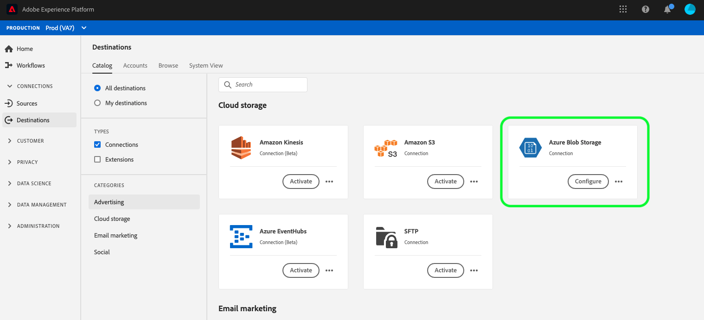

# [!DNL Azure Blob] anslutning

[!DNL Azure Blob] (nedan kallat &quot;[!DNL Blob]&quot;) är Microsofts objektlagringslösning för molnet. I den här självstudien beskrivs stegen för hur du skapar ett [!DNL Blob]-mål med användargränssnittet i [!DNL Platform].

## Komma igång

Den här självstudiekursen kräver en fungerande förståelse av följande komponenter i Adobe Experience Platform:

- [[!DNL Experience Data Model (XDM)] System](../../../xdm/home.md): Det standardiserade ramverk som Experience Platform använder för att ordna kundupplevelsedata.
   - [Grundläggande om schemakomposition](../../../xdm/schema/composition.md): Lär dig mer om de grundläggande byggstenarna i XDM-scheman, inklusive viktiga principer och bästa praxis när det gäller schemakomposition.
   - [Schemaredigeraren, genomgång](../../../xdm/tutorials/create-schema-ui.md): Lär dig hur du skapar anpassade scheman med hjälp av gränssnittet för Schemaredigeraren.
- [[!DNL Real-time Customer Profile]](../../../profile/home.md): Ger en enhetlig konsumentprofil i realtid baserad på aggregerade data från flera källor.

Om du redan har ett giltigt Blob-mål kan du hoppa över resten av det här dokumentet och gå vidare till självstudiekursen om [aktivering av segment till ditt mål](../../ui/activate-destinations.md).

### Filformat som stöds

[!DNL Experience Platform] stöder följande filformat som ska exporteras till  [!DNL Blob]:

- Avgränsaravgränsade värden (DSV): Stödet för DSV-formaterade datafiler är för närvarande begränsat till kommaavgränsade värden. Stöd för allmänna DSV-filer kommer att ges i framtiden. Mer information om vilka filer som stöds finns i molnlagringsavsnittet i självstudiekursen om att [aktivera mål](../../ui/activate-destinations.md#esp-and-cloud-storage)

## Anslut ditt Blob-konto {#connect-destination}

Logga in på [Adobe Experience Platform](https://platform.adobe.com) och välj **[!UICONTROL Destinations]** i det vänstra navigeringsfältet för att komma åt arbetsytan **[!UICONTROL Destinations]**. Skärmen **[!UICONTROL Catalog]** visar en rad olika mål som du kan skapa ett konto för.

Du kan välja lämplig kategori i katalogen till vänster på skärmen. Du kan också söka efter det mål som du vill arbeta med med med hjälp av sökalternativet.

Under kategorin **[!UICONTROL Cloud Storage]** väljer du **[!UICONTROL Azure Blob Storage]** följt av **[!UICONTROL Activate]**.

Sidan **[!UICONTROL Connect to Azure Blob Storage]** visas. På den här sidan kan du antingen använda nya autentiseringsuppgifter eller befintliga.

### Nytt konto {#new-account}

Om du använder nya autentiseringsuppgifter väljer du **[!UICONTROL New account]**. Ange anslutningssträngen i det indataformulär som visas. Anslutningssträngen som krävs för att komma åt data i blobblagringen. Anslutningssträngsmönstret [!DNL Blob] börjar med: `DefaultEndpointsProtocol=https;AccountName={ACCOUNT_NAME};AccountKey={ACCOUNT_KEY}`.

Du kan också bifoga den RSA-formaterade offentliga nyckeln för att lägga till kryptering till de exporterade filerna. Observera att den här offentliga nyckeln **måste** skrivas som en Base64-kodad sträng.

### Befintligt konto

Om du vill ansluta ett befintligt konto väljer du det [!DNL Blob]-konto du vill ansluta till och fortsätter sedan med **Nästa**.

## Autentisering {#authentication}

Sidan **Autentisering** visas. Ange ett namn, en valfri beskrivning, mappsökvägen och behållaren för filerna i det indataformulär som visas. När du är klar väljer du **[!UICONTROL Create destination]**.

## Nästa steg {#activate-segments}

Genom att följa den här självstudiekursen har du upprättat en anslutning till ditt [!DNL Blob]-konto. Du kan nu fortsätta till nästa självstudiekurs och [aktivera segment till ditt mål](../../ui/activate-destinations.md).
