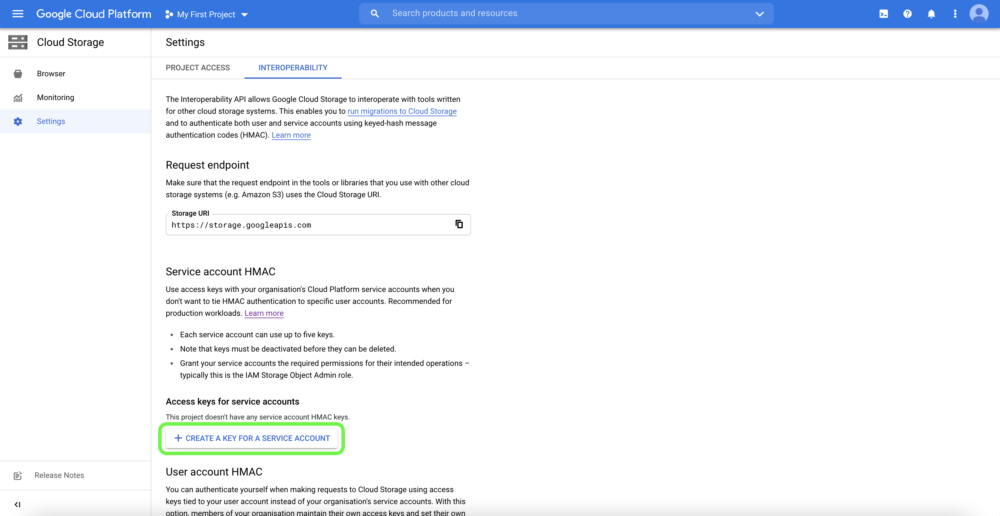

# [!DNL Google Cloud Storage]-anslutning

## Översikt {#overview}

Skapa en utgående liveanslutning till [!DNL Google Cloud Storage] för att regelbundet exportera datafiler från Adobe Experience Platform till dina egna bucket.

## Anslut till ditt [!DNL Google Cloud Storage]-lagringsutrymme via API eller användargränssnittet {#connect-api-or-ui}

* Läs avsnitten [Anslut till målet](#connect) och [Aktivera målgrupper till det här målet](#activate) nedan om du vill ansluta till lagringsplatsen [!DNL Google Cloud Storage] med hjälp av användargränssnittet för plattformen.
* Om du vill ansluta till din [!DNL Google Cloud Storage]-lagringsplats programmatiskt läser du [Aktivera målgrupper till filbaserade mål med hjälp av API-självstudiekursen för Flow-tjänsten](../../api/activate-segments-file-based-destinations.md).

## Målgrupper {#supported-audiences}

I det här avsnittet beskrivs vilka typer av målgrupper du kan exportera till det här målet.

| Målgruppsursprung | Stöds | Beskrivning |
|---------|----------|----------|
| [!DNL Segmentation Service] | ✓ | Publiker som genererats via Experience Platform [segmenteringstjänsten](../../../segmentation/home.md). |
| Anpassade överföringar | ✓ | Publikerna [importerade](../../../segmentation/ui/audience-portal.md#import-audience) till Experience Platform från CSV-filer. |

{style="table-layout:auto"}

## Exportera typ och frekvens {#export-type-frequency}

Se tabellen nedan för information om exporttyp och frekvens för destinationen.

| Objekt | Typ | Anteckningar |
---------|----------|---------|
| Exporttyp | **[!UICONTROL Profile-based]** | Du exporterar alla medlemmar i ett segment, tillsammans med tillämpliga schemafält, som de har valts på skärmen Välj profilattribut i [målaktiveringsarbetsflödet](/help/destinations/ui/activate-batch-profile-destinations.md#select-attributes). |
| Exportfrekvens | **[!UICONTROL Batch]** | Batchdestinationer exporterar filer till efterföljande plattformar i steg om tre, sex, åtta, tolv eller tjugofyra timmar. Läs mer om [gruppfilsbaserade mål](/help/destinations/destination-types.md#file-based). |

{style="table-layout:auto"}

## Exportera datauppsättningar {#export-datasets}

Detta mål stöder datauppsättningsexporter. Fullständig information om hur du ställer in datauppsättningsexporter finns i självstudiekurserna:

* Så här [exporterar du datauppsättningar med användargränssnittet för plattformen](/help/destinations/ui/export-datasets.md).
* Så här [exporterar du datauppsättningar programmatiskt med API:t för Flow Service ](/help/destinations/api/export-datasets.md).

## Filformat för exporterade data {#file-format}

När du exporterar *målgruppsdata* skapar Platform en `.csv` -, `parquet` - eller `.json` -fil på den angivna lagringsplatsen. Mer information om filerna finns i avsnittet [Filformat som stöds för export](../../ui/activate-batch-profile-destinations.md#supported-file-formats-export) i självstudiekursen om målgruppsaktivering.

När du exporterar *datauppsättningar* skapar Platform en `.parquet` - eller `.json` -fil på den lagringsplats som du angav. Mer information om filerna finns i avsnittet [Verifiera lyckad datauppsättningsexport](../../ui/export-datasets.md#verify) i självstudiekursen om exportdatamängder.

## Förutsättningar för att ansluta ditt [!DNL Google Cloud Storage]-konto {#prerequisites}

Om du vill ansluta plattformen till [!DNL Google Cloud Storage] måste du först aktivera interoperabilitet för ditt [!DNL Google Cloud Storage]-konto. Om du vill komma åt interoperabilitetsinställningen öppnar du [!DNL Google Cloud Platform] och väljer **[!UICONTROL Settings]** i alternativet **[!UICONTROL Cloud Storage]** på navigeringspanelen.

Sidan **[!UICONTROL Settings]** visas. Här kan du se information om ditt projekt-ID för [!DNL Google] och information om ditt [!DNL Google Cloud Storage]-konto. Välj **[!UICONTROL Interoperability]** i det övre huvudet om du vill komma åt interoperabilitetsinställningarna.

Sidan **[!UICONTROL Interoperability]** innehåller information om autentisering, åtkomstnycklar och standardprojektet som är kopplat till ditt tjänstkonto. Välj **[!UICONTROL Create a Key for a Service Account]** om du vill generera ett nytt åtkomstnyckel-ID och en hemlig åtkomstnyckel för ditt tjänstkonto.

Du kan använda ditt nyligen genererade åtkomstnyckel-ID och den hemliga åtkomstnyckeln för att ansluta ditt [!DNL Google Cloud Storage]-konto till plattformen.

## Anslut till målet {#connect}

>[!IMPORTANT]
> 
>Om du vill ansluta till målet behöver du behörigheterna **[!UICONTROL View Destinations]** och **[!UICONTROL Manage Destinations]** [åtkomstkontroll](/help/access-control/home.md#permissions). Läs [åtkomstkontrollsöversikten](/help/access-control/ui/overview.md) eller kontakta produktadministratören för att få den behörighet som krävs.

Om du vill ansluta till det här målet följer du stegen som beskrivs i självstudiekursen [för destinationskonfiguration](/help/destinations/ui/connect-destination.md). I arbetsflödet för målkonfiguration fyller du i fälten som listas i de två avsnitten nedan.

### Autentisera till mål {#authenticate}

Fyll i de obligatoriska fälten och välj **[!UICONTROL Connect to destination]** om du vill autentisera mot målet.

* **[!UICONTROL Access key ID]**: En alfanumerisk sträng på 61 tecken som används för att autentisera ditt [!DNL Google Cloud Storage]-konto för plattformen. Mer information om hur du hämtar det här värdet finns i avsnittet [Krav](#prerequisites) ovan.
* **[!UICONTROL Secret access key]**: En 40-siffrig base64-kodad sträng som används för att autentisera ditt [!DNL Google Cloud Storage]-konto för plattformen. Mer information om hur du hämtar det här värdet finns i avsnittet [Krav](#prerequisites) ovan.
* **[!UICONTROL Encryption key]**: Om du vill kan du bifoga den RSA-formaterade offentliga nyckeln för att lägga till kryptering i de exporterade filerna. Visa ett exempel på en korrekt formaterad krypteringsnyckel i bilden nedan.

  

Mer information om dessa värden finns i handboken [Google Cloud Storage HMAC keys](https://cloud.google.com/storage/docs/authentication/hmackeys#overview). Anvisningar om hur du skapar ditt eget ID för åtkomstnyckel och hemlig åtkomstnyckel finns i [[!DNL Google Cloud Storage] källöversikten](/help/sources/connectors/cloud-storage/google-cloud-storage.md).

### Fyll i målinformation {#destination-details}

Om du vill konfigurera information för målet fyller du i de obligatoriska och valfria fälten nedan. En asterisk bredvid ett fält i användargränssnittet anger att fältet är obligatoriskt.

* **[!UICONTROL Name]**: Fyll i det önskade namnet för det här målet.
* **[!UICONTROL Description]**: Valfritt. Du kan till exempel ange vilken kampanj du använder det här målet för.
* **[!UICONTROL Bucket name]**: Ange namnet på den [!DNL Google Cloud Storage]-bucket som ska användas för det här målet.
* **[!UICONTROL Folder path]**: Ange sökvägen till målmappen som ska vara värd för de exporterade filerna.
* **[!UICONTROL File type]**: Välj det format som Experience Platform ska använda för de exporterade filerna. När du väljer alternativet [!UICONTROL CSV] kan du även [konfigurera filformateringsalternativen](../../ui/batch-destinations-file-formatting-options.md).
* **[!UICONTROL Compression format]**: Välj den komprimeringstyp som Experience Platform ska använda för de exporterade filerna.
* **[!UICONTROL Include manifest file]**: Aktivera det här alternativet om du vill att exporten ska innehålla en manifestfil för JSON som innehåller information om exportplats, exportstorlek och mycket annat. Manifestet har fått ett namn i formatet `manifest-<<destinationId>>-<<dataflowRunId>>.json`. Visa en [exempelmanifestfil](/help/destinations/assets/common/manifest-d0420d72-756c-4159-9e7f-7d3e2f8b501e-0ac8f3c0-29bd-40aa-82c1-f1b7e0657b19.json). Manifestfilen innehåller följande fält:
   * `flowRunId`: [Dataflödet kör](/help/dataflows/ui/monitor-destinations.md#dataflow-runs-for-batch-destinations) som genererade den exporterade filen.
   * `scheduledTime`: Tiden i UTC när filen exporterades.
   * `exportResults.sinkPath`: Sökvägen till lagringsplatsen där den exporterade filen placeras.
   * `exportResults.name`: Namnet på den exporterade filen.
   * `size`: Den exporterade filens storlek i byte.

### Aktivera aviseringar {#enable-alerts}

Du kan aktivera varningar för att få meddelanden om dataflödets status till ditt mål. Välj en avisering i listan om du vill prenumerera och få meddelanden om statusen för ditt dataflöde. Mer information om varningar finns i guiden [prenumerera på destinationsvarningar med användargränssnittet](../../ui/alerts.md).

Välj **[!UICONTROL Next]** när du är klar med att ange information för målanslutningen.

### [!DNL Google Cloud Storage] behörigheter som krävs {#required-google-cloud-storage-permission}

Om du vill ansluta och exportera data till din [!DNL Google Cloud Storage]-lagringsplats behöver du följande [!DNL Google Cloud Storage]-behörigheter för dina bucket:

* `orgpolicy.policy.get`
* `resourcemanager.projects.get`
* `resourcemanager.projects.list`
* `storage.managedFolders.create`
* `storage.multipartUploads.abort`
* `storage.multipartUploads.create`
* `storage.multipartUploads.listParts`
* `storage.objects.create`
* `storage.objects.list`

Läs mer om [åtkomstkontroll och behörigheter](https://cloud.google.com/storage/docs/access-control/iam-permissions) i [!DNL Google Cloud Storage].

## Aktivera målgrupper till det här målet {#activate}

>[!IMPORTANT]
> 
>* För att aktivera data behöver du behörigheterna **[!UICONTROL View Destinations]**, **[!UICONTROL Activate Destinations]**, **[!UICONTROL View Profiles]** och **[!UICONTROL View Segments]** [åtkomstkontroll](/help/access-control/home.md#permissions). Läs [åtkomstkontrollsöversikten](/help/access-control/ui/overview.md) eller kontakta produktadministratören för att få den behörighet som krävs.
>* Om du vill exportera *identiteter* måste du ha **[!UICONTROL View Identity Graph]** [åtkomstkontrollbehörighet](/help/access-control/home.md#permissions).   {width="100" zoomable="yes"}

Se [Aktivera målgruppsdata för att batchprofilera exportmål](../../ui/activate-batch-profile-destinations.md) för instruktioner om hur du aktiverar målgrupper till det här målet.

### Schemaläggning

I steget **[!UICONTROL Scheduling]** kan du [ställa in exportschemat](/help/destinations/ui/activate-batch-profile-destinations.md#scheduling) för ditt [!DNL Google Cloud Storage]-mål och du kan även [konfigurera namnet på dina exporterade filer](/help/destinations/ui/activate-batch-profile-destinations.md#file-names).

### Mappa attribut och identiteter {#map}

I steget **[!UICONTROL Mapping]** kan du välja vilka attribut- och identitetsfält som ska exporteras för dina profiler. Du kan också välja att ändra rubrikerna i den exporterade filen till ett valfritt användarvänligt namn. Mer information finns i [mappningssteget](/help/destinations/ui/activate-batch-profile-destinations.md#mapping) i självstudiekursen om aktivering av gruppmål.

## Validera slutförd dataexport {#exported-data}

Kontrollera [!DNL Google Cloud Storage]-pytsen och se till att de exporterade filerna innehåller de förväntade profilpopulationerna för att kontrollera om data har exporterats utan fel.

## IP-adress tillåtelselista {#ip-address-allow-list}

Läs artikeln [IP-adressen tillåtelselista ](ip-address-allow-list.md) om du behöver lägga till IP-adresser i Adobe i en tillåtelselista.