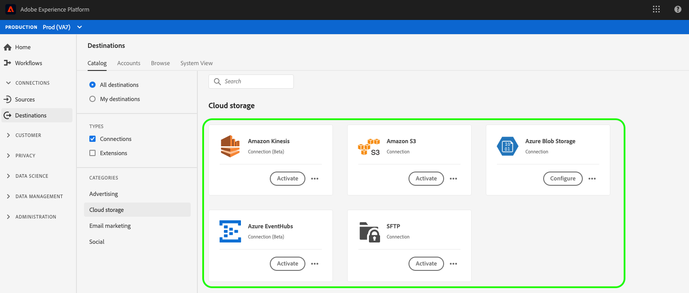

# Översikt över mål för molnlagring {#cloud-storage-destinations}

Adobe Experience Platform kan leverera dina segment som datafiler till dina molnlagringsplatser. Detta gör att du kan skicka målgrupper och deras profilattribut till dina interna system via CSV eller tabbavgränsade filer för [!DNL Amazon S3], [!DNL Azure Blob] och SFTP. För [!DNL Amazon Kinesis]- och [!DNL Azure Event Hubs]-mål direktuppspelas data från Experience Platform i JSON-format.

Mer information om hur du ansluter till molnlagringsmål finns i [Arbetsflöde för att skapa molnlagringsmål](./workflow.md).

## Dataexporttyp

**Profilbaserad export**  - du exporterar information om individerna i målgruppen. Den här informationen behövs för personalisering och kan innehålla attribut, händelser, segmentmedlemskap med mera.

## Tillgängliga molnlagringsdestinationer

- [Amazon S3-anslutning](./amazon-s3.md)
- [Azure Blob-anslutning](./azure-blob.md)
- [SFTP-anslutning](./sftp.md)

## Tillgängliga direktuppspelningsmål för molnlagring

- [Amazon Kinesis-anslutning](./amazon-kinesis.md)
- [Azure Event Hubs-anslutning](./azure-event-hubs.md)