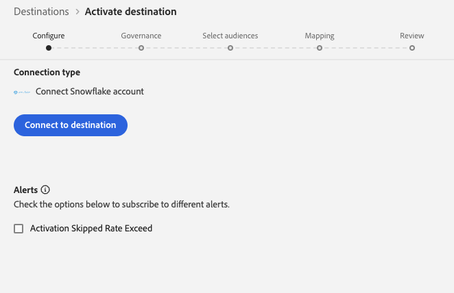

# Snowflake {#snowflake-destination}

>[!IMPORTANT]
>
>Den här destinationsanslutningen är i betaversion och endast tillgänglig för vissa kunder. Kontakta din Adobe-representant om du vill få åtkomst.

## Översikt {#overview}

Använd Snowflake målanslutning för att exportera data till en Adobe Snowflake-instans, som Adobe sedan delar med din instans via [privata listor](https://other-docs.snowflake.com/en/collaboration/collaboration-listings-about).

I följande avsnitt beskrivs hur Snowflake mål fungerar och hur data överförs mellan Adobe och Snowflake.

### Hur Snowflake datautbyte fungerar {#data-sharing}

Det här målet använder en [!DNL Snowflake]-dataresurs, vilket innebär att inga data exporteras fysiskt eller överförs till din egen Snowflake-instans. I stället ger Adobe skrivskyddad åtkomst till en livetabell som finns i Adobe Snowflake-miljö. Du kan fråga den här delade tabellen direkt från ditt Snowflake-konto, men du äger inte tabellen och kan inte ändra eller behålla den efter den angivna kvarhållningsperioden. Adobe hanterar den delade tabellens livscykel och struktur.

Första gången du delar data från en Adobe Snowflake-instans till din blir du ombedd att godkänna den privata listan från Adobe.

### Datalagring och TTL (Time-to-Live) {#ttl}

Alla data som delas genom den här integreringen har en fast TTL-värde på sju dagar. Sju dagar efter den sista exporten förfaller den delade tabellen automatiskt och blir oåtkomlig, oavsett om dataflödet fortfarande är aktivt eller inte. Om du vill behålla data längre än sju dagar måste du kopiera innehållet till en tabell som du äger i din egen Snowflake-instans innan TTL-värdet går ut.

### Funktion för målgruppsuppdatering {#audience-update-behavior}

Om målgruppen utvärderas i [gruppläge](../../../segmentation/methods/batch-segmentation.md) uppdateras data i den delade tabellen var 24:e timme. Detta innebär att det kan bli en fördröjning på upp till 24 timmar mellan ändringar i målgruppsmedlemskap och när dessa ändringar återspeglas i den delade tabellen.

### Inkrementell exportlogik {#incremental-export}

När ett dataflöde körs för en målgrupp för första gången utförs en bakåtfyllnad och alla aktuella kvalificerade profiler delas. Efter den här initiala bakåtfyllnaden återspeglas endast inkrementella uppdateringar i den delade tabellen. Detta innebär profiler som läggs till eller tas bort från målgruppen. Det här sättet garanterar effektiva uppdateringar och håller den delade tabellen uppdaterad.

## Förhandskrav {#prerequisites}

Innan du konfigurerar din Snowflake-anslutning måste du kontrollera att följande krav uppfylls:

* Du har åtkomst till ett [!DNL Snowflake]-konto.
* Ditt Snowflake-konto prenumererar på privata listor. Du eller någon på ditt företag som har kontoadministratörsbehörighet för Snowflake kan konfigurera detta.

## Målgrupper {#supported-audiences}

I det här avsnittet beskrivs vilka typer av målgrupper du kan exportera till det här målet. De två tabellerna nedan visar vilka målgrupper som den här kopplingen stöder, per _målgruppsursprung_ och _profiltyper som ingår i målgruppen_:

| Målgruppsursprung | Stöds | Beskrivning |
|---------|----------|----------|
| [!DNL Segmentation Service] | ✓ | Publiker som genererats via Experience Platform [segmenteringstjänst](../../../segmentation/home.md). |
| Alla andra målgrupper kommer | ✓ | Den här kategorin omfattar alla målgrupper som kommer utanför målgrupper som genereras via [!DNL Segmentation Service]. Läs om de [olika målgruppernas ursprung](/help/segmentation/ui/audience-portal.md#customize). Några exempel är: <ul><li> anpassade uppladdningsgrupper [importerade](../../../segmentation/ui/audience-portal.md#import-audience) till Experience Platform från CSV-filer,</li><li> lookalike-målgrupper, </li><li> federerade målgrupper, </li><li> målgrupper som genererats i andra Experience Platform-appar som Adobe Journey Optimizer, </li><li> med mera. </li></ul> |

{style="table-layout:auto"}

## Exportera typ och frekvens {#export-type-frequency}

Se tabellen nedan för information om exporttyp och frekvens för destinationen.

| Objekt | Typ | Anteckningar |
---------|----------|---------|
| Exporttyp | **[!UICONTROL Audience export]** | Du exporterar alla medlemmar i en målgrupp med identifierarna (namn, telefonnummer eller andra) som används i målet [!DNL Snowflake]. |
| Exportfrekvens | **[!UICONTROL Streaming]** | Direktuppspelningsmål är alltid på API-baserade anslutningar. Så snart en profil uppdateras i Experience Platform baserat på målgruppsutvärdering skickar anslutningsprogrammet uppdateringen nedströms till målplattformen. Läs mer om [direktuppspelningsmål](/help/destinations/destination-types.md#streaming-destinations). |

{style="table-layout:auto"}

## Anslut till målet {#connect}

>[!IMPORTANT]
> 
>Om du vill ansluta till målet behöver du behörigheterna **[!UICONTROL View Destinations]** och **[!UICONTROL Manage Destinations]** [åtkomstkontroll](/help/access-control/home.md#permissions). Läs [åtkomstkontrollsöversikten](/help/access-control/ui/overview.md) eller kontakta produktadministratören för att få den behörighet som krävs.

Om du vill ansluta till det här målet följer du stegen som beskrivs i självstudiekursen [för destinationskonfiguration](../../ui/connect-destination.md). I arbetsflödet för att konfigurera mål fyller du i fälten som listas i de två avsnitten nedan.

### Autentisera till mål {#authenticate}

Om du vill autentisera till målet väljer du **[!UICONTROL Connect to destination]**.

### Fyll i målinformation {#destination-details}

>[!CONTEXTUALHELP]
>id="platform_destinations_snowflake_accountID"
>title="Ange ditt konto-ID för Snowflake"
>abstract="Om ditt konto är länkat till en organisation använder du det här formatet: `OrganizationName.AccountName`   Om ditt konto inte är länkat till en organisation använder du det här formatet:`AccountName`"

Om du vill konfigurera information för målet fyller du i de obligatoriska och valfria fälten nedan. En asterisk bredvid ett fält i användargränssnittet anger att fältet är obligatoriskt.

* **[!UICONTROL Name]**: Ett namn som du känner igen det här målet med i framtiden.
* **[!UICONTROL Description]**: En beskrivning som hjälper dig att identifiera det här målet i framtiden.
* **[!UICONTROL Snowflake Account ID]**: Ditt Snowflake-konto-ID. Använd följande konto-ID-format beroende på om ditt konto är länkat till en organisation:
   * Om ditt konto är länkat till en organisation:`OrganizationName.AccountName`.
   * Om ditt konto inte är länkat till en organisation:`AccountName`.
* **[!UICONTROL Account acknowledgment]**: Växla på bekräftelsen för ditt konto-ID på Snowflake för att bekräfta att ditt konto-ID är korrekt och tillhör dig.

>[!IMPORTANT]
>
> Specialtecken som används i målnamnet och Experience Platform-sandlådans namn konverteras automatiskt till understreck (`_`) i Snowflake. Undvik förvirring genom att inte använda några specialtecken i mål- och sandlådans namn.

### Aktivera aviseringar {#enable-alerts}

Du kan aktivera varningar för att få meddelanden om dataflödets status till ditt mål. Välj en avisering i listan om du vill prenumerera och få meddelanden om statusen för ditt dataflöde. Mer information om varningar finns i guiden [prenumerera på destinationsvarningar med användargränssnittet](../../ui/alerts.md).

Välj **[!UICONTROL Next]** när du är klar med att ange information för målanslutningen.

## Aktivera målgrupper till det här målet {#activate}

>[!IMPORTANT]
> 
>* För att aktivera data behöver du behörigheterna **[!UICONTROL View Destinations]**, **[!UICONTROL Activate Destinations]**, **[!UICONTROL View Profiles]** och **[!UICONTROL View Segments]** [åtkomstkontroll](/help/access-control/home.md#permissions). Läs [åtkomstkontrollsöversikten](/help/access-control/ui/overview.md) eller kontakta produktadministratören för att få den behörighet som krävs.
>* Om du vill exportera *identiteter* måste du ha **[!UICONTROL View Identity Graph]** [åtkomstkontrollbehörighet](/help/access-control/home.md#permissions).   {width="100" zoomable="yes"}

Läs [Aktivera profiler och målgrupper för att direktuppspela målgruppsexportdestinationer](/help/destinations/ui/activate-segment-streaming-destinations.md) för instruktioner om hur du aktiverar målgrupper till det här målet.

### Mappningsattribut {#map}

Snowflake-målet stöder mappning av profilattribut till anpassade attribut.

Målattributen skapas automatiskt i Snowflake med det attributnamn som du anger i fältet **[!UICONTROL Attribute name]**.

## Exporterade data/Validera dataexport {#exported-data}

Kontrollera ditt Snowflake-konto för att bekräfta att data exporterades korrekt.

## Dataanvändning och styrning {#data-usage-governance}

Alla [!DNL Adobe Experience Platform]-mål är kompatibla med dataanvändningsprinciper när data hanteras. Mer information om hur [!DNL Adobe Experience Platform] använder datastyrning finns i [Översikt över datastyrning](/help/data-governance/home.md).
