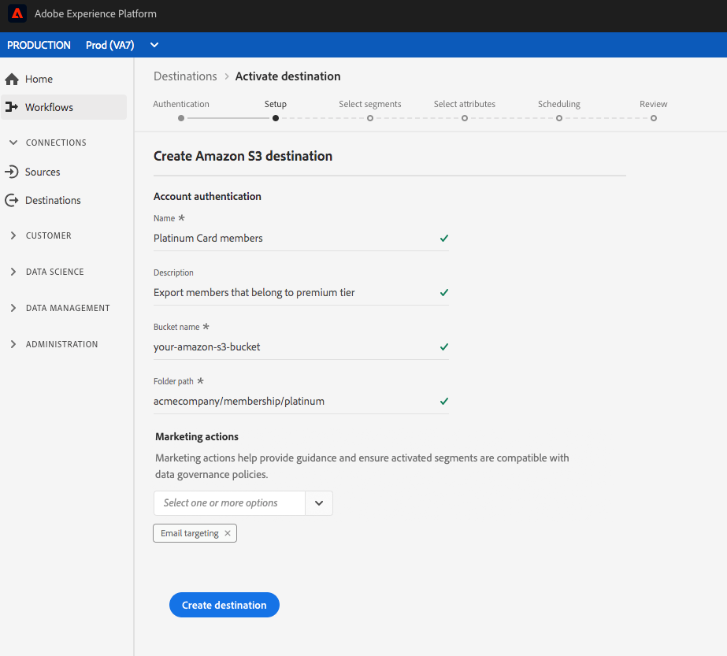

# Skapa ett molnlagringsmål

På den här sidan beskrivs hur du kan ansluta till molnlagringsplatser i Adobe Experience Platform.

Välj önskat molnlagringsmål i **[!UICONTROL Connections]** > **[!UICONTROL Destinations]** och välj sedan **[!UICONTROL Configure]**.

>[!NOTE]
>
>Om det redan finns en anslutning till det här målet kan du se en **[!UICONTROL Activate]**-knapp på målkortet. Mer information om skillnaden mellan **[!UICONTROL Activate]** och **[!UICONTROL Configure]** finns i avsnittet [Katalog](../../ui/destinations-workspace.md#catalog) i dokumentationen för målarbetsytan.

Om du tidigare har konfigurerat en anslutning till molnlagringsmålet i **[!UICONTROL Authentication]**-steget väljer du **[!UICONTROL Existing Account]** och väljer din befintliga anslutning. Du kan också välja **[!UICONTROL New Account]** för att konfigurera en ny anslutning till molnlagringsmålet. Fyll i autentiseringsuppgifterna för ditt konto och välj **[!UICONTROL Connect to destination]**. Du kan också bifoga den RSA-formaterade offentliga nyckeln för att lägga till kryptering till de exporterade filerna. Observera att den här offentliga nyckeln **måste** skrivas som en Base64-kodad sträng.

Se [Amazon S3](./amazon-s3.md)-mål, [[!DNL Amazon Kinesis]](./amazon-kinesis.md)-mål, [[!DNL Azure Event Hubs]](./azure-event-hubs.md)-mål och [SFTP](./sftp.md)-mål för mer information om autentiseringsuppgifter i steget **Autentisering**.

>[!NOTE]
>
>Plattformen stöder validering av autentiseringsuppgifter i autentiseringsprocessen och visar ett felmeddelande om du anger felaktiga autentiseringsuppgifter för din molnlagringsplats. Detta säkerställer att du inte slutför arbetsflödet med felaktiga inloggningsuppgifter.

I steget **[!UICONTROL Setup]** anger du ett **[!UICONTROL Name]** och ett **[!UICONTROL Description]** för aktiveringsflödet.

I det här steget kan du även välja alla **[!UICONTROL Marketing action]** som ska gälla för det här målet. Marknadsföringsåtgärder anger för vilken metod data ska exporteras till målet. Du kan välja bland Adobe-definierade marknadsföringsåtgärder eller skapa en egen marknadsföringsåtgärd. Mer information om marknadsföringsåtgärder finns i [Översikt över dataanvändningsprinciper](../../../data-governance/policies/overview.md).

För Amazon S3-mål anger du **[!UICONTROL Bucket name]** och **[!UICONTROL Folder path]** i molnlagringsmålet där filerna ska levereras. Välj **[!UICONTROL Create Destination]** när du har fyllt i fälten ovan.

För SFTP-mål anger du **[!UICONTROL Folder path]** där filerna ska levereras. Välj **[!UICONTROL Create Destination]** när du har fyllt i fälten ovan.

För [!DNL Amazon Kinesis]-mål anger du namnet på din befintliga dataström i ditt [!DNL Amazon Kinesis]-konto. Plattformen exporterar data till den här strömmen. Välj **[!UICONTROL Create Destination]** när du har fyllt i fälten ovan.

För [!DNL Azure Event Hubs]-mål anger du namnet på din befintliga dataström i ditt [!DNL Amazon Event Hubs]-konto. Plattformen exporterar data till den här strömmen. Välj **[!UICONTROL Create Destination]** när du har fyllt i fälten ovan.

Målet har skapats. Du kan välja **[!UICONTROL Save & Exit]** om du vill aktivera segment senare eller välja **[!UICONTROL Next]** om du vill fortsätta arbetsflödet och välja segment som ska aktiveras. I båda fallen ska du läsa nästa avsnitt, [Aktivera segment](#activate-segments), för resten av arbetsflödet för att exportera data.

## Aktivera segment {#activate-segments}

Mer information om arbetsflödet för segmentaktivering finns i [Aktivera profiler och segment till ett mål](../../ui/activate-destinations.md).