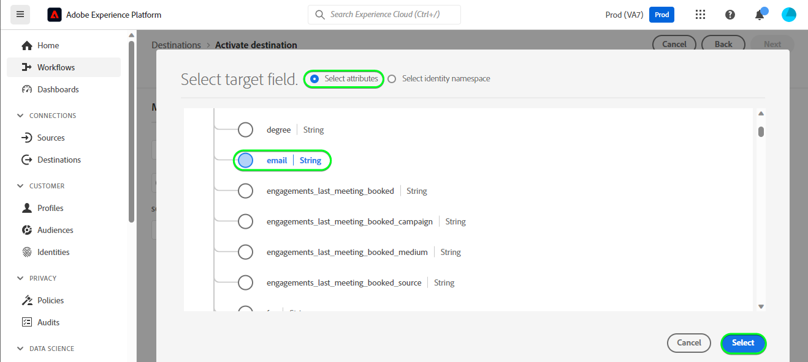

# [!DNL HubSpot] anslutning

[[!DNL HubSpot]](https://www.hubspot.com) är en CRM-plattform med all programvara, alla integreringar och resurser ni behöver för att koppla samman marknadsföring, försäljning, innehållshantering och kundservice. Ni kan koppla samman data, team och kunder på en och samma CRM-plattform.

Detta [!DNL Adobe Experience Platform] [mål](/help/destinations/home.md) utnyttjar [[!DNL HubSpot] Kontakt-API](https://developers.hubspot.com/docs/api/crm/contacts), för att uppdatera kontakter i [!DNL HubSpot] från en befintlig Experience Platform-publik efter aktiveringen.

Instruktioner för hur du autentiserar [!DNL HubSpot] -instansen är längre ned, i [Autentisera till mål](#authenticate) -avsnitt.

## Användningsfall {#use-cases}

För att du bättre ska förstå hur och när du ska använda [!DNL HubSpot] mål, här är ett exempel på användning som Adobe Experience Platform-kunder kan lösa genom att använda den här destinationen.

[!DNL HubSpot] kontakter lagrar information om de personer som interagerar med ert företag. Ditt team använder de kontakter som finns i [!DNL HubSpot] för att bygga målgrupper i Experience Platform. När dessa målgrupper har skickats till [!DNL HubSpot], uppdateras deras information och varje kontakt tilldelas en egenskap med ett värde som målgruppsnamn som anger vilken målgrupp kontakten tillhör.

## Förhandskrav {#prerequisites}

I avsnitten nedan finns information om alla krav som du måste ställa in i Experience Platform och [!DNL HubSpot] och för information som du måste samla in innan du arbetar med [!DNL HubSpot] mål.

### Förutsättningar för Experience Platform {#prerequisites-in-experience-platform}

Innan du aktiverar data för [!DNL HubSpot] mål, du måste ha [schema](/help/xdm/schema/composition.md), a [datauppsättning](https://experienceleague.adobe.com/docs/platform-learn/tutorials/data-ingestion/create-datasets-and-ingest-data.html)och [målgrupper](https://experienceleague.adobe.com/docs/platform-learn/tutorials/audiences/create-audiences.html) som [!DNL Experience Platform].

Se Experience Platform dokumentation för [Schemafältgrupp för målgruppsmedlemskapsdetaljer](/help/xdm/field-groups/profile/segmentation.md) om ni behöver vägledning om målgruppsstatus.

### Krav för [!DNL HubSpot] mål {#prerequisites-destination}

Observera följande krav för att kunna exportera data från Platform till [!DNL HubSpot] konto:

#### Du måste ha en [!DNL HubSpot] konto {#prerequisites-account}

För att kunna exportera data från Platform till [!DNL Hubspot] konto du behöver ha [!DNL HubSpot] konto. Om du inte redan har en går du till [Konfigurera ditt HubSpot-konto](https://knowledge.hubspot.com/get-started/set-up-your-account) och följ anvisningarna för att registrera och skapa ditt konto.

#### Samla [!DNL HubSpot] åtkomsttoken för privat app {#gather-credentials}

Du behöver dina [!DNL HubSpot] `Access token` för att [!DNL HubSpot] mål för att göra API-anrop via [!DNL HubSpot] privat app i din [!DNL HubSpot] konto. The `Access token` fungerar som `Bearer token` när du [autentisera målet](#authenticate).

Om du inte har någon privat app följer du dokumentationen till [Skapa en privat app i [!DNL HubSpot]](https://developers.hubspot.com/docs/api/private-apps).

>[!IMPORTANT]
>
> Det privata programmet bör tilldelas följande omfång:
> `crm.objects.contacts.write`, `crm.objects.contacts.read`
> `crm.schemas.contacts.write`, `crm.schemas.contacts.read`

| Autentiseringsuppgifter | Beskrivning | Exempel |
| --- | --- | --- |
| `Bearer token` | The `Access token` på [!DNL HubSpot] privat app.  För att få [!DNL HubSpot] `Access token` följer [!DNL HubSpot] dokumentation till [göra API-anrop med appens åtkomsttoken](https://developers.hubspot.com/docs/api/private-apps#make-api-calls-with-your-app-s-access-token). | `pat-na1-11223344-abcde-12345-9876-1234a1b23456` |

## Guardrails {#guardrails}

[!DNL HubSpot] privata appar är beroende av [Hastighetsgränser](https://developers.hubspot.com/docs/api/usage-details). Antalet samtal som din privata app kan ringa baseras på din [!DNL HubSpot] kontoprenumeration och om du har köpt API-tillägget. Se även [Andra begränsningar](https://developers.hubspot.com/docs/api/usage-details#other-limits).

## Identiteter som stöds {#supported-identities}

[!DNL HubSpot] har stöd för uppdatering av identiteter som beskrivs i tabellen nedan. Läs mer om [identiteter](/help/identity-service/features/namespaces.md).

| Målidentitet | Exempel | Beskrivning | Överväganden |
|---|---|---|---|
| `email` | `test@test.com` | Kontaktens e-postadress. | Obligatoriskt |

## Målgrupper {#supported-audiences}

I det här avsnittet beskrivs alla målgrupper som du kan exportera till det här målet.

Detta mål stöder aktivering av alla målgrupper som genererats via Experience Platform [Segmenteringstjänst](../../../segmentation/home.md).

Detta mål stöder även aktivering av målgrupperna som beskrivs i tabellen nedan.

| Målgruppstyp | Beskrivning |
|---------|----------|
| Anpassade överföringar | Målgrupper [importerad](../../../segmentation/ui/audience-portal.md#import-audience) till Experience Platform från CSV-filer. |

{style="table-layout:auto"}

## Exportera typ och frekvens {#export-type-frequency}

Se tabellen nedan för information om exporttyp och frekvens för destinationen.

| Objekt | Typ | Anteckningar |
---------|----------|---------|
| Exporttyp | **[!UICONTROL Profile-based]** | <ul><li>Du exporterar alla medlemmar i en målgrupp tillsammans med de önskade schemafälten *(t.ex. e-postadress, telefonnummer, efternamn)*, enligt fältmappningen.</li><li> Dessutom skapas en ny egenskap i [!DNL HubSpot] med målgruppsnamnet och dess värde med motsvarande målgruppsstatus från Platform, för var och en av de valda målgrupperna.</li></ul> |
| Exportfrekvens | **[!UICONTROL Streaming]** | <ul><li>Direktuppspelningsmål är alltid på API-baserade anslutningar. Så snart en profil uppdateras i Experience Platform baserat på målgruppsutvärdering skickar anslutningsprogrammet uppdateringen nedströms till målplattformen. Läs mer om [mål för direktuppspelning](/help/destinations/destination-types.md#streaming-destinations).</li></ul> |

{style="table-layout:auto"}

## Anslut till målet {#connect}

>[!IMPORTANT]
>
>Om du vill ansluta till målet behöver du **[!UICONTROL View Destinations]** och **[!UICONTROL Manage Destinations]** [behörigheter för åtkomstkontroll](/help/access-control/home.md#permissions). Läs [åtkomstkontroll - översikt](/help/access-control/ui/overview.md) eller kontakta produktadministratören för att få de behörigheter som krävs.

Om du vill ansluta till det här målet följer du stegen som beskrivs i [självstudiekurs om destinationskonfiguration](../../ui/connect-destination.md). I arbetsflödet för att konfigurera mål fyller du i fälten som listas i de två avsnitten nedan.

Inom **[!UICONTROL Destinations]** > **[!UICONTROL Catalog]** sök efter [!DNL HubSpot]. Du kan även hitta den under **[!UICONTROL CRM]** kategori.

### Autentisera till mål {#authenticate}

Fyll i de obligatoriska fälten nedan. Se [Samla [!DNL HubSpot] åtkomsttoken för privat app](#gather-credentials) för vägledning.
* **[!UICONTROL Bearer token]**: Åtkomsttoken för [!DNL HubSpot] privat app.

Om du vill autentisera mot målet väljer du **[!UICONTROL Connect to destination]**.

Om den angivna informationen är giltig visas en **[!UICONTROL Connected]** status med en grön bockmarkering. Du kan sedan gå vidare till nästa steg.

### Fyll i målinformation {#destination-details}

Om du vill konfigurera information för målet fyller du i de obligatoriska och valfria fälten nedan. En asterisk bredvid ett fält i användargränssnittet anger att fältet är obligatoriskt.

* **[!UICONTROL Name]**: Ett namn som du känner igen det här målet med i framtiden.
* **[!UICONTROL Description]**: En beskrivning som hjälper dig att identifiera det här målet i framtiden.

### Aktivera aviseringar {#enable-alerts}

Du kan aktivera varningar för att få meddelanden om dataflödets status till ditt mål. Välj en avisering i listan om du vill prenumerera och få meddelanden om statusen för ditt dataflöde. Mer information om varningar finns i guiden på [prenumerera på destinationsvarningar med användargränssnittet](../../ui/alerts.md).

När du är klar med informationen för målanslutningen väljer du **[!UICONTROL Next]**.

## Aktivera målgrupper till det här målet {#activate}

>[!IMPORTANT]
>
>För att aktivera data behöver du **[!UICONTROL View Destinations]**, **[!UICONTROL Activate Destinations]**, **[!UICONTROL View Profiles]** och **[!UICONTROL View Segments]** [behörigheter för åtkomstkontroll](/help/access-control/home.md#permissions). Läs [åtkomstkontroll - översikt](/help/access-control/ui/overview.md) eller kontakta produktadministratören för att få de behörigheter som krävs.

Läs [Aktivera profiler och målgrupper för att strömma målgruppernas exportdestinationer](/help/destinations/ui/activate-segment-streaming-destinations.md) för instruktioner om hur du aktiverar målgrupper till det här målet.

### Mappa attribut och identiteter {#map}

Så här skickar du målgruppsdata från Adobe Experience Platform till [!DNL HubSpot] mål måste du gå igenom fältmappningssteget. Mappningen består av att skapa en länk mellan XDM-schemafälten (Experience Data Model) i ditt plattformskonto och motsvarande motsvarigheter från målmålet.

Mappa XDM-fälten korrekt till [!DNL HubSpot] målfält, följ stegen nedan:

#### Mappa `Email` identity

The `Email` Identitet är en obligatorisk mappning för det här målet. Följ stegen nedan för att mappa den:
1. I **[!UICONTROL Mapping]** steg, välja **[!UICONTROL Add new mapping]**. Nu kan du se en ny mappningsrad på skärmen.
   
1. I **[!UICONTROL Select source field]** väljer du **[!UICONTROL Select identity namespace]** och välj en identitet.
   
1. I **[!UICONTROL Select target field]** väljer du **[!UICONTROL Select attributes]** och markera `email`.
   

| Source Field | Målfält | Obligatoriskt |
| --- | --- | --- |
| `IdentityMap: Email` | `Identity: email` | Ja |

Ett exempel med identitetsmappning visas nedan:

#### Mappning **valfri** attributes

Lägga till andra attribut som du vill uppdatera mellan XDM-profilschemat och [!DNL HubSpot] upprepa stegen nedan:
1. I **[!UICONTROL Mapping]** steg, välja **[!UICONTROL Add new mapping]**. Nu kan du se en ny mappningsrad på skärmen.
   
1. I **[!UICONTROL Select source field]** väljer du **[!UICONTROL Select attributes]** och välj XDM-attributet.
   
1. I **[!UICONTROL Select target field]** fönster, välja **[!UICONTROL Select attributes]** och välj i listan över attribut som automatiskt fylls i från [!DNL HubSpot] konto. Målet använder [[!DNL HubSpot] Egenskaper](https://developers.hubspot.com/docs/api/crm/properties) API för att hämta den här informationen. Båda [!DNL HubSpot] [standardegenskaper](https://knowledge.hubspot.com/contacts/hubspots-default-contact-properties) och anpassade egenskaper hämtas för markering som målfält.
   

Några tillgängliga mappningar mellan XDM-profilschemat och [!DNL Hubspot] visas nedan:

| Source Field | Målfält |
| --- | --- |
| `xdm: person.name.firstName` | `Attribute: firstname` |
| `xdm: person.name.lastName` | `Attribute: lastname` |
| `xdm: workAddress.street1` | `Attribute: address` |
| `xdm: workAddress.city` | `Attribute: city` |
| `xdm: workAddress.country` | `Attribute: country` |

Ett exempel som använder dessa attributmappningar visas nedan:

När du är klar med mappningarna för målanslutningen väljer du **[!UICONTROL Next]**.

## Validera dataexport {#exported-data}

Följ stegen nedan för att verifiera att du har konfigurerat målet korrekt:

1. Logga in på [!DNL HubSpot] webbplatsen och sedan navigera till **[!UICONTROL Contacts]** sida för att kontrollera målgruppsstatus. Den här listan kan konfigureras för att visa kolumner för anpassade egenskaper som har skapats med målgruppens namn och deras värde är målgruppsstatus.
   

1. Du kan även gå ned i en individ **[!UICONTROL Person]** och navigera till egenskaperna som visar målgruppsnamnet och målgruppsstatus.
   

## Dataanvändning och styrning {#data-usage-governance}

Alla [!DNL Adobe Experience Platform] destinationerna är kompatibla med dataanvändningsprinciper när data hanteras. Detaljerad information om hur [!DNL Adobe Experience Platform] använder datastyrning, se [Datastyrning - översikt](/help/data-governance/home.md).

## Ytterligare resurser {#additional-resources}

Ytterligare användbar information från [!DNL HubSpot] dokumentationen nedan:
* [Autentiseringsmetoder på HubSpot](https://developers.hubspot.com/docs/api/intro-to-auth)
* [!DNL HubSpot] API-referenser för [Kontakter](https://developers.hubspot.com/docs/api/crm/contacts) och [Egenskaper](https://developers.hubspot.com/docs/api/crm/properties) API.

### Changelog

I det här avsnittet beskrivs funktionaliteten och viktiga dokumentationsuppdateringar för den här målanslutningen.

+++ Visa ändringslogg

| Releasamånad | Uppdateringstyp | Beskrivning |
|---|---|---|
| September 2023 | Inledande version | Ursprunglig målversion och dokumentationspublicering. |

{style="table-layout:auto"}

+++
