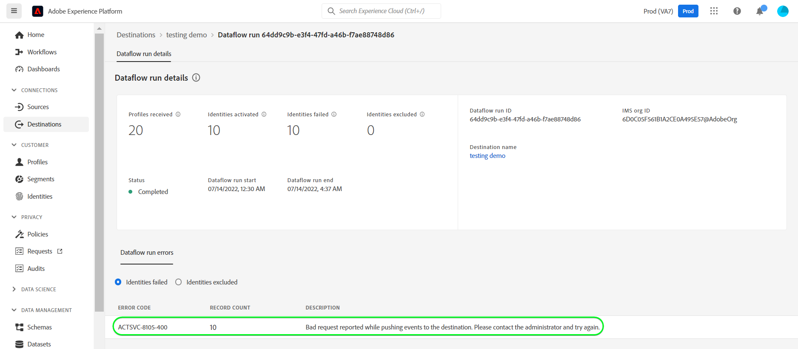

# [!DNL Microsoft Dynamics 365] anslutning

## Översikt {#overview}

[[!DNL Microsoft Dynamics 365]](https://dynamics.microsoft.com/en-us/) är en molnbaserad plattform för affärsapplikationer som kombinerar ERP (Enterprise Resource Planning) och CRM (Customer Relationship Management) med produktivitetsprogram och AI-verktyg, vilket ger smidigare och mer kontrollerad drift, bättre tillväxtpotential och minskade kostnader.

Detta [!DNL Adobe Experience Platform] [mål](/help/destinations/home.md) utnyttjar [[!DNL Contact Entity Reference API]](https://docs.microsoft.com/en-us/dynamics365/customerengagement/on-premises/developer/entities/contact?view=op-9-1)som gör att ni kan uppdatera identiteter inom en viss målgrupp till [!DNL Dynamics 365].

[!DNL Dynamics 365] använder OAuth 2 med auktoriseringsbidrag som autentiseringsmekanism för att kommunicera med [!DNL Contact Entity Reference API]. Instruktioner för hur du autentiserar [!DNL Dynamics 365] -instansen är längre ned, i [Autentisera till mål](#authenticate) -avsnitt.

## Användningsfall {#use-cases}

Som marknadsförare kan ni leverera personaliserade upplevelser till era användare, baserat på attribut från deras Adobe Experience Platform-profiler. Ni kan bygga målgrupper utifrån era offlinedata och skicka dessa målgrupper till [!DNL Dynamics 365], som visas i användarnas flöden så snart som målgrupper och profiler uppdateras i Adobe Experience Platform.

## Förutsättningar {#prerequisites}

### Krav för Experience Platform {#prerequisites-in-experience-platform}

Innan du aktiverar data för [!DNL Dynamics 365] mål, du måste ha en [schema](/help/xdm/schema/composition.md), a [datauppsättning](https://experienceleague.adobe.com/docs/platform-learn/tutorials/data-ingestion/create-datasets-and-ingest-data.html?lang=en)och [segment](https://experienceleague.adobe.com/docs/platform-learn/tutorials/segments/create-segments.html?lang=en) skapad i [!DNL Experience Platform].

Mer information finns i Adobe dokumentation [Schemafältgrupp för detaljer om segmentmedlemskap](/help/xdm/field-groups/profile/segmentation.md) om ni behöver vägledning om målgruppsstatus.

### [!DNL Microsoft Dynamics 365] krav {#prerequisites-destination}

Observera följande krav i [!DNL Dynamics 365]för att exportera data från Platform till [!DNL Dynamics 365] konto:

#### Du måste ha en [!DNL Microsoft Dynamics 365] konto {#prerequisites-account}

Gå till [!DNL Dynamics 365] [testversion](https://dynamics.microsoft.com/en-us/dynamics-365-free-trial/) sida för att registrera och skapa ett konto, om du inte redan har ett.

#### Skapa fält i [!DNL Dynamics 365] {#prerequisites-custom-field}

Skapa ett anpassat typfält `Simple` med fältdatatyp som `Single Line of Text` vilket Experience Platform ska använda för att uppdatera målgruppsstatus inom [!DNL Dynamics 365].
Se [!DNL Dynamics 365] dokumentation till [skapa ett fält (attribut)](https://docs.microsoft.com/en-us/dynamics365/customerengagement/on-premises/customize/create-edit-fields?view=op-9-1) om du behöver ytterligare vägledning.

Exempelinställningar i [!DNL Dynamics 365] visas nedan:

#### Registrera en program- och programanvändare i Azure Active Directory {#prerequisites-app-user}

Aktivera [!DNL Dynamics 365] för att få tillgång till resurser som du måste logga in med [!DNL Azure Account] till [[!DNL Azure Active Directory]](https://docs.microsoft.com/en-us/azure/active-directory/develop/howto-create-service-principal-portal#register-an-application-with-azure-ad-and-create-a-service-principal) och skapa följande:
* An [!DNL Azure Active Directory] program
* Tjänsthuvudman
* En programhemlighet

Du måste också [skapa en programanvändare](https://docs.microsoft.com/en-us/power-platform/admin/manage-application-users#create-an-application-user) in [!DNL Azure Active Directory] och associera det med det nya programmet.

#### Samla [!DNL Dynamics 365] autentiseringsuppgifter {#gather-credentials}

Anteckna vad som står nedan innan du autentiserar dig för [!DNL Dynamics 365] CRM-mål:

| Autentiseringsuppgifter | Beskrivning | Exempel |
| --- | --- | --- |
| `Client ID` | The [!DNL Dynamics 365] Klient-ID för din [!DNL Azure Active Directory] program. Se [[!DNL Dynamics 365] dokumentation](https://docs.microsoft.com/en-us/azure/active-directory/develop/howto-create-service-principal-portal#get-tenant-and-app-id-values-for-signing-in) för vägledning. | `ababbaba-abab-baba-acac-acacacacacac` |
| `Client Secret` | The [!DNL Dynamics 365] Klienthemlighet för [!DNL Azure Active Directory] program. Du använder alternativ 2 i [[!DNL Dynamics 365] dokumentation](https://docs.microsoft.com/en-us/azure/active-directory/develop/howto-create-service-principal-portal#authentication-two-options). | `abcde~abcdefghijklmnopqrstuvwxyz12345678` för vägledning. |
| `Tenant ID` | The [!DNL Dynamics 365] Klient-ID för din [!DNL Azure Active Directory] program. Se [[!DNL Dynamics 365] dokumentation](https://docs.microsoft.com/en-us/azure/active-directory/develop/howto-create-service-principal-portal#get-tenant-and-app-id-values-for-signing-in) för vägledning. | `1234567-aaaa-12ab-ba21-1234567890` |
| `Environment URL` | Se [[!DNL Dynamics 365] dokumentation](https://docs.microsoft.com/en-us/dynamics365/customerengagement/on-premises/developer/org-service/discover-url-organization-organization-service?view=op-9-1) för vägledning. | Om [!DNL Dynamics 365] domänen är som nedan, du behöver det markerade värdet.  *`org57771b33`.crm.dynamics.com* |

## Guardrails {#guardrails}

The [Begäranden om gränser och tilldelningar](https://docs.microsoft.com/en-us/power-platform/admin/api-request-limits-allocations) sidinformation om [!DNL Dynamics 365] API-begränsningar som är kopplade till [!DNL Dynamics 365] licens. Du måste se till att dina data och din nyttolast är inom dessa begränsningar.

## Identiteter som stöds {#supported-identities}

[!DNL Dynamics 365] har stöd för uppdatering av identiteter som beskrivs i tabellen nedan. Läs mer om [identiteter](/help/identity-service/namespaces.md).

| Målidentitet | Exempel | Beskrivning | Överväganden |
|---|---|---|---|
| `contactId` | 7eb682f1-ca75-e511-80d4-00155d2a68d1 | Unik identifierare för en kontakt. | **Obligatoriskt**. Se [[!DNL Dynamics 365] dokumentation](https://docs.microsoft.com/en-us/dynamics365/customerengagement/on-premises/developer/entities/contact?view=op-9-1) för mer information. |

## Exportera typ och frekvens {#export-type-frequency}

Se tabellen nedan för information om exporttyp och frekvens för destinationen.

| Objekt | Typ | Anteckningar |
---------|----------|---------|
| Exporttyp | **[!UICONTROL Profile-based]** | <ul><li>Du exporterar alla medlemmar i ett segment tillsammans med de önskade schemafälten *(till exempel: e-postadress, telefonnummer, efternamn)*, enligt fältmappningen.</li><li> Varje målgruppsstatus i [!DNL Dynamics 365] uppdateras med motsvarande målgruppsstatus från Platform, baserat på **[!UICONTROL Mapping ID]** det värde som anges under [målgruppsplanering](#schedule-segment-export-example) steg.</li></ul> |
| Exportfrekvens | **[!UICONTROL Streaming]** | <ul><li>Direktuppspelningsmål är alltid på API-baserade anslutningar. Så snart en profil uppdateras i Experience Platform baserat på målgruppsutvärdering skickar anslutningsprogrammet uppdateringen nedströms till målplattformen. Läs mer om [mål för direktuppspelning](/help/destinations/destination-types.md#streaming-destinations).</li></ul> |

{style="table-layout:auto"}

## Anslut till målet {#connect}

>[!IMPORTANT]
>
>Om du vill ansluta till målet behöver du **[!UICONTROL Manage Destinations]** [åtkomstkontrollbehörighet](/help/access-control/home.md#permissions). Läs [åtkomstkontroll - översikt](/help/access-control/ui/overview.md) eller kontakta produktadministratören för att få de behörigheter som krävs.

Om du vill ansluta till det här målet följer du stegen som beskrivs i [självstudiekurs om destinationskonfiguration](../../ui/connect-destination.md). I arbetsflödet för att konfigurera mål fyller du i fälten som listas i de två avsnitten nedan.

Inom **[!UICONTROL Destinations]** > **[!UICONTROL Catalog]** sök efter [!DNL Dynamics 365]. Du kan även hitta den under **[!UICONTROL CRM]** kategori.

### Autentisera till mål {#authenticate}

Om du vill autentisera mot målet väljer du **[!UICONTROL Connect to destination]**.

Fyll i de obligatoriska fälten nedan. Se [Samla in Dynamics 365-autentiseringsuppgifter](#gather-credentials) för vägledning.
* **[!UICONTROL Client ID]**: The [!DNL Dynamics 365] Klient-ID för din [!DNL Azure Active Directory] program.
* **[!UICONTROL Tenant ID]**: The [!DNL Dynamics 365] Klient-ID för din [!DNL Azure Active Directory] program.
* **[!UICONTROL Client Secret]**: The [!DNL Dynamics 365] Klienthemlighet för [!DNL Azure Active Directory] program.
* **[!UICONTROL Environment URL]**: Dina [!DNL Dynamics 365] Miljö-URL.

Om den angivna informationen är giltig visas en **[!UICONTROL Connected]** status med grön bockmarkering. Du kan sedan gå vidare till nästa steg.

### Fyll i målinformation {#destination-details}

Om du vill konfigurera information för målet fyller du i de obligatoriska och valfria fälten nedan. En asterisk bredvid ett fält i användargränssnittet anger att fältet är obligatoriskt.

* **[!UICONTROL Name]**: Ett namn som du känner igen det här målet med i framtiden.
* **[!UICONTROL Description]**: En beskrivning som hjälper dig att identifiera det här målet i framtiden.

### Aktivera aviseringar {#enable-alerts}

Du kan aktivera varningar för att få meddelanden om dataflödets status till ditt mål. Välj en avisering i listan om du vill prenumerera och få meddelanden om status för ditt dataflöde. Mer information om varningar finns i guiden [prenumerera på destinationsvarningar med hjälp av användargränssnittet](../../ui/alerts.md).

När du är klar med informationen för målanslutningen väljer du **[!UICONTROL Next]**.

## Aktivera målgrupper till det här målet {#activate}

>[!IMPORTANT]
>
>Om du vill aktivera data måste du ha **[!UICONTROL Manage Destinations]**, **[!UICONTROL Activate Destinations]**, **[!UICONTROL View Profiles]** och **[!UICONTROL View Segments]** [behörigheter för åtkomstkontroll](/help/access-control/home.md#permissions). Läs [åtkomstkontroll - översikt](/help/access-control/ui/overview.md) eller kontakta produktadministratören för att få de behörigheter som krävs.

Läs [Aktivera profiler och målgrupper för att strömma målgruppernas exportdestinationer](/help/destinations/ui/activate-segment-streaming-destinations.md) för instruktioner om hur du aktiverar målgrupper till det här målet.

### Mappa överväganden och exempel {#mapping-considerations-example}

Så här skickar du målgruppsdata från Adobe Experience Platform till [!DNL Dynamics 365] mål måste du gå igenom fältmappningssteget. Mappningen består av att skapa en länk mellan XDM-schemafälten (Experience Data Model) i ditt plattformskonto och motsvarande motsvarigheter från målmålet. Koppla XDM-fälten till [!DNL Dynamics 365] målfält, följ dessa steg:

1. I **[!UICONTROL Mapping]** steg, välja **[!UICONTROL Add new mapping]**. En ny mappningsrad visas på skärmen.
   

1. I **[!UICONTROL Select source field]** väljer du **[!UICONTROL Select identity namespace]** kategori och välj `contactId`.
   

1. I **[!UICONTROL Select target field]** väljer du den typ av målfält som du vill mappa källfältet till.
   * **[!UICONTROL Select identity namespace]**: Välj det här alternativet om du vill mappa källfältet till ett identitetsnamnområde från listan.
     

   * Lägg till följande mappning mellan XDM-profilschemat och [!DNL Dynamics 365] instans: |XDM-profilschema|[!DNL Dynamics 365] Instans| Obligatorisk| |—|—|—| |`contactId`|`contactId`| Ja |

   * **[!UICONTROL Select custom attributes]**: välj det här alternativet om du vill mappa källfältet till ett anpassat attribut som du definierar i dialogrutan **[!UICONTROL Attribute name]** fält. Se [[!DNL Dynamics 365] dokumentation](https://docs.microsoft.com/en-us/dynamics365/customerengagement/on-premises/developer/entities/contact?view=op-9-1#entity-properties) om du vill ha en omfattande lista över attribut som stöds.
     

     >[!IMPORTANT]
     >
     >Om du har ett källfält för datum eller tidsstämpling som är mappat till en [!DNL Dynamics 365] [datum eller tidsstämpel](https://docs.microsoft.com/en-us/power-apps/developer/data-platform/webapi/reference/timestampdatemapping?view=dataverse-latest) målfält, kontrollera att det mappade värdet inte är tomt. Om det skickade värdet är tomt kommer du att stöta på en *`Bad request reported while pushing events to the destination. Please contact the administrator and try again.`* felmeddelande och data kommer inte att uppdateras. Det här är en [!DNL Dynamics 365] begränsning.

   * Beroende på vilka värden du vill uppdatera lägger du till följande mappning mellan XDM-profilschemat och ditt [!DNL Dynamics 365] instans: |XDM-profilschema|[!DNL Dynamics 365] Instans| |—|—| |`person.name.firstName`|`FirstName`| |`person.name.lastName`|`LastName`| |`personalEmail.address`|`Email`|

   * Ett exempel på hur du använder dessa mappningar visas nedan:
     

### Schemalägg målgruppsexport och exempel {#schedule-segment-export-example}

I [[!UICONTROL Schedule audience export]](/help/destinations/ui/activate-segment-streaming-destinations.md#scheduling) steg i aktiveringsarbetsflödet måste du manuellt mappa Platform-målgrupper till det anpassade fältattributet i [!DNL Dynamics 365].

Om du vill göra det markerar du varje segment och anger sedan motsvarande attribut för anpassade fält från [!DNL Dynamics 365] i **[!UICONTROL Mapping ID]** fält.

>[!IMPORTANT]
>
>Värdet som används för **[!UICONTROL Mapping ID]** ska exakt matcha namnet på det anpassade fältattributet som skapats i [!DNL Dynamics 365]. Se [[!DNL Dynamics 365] dokumentation](https://docs.microsoft.com/en-us/dynamics365/customerengagement/on-premises/customize/create-edit-fields?view=op-9-1) om du behöver hjälp med att hitta anpassade fältattribut.

Ett exempel visas nedan:

## Validera dataexport {#exported-data}

Följ stegen nedan för att verifiera att du har konfigurerat målet korrekt:

1. Välj **[!UICONTROL Destinations]** > **[!UICONTROL Browse]** för att navigera till listan över destinationer.
   

1. Markera målet och validera att statusen är **[!UICONTROL enabled]**.
   

1. Växla till **[!DNL Activation data]** väljer du ett målgruppsnamn.
   

1. Övervaka målgruppssammanfattningen och se till att antalet profiler motsvarar antalet som skapas inom segmentet.
   

1. Logga in på [!DNL Dynamics 365] webbplatsen och sedan navigera till [!DNL Customers] > [!DNL Contacts] och kontrollera om profilerna från målgruppen har lagts till. Du kan se att varje målgruppsstatus i [!DNL Dynamics 365] uppdaterades med motsvarande målgruppsstatus från Platform, baserat på **[!UICONTROL Mapping ID]** det värde som anges under [målgruppsplanering](#schedule-segment-export-example) steg.
   

## Dataanvändning och styrning {#data-usage-governance}

Alla [!DNL Adobe Experience Platform] destinationerna är kompatibla med dataanvändningsprinciper när data hanteras. Detaljerad information om hur [!DNL Adobe Experience Platform] använder datastyrning, se [Datastyrning - översikt](/help/data-governance/home.md).

## Fel och felsökning {#errors-and-troubleshooting}

### Okända fel påträffades när händelser skickades till målet {#unknown-errors}

Om du får följande felmeddelande när du kontrollerar ett dataflöde: `Bad request reported while pushing events to the destination. Please contact the administrator and try again.`

Kontrollera att **[!UICONTROL Mapping ID]** du angav i [!DNL Dynamics 365] för er plattformskrets är giltigt och finns inom [!DNL Dynamics 365].

## Ytterligare resurser {#additional-resources}

Ytterligare användbar information från [[!DNL Dynamics 365] dokumentation](https://docs.microsoft.com/en-us/dynamics365/) är under:
* [IOrganizationService.Update(Entity)-metod](https://docs.microsoft.com/en-us/dotnet/api/microsoft.xrm.sdk.iorganizationservice.update?view=dataverse-sdk-latest)
* [Uppdatera och ta bort tabellrader med webb-API:t](https://docs.microsoft.com/en-us/power-apps/developer/data-platform/webapi/update-delete-entities-using-web-api#basic-update)
