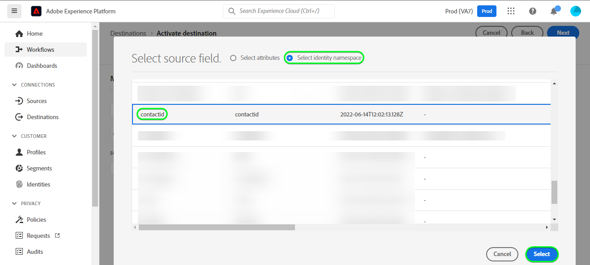

# [!DNL Microsoft Dynamics 365]-anslutning

## Översikt {#overview}

[[!DNL Microsoft Dynamics 365]](https://dynamics.microsoft.com/en-us/) är en molnbaserad plattform för affärsprogram som kombinerar ERP (Enterprise Resource Planning) och CRM (Customer Relationship Management) med produktivitetsprogram och AI-verktyg, vilket ger smidigare och mer kontrollerade åtgärder, bättre tillväxtpotential och minskade kostnader.

Detta [!DNL Adobe Experience Platform] [mål](/help/destinations/home.md) utnyttjar [[!DNL Contact Entity Reference API]](https://docs.microsoft.com/en-us/dynamics365/customerengagement/on-premises/developer/entities/contact?view=op-9-1), som gör att du kan uppdatera identiteter inom en målgrupp till [!DNL Dynamics 365].

[!DNL Dynamics 365] använder OAuth 2 med auktoriseringsauktorisering som autentiseringsmekanism för att kommunicera med [!DNL Contact Entity Reference API]. Instruktioner för autentisering till din [!DNL Dynamics 365]-instans finns längre ned i avsnittet [Autentisera till mål](#authenticate).

## Användningsfall {#use-cases}

Som marknadsförare kan ni leverera personaliserade upplevelser till era användare, baserat på attribut från deras Adobe Experience Platform-profiler. Du kan skapa målgrupper utifrån dina offlinedata och skicka dessa målgrupper till [!DNL Dynamics 365], för att visa dem i användarens flöden så snart som målgrupper och profiler uppdateras i Adobe Experience Platform.

## Förhandskrav {#prerequisites}

### Krav för Experience Platform {#prerequisites-in-experience-platform}

Innan du aktiverar data till målet [!DNL Dynamics 365] måste du ha ett [schema](/help/xdm/schema/composition.md), en [datamängd](https://experienceleague.adobe.com/docs/platform-learn/tutorials/data-ingestion/create-datasets-and-ingest-data.html) och [målgrupper](https://experienceleague.adobe.com/docs/platform-learn/tutorials/audiences/create-audiences.html) som skapats i [!DNL Experience Platform].

Se Adobe dokumentation för schemafältgruppen [Information om målgruppsmedlemskap](/help/xdm/field-groups/profile/segmentation.md) om du behöver vägledning om målgruppsstatus.

### Krav för [!DNL Microsoft Dynamics 365] {#prerequisites-destination}

Observera följande krav i [!DNL Dynamics 365] för att kunna exportera data från Experience Platform till ditt [!DNL Dynamics 365]-konto:

#### Du måste ha ett [!DNL Microsoft Dynamics 365]-konto {#prerequisites-account}

Gå till sidan [!DNL Dynamics 365] [utvärderingsversion](https://dynamics.microsoft.com/en-us/dynamics-365-free-trial/) om du vill registrera och skapa ett konto, om du inte redan har ett.

#### Skapa fält i [!DNL Dynamics 365] {#prerequisites-custom-field}

Skapa det anpassade fältet av typen `Simple` med fältdatatypen `Single Line of Text` som Experience Platform använder för att uppdatera målgruppsstatusen i [!DNL Dynamics 365].

Mer information finns i dokumentationen för [!DNL Dynamics 365] [Skapa eller redigera ett fält (attribut)](https://docs.microsoft.com/en-us/dynamics365/customerengagement/on-premises/customize/create-edit-fields?view=op-9-1) om du behöver ytterligare hjälp.

Skriv ned **[!UICONTROL Customization prefix]** för det anpassade fältet som du skapar i [!DNL Dynamics 365]. Du behöver det här prefixet under steget [Fyll i målinformation](#destination-details). Mer information finns i avsnittet [Skapa och redigera fält](https://learn.microsoft.com/en-us/dynamics365/customerengagement/on-premises/customize/create-edit-fields?view=op-9-1#create-and-edit-fields) i [!DNL Dynamics 365]-dokumentationen.

Ett exempel i [!DNL Dynamics 365] visas nedan:

#### Registrera en program- och programanvändare i Azure Active Directory {#prerequisites-app-user}

Om du vill att [!DNL Dynamics 365] ska kunna komma åt resurser måste du logga in med [!DNL Azure Account] till [[!DNL Azure Active Directory]](https://docs.microsoft.com/en-us/azure/active-directory/develop/howto-create-service-principal-portal#register-an-application-with-azure-ad-and-create-a-service-principal) och skapa följande:
* Ett [!DNL Azure Active Directory]-program
* Tjänsthuvudman
* En programhemlighet

Du måste också [skapa en programanvändare](https://docs.microsoft.com/en-us/power-platform/admin/manage-application-users#create-an-application-user) i [!DNL Azure Active Directory] och associera den med det nya programmet.

#### Samla in inloggningsuppgifter för [!DNL Dynamics 365] {#gather-credentials}

Observera objekten nedan innan du autentiserar till CRM-målet [!DNL Dynamics 365]:

| Autentiseringsuppgifter | Beskrivning | Exempel |
| --- | --- | --- |
| `Client ID` | Klient-ID [!DNL Dynamics 365] för ditt [!DNL Azure Active Directory]-program. Mer information finns i [[!DNL Dynamics 365] dokumentationen](https://docs.microsoft.com/en-us/azure/active-directory/develop/howto-create-service-principal-portal#get-tenant-and-app-id-values-for-signing-in). | `ababbaba-abab-baba-acac-acacacacacac` |
| `Client Secret` | Klienthemligheten [!DNL Dynamics 365] för ditt [!DNL Azure Active Directory]-program. Du använder alternativ 2 i [[!DNL Dynamics 365] dokumentationen](https://docs.microsoft.com/en-us/azure/active-directory/develop/howto-create-service-principal-portal#authentication-two-options). | `abcde~abcdefghijklmnopqrstuvwxyz12345678` om du vill ha vägledning. |
| `Tenant ID` | Klient-ID [!DNL Dynamics 365] för ditt [!DNL Azure Active Directory]-program. Mer information finns i [[!DNL Dynamics 365] dokumentationen](https://docs.microsoft.com/en-us/azure/active-directory/develop/howto-create-service-principal-portal#get-tenant-and-app-id-values-for-signing-in). | `1234567-aaaa-12ab-ba21-1234567890` |
| `Region` | Den Microsoft-region som är associerad med URL:en för miljön.  Mer information finns i [[!DNL Dynamics 365] dokumentationen](https://learn.microsoft.com/en-us/power-platform/admin/new-datacenter-regions). | Om din domän är som nedan måste du ange det markerade värdet för CRM-fältet i den nedrullningsbara väljaren när du autentiserar till [målet](#authenticate).  *org57771b33.`crm`.dynamics.com*  Som exempel: Om ditt företag etableras i Nordamerika (NAM) blir din URL `crm.dynamics.com` och du måste välja `crm`. Om ditt företag etableras i Kanada (CAN)-regionen är din URL `crm3.dynamics.com` och du måste välja `crm3`. |
| `Environment URL` | Mer information finns i [[!DNL Dynamics 365] dokumentationen](https://docs.microsoft.com/en-us/dynamics365/customerengagement/on-premises/developer/org-service/discover-url-organization-organization-service?view=op-9-1). | Om din [!DNL Dynamics 365]-domän är som nedan behöver du det markerade värdet.  *`org57771b33`.crm.dynamics.com* |

{style="table-layout:auto"}

## Guardrails {#guardrails}

Sidan [Begäranden om gränser och allokeringar](https://docs.microsoft.com/en-us/power-platform/admin/api-request-limits-allocations) innehåller information om de [!DNL Dynamics 365] API-gränser som är kopplade till din [!DNL Dynamics 365]-licens. Du måste se till att dina data och din nyttolast är inom dessa begränsningar.

## Identiteter som stöds {#supported-identities}

[!DNL Dynamics 365] har stöd för uppdatering av identiteter som beskrivs i tabellen nedan. Läs mer om [identiteter](/help/identity-service/features/namespaces.md).

| Målidentitet | Exempel | Beskrivning | Överväganden |
|---|---|---|---|
| `contactid` | 7eb682f1-ca75-e511-80d4-00155d2a68d1 | Unik identifierare för en kontakt. | **Obligatoriskt**. Mer information finns i [[!DNL Dynamics 365] dokumentationen](https://docs.microsoft.com/en-us/dynamics365/customerengagement/on-premises/developer/entities/contact?view=op-9-1). |

{style="table-layout:auto"}

## Målgrupper {#supported-audiences}

I det här avsnittet beskrivs alla målgrupper som du kan exportera till det här målet.

Det här målet stöder aktivering av alla målgrupper som genereras via Experience Platform [segmenteringstjänst](../../../segmentation/home.md).

## Exportera typ och frekvens {#export-type-frequency}

Se tabellen nedan för information om exporttyp och frekvens för destinationen.

| Objekt | Typ | Anteckningar |
---------|----------|---------|
| Exporttyp | **[!UICONTROL Profile-based]** | <ul><li>Du exporterar alla medlemmar i en målgrupp tillsammans med de önskade schemafälten *(till exempel e-postadress, telefonnummer, efternamn)*, enligt fältmappningen.</li><li> Varje målgruppsstatus i [!DNL Dynamics 365] uppdateras med motsvarande målgruppsstatus från Experience Platform, baserat på det **[!UICONTROL Mapping ID]**-värde som angavs under [målgruppsplaneringssteget](#schedule-audience-export-example).</li></ul> |
| Exportfrekvens | **[!UICONTROL Streaming]** | <ul><li>Direktuppspelningsmål är alltid på API-baserade anslutningar. Så snart en profil uppdateras i Experience Platform baserat på målgruppsutvärdering skickar anslutningsprogrammet uppdateringen nedströms till målplattformen. Läs mer om [direktuppspelningsmål](/help/destinations/destination-types.md#streaming-destinations).</li></ul> |

{style="table-layout:auto"}

## Anslut till målet {#connect}

>[!IMPORTANT]
>
>Om du vill ansluta till målet behöver du behörigheterna **[!UICONTROL View Destinations]** och **[!UICONTROL Manage Destinations]** [åtkomstkontroll](/help/access-control/home.md#permissions). Läs [åtkomstkontrollsöversikten](/help/access-control/ui/overview.md) eller kontakta produktadministratören för att få den behörighet som krävs.

Om du vill ansluta till det här målet följer du stegen som beskrivs i självstudiekursen [för destinationskonfiguration](../../ui/connect-destination.md). I arbetsflödet för att konfigurera mål fyller du i fälten som listas i de två avsnitten nedan.

I **[!UICONTROL Destinations]** > **[!UICONTROL Catalog]** söker du efter [!DNL Dynamics 365]. Du kan också hitta den under kategorin **[!UICONTROL CRM]**.

### Autentisera till mål {#authenticate}

Om du vill autentisera till målet väljer du **[!UICONTROL Connect to destination]**.

Fyll i de obligatoriska fälten nedan. Mer information finns i avsnittet [Samla in Dynamics 365-autentiseringsuppgifter](#gather-credentials).
* **[!UICONTROL Client ID]**: Klient-ID:t [!DNL Dynamics 365] för ditt [!DNL Azure Active Directory]-program.
* **[!UICONTROL Tenant ID]**: Klient-ID:t [!DNL Dynamics 365] för ditt [!DNL Azure Active Directory]-program.
* **[!UICONTROL Client Secret]**: [!DNL Dynamics 365] Klienthemlighet för ditt [!DNL Azure Active Directory]-program.
* **[!UICONTROL Region]**: Din [[!DNL Dynamics 365]](https://learn.microsoft.com/en-us/power-platform/admin/new-datacenter-regions)-region. Exempel: Om ditt företag etableras i Nordamerika (NAM) är din URL `crm.dynamics.com` och du måste välja `crm`. Om ditt företag etableras i Kanada (CAN)-regionen är din URL `crm3.dynamics.com` och du måste välja `crm3`.
* **[!UICONTROL Environment URL]**: Din [!DNL Dynamics 365]-miljöadress.

Om den angivna informationen är giltig visas statusen **[!UICONTROL Connected]** med en grön bockmarkering. Du kan sedan gå vidare till nästa steg.

### Fyll i målinformation {#destination-details}

Om du vill konfigurera information för målet fyller du i de obligatoriska och valfria fälten nedan. En asterisk bredvid ett fält i användargränssnittet anger att fältet är obligatoriskt.

* **[!UICONTROL Name]**: Ett namn som du känner igen det här målet med i framtiden.
* **[!UICONTROL Description]**: En beskrivning som hjälper dig att identifiera det här målet i framtiden.
* **[!UICONTROL Customization Prefix]**: `Customization prefix` för det anpassade fältet som du skapade i [!DNL Dynamics 365]. Mer information finns i avsnittet [Skapa och redigera fält](https://learn.microsoft.com/en-us/dynamics365/customerengagement/on-premises/customize/create-edit-fields?view=op-9-1#create-and-edit-fields) i [!DNL Dynamics 365]-dokumentationen.

### Aktivera aviseringar {#enable-alerts}

Du kan aktivera varningar för att få meddelanden om dataflödets status till ditt mål. Välj en avisering i listan om du vill prenumerera och få meddelanden om statusen för ditt dataflöde. Mer information om varningar finns i guiden [prenumerera på destinationsvarningar med användargränssnittet](../../ui/alerts.md).

Välj **[!UICONTROL Next]** när du är klar med att ange information för målanslutningen.

## Aktivera målgrupper till det här målet {#activate}

>[!IMPORTANT]
> 
>* För att aktivera data behöver du behörigheterna **[!UICONTROL View Destinations]**, **[!UICONTROL Activate Destinations]**, **[!UICONTROL View Profiles]** och **[!UICONTROL View Segments]** [åtkomstkontroll](/help/access-control/home.md#permissions). Läs [åtkomstkontrollsöversikten](/help/access-control/ui/overview.md) eller kontakta produktadministratören för att få den behörighet som krävs.
>* Om du vill exportera *identiteter* måste du ha **[!UICONTROL View Identity Graph]** [åtkomstkontrollbehörighet](/help/access-control/home.md#permissions).   {width="100" zoomable="yes"}

Läs [Aktivera profiler och målgrupper för att direktuppspela målgruppsexportdestinationer](/help/destinations/ui/activate-segment-streaming-destinations.md) för instruktioner om hur du aktiverar målgrupper till det här målet.

### Mappa överväganden och exempel {#mapping-considerations-example}

Om du vill skicka målgruppsdata från Adobe Experience Platform till målet [!DNL Dynamics 365] måste du gå igenom fältmappningssteget. Mappningen består av att skapa en länk mellan XDM-schemafälten (Experience Data Model) i ditt Experience Platform-konto och deras motsvarande motsvarigheter från målmålet. Följ de här stegen för att mappa dina XDM-fält korrekt till målfälten för [!DNL Dynamics 365]:

1. Välj **[!UICONTROL Add new mapping]** i steget **[!UICONTROL Mapping]**. En ny mappningsrad visas på skärmen.
   

1. I fönstret **[!UICONTROL Select source field]** väljer du kategorin **[!UICONTROL Select identity namespace]** och sedan `contactid`.
   

1. I fönstret **[!UICONTROL Select target field]** väljer du den typ av målfält som du vill mappa källfältet till.
   * **[!UICONTROL Select identity namespace]**: välj det här alternativet om du vill mappa källfältet till ett identitetsnamnområde från listan.

     

   * Lägg till följande mappning mellan ditt XDM-profilschema och din [!DNL Dynamics 365]-instans:

     | XDM-profilschema | [!DNL Dynamics 365]-instans | Obligatoriskt |
     |---|---|---|
     | `contactid` | `contactid` | Ja |

   * **[!UICONTROL Select custom attributes]**: välj det här alternativet om du vill mappa källfältet till ett anpassat attribut som du definierar i fältet **[!UICONTROL Attribute name]**. I [[!DNL Dynamics 365] dokumentationen](https://docs.microsoft.com/en-us/dynamics365/customerengagement/on-premises/developer/entities/contact?view=op-9-1#entity-properties) finns en omfattande lista över attribut som stöds.

     

     >[!IMPORTANT]
     >
     > * Målfältsnamnen ska vara i `lowercase`.
     > * Om du har ett källfält för datum eller tidsstämpling som är mappat till ett [!DNL Dynamics 365] [date- eller timestamp](https://docs.microsoft.com/en-us/power-apps/developer/data-platform/webapi/reference/timestampdatemapping?view=dataverse-latest) -målfält kontrollerar du att det mappade värdet inte är tomt. Om det exporterade fältvärdet är tomt visas ett *`Bad request reported while pushing events to the destination. Please contact the administrator and try again.`*-felmeddelande och data uppdateras inte. Det här är en [!DNL Dynamics 365]-begränsning.

   * Beroende på vilka värden du vill uppdatera lägger du till följande mappning mellan XDM-profilschemat och [!DNL Dynamics 365]-instansen:

     | XDM-profilschema | [!DNL Dynamics 365]-instans |
     |---|---|
     | `person.name.firstName` | `firstname` |
     | `person.name.lastName` | `lastname` |
     | `personalEmail.address` | `emailaddress1` |

   * Ett exempel på hur du använder dessa mappningar visas nedan:

   

### Schemalägg målgruppsexport och exempel {#schedule-audience-export-example}

I steget [[!UICONTROL Schedule audience export]](/help/destinations/ui/activate-segment-streaming-destinations.md#scheduling) i aktiveringsarbetsflödet måste du manuellt mappa Experience Platform-målgrupper till det anpassade fältattributet i [!DNL Dynamics 365].

Det gör du genom att markera varje målgrupp och sedan ange motsvarande anpassade fältattribut från [!DNL Dynamics 365] i fältet **[!UICONTROL Mapping ID]**.

>[!IMPORTANT]
>
>Värdet som används för **[!UICONTROL Mapping ID]** ska exakt matcha namnet på det anpassade fältattributet som skapats i [!DNL Dynamics 365]. Se [[!DNL Dynamics 365] dokumentation](https://docs.microsoft.com/en-us/dynamics365/customerengagement/on-premises/customize/create-edit-fields?view=op-9-1) om du behöver hjälp med att hitta anpassade fältattribut.

Ett exempel visas nedan:

## Validera dataexport {#exported-data}

Följ stegen nedan för att verifiera att du har konfigurerat målet korrekt:

1. Välj **[!UICONTROL Destinations]** > **[!UICONTROL Browse]** för att navigera till listan över mål.
   

1. Markera målet och validera att statusen är **[!UICONTROL enabled]**.
   

1. Växla till fliken **[!DNL Activation data]** och välj sedan ett publiknamn.
   

1. Övervaka målgruppssammanfattningen och se till att antalet profiler motsvarar antalet som skapas inom målgruppen.
   

1. Logga in på webbplatsen [!DNL Dynamics 365], gå till sidan [!DNL Customers] > [!DNL Contacts] och kontrollera om profilerna från målgruppen har lagts till. Du kan se att varje målgruppsstatus i [!DNL Dynamics 365] har uppdaterats med motsvarande målgruppsstatus från Experience Platform, baserat på värdet **[!UICONTROL Mapping ID]** som angavs under steget [målgruppsplanering](#schedule-audience-export-example).
   

## Dataanvändning och styrning {#data-usage-governance}

Alla [!DNL Adobe Experience Platform]-mål är kompatibla med dataanvändningsprinciper när data hanteras. Mer information om hur [!DNL Adobe Experience Platform] använder datastyrning finns i [Datastyrningsöversikten](/help/data-governance/home.md).

## Fel och felsökning {#errors-and-troubleshooting}

### Okända fel påträffades när händelser skickades till målet {#unknown-errors}

Om du får följande felmeddelande när du kontrollerar ett dataflöde: `Bad request reported while pushing events to the destination. Please contact the administrator and try again.`

Om du vill åtgärda det här felet kontrollerar du att **[!UICONTROL Mapping ID]** som du angav i [!DNL Dynamics 365] för din Experience Platform-målgrupp är giltig och finns i [!DNL Dynamics 365].

## Ytterligare resurser {#additional-resources}

Ytterligare användbar information från [[!DNL Dynamics 365] dokumentationen](https://docs.microsoft.com/en-us/dynamics365/) finns nedan:
* [IOrganizationService.Update(Entity) Method](https://docs.microsoft.com/en-us/dotnet/api/microsoft.xrm.sdk.iorganizationservice.update?view=dataverse-sdk-latest)
* [Uppdatera och ta bort tabellrader med webb-API:t](https://docs.microsoft.com/en-us/power-apps/developer/data-platform/webapi/update-delete-entities-using-web-api#basic-update)

### Changelog

I det här avsnittet beskrivs funktionaliteten och viktiga dokumentationsuppdateringar för den här målanslutningen.

+++ Visa ändringslogg

| Releasamånad | Uppdateringstyp | Beskrivning |
|---|---|---|
| Oktober 2023 | Uppdatering av dokumentation | Uppdaterad vägledning för att indikera alla målattributnamn ska vara i gemener i steget [Mappning och example](#mapping-considerations-example). |
| Augusti 2023 | Funktioner och dokumentation | Stöd har lagts till för [!DNL Dynamics 365] anpassade fältprefix för anpassade fält som inte skapades i standardlösningen i [!DNL Dynamics 365]. Ett nytt inmatningsfält, **[!UICONTROL Customization Prefix]**, har lagts till i steget [Fyll i målinformation](#destination-details). (PLATIR-31602). |
| Nov 2022 | Inledande version | Ursprunglig målversion och dokumentationspublicering. |

{style="table-layout:auto"}

+++