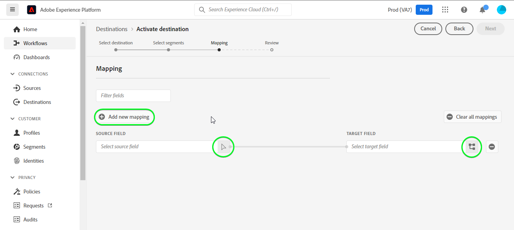
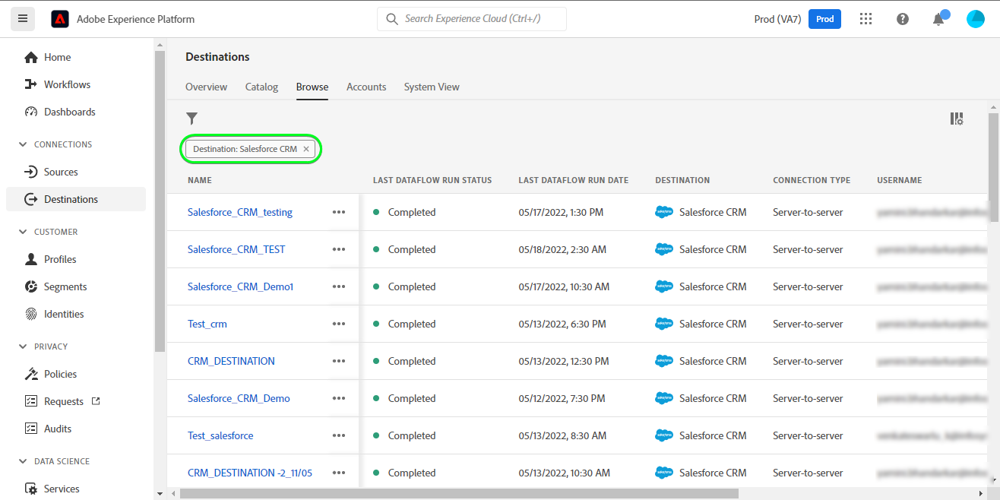
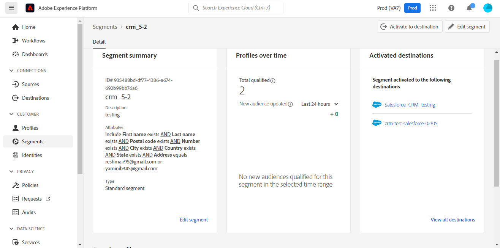

# [!DNL Salesforce CRM] anslutning

## Översikt {#overview}

[[!DNL Salesforce CRM]](https://www.salesforce.com/crm/) är en populär CRM-plattform (Customer Relationship Management) som har stöd för följande:

* [Leads](https://developer.salesforce.com/docs/atlas.en-us.object_reference.meta/object_reference/sforce_api_objects_lead.htm) - Ett lead är namnet på en person eller ett företag som kan (eller inte) vara intresserad av de produkter eller tjänster som du säljer.
* [Kontakter](https://developer.salesforce.com/docs/atlas.en-us.object_reference.meta/object_reference/sforce_api_objects_contact.htm) - En kontakt är en person med vilken en av dina representanter har upprättat en relation och har kvalificerats som en potentiell kund.

Detta [!DNL Adobe Experience Platform] [mål](/help/destinations/home.md) utnyttjar [[!DNL Salesforce composite API]](https://developer.salesforce.com/docs/atlas.en-us.api_rest.meta/api_rest/resources_composite_sobjects_collections_update.htm), som stöder båda profiltyperna som beskrivs ovan.

När [aktivera segment](#activate)kan du välja mellan antingen leads eller kontakter och uppdatera attribut och segmentera data i [!DNL Salesforce CRM].

[!DNL Salesforce CRM] använder OAuth 2 med lösenordsbeviljande som autentiseringsmekanism för att kommunicera med Salesforce REST API. Instruktioner för hur du autentiserar [!DNL Salesforce CRM] -instansen är längre ned, i [Autentisera till mål](#authenticate) -avsnitt.

## Användningsfall {#use-cases}

Som marknadsförare kan ni leverera personaliserade upplevelser till era användare, baserat på attribut från deras Adobe Experience Platform-profiler. Du kan skapa segment utifrån dina offlinedata och skicka dessa segment till Salesforce CRM, som visas i användarens flöden så snart segment och profiler uppdateras i Adobe Experience Platform.

## Förutsättningar {#prerequisites}

### Förutsättningar i Experience Platform {#prerequisites-in-experience-platform}

Innan du aktiverar data till Salesforce CRM-målet måste du ha en [schema](/help/xdm/schema/composition.md), a [datauppsättning](https://experienceleague.adobe.com/docs/platform-learn/tutorials/data-ingestion/create-datasets-and-ingest-data.html?lang=en)och [segment](https://experienceleague.adobe.com/docs/platform-learn/tutorials/segments/create-segments.html?lang=en) skapad i [!DNL Experience Platform].

### Förutsättningar [!DNL Salesforce CRM] {#prerequisites-destination}

Observera följande krav i [!DNL Salesforce CRM]för att exportera data från Platform till ditt Salesforce-konto:

#### Du måste ha ett Salesforce-konto {#prerequisites-account}

Gå till Salesforce [testversion](https://www.salesforce.com/in/form/signup/freetrial-sales/) om du vill registrera och skapa ett Salesforce-konto, om du inte redan har ett.

#### Konfigurera en ansluten app {#prerequisites-connected-app}

Sedan måste du konfigurera en [ansluten app](https://help.salesforce.com/s/articleView?id=sf.connected_app_create.htm&amp;language=en_US&amp;r=https%3A%2F%2Fhelp.salesforce.com%2F&amp;type=5) i Salesforce-kontot, om du inte redan har ett.

I den anslutna appen ser du till att [OAuth-inställningar](https://help.salesforce.com/s/articleView?id=connected_app_create_api_integration.htm&amp;type=5&amp;language=en_US) är aktiverat.

Se även till att [scope](https://help.salesforce.com/s/articleView?id=connected_app_create_api_integration.htm&amp;type=5&amp;language=en_US) som nämns nedan är markerade.

* ``chatter_api``
* ``lightning``
* ``visualforce``
* ``content``
* ``openid``
* ``full``
* ``api``
* ``web``
* ``refresh_token``
* ``offline_access``

#### Skapa anpassat fält i Salesforce {#prerequisites-custom-field}

Skapa ett anpassat typfält `Text Area Long`som Experience Platform ska använda för att uppdatera segmentstatusen i [!DNL Salesforce CRM].
Läs Salesforce-dokumentationen för att [skapa anpassade fält](https://help.salesforce.com/s/articleView?id=sf.adding_fields.htm&amp;type=5) om du behöver ytterligare vägledning.

>[!IMPORTANT]
>
>Kontrollera att det inte finns några blankstegstecken i fältnamnet. Använd i stället understrecket `(_)` tecken som avgränsare.

>[!NOTE]
>
>* Objekt i Salesforce är begränsade till 25 externa fält, se [Anpassade fältattribut](https://help.salesforce.com/s/articleView?id=sf.custom_field_attributes.htm&amp;type=5).
>* Den här begränsningen innebär att du bara kan ha högst 25 Experience Platform-segmentmedlemskap aktiva åt gången.
>* Om du har nått den här gränsen i Salesforce måste du ta bort det anpassade attributet från Salesforce som användes för att lagra segmentstatusen mot äldre segment i Experience Platform före ett nytt **[!UICONTROL Mapping ID]** kan användas.

Läs Adobe Experience Platform-dokumentationen för [Schemafältgrupp för detaljer om segmentmedlemskap](/help/xdm/field-groups/profile/segmentation.md) om du behöver vägledning om segmentstatus.

#### Samla in Salesforce-inloggningsuppgifter {#gather-credentials}

Anteckna vad som står nedan innan du autentiserar dig för [!DNL Salesforce CRM] mål:

| Autentiseringsuppgifter | Beskrivning | Exempel |
| --- | --- | --- |
| <ul><li>Salesforce-domänprefix</li></ul> | Se [Salesforce-domänprefix](https://help.salesforce.com/s/articleView?id=sf.domain_name_setting_login_policy.htm&amp;type=5) för ytterligare vägledning. | <ul><li>Om din domän är som nedan behöver du det markerade värdet.  <i>`d5i000000isb4eak-dev-ed`.my.salesforce.com</i></li></ul> |
| <ul><li>Konsumentnyckel</li><li>Konsumenthemlighet</li></ul> | Se [Salesforce-dokumentation](https://help.salesforce.com/s/articleView?id=sf.connected_app_rotate_consumer_details.htm&amp;type=5) om du behöver ytterligare vägledning. | <ul><li>r23kxxxxxx0z05xxxx</code></li><li>ipxxxxxxxxxxT4xxxxxxxx</code></li></ul> |

### Guardrails {#guardrails}

Salesforce balanserar transaktionsbelastningar genom att införa begränsningar för antal begäranden, frekvens och tidsgräns. Se [API-begärandegränser och allokeringar](https://developer.salesforce.com/docs/atlas.en-us.salesforce_app_limits_cheatsheet.meta/salesforce_app_limits_cheatsheet/salesforce_app_limits_platform_api.htm) för mer information.

>[!IMPORTANT]
>
>När [aktivera segment](#activate) du måste välja mellan *Kontakt* eller *Lead* typer. Du måste se till att era segment har rätt datamappning beroende på vilken typ som valts.

## Identiteter som stöds {#supported-identities}

[!DNL Salesforce CRM] har stöd för uppdatering av identiteter som beskrivs i tabellen nedan. Läs mer om [identiteter](/help/identity-service/namespaces.md).

| Målidentitet | Beskrivning | Överväganden |
|---|---|---|
| `SalesforceId` | The [!DNL Salesforce CRM] identifierare för de kontakt- eller lead-ID som du exporterar eller uppdaterar genom ditt segment. | Obligatoriskt |

## Exportera typ och frekvens {#export-type-frequency}

Se tabellen nedan för information om exporttyp och frekvens för destinationen.

| Objekt | Typ | Anteckningar |
---------|----------|---------|
| Exporttyp | **[!UICONTROL Profile-based]** | <ul><li>Du exporterar alla medlemmar i ett segment tillsammans med de önskade schemafälten *(till exempel: e-postadress, telefonnummer, efternamn)*, enligt fältmappningen.</li><li> Varje segmentstatus i [!DNL Salesforce CRM] uppdateras med motsvarande segmentstatus från Platform, baserat på **[!UICONTROL Mapping ID]** det värde som anges under [segmentplanering](#schedule-segment-export-example) steg.</li></ul> |
| Exportfrekvens | **[!UICONTROL Streaming]** | <ul><li>Direktuppspelningsmål är alltid på API-baserade anslutningar. Så snart en profil uppdateras i Experience Platform baserat på segmentutvärdering skickar kopplingen uppdateringen nedåt till målplattformen. Läs mer om [mål för direktuppspelning](/help/destinations/destination-types.md#streaming-destinations).</li></ul> |

{style=&quot;table-layout:auto&quot;}

## Anslut till målet {#connect}

>[!IMPORTANT]
>
>Om du vill ansluta till målet behöver du **[!UICONTROL Manage Destinations]** [åtkomstkontrollbehörighet](/help/access-control/home.md#permissions). Läs [åtkomstkontroll - översikt](/help/access-control/ui/overview.md) eller kontakta produktadministratören för att få de behörigheter som krävs.

Om du vill ansluta till det här målet följer du stegen som beskrivs i [självstudiekurs om destinationskonfiguration](../../ui/connect-destination.md). I arbetsflödet för att konfigurera mål fyller du i fälten som listas i de två avsnitten nedan.

Inom **[!UICONTROL Destinations]** > **[!UICONTROL Catalog]** sök efter [!DNL Salesforce CRM]. Du kan även hitta den under **[!UICONTROL CRM]** kategori.

### Autentisera till mål {#authenticate}

Om du vill autentisera mot målet fyller du i de obligatoriska fälten och väljer **[!UICONTROL Connect to destination]**.

* **[!UICONTROL Password]**: Lösenordet för ditt Salesforce-konto.
* **[!UICONTROL Custom Domain]**: Din Salesforce-domän.
* **[!UICONTROL Client ID]**: Din Salesforce-anslutna app konsumentnyckel.
* **[!UICONTROL Client Secret]**: Din Salesforce-anslutna app, hemlighet.
* **[!UICONTROL Username]**: Ditt Salesforce-användarnamn.

Om den angivna informationen är giltig visas en **[!UICONTROL Connected]** status med en grön bockmarkering kan du fortsätta till nästa steg.

### Fyll i målinformation {#destination-details}

Om du vill konfigurera information för målet fyller du i de obligatoriska och valfria fälten nedan. En asterisk bredvid ett fält i användargränssnittet anger att fältet är obligatoriskt.

* **[!UICONTROL Name]**: Ett namn som du känner igen det här målet med i framtiden.
* **[!UICONTROL Description]**: En beskrivning som hjälper dig att identifiera det här målet i framtiden.
* **[!UICONTROL Salesforce ID Type]**: Välj **[!UICONTROL Contact]** om de identiteter du vill exportera eller uppdatera är av typen *Kontakt*. Välj **[!UICONTROL Lead]** om de identiteter du vill exportera eller uppdatera är av typen *Lead*.

### Aktivera aviseringar {#enable-alerts}

Du kan aktivera varningar för att få meddelanden om dataflödets status till ditt mål. Välj en avisering i listan om du vill prenumerera och få meddelanden om status för ditt dataflöde. Mer information om varningar finns i guiden [prenumerera på destinationsvarningar med hjälp av användargränssnittet](../../ui/alerts.md).

När du är klar med informationen för målanslutningen väljer du **[!UICONTROL Next]**.

## Aktivera segment till den här destinationen {#activate}

>[!IMPORTANT]
>
>Om du vill aktivera data måste du ha **[!UICONTROL Manage Destinations]**, **[!UICONTROL Activate Destinations]**, **[!UICONTROL View Profiles]** och **[!UICONTROL View Segments]** [behörigheter för åtkomstkontroll](/help/access-control/home.md#permissions). Läs [åtkomstkontroll - översikt](/help/access-control/ui/overview.md) eller kontakta produktadministratören för att få de behörigheter som krävs.

Läs [Aktivera profiler och segment för att direktuppspela segmentexportmål](/help/destinations/ui/activate-segment-streaming-destinations.md) om du vill ha instruktioner om hur du aktiverar målgruppssegment till det här målet.

### Mappa överväganden och exempel {#mapping-considerations-example}

Så här skickar du målgruppsdata från Adobe Experience Platform till [!DNL Salesforce CRM] mål måste du gå igenom fältmappningssteget. Mappningen består av att skapa en länk mellan XDM-schemafälten (Experience Data Model) i ditt plattformskonto och motsvarande motsvarigheter från målmålet. Koppla XDM-fälten till [!DNL Salesforce CRM] målfält, följ dessa steg:

1. I **[!UICONTROL Mapping]** steg, välja **[!UICONTROL Add new mapping]**visas en ny mappningsrad på skärmen.
   

1. I **[!UICONTROL Select source field]** väljer du **[!UICONTROL Select identity namespace]** eller **[!UICONTROL Select Attributes]** kategori och välj `crmID`.
   

1. I **[!UICONTROL Select target field]** väljer du **[!UICONTROL Select identity namespace]** kategori och välj `SalesforceId`.
   

   * Lägg till följande mappning mellan XDM-profilschemat och [!DNL Salesforce CRM] instans:
   | XDM-profilschema | [!DNL Salesforce CRM] Instans | Obligatoriskt |
   |---|---|---|
   | `crmID` | `SalesforceId` | Ja |

   * **[!UICONTROL Select custom attributes]**: välj det här alternativet om du vill mappa källfältet till ett anpassat attribut som du har definierat i **[!UICONTROL Attribute name]** fält. Se [[!DNL Salesforce CRM] dokumentation](https://help.salesforce.com/s/articleView?id=sf.custom_field_attributes.htm&amp;type=5) för vägledning om attribut som stöds.
      

   * Om du arbetar med *Kontakter* inom ditt segment, se objektreferensen i Salesforce för [Kontakt](https://developer.salesforce.com/docs/atlas.en-us.object_reference.meta/object_reference/sforce_api_objects_contact.htm) för att definiera mappningar för de fält som ska uppdateras.
   * Du kan identifiera obligatoriska fält genom att söka efter ordet *Obligatoriskt*, som nämns i fältbeskrivningar i länken ovan.
   * Beroende på vilka fält du vill exportera eller uppdatera lägger du till mappningar mellan XDM-profilschemat och [!DNL Salesforce CRM] instans:

   | XDM-profilschema | [!DNL Salesforce CRM] Instans | Anteckningar |
   | --- | --- | --- |
   | `person.name.lastName` | `LastName` | `Required`. Kontaktens efternamn är högst 80 tecken. |
   | `person.name.firstName` | `FirstName` | Kontaktens förnamn är högst 40 tecken långt. |
   | `personalEmail.address` | `Email` | Kontaktens e-postadress. |

   * Ett exempel på hur du använder dessa mappningar visas nedan:
      

   * Om du arbetar med *Leads* inom ditt segment, se objektreferensen i Salesforce för [Lead](https://developer.salesforce.com/docs/atlas.en-us.object_reference.meta/object_reference/sforce_api_objects_lead.htm) för att definiera mappningar för de fält som ska uppdateras.
   * Du kan identifiera obligatoriska fält genom att söka efter ordet *Obligatoriskt*, som nämns i fältbeskrivningar i länken ovan.
   * Beroende på vilka fält du vill exportera eller uppdatera lägger du till mappningar mellan XDM-profilschemat och [!DNL Salesforce CRM] instans:

   | XDM-profilschema | [!DNL Salesforce CRM] Instans | Anteckningar |
   | --- | --- | --- |
   | `person.name.lastName` | `LastName` | `Required`. Kontaktens efternamn är högst 80 tecken. |
   | `b2b.companyName` | `Company` | `Required`. Ledarens företag. |
   | `personalEmail.address` | `Email` | Kontaktens e-postadress. |

   * Ett exempel på hur du använder dessa mappningar visas nedan:
      

### Schemalägg segmentexport och exempel {#schedule-segment-export-example}

När du utför [Schemalägg segmentexport](/help/destinations/ui/activate-segment-streaming-destinations.md#scheduling) steg du måste manuellt mappa plattformssegment till det anpassade fältattributet i Salesforce.

Det gör du genom att markera varje segment och sedan ange motsvarande attribut för anpassade fält i Salesforce i dialogrutan **[!UICONTROL Mapping ID]** fält.

>[!IMPORTANT]
>
>* Värdet som används för **[!UICONTROL Mapping ID]** ska matcha namnet på det anpassade fältattributet som skapats i Salesforce.
>* Kontrollera att namnet på det anpassade fältattributet som du har skapat i Salesforce inte använder blankstegstecknet.

Ett exempel visas nedan:

## Validera dataexport {#exported-data}

Följ stegen nedan för att verifiera att du har konfigurerat målet korrekt:

1. Välj **[!UICONTROL Destinations]** > **[!UICONTROL Browse]** för att navigera till listan över destinationer.
   

1. Markera målet och validera att statusen är **[!UICONTROL enabled]**.
   

1. Växla till **[!UICONTROL Activation data]** väljer du ett segmentnamn.
   

1. Övervaka segmentsammanfattningen och se till att antalet profiler motsvarar antalet som skapas i segmentet.
   

1. Logga sedan in på Salesforce-webbplatsen och validera om profilerna från segmentet har lagts till eller uppdaterats.
   * Om du hade *Kontakter* i ditt plattformssegment navigerar du till **[!DNL Apps]** > **[!DNL Contacts]** sida.
      

   * Välj en *Kontakt* och kontrollera om fälten har uppdaterats. Du kan se att varje segmentstatus i [!DNL Salesforce CRM] uppdaterades med motsvarande segmentstatus från Platform, baserat på **[!UICONTROL Mapping ID]** det värde som anges under [segmentplanering](#schedule-segment-export-example).
      

   * Om du hade *Leads* i ditt plattformssegment, navigera sedan till **[!DNL Apps]** > **[!DNL Leads]** sida.
      

   * Välj en *Lead* och kontrollera om fälten har uppdaterats. Du kan se att varje segmentstatus i [!DNL Salesforce CRM] uppdaterades med motsvarande segmentstatus från Platform, baserat på **[!UICONTROL Mapping ID]** det värde som anges under [segmentplanering](#schedule-segment-export-example).
      

## Dataanvändning och styrning {#data-usage-governance}

Alla [!DNL Adobe Experience Platform] destinationerna är kompatibla med dataanvändningsprinciper när data hanteras. Detaljerad information om hur [!DNL Adobe Experience Platform] använder datastyrning, se [Datastyrning - översikt](/help/data-governance/home.md).

## Fel och felsökning {#errors-and-troubleshooting}

### Okända fel påträffades när händelser skickades till målet {#unknown-errors}

Om du får följande felmeddelande när du kontrollerar ett dataflöde: `Unknown errors encountered while pushing events to the destination. Please contact the administrator and try again.`

Kontrollera att **[!UICONTROL Mapping ID]** du angav i [!DNL Salesforce CRM] för ditt plattformssegment är giltigt och finns inom [!DNL Salesforce CRM].

## Ytterligare resurser {#additional-resources}

Ytterligare användbar information från [Salesforce-utvecklarportal](https://developer.salesforce.com/) är under:
* [Snabbstart](https://developer.salesforce.com/docs/atlas.en-us.api_rest.meta/api_rest/quickstart.htm)
* [Skapa en post](https://developer.salesforce.com/docs/atlas.en-us.api_rest.meta/api_rest/dome_sobject_create.htm)
* [Anpassade rekommendationsmålgrupper](https://developer.salesforce.com/docs/atlas.en-us.236.0.chatterapi.meta/chatterapi/connect_resources_recommendation_audiences_list.htm)
* [Använda sammansatta resurser](https://developer.salesforce.com/docs/atlas.en-us.api_rest.meta/api_rest/using_composite_resources.htm?q=composite)
* Detta mål utnyttjar [Uppgradera flera poster](https://developer.salesforce.com/docs/atlas.en-us.api_rest.meta/api_rest/resources_composite_sobjects_collections_update.htm) API i stället för [Uppgradera en post](https://developer.salesforce.com/docs/atlas.en-us.api_rest.meta/api_rest/dome_composite_upsert_example.htm?q=contacts) API-anrop.