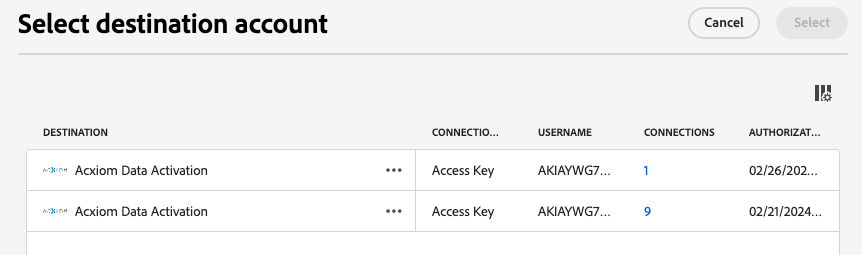
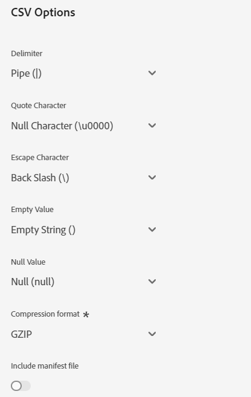

# [!DNL Acxiom Data Enhancement] målanslutning

>[!NOTE]
>
>The [!DNL Acxiom Data Enhancement] målet är i betaversion.  Den här målanslutningen och dokumentationssidan skapas och underhålls av Acxiom-teamet. Om du har frågor eller uppdateringsfrågor kan du kontakta dem direkt på acxiom-adobe-help@acxiom.com.

## Översikt {#overview}

Använd Acxiom Data Enhancement-kontakten för att förse dina Adobe-profiler med ytterligare beskrivande data som kan användas i analytiska, segmenterade och målinriktade program. Med hundratals tillgängliga element kan användarna segmentera och modellera data bättre, vilket ger mer korrekt målinriktning och prediktiv modellering.

Den här självstudiekursen innehåller steg för att skapa en [!DNL Acxiom Data Enhancement] målanslutning och dataflöde med Adobe Experience Platform användargränssnitt.  Den här kopplingen används för att leverera data till Acxiom-förbättringstjänsten med Amazon S3 som utgångspunkt.

## Användningsfall {#use-cases}

För att du bättre ska förstå hur och när du ska använda Acxiom Data Enhancement-målet finns det exempel på användningsområden som Adobe Experience Platform-kunder kan lösa genom att använda den här destinationen.

### Förbättra kunddata {#enhance-customer-data}

Denna koppling ska användas av marknadsförare som vill förbättra effektiviteten i sina utåtriktade strategier genom att lägga till utvalda beskrivande element i Adobe-profiler och använda dessa för att bättre målinrikta kampanjer.

Som marknadsförare kanske du vill fördjupa din förståelse för era befintliga målgrupper genom att förbättra deras profiler med ytterligare data. Om du gör det kommer ni att förbättra era segmenterings- och målinriktningsstrategier, vilket leder till en ökad personalisering och konvertering av kampanjer.

Användningsexemplet körs genom en kombination av både mål- och källanslutningar.

Du börjar med att exportera dina befintliga kundposter för anrikning med den här målkopplingen. Acxioms tjänst skulle söka efter filen, hämta den, berika den med data från Acxiom och generera en fil.

Kunden skulle sedan använda motsvarande källkort för Acxiom Data Ingakes för att importera de hydratiserade kundprofilerna tillbaka till Adobe Real-Time CDP.

## Förutsättningar {#prerequisites}

>[!IMPORTANT]
>
>* Om du vill ansluta till målet behöver du **[!UICONTROL View Destinations]** och **[!UICONTROL Manage Destinations]**, **[!UICONTROL Activate Destinations]**, **[!UICONTROL View Profiles]** och **[!UICONTROL View Segments]** [behörigheter för åtkomstkontroll](/help/access-control/home.md#permissions). Läs [åtkomstkontroll - översikt](/help/access-control/ui/overview.md) eller kontakta produktadministratören för att få de behörigheter som krävs.
>* Exportera *identiteter* behöver du **[!UICONTROL View Identity Graph]** [behörighet för åtkomstkontroll](/help/access-control/home.md#permissions).   {width="100" zoomable="yes"}

## Målgrupper {#supported-audiences}

I det här avsnittet beskrivs vilken typ av målgrupper du kan exportera till det här målet.

| Målgruppsursprung | Stöds | Beskrivning |
|-----------------------------|-----------|---------------------------------------------------------------------------------------------------------------------|
| [!DNL Segmentation Service] | ✓ | Målgrupper som skapats genom Experience Platform [Segmenteringstjänst](../../../segmentation/home.md). |
| Anpassade överföringar | x | Målgrupper [importerad](../../../segmentation/ui/overview.md#import-audience) till Experience Platform från CSV-filer. |

{style="table-layout:auto"}

## Exportera typ och frekvens {#export-type-frequency}

Se tabellen nedan för information om exporttyp och frekvens för destinationen.

| Objekt | Typ | Anteckningar |
|------------------|--------------------------------|------------------------------------------------------------------------------------------------------------------------------------------------------------------------------------------------------------------------------------------------------------------------------------------------------------------------|
| Exporttyp | **[!UICONTROL Profile-based]** | Du exporterar alla medlemmar i ett segment tillsammans med de önskade schemafälten (t.ex. e-postadress, telefonnummer, efternamn), som du har valt på skärmen Välj profilattribut i [arbetsflöde för målaktivering](/help/destinations/ui/activate-batch-profile-destinations.md#select-attributes). |
| Exportfrekvens | **[!UICONTROL Batch]** | Batchdestinationer exporterar filer till efterföljande plattformar i steg om tre, sex, åtta, tolv eller tjugofyra timmar. Läs mer om [gruppfilsbaserade mål](/help/destinations/destination-types.md#file-based). |

{style="table-layout:auto"}

## Anslut till målet {#connect}

>[!IMPORTANT]
>
>Om du vill ansluta till målet behöver du **[!UICONTROL View Destinations]** och **[!UICONTROL Manage and Activate Dataset Destinations]** [behörigheter för åtkomstkontroll](/help/access-control/home.md#permissions). Läs [åtkomstkontroll - översikt](/help/access-control/ui/overview.md) eller kontakta produktadministratören för att få de behörigheter som krävs.

### Autentisera till mål {#authenticate}

Om du vill autentisera mot målet fyller du i de obligatoriska fälten och väljer **[!UICONTROL Connect to destination]**.

För att få åtkomst till din bucket på Experience Platform måste du ange giltiga värden för följande autentiseringsuppgifter:

| Autentiseringsuppgifter | Beskrivning |
|---------------|----------------------------------------------------------------------------------------------------------|
| S3-åtkomstnyckel | Åtkomstnyckel-ID för din bucket. Du kan hämta det här värdet från [!DNL Acxiom] team. |
| S3-hemlig nyckel | Det hemliga nyckel-ID:t för din bucket. Du kan hämta det här värdet från [!DNL Acxiom] team. |
| Buckennamn | Det här är din bucket där filer delas. Du kan hämta det här värdet från [!DNL Acxiom] team. |

### Nytt konto

Så här definierar du en ny plats för hanterad Acxiom S3:

### Befintligt konto

Konton som redan har definierats med Acxiom Data Enhancement Card visas i en listruta och när de har valts visas information om kontot.  Detta visas nedan i exemplet från användargränssnittet när du navigerar till **Destinationer** > **Konton**;

### Fyll i målinformation {#destination-details}

Om du vill konfigurera information för målet fyller du i de obligatoriska och valfria fälten nedan. En asterisk bredvid ett fält i användargränssnittet anger att fältet är obligatoriskt.

* **Namn (obligatoriskt)** - Namnet som målet sparas under
* **Beskrivning** - Kortfattad förklaring av syftet med destinationen
* **Bucketnamn (obligatoriskt)** - Namn på den Amazon S3-bucket som konfigurerats på S3
* **Mappsökväg (obligatoriskt)** - Om underkataloger i en bucket används måste en sökväg definieras, eller &#39;/&#39; för att referera till rotsökvägen.
* **Filtyp** - Välj det format som Experience Platform ska använda för de exporterade filerna. För närvarande är CSV den enda filtypen som Acxiom-bearbetning kan förväntas vara

>[!IMPORTANT]
>
>När du väljer CSV-alternativet *Avgränsare*, *Citattecken*, *Escape-tecken*, *Tomt värde*, *Null-värde*, *Komprimeringsformat* och *Inkludera manifestfil* kommer att visas, och i följande dokument förklaras dessa inställningar mer ingående: [konfigurera formateringsalternativen](../../ui/batch-destinations-file-formatting-options.md).

### Aktivera aviseringar {#enable-alerts}

Du kan aktivera varningar för att få meddelanden om dataflödets status till ditt mål. Välj en avisering i listan om du vill prenumerera och få meddelanden om statusen för ditt dataflöde. Mer information om varningar finns i guiden på [prenumerera på destinationsvarningar med användargränssnittet](../../ui/alerts.md).

När du är klar med informationen för målanslutningen väljer du **[!UICONTROL Next]**.

## Aktivera målgrupper till det här målet {#activate}

>[!IMPORTANT]
>
>* För att aktivera data behöver du **[!UICONTROL View Destinations]**, **[!UICONTROL Activate Destinations]**, **[!UICONTROL View Profiles]** och **[!UICONTROL View Segments]** [behörigheter för åtkomstkontroll](/help/access-control/home.md#permissions). Läs [åtkomstkontroll - översikt](/help/access-control/ui/overview.md) eller kontakta produktadministratören för att få de behörigheter som krävs.
>* Exportera *identiteter* behöver du **[!UICONTROL View Identity Graph]** [behörighet för åtkomstkontroll](/help/access-control/home.md#permissions).   {width="100" zoomable="yes"}

Läs [Aktivera målgruppsdata för att batchprofilera exportmål](/help/destinations/ui/activate-batch-profile-destinations.md) för instruktioner om hur du aktiverar målgrupper till det här målet.

### Mappningsförslag

För att filerna på Acxiom-sidan ska kunna bearbetas på rätt sätt krävs namn- och adresselement. Även om det inte krävs alla element, kommer det att vara till hjälp att matchningen blir så framgångsrik som möjligt om alla delar anges.

Mappningsförslag ges i tabellen nedan som listar de attribut på målsidan som används av Acxiom-bearbetning som kunder kan mappa profilattribut till. Behandla dessa element som förslag eftersom inte alla element är obligatoriska och källvärdena beror på kontots behov.

| Målfält | Källbeskrivning |
|--------------|-------------------------------------------------------------|
| name | Värdet för person.name.fullName i Experience Platform. |
| firstName | Värdet för person.name.firstName i Experience Platform. |
| lastName | Värdet för person.name.lastName i Experience Platform. |
| adress1 | Värdet för mailAddress.street1 i Experience Platform. |
| adress2 | Värdet för mailAddress.street2 i Experience Platform. |
| stad | Värdet för mailAddress.city i Experience Platform. |
| läge | Värdet för mailAddress.state i Experience Platform. |
| zip | Värdet för mailingAddress.mailCode i Experience Platform. |

>[!NOTE]
>
>Om du mappar ytterligare fält som inte finns med ovan i dataflödet inkluderas de i dataexporten, men ignoreras av Acxiom-bearbetningen.

## Validera dataexport {#exported-data}

Kontrollera dina [!DNL Amazon S3 Storage] och se till att de exporterade filerna innehåller de förväntade profilpopulationerna.

## Nästa steg

Genom att följa den här självstudiekursen har du skapat ett dataflöde för att exportera profildata från Experience Platform till [!DNL Acxiom] hanterad S3-plats. Därefter kontaktar du din Acxiom-representant med namnet på kontot, filnamnen och bucket-sökvägen så att bearbetningen kan konfigureras.

## Dataanvändning och styrning {#data-usage-governance}

Alla [!DNL Adobe Experience Platform] destinationerna är kompatibla med dataanvändningsprinciper när data hanteras. Detaljerad information om hur [!DNL Adobe Experience Platform] använder datastyrning, läs [Datastyrning - översikt](/help/data-governance/home.md).

## Ytterligare resurser {#additional-resources}

*Acxiom InfoBase:* https://www.acxiom.com/wp-content/uploads/2022/02/fs-acxiom-infobase_AC-0268-22.pdf
