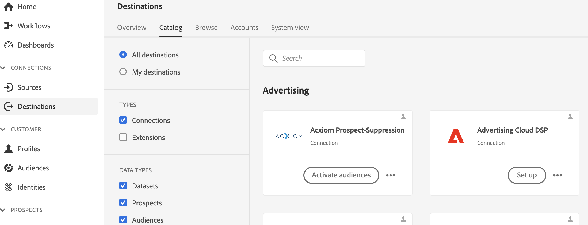

# [!DNL Acxiom Prospect-Suppression] målanslutning

>[!NOTE]
>
>The [!DNL Acxiom Prospect-Suppression] målet är i betaversion. Den här målanslutningen och dokumentationssidan skapas och underhålls av Acxiom-teamet. Om du har frågor eller uppdateringsfrågor kan du kontakta dem direkt på acxiom-adobe-help@acxiom.com.

## Översikt {#overview}

Använd [!DNL Acxiom Prospect-Suppression] att leverera de mest produktiva målgrupperna. Denna koppling exporterar data från Real-time Customer Data Platform och kör dem på ett säkert sätt via en prisbelönt hygien- och identitetsupplösning som producerar en datafil som ska användas som en undertryckningslista. Detta kommer att matchas mot [!DNL Acxiom Global] databas som gör det möjligt att anpassa listor med potentiella kunder för import. Använd sedan [[!DNL Acxiom Prospecting Data Import]](/help/sources/connectors/data-partners/acxiom-prospecting-data-import.md) källanslutning till listor med potentiella kunder från Acxiom tillbaka till Real-Time CDP, där dina kända eller konverterade kunder tas bort.

Acxiom erbjuder branschens mest framgångsrika målgrupper med över 12 000 globala dataattribut som är särskilt inriktade på att leverera personaliserade upplevelser. Utnyttja obegränsade kombinationer av högkvalitativa data för att skapa och distribuera målgrupper för specifika kampanjbehov.

Den här självstudiekursen innehåller steg för att skapa en [!DNL Acxiom Prospect-Suppression] målanslutning och dataflöde med Adobe Experience Platform användargränssnitt. Den här kopplingen används för att leverera data till tjänsten för potentiella kunder i Acxiom med Amazon S3 som utgångspunkt. Kontakta din kontorepresentant för Acxiom när du har börjat exportera filer till Amazon S3-släpppunkten.

## Användningsfall {#use-cases}

För att du bättre ska förstå hur och när du ska använda [!DNL Acxiom Prospect-Suppression] mål, här är exempel på användningsområden som Adobe Experience Platform-kunder kan lösa genom att använda denna destination.

### Skapa en undertryckningslista för datauppsättningar för prospektering {#create-suppression-list}

Marknadsförare som vill effektivisera sina utåtriktade strategier använder ofta att skapa en undertryckningslista. Denna förteckning omfattar befintliga kunder och specifika segment, vilket säkerställer att de inte omfattas av prospekteringsverksamhet under riktade kampanjer. Denna strategiska strategi hjälper till att förfina målgruppen, undviker överflödig kommunikation och bidrar till en mer fokuserad och effektiv marknadsföring.

Som marknadsförare kanske ni vill bredda er kampanjräckvidd genom att lägga till riktade profiler för potentiella kunder till era kampanjer baserat på de segmenterings- och undertryckningskriterier som ni har angett.

Användningsexemplet körs genom en kombination av både mål- och källanslutningar.

Du börjar först med att exportera dina befintliga kundprofiler med den här målkopplingen som ska användas som en undertryckningsfil. Detta säkerställer att inga befintliga kundposter inkluderas.

Acxioms tjänst skulle söka efter filen, hämta den och använda den tillsammans med andra urvalskriterier och generera en potentiell fil. Sedan använder du motsvarande [[!DNL Acxiom Prospecting Data Import]](/help/sources/connectors/data-partners/acxiom-prospecting-data-import.md) källanslutning för att importera profiler för potentiella kunder till Adobe Real-Time CDP.

## Förutsättningar {#prerequisites}

>[!IMPORTANT]
>
>* Om du vill ansluta till målet behöver du **[!UICONTROL View Destinations]** och **[!UICONTROL Manage Destinations]**, **[!UICONTROL Activate Destinations]**, **[!UICONTROL View Profiles]** och **[!UICONTROL View Segments]** [behörigheter för åtkomstkontroll](/help/access-control/home.md#permissions). Läs [åtkomstkontroll - översikt](/help/access-control/ui/overview.md) eller kontakta produktadministratören för att få de behörigheter som krävs.
>* Exportera *identiteter* behöver du **[!UICONTROL View Identity Graph]** [behörighet för åtkomstkontroll](/help/access-control/home.md#permissions).   {width="100" zoomable="yes"}

## Målgrupper {#supported-audiences}

I det här avsnittet beskrivs vilken typ av målgrupper du kan exportera till det här målet.

| Målgruppsursprung | Stöds | Beskrivning |
|-----------------------------|-----------|---------------------------------------------------------------------------------------------------------------------|
| [!DNL Segmentation Service] | ✓ | Målgrupper som skapats genom Experience Platform [Segmenteringstjänst](../../../segmentation/home.md). |
| Anpassade överföringar | x | Målgrupper [importerad](../../../segmentation/ui/overview.md#import-audience) till Experience Platform från CSV-filer. |

{style="table-layout:auto"}

## Exportera typ och frekvens {#export-type-frequency}

Se tabellen nedan för information om exporttyp och frekvens för destinationen.

| Objekt | Typ | Anteckningar |
|------------------|--------------------------------|------------------------------------------------------------------------------------------------------------------------------------------------------------------------------------------------------------------------------------------------------------------------------------------------------------------------|
| Exporttyp | **[!UICONTROL Profile-based]** | Du exporterar alla medlemmar i ett segment tillsammans med de önskade schemafälten (t.ex. e-postadress, telefonnummer, efternamn), som du har valt på skärmen Välj profilattribut i [arbetsflöde för målaktivering](/help/destinations/ui/activate-batch-profile-destinations.md#select-attributes). |
| Exportfrekvens | **[!UICONTROL Batch]** | Batchdestinationer exporterar filer till efterföljande plattformar i steg om tre, sex, åtta, tolv eller tjugofyra timmar. Läs mer om [gruppfilsbaserade mål](/help/destinations/destination-types.md#file-based). |

{style="table-layout:auto"}

## Anslut till målet {#connect}

>[!IMPORTANT]
> 
>Om du vill ansluta till målet behöver du **[!UICONTROL View Destinations]** och **[!UICONTROL Manage Destinations]** [behörigheter för åtkomstkontroll](/help/access-control/home.md#permissions). Läs [åtkomstkontroll - översikt](/help/access-control/ui/overview.md) eller kontakta produktadministratören för att få de behörigheter som krävs.

Om du vill ansluta till det här målet följer du stegen som beskrivs i [självstudiekurs om destinationskonfiguration](../../ui/connect-destination.md). I arbetsflödet för målkonfiguration fyller du i fälten som listas i de två avsnitten nedan.

### Autentisera till mål {#authenticate}

Om du vill autentisera mot målet fyller du i de obligatoriska fälten och väljer **[!UICONTROL Connect to destination]**.

För att få åtkomst till din bucket på Experience Platform måste du ange giltiga värden för följande autentiseringsuppgifter:

| Autentiseringsuppgifter | Beskrivning |
|---------------|----------------------------------------------------------------------------------------------------------|
| S3-åtkomstnyckel | Åtkomstnyckel-ID för din bucket. Du kan hämta det här värdet från [!DNL Acxiom] team. |
| S3-hemlig nyckel | Det hemliga nyckel-ID:t för din bucket. Du kan hämta det här värdet från [!DNL Acxiom] team. |
| Buckennamn | Det här är din bucket där filer delas. Du kan hämta det här värdet från [!DNL Acxiom] team. |

### Nytt konto

Så här definierar du en ny plats för hanterad Acxiom S3:

### Befintligt konto

Konton som redan har definierats med Acxiom Prospect-Suppression-kortet visas i en listruta och när det är markerat visas information om kontot.  Detta visas nedan i exemplet från användargränssnittet när du navigerar till **Destinationer** > **Konton**;

### Fyll i målinformation {#destination-details}

Om du vill konfigurera information för målet fyller du i de obligatoriska och valfria fälten nedan. En asterisk bredvid ett fält i användargränssnittet anger att fältet är obligatoriskt.

* **Namn (obligatoriskt)** - Namnet som målet sparas under
* **Beskrivning** - Kortfattad förklaring av syftet med destinationen
* **Bucketnamn (obligatoriskt)** - Namn på den Amazon S3-bucket som konfigurerats på S3
* **Mappsökväg (obligatoriskt)** - Om underkataloger i en bucket används måste en sökväg definieras, eller &#39;/&#39; för att referera till rotsökvägen.
* **Filtyp** - Välj det format som Experience Platform ska använda för de exporterade filerna. För närvarande är CSV den enda filtypen som Acxiom-bearbetning kan förväntas vara

>[!IMPORTANT]
>
>När du väljer CSV-alternativet *Avgränsare*, *Citattecken*, *Escape-tecken*, *Tomt värde*, *Null-värde*, *Komprimeringsformat* och *Inkludera manifestfil* kommer att visas, och i följande dokument förklaras dessa inställningar mer ingående: [konfigurera formateringsalternativen](../../ui/batch-destinations-file-formatting-options.md).

### Aktivera aviseringar {#enable-alerts}

Du kan aktivera varningar för att få meddelanden om dataflödets status till ditt mål. Välj en avisering i listan om du vill prenumerera och få meddelanden om statusen för ditt dataflöde. Mer information om varningar finns i guiden på [prenumerera på destinationsvarningar med användargränssnittet](../../ui/alerts.md).

När du är klar med informationen för målanslutningen väljer du **[!UICONTROL Next]**.

## Aktivera målgrupper till det här målet {#activate}

>[!IMPORTANT]
>
>* För att aktivera data behöver du **[!UICONTROL View Destinations]**, **[!UICONTROL Activate Destinations]**, **[!UICONTROL View Profiles]** och **[!UICONTROL View Segments]** [behörigheter för åtkomstkontroll](/help/access-control/home.md#permissions). Läs [åtkomstkontroll - översikt](/help/access-control/ui/overview.md) eller kontakta produktadministratören för att få de behörigheter som krävs.
>* Exportera *identiteter* behöver du **[!UICONTROL View Identity Graph]** [behörighet för åtkomstkontroll](/help/access-control/home.md#permissions).   {width="100" zoomable="yes"}

Läs [Aktivera målgruppsdata för att batchprofilera exportmål](/help/destinations/ui/activate-batch-profile-destinations.md) för instruktioner om hur du aktiverar målgrupper till det här målet.

### Mappningsförslag

Bearbetning kräver namn- och adresselement, men alla element krävs inte, förutsatt att så mycket som möjligt hjälper till med matchningen.  Mappningsförslag ges i tabellen nedan som listar de attribut på målsidan som används av Acxiom-bearbetning som kunder kan mappa profilattribut till.  Detta bör behandlas som förslag eftersom inte alla element är obligatoriska och källvärdena beror på kontots behov.

| Målfält | Källbeskrivning |
|--------------|-------------------------------------------------------------|
| name | Värdet för person.name.fullName i Experience Platform. |
| firstName | Värdet för person.name.firstName i Experience Platform. |
| lastName | Värdet för person.name.lastName i Experience Platform. |
| adress1 | Värdet för mailAddress.street1 i Experience Platform. |
| adress2 | Värdet för mailAddress.street2 i Experience Platform. |
| stad | Värdet för mailAddress.city i Experience Platform. |
| läge | Värdet för mailAddress.state i Experience Platform. |
| zip | Värdet för mailingAddress.mailCode i Experience Platform. |

{style="table-layout:auto"}

>[!NOTE]
>
>Ytterligare fält som inte anges ovan inkluderas i exporten, men ignoreras av Acxiom-bearbetningen.

## Granska ditt dataflöde

Använd granskningssidan för att få en sammanfattning av dataflödet innan du skickar in det

## Validera dataexport {#exported-data}

Kontrollera dina [!DNL Amazon S3 Storage] och se till att de exporterade filerna innehåller de förväntade profilpopulationerna.

## Nästa steg

Genom att följa den här självstudiekursen har du skapat ett dataflöde för att exportera batchdata från Experience Platform till [!DNL Acxiom] hanterad S3-plats. Du måste kontakta din Acxiom-representant med namnet på kontot, filnamnet och bucket-sökvägen så att bearbetningen kan konfigureras.

## Dataanvändning och styrning {#data-usage-governance}

Alla [!DNL Adobe Experience Platform] destinationerna är kompatibla med dataanvändningsprinciper när data hanteras. Detaljerad information om hur [!DNL Adobe Experience Platform] använder datastyrning, läs [Datastyrning - översikt](/help/data-governance/home.md).

## Ytterligare resurser {#additional-resources}

*Acxiom Audience Data and Distribution:* https://www.acxiom.com/customer-data/audience-data-distribution/
