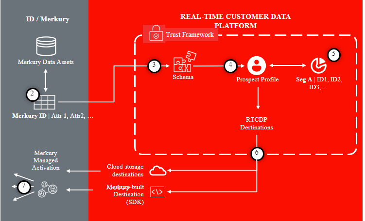
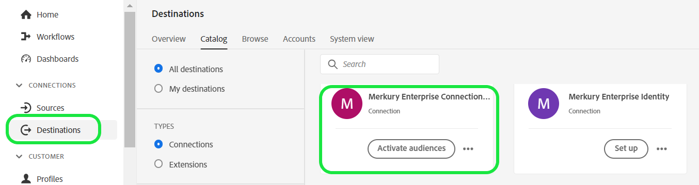
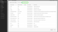
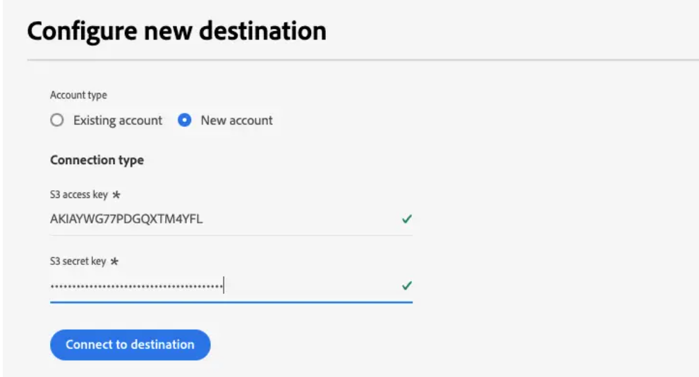

# Merkury Enterprise Connections Destination

>[!NOTE]
>
>Målanslutningen och dokumentationssidan skapas och underhålls av [!DNL Merkury]-teamet. Kontakta din [!DNL Merkury]-kontorepresentant om du har frågor eller uppdateringsfrågor.

## Översikt {#overview}

Använd destinationen [!DNL Merkury Enterprise Connections] för att leverera målgrupper till [!DNL Merkury] på ett säkert sätt. Med [!DNL Merkury] kan marknadsförarna enkelt matcha och leverera personbaserade målgrupper till mer än 80 premiumadresserbara TV-/CTV-anslutningar, utgivare och reklamtekniska anslutningar för [!DNL Merkury]. [!DNL Merkury] drivs av ett omfattande identitetsdiagram med vuxna kunder i USA som innehåller fler än 268 miljoner människor.

Följ stegen på den här dokumentationssidan för att skapa en [!DNL Merkury Connections]-målanslutning och aktivera målgrupper med användargränssnittet i [!DNL Adobe Experience Platform].

>[!NOTE]
>
>Om du vill aktivera målgrupper till mediemål med ditt [!DNL Merkury Connect]-konto ska du använda [!DNL Merkury Connections]-målet i stället.

## Användningsfall {#use-cases}

* **Aktivering av digitala media**: Enkel matchning och leverans av målgruppsprofiler till mer än 50 premiumadresserbara utgivare och AD-Tech-anslutningar i [!DNL Merkury].
* **Förbättra effektiviteten**: Förbättra er räckvidd för cookie-fria, adresserbara medier, förbättra effektiviteten i målinriktningen och avkastningen på Advertising-utgifter (ROAS).

## Förutsättningar {#prerequisites}

>[!IMPORTANT]
>
>* Om du vill ansluta till målet behöver du **Visa mål** och **Hantera mål**, **Aktivera mål**, **Visa profiler** och **Visa segment** [[åtkomstkontrollbehörighet]](https://experienceleague.adobe.com/sv/docs/experience-platform/access-control/home#permissions). Läs [[översikt över åtkomstkontroll]](https://experienceleague.adobe.com/sv/docs/experience-platform/access-control/ui/overview) eller kontakta produktadministratören för att få den behörighet som krävs.
>* Om du vill exportera *identiteter* behöver du **Visa identitetsdiagram** [[behörighet för åtkomstkontroll]](https://experienceleague.adobe.com/sv/docs/experience-platform/access-control/home#permissions).\

## Identiteter som stöds {#supported-identities}

| Målidentitet | Beskrivning | Överväganden |
|---|---|---|
| GAID | GOOGLE ADVERTISING ID | Välj målidentiteten för GAID när källidentiteten är ett GAID-namnområde. |
| IDFA | Apple ID för annonsörer | Välj IDFA-målidentitet när din källidentitet är ett IDFA-namnutrymme. |
| ECID | EXPERIENCE CLOUD ID | Ett namnutrymme som representerar ECID. Detta namnområde kan också refereras till av följande alias: Adobe Marketing Cloud ID, [!DNL Adobe Experience Cloud] ID, [!DNL Adobe Experience Platform] ID. Mer information finns i följande dokument på [ECID](/help/identity-service/features/ecid.md). |
| phone_sha256 | Telefonnummer hashas med SHA256-algoritmen | Både oformaterad text och SHA256-hashade telefonnummer stöds av [!DNL Adobe Experience Platform]. Om källfältet innehåller ohashade attribut bör du kontrollera alternativet **[!UICONTROL Apply transformation]** så att [!DNL Experience Platform] automatiskt hash-kodar data vid aktiveringen. |
| email_lc_sha256 | E-postadresser som hashas med SHA256-algoritmen | Både oformaterad text och SHA256-hash-adresser stöds av [!DNL Adobe Experience Platform]. Om källfältet innehåller ohashade attribut bör du kontrollera alternativet **[!UICONTROL Apply transformation]** så att [!DNL Experience Platform] automatiskt hash-kodar data vid aktiveringen. |
| extern_id | Anpassade användar-ID:n | Välj den här målidentiteten när källidentiteten är ett anpassat namnutrymme. |

{style="table-layout:auto"}

## Målgrupper {#supported-audiences}

I det här avsnittet beskrivs vilken typ av målgrupper du kan exportera till det här målet.

| Målgruppsursprung | Stöds | Beskrivning |
|---------|----------|----------|
| [!DNL Segmentation Service] | Ja | Publiker som genererats via Experience Platform [segmenteringstjänst](../../../segmentation/home.md). |
| Alla andra målgrupper kommer | Nej | Den här kategorin omfattar alla målgrupper som kommer utanför målgrupper som genereras via [!DNL Segmentation Service]. Läs om de [olika målgruppernas ursprung](/help/segmentation/ui/audience-portal.md#customize). Några exempel är: <ul><li> anpassade uppladdningsgrupper [importerade](../../../segmentation/ui/audience-portal.md#import-audience) till Experience Platform från CSV-filer,</li><li> lookalike-målgrupper, </li><li> federerade målgrupper, </li><li> målgrupper som har genererats i andra Experience Platform-appar som [!DNL Adobe Journey Optimizer], </li><li> med mera. </li></ul> |

{style="table-layout:auto"}

Målgrupper som stöds av olika typer av målgruppsdata:

| Typ av målgruppsdata | Stöds | Beskrivning | Användningsfall |
|--------------------|-----------|-------------|-----------|
| [Målgrupper](/help/segmentation/types/people-audiences.md) | Ja | Baserat på kundprofiler kan ni inrikta er på specifika grupper av människor för marknadsföringskampanjer. | Ofta köpare, övergivna varukorgar |
| [Kontomålgrupper](/help/segmentation/types/account-audiences.md) | Nej | Rikta er till individer inom specifika organisationer för kontobaserade marknadsföringsstrategier. | B2B-marknadsföring |
| [Prospektera målgrupper](/help/segmentation/types/prospect-audiences.md) | Nej | Rikta er till individer som ännu inte är kunder men som delar egenskaper med er målgrupp. | Prospektera med data från tredje part |
| [Datauppsättningsexport](/help/catalog/datasets/overview.md) | Nej | Samlingar med strukturerade data lagrade i datasjön [!DNL Adobe Experience Platform]. | Arbetsflöden för rapportering, datavetenskap |

{style="table-layout:auto"}

## Exportera typ och frekvens {#export-type-frequency}

Se tabellen nedan för information om exporttyp och frekvens för destinationen.

| **Objekt** | **Typ** | **Anteckningar** |
|---|---|---|  
| Exporttyp | **Profilbaserad** | Du exporterar alla medlemmar i ett segment tillsammans med de önskade schemafälten (till exempel e-postadress, telefonnummer, efternamn), som du har valt på skärmen Välj profilattribut i arbetsflödet för [[målaktivering]](https://experienceleague.adobe.com/sv/docs/experience-platform/destinations/ui/activate/activate-batch-profile-destinations#select-attributes). |
| Frekvens | **Gruppera** | Batchdestinationer exporterar filer till efterföljande plattformar i steg om tre, sex, åtta, tolv eller tjugofyra timmar. Läs mer om [[gruppfilsbaserade frekvensmål]](https://experienceleague.adobe.com/sv/docs/experience-platform/destinations/destination-types#file-based). |

{style="table-layout:auto"}

## Anslut till målet {#connect}

>[!IMPORTANT]
>
>Om du vill ansluta till målet behöver du **Visa mål** och **Hantera och aktivera datamängdsmål** [[åtkomstkontrollbehörighet]](https://experienceleague.adobe.com/sv/docs/experience-platform/access-control/home#permissions). Läs [[översikt över åtkomstkontroll]](https://experienceleague.adobe.com/sv/docs/experience-platform/access-control/ui/overview) eller kontakta produktadministratören för att få den behörighet som krävs.

Om du vill ansluta till det här målet följer du stegen som beskrivs i självstudiekursen för [[destinationskonfiguration]](https://experienceleague.adobe.com/sv/docs/experience-platform/destinations/ui/connect-destination). I arbetsflödet för målkonfiguration fyller du i fälten som listas i de två avsnitten nedan.

### Autentisera till mål {#authenticate}

Om du vill autentisera mot målet fyller du i de obligatoriska fälten och väljer **Anslut till mål**.

Du måste ange giltiga värden för följande autentiseringsuppgifter för att få åtkomst till din bucket på Experience Platform:

| **Autentiseringsuppgifter** | **Beskrivning** |
|---|---|
| Åtkomstnyckel | Åtkomstnyckel-ID för din bucket. Du kan hämta värdet från Merkury-teamet. |
| Hemlig nyckel | Det hemliga nyckel-ID:t för din bucket. Du kan hämta värdet från Merkury-teamet. |
| Buckennamn | Det här är din bucket där filer delas. Du kan hämta värdet från Merkury-teamet. |

{style="table-layout:auto"}

### Fyll i målinformation {#destination-details}

Om du vill konfigurera information för målet fyller du i de obligatoriska och valfria fälten nedan. En asterisk bredvid ett fält i användargränssnittet anger att fältet är obligatoriskt.

* **Namn (obligatoriskt)** - Namnet som målet sparas under
* **Beskrivning** - En kort förklaring av målets syfte
* **Bucket Name (Required)** - Namn på Amazon S3-bucket som konfigurerats på S3
* **Mappsökväg (obligatoriskt)** - Om underkataloger i en bucket används måste en sökväg definieras, eller &#39;/&#39; för att referera till rotsökvägen.
* **Filtyp** - Välj det format som Experience Platform ska använda för de exporterade filerna. Kontakta ditt Merkury-team för att få information om den förväntade filtypen för ditt konto.

>[!NOTE]
>
>När du väljer CSV-alternativet, Avgränsare, Offerttecken, Escape-tecken, Tomt värde, Null-värde, Komprimeringsformat och Inkludera manifestfil visas kontaktar du ditt Merkury-team för att få lämpliga inställningar för ditt konto.

### Befintligt konto {#existing-account}

Konton som redan har definierats med målet Merkury Enterprise Connections visas i en listruta. När du väljer det här alternativet visas information om kontot i den högra listen. Visa exemplet från gränssnittet när du navigerar till **Destinationer** > **Konton**:

## Aktivera aviseringar {#enable-alerts}

Du kan aktivera varningar för att få meddelanden om dataflödets status till ditt mål. Välj en avisering i listan om du vill prenumerera och få meddelanden om statusen för ditt dataflöde. Mer information om varningar finns i guiden [prenumerera på destinationsvarningar med användargränssnittet](https://experienceleague.adobe.com/sv/docs/experience-platform/destinations/ui/alerts).

Välj **Nästa** när du är klar med informationen om målanslutningen.

## Aktivera målgrupper till det här målet {#activate}

>[!IMPORTANT]
>
>* Om du vill aktivera data måste du ha åtkomstkontrollsbehörigheterna **Visa mål**, **Aktivera mål**, **Visa profiler** och **Visa segment**. Läs översikten över åtkomstkontrollen eller kontakta produktadministratören för att få den behörighet som krävs.
>* Om du vill exportera identiteter måste du ha åtkomstkontrollsbehörigheten **Visa identitetsdiagram**.

Läs [Aktivera målgruppsdata för att batchprofilera exportmål](https://experienceleague.adobe.com/sv/docs/experience-platform/destinations/ui/activate/activate-batch-profile-destinations) om du vill ha instruktioner om hur du aktiverar målgrupper till det här målet.

## Mappningsförslag {#mapping-suggestions}

Korrekt bearbetning av filer på [!DNL Merkury]-sidan kräver namn- och adresselement. Även om det inte krävs alla element, kommer det att vara till hjälp att matchningen blir så framgångsrik som möjligt om alla delar anges.

Mappningsförslag ges i tabellen nedan som listar de attribut på målsidan som används av [!DNL Merkury]-bearbetning som kunder kan mappa profilattribut till. Behandla dessa element som förslag eftersom inte alla element är obligatoriska, och källvärdena beror på kontots behov.

| Målfält | Source Description |
|---|---|
| id | Identitetsfält som ska användas för att mappa [!DNL Merkury]-data till Experience Platform via Source-anslutningen [!DNL Merkury Enterprise Identity] |
| Input_First_Name | Värdet `person.name.firstName` i Experience Platform. |
| Input_Last_Name | Värdet `person.name.lastName` i Experience Platform. |
| Input_Address_Line_1 | Värdet `mailingAddress.street` i Experience Platform. |
| Input_City | Värdet `mailingAddress.city` i Experience Platform. |
| Input_State_Province_Code | Värdet `mailingAddress.state` i Experience Platform. Använd det här alternativet om läget är i tvåteckenkodsformat. |
| Input_State_Province_Name | Värdet `mailingAddress.state` i Experience Platform. Använd om läget är det fullständiga lägesnamnet |
| Input_Postal_Code | Värdet `mailingAddress.postalCode` i Experience Platform. |
| Input_Email_Address | Värdet som du vill mappa som profilens e-postadress. |
| Input_Phone | Värdet som du vill mappa som profilens telefonnummer. |

{style="table-layout:auto"}

## Validera dataexport {#validate-data-export}

Kontrollera Amazon S3-lagringskassetten och se till att de exporterade filerna innehåller de förväntade profilpopulationerna för att kontrollera om data har exporterats utan fel.

## Dataanvändning och styrning {#data-usage-governance}

Alla [!DNL Adobe Experience Platform]-mål är kompatibla med dataanvändningsprinciper när data hanteras. Mer information om hur [!DNL Adobe Experience Platform] använder datastyrning finns i [Översikt över datastyrning](https://experienceleague.adobe.com/sv/docs/experience-platform/data-governance/home).

## Nästa steg {#next-steps}

Du har skapat ett dataflöde för att exportera profildata från Experience Platform till din [!DNL Merkury] hanterade S3-plats. Därefter måste du kontakta din [!DNL Merkury]-representant med namnet på kontot, filnamnen och bucket-sökvägen så att bearbetningen kan konfigureras.
