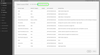

# Merkury Enterprise Connections Destination

>[!NOTE]
>
>Målanslutningen och dokumentationssidan skapas och underhålls av Merkury-teamet. Om du har frågor eller uppdateringsfrågor kontaktar du din kontorepresentant för Merkury.

## Översikt

Använd målet Merkury Enterprise Connections för att leverera målgrupper säkert till Merkury. Merkury erbjuder marknadsförare enkel matchning och leverans av personbaserade målgrupper till Merkurys mer än 80 premiumadresserbara TV-/CTV-, utgivare och reklamtekniska kontakter. Merkury drivs av ett omfattande amerikanskt foto med 268+ miljoner människor.

Följ stegen på den här dokumentationssidan för att skapa en Merkury Connections-målanslutning och aktivera målgrupper med Adobe Experience Platform användargränssnitt.

>[!NOTE]
>
>Om du vill aktivera målgrupper för mediedestinationer med ditt Merkury Connect-konto ska du använda vårt mål för Merkury Connections i stället.

## Användningsfall

* **Aktivering av digitala media**: Enkel matchning och leverans av era målgruppsprofiler till Merkurys över 50 premiumadresserbara utgivare och reklamtekniska anslutningar.
* **Förbättra effektiviteten**: Förbättra er räckvidd för medier som inte kräver cookies, förbättrar målgruppseffektiviteten och avkastningen på annonskostnaderna (ROAS).

## Förhandskrav

>[!IMPORTANT]
>
>* Om du vill ansluta till målet behöver du **Visa mål** och **Hantera mål**, **Aktivera destinationer**, **Visa profiler** och **Visa segment** [[behörigheter för åtkomstkontroll]](https://experienceleague.adobe.com/en/docs/experience-platform/access-control/home#permissions). Läs [[åtkomstkontroll översikt]](https://experienceleague.adobe.com/en/docs/experience-platform/access-control/ui/overview) eller kontakta produktadministratören för att få de behörigheter som krävs.
>* Exportera *identiteter* behöver du **Visa identitetsdiagram** [[åtkomstkontrollbehörighet]](https://experienceleague.adobe.com/en/docs/experience-platform/access-control/home#permissions).\

## Identiteter som stöds {#supported-identities}

| Målidentitet | Beskrivning | Överväganden |
|---|---|---|
| GAID | Google Advertising ID | Välj målidentiteten för GAID när källidentiteten är ett GAID-namnområde. |
| IDFA | Apple ID för annonsörer | Välj IDFA-målidentitet när din källidentitet är ett IDFA-namnutrymme. |
| ECID | EXPERIENCE CLOUD ID | Ett namnutrymme som representerar ECID. Detta namnutrymme kan även refereras av följande alias:&quot;Adobe Marketing Cloud ID&quot;,&quot;Adobe Experience Cloud ID&quot;,&quot;Adobe Experience Platform ID&quot;. Se följande dokument på [ECID](/help/identity-service/features/ecid.md) för mer information. |
| phone_sha256 | Telefonnummer hashas med SHA256-algoritmen | Både oformaterad text och SHA256-hashade telefonnummer stöds av Adobe Experience Platform. När källfältet innehåller ohash-kodade attribut markerar du **[!UICONTROL Apply transformation]** alternativ, att ha [!DNL Platform] automatiskt hash-koda data vid aktiveringen. |
| email_lc_sha256 | E-postadresser som hashas med SHA256-algoritmen | Både oformaterad text och SHA256-hashade e-postadresser stöds av Adobe Experience Platform. När källfältet innehåller ohash-kodade attribut markerar du **[!UICONTROL Apply transformation]** alternativ, att ha [!DNL Platform] automatiskt hash-koda data vid aktiveringen. |
| extern_id | Anpassade användar-ID:n | Välj den här målidentiteten när källidentiteten är ett anpassat namnutrymme. |

{style="table-layout:auto"}

## Målgrupper

I det här avsnittet beskrivs vilken typ av målgrupper du kan exportera till det här målet.

| **Målgrupp** | **Stöds** | **Beskrivning av ursprung** |
|---|---|---|      
| Segmenteringstjänst | ✓ | Målgrupper som skapats genom Experience Platform [[Segmenteringstjänst]](https://experienceleague.adobe.com/en/docs/experience-platform/segmentation/home). |
| Anpassade överföringar | X | Målgrupper [[importerad]](https://experienceleague.adobe.com/en/docs/experience-platform/segmentation/ui/overview#import-audience) till Experience Platform från CSV-filer. |

{style="table-layout:auto"}

## Exportera typ och frekvens

Se tabellen nedan för information om exporttyp och frekvens för destinationen.

| **Objekt** | **Typ** | **Anteckningar** |
|---|---|---|  
| Exporttyp | **Profilbaserad** | Du exporterar alla medlemmar i ett segment tillsammans med de önskade schemafälten (t.ex. e-postadress, telefonnummer, efternamn), som du har valt på skärmen Välj profilattribut i [[arbetsflöde för målaktivering]](https://experienceleague.adobe.com/en/docs/experience-platform/destinations/ui/activate/activate-batch-profile-destinations#select-attributes). |
| Frekvens | **Grupp** | Batchdestinationer exporterar filer till efterföljande plattformar i steg om tre, sex, åtta, tolv eller tjugofyra timmar. Läs mer om [[gruppfilsbaserade frekvensmål]](https://experienceleague.adobe.com/en/docs/experience-platform/destinations/destination-types#file-based). |

{style="table-layout:auto"}

## Anslut till målet

>[!IMPORTANT]
>
>Om du vill ansluta till målet behöver du **Visa mål** och **Hantera och aktivera datauppsättningsmål** [[behörigheter för åtkomstkontroll]](https://experienceleague.adobe.com/en/docs/experience-platform/access-control/home#permissions). Läs [[åtkomstkontroll översikt]](https://experienceleague.adobe.com/en/docs/experience-platform/access-control/ui/overview) eller kontakta produktadministratören för att få de behörigheter som krävs.

Om du vill ansluta till det här målet följer du stegen som beskrivs i [[självstudiekurs för destinationskonfiguration]](https://experienceleague.adobe.com/en/docs/experience-platform/destinations/ui/connect-destination). I arbetsflödet för målkonfiguration fyller du i fälten som listas i de två avsnitten nedan.

### Autentisera till mål

Om du vill autentisera mot målet fyller du i de obligatoriska fälten och väljer **Anslut till mål**.

Du måste ange giltiga värden för följande autentiseringsuppgifter för att få åtkomst till din bucket på Experience Platform:

| **Autentiseringsuppgifter** | **Beskrivning** |
|---|---|
| Åtkomstnyckel | Åtkomstnyckel-ID för din bucket. Du kan hämta värdet från Merkury-teamet. |
| Hemlig nyckel | Det hemliga nyckel-ID:t för din bucket. Du kan hämta värdet från Merkury-teamet. |
| Buckennamn | Det här är din bucket där filer delas. Du kan hämta värdet från Merkury-teamet. |

{style="table-layout:auto"}

### Fyll i målinformation

Om du vill konfigurera information för målet fyller du i de obligatoriska och valfria fälten nedan. En asterisk bredvid ett fält i användargränssnittet anger att fältet är obligatoriskt.

* **Namn (obligatoriskt)** - Namnet som målet sparas under
* **Beskrivning** - Kortfattad förklaring av syftet med destinationen
* **Bucketnamn (obligatoriskt)** - Namn på den Amazon S3-bucket som konfigurerats på S3
* **Mappsökväg (obligatoriskt)** - Om underkataloger i en bucket används måste en sökväg definieras, eller &#39;/&#39; för att referera till rotsökvägen.
* **Filtyp** - Välj det format som Experience Platform ska använda för de exporterade filerna. Kontakta ditt Merkury-team för att få information om den förväntade filtypen för ditt konto.

>[!NOTE]
>
>När du väljer CSV-alternativet, Avgränsare, Offerttecken, Escape-tecken, Tomt värde, Null-värde, Komprimeringsformat och Inkludera manifestfil visas, kan du kontakta ditt Merkury-team och be om lämpliga inställningar för ditt konto.

### Befintligt konto

Konton som redan har definierats med målet Merkury Enterprise Connections visas i en listruta. När du väljer det här alternativet visas information om kontot i den högra listen. Visa exemplet från gränssnittet när du navigerar till **Destinationer** > **Konton**;

## Aktivera aviseringar

Du kan aktivera varningar för att få meddelanden om dataflödets status till ditt mål. Välj en avisering i listan om du vill prenumerera och få meddelanden om statusen för ditt dataflöde. Mer information om varningar finns i guiden på [prenumerera på destinationsvarningar med användargränssnittet](https://experienceleague.adobe.com/en/docs/experience-platform/destinations/ui/alerts).

När du är klar med informationen för målanslutningen väljer du **Nästa**.

## Aktivera målgrupper till det här målet

>[!IMPORTANT]
>
>* Om du vill aktivera data måste du ha behörigheterna Visa mål, Aktivera mål, Visa profiler och Visa segment. Läs översikten över åtkomstkontrollen eller kontakta produktadministratören för att få den behörighet som krävs.
>* Om du vill exportera identiteter måste du ha behörigheten Visa identitetsdiagram.

Läs [Aktivera målgruppsdata för att batchprofilera exportmål](https://experienceleague.adobe.com/en/docs/experience-platform/destinations/ui/activate/activate-batch-profile-destinations) för instruktioner om hur du aktiverar målgrupper till det här målet.

## Mappningsförslag

Korrekt bearbetning av filer på Merkury-sidan kräver name- och address-element. Även om det inte krävs alla element, kommer det att vara till hjälp att matchningen blir så framgångsrik som möjligt om alla delar anges.

Mappningsförslag ges i tabellen nedan med en lista över de attribut på målsidan som används av Merkury-bearbetning som kunder kan mappa profilattribut till. Behandla dessa element som förslag eftersom inte alla element är obligatoriska, och källvärdena beror på kontots behov.

| Målfält | Källbeskrivning |
|---|---|
| id | Identitetsfält som ska användas för att mappa merkury-data till Experience Platform via kopplingen för Merkury Enterprise Identity Resolution Source |
| Input_First_Name | The `person.name.firstName` värde i Experience Platform. |
| Input_Last_Name | The `person.name.lastName` värde i Experience Platform. |
| Input_Address_Line_1 | The `mailingAddress.street` värde i Experience Platform. |
| Input_City | The `mailingAddress.city` värde i Experience Platform. |
| Input_State_Province_Code | The `mailingAddress.state` värde i Experience Platform. Använd det här alternativet om läget är i tvåteckenkodsformat. |
| Input_State_Province_Name | The `mailingAddress.state` värde i Experience Platform. Använd om läget är det fullständiga lägesnamnet |
| Input_Postal_Code | The `mailingAddress.postalCode` värde i Experience Platform. |
| Input_Email_Address | Värdet som du vill mappa som profilens e-postadress. |
| Input_Phone | Värdet som du vill mappa som profilens telefonnummer. |

{style="table-layout:auto"}

## Validera dataexport

Kontrollera Amazon S3-lagringskassetten och se till att de exporterade filerna innehåller de förväntade profilpopulationerna för att kontrollera om data har exporterats utan fel.

## Dataanvändning och styrning

Alla Adobe Experience Platform-destinationer följer dataanvändningsprinciper när data hanteras. Mer information om hur Adobe Experience Platform använder datastyrning finns i [Datastyrning - översikt](https://experienceleague.adobe.com/en/docs/experience-platform/data-governance/home).

## Nästa steg

I den här självstudiekursen har du skapat ett dataflöde för att exportera profildata från Experience Platform till din Merkury-hanterade S3-plats. Därefter kontaktar du Merkury-representanten med namnet på kontot, filnamnen och bucket-sökvägen så att bearbetningen kan konfigureras.