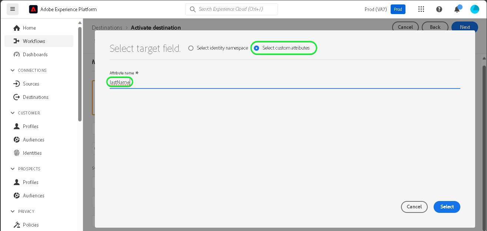

# [!DNL SAP Commerce] anslutning

[!DNL SAP Commerce], tidigare känt som [[!DNL Hybris]](https://www.sap.com/india/products/acquired-brands/what-is-hybris.html), är en molnbaserad e-handelsplattform för B2B- och B2C-företag och finns som en del av SAP:s kundupplevelseportfölj. [[!DNL SAP] Prenumerationsfakturering](https://www.sap.com/products/financial-management/subscription-billing.html) är en produkt som ingår i portföljen och möjliggör en komplett hantering av prenumerationens livscykel med förenklade försäljnings- och betalningsupplevelser via standardiserade integreringar.

Detta [!DNL Adobe Experience Platform] [mål](/help/destinations/home.md) använder [[!DNL SAP Subscription Billing] API för kundhantering](https://api.sap.com/api/BusinessPartner_APIs/path/PUT_customers-customerNumber), för att uppdatera kundinformationen inom [!DNL SAP Commerce] från en befintlig Experience Platform-publik efter aktiveringen.

Instruktioner för hur du autentiserar [!DNL SAP Commerce] -instansen är längre ned, i [Autentisera till mål](#authenticate) -avsnitt.

## Användningsfall {#use-cases}

För att du bättre ska förstå hur och när du ska använda [!DNL SAP Commerce] mål, här är ett exempel på användning som Adobe Experience Platform-kunder kan lösa genom att använda den här destinationen.

[!DNL SAP Commerce] kunder lagrar information om enskilda personer eller enheter som interagerar med ert företag. Ditt team använder de kunder som finns i [!DNL SAP Commerce] för att bygga målgrupper i Experience Platform. När dessa målgrupper har skickats till [!DNL SAP Commerce], uppdateras deras information och varje kund tilldelas en egenskap med sitt värde som målgruppsnamn som anger vilken målgrupp kunden tillhör.

## Förhandskrav {#prerequisites}

Se avsnitten nedan för alla krav som du måste ställa in i Experience Platform och [!DNL SAP Commerce] och för information som du måste samla in innan du arbetar med [!DNL SAP Commerce] mål.

### Förutsättningar för Experience Platform {#prerequisites-in-experience-platform}

Innan du aktiverar data för [!DNL SAP Commerce] mål, du måste ha [schema](/help/xdm/schema/composition.md), a [datauppsättning](https://experienceleague.adobe.com/docs/platform-learn/tutorials/data-ingestion/create-datasets-and-ingest-data.html)och [målgrupper](https://experienceleague.adobe.com/docs/platform-learn/tutorials/audiences/create-audiences.html) som [!DNL Experience Platform].

Se Experience Platform dokumentation för [Schemafältgrupp för målgruppsmedlemskapsdetaljer](/help/xdm/field-groups/profile/segmentation.md) om ni behöver vägledning om målgruppsstatus.

### Krav för [!DNL SAP Commerce] mål {#prerequisites-destination}

Observera följande krav för att kunna exportera data från Platform till [!DNL SAP Commerce] konto:

#### Du måste ha en [!DNL SAP Subscription Billing] konto {#prerequisites-account}

För att kunna exportera data från Platform till [!DNL SAP Commerce] måste du ha ett [!DNL SAP Subscription Billing] konto. Om du inte har ett giltigt faktureringskonto kontaktar du [!DNL SAP] kontoansvarig. Se [[!DNL SAP] Plattformskonfiguration](https://help.sap.com/doc/5fd179965d5145fbbe7f2a7aa1272338/latest/en-US/PlatformConfiguration.pdf) om du vill ha mer information.

#### Generera en tjänstnyckel {#prerequisites-service-key}

* The [!DNL SAP Commerce] kan du komma åt [!DNL SAP Subscription Billing] API via Experience Platform. Se [!DNL SAP Commerce] [skapa en tjänstnyckel med klient-ID och klienthemlighet](https://help.sap.com/docs/CLOUD_TO_CASH_OD/1216e7b79c984675b0a6f0005e351c74/87c11a0f5dc3494eaf3baa355925c030.html#create-a-service-key-with-client-id-and-client-secret) för att skapa en tjänstnyckel. [!DNL SAP Commerce] kräver följande:
   * Klient-ID
   * Klienthemlighet
   * URL. URL-mönstret ser ut så här: `https://subscriptionbilling.authentication.eu10.hana.ondemand.com`. Det här värdet används senare för att hämta värden för `Region` och `Endpoint`.

+++Välj för att se ett exempel på tjänstnyckeln

```json
{ 
    "url": "https://eu10.revenue.cloud.sap/api",
    "uaa": {
        "clientid": "XXX",
        "clientsecret": "XXX",
        "url": "https://subscriptionbilling.authentication.eu10.hana.ondemand.com",
        "identityzone": "subscriptionbilling",
        "identityzoneid": "XXX",
        "tenantid": "XXX",
        "tenantmode": "dedicated",
        "sburl": "https://internal-xsuaa.authentication.eu10.hana.ondemand.com",
        "apiurl": "https://api.authentication.eu10.hana.ondemand.com",
        "verificationkey": "XXX",
        "xsappname": "XXX",
        "subaccountid": "XXX",
        "uaadomain": "authentication.eu10.hana.ondemand.com",
        "zoneid": "XXX",
        "credential-type": "binding-secret"
    },
    "vendor": "SAP"
}
```

+++

#### Skapa anpassade referenser i [!DNL SAP Subscription Billing] {#prerequisites-custom-reference}

Så här uppdaterar du målgruppsstatus för Experience Platform i [!DNL SAP Subscription Billing]behöver du ett anpassat referensfält för varje målgrupp som valts i Platform.

Om du vill skapa anpassade referenser loggar du in på [!DNL SAP Subscription Billing] och navigera till **[Huvuddata och konfiguration]** > **[Egna referenser]** sida. Nästa, välj **[!UICONTROL Create]** för att lägga till en ny referens för varje publik som valts i Platform. Du måste ange dessa referensfältnamn i efterföljande [Schemalägg målgruppsexport och exempel](#schedule-segment-export-example) steg.

Ett exempel på hur du skapar en anpassad **[!UICONTROL Reference Type]** inom [!DNL SAP Subscription Billing] visas nedan:


Mer information finns i [!DNL SAP Subscription Billing] [anpassade referenser](https://help.sap.com/docs/CLOUD_TO_CASH_OD/80d121f216af43648e79664efe5595f7/85696a63c8d8453a934e86c9413a25cf.html?version=2023-11-27) dokumentation.

### Samla in nödvändiga inloggningsuppgifter {#gather-credentials}

Ansluta [!DNL SAP Commerce] till Experience Platform måste du ange värden för följande anslutningsegenskaper:

| Autentiseringsuppgifter | Beskrivning |
| --- | --- |
| Klient-ID | Värdet för `clientId` från tjänstnyckeln. |
| Klienthemlighet | Värdet för `clientSecret` från tjänstnyckeln. |
| Slutpunkt | Värdet för `url` från tjänstnyckeln liknar den `https://subscriptionbilling.authentication.eu10.hana.ondemand.com`. |
| Län | Datacentrets plats. Regionen finns i `url` och har ett värde som liknar `eu10` eller `us10`. Till exempel om `url` är `https://eu10.revenue.cloud.sap/api` du behöver `eu10`. |

## Guardrails {#guardrails}

API-förfrågningar till [!DNL SAP Cloud Management service] är beroende av [Hastighetsgränser](https://help.sap.com/docs/btp/sap-business-technology-platform/account-administration-rate-limiting). När hastighetsgränsen överskrids kommer du att stöta på en `HTTP 429 Too Many Requests` svarsstatuskod .

## Identiteter som stöds {#supported-identities}

[!DNL SAP Commerce] har stöd för uppdatering av identiteter som beskrivs i tabellen nedan. Läs mer om [identiteter](/help/identity-service/features/namespaces.md).

| Målidentitet | Beskrivning | Överväganden |
| --- | --- | --- |
| `customerNumberSAP` | En kundidentifierare för den person eller företagskund som redan finns i [!DNL SAP Commerce] konto. | Obligatoriskt |

## Målgrupper {#supported-audiences}

I det här avsnittet beskrivs alla målgrupper som du kan exportera till det här målet.

Detta mål stöder aktivering av alla målgrupper som genererats via Experience Platform [Segmenteringstjänst](../../../segmentation/home.md).

Detta mål stöder även aktivering av målgrupperna som beskrivs i tabellen nedan.

| Målgruppstyp | Stöds | Beskrivning |
| ------------- | --------- | ----------- |
| [!DNL Segmentation Service] | ✓ | Målgrupper som skapats genom Experience Platform [Segmenteringstjänst](../../../segmentation/home.md). |
| Anpassade överföringar | ✓ | Målgrupper [importerad](../../../segmentation/ui/audience-portal.md#import-audience) till Experience Platform från CSV-filer. |

{style="table-layout:auto"}

## Exportera typ och frekvens {#export-type-frequency}

Se tabellen nedan för information om exporttyp och frekvens för destinationen.

| Objekt | Typ | Anteckningar |
---------|----------|---------|
| Exporttyp | **[!UICONTROL Profile-based]** | <ul><li>Du exporterar alla medlemmar i en målgrupp tillsammans med de önskade schemafälten *(t.ex. e-postadress, telefonnummer, efternamn)*, enligt fältmappningen.</li><li> För varje vald publik i Platform [!DNL SAP Commerce] ytterligare attribut uppdateras med målgruppsstatus från Platform.</li></ul> |
| Exportfrekvens | **[!UICONTROL Streaming]** | <ul><li>Direktuppspelningsmål är alltid på API-baserade anslutningar. När en profil uppdateras i Experience Platform baserat på målgruppsutvärdering skickar anslutaren uppdateringen nedströms till målplattformen. Läs mer om [mål för direktuppspelning](/help/destinations/destination-types.md#streaming-destinations).</li></ul> |

{style="table-layout:auto"}

## Anslut till målet {#connect}

>[!IMPORTANT]
>
>Om du vill ansluta till målet behöver du **[!UICONTROL Manage Destinations]** [behörighet för åtkomstkontroll](/help/access-control/home.md#permissions). Läs [åtkomstkontroll - översikt](/help/access-control/ui/overview.md) eller kontakta produktadministratören för att få de behörigheter som krävs.

Om du vill ansluta till det här målet följer du stegen som beskrivs i [självstudiekurs om destinationskonfiguration](../../ui/connect-destination.md). I arbetsflödet för att konfigurera mål fyller du i fälten som listas i de två avsnitten nedan.

Inom **[!UICONTROL Destinations]** > **[!UICONTROL Catalog]**, sök efter [!DNL SAP Commerce]. Du kan även hitta den under **[!UICONTROL eCommerce]** kategori.

### Autentisera till mål {#authenticate}

Fyll i de obligatoriska fälten nedan. Se [Generera en tjänstnyckel](#prerequisites-service-key) för vägledning.

| Fält | Beskrivning |
| --- | --- |
| **[!UICONTROL Client ID]** | Värdet för `clientId` från tjänstnyckeln. |
| **[!UICONTROL Client secret]** | Värdet för `clientSecret` från tjänstnyckeln. |
| **[!UICONTROL Endpoint]** | Värdet för `url` från tjänstnyckeln liknar den `https://subscriptionbilling.authentication.eu10.hana.ondemand.com`. |
| **[!UICONTROL Region]** | Datacentrets plats. Regionen finns i `url` och har ett värde som liknar `eu10` eller `us10`. Till exempel om `url` är `https://eu10.revenue.cloud.sap/api` du behöver `eu10`. |

Om du vill autentisera mot målet väljer du **[!UICONTROL Connect to destination]**.


Om den angivna informationen är giltig visas en **[!UICONTROL Connected]** status med en grön bockmarkering. Du kan sedan gå vidare till nästa steg.

### Fyll i målinformation {#destination-details}

Om du vill konfigurera information för målet fyller du i de obligatoriska och valfria fälten nedan. En asterisk bredvid ett fält i användargränssnittet anger att fältet är obligatoriskt.


* **[!UICONTROL Name]**: Ett namn som du känner igen det här målet med i framtiden.
* **[!UICONTROL Description]**: En beskrivning som hjälper dig att identifiera det här målet i framtiden.
* **[!UICONTROL Type of Customer]**: Välj antingen ***Enskild*** eller ***Företag*** beroende på vilka enheter ni har inom er målgrupp. The [!DNL SAP Subscription Billing] [schema](https://api.sap.com/api/BusinessPartner_APIs/schema) växlar de obligatoriska fälten beroende på det här valet som är mappat till `customerType` -attribut. Om markeringen är ***Företag***, sedan de obligatoriska mappningarna som `firstName` och `lastName` som krävs för en enskild kund ignoreras och `company` blir obligatoriskt och vice versa.

### Aktivera aviseringar {#enable-alerts}

Du kan aktivera varningar för att få meddelanden om dataflödets status till ditt mål. Välj en avisering i listan om du vill prenumerera och få meddelanden om statusen för ditt dataflöde. Mer information om varningar finns i guiden på [prenumerera på destinationsvarningar med användargränssnittet](../../ui/alerts.md).

När du är klar med informationen för målanslutningen väljer du **[!UICONTROL Next]**.

## Aktivera målgrupper till det här målet {#activate}

>[!IMPORTANT]
> 
>* För att aktivera data behöver du **[!UICONTROL View Destinations]**, **[!UICONTROL Activate Destinations]**, **[!UICONTROL View Profiles]** och **[!UICONTROL View Segments]** [behörigheter för åtkomstkontroll](/help/access-control/home.md#permissions). Läs [åtkomstkontroll - översikt](/help/access-control/ui/overview.md) eller kontakta produktadministratören för att få de behörigheter som krävs.
>* Exportera *identiteter* behöver du **[!UICONTROL View Identity Graph]** [behörighet för åtkomstkontroll](/help/access-control/home.md#permissions). <br> {width="100" zoomable="yes"}

Läs [Aktivera profiler och målgrupper för att strömma målgruppernas exportdestinationer](/help/destinations/ui/activate-segment-streaming-destinations.md) för instruktioner om hur du aktiverar målgrupper till det här målet.

### Mappa attribut och identiteter {#map}

Så här skickar du målgruppsdata från Adobe Experience Platform till [!DNL SAP Commerce] mål måste du gå igenom fältmappningssteget. Mappningen består av att skapa en länk mellan XDM-schemafälten (Experience Data Model) i ditt plattformskonto och motsvarande motsvarigheter från målmålet. Mappa XDM-fälten korrekt till [!DNL SAP Commerce] målfält, följ stegen nedan:

#### Mappa `customerNumberSAP` identity

The `customerNumberSAP` Identitet är en obligatorisk mappning för det här målet. Följ stegen nedan för att mappa den:
1. I **[!UICONTROL Mapping]** steg, välja **[!UICONTROL Add new mapping]**. Nu kan du se en ny mappningsrad på skärmen.
   
1. I **[!UICONTROL Select source field]** väljer du **[!UICONTROL Select identity namespace]** och markera `customerNumberSAP`.
   
1. I **[!UICONTROL Select target field]** väljer du **[!UICONTROL Select identity namespace]** och väljer `customerNumber` identitet.
   

| Source Field | Målfält | Obligatoriskt |
| --- | --- | --- |
| `IdentityMap: customerNumberSAP` | `Identity: customerNumber` | Ja |

Ett exempel med identitetsmappning visas nedan:


#### Mappningsattribut

Lägga till andra attribut som du vill uppdatera mellan XDM-profilschemat och [!DNL SAP Subscription Billing] ska du upprepa stegen nedan:
1. I **[!UICONTROL Mapping]** steg, välja **[!UICONTROL Add new mapping]**. Nu kan du se en ny mappningsrad på skärmen.
   
1. I **[!UICONTROL Select source field]** väljer du **[!UICONTROL Select attributes]** och välj XDM-attributet.
   
1. I **[!UICONTROL Select target field]** fönster, välja **[!UICONTROL Select custom attributes]** kategori och ange namnet på [!DNL SAP Subscription Billing] attribut från listan över kunder [schema](https://api.sap.com/api/BusinessPartner_APIs/schema) attribut.
   

>[!IMPORTANT]
>
> Målfältsnamnen är skiftlägeskänsliga och ska matcha [!DNL SAP Subscription Billing] attributnamn. Det enda undantaget för detta är `country` var du ska använda `countryCode` i stället. [!DNL SAP Subscription Billing] stöder landskoder med alfa 2 (ISO 3166). Värdet är skiftlägeskänsligt och måste vara mellan 0 och 3 tecken långt. Se därför till att du anger exakt som det definierats, annars skulle du stöta på fel: `The country code {} does not exist` eller `size must be between 0 and 3`.

#### Karta `mandatory` attribut för den valda kundtypen

Obligatoriska attributmappningar är beroende av **[!UICONTROL Type of Customer]** som du har valt. Om du vill mappa de obligatoriska attributen väljer du något av följande:

>[!BEGINTABS]

>[!TAB Enskild kund]

| Source Field | Målfält | Obligatoriskt |
| --- | --- | --- |
| `xdm: person.lastName` | `Attribute: lastName` | Ja |
| `xdm: workAddress.countryCode` | `Attribute: countryCode` | Ja |

>[!TAB Företagskund]

| Source Field | Målfält | Obligatoriskt |
| --- | --- | --- |
| `xdm: b2b.companyName` | `Attribute: company` | Ja |
| `xdm: workAddress.countryCode` | `Attribute: countryCode` | Ja |

>[!ENDTABS]

#### Mappa ytterligare attribut

Du kan sedan lägga till ytterligare mappningar mellan XDM-profilschemat och [!DNL SAP Subscription Billing] [schema](https://api.sap.com/api/BusinessPartner_APIs/schema) attribut för en kund enligt nedan:

>[!BEGINTABS]

>[!TAB Enskild kund]

| Source Field | Målfält | Obligatoriskt |
| --- | --- | --- |
| `xdm: person.name.firstName` | `Attribute: firstName` | Nej |
| `xdm: workAddress.street1` | `Attribute: street` | Nej |
| `xdm: workAddress.city` | `Attribute: city` | Nej |

Ett exempel med både obligatoriska och valfria attributmappningar där kunden är en individ visas nedan:


>[!TAB Företagskund]

| Source Field | Målfält | Obligatoriskt |
| --- | --- | --- |
| `xdm: workAddress.street1` | `Attribute: street` | Nej |
| `xdm: workAddress.city` | `Attribute: city` | Nej |

Ett exempel med både obligatoriska och valfria attributmappningar där kunden är ett företag visas nedan:


>[!ENDTABS]

När du är klar med mappningarna för målanslutningen väljer du **[!UICONTROL Next]**.

### Schemalägg målgruppsexport och exempel {#schedule-segment-export-example}

När du utför [Schemalägg målgruppsexport](/help/destinations/ui/activate-segment-streaming-destinations.md#scheduling) måste du manuellt mappa plattformsmålgrupper till [attributes](#prerequisites-attribute) in [!DNL SAP Subscription Billing].

Ett exempel på schemaläggningen av målgruppsexport, med platsen för [!DNL SAP Commerce] **[!UICONTROL Mapping ID]** markerat, visas nedan:


Det gör du genom att markera varje segment och sedan ange namnet på den anpassade referensen från [!DNL SAP Subscription Billing] i [!DNL SAP Commerce] **[!UICONTROL Mapping ID]** målanslutningsfält. Mer information om hur du skapar anpassade referenser finns i [Skapa anpassade referenser i [!DNL SAP Subscription Billing]](#prerequisites-custom-reference) -avsnitt.

>[!IMPORTANT]
>
> Använd inte den anpassade referensetiketten som värde.
>

Om den valda Experience Platform-publiken till exempel är `sap_audience1` och du vill att dess status ska uppdateras i [!DNL SAP Subscription Billing] anpassad referens `SAP_1`anger du det här värdet i dialogrutan [!DNL SAP_Commerce] **[!UICONTROL Mapping ID]** fält.

Ett exempel **[!UICONTROL Reference Type]** från [!DNL SAP Subscription Billing] visas nedan:


Ett exempel på exportsteget för att schemalägga målgrupper, med en vald målgrupp och dess motsvarande [!DNL SAP Commerce] **[!UICONTROL Mapping ID]** markerat, visas nedan:


Som det visas i **[!UICONTROL Mapping ID]** fältet ska exakt matcha [!DNL SAP Subscription Billing] **[!UICONTROL Reference Type]** värde .

Upprepa det här avsnittet för varje aktiverad publik på plattformen.

Baserat på bilden ovan där du har valt två målgrupper är mappningen följande: | [!DNL SAP Commerce] målgruppsnamn | [!DNL SAP Subscription Billing] **[!UICONTROL Reference Type]** | [!DNL SAP Commerce] **[!UICONTROL Mapping ID]** value | | — | — | — | | sap_publik1 | `SAP_1` | `SAP_1` | | SAP Audience2 | `SAP_2` | `SAP_2` |

## Validera dataexport {#exported-data}

Följ stegen nedan för att verifiera att du har konfigurerat målet korrekt:

Logga in på [!DNL SAP Subscription Billing] och sedan navigera till **[!UICONTROL Contacts]** sida för att kontrollera målgruppsstatus. Listan kan konfigureras för att visa kolumner för anpassade referenser och visa motsvarande målgruppsstatus.


## Dataanvändning och styrning {#data-usage-governance}

Alla [!DNL Adobe Experience Platform] destinationerna är kompatibla med dataanvändningsprinciper när data hanteras. Detaljerad information om hur [!DNL Adobe Experience Platform] använder datastyrning, se [Datastyrning - översikt](/help/data-governance/home.md).

## Fel och felsökning {#errors-and-troubleshooting}

Se [[!DNL SAP Subscription Billing] Feltyper](https://help.sap.com/docs/CLOUD_TO_CASH_OD/987aec876092428f88162e438acf80d6/1a6a0dd6129c48e8b235190a1b5409fa.html) dokumentationssida med en lista över möjliga feltyper och deras svarskoder.

## Ytterligare resurser {#additional-resources}

Ytterligare användbar information från [!DNL SAP] dokumentationen nedan:
* [Fakturering av SAP-abonnemang](https://help.sap.com/docs/CLOUD_TO_CASH_OD/1216e7b79c984675b0a6f0005e351c74/e4b8badf7d124026991e4ab6b57d2a33.html)

### Changelog

I det här avsnittet beskrivs funktionaliteten och viktiga dokumentationsuppdateringar för den här målanslutningen.

+++ Visa ändringslogg

| Releasamånad | Uppdateringstyp | Beskrivning |
|---|---|---|
| Januari 2024 | Inledande version | Ursprunglig målversion och dokumentationspublicering. |

{style="table-layout:auto"}

+++
