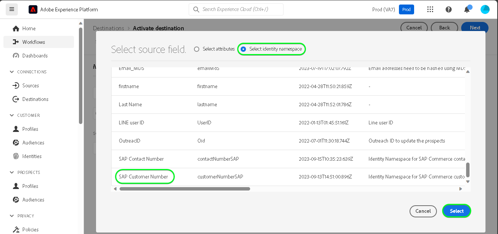

# [!DNL SAP Commerce]-anslutning

[!DNL SAP Commerce], tidigare [[!DNL Hybris]](https://www.sap.com/india/products/acquired-brands/what-is-hybris.html), är en molnbaserad e-handelsplattformslösning för B2B- och B2C-företag och är tillgänglig som en del av SAP:s kundupplevelseportfölj. [[!DNL SAP] Prenumerationsfakturering](https://www.sap.com/products/financial-management/subscription-billing.html) är en produkt som ingår i portföljen och möjliggör en fullständig hantering av prenumerationens livscykel med förenklade försäljnings- och betalningsupplevelser via standardiserade integreringar.

Det här [!DNL Adobe Experience Platform] [målet](/help/destinations/home.md) använder [[!DNL SAP Subscription Billing] API:t för kundhantering](https://api.sap.com/api/BusinessPartner_APIs/path/PUT_customers-customerNumber) för att uppdatera kundinformationen inom [!DNL SAP Commerce] från en befintlig Experience Platform-målgrupp efter aktiveringen.

Instruktioner för autentisering till din [!DNL SAP Commerce]-instans finns längre ned i avsnittet [Autentisera till mål](#authenticate).

## Användningsfall {#use-cases}

För att du bättre ska kunna förstå hur och när du ska använda målet [!DNL SAP Commerce] finns det ett exempel på användning som Adobe Experience Platform-kunder kan lösa genom att använda det här målet.

[!DNL SAP Commerce]-kunder lagrar information om personer eller organisationsenheter som interagerar med ditt företag. Ditt team använder de kunder som finns i [!DNL SAP Commerce] för att skapa målgrupper i Experience Platform. När dessa målgrupper har skickats till [!DNL SAP Commerce] uppdateras deras information och varje kund tilldelas en egenskap med dess värde som målgruppsnamn som anger vilken målgrupp kunden tillhör.

## Förhandskrav {#prerequisites}

I avsnitten nedan finns information om alla krav som du måste konfigurera i Experience Platform och [!DNL SAP Commerce]. Här finns även information som du måste samla in innan du kan arbeta med målet [!DNL SAP Commerce].

### Förutsättningar för Experience Platform {#prerequisites-in-experience-platform}

Innan du aktiverar data till målet [!DNL SAP Commerce] måste du ha ett [schema](/help/xdm/schema/composition.md), en [datamängd](https://experienceleague.adobe.com/docs/platform-learn/tutorials/data-ingestion/create-datasets-and-ingest-data.html) och [målgrupper](https://experienceleague.adobe.com/docs/platform-learn/tutorials/audiences/create-audiences.html) som skapats i [!DNL Experience Platform].

Se Experience Platform-dokumentationen för schemafältgruppen [Information om målgruppsmedlemskap](/help/xdm/field-groups/profile/segmentation.md) om du behöver vägledning om målgruppsstatus.

### Krav för målet [!DNL SAP Commerce] {#prerequisites-destination}

Observera följande krav för att kunna exportera data från Platform till ditt [!DNL SAP Commerce]-konto:

#### Du måste ha ett [!DNL SAP Subscription Billing]-konto {#prerequisites-account}

Du måste ha ett [!DNL SAP Subscription Billing]-konto för att kunna exportera data från Platform till ditt [!DNL SAP Commerce]-konto. Om du inte har ett giltigt faktureringskonto kontaktar du kontohanteraren för [!DNL SAP]. Mer information finns i dokumentet [[!DNL SAP] Plattformskonfiguration](https://help.sap.com/doc/5fd179965d5145fbbe7f2a7aa1272338/latest/en-US/PlatformConfiguration.pdf).

#### Generera en tjänstnyckel {#prerequisites-service-key}

* Med tjänstnyckeln [!DNL SAP Commerce] kan du komma åt API:t för [!DNL SAP Subscription Billing] via Experience Platform. Se [!DNL SAP Commerce] [skapa en tjänstnyckel med klient-ID och klienthemlighet](https://help.sap.com/docs/CLOUD_TO_CASH_OD/1216e7b79c984675b0a6f0005e351c74/87c11a0f5dc3494eaf3baa355925c030.html#create-a-service-key-with-client-id-and-client-secret) för att skapa en tjänstnyckel. [!DNL SAP Commerce] kräver följande:
   * Klient-ID
   * Klienthemlighet
   * URL. URL-mönstret är följande: `https://subscriptionbilling.authentication.eu10.hana.ondemand.com`. Det här värdet används senare för att hämta värden för `Region` och `Endpoint`.

+++Välj för att se ett exempel på tjänstnyckeln

```json
{ 
    "url": "https://eu10.revenue.cloud.sap/api",
    "uaa": {
        "clientid": "XXX",
        "clientsecret": "XXX",
        "url": "https://subscriptionbilling.authentication.eu10.hana.ondemand.com",
        "identityzone": "subscriptionbilling",
        "identityzoneid": "XXX",
        "tenantid": "XXX",
        "tenantmode": "dedicated",
        "sburl": "https://internal-xsuaa.authentication.eu10.hana.ondemand.com",
        "apiurl": "https://api.authentication.eu10.hana.ondemand.com",
        "verificationkey": "XXX",
        "xsappname": "XXX",
        "subaccountid": "XXX",
        "uaadomain": "authentication.eu10.hana.ondemand.com",
        "zoneid": "XXX",
        "credential-type": "binding-secret"
    },
    "vendor": "SAP"
}
```

+++

#### Skapa anpassade referenser i [!DNL SAP Subscription Billing] {#prerequisites-custom-reference}

Om du vill uppdatera Experience Platform-målgruppsstatusen i [!DNL SAP Subscription Billing] behöver du ett anpassat referensfält för varje målgrupp som valts i Platform.

Om du vill skapa anpassade referenser loggar du in på ditt [!DNL SAP Subscription Billing]-konto och navigerar till sidan **[Huvuddata och konfiguration]** > **[Anpassade referenser]**. Välj sedan **[!UICONTROL Create]** för att lägga till en ny referens för varje publik som valts i Platform. Du behöver dessa referensfältnamn i efterföljande [schemaläggning av målgruppsexport och exempel](#schedule-segment-export-example) -steg.

Ett exempel på hur du skapar en anpassad **[!UICONTROL Reference Type]** i [!DNL SAP Subscription Billing] visas nedan:


Mer information finns i dokumentationen för [!DNL SAP Subscription Billing] [anpassade referenser](https://help.sap.com/docs/CLOUD_TO_CASH_OD/80d121f216af43648e79664efe5595f7/85696a63c8d8453a934e86c9413a25cf.html?version=2023-11-27).

### Samla in nödvändiga inloggningsuppgifter {#gather-credentials}

Om du vill ansluta [!DNL SAP Commerce] till Experience Platform måste du ange värden för följande anslutningsegenskaper:

| Autentiseringsuppgifter | Beskrivning |
| --- | --- |
| Klient-ID | Värdet `clientId` från tjänstnyckeln. |
| Klienthemlighet | Värdet `clientSecret` från tjänstnyckeln. |
| Slutpunkt | Värdet `url` från tjänstnyckeln liknar värdet `https://subscriptionbilling.authentication.eu10.hana.ondemand.com`. |
| Län | Datacentrets plats. Regionen finns i `url` och har ett värde som liknar `eu10` eller `us10`. Om till exempel `url` är `https://eu10.revenue.cloud.sap/api` behöver du `eu10`. |

## Guardrails {#guardrails}

API-begäranden till [!DNL SAP Cloud Management service] omfattas av [hastighetsbegränsningar](https://help.sap.com/docs/btp/sap-business-technology-platform/account-administration-rate-limiting). När hastighetsgränsen har överskridits kommer du att stöta på en `HTTP 429 Too Many Requests`-svarsstatuskod.

## Identiteter som stöds {#supported-identities}

[!DNL SAP Commerce] har stöd för uppdatering av identiteter som beskrivs i tabellen nedan. Läs mer om [identiteter](/help/identity-service/features/namespaces.md).

| Målidentitet | Beskrivning | Överväganden |
| --- | --- | --- |
| `customerNumberSAP` | En kundidentifierare för den enskilda kunden eller företagskunden finns redan i ditt [!DNL SAP Commerce]-konto. | Obligatoriskt |

## Målgrupper {#supported-audiences}

I det här avsnittet beskrivs alla målgrupper som du kan exportera till det här målet.

Det här målet stöder aktivering av alla målgrupper som genereras via Experience Platform [segmenteringstjänsten](../../../segmentation/home.md).

Detta mål stöder även aktivering av målgrupperna som beskrivs i tabellen nedan.

| Målgruppstyp | Stöds | Beskrivning |
| ------------- | --------- | ----------- |
| [!DNL Segmentation Service] | ✓ | Publiker som genererats via Experience Platform [segmenteringstjänsten](../../../segmentation/home.md). |
| Anpassade överföringar | ✓ | Publikerna [importerade](../../../segmentation/ui/audience-portal.md#import-audience) till Experience Platform från CSV-filer. |

{style="table-layout:auto"}

## Exportera typ och frekvens {#export-type-frequency}

Se tabellen nedan för information om exporttyp och frekvens för destinationen.

| Objekt | Typ | Anteckningar |
---------|----------|---------|
| Exporttyp | **[!UICONTROL Profile-based]** | <ul><li>Du exporterar alla medlemmar i en målgrupp tillsammans med de önskade schemafälten *(till exempel e-postadress, telefonnummer, efternamn)*, enligt fältmappningen.</li><li> För varje vald målgrupp i Platform uppdateras motsvarande ytterligare [!DNL SAP Commerce]-attribut med målgruppsstatus från Platform.</li></ul> |
| Exportfrekvens | **[!UICONTROL Streaming]** | <ul><li>Direktuppspelningsmål är alltid på API-baserade anslutningar. När en profil uppdateras i Experience Platform baserat på målgruppsutvärdering skickar anslutaren uppdateringen nedströms till målplattformen. Läs mer om [direktuppspelningsmål](/help/destinations/destination-types.md#streaming-destinations).</li></ul> |

{style="table-layout:auto"}

## Anslut till målet {#connect}

>[!IMPORTANT]
>
>Om du vill ansluta till målet måste du ha **[!UICONTROL Manage Destinations]** [åtkomstkontrollbehörighet](/help/access-control/home.md#permissions). Läs [åtkomstkontrollsöversikten](/help/access-control/ui/overview.md) eller kontakta produktadministratören för att få den behörighet som krävs.

Om du vill ansluta till det här målet följer du stegen som beskrivs i självstudiekursen [för destinationskonfiguration](../../ui/connect-destination.md). I arbetsflödet för att konfigurera mål fyller du i fälten som listas i de två avsnitten nedan.

Sök efter [!DNL SAP Commerce] inom **[!UICONTROL Destinations]** > **[!UICONTROL Catalog]**. Du kan också hitta den under kategorin **[!UICONTROL eCommerce]**.

### Autentisera till mål {#authenticate}

Fyll i de obligatoriska fälten nedan. Mer information finns i avsnittet [Skapa en tjänstnyckel](#prerequisites-service-key).

| Fält | Beskrivning |
| --- | --- |
| **[!UICONTROL Client ID]** | Värdet `clientId` från tjänstnyckeln. |
| **[!UICONTROL Client secret]** | Värdet `clientSecret` från tjänstnyckeln. |
| **[!UICONTROL Endpoint]** | Värdet `url` från tjänstnyckeln liknar värdet `https://subscriptionbilling.authentication.eu10.hana.ondemand.com`. |
| **[!UICONTROL Region]** | Datacentrets plats. Regionen finns i `url` och har ett värde som liknar `eu10` eller `us10`. Om till exempel `url` är `https://eu10.revenue.cloud.sap/api` behöver du `eu10`. |

Om du vill autentisera till målet väljer du **[!UICONTROL Connect to destination]**.


Om den angivna informationen är giltig visas statusen **[!UICONTROL Connected]** med en grön bockmarkering. Du kan sedan gå vidare till nästa steg.

### Fyll i målinformation {#destination-details}

Om du vill konfigurera information för målet fyller du i de obligatoriska och valfria fälten nedan. En asterisk bredvid ett fält i användargränssnittet anger att fältet är obligatoriskt.


* **[!UICONTROL Name]**: Ett namn som du känner igen det här målet med i framtiden.
* **[!UICONTROL Description]**: En beskrivning som hjälper dig att identifiera det här målet i framtiden.
* **[!UICONTROL Type of Customer]**: Välj antingen ***Individual*** eller ***Corporate*** beroende på vilka enheter som finns i målgruppen. [!DNL SAP Subscription Billing] [schema](https://api.sap.com/api/BusinessPartner_APIs/schema) växlar de obligatoriska fälten beroende på den här markeringen som är mappad till attributet `customerType`. Om markeringen är ***Företag*** kommer obligatoriska mappningar som `firstName` och `lastName` som krävs för en enskild kund att ignoreras och `company` blir obligatoriskt och vice versa.

### Aktivera aviseringar {#enable-alerts}

Du kan aktivera varningar för att få meddelanden om dataflödets status till ditt mål. Välj en avisering i listan om du vill prenumerera och få meddelanden om statusen för ditt dataflöde. Mer information om varningar finns i guiden [prenumerera på destinationsvarningar med användargränssnittet](../../ui/alerts.md).

Välj **[!UICONTROL Next]** när du är klar med att ange information för målanslutningen.

## Aktivera målgrupper till det här målet {#activate}

>[!IMPORTANT]
> 
>* För att aktivera data behöver du behörigheterna **[!UICONTROL View Destinations]**, **[!UICONTROL Activate Destinations]**, **[!UICONTROL View Profiles]** och **[!UICONTROL View Segments]** [åtkomstkontroll](/help/access-control/home.md#permissions). Läs [åtkomstkontrollsöversikten](/help/access-control/ui/overview.md) eller kontakta produktadministratören för att få den behörighet som krävs.
>* Om du vill exportera *identiteter* måste du ha **[!UICONTROL View Identity Graph]** [åtkomstkontrollbehörighet](/help/access-control/home.md#permissions). <br> {width="100" zoomable="yes"}

Läs [Aktivera profiler och målgrupper för att direktuppspela målgruppsexportdestinationer](/help/destinations/ui/activate-segment-streaming-destinations.md) för instruktioner om hur du aktiverar målgrupper till det här målet.

### Mappa attribut och identiteter {#map}

Om du vill skicka målgruppsdata från Adobe Experience Platform till målet [!DNL SAP Commerce] måste du gå igenom fältmappningssteget. Mappningen består av att skapa en länk mellan XDM-schemafälten (Experience Data Model) i ditt plattformskonto och motsvarande motsvarigheter från målmålet. Följ stegen nedan för att mappa dina XDM-fält korrekt till målfälten för [!DNL SAP Commerce]:

#### Mappa `customerNumberSAP`-identiteten

Identiteten `customerNumberSAP` är en obligatorisk mappning för det här målet. Följ stegen nedan för att mappa den:

1. Välj **[!UICONTROL Add new mapping]** i steget **[!UICONTROL Mapping]**. Nu kan du se en ny mappningsrad på skärmen.
   
1. I fönstret **[!UICONTROL Select source field]** väljer du **[!UICONTROL Select identity namespace]** och sedan `customerNumberSAP`.
   
1. I fönstret **[!UICONTROL Select target field]** väljer du **[!UICONTROL Select identity namespace]** och sedan `customerNumber`-identiteten.
   

| Source Field | Målfält | Obligatoriskt |
| --- | --- | --- |
| `IdentityMap: customerNumberSAP` | `Identity: customerNumber` | Ja |

Ett exempel med identitetsmappning visas nedan:


#### Mappningsattribut

Om du vill lägga till andra attribut som du vill uppdatera mellan XDM-profilschemat och ditt [!DNL SAP Subscription Billing]-konto upprepar du stegen nedan:

1. Välj **[!UICONTROL Add new mapping]** i steget **[!UICONTROL Mapping]**. Nu kan du se en ny mappningsrad på skärmen.
   
1. I fönstret **[!UICONTROL Select source field]** väljer du kategorin **[!UICONTROL Select attributes]** och väljer XDM-attributet.
   
1. I fönstret **[!UICONTROL Select target field]** väljer du kategorin **[!UICONTROL Select custom attributes]** och skriver namnet på attributet [!DNL SAP Subscription Billing] i listan med kundens [schema](https://api.sap.com/api/BusinessPartner_APIs/schema)-attribut.
   

>[!IMPORTANT]
>
> Målfältsnamnen är skiftlägeskänsliga och ska matcha attributnamnen [!DNL SAP Subscription Billing]. Det enda undantaget för detta är `country` där du bör använda `countryCode` i stället. [!DNL SAP Subscription Billing] har stöd för landskoder med alfa 2 (ISO 3166). Värdet är skiftlägeskänsligt och måste vara mellan 0 och 3 tecken. Se därför till att du anger exakt som det definierats, annars skulle du stöta på fel: `The country code {} does not exist` eller `size must be between 0 and 3`.

#### Mappa `mandatory`-attribut för den valda kundtypen

Obligatoriska attributmappningar beror på **[!UICONTROL Type of Customer]** som du har valt. Om du vill mappa de obligatoriska attributen väljer du något av följande:

>[!BEGINTABS]

>[!TAB Enskild kund]

| Source Field | Målfält | Obligatoriskt |
| --- | --- | --- |
| `xdm: person.lastName` | `Attribute: lastName` | Ja |
| `xdm: workAddress.countryCode` | `Attribute: countryCode` | Ja |

>[!TAB Företagskund]

| Source Field | Målfält | Obligatoriskt |
| --- | --- | --- |
| `xdm: b2b.companyName` | `Attribute: company` | Ja |
| `xdm: workAddress.countryCode` | `Attribute: countryCode` | Ja |

>[!ENDTABS]

#### Mappa ytterligare attribut

Du kan sedan lägga till ytterligare mappningar mellan XDM-profilschemat och [!DNL SAP Subscription Billing] [schema](https://api.sap.com/api/BusinessPartner_APIs/schema) -attributen för en kund enligt nedan:

>[!BEGINTABS]

>[!TAB Enskild kund]

| Source Field | Målfält | Obligatoriskt |
| --- | --- | --- |
| `xdm: person.name.firstName` | `Attribute: firstName` | Nej |
| `xdm: workAddress.street1` | `Attribute: street` | Nej |
| `xdm: workAddress.city` | `Attribute: city` | Nej |

Ett exempel med både obligatoriska och valfria attributmappningar där kunden är en individ visas nedan:


>[!TAB Företagskund]

| Source Field | Målfält | Obligatoriskt |
| --- | --- | --- |
| `xdm: workAddress.street1` | `Attribute: street` | Nej |
| `xdm: workAddress.city` | `Attribute: city` | Nej |

Ett exempel med både obligatoriska och valfria attributmappningar där kunden är ett företag visas nedan:


>[!ENDTABS]

Välj **[!UICONTROL Next]** när du är klar med mappningarna för målanslutningen.

### Schemalägg målgruppsexport och exempel {#schedule-segment-export-example}

När du utför steget [Schemalägg målgruppsexport](/help/destinations/ui/activate-segment-streaming-destinations.md#scheduling) måste du manuellt mappa plattformsmålgrupper till [attributen](#prerequisites-attribute) i [!DNL SAP Subscription Billing].

Ett exempel på exportsteget för schemalagda målgrupper, med platsen för [!DNL SAP Commerce] **[!UICONTROL Mapping ID]** markerad, visas nedan:


Det gör du genom att markera varje segment och sedan ange namnet på den anpassade referensen från [!DNL SAP Subscription Billing] i fältet [!DNL SAP Commerce] **[!UICONTROL Mapping ID]** för målkoppling. Mer information om hur du skapar anpassade referenser finns i avsnittet [Skapa anpassade referenser i [!DNL SAP Subscription Billing]](#prerequisites-custom-reference).

>[!IMPORTANT]
>
> Använd inte den anpassade referensetiketten som värde.
>

Om den valda Experience Platform-målgruppen till exempel är `sap_audience1` och du vill att dess status ska uppdateras till den [!DNL SAP Subscription Billing] anpassade referensen `SAP_1` anger du det här värdet i fältet [!DNL SAP_Commerce] **[!UICONTROL Mapping ID]**.

Ett exempel **[!UICONTROL Reference Type]** från [!DNL SAP Subscription Billing] visas nedan:


Ett exempel på exportsteget för schemalagda målgrupper, med en vald målgrupp och motsvarande [!DNL SAP Commerce] **[!UICONTROL Mapping ID]** markerat, visas nedan:


Som du kan se ska värdet i fältet **[!UICONTROL Mapping ID]** exakt matcha värdet [!DNL SAP Subscription Billing] **[!UICONTROL Reference Type]** .

Upprepa det här avsnittet för varje aktiverad publik på plattformen.

Baserat på bilden ovan där du har valt två målgrupper är mappningen följande:

| [!DNL SAP Commerce] målgruppsnamn | [!DNL SAP Subscription Billing] **[!UICONTROL Reference Type]** | [!DNL SAP Commerce] **[!UICONTROL Mapping ID]**-värde |
| --- | --- | --- |
| sap_publik1 | `SAP_1` | `SAP_1` |
| SAP Audience2 | `SAP_2` | `SAP_2` |

## Validera dataexport {#exported-data}

Följ stegen nedan för att verifiera att du har konfigurerat målet korrekt:

Logga in på kontot [!DNL SAP Subscription Billing] och navigera sedan till sidan **[!UICONTROL Contacts]** för att kontrollera målgruppsstatus. Listan kan konfigureras för att visa kolumner för anpassade referenser och visa motsvarande målgruppsstatus.


## Dataanvändning och styrning {#data-usage-governance}

Alla [!DNL Adobe Experience Platform]-mål är kompatibla med dataanvändningsprinciper när data hanteras. Mer information om hur [!DNL Adobe Experience Platform] använder datastyrning finns i [Datastyrningsöversikten](/help/data-governance/home.md).

## Fel och felsökning {#errors-and-troubleshooting}

På dokumentationssidan [[!DNL SAP Subscription Billing] Feltyper](https://help.sap.com/docs/CLOUD_TO_CASH_OD/987aec876092428f88162e438acf80d6/1a6a0dd6129c48e8b235190a1b5409fa.html) finns en lista över möjliga feltyper och deras svarskoder.

## Ytterligare resurser {#additional-resources}

Ytterligare användbar information från dokumentationen för [!DNL SAP] finns nedan:
* [Fakturering av SAP-prenumerationer](https://help.sap.com/docs/CLOUD_TO_CASH_OD/1216e7b79c984675b0a6f0005e351c74/e4b8badf7d124026991e4ab6b57d2a33.html)

### Changelog

I det här avsnittet beskrivs funktionaliteten och viktiga dokumentationsuppdateringar för den här målanslutningen.

+++ Visa ändringslogg

| Releasamånad | Uppdateringstyp | Beskrivning |
|---|---|---|
| Januari 2024 | Inledande version | Ursprunglig målversion och dokumentationspublicering. |

{style="table-layout:auto"}

+++
