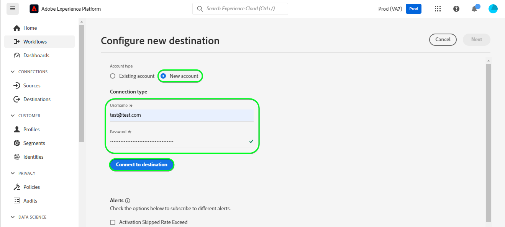
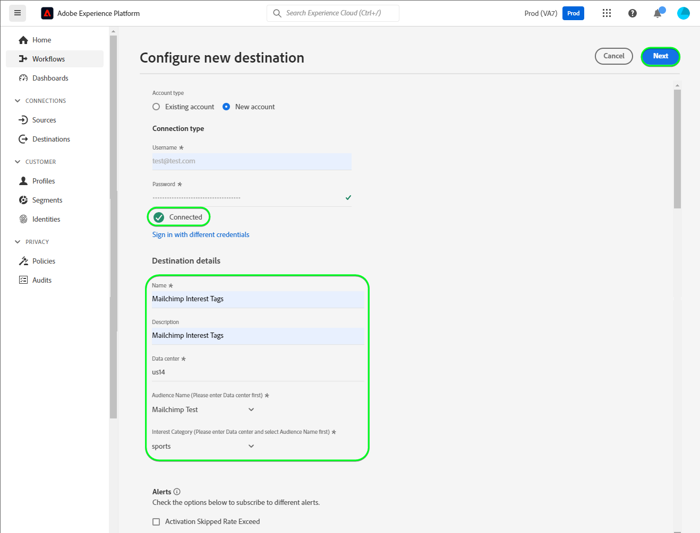
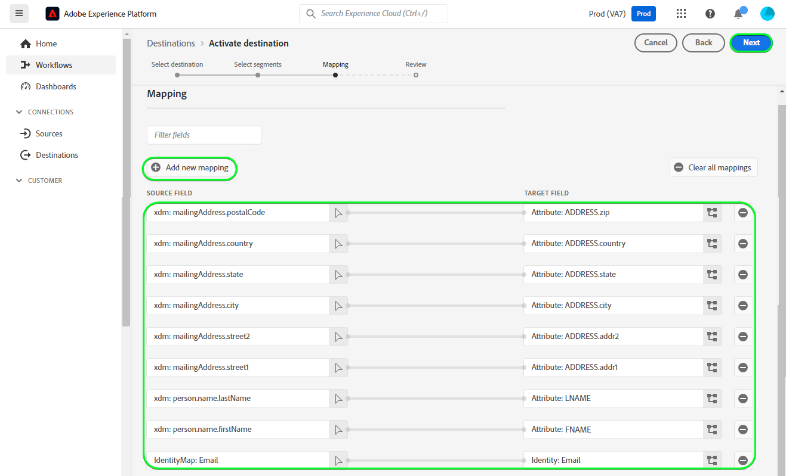
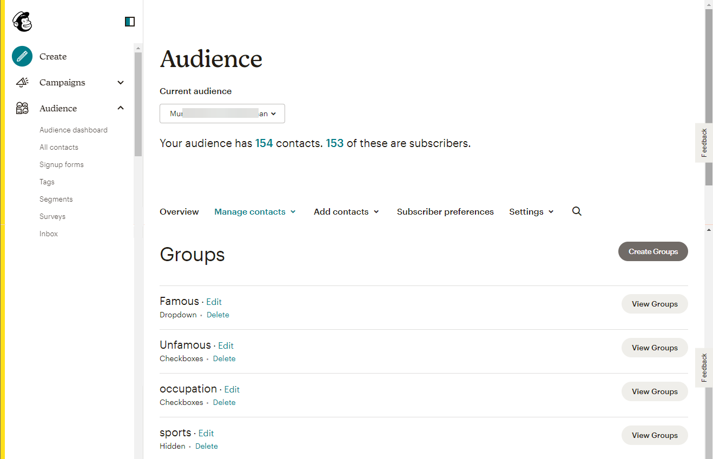
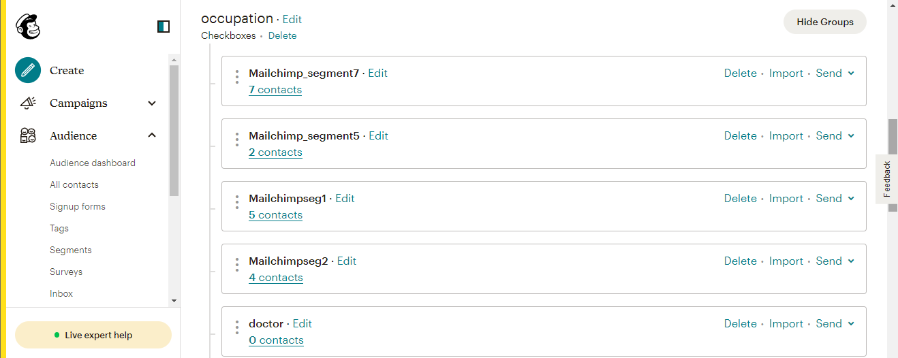
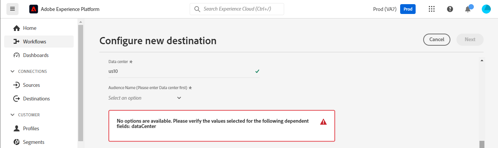

# [!DNL Mailchimp Interest Categories]-anslutning

[[!DNL Mailchimp]](https://mailchimp.com) är en populär plattform för automatiserad marknadsföring och en e-postmarknadsföringstjänst som används av företag för att hantera och kommunicera med kontakter *(kunder, kunder eller andra berörda parter)* med hjälp av e-postlistor och e-postmarknadsföringskampanjer. Använd den här kopplingen för att sortera dina kontakter baserat på deras intressen och önskemål.

[!DNL Mailchimp Interest Categories] använder [målgrupper](https://mailchimp.com/help/getting-started-audience/), [grupper](https://mailchimp.com/help/getting-started-with-groups/) och intressekategorier *(kallas även gruppnamn eller grupprubriker)*. Varje [!DNL Mailchimp]-grupp är en lista över intressekategorier. Kontakter är kopplade till en intressekategori när de prenumererar på en eller flera intressekategorier via ett registreringsformulär på din webbplats. Inom en målgrupp kan du också ordna kontakterna i grupper och associera dem med intressekategorier, och dessa kan sedan användas för att skapa segment. Du kan använda dessa målgrupper för att sända riktade kampanjer via e-post till de prenumererade kontakterna.

<!--
Compared to [!DNL Mailchimp Tags] which you would use for internal classification, [!DNL Mailchimp Interest Categories] is meant to manage subscriptions to topics of interest that your contacts might be interested in. *Note, Experience Platform also has a connection for [!DNL Mailchimp Tags], you can check it out on the [[!DNL Mailchimp Tags]](/help/destinations/catalog/email-marketing/mailchimp-tags.md) page.*
-->

Detta [!DNL Adobe Experience Platform] [mål](/help/destinations/home.md) använder [[!DNL Mailchimp batch subscribe or unsubscribe API]](https://mailchimp.com/developer/marketing/api/lists/batch-subscribe-or-unsubscribe/)-API:t för att skapa [intressekategorier](https://mailchimp.com/developer/marketing/api/interest-categories/) och lägger sedan till kontakter från var och en av de valda Experience Platform-målgrupperna i en motsvarande intressekategori. Du kan **lägga till nya kontakter** eller **uppdatera informationen för befintliga [!DNL Mailchimp] kontakter** och sedan **lägga till eller ta bort dem från sina önskade grupper** inom en befintlig [!DNL Mailchimp] målgrupp efter att du har aktiverat dem i ett nytt segment. [!DNL Mailchimp Interest Groups] använder de valda målgruppsnamnen från Experience Platform som intressekategorier i [!DNL Mailchimp].

## Användningsfall {#use-cases}

För att du bättre ska kunna förstå hur och när du ska använda målet [!DNL Mailchimp Interest Categories] finns det ett exempel på användning som Adobe Experience Platform-kunder kan lösa genom att använda det här målet.

### Skicka e-post till kontakter för marknadsföringskampanjer {#use-case-send-emails}

Försäljningsavdelningen på en webbplats för sportartiklar vill sända en e-postbaserad marknadsföringskampanj till en lista över kontakter som själva har identifierats som intresserade av fotboll. Listorna över kontakter delas upp som grupper i dataexporten som tas emot från webbplatsens utvecklingsteam och måste därför spåras. Teamet identifierar en befintlig [!DNL Mailchimp]-målgrupp och börjar bygga upp de Experience Platform-målgrupper i vilka kontakterna från varje lista läggs till. När de här målgrupperna har skickats till [!DNL Mailchimp Interest Categories] läggs de till i en grupp med målgruppsnamnet som kontakten tillhör om det inte finns några kontakter i den valda [!DNL Mailchimp]-målgruppen. Om det redan finns kontakter i målgruppen eller gruppen [!DNL Mailchimp] uppdateras deras information. När data har skickats över till [!DNL Mailchimp Interest Categories] kan säljarna välja och skicka marknadsföringskampanjens e-post till fotbollsintressegruppen inom [!DNL Mailchimp]-målgruppen.

## Förutsättningar {#prerequisites}

I avsnitten nedan finns information om eventuella krav som du måste ställa in i Experience Platform och [!DNL Mailchimp] och om information som du måste samla in innan du kan arbeta med målet för [!DNL Mailchimp Interest Categories].

### Förutsättningar i Experience Platform {#prerequisites-in-experience-platform}

Innan du aktiverar data till målet [!DNL Mailchimp Interest Categories] måste du ha ett [schema](/help/xdm/schema/composition.md), en [datamängd](https://experienceleague.adobe.com/docs/platform-learn/tutorials/data-ingestion/create-datasets-and-ingest-data.html?lang=sv-SE) och [segment](https://experienceleague.adobe.com/docs/platform-learn/tutorials/segments/create-segments.html?lang=sv-SE) som skapats i [!DNL Experience Platform].

### Krav för målet [!DNL Mailchimp Interest Categories] {#prerequisites-destination}

Observera följande krav för att kunna exportera data från Experience Platform till ditt [!DNL Mailchimp]-konto:

#### Du måste ha ett [!DNL Mailchimp]-konto {#prerequisites-account}

Innan du kan skapa ett [!DNL Mailchimp Interest Categories]-mål måste du se till att du har ett [!DNL Mailchimp]-konto. Om du inte redan har en, gå till [[!DNL Mailchimp] registreringssidan](https://login.mailchimp.com/signup/) för att registrera och skapa ditt konto.

#### Samla in [!DNL Mailchimp] API-nyckel {#gather-credentials}

Du behöver din [!DNL Mailchimp] **API-nyckel** för att autentisera [!DNL Mailchimp Interest Categories]-målet mot ditt [!DNL Mailchimp]-konto. **API-nyckeln** fungerar som **Lösenord** när du [autentiserar målet](#authenticate).

Om du inte har din **API-nyckel** loggar du in på ditt konto och skapar en i dokumentationen för [[!DNL Mailchimp] Generera API-nyckeln](https://mailchimp.com/developer/marketing/guides/quick-start/#generate-your-api-key).

Ett exempel på en API-nyckel är `0123456789abcdef0123456789abcde-us14`.

>[!IMPORTANT]
>
>Om du genererar **API-nyckeln** skriver du ned den eftersom du inte kommer att kunna komma åt den efter genereringen.

#### Identifiera datacenter för [!DNL Mailchimp] {#identify-data-center}

Därefter måste du identifiera ditt [!DNL Mailchimp]-datacenter. Det gör du genom att logga in på ditt [!DNL Mailchimp]-konto och navigera till avsnittet **API-nycklar** för ditt konto.

Värdet är den första delen av webbadressen som visas i webbläsaren. Om URL:en är *https://`us14`.mailchimp.com/account/api/* är datacentret `us14`.

Den läggs också till i API-nyckeln i formatet *key-dc*. Om API-nyckeln är `0123456789abcdef0123456789abcde-us14` är datacentret `us14`.

Skriv ned datacentervärdet *(`us14` i det här exemplet)*, du behöver det här värdet när du [fyller i målinformationen](#destination-details).

Om du behöver mer hjälp kan du läsa [[!DNL Mailchimp] Grundläggande dokumentation](https://mailchimp.com/developer/marketing/docs/fundamentals/#api-structure).

### Skyddsräcken {#guardrails}

Var och en av dina [!DNL Mailchimp]-målgrupper kan innehålla upp till 60 gruppnamn (eller intressekategorier) i en enda grupp eller i flera grupper inom samma målgrupp. Mer information finns i [!DNL Mailchimp] [grupper](https://mailchimp.com/help/getting-started-with-groups/). När du når den här gränsen får du ett `400 BAD_REQUEST Cannot have more than 60 interests per list (Across all categories)`-meddelande som ett felsvar från API:t [!DNL Mailchimp].

Se även [!DNL Mailchimp] [tariffgränser](https://mailchimp.com/developer/marketing/docs/fundamentals/#api-limits) för detaljerad information om de begränsningar som gäller för API:t [!DNL Mailchimp].

## Identiteter som stöds {#supported-identities}

[!DNL Mailchimp] stöder aktivering av identiteter som beskrivs i tabellen nedan. Läs mer om [identiteter](/help/identity-service/features/namespaces.md).

| Målidentitet | Beskrivning | Överväganden |
|---|---|---|
| E-post | E-postadress | Obligatoriskt |

{style="table-layout:auto"}

## Målgrupper {#supported-audiences}

I det här avsnittet beskrivs vilka typer av målgrupper du kan exportera till det här målet. De två tabellerna nedan visar vilka målgrupper som den här kopplingen stöder, per _målgruppsursprung_ och _profiltyper som ingår i målgruppen_:

| Målgruppsursprung | Stöds | Beskrivning |
|---------|----------|----------|
| [!DNL Segmentation Service] | Ja | Publiker som genererats via Experience Platform [segmenteringstjänst](../../../segmentation/home.md). |
| Alla andra målgrupper kommer | Nej | Den här kategorin omfattar alla målgrupper som kommer utanför målgrupper som genereras via [!DNL Segmentation Service]. Läs om de [olika målgruppernas ursprung](/help/segmentation/ui/audience-portal.md#customize). Några exempel är: <ul><li> anpassade uppladdningsgrupper [importerade](../../../segmentation/ui/audience-portal.md#import-audience) till Experience Platform från CSV-filer,</li><li> lookalike-målgrupper, </li><li> federerade målgrupper, </li><li> målgrupper som genererats i andra Experience Platform-appar som Adobe Journey Optimizer, </li><li> med mera. </li></ul> |

{style="table-layout:auto"}

Målgrupper som stöds av olika typer av målgruppsdata:

| Typ av målgruppsdata | Stöds | Beskrivning | Användningsfall |
|--------------------|-----------|-------------|-----------|
| [Målgrupper](/help/segmentation/types/people-audiences.md) | Ja | Baserat på kundprofiler kan ni inrikta er på specifika grupper av människor för marknadsföringskampanjer. | Ofta köpare, övergivna varukorgar |
| [Kontomålgrupper](/help/segmentation/types/account-audiences.md) | Nej | Rikta er till individer inom specifika organisationer för kontobaserade marknadsföringsstrategier. | B2B-marknadsföring |
| [Prospektera målgrupper](/help/segmentation/types/prospect-audiences.md) | Nej | Rikta er till individer som ännu inte är kunder men som delar egenskaper med er målgrupp. | Prospektera med data från tredje part |
| [Datauppsättningsexport](/help/catalog/datasets/overview.md) | Nej | Samlingar med strukturerade data som lagras i Adobe Experience Platform Data Lake. | Arbetsflöden för rapportering, datavetenskap |

{style="table-layout:auto"}

## Exportera typ och frekvens {#export-type-frequency}

Se tabellen nedan för information om exporttyp och frekvens för destinationen.

| Objekt | Typ | Anteckningar |
|---------|----------|---------|
| Exporttyp | **[!UICONTROL Profile-based]** | <ul><li>Du exporterar alla medlemmar i ett segment, tillsammans med de önskade schemafälten *(till exempel e-postadress, telefonnummer, efternamn)*, enligt fältmappningen.</li><li> För varje vald målgrupp i Experience Platform uppdateras motsvarande [!DNL Mailchimp Interest Categories]-segmentstatus med målgruppsstatus från Experience Platform.</li></ul> |
| Exportfrekvens | **[!UICONTROL Streaming]** | Direktuppspelningsmål är alltid på API-baserade anslutningar. När en profil uppdateras i Experience Platform baserat på målgruppsutvärdering skickar anslutningsprogrammet uppdateringen nedåt till målplattformen. Läs mer om [direktuppspelningsmål](/help/destinations/destination-types.md#streaming-destinations). |

{style="table-layout:auto"}

## Anslut till målet {#connect}

>[!IMPORTANT]
>
>Om du vill ansluta till målet behöver du behörigheterna **[!UICONTROL View Destinations]** och **[!UICONTROL Manage Destinations]** [åtkomstkontroll](/help/access-control/home.md#permissions). Läs [åtkomstkontrollsöversikten](/help/access-control/ui/overview.md) eller kontakta produktadministratören för att få den behörighet som krävs.

Om du vill ansluta till det här målet följer du stegen som beskrivs i självstudiekursen [för destinationskonfiguration](../../ui/connect-destination.md). I arbetsflödet för att konfigurera mål fyller du i fälten som listas i de två avsnitten nedan.

Sök efter **[!UICONTROL Destinations]** inom **[!UICONTROL Catalog]** > [!DNL Mailchimp Interest Categories]. Du kan också hitta den under kategorin **[!UICONTROL Email marketing]**.

### Autentisera till mål {#authenticate}

Om du vill autentisera mot målet fyller du i de obligatoriska fälten nedan och väljer **[!UICONTROL Connect to destination]**.

| Fält | Beskrivning |
| --- | --- |
| **[!UICONTROL Username]** | Ditt [!DNL Mailchimp Interest Categories]-användarnamn. |
| **[!UICONTROL Password]** | Din [!DNL Mailchimp] **API-nyckel**, som du har noterat i avsnittet [Samla [!DNL Mailchimp] inloggningsuppgifter](#gather-credentials).  Din API-nyckel har formen av `{KEY}-{DC}`, där delen `{KEY}` refererar till det värde som anges i avsnittet [[!DNL Mailchimp]  API-nyckel &#x200B;](#gather-credentials) och delen `{DC}` refererar till [[!DNL Mailchimp] datacenter](#identify-data-center).  Du kan antingen ange delen `{KEY}` eller hela formuläret.  Om din API-nyckel till exempel är  *`0123456789abcdef0123456789abcde-us14`*  kan du ange antingen *`0123456789abcdef0123456789abcde`*eller *`0123456789abcdef0123456789abcde-us14`*som värde. |

{style="table-layout:auto"}

Om den angivna informationen är giltig visas statusen **[!UICONTROL Connected]** med en grön bockmarkering. Du kan sedan gå vidare till nästa steg.

### Fyll i målinformation {#destination-details}

Om du vill konfigurera information för målet fyller du i de obligatoriska och valfria fälten nedan. En asterisk bredvid ett fält i användargränssnittet anger att fältet är obligatoriskt.

| Fält | Beskrivning |
| --- | --- |
| **[!UICONTROL Name]** | Ett namn som du känner igen det här målet med i framtiden. |
| **[!UICONTROL Description]** | En beskrivning som hjälper dig att identifiera det här målet i framtiden. |
| **[!UICONTROL Data center]** | Ditt [!DNL Mailchimp]-konto `data center`. Mer information finns i avsnittet [Identifiera [!DNL Mailchimp] datacenter](#identify-data-center). |
| **[!UICONTROL Audience Name (Please select Data center first)]** | När du har valt **[!UICONTROL Data center]** fylls den här listrutan automatiskt i med målgruppsnamnen från ditt [!DNL Mailchimp]-konto. Välj den målgrupp som du vill uppdatera med data från Experience Platform. |
| **[!UICONTROL Interest Category (Please select Data center and Audience Name first)]** | När du har valt **[!UICONTROL Audience Name]** fylls den här listrutan automatiskt i med intressegruppkategorinamnen från ditt [!DNL Mailchimp]-konto. Välj det kategorinamn som du vill uppdatera med data från Experience Platform. |

{style="table-layout:auto"}

>[!TIP]
>
> Om API-nyckeln som du angav i fältet **[!UICONTROL Password]** eller värdet **[!UICONTROL Data center]** är felaktig visas ett [!DNL Mailchimp] API-felsvar: *`No options are available. Please verify the values selected for the following dependent fields: dataCenter`* enligt nedan. I det här fallet kan du inte välja ett värde i fältet **[!UICONTROL Audience Name (Please select Data center first)]**. Åtgärda felet genom att ange rätt värden.

### Aktivera aviseringar {#enable-alerts}

Du kan aktivera varningar för att få meddelanden om dataflödets status till ditt mål. Välj en avisering i listan om du vill prenumerera och få meddelanden om statusen för ditt dataflöde. Mer information om varningar finns i guiden [prenumerera på destinationsvarningar med användargränssnittet](../../ui/alerts.md).

Välj **[!UICONTROL Next]** när du är klar med att ange information för målanslutningen.

## Aktivera målgrupper till det här målet {#activate}

>[!IMPORTANT]
> 
>* För att aktivera data behöver du behörigheterna **[!UICONTROL View Destinations]**, **[!UICONTROL Activate Destinations]**, **[!UICONTROL View Profiles]** och **[!UICONTROL View Segments]** [åtkomstkontroll](/help/access-control/home.md#permissions). Läs [åtkomstkontrollsöversikten](/help/access-control/ui/overview.md) eller kontakta produktadministratören för att få den behörighet som krävs.
>* Om du vill exportera *identiteter* måste du ha **[!UICONTROL View Identity Graph]** [åtkomstkontrollbehörighet](/help/access-control/home.md#permissions).   {width="100" zoomable="yes"}

Läs [Aktivera profiler och målgrupper för att direktuppspela målgruppsexportdestinationer](/help/destinations/ui/activate-segment-streaming-destinations.md) för instruktioner om hur du aktiverar målgrupper till det här målet.

### Mappa överväganden och exempel {#mapping-considerations-example}

Om du vill skicka målgruppsdata från Adobe Experience Platform till målet [!DNL Mailchimp Interest Categories] måste du gå igenom fältmappningssteget. Mappningen består av att skapa en länk mellan XDM-schemafälten (Experience Data Model) i ditt Experience Platform-konto och deras motsvarande motsvarigheter från målmålet.

Följ stegen nedan för att mappa dina XDM-fält korrekt till målfälten för [!DNL Mailchimp Interest Categories]:

1. Välj **[!UICONTROL Mapping]** i steget **[!UICONTROL Add new mapping]**. Nu kan du se en ny mappningsrad på skärmen.
1. Välj kategorin **[!UICONTROL Select source field]** i fönstret **[!UICONTROL Select attributes]** och markera XDM-attributet eller välj **[!UICONTROL Select identity namespace]** och välj en identitet.
1. I fönstret **[!UICONTROL Select target field]** väljer du **[!UICONTROL Select identity namespace]** och en identitet eller väljer **[!UICONTROL Select attributes]**-kategori och väljer i listan över attribut i API:t för [!DNL Mailchimp] . *Alla anpassade attribut som du har lagt till i den valda målgruppen för [!DNL Mailchimp] är också tillgängliga för markering som målfält.*

   De tillgängliga mappningarna mellan ditt XDM-profilschema och [!DNL Mailchimp Interest Categories] är som följer:

   | Source Field | Målfält | Anteckningar |
   | --- | --- | --- |
   | `IdentityMap: Email` | `Identity: email` | Obligatoriskt: Ja |
   | `xdm: person.name.firstName` | `Attribute: FNAME` | |
   | `xdm: person.name.lastName` | `Attribute: LNAME` | |
   | `xdm: person.birthDayAndMonth` | `Attribute: BIRTHDAY` | |

   Dessutom är `ADDRESS` ett särskilt målfält som kallas `merge field` inom din [!DNL Mailchimp]-målgrupp. I [[!DNL Mailchimp] dokumentationen](https://mailchimp.com/developer/marketing/docs/merge-fields/) definieras de nödvändiga nycklarna som `addr1`, `city`, `state` och `zip` samt de valfria nycklarna `addr2` och `country`. Värdena för dessa fält måste vara strängar. Om någon av `ADDRESS`-fältmappningarna finns skickar målet `ADDRESS`-objektet till [!DNL Mailchimp]-API:t för uppdatering. Alla `ADDRESS`-fält som inte är mappade har standardvärdet `NULL` förutom för det land som har standardvärdet `US`.

   Tillgängliga mappningar för fältet `ADDRESS` är som följer:

   | Source Field | Målfält |
   | --- | --- |
   | `xdm: workAddress.street1` | `Attribute: ADDRESS.addr1` |
   | `xdm: workAddress.street2` | `Attribute: ADDRESS.addr2` |
   | `xdm: workAddress.city` | `Attribute: ADDRESS.city` |
   | `xdm: workAddress.state` | `Attribute: ADDRESS.state` |
   | `xdm: workAddress.postalCode` | `Attribute: ADDRESS.zip` |
   | `xdm: workAddress.country` | `Attribute: ADDRESS.country` |

   Du vill till exempel uppdatera värdet för `country` med kontaktens befintliga adressfält `addr1`, `city`, `state` och `zip` som `132, My Street, Kingston`, `New York`, `New York` och `12401`. Om du vill uppdatera `country` måste du skicka de befintliga värdena med ändringarna *(om det finns någon)* och det nya värdet för landet. Värdena i datauppsättningen bör därför vara `132, My Street, Kingston`, `New York`, `New York`, `12401` och `US`. Om du bara skickar `country` och inte anger värden för `addr1`, `city`, `state` och `zip` skrivs de över av `NULL`.

   Ett exempel med de slutförda mappningarna visas nedan:
   

När du har angett mappningarna för målanslutningen väljer du **[!UICONTROL Next]**.

## Validera dataexport {#exported-data}

Följ stegen nedan för att verifiera att du har konfigurerat målet korrekt:

* Logga in på ditt [[!DNL Mailchimp]](https://login.mailchimp.com/)-konto. Gå sedan till sidan **[!DNL Audience]**. Expandera sedan menyn **[!DNL Manage Contacts]** och välj **[!DNL Groups]**.

* Markera gruppen och kontrollera om de valda målgrupperna har skapats som kategorier med målgruppsnamnet från Experience Platform, som kan följas av ett automatiskt genererat suffix.
   * Det här målet använder de valda segmentens namn för att skapa intressekategorin med hjälp av [[!DNL Mailchimp] API:t för Lägg till intressekategori](https://mailchimp.com/developer/marketing/api/interest-categories/add-interest-category/). Om du skapar ett nytt mål och aktiverar samma målgrupper igen lägger [!DNL Mailchimp] till ett suffix som skiljer mellan det befintliga och det nya segmentet.
* Kontakter vars e-postmeddelanden inte fanns i gruppen läggs till i kategorin som skapades nyligen.
* För kontakter som redan finns i gruppen uppdateras attributfältsdata och kontakten läggs till i den nyligen skapade kategorin.

## Dataanvändning och styrning {#data-usage-governance}

Alla [!DNL Adobe Experience Platform]-mål är kompatibla med dataanvändningsprinciper när data hanteras. Mer information om hur [!DNL Adobe Experience Platform] använder datastyrning finns i [Datastyrningsöversikten](/help/data-governance/home.md).

## Fel och felsökning {#errors-and-troubleshooting}

### Ett fel påträffades om [!DNL Mailchimp] API-nyckel eller datacentervärden är felaktiga {#incorrect-credentials-error}

Om API-nyckeln som du angav i fältet **[!UICONTROL Password]** eller värdet **[!UICONTROL Data center]** är felaktig visas ett [!DNL Mailchimp] API-felsvar: *`No options are available. Please verify the values selected for the following dependent fields: dataCenter`* enligt nedan. I det här fallet kan du inte välja ett värde i fältet **[!UICONTROL Audience Name (Please select Data center first)]**.

Du måste ange rätt värden för att kunna åtgärda felet och fortsätta till nästa steg. Se [Identifiera [!DNL Mailchimp] datacenter](#identify-data-center) och
[Samla in  [!DNL Mailchimp] API-nyckelavsnitt](#gather-credentials) om du behöver hjälp.

### Ett fel påträffades om gränsen för gruppnamnet [!DNL Mailchimp] överskreds {#group-name-limits-error}

När du skapar målet kan du få följande felmeddelanden: *`Cannot have more than 60 interests per list (Across all categories)`* eller *`400 BAD_REQUEST`*. Detta inträffar när du överskrider de 60 gruppnamnen (eller intressekategorierna) i en enskild grupp eller i flera grupper inom samma målgruppsgräns, vilket beskrivs i avsnittet [skyddsutkast](#guardrails). Kontrollera att du inte överskrider gruppnamnsgränsen i [!DNL Mailchimp] om du vill åtgärda det här felet.

### [!DNL Mailchimp] Status- och felkoder

På sidan [[!DNL Mailchimp] errors](https://mailchimp.com/developer/marketing/docs/errors/) finns en omfattande lista över status- och felkoder med förklaringar.

## Ytterligare resurser {#additional-resources}

Ytterligare användbar information från dokumentationen för [!DNL Mailchimp] finns nedan:

* [Komma igång med [!DNL Mailchimp]](https://mailchimp.com/help/getting-started-with-mailchimp/)
* [Komma igång med målgrupper](https://mailchimp.com/help/getting-started-audience/)
* [Skapa en publik](https://mailchimp.com/help/create-audience/)
* [Komma igång med grupper](https://mailchimp.com/help/getting-started-with-groups/)
* [Skapa en ny målgruppsgrupp](https://mailchimp.com/help/create-new-audience-group/)
* [Intressekategorier](https://mailchimp.com/developer/marketing/api/interest-categories/)
* [Marknadsförings-API](https://mailchimp.com/developer/marketing/api/)
