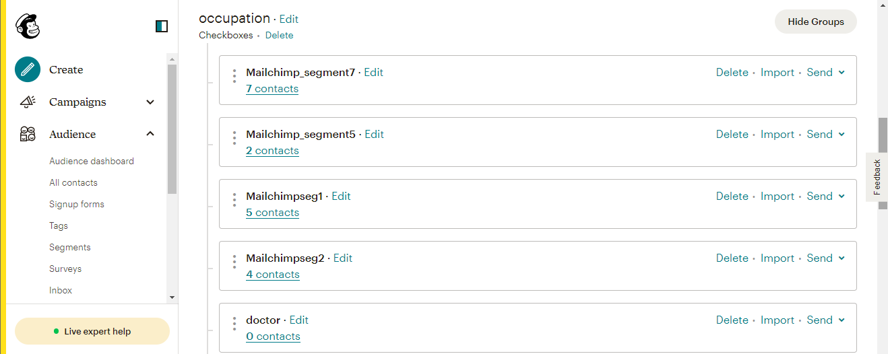

# [!DNL Mailchimp Interest Categories] anslutning

[[!DNL Mailchimp]](https://mailchimp.com) är en populär plattform för automatiserad marknadsföring och en e-postmarknadsföringstjänst som används av företag för att hantera och tala med kontakter *(kunder, kunder eller andra berörda parter)* med hjälp av e-postlistor och e-postmarknadsföringskampanjer. Använd den här kopplingen för att sortera dina kontakter baserat på deras intressen och önskemål.

[!DNL Mailchimp Interest Categories] använder [målgrupper](https://mailchimp.com/help/getting-started-audience/), [grupper](https://mailchimp.com/help/getting-started-with-groups/)och intressekategorier *(kallas även gruppnamn eller gruppnamn)*. Varje [!DNL Mailchimp] grupp är en lista över intressekategorier. Kontakter är kopplade till en intressekategori när de prenumererar på en eller flera intressekategorier via ett registreringsformulär på din webbplats. Inom en målgrupp kan du också ordna kontakterna i grupper och associera dem med intressekategorier, och dessa kan sedan användas för att skapa segment. Du kan använda dessa segment för att skicka riktade kampanjer via e-post till de prenumererade kontakterna.

<!--
Compared to [!DNL Mailchimp Tags] which you would use for internal classification, [!DNL Mailchimp Interest Categories] is meant to manage subscriptions to topics of interest that your contacts might be interested in. *Note, Experience Platform also has a connection for [!DNL Mailchimp Tags], you can check it out on the [[!DNL Mailchimp Tags]](/help/destinations/catalog/email-marketing/mailchimp-tags.md) page.*
-->

Detta [!DNL Adobe Experience Platform] [mål](/help/destinations/home.md) använder [[!DNL Mailchimp batch subscribe or unsubscribe API]](https://mailchimp.com/developer/marketing/api/lists/batch-subscribe-or-unsubscribe/) API att skapa [räntekategorier](https://mailchimp.com/developer/marketing/api/interest-categories/) och sedan lägga till kontakter från vart och ett av de valda plattformssegmenten i en motsvarande intressekategori. Du kan **lägg till nya kontakter** eller **uppdatera information om befintlig [!DNL Mailchimp] kontakter** sedan **lägga till eller ta bort dem från önskad grupp** inom en befintlig [!DNL Mailchimp] efter att ha aktiverat dem i ett nytt segment. [!DNL Mailchimp Interest Groups] använder de valda segmentnamnen från Platform som intressekategorier inom [!DNL Mailchimp].

## Användningsfall {#use-cases}

För att du bättre ska förstå hur och när du ska använda [!DNL Mailchimp Interest Categories] mål, här är ett exempel på användning som Adobe Experience Platform-kunder kan lösa genom att använda den här destinationen.

### Skicka e-post till kontakter för marknadsföringskampanjer {#use-case-send-emails}

Försäljningsavdelningen på en webbplats för sportartiklar vill sända en e-postbaserad marknadsföringskampanj till en lista över kontakter som själva har identifierats som intresserade av fotboll. Listorna över kontakter delas upp som grupper i dataexporten som tas emot från webbplatsens utvecklingsteam och måste därför spåras. Teamet identifierar en befintlig [!DNL Mailchimp] målgrupp och börjar bygga upp de Experience Platform-segment där kontakterna från varje lista läggs till. När dessa segment har skickats till [!DNL Mailchimp Interest Categories], om det inte finns några kontakter i det markerade [!DNL Mailchimp] målgrupp som de läggs till i en grupp med det segmentnamn som kontakten tillhör. Om det redan finns kontakter i [!DNL Mailchimp] målgrupp eller grupp, så uppdateras deras information. När data har skickats till [!DNL Mailchimp Interest Categories]kan säljarna välja och skicka marknadsföringskampanjer via e-post till fotbollsintressegruppen i [!DNL Mailchimp] målgrupp.

## Förutsättningar {#prerequisites}

I avsnitten nedan finns information om alla krav som du måste ställa in i Experience Platform och [!DNL Mailchimp] och för information som du måste samla in innan du arbetar med [!DNL Mailchimp Interest Categories] mål.

### Förutsättningar i Experience Platform {#prerequisites-in-experience-platform}

Innan du aktiverar data för [!DNL Mailchimp Interest Categories] mål, du måste ha en [schema](/help/xdm/schema/composition.md), a [datauppsättning](https://experienceleague.adobe.com/docs/platform-learn/tutorials/data-ingestion/create-datasets-and-ingest-data.html?lang=en)och [segment](https://experienceleague.adobe.com/docs/platform-learn/tutorials/segments/create-segments.html?lang=en) skapad i [!DNL Experience Platform].

### Krav för [!DNL Mailchimp Interest Categories] mål {#prerequisites-destination}

Observera följande krav för att kunna exportera data från Platform till [!DNL Mailchimp] konto:

#### Du måste ha en [!DNL Mailchimp] konto {#prerequisites-account}

Innan du kan skapa en [!DNL Mailchimp Interest Categories] mål måste du först se till att du har [!DNL Mailchimp] konto. Om du inte redan har en går du till [[!DNL Mailchimp] registreringssida](https://login.mailchimp.com/signup/) för att registrera och skapa ditt konto.

#### Samla [!DNL Mailchimp] API-nyckel {#gather-credentials}

Du behöver dina [!DNL Mailchimp] **API-nyckel** för att autentisera [!DNL Mailchimp Interest Categories] mål mot [!DNL Mailchimp] konto. The **API-nyckel** fungerar som **Lösenord** när du [autentisera målet](#authenticate).

Om du inte har **API-nyckel**, logga in på ditt konto och se [[!DNL Mailchimp] Generera API-nyckel](https://mailchimp.com/developer/marketing/guides/quick-start/#generate-your-api-key) dokumentation för att skapa en.

Ett exempel på en API-nyckel är `0123456789abcdef0123456789abcde-us14`.

>[!IMPORTANT]
>
>Om du genererar **API-nyckel**, skriv ned det eftersom du inte kommer åt det efter genereringen.

#### Identifiera [!DNL Mailchimp] datacenter {#identify-data-center}

Därefter måste du identifiera [!DNL Mailchimp] datacenter. Om du vill göra det loggar du in på [!DNL Mailchimp] och navigera till **Avsnittet API-nycklar** av ditt konto.

Värdet är den första delen av webbadressen som visas i webbläsaren. Om URL:en är *https://`us14`.mailchimp.com/account/api/*, blir datacentret `us14`.

Den läggs även till i din API-nyckel i formuläret *key-dc*; om API-nyckeln är `0123456789abcdef0123456789abcde-us14`, blir datacentret `us14`.

Skriv ned datacentervärdet *(`us14` i det här exemplet)* behöver du det här värdet när du [fylla i målinformation](#destination-details).

Om du behöver mer information, se [[!DNL Mailchimp] Grundläggande dokumentation](https://mailchimp.com/developer/marketing/docs/fundamentals/#api-structure).

### Guardrails {#guardrails}

Var och en av [!DNL Mailchimp] Målgrupper kan innehålla upp till 60 gruppnamn (eller intressekategorier) i en enda grupp eller i flera grupper inom samma målgrupp. Se [!DNL Mailchimp] [grupper](https://mailchimp.com/help/getting-started-with-groups/) eventuella förtydliganden. När du når den här gränsen får du en `400 BAD_REQUEST Cannot have more than 60 interests per list (Across all categories)` som ett felsvar från [!DNL Mailchimp] API.

Se även [!DNL Mailchimp] [hastighetsbegränsningar](https://mailchimp.com/developer/marketing/docs/fundamentals/#api-limits) Detaljerad information om de gränser som anges i [!DNL Mailchimp] API.

## Identiteter som stöds {#supported-identities}

[!DNL Mailchimp] stöder aktivering av identiteter som beskrivs i tabellen nedan. Läs mer om [identiteter](/help/identity-service/namespaces.md).

| Målidentitet | Beskrivning | Överväganden |
|---|---|---|
| E-post | E-postadress | Obligatoriskt |

{style="table-layout:auto"}

## Exportera typ och frekvens {#export-type-frequency}

Se tabellen nedan för information om exporttyp och frekvens för destinationen.

| Objekt | Typ | Anteckningar |
---------|----------|---------|
| Exporttyp | **[!UICONTROL Profile-based]** | <ul><li>Du exporterar alla medlemmar i ett segment tillsammans med de önskade schemafälten *(till exempel: e-postadress, telefonnummer, efternamn)*, enligt fältmappningen.</li><li> För varje markerat segment i plattformen visas motsvarande [!DNL Mailchimp Interest Categories] segmentets status uppdateras med dess segmentstatus från Platform.</li></ul> |
| Exportfrekvens | **[!UICONTROL Streaming]** | Direktuppspelningsmål är alltid på API-baserade anslutningar. När en profil uppdateras i Experience Platform baserat på segmentutvärdering, skickar kopplingen uppdateringen nedåt till målplattformen. Läs mer om [mål för direktuppspelning](/help/destinations/destination-types.md#streaming-destinations). |

{style="table-layout:auto"}

## Anslut till målet {#connect}

>[!IMPORTANT]
>
>Om du vill ansluta till målet behöver du **[!UICONTROL Manage Destinations]** [åtkomstkontrollbehörighet](/help/access-control/home.md#permissions). Läs [åtkomstkontroll - översikt](/help/access-control/ui/overview.md) eller kontakta produktadministratören för att få de behörigheter som krävs.

Om du vill ansluta till det här målet följer du stegen som beskrivs i [självstudiekurs om destinationskonfiguration](../../ui/connect-destination.md). I arbetsflödet för att konfigurera mål fyller du i fälten som listas i de två avsnitten nedan.

Inom **[!UICONTROL Destinations]** > **[!UICONTROL Catalog]**, sök efter [!DNL Mailchimp Interest Categories]. Du kan också hitta den under **[!UICONTROL Email marketing]** kategori.

### Autentisera till mål {#authenticate}

Om du vill autentisera mot målet fyller du i de obligatoriska fälten nedan och väljer **[!UICONTROL Connect to destination]**.

| Fält | Beskrivning |
| --- | --- |
| **[!UICONTROL Username]** | Dina [!DNL Mailchimp Interest Categories] användarnamn. |
| **[!UICONTROL Password]** | Dina [!DNL Mailchimp] **API-nyckel** som du hade noterat i [Samla [!DNL Mailchimp] autentiseringsuppgifter](#gather-credentials) -avsnitt.  Din API-nyckel har formen av `{KEY}-{DC}`, där `{KEY}` refererar till värdet som anges nedåt i [[!DNL Mailchimp] API-nyckel](#gather-credentials) och `{DC}` refererar till [[!DNL Mailchimp] datacenter](#identify-data-center).  Du kan antingen ange `{KEY}` eller hela formuläret.  Om API-nyckeln till exempel är  *`0123456789abcdef0123456789abcde-us14`*,  du kan ange antingen *`0123456789abcdef0123456789abcde`*eller *`0123456789abcdef0123456789abcde-us14`*som värdet. |

{style="table-layout:auto"}

Om den angivna informationen är giltig visas en **[!UICONTROL Connected]** status med grön bockmarkering. Du kan sedan gå vidare till nästa steg.

### Fyll i målinformation {#destination-details}

Om du vill konfigurera information för målet fyller du i de obligatoriska och valfria fälten nedan. En asterisk bredvid ett fält i användargränssnittet anger att fältet är obligatoriskt.

| Fält | Beskrivning |
| --- | --- |
| **[!UICONTROL Name]** | Ett namn som du känner igen det här målet med i framtiden. |
| **[!UICONTROL Description]** | En beskrivning som hjälper dig att identifiera det här målet i framtiden. |
| **[!UICONTROL Data center]** | Dina [!DNL Mailchimp] konto `data center`. Se [Identifiera [!DNL Mailchimp] datacenter](#identify-data-center) för vägledning. |
| **[!UICONTROL Audience Name (Please select Data center first)]** | När du har valt **[!UICONTROL Data center]** fylls den här listrutan automatiskt med målgruppsnamnen från [!DNL Mailchimp] konto. Välj den målgrupp som du vill uppdatera med data från Platform. |
| **[!UICONTROL Interest Category (Please select Data center and Audience Name first)]** | När du har valt **[!UICONTROL Audience Name]** fylls den här listrutan automatiskt med intressegruppkategorinamnen från [!DNL Mailchimp] konto. Välj det kategorinamn som du vill uppdatera med data från plattformen. |

{style="table-layout:auto"}

>[!TIP]
>
> Om API-nyckeln du angav i **[!UICONTROL Password]** fält eller **[!UICONTROL Data center]** värdet är felaktigt, gränssnittet visar ett [!DNL Mailchimp] API-felsvar: *`No options are available. Please verify the values selected for the following dependent fields: dataCenter`* enligt nedan. I det här fallet kan du inte välja ett värde från **[!UICONTROL Audience Name (Please select Data center first)]** fält. Åtgärda felet genom att ange rätt värden.

### Aktivera aviseringar {#enable-alerts}

Du kan aktivera varningar för att få meddelanden om dataflödets status till ditt mål. Välj en avisering i listan om du vill prenumerera och få meddelanden om status för ditt dataflöde. Mer information om varningar finns i guiden [prenumerera på destinationsvarningar med hjälp av användargränssnittet](../../ui/alerts.md).

När du är klar med informationen för målanslutningen väljer du **[!UICONTROL Next]**.

## Aktivera segment till den här destinationen {#activate}

>[!IMPORTANT]
>
>Om du vill aktivera data måste du ha **[!UICONTROL Manage Destinations]**, **[!UICONTROL Activate Destinations]**, **[!UICONTROL View Profiles]** och **[!UICONTROL View Segments]** [behörigheter för åtkomstkontroll](/help/access-control/home.md#permissions). Läs [åtkomstkontroll - översikt](/help/access-control/ui/overview.md) eller kontakta produktadministratören för att få de behörigheter som krävs.

Läs [Aktivera profiler och segment för att direktuppspela segmentexportmål](/help/destinations/ui/activate-segment-streaming-destinations.md) om du vill ha instruktioner om hur du aktiverar målgruppssegment till det här målet.

### Mappa överväganden och exempel {#mapping-considerations-example}

Så här skickar du målgruppsdata från Adobe Experience Platform till [!DNL Mailchimp Interest Categories] mål måste du gå igenom fältmappningssteget. Mappningen består av att skapa en länk mellan XDM-schemafälten (Experience Data Model) i ditt plattformskonto och motsvarande motsvarigheter från målmålet.

Koppla XDM-fälten till [!DNL Mailchimp Interest Categories] målfält, följ stegen nedan:

1. I **[!UICONTROL Mapping]** steg, välja **[!UICONTROL Add new mapping]**. Nu kan du se en ny mappningsrad på skärmen.
1. I **[!UICONTROL Select source field]** väljer du **[!UICONTROL Select attributes]** och välj XDM-attributet eller välj **[!UICONTROL Select identity namespace]** och välj en identitet.
1. I **[!UICONTROL Select target field]** väljer du **[!UICONTROL Select identity namespace]** och välj en identitet eller välj **[!UICONTROL Select attributes]** och välj i listan över attribut i [!DNL Mailchimp] API. *Alla anpassade attribut som du har lagt till i det markerade [!DNL Mailchimp] Målgruppen kan också väljas som målfält.*

   Tillgängliga mappningar mellan XDM-profilschemat och [!DNL Mailchimp Interest Categories] se nedan: | Källfält | Målfält | Anteckningar | | — | — | — | |`IdentityMap: Email`|`Identity: email`| Obligatoriskt: Ja | |`xdm: person.name.firstName`|`Attribute: FNAME`| | |`xdm: person.name.lastName`|`Attribute: LNAME`| | |`xdm: person.birthDayAndMonth`|`Attribute: BIRTHDAY`| |

   Dessutom `ADDRESS` är ett särskilt målfält som kallas `merge field` inom [!DNL Mailchimp] målgrupp. The [[!DNL Mailchimp] dokumentation](https://mailchimp.com/developer/marketing/docs/merge-fields/) definierar nödvändiga nycklar som `addr1`, `city`, `state`och `zip`och valfria tangenter `addr2` och `country`. Värdena för dessa fält måste vara strängar. Om något av `ADDRESS` fältkopplingar finns, målet skickar `ADDRESS` objekt till [!DNL Mailchimp] API för uppdatering. Alla `ADDRESS` fält som inte är mappade har standardvärdet `NULL` förutom det land som har standardvärdet `US`.

   Tillgängliga mappningar för `ADDRESS` anges nedan:

   | Källfält | Målfält |
   | --- | --- |
   | `xdm: workAddress.street1` | `Attribute: ADDRESS.addr1` |
   | `xdm: workAddress.street2` | `Attribute: ADDRESS.addr2` |
   | `xdm: workAddress.city` | `Attribute: ADDRESS.city` |
   | `xdm: workAddress.state` | `Attribute: ADDRESS.state` |
   | `xdm: workAddress.postalCode` | `Attribute: ADDRESS.zip` |
   | `xdm: workAddress.country` | `Attribute: ADDRESS.country` |

   Du vill till exempel uppdatera värdet för `country` med kontaktens befintliga adressfält `addr1`, `city`, `state`och `zip` värden som `132, My Street, Kingston`, `New York`, `New York` och `12401`. Så här uppdaterar du `country` du måste skicka de befintliga värdena med ändringar *(i förekommande fall)* och det nya värdet för landet. Värdena i datauppsättningen bör alltså vara `132, My Street, Kingston`, `New York`, `New York`, `12401`och `US`. Om du bara skickar `country` och anger inga värden för `addr1`, `city`, `state`och `zip` de skrivs över av `NULL`.

   Ett exempel med de slutförda mappningarna visas nedan:
   

När du har angett mappningarna för målanslutningen väljer du **[!UICONTROL Next]**.

## Validera dataexport {#exported-data}

Följ stegen nedan för att verifiera att du har konfigurerat målet korrekt:

* Logga in på [[!DNL Mailchimp]](https://login.mailchimp.com/) konto. Navigera sedan till **[!DNL Audience]** sida. Utöka sedan **[!DNL Manage Contacts]** meny och välj **[!DNL Groups]**.

* Markera gruppen och kontrollera om de valda segmenten skapas som kategorier med segmentnamnet från plattformen, som kan följas av ett automatiskt genererat suffix.
   * Det här målet använder de valda segmentens namn för att skapa intressekategorin med hjälp av [[!DNL Mailchimp] Lägg till API för räntekategori](https://mailchimp.com/developer/marketing/api/interest-categories/add-interest-category/). Om du skapar ett nytt mål och aktiverar samma segment igen [!DNL Mailchimp] lägger till ett suffix för att skilja mellan befintliga och nya segment.
* Kontakter vars e-postmeddelanden inte fanns i gruppen läggs till i kategorin som skapades nyligen.
* För kontakter som redan finns i gruppen uppdateras attributfältsdata och kontakten läggs till i den nyligen skapade kategorin.

## Dataanvändning och styrning {#data-usage-governance}

Alla [!DNL Adobe Experience Platform] destinationerna är kompatibla med dataanvändningsprinciper när data hanteras. Detaljerad information om hur [!DNL Adobe Experience Platform] använder datastyrning, se [Datastyrning - översikt](/help/data-governance/home.md).

## Fel och felsökning {#errors-and-troubleshooting}

### Fel påträffades om [!DNL Mailchimp] API-nyckeln eller datacentervärdena är felaktiga {#incorrect-credentials-error}

Om API-nyckeln du angav i **[!UICONTROL Password]** fält eller **[!UICONTROL Data center]** värdet är felaktigt, gränssnittet visar ett [!DNL Mailchimp] API-felsvar: *`No options are available. Please verify the values selected for the following dependent fields: dataCenter`* enligt nedan. I det här fallet kan du inte välja ett värde från **[!UICONTROL Audience Name (Please select Data center first)]** fält.

Du måste ange rätt värden för att kunna åtgärda felet och fortsätta till nästa steg. Se [Identifiera [!DNL Mailchimp] datacenter](#identify-data-center) och
[Samla [!DNL Mailchimp] API-nyckel](#gather-credentials) om du behöver vägledning.

### Fel påträffades om [!DNL Mailchimp] gruppnamnsgränsen har överskridits {#group-name-limits-error}

När du skapar målet kan du få följande felmeddelanden: *`Cannot have more than 60 interests per list (Across all categories)`* eller *`400 BAD_REQUEST`*. Detta inträffar när du överskrider de 60 gruppnamnen (eller intressekategorierna) i en enskild grupp eller i flera grupper inom samma målgruppsgräns, vilket beskrivs i [skyddsräcken](#guardrails) -avsnitt. Kontrollera att du inte överskrider gruppnamnsgränsen i [!DNL Mailchimp].

### [!DNL Mailchimp] Status- och felkoder

Se [[!DNL Mailchimp] felsida](https://mailchimp.com/developer/marketing/docs/errors/) om du vill ha en omfattande lista över status- och felkoder med förklaringar.

## Ytterligare resurser {#additional-resources}

Ytterligare användbar information från [!DNL Mailchimp] dokumentationen nedan:
* [Komma igång med [!DNL Mailchimp]](https://mailchimp.com/help/getting-started-with-mailchimp/)
* [Komma igång med målgrupper](https://mailchimp.com/help/getting-started-audience/)
* [Skapa en publik](https://mailchimp.com/help/create-audience/)
* [Komma igång med grupper](https://mailchimp.com/help/getting-started-with-groups/)
* [Skapa en ny målgruppsgrupp](https://mailchimp.com/help/create-new-audience-group/)
* [Räntekategorier](https://mailchimp.com/developer/marketing/api/interest-categories/)
* [Marknadsförings-API](https://mailchimp.com/developer/marketing/api/)
