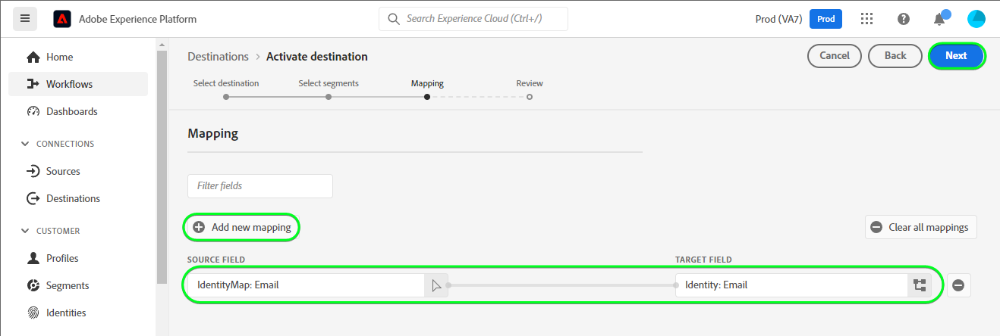

# [!DNL Mailchimp Tags] anslutning

[[!DNL Mailchimp]](https://mailchimp.com) *(kallas även [!DNL Intuit Mailchimp])* är en populär plattform för automatiserad marknadsföring och en e-postmarknadsföringstjänst som används av företag för att hantera och tala med kontakter *(kunder, kunder eller andra berörda parter)* med hjälp av e-postlistor och e-postkampanjer.

[!DNL Mailchimp Tags] använder [målgrupper](https://mailchimp.com/help/getting-started-audience/) och [taggar](https://mailchimp.com/help/getting-started-tags/) för att hantera din kontaktinformation. Taggar är etiketter som du kan använda för att ordna dina kontakter och märka dem för din interna kategorisering i [!DNL Mailchimp].

Jämfört med [!DNL Mailchimp Interest Categories] som du använder för att sortera dina kontakter baserat på deras intressen och önskemål, [!DNL Mailchimp Tags] är avsett att hantera prenumerationer på ämnen som dina kontakter kan vara intresserade av. *Observera att Experience Platform också har en anslutning för [!DNL Mailchimp Interest Categories]kan du checka ut den på [[!DNL Mailchimp Interest Categories]](/help/destinations/catalog/email-marketing/mailchimp-interest-categories.md) sida.*

Detta [!DNL Adobe Experience Platform] [mål](/help/destinations/home.md) utnyttjar [[!DNL Mailchimp batch subscribe or unsubscribe API]](https://mailchimp.com/developer/marketing/api/lists/batch-subscribe-or-unsubscribe/) slutpunkt. Du kan **lägg till nya kontakter** eller **uppdatera taggar för befintliga [!DNL Mailchimp] kontakter** inom en befintlig [!DNL Mailchimp] efter att ha aktiverat dem inom en ny publik. [!DNL Mailchimp Tags] använder de valda målgruppsnamnen från Platform som taggnamn i [!DNL Mailchimp].

## Användningsfall {#use-cases}

För att du bättre ska förstå hur och när du ska använda [!DNL Mailchimp Tags] mål, här är ett exempel på användning som Adobe Experience Platform-kunder kan lösa genom att använda den här destinationen.

### Skicka e-post till kontakter för marknadsföringskampanjer {#use-case-send-emails}

Försäljningsavdelningen i en organisation vill sända en e-postbaserad marknadsföringskampanj till en välstrukturerad lista med kontakter. Kontaktlistorna tas emot i grupper från olika offlinekällor och måste därför spåras. Teamet identifierar en befintlig [!DNL Mailchimp] målgruppen och börjar bygga upp de Experience Platform-målgrupper i vilka kontakterna från varje lista läggs till. När dessa målgrupper har skickats till [!DNL Mailchimp Tags], om det inte finns några kontakter i det markerade [!DNL Mailchimp] , läggs de till med en associerad tagg som innehåller det målgruppsnamn som kontakten tillhör. Om det redan finns kontakter i [!DNL Mailchimp] målgruppen läggs en ny tagg med målgruppens namn till. Som etiketterna visas i [!DNL Mailchimp] offlinekällorna är lätt att identifiera. När data har skickats till [!DNL Mailchimp] skickar de marknadsföringskampanjens e-post till målgruppen.

## Förhandskrav {#prerequisites}

I avsnitten nedan finns information om alla krav som du måste ställa in i Experience Platform och [!DNL Mailchimp] och för information som du behöver samla in innan du arbetar med [!DNL Mailchimp Tags] mål.

### Förutsättningar i Experience Platform {#prerequisites-in-experience-platform}

Innan du aktiverar data för [!DNL Mailchimp Tags] mål, du måste ha [schema](/help/xdm/schema/composition.md), a [datauppsättning](https://experienceleague.adobe.com/docs/platform-learn/tutorials/data-ingestion/create-datasets-and-ingest-data.html?lang=en)och [målgrupper](https://experienceleague.adobe.com/docs/platform-learn/tutorials/audiences/create-audiences.html) som [!DNL Experience Platform].

### Krav för [!DNL Mailchimp Tags] mål {#prerequisites-destination}

Observera följande krav för att kunna exportera data från Platform till [!DNL Mailchimp Tags] konto:

#### Du måste ha en [!DNL Mailchimp] konto {#prerequisites-account}

Innan du kan skapa en [!DNL Mailchimp Tags] mål måste du först se till att du har [!DNL Mailchimp] konto. Om du inte redan har ett besök [[!DNL Mailchimp] registreringssida](https://login.mailchimp.com/signup/) för att registrera och skapa ditt konto.

#### Samla [!DNL Mailchimp] API-nyckel {#gather-credentials}

Du behöver dina [!DNL Mailchimp] **API-nyckel** autentisera [!DNL Mailchimp Interest Categories] mål mot [!DNL Mailchimp] konto. The **API-nyckel** fungerar som **Lösenord** när du [autentisera målet](#authenticate).

Om du inte har **API-nyckel**, logga in på [!DNL Mailchimp] konto och referera till [!DNL Mailchimp] dokumentation om [hur du genererar API-nyckeln](https://mailchimp.com/developer/marketing/guides/quick-start/#generate-your-api-key).

Ett exempel på en API-nyckel är `0123456789abcdef0123456789abcde-us14`.

>[!IMPORTANT]
>
>Om du genererar **API-nyckel**, skriv ned det eftersom du inte kommer åt det efter genereringen.

#### Identifiera [!DNL Mailchimp] datacenter {#identify-data-center}

Därefter måste du identifiera [!DNL Mailchimp] datacenter. Om du vill göra det loggar du in på [!DNL Mailchimp] och navigera till **API-nycklar** av ditt konto.

Datacenter-ID är det första avsnittet i URL:en som du ser i webbläsaren. Om URL:en är *https://`us14`.mailchimp.com/account/api/*, blir datacentret `us14`.

Datacenter-ID:t läggs också till i din API-nyckel i formuläret *key-dc*; Om din API-nyckel till exempel är `0123456789abcdef0123456789abcde-us14`, blir datacentret `us14`.

Skriv ned datacentervärdet *(`us14` i det här exemplet)*. Du behöver det här värdet när du [fylla i målinformationen](#destination-details).

Om du behöver mer information, se [[!DNL Mailchimp] Grundläggande dokumentation](https://mailchimp.com/developer/marketing/docs/fundamentals/#api-structure).

### Guardrails {#guardrails}

Se [!DNL Mailchimp] [hastighetsbegränsningar](https://mailchimp.com/developer/marketing/docs/fundamentals/#api-limits) Detaljerad information om de gränser som anges i [!DNL Mailchimp] API.

## Identiteter som stöds {#supported-identities}

[!DNL Mailchimp] stöder aktivering av identiteter som beskrivs i tabellen nedan. Läs mer om [identiteter](/help/identity-service/features/namespaces.md).

| Målidentitet | Beskrivning | Överväganden |
|---|---|---|
| E-post | Kontaktens e-postadress. | Obligatoriskt |

{style="table-layout:auto"}

## Målgrupper {#supported-audiences}

I det här avsnittet beskrivs vilken typ av målgrupper du kan exportera till det här målet.

| Målgruppsursprung | Stöds | Beskrivning |
|---------|----------|----------|
| [!DNL Segmentation Service] | ✓ | Målgrupper som skapats genom Experience Platform [Segmenteringstjänst](../../../segmentation/home.md). |
| Anpassade överföringar | ✓ | Målgrupper [importerad](../../../segmentation/ui/audience-portal.md#import-audience) till Experience Platform från CSV-filer. |

{style="table-layout:auto"}

## Exportera typ och frekvens {#export-type-frequency}

Se tabellen nedan för information om exporttyp och frekvens för destinationen.

| Objekt | Typ | Anteckningar |
---------|----------|---------|
| Exporttyp | **[!UICONTROL Profile-based]** | <ul><li>Du exporterar alla medlemmar i en målgrupp tillsammans med de önskade schemafälten *(t.ex. e-postadress, telefonnummer, efternamn)*, enligt fältmappningen.</li><li> För varje publik som valts i Platform [!DNL Mailchimp Tags] segmentets status uppdateras med målgruppsstatus från Platform.</li></ul> |
| Exportfrekvens | **[!UICONTROL Streaming]** | Direktuppspelningsmål är alltid på API-baserade anslutningar. Så snart en profil uppdateras i Experience Platform baserat på målgruppsutvärdering skickar anslutningsprogrammet uppdateringen nedströms till målplattformen. Läs mer om [mål för direktuppspelning](/help/destinations/destination-types.md#streaming-destinations). |

{style="table-layout:auto"}

## Anslut till målet {#connect}

>[!IMPORTANT]
>
>Om du vill ansluta till målet behöver du **[!UICONTROL Manage Destinations]** [behörighet för åtkomstkontroll](/help/access-control/home.md#permissions). Läs [åtkomstkontroll - översikt](/help/access-control/ui/overview.md) eller kontakta produktadministratören för att få de behörigheter som krävs.

Om du vill ansluta till det här målet följer du stegen som beskrivs i [självstudiekurs om destinationskonfiguration](../../ui/connect-destination.md). I arbetsflödet för att konfigurera mål fyller du i fälten som listas i de två avsnitten nedan.

Inom **[!UICONTROL Destinations]** > **[!UICONTROL Catalog]**, sök efter [!DNL Mailchimp Tags]. Du kan även hitta den under **[!UICONTROL Email marketing]** kategori.

### Autentisera till mål {#authenticate}

Om du vill autentisera mot målet fyller du i de obligatoriska fälten nedan och väljer **[!UICONTROL Connect to destination]**.

| Fält | Beskrivning |
| --- | --- |
| **[!UICONTROL Username]** | Dina [!DNL Mailchimp] användarnamn. |
| **[!UICONTROL Password]** | Dina [!DNL Mailchimp] **API-nyckel** som du hade noterat i [Samla [!DNL Mailchimp] autentiseringsuppgifter](#gather-credentials) -avsnitt.  Din API-nyckel har formen av `{KEY}-{DC}`, där `{KEY}` refererar till värdet som anges nedåt i [[!DNL Mailchimp] API-nyckel](#gather-credentials) -avsnittet och `{DC}` refererar till [[!DNL Mailchimp] datacenter](#identify-data-center).  Du kan antingen ange `{KEY}` eller hela formuläret.  Om API-nyckeln till exempel är  *`0123456789abcdef0123456789abcde-us14`*,  du kan ange antingen *`0123456789abcdef0123456789abcde`*eller *`0123456789abcdef0123456789abcde-us14`*som värdet. |

{style="table-layout:auto"}

Om den angivna informationen är giltig visas en **[!UICONTROL Connected]** status med en grön bockmarkering. Du kan sedan gå vidare till nästa steg.

### Fyll i målinformation {#destination-details}

Om du vill konfigurera information för målet fyller du i de obligatoriska och valfria fälten nedan. En asterisk bredvid ett fält i användargränssnittet anger att fältet är obligatoriskt.

| Fält | Beskrivning |
| --- | --- |
| **[!UICONTROL Name]** | Ett namn som du känner igen det här målet med i framtiden. |
| **[!UICONTROL Description]** | En beskrivning som hjälper dig att identifiera det här målet i framtiden. |
| **[!UICONTROL Data center]** | Dina [!DNL Mailchimp] konto `data center`. Se [Identifiera [!DNL Mailchimp] datacenter](#identify-data-center) för vägledning. |
| **[!UICONTROL Audience Name (Please enter Data center first)]** | När du har angett **[!UICONTROL Data center]** fylls den här listrutan automatiskt med målgruppsnamnen från [!DNL Mailchimp] konto. Välj den målgrupp som du vill uppdatera med data från Platform. |

{style="table-layout:auto"}

### Aktivera aviseringar {#enable-alerts}

Du kan aktivera varningar för att få meddelanden om dataflödets status till ditt mål. Välj en avisering i listan om du vill prenumerera och få meddelanden om statusen för ditt dataflöde. Mer information om varningar finns i guiden på [prenumerera på destinationsvarningar med användargränssnittet](../../ui/alerts.md).

När du är klar med informationen för målanslutningen väljer du **[!UICONTROL Next]**.

## Aktivera målgrupper till det här målet {#activate}

>[!IMPORTANT]
> 
>* För att aktivera data behöver du **[!UICONTROL View Destinations]**, **[!UICONTROL Activate Destinations]**, **[!UICONTROL View Profiles]** och **[!UICONTROL View Segments]** [behörigheter för åtkomstkontroll](/help/access-control/home.md#permissions). Läs [åtkomstkontroll - översikt](/help/access-control/ui/overview.md) eller kontakta produktadministratören för att få de behörigheter som krävs.
>* Exportera *identiteter* behöver du **[!UICONTROL View Identity Graph]** [behörighet för åtkomstkontroll](/help/access-control/home.md#permissions).   {width="100" zoomable="yes"}

Läs [Aktivera målgrupper för direktuppspelningsmål](/help/destinations/ui/activate-segment-streaming-destinations.md) för instruktioner om hur du aktiverar målgrupper till det här målet.

### Mappa överväganden och exempel {#mapping-considerations-example}

Så här skickar du målgruppsdata från Adobe Experience Platform till [!DNL Mailchimp Tags] mål måste du gå igenom fältmappningssteget. Mappningen består av att skapa en länk mellan XDM-schemafälten (Experience Data Model) i ditt plattformskonto och motsvarande motsvarigheter från målmålet.

Mappa XDM-fälten korrekt till [!DNL Mailchimp Tags] målfält, följ stegen nedan:

1. I **[!UICONTROL Mapping]** steg, välja **[!UICONTROL Add new mapping]**. En ny mappningsrad visas på skärmen.
1. I **[!UICONTROL Select source field]** fönster, välja **[!UICONTROL Select identity namespace]** och väljer `Email` identity namespace.

   

1. I **[!UICONTROL Select target field]** fönster, välja **[!UICONTROL Select identity namespace]** och väljer `Email` identity namespace.

   

   Mappningarna mellan XDM-profilschemat och [!DNL Mailchimp Tags] kommer att vara som nedan: | Source Field | Målfält | Obligatoriskt | | — | — | — | |`IdentityMap: Email`|`Identity: Email`| Ja |

   Ett exempel med de slutförda mappningarna visas nedan:
   

När du har angett mappningarna för målanslutningen väljer du **[!UICONTROL Next]**.

## Validera dataexport {#exported-data}

Följ stegen nedan för att verifiera att du har konfigurerat målet korrekt:

1. Logga in på [[!DNL Mailchimp]](https://login.mailchimp.com/) konto. Navigera sedan till **[!DNL Audience]** > **[!DNL All Contacts]** och kontrollera om kontakterna från målgruppen har lagts till och om kontakterna inom målgruppen har uppdaterats med målgruppens namn.
   

## Dataanvändning och styrning {#data-usage-governance}

Alla [!DNL Adobe Experience Platform] destinationerna är kompatibla med dataanvändningsprinciper när data hanteras. Detaljerad information om hur [!DNL Adobe Experience Platform] använder datastyrning, se [Datastyrning - översikt](/help/data-governance/home.md).

## Fel och felsökning {#errors-and-troubleshooting}

Se [[!DNL Mailchimp] felsida](https://mailchimp.com/developer/marketing/docs/errors/) om du vill ha en omfattande lista över status- och felkoder med förklaringar.

## Ytterligare resurser {#additional-resources}

Ytterligare användbar information från [!DNL Mailchimp] dokumentationen nedan:
* [Komma igång med [!DNL Mailchimp]](https://mailchimp.com/help/getting-started-with-mailchimp/)
* [Komma igång med målgrupper](https://mailchimp.com/help/getting-started-audience/)
* [Skapa en publik](https://mailchimp.com/help/create-audience/)
* [Komma igång med taggar](https://mailchimp.com/help/getting-started-tags/)
* [Marknadsförings-API](https://mailchimp.com/developer/marketing/api/)
